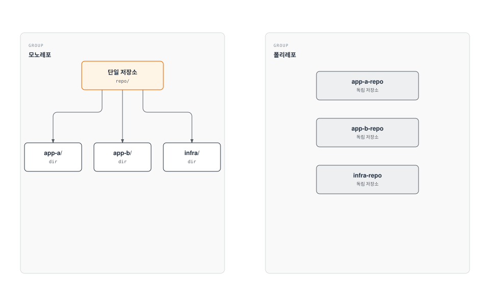
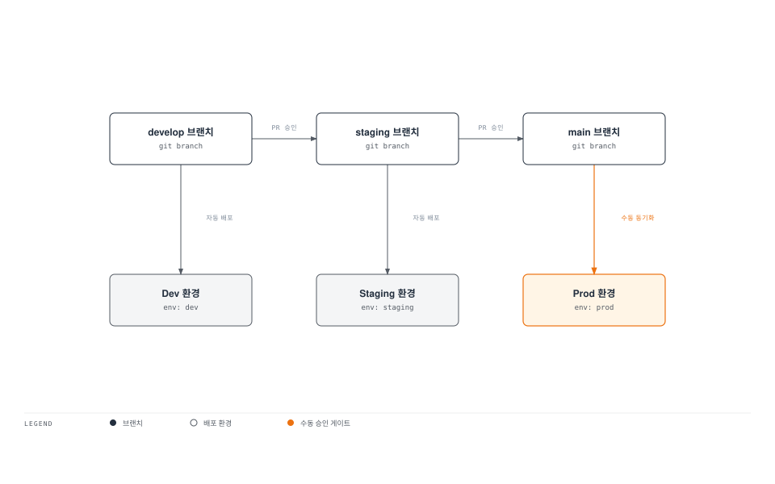

# ArgoCD 모범 사례

> **지원 버전**: ArgoCD v2.9+
> **마지막 업데이트**: 2026년 2월 22일

## 목차

- [저장소 구조](#저장소-구조)
- [환경 승격 전략](#환경-승격-전략)
- [리소스 관리](#리소스-관리)
- [성능 최적화](#성능-최적화)
- [재해 복구](#재해-복구)
- [업그레이드 전략](#업그레이드-전략)
- [문제 해결](#문제-해결)
- [EKS 모범 사례](#eks-모범-사례)
- [프로덕션 체크리스트](#프로덕션-체크리스트)

## 저장소 구조

### 모노레포 vs 폴리레포



| 방식 | 장점 | 단점 |
|------|------|------|
| **모노레포** | 단일 PR로 여러 앱 변경, 일관성 | 권한 관리 복잡, 저장소 크기 증가 |
| **폴리레포** | 팀별 독립성, 세분화된 권한 | 크로스 앱 변경 어려움 |

### 권장 디렉토리 구조

**App of Apps 패턴:**

```
gitops-repo/
├── apps/                           # ArgoCD Applications
│   ├── root-app.yaml              # Root Application
│   └── children/
│       ├── frontend.yaml
│       ├── backend.yaml
│       └── platform.yaml
├── base/                           # 공통 베이스
│   ├── frontend/
│   │   ├── deployment.yaml
│   │   ├── service.yaml
│   │   └── kustomization.yaml
│   ├── backend/
│   │   └── ...
│   └── platform/
│       └── ...
├── overlays/                       # 환경별 오버레이
│   ├── dev/
│   │   ├── frontend/
│   │   │   ├── kustomization.yaml
│   │   │   └── patches/
│   │   └── backend/
│   ├── staging/
│   │   └── ...
│   └── prod/
│       └── ...
├── helm-values/                    # Helm values 파일
│   ├── dev/
│   ├── staging/
│   └── prod/
└── projects/                       # AppProject 정의
    ├── development.yaml
    ├── staging.yaml
    └── production.yaml
```

**환경별 분리 구조:**

```
gitops-repo/
├── environments/
│   ├── dev/
│   │   ├── apps/
│   │   │   ├── frontend/
│   │   │   └── backend/
│   │   └── argocd/
│   │       └── applications.yaml
│   ├── staging/
│   │   └── ...
│   └── prod/
│       └── ...
├── charts/                         # 내부 Helm 차트
│   ├── frontend/
│   └── backend/
└── lib/                            # 공유 라이브러리
    ├── kustomize/
    └── jsonnet/
```

### Kustomize 모범 사례

```yaml
# base/kustomization.yaml
apiVersion: kustomize.config.k8s.io/v1beta1
kind: Kustomization

resources:
  - deployment.yaml
  - service.yaml
  - configmap.yaml

commonLabels:
  app.kubernetes.io/managed-by: argocd

images:
  - name: my-app
    newName: my-registry/my-app
---
# overlays/prod/kustomization.yaml
apiVersion: kustomize.config.k8s.io/v1beta1
kind: Kustomization

resources:
  - ../../base

namespace: production

namePrefix: prod-

commonLabels:
  environment: production

replicas:
  - name: my-app
    count: 5

images:
  - name: my-app
    newTag: v1.2.3

patches:
  - path: patches/resource-limits.yaml
  - path: patches/hpa.yaml
```

## 환경 승격 전략

### Git 브랜치 기반 승격



**Application 설정:**

```yaml
# Dev - develop 브랜치 자동 동기화
apiVersion: argoproj.io/v1alpha1
kind: Application
metadata:
  name: my-app-dev
spec:
  source:
    repoURL: https://github.com/myorg/gitops.git
    targetRevision: develop
    path: overlays/dev
  syncPolicy:
    automated:
      prune: true
      selfHeal: true
---
# Staging - staging 브랜치
apiVersion: argoproj.io/v1alpha1
kind: Application
metadata:
  name: my-app-staging
spec:
  source:
    repoURL: https://github.com/myorg/gitops.git
    targetRevision: staging
    path: overlays/staging
  syncPolicy:
    automated:
      prune: true
      selfHeal: true
---
# Prod - main 브랜치 수동 동기화
apiVersion: argoproj.io/v1alpha1
kind: Application
metadata:
  name: my-app-prod
spec:
  source:
    repoURL: https://github.com/myorg/gitops.git
    targetRevision: main
    path: overlays/prod
  syncPolicy:
    syncOptions:
      - CreateNamespace=true
    # automated 없음 = 수동 동기화
```

### 이미지 태그 기반 승격

```yaml
# overlays/dev/kustomization.yaml
images:
  - name: my-app
    newTag: dev-latest  # 항상 최신 dev 빌드

# overlays/staging/kustomization.yaml
images:
  - name: my-app
    newTag: v1.2.3-rc1  # Release Candidate

# overlays/prod/kustomization.yaml
images:
  - name: my-app
    newTag: v1.2.3  # 안정 버전
```

### 자동화된 승격 파이프라인

```yaml
# GitHub Actions 예시
name: Promote to Production

on:
  workflow_dispatch:
    inputs:
      version:
        description: 'Version to promote'
        required: true

jobs:
  promote:
    runs-on: ubuntu-latest
    steps:
      - uses: actions/checkout@v4

      - name: Update production image tag
        run: |
          cd overlays/prod
          kustomize edit set image my-app=my-registry/my-app:${{ inputs.version }}

      - name: Create PR
        uses: peter-evans/create-pull-request@v5
        with:
          title: "Promote ${{ inputs.version }} to production"
          branch: promote-${{ inputs.version }}
          commit-message: "Promote ${{ inputs.version }} to production"
```

## 리소스 관리

### ArgoCD 컴포넌트 리소스

```yaml
# API Server
apiVersion: apps/v1
kind: Deployment
metadata:
  name: argocd-server
spec:
  template:
    spec:
      containers:
        - name: argocd-server
          resources:
            requests:
              cpu: 100m
              memory: 256Mi
            limits:
              cpu: 500m
              memory: 512Mi
---
# Application Controller
apiVersion: apps/v1
kind: StatefulSet
metadata:
  name: argocd-application-controller
spec:
  template:
    spec:
      containers:
        - name: argocd-application-controller
          resources:
            requests:
              cpu: 500m
              memory: 1Gi
            limits:
              cpu: 2000m
              memory: 4Gi
          env:
            # 동시 처리 수 조정
            - name: ARGOCD_CONTROLLER_OPERATION_PROCESSORS
              value: "25"
            - name: ARGOCD_CONTROLLER_STATUS_PROCESSORS
              value: "50"
---
# Repo Server
apiVersion: apps/v1
kind: Deployment
metadata:
  name: argocd-repo-server
spec:
  template:
    spec:
      containers:
        - name: argocd-repo-server
          resources:
            requests:
              cpu: 200m
              memory: 512Mi
            limits:
              cpu: 1000m
              memory: 2Gi
          env:
            - name: ARGOCD_REPO_SERVER_PARALLELISM_LIMIT
              value: "50"
```

### 리소스 권장 사항

| 규모 | Applications | Controller CPU | Controller Memory | Repo Server Replicas |
|------|--------------|----------------|-------------------|---------------------|
| Small | < 50 | 500m | 1Gi | 1 |
| Medium | 50-200 | 1000m | 2Gi | 2 |
| Large | 200-500 | 2000m | 4Gi | 3 |
| XLarge | > 500 | 4000m | 8Gi | 5+ (샤딩 권장) |

## 성능 최적화

### 컨트롤러 샤딩

대규모 환경에서 Application Controller를 샤딩합니다:

```yaml
apiVersion: v1
kind: ConfigMap
metadata:
  name: argocd-cmd-params-cm
  namespace: argocd
data:
  # 라운드 로빈 샤딩
  controller.sharding.algorithm: round-robin
---
apiVersion: apps/v1
kind: StatefulSet
metadata:
  name: argocd-application-controller
spec:
  replicas: 3
  template:
    spec:
      containers:
        - name: argocd-application-controller
          env:
            - name: ARGOCD_CONTROLLER_REPLICAS
              value: "3"
```

### 저장소 서버 최적화

```yaml
apiVersion: v1
kind: ConfigMap
metadata:
  name: argocd-cmd-params-cm
  namespace: argocd
data:
  # 캐시 설정
  reposerver.parallelism.limit: "50"

  # Git 요청 타임아웃
  timeout.reconciliation: "180s"
  timeout.hard.reconciliation: "0"
```

### 동기화 빈도 조정

```yaml
apiVersion: v1
kind: ConfigMap
metadata:
  name: argocd-cm
  namespace: argocd
data:
  # 자동 동기화 간격 (기본: 3분)
  timeout.reconciliation: "300s"

  # 상태 새로고침 간격
  application.resource.tracking.method: annotation
```

### 대규모 Application 분할

```yaml
# 큰 애플리케이션을 여러 개로 분할
# 대신 App of Apps 사용
apiVersion: argoproj.io/v1alpha1
kind: Application
metadata:
  name: my-large-app-config
spec:
  source:
    path: config  # ConfigMaps, Secrets
---
apiVersion: argoproj.io/v1alpha1
kind: Application
metadata:
  name: my-large-app-deployments
spec:
  source:
    path: deployments  # Deployments, Services
---
apiVersion: argoproj.io/v1alpha1
kind: Application
metadata:
  name: my-large-app-networking
spec:
  source:
    path: networking  # Ingress, NetworkPolicies
```

## 재해 복구

### ArgoCD 백업

```bash
# Application 백업
kubectl get applications -n argocd -o yaml > applications-backup.yaml

# AppProject 백업
kubectl get appprojects -n argocd -o yaml > projects-backup.yaml

# Secret 백업 (저장소 자격 증명)
kubectl get secrets -n argocd -l argocd.argoproj.io/secret-type=repository -o yaml > repo-secrets-backup.yaml

# ConfigMap 백업
kubectl get configmaps -n argocd -o yaml > configmaps-backup.yaml
```

### Velero를 사용한 백업

```yaml
apiVersion: velero.io/v1
kind: Schedule
metadata:
  name: argocd-backup
  namespace: velero
spec:
  schedule: "0 2 * * *"  # 매일 02:00
  template:
    includedNamespaces:
      - argocd
    includedResources:
      - applications.argoproj.io
      - appprojects.argoproj.io
      - secrets
      - configmaps
    labelSelector:
      matchExpressions:
        - key: app.kubernetes.io/part-of
          operator: In
          values:
            - argocd
    storageLocation: aws-s3
    ttl: 720h  # 30일 보관
```

### 복구 절차

```bash
# 1. ArgoCD 재설치
kubectl create namespace argocd
kubectl apply -n argocd -f https://raw.githubusercontent.com/argoproj/argo-cd/stable/manifests/install.yaml

# 2. 설정 복구
kubectl apply -f configmaps-backup.yaml
kubectl apply -f repo-secrets-backup.yaml

# 3. 프로젝트 복구
kubectl apply -f projects-backup.yaml

# 4. Application 복구
kubectl apply -f applications-backup.yaml

# 5. 동기화 트리거
argocd app sync --all
```

## 업그레이드 전략

### 업그레이드 전 체크리스트

1. **릴리스 노트 확인**: Breaking changes, 새 기능
2. **백업 생성**: 모든 리소스 백업
3. **호환성 확인**: Kubernetes 버전, Helm 버전
4. **테스트 환경에서 검증**: 비프로덕션에서 먼저 테스트

### Rolling 업그레이드

```bash
# 1. 현재 버전 확인
argocd version

# 2. 새 버전 매니페스트 적용
kubectl apply -n argocd -f https://raw.githubusercontent.com/argoproj/argo-cd/v2.13.0/manifests/install.yaml

# 3. 롤아웃 상태 확인
kubectl rollout status deployment/argocd-server -n argocd
kubectl rollout status deployment/argocd-repo-server -n argocd
kubectl rollout status statefulset/argocd-application-controller -n argocd

# 4. 버전 확인
argocd version
```

### Helm 업그레이드

```bash
# 저장소 업데이트
helm repo update

# 업그레이드 (dry-run)
helm upgrade argocd argo/argo-cd \
  --namespace argocd \
  -f values.yaml \
  --dry-run

# 업그레이드 실행
helm upgrade argocd argo/argo-cd \
  --namespace argocd \
  -f values.yaml
```

## 문제 해결

### 일반적인 문제

**1. 동기화 실패:**

```bash
# 상태 확인
argocd app get my-app

# 차이점 확인
argocd app diff my-app

# 상세 로그
kubectl logs -n argocd -l app.kubernetes.io/name=argocd-application-controller --tail=100

# 강제 동기화
argocd app sync my-app --force
```

**2. OutOfMemory (OOM):**

```bash
# 메모리 사용량 확인
kubectl top pods -n argocd

# 리소스 제한 증가
kubectl patch deployment argocd-repo-server -n argocd --type='json' \
  -p='[{"op": "replace", "path": "/spec/template/spec/containers/0/resources/limits/memory", "value": "4Gi"}]'
```

**3. 느린 동기화:**

```bash
# 대기 중인 동기화 확인
argocd app list --output wide

# 저장소 서버 캐시 정리
kubectl delete pods -n argocd -l app.kubernetes.io/name=argocd-repo-server
```

**4. 웹훅 문제:**

```bash
# 웹훅 로그 확인
kubectl logs -n argocd -l app.kubernetes.io/name=argocd-server --tail=100 | grep webhook

# 웹훅 재설정
argocd repo update https://github.com/myorg/myrepo --repo-cache-expiration 0s
```

### 디버깅 명령어 치트시트

```bash
# Application 상태
argocd app get <app-name>
argocd app history <app-name>
argocd app resources <app-name>

# 차이점 분석
argocd app diff <app-name>
argocd app diff <app-name> --refresh

# 로그
kubectl logs -n argocd deployment/argocd-server
kubectl logs -n argocd deployment/argocd-repo-server
kubectl logs -n argocd statefulset/argocd-application-controller

# 리소스 사용량
kubectl top pods -n argocd
kubectl describe pod -n argocd -l app.kubernetes.io/name=argocd-application-controller

# Redis 상태
kubectl exec -it -n argocd $(kubectl get pods -n argocd -l app.kubernetes.io/name=argocd-redis -o name) -- redis-cli info

# API 서버 헬스
curl -k https://localhost:8080/healthz

# 매니페스트 생성 테스트
argocd app manifests <app-name>
```

## EKS 모범 사례

### IRSA 설정

```yaml
# ServiceAccount with IRSA
apiVersion: v1
kind: ServiceAccount
metadata:
  name: argocd-application-controller
  namespace: argocd
  annotations:
    eks.amazonaws.com/role-arn: arn:aws:iam::123456789012:role/ArgoCD-Controller
---
apiVersion: v1
kind: ServiceAccount
metadata:
  name: argocd-server
  namespace: argocd
  annotations:
    eks.amazonaws.com/role-arn: arn:aws:iam::123456789012:role/ArgoCD-Server
```

### ALB Ingress 구성

```yaml
apiVersion: networking.k8s.io/v1
kind: Ingress
metadata:
  name: argocd
  namespace: argocd
  annotations:
    kubernetes.io/ingress.class: alb
    alb.ingress.kubernetes.io/scheme: internet-facing
    alb.ingress.kubernetes.io/target-type: ip
    alb.ingress.kubernetes.io/backend-protocol: HTTPS
    alb.ingress.kubernetes.io/healthcheck-path: /healthz
    alb.ingress.kubernetes.io/healthcheck-protocol: HTTPS
    alb.ingress.kubernetes.io/listen-ports: '[{"HTTPS":443}]'
    alb.ingress.kubernetes.io/ssl-redirect: '443'
    alb.ingress.kubernetes.io/certificate-arn: arn:aws:acm:ap-northeast-2:123456789012:certificate/xxx
    # WAF 연동
    alb.ingress.kubernetes.io/wafv2-acl-arn: arn:aws:wafv2:ap-northeast-2:123456789012:regional/webacl/argocd/xxx
    # 액세스 로그
    alb.ingress.kubernetes.io/load-balancer-attributes: access_logs.s3.enabled=true,access_logs.s3.bucket=my-alb-logs
spec:
  rules:
    - host: argocd.example.com
      http:
        paths:
          - path: /
            pathType: Prefix
            backend:
              service:
                name: argocd-server
                port:
                  number: 443
```

### 클러스터 업그레이드 시 고려사항

```bash
# 1. ArgoCD 호환성 확인
# https://argo-cd.readthedocs.io/en/stable/operator-manual/installation/#supported-versions

# 2. 자동 동기화 일시 중지
argocd app set <app-name> --sync-policy none

# 3. EKS 클러스터 업그레이드
eksctl upgrade cluster --name my-cluster --version 1.29

# 4. ArgoCD 버전 업그레이드 (필요 시)
kubectl apply -n argocd -f https://raw.githubusercontent.com/argoproj/argo-cd/stable/manifests/install.yaml

# 5. 자동 동기화 재활성화
argocd app set <app-name> --sync-policy automated
```

## 프로덕션 체크리스트

### 설치 및 구성

- [ ] HA 모드로 설치
- [ ] 적절한 리소스 요청/제한 설정
- [ ] PodDisruptionBudget 구성
- [ ] Redis HA 구성 (대규모 환경)

### 보안

- [ ] SSO 통합 (admin 계정 비활성화)
- [ ] TLS 설정 (cert-manager 또는 ACM)
- [ ] NetworkPolicy 적용
- [ ] RBAC 정책 구성
- [ ] 시크릿 관리 솔루션 통합

### 운영

- [ ] 백업 자동화 구성
- [ ] 모니터링 설정 (Prometheus/Grafana)
- [ ] 알림 구성 (Slack/PagerDuty)
- [ ] 감사 로깅 활성화
- [ ] 업그레이드 프로세스 문서화

### GitOps 워크플로우

- [ ] 저장소 구조 표준화
- [ ] 환경 승격 프로세스 정의
- [ ] 코드 리뷰 프로세스 구축
- [ ] CI/CD 파이프라인 통합
- [ ] 롤백 프로세스 테스트

### 성능

- [ ] Application 수에 맞는 리소스 할당
- [ ] 컨트롤러 샤딩 (500+ Applications)
- [ ] 동기화 간격 최적화
- [ ] 대규모 Application 분할

### 재해 복구

- [ ] 백업 일정 설정
- [ ] 복구 절차 문서화
- [ ] DR 테스트 수행
- [ ] 멀티 리전 고려 (필요 시)

## 다음 단계

이 가이드의 모범 사례를 적용하여 안정적이고 확장 가능한 ArgoCD 환경을 구축하세요.

1. **[프로젝트와 RBAC](06-projects-rbac.md)**: 멀티테넌시 환경을 구성하세요.

2. **[보안](07-security.md)**: 보안 설정을 강화하세요.

3. **[알림](08-notifications.md)**: 운영 알림을 구성하세요.

## 참고 자료

- [ArgoCD 운영자 매뉴얼](https://argo-cd.readthedocs.io/en/stable/operator-manual/)
- [ArgoCD 모범 사례](https://argo-cd.readthedocs.io/en/stable/operator-manual/best_practices/)
- [대규모 ArgoCD](https://argo-cd.readthedocs.io/en/stable/operator-manual/high_availability/)
- [ArgoCD 보안](https://argo-cd.readthedocs.io/en/stable/operator-manual/security/)

## 퀴즈

이 장에서 배운 내용을 테스트하려면 [모범 사례 퀴즈](../../quizzes/gitops/argocd/09-best-practices-quiz.md)를 풀어보세요.
