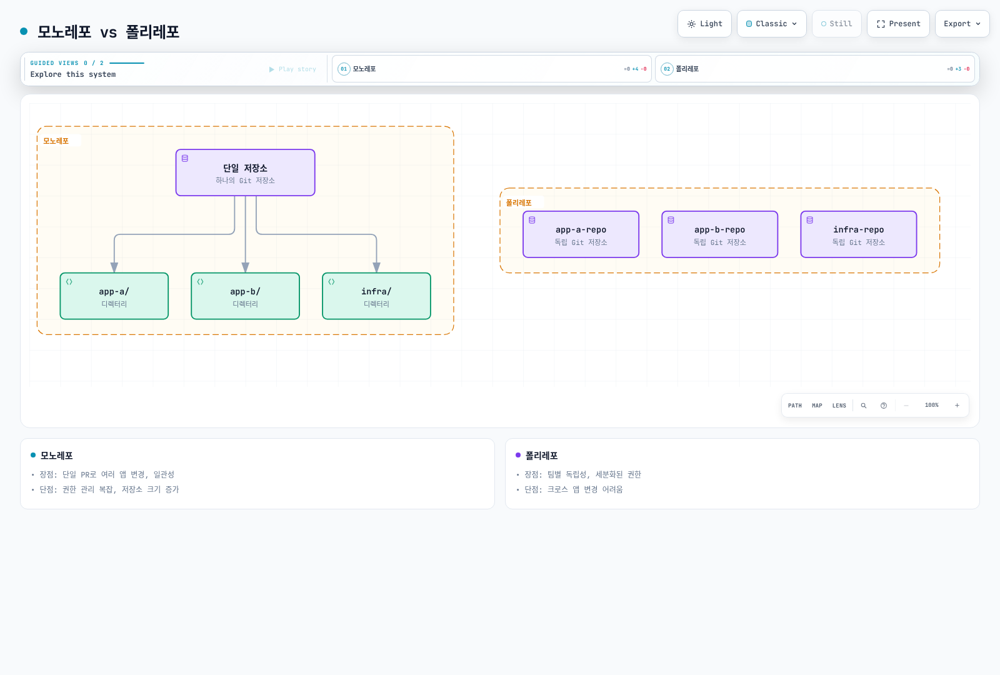
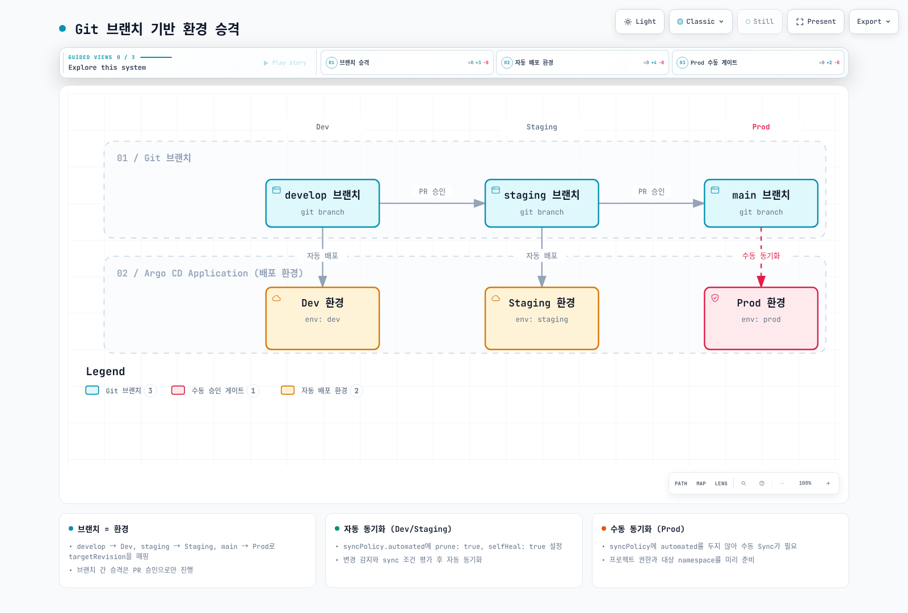

# ArgoCD 모범 사례

> **지원 버전**: Argo CD 3.5.2 / Helm Chart 10.8.4 / Kustomize 5.8.1
> **마지막 업데이트**: 2026년 9월 11일

## 목차

- [저장소 구조](#저장소-구조)
- [환경 승격 전략](#환경-승격-전략)
- [리소스 관리](#리소스-관리)
- [성능 최적화](#성능-최적화)
- [재해 복구](#재해-복구)
- [업그레이드 전략](#업그레이드-전략)
- [문제 해결](#문제-해결)
- [EKS 모범 사례](#eks-모범-사례)
- [프로덕션 체크리스트](#프로덕션-체크리스트)

## 저장소 구조

### 모노레포 vs 폴리레포



[🔍 인터랙티브 다이어그램 보기](https://www.atomai.click/kubernetes-docs/archmaps/ko-gitops-argocd-09-best-practices-0.html)

| 방식 | 장점 | 단점 |
|------|------|------|
| **모노레포** | 단일 PR로 여러 앱 변경, 일관성 | 권한 관리 복잡, 저장소 크기 증가 |
| **폴리레포** | 팀별 독립성, 세분화된 권한 | 크로스 앱 변경 어려움 |

### 권장 디렉토리 구조

**App of Apps 패턴:**

```
gitops-repo/
├── apps/                           # ArgoCD Applications
│   ├── root-app.yaml              # Root Application
│   └── children/
│       ├── frontend.yaml
│       ├── backend.yaml
│       └── platform.yaml
├── base/                           # 공통 베이스
│   ├── frontend/
│   │   ├── deployment.yaml
│   │   ├── service.yaml
│   │   └── kustomization.yaml
│   ├── backend/
│   │   └── ...
│   └── platform/
│       └── ...
├── overlays/                       # 환경별 오버레이
│   ├── dev/
│   │   ├── frontend/
│   │   │   ├── kustomization.yaml
│   │   │   └── patches/
│   │   └── backend/
│   ├── staging/
│   │   └── ...
│   └── prod/
│       └── ...
├── helm-values/                    # Helm values 파일
│   ├── dev/
│   ├── staging/
│   └── prod/
└── projects/                       # AppProject 정의
    ├── development.yaml
    ├── staging.yaml
    └── production.yaml
```

**환경별 분리 구조:**

```
gitops-repo/
├── environments/
│   ├── dev/
│   │   ├── apps/
│   │   │   ├── frontend/
│   │   │   └── backend/
│   │   └── argocd/
│   │       └── applications.yaml
│   ├── staging/
│   │   └── ...
│   └── prod/
│       └── ...
├── charts/                         # 내부 Helm 차트
│   ├── frontend/
│   └── backend/
└── lib/                            # 공유 라이브러리
    ├── kustomize/
    └── jsonnet/
```

### Kustomize 모범 사례

```yaml
# base/kustomization.yaml
apiVersion: kustomize.config.k8s.io/v1beta1
kind: Kustomization

resources:
  - deployment.yaml
  - service.yaml
  - configmap.yaml

labels:
  - pairs:
      app.kubernetes.io/managed-by: argocd
    includeSelectors: false

---
# overlays/prod/kustomization.yaml
apiVersion: kustomize.config.k8s.io/v1beta1
kind: Kustomization

resources:
  - ../../base

namespace: production

namePrefix: prod-

labels:
  - pairs:
      environment: production
    includeSelectors: false

replicas:
  - name: my-app
    count: 5

images:
  - name: my-app
    newName: my-registry/my-app
    newTag: v1.2.3

patches:
  - path: patches/resource-limits.yaml

```

위 예제는 애플리케이션 저장소에 실제 base 리소스와 patch 파일이 있다는 전제입니다. `labels`로 selector를 바꾸지 않도록 했습니다. HPA를 새로 생성하려면 `resources`에 HPA manifest를 추가하고 Git의 고정 `replicas` 설정을 제거합니다. 존재하지 않는 HPA를 patch만으로 생성할 수는 없습니다. base의 컨테이너 이미지 이름은 `my-app`이라는 전제이며 이름/태그 변환은 overlay에서 함께 합니다. base에서 먼저 이름을 바꾸면 이전 이름을 찾는 overlay가 태그를 갱신하지 못할 수 있습니다.

## 환경 승격 전략

### Git 브랜치 기반 승격



[🔍 인터랙티브 다이어그램 보기](https://www.atomai.click/kubernetes-docs/archmaps/ko-gitops-argocd-09-best-practices-1.html)

**Application 설정:**

`workloads` AppProject가 아래 저장소·대상 namespace를 허용하고 대상 namespace는 미리 준비되어 있어야 합니다. 브랜치 전략은 하나의 선택지입니다. 여러 환경 디렉터리를 같은 main에서 PR로 승격하면 장기 브랜치 간 차이를 줄일 수 있습니다. App of Apps는 관리자 기능이며 하위 Application 생성 권한과 저장소 쓰기 권한을 제한합니다.

```yaml
apiVersion: argoproj.io/v1alpha1
kind: Application
metadata:
  name: my-app-dev
  namespace: argocd
spec:
  project: workloads
  source:
    repoURL: https://github.com/myorg/gitops.git
    targetRevision: develop
    path: overlays/dev
  destination:
    server: https://kubernetes.default.svc
    namespace: my-app-dev
  syncPolicy:
    automated:
      enabled: true
      prune: true
      selfHeal: true
---
apiVersion: argoproj.io/v1alpha1
kind: Application
metadata:
  name: my-app-staging
  namespace: argocd
spec:
  project: workloads
  source:
    repoURL: https://github.com/myorg/gitops.git
    targetRevision: staging
    path: overlays/staging
  destination:
    server: https://kubernetes.default.svc
    namespace: my-app-staging
  syncPolicy:
    automated:
      enabled: true
      prune: true
      selfHeal: true
---
apiVersion: argoproj.io/v1alpha1
kind: Application
metadata:
  name: my-app-prod
  namespace: argocd
spec:
  project: workloads
  source:
    repoURL: https://github.com/myorg/gitops.git
    targetRevision: main
    path: overlays/prod
  destination:
    server: https://kubernetes.default.svc
    namespace: my-app-prod
```

### 이미지 태그 기반 승격

동일한 검증된 이미지를 환경 간 재사용합니다. registry가 태그 불변성을 보장하지 않으면 digest를 고정합니다. `dev-latest` 같은 태그의 내용만 교체해도 Git manifest나 Deployment Pod template이 자동으로 변경되는 것은 아닙니다.

```yaml
# overlays/dev/kustomization.yaml의 images 조각
images:
  - name: my-app
    newName: my-registry/my-app
    newTag: v1.2.3
---
# overlays/staging/kustomization.yaml의 images 조각
images:
  - name: my-app
    newName: my-registry/my-app
    newTag: v1.2.3
---
# overlays/prod/kustomization.yaml의 images 조각
images:
  - name: my-app
    newName: my-registry/my-app
    newTag: v1.2.3
```

### 자동화된 승격 파이프라인

이 워크플로는 **이미 테스트한 digest**를 입력받아 PR만 만듭니다. registry/overlay 경로는 예시이며 실제 저장소에 맞춥니다. 한글 예제의 `overlays/prod`를 사용한다면 아래 두 `overlays/production` 경로도 함께 바꿉니다. `GITOPS_PR_TOKEN`은 대상 저장소의 contents/pull requests 쓰기 권한을 가진 GitHub App 토큰 또는 제한된 토큰으로 준비합니다. 기본 GITHUB_TOKEN으로 만든 변경은 후속 workflow 트리거가 제한되므로 required checks 실행 경로를 확인합니다. 승인·테스트·서명/정책 검증은 저장소의 branch protection/ruleset에서 강제해야 합니다.

```yaml
name: Promote tested image to production
on:
  workflow_dispatch:
    inputs:
      digest:
        description: 'Tested image digest (sha256: followed by 64 hex characters)'
        required: true
        type: string
permissions:
  contents: read
concurrency:
  group: promote-production
  cancel-in-progress: false
jobs:
  promote:
    runs-on: ubuntu-24.04
    steps:
      - uses: actions/checkout@3d3c42e5aac5ba805825da76410c181273ba90b1 # v7.0.1
        with:
          persist-credentials: false
      - name: Install verified Kustomize
        shell: bash
        run: |
          set -euo pipefail
          tool_dir="$RUNNER_TEMP/kustomize-bin"
          mkdir -p "$tool_dir"
          cd "$tool_dir"
          curl -fsSL -o kustomize.tar.gz \
            https://github.com/kubernetes-sigs/kustomize/releases/download/kustomize/v5.8.1/kustomize_v5.8.1_linux_amd64.tar.gz
          echo "029a7f0f4e1932c52a0476cf02a0fd855c0bb85694b82c338fc648dcb53a819d  kustomize.tar.gz" | sha256sum -c -
          tar -xzf kustomize.tar.gz kustomize
          echo "$tool_dir" >> "$GITHUB_PATH"
      - name: Update production overlay
        env:
          IMAGE_DIGEST: ${{ inputs.digest }}
        shell: bash
        run: |
          set -euo pipefail
          [[ "$IMAGE_DIGEST" =~ ^sha256:[a-f0-9]{64}$ ]] || exit 1
          cd overlays/production
          kustomize edit set image "my-app=my-registry/my-app@${IMAGE_DIGEST}"
          kustomize build . > /dev/null
      - name: Create reviewed promotion PR
        uses: peter-evans/create-pull-request@5f6978faf089d4d20b00c7766989d076bb2fc7f1 # v8.1.1
        with:
          token: ${{ secrets.GITOPS_PR_TOKEN }}
          branch: promote-production
          title: 'Promote tested image to production'
          commit-message: 'chore: promote tested image digest'
          add-paths: overlays/production/kustomization.yaml
          body: |
            Promote the already tested image digest: ${{ inputs.digest }}
            Require the repository's validation and approval checks before merging.
```

## 리소스 관리

### 컴포넌트 리소스

다음은 Chart 10.8.4용 **측정 시작값**이며 보장된 sizing 표가 아닙니다. 기존 values에 병합하고 하나의 관리 경로로 배포합니다. chart가 실제 컨테이너 이름과 workload 유형을 결정하므로 불완전한 Deployment patch로 새 컨테이너를 추가하지 않습니다.

```yaml
fullnameOverride: argocd
controller:
  replicas: 1
  resources:
    requests:
      cpu: 500m
      memory: 1Gi
    limits:
      cpu: '2'
      memory: 4Gi
server:
  replicas: 2
  resources:
    requests:
      cpu: 100m
      memory: 256Mi
    limits:
      cpu: 500m
      memory: 512Mi
repoServer:
  replicas: 2
  resources:
    requests:
      cpu: 200m
      memory: 512Mi
    limits:
      cpu: '1'
      memory: 2Gi
```

| 측정값 | 조정 방향 |
|---|---|
| manifest 생성 시간·동시 요청·repo 크기 | repo-server CPU/메모리, parallelism, 디스크 |
| 클러스터별 리소스 수·watch/cache 메모리 | controller 메모리, 클러스터 분산 |
| reconciliation/sync 큐 대기·API throttling | processor 수와 대상 API 용량을 함께 검토 |
| CPU throttling·OOM·Pod 재시작 | requests/limits와 동시 실행 수를 함께 조정 |

Application 개수만으로 100/500개부터 샤딩이 필요하다고 정할 수 없습니다. Redis는 재생성 가능한 캐시지만 장애 시 재계산 부하와 지연은 측정해야 합니다. HA 구성은 [설치 장](01-installation.md#고가용성-설정)의 노드/anti-affinity/PDB 전제까지 함께 적용합니다. 모든 컴포넌트를 무조건 여러 개 복제하지 않습니다.

### 선택적 repo-server HPA

Metrics Server와 CPU requests가 필요합니다. HPA를 선택하면 replica 수는 HPA가 관리합니다. CPU 기반 확장은 manifest 생성 병목 전체를 설명하지 않으며 메모리 캐시 사용량만으로 확장하면 불필요한 복제가 지속될 수 있습니다.

```yaml
repoServer:
  autoscaling:
    enabled: true
    minReplicas: 2
    maxReplicas: 5
    targetCPUUtilizationPercentage: 70
    targetMemoryUtilizationPercentage: null
    behavior:
      scaleDown:
        stabilizationWindowSeconds: 300
```

## 성능 최적화

### 설정 위치와 의미

아래도 기존 Helm values에 병합합니다. `configs.params`는 `argocd-cmd-params-cm`, `configs.cm`은 `argocd-cm`을 생성합니다. 명령행/환경 변수로 읽는 값은 해당 controller/repo-server/server rollout이 필요하며 실제 렌더링된 Pod와 로그에서 적용 여부를 확인합니다.

```yaml
configs:
  params:
    controller.status.processors: '20'
    controller.operation.processors: '10'
    controller.repo.server.timeout.seconds: '180'
    server.repo.server.timeout.seconds: '180'
    reposerver.parallelism.limit: '2'
    reposerver.repo.cache.expiration: 24h
    reposerver.git.request.timeout: 30s
    reposerver.git.lsremote.parallelism.limit: '5'
  cm:
    timeout.reconciliation: 300s
    timeout.reconciliation.jitter: 60s
    application.resourceTrackingMethod: annotation
repoServer:
  env:
  - name: ARGOCD_EXEC_TIMEOUT
    value: 2m
```

- `status/operation.processors`는 동시 처리 수이며 주기 설정이 아닙니다. 위 20/10은 기본 동시 처리 수입니다.
- repo-server RPC timeout(180초), 도구 실행 timeout(2분), Git 요청 timeout(30초)은 다른 제한입니다. 무조건 늘리기 전에 느린 단계와 취소 동작을 확인합니다.
- `reposerver.parallelism.limit`는 캐시 TTL이 아니라 동시 manifest 생성 제한입니다. 메모리·프로세스 한도와 함께 부하 시험합니다.
- 기본 periodic reconciliation은 120초 + 최대 60초 jitter입니다. 예제의 300초 + 60초는 5–6분이며 Git webhook 등 다른 refresh 원인은 별개입니다.
- `application.resourceTrackingMethod`는 리소스 추적 방식입니다. 새로고침 간격이 아닙니다. 기존 tracking 방식의 변경은 마이그레이션 영향을 확인합니다.

### 여러 대상 클러스터의 샤딩

기본 샤딩 단위는 대상 **클러스터**입니다. 한 클러스터의 많은 Application이 replica 수만 늘린다고 고르게 분산되는 것은 아닙니다. 아래 Chart 값은 StatefulSet replicas와 `ARGOCD_CONTROLLER_REPLICAS`를 함께 설정합니다. `round-robin`/`consistent-hashing`과 dynamic cluster distribution은 이 버전에서 실험적이므로 일반 운영 기본값처럼 적용하지 않습니다.

```yaml
controller:
  replicas: 3
configs:
  params:
    controller.sharding.algorithm: legacy
```

### Application 경계와 HPA

큰 Application은 소유권·수명주기가 분리되는 경계로 나눕니다. 임의로 리소스 종류별로 쪼개면 Secret/Service/Deployment 의존성과 삭제 순서가 복잡해집니다. App of Apps의 child Application들이 하나의 원자적 배포가 되는 것은 아닙니다.

다음 예제는 `workloads` 프로젝트·namespace·HPA가 이미 있고, HPA가 `my-app` Deployment의 replicas를 관리하는 경우입니다. Git에서 replicas를 생략하는 것이 우선이며, 필요한 경우 차이/적용 무시를 해당 리소스에만 제한합니다. `ignoreDifferences.name`은 Kustomize prefix/suffix까지 적용된 최종 이름에 맞춥니다. `ApplyOutOfSyncOnly`는 apply 대상 최적화이며 sync 주기 변경이 아닙니다.

```yaml
apiVersion: argoproj.io/v1alpha1
kind: Application
metadata:
  name: large-app
  namespace: argocd
spec:
  project: workloads
  source:
    repoURL: https://github.com/myorg/gitops.git
    targetRevision: main
    path: overlays/production
  destination:
    server: https://kubernetes.default.svc
    namespace: my-app-production
  syncPolicy:
    automated:
      enabled: true
      prune: true
      selfHeal: true
    syncOptions:
    - ApplyOutOfSyncOnly=true
    - RespectIgnoreDifferences=true
  ignoreDifferences:
  - group: apps
    kind: Deployment
    name: my-app
    namespace: my-app-production
    jsonPointers:
    - /spec/replicas
```

## 재해 복구

### 백업 범위

`argocd admin export`는 Application/AppProject/ApplicationSet, 핵심 ConfigMap 4종과 선택된 Argo CD Secret을 내보냅니다. **전체 namespace 백업이 아닙니다.** `argocd-cmd-params-cm`, Notifications/CMP 설정, 별도 TLS/알림 Secret 등이 자동으로 모두 포함된다고 가정하지 않습니다. Application/Set의 추가 namespace 설정도 확인합니다.

동일 버전 CLI, 확인된 kubecontext, `age` 도구와 조직의 공개 수신자 키를 준비합니다. 개인키는 백업과 별도로 보관하고 복호화/복구를 정기적으로 시험합니다. 아래 보완 snapshot은 namespace의 모든 ConfigMap/Secret을 암호화하므로 Helm release Secret까지 포함할 수 있습니다. 복구 시 필요한 객체를 선별하며 이 snapshot 전체를 그대로 apply하지 않습니다.

```bash
#!/usr/bin/env bash
set -euo pipefail
umask 077
: "${ARGO_BACKUP_RECIPIENT:?Set the approved age public recipient}"
ARGO_BACKUP_DIR="./argocd-backup-$(date -u +%Y%m%dT%H%M%SZ)"
mkdir -m 700 "$ARGO_BACKUP_DIR"
kubectl config current-context
kubectl get configmap argocd-cm -n argocd -o name

argocd admin export -n argocd |
  age --recipient "$ARGO_BACKUP_RECIPIENT" --output "$ARGO_BACKUP_DIR/data.yaml.age.tmp"
mv "$ARGO_BACKUP_DIR/data.yaml.age.tmp" "$ARGO_BACKUP_DIR/data.yaml.age"

# Supplement: all namespace ConfigMaps/Secrets, including custom configuration.
kubectl get configmaps,secrets -n argocd -o yaml |
  age --recipient "$ARGO_BACKUP_RECIPIENT" --output "$ARGO_BACKUP_DIR/namespace-config.yaml.age.tmp"
mv "$ARGO_BACKUP_DIR/namespace-config.yaml.age.tmp" "$ARGO_BACKUP_DIR/namespace-config.yaml.age"
```

별도로 버전 고정된 설치 manifest/Helm values, CRD와 확장 컨트롤러, 외부 Secret/KMS·SSO·DNS·인증서 복구 절차를 보관합니다. 애플리케이션 데이터베이스/PV 백업은 Argo CD 구성 백업과 별도입니다. 백업 주기·보존 기간은 RPO/RTO와 접근 정책으로 정합니다.

### Velero 구성 백업 대안

이미 설치된 Velero와 사용 가능한 `aws-s3` BackupStorageLocation을 전제로 하는 Schedule입니다. 적용 시간대와 암호화·접근 제어를 확인합니다. 사용자 Application에 없는 `app.kubernetes.io/part-of` 레이블로 필터링하면 백업에서 빠질 수 있어 해당 필터를 제거했습니다. CRD/설치 리소스/PV 복구를 포함하는 전체 DR 작업은 별도입니다.

```yaml
apiVersion: velero.io/v1
kind: Schedule
metadata:
  name: argocd-config-backup
  namespace: velero
spec:
  schedule: 0 2 * * *
  template:
    includedNamespaces:
    - argocd
    includedResources:
    - applications.argoproj.io
    - applicationsets.argoproj.io
    - appprojects.argoproj.io
    - secrets
    - configmaps
    includeClusterResources: false
    storageLocation: aws-s3
    ttl: 720h0m0s
```

### 단계적 복구

먼저 기존과 같은 버전/방식으로 **격리된 복구용 Argo CD**를 준비합니다. 원본과 복구본이 같은 워크로드를 동시에 수정하지 않도록 단일 관리 주체를 정합니다. 기본 StatefulSet 구성에서는 아래처럼 Application 및 ApplicationSet controller를 멈춘 상태로 import 계획을 확인할 수 있습니다. dynamic distribution이면 실제 Deployment 유형에 맞게 조정합니다.

```bash
set -euo pipefail
umask 077
: "${ARGO_BACKUP_FILE:?Set the encrypted data.yaml.age path}"
: "${ARGO_BACKUP_IDENTITY:?Set the protected age identity file}"

# Fresh, isolated recovery installation: default StatefulSet controller layout.
kubectl config current-context
kubectl scale statefulset/argocd-application-controller -n argocd --replicas=0
kubectl scale deployment/argocd-applicationset-controller -n argocd --replicas=0

ARGO_RESTORE_DIR="$(mktemp -d)"
trap 'rm -rf "$ARGO_RESTORE_DIR"' EXIT
age --decrypt --identity "$ARGO_BACKUP_IDENTITY" "$ARGO_BACKUP_FILE" \
  > "$ARGO_RESTORE_DIR/data.yaml"
argocd admin import -n argocd --dry-run "$ARGO_RESTORE_DIR/data.yaml"
# Keep controllers stopped while reviewing the recovery copy and destinations.
```

계획을 확인한 뒤 같은 shell의 보호된 복구 파일을 검토합니다. 대상 cluster/namespace, repository/cluster 자격 증명, 삭제 finalizer, 자동 sync 정책 및 저장된 `operation`을 확인합니다. 자동 sync를 보류하려면 Application과 ApplicationSet template의 정책을 함께 바꾸고 진행 중 operation을 제거한 복구 사본을 사용합니다. 기존 controller를 재개하기 전에 Helm/Git 원본이 이 보류 설정을 되돌리는지도 확인합니다.

```bash
argocd admin import -n argocd "$ARGO_RESTORE_DIR/data.yaml"
```

필요한 보완 ConfigMap/Secret과 외부 의존성을 복구하고, 검토된 설치 값의 replica 수로 controller를 재개합니다. 대표 Application의 diff/health를 확인한 후 개별적으로 배포를 재개합니다. 전체 앱 강제 sync, import `--prune`, namespace 삭제는 기본 복구 절차에 넣지 않습니다.

## 업그레이드 전략

### 버전과 설치 주체

아래는 3.5.x patch 수준에서 3.5.2로 가는 예시입니다. 2.x/이전 minor에서 바로 안전하게 전환된다는 뜻이 아닙니다. 지나가는 모든 minor/major migration note, 지원 Kubernetes 조합, CRD·RBAC·SSO·CMP 변경을 검토하고 비프로덕션에서 검증합니다. manifest/Helm/GitOps 중 기존 관리 방식을 유지하며 EKS 관리형 Argo CD capability에 이 절차를 겹치지 않습니다.

```bash
# Example: reviewed 3.5.x patch upgrade to 3.5.2, manifest-managed non-HA install.
kubectl config current-context
argocd version
kubectl apply --server-side -n argocd \
  -f https://raw.githubusercontent.com/argoproj/argo-cd/v3.5.2/manifests/install.yaml
kubectl rollout status deployment/argocd-server -n argocd --timeout=5m
kubectl rollout status deployment/argocd-repo-server -n argocd --timeout=5m
kubectl rollout status statefulset/argocd-application-controller -n argocd --timeout=5m
kubectl rollout status deployment/argocd-applicationset-controller -n argocd --timeout=5m
kubectl rollout status deployment/argocd-notifications-controller -n argocd --timeout=5m
argocd version
argocd app list
```

HA manifest 설치는 `manifests/ha/install.yaml`을 사용하고, 사용자 overlay는 고정한 base를 갱신해 렌더링합니다. CRD 크기 때문에 server-side apply를 사용합니다. field ownership 충돌을 먼저 검토하며, 공식 업그레이드 안내의 `--force-conflicts`는 의도한 ownership 이전에만 사용합니다. Pod rollout 성공만으로 migration·SSO·diff·동기화 검증이 완료되지는 않습니다.

### Helm 설치의 대안 절차

```bash
helm repo add argo https://argoproj.github.io/argo-helm
helm repo update argo
helm upgrade argocd argo/argo-cd --version 10.8.4 \
  --namespace argocd -f reviewed-values.yaml --dry-run=server --hide-secret
# After reviewing the dry run and the version-specific migration notes:
helm upgrade argocd argo/argo-cd --version 10.8.4 \
  --namespace argocd -f reviewed-values.yaml --wait --timeout 10m
```

`--hide-secret`은 dry-run 출력의 Secret 노출을 줄입니다. 민감한 값이 다른 리소스에 들어 있지 않은지도 확인합니다. CRD/저장 데이터/외부 연동 변경은 단순 이미지 rollback만으로 복구되지 않을 수 있으므로 검증된 백업과 복구 계획을 함께 준비합니다.

### 병행 검증의 제약

같은 클러스터의 다른 namespace는 CRD와 일부 cluster-scoped 리소스를 공유합니다. namespace만 바꾸어 설치하면 ClusterRoleBinding 대상도 자동 변경되지 않습니다. Kubernetes에는 `kubectl rename namespace` 명령이 없습니다. 별도 클러스터에서 새 버전을 검증하고, 자격 증명·tracking/instance ID·활성 controller·트래픽을 명시적으로 전환하는 방식을 설계합니다. namespace 삭제로 이전 설치를 정리하면 Application finalizer를 통한 워크로드 삭제가 발생할 수 있습니다.

## 문제 해결

### Sync와 차이 확인

```bash
argocd app get my-app
argocd app diff my-app
argocd app history my-app
argocd app resources my-app
kubectl describe application my-app -n argocd
kubectl logs -n argocd -l app.kubernetes.io/name=argocd-application-controller --tail=100

# Re-check desired state after identifying the cause; this does not apply resources.
argocd app get my-app --refresh
# Invalidates the cached target manifests for this Application; use sparingly.
argocd app get my-app --hard-refresh
```

`--force`는 일반적인 오류 해결 옵션이 아니며 리소스 재생성을 유발할 수 있습니다. hard refresh도 apply/rollback은 아니지만 manifest 재생성 부하가 있으므로 모든 앱에 반복하지 않습니다.

### 저장소와 Webhook

```bash
argocd repo list
argocd repo get https://github.com/myorg/myrepo.git
kubectl logs -n argocd deployment/argocd-repo-server --tail=100
kubectl get secrets -n argocd -l argocd.argoproj.io/secret-type=repository
kubectl logs -n argocd deployment/argocd-server --tail=100 | grep -i webhook
```

TLS/SSH 신뢰, 자격 증명 범위, DNS·egress, provider webhook 서명·URL·이벤트 delivery 기록을 확인합니다. 저장소 목록의 Secret 값을 출력할 필요는 없습니다. `argocd repo update --repo-cache-expiration`은 올바른 cache 설정 명령이 아닙니다.

### OOM과 느린 처리

```bash
kubectl top pods -n argocd
kubectl get pods -n argocd
kubectl describe pods -n argocd -l app.kubernetes.io/name=argocd-repo-server
argocd app get my-app -o json |
  jq '.status.operationState | {phase, startedAt, finishedAt}'
```

종료 원인이 OOMKilled인지, CPU throttling·repo clone 디스크·manifest 크기·Git timeout·API throttling이 원인인지 구분합니다. 위 Helm values에서 리소스/동시 실행 수를 조정하고 Git/Helm 경로로 배포합니다. repo-server Pod 전체 삭제는 Redis의 manifest cache를 지우는 방법이 아니며 일시적 처리 중단과 clone 부하를 만듭니다.

### 추가 확인 명령

```bash
argocd app manifests my-app
argocd app list -o wide
argocd cluster list
argocd cluster get https://my-target-cluster.example.com
kubectl logs -n argocd statefulset/argocd-application-controller --tail=100
kubectl logs -n argocd deployment/argocd-server --tail=100
kubectl logs -n argocd deployment/argocd-repo-server --tail=100
```

manifest 출력에는 생성된 Secret이 포함될 수 있으므로 공유 로그에 남기지 않습니다. 기본 controller는 StatefulSet이며 dynamic distribution 구성에서는 실제 Deployment를 조회합니다. 임시 debug logging은 필요한 컴포넌트에 한정하고 rollout/해제 절차를 함께 관리합니다.

## EKS 모범 사례

### AWS 자격 증명

ServiceAccount에 role ARN 하나를 적는 것으로 대상 EKS 접근이 완성되지는 않습니다. controller/server의 EKS 인증, 대상 role assume 권한, EKS access entry 또는 기존 인증 매핑, Kubernetes RBAC를 함께 구성합니다. repo-server는 S3/OCI/CMP 등 실제 AWS 접근이 필요할 때만 별도 최소 권한 역할을 줍니다. IRSA OIDC trust 또는 Pod Identity association도 필요하며, Pod 이미지 pull 권한과 동일시하지 않습니다. [설치 장의 EKS 통합](01-installation.md#amazon-eks-통합)을 기준으로 실제 대상과 서비스 계정을 맞춥니다.

### 내부 ALB와 HTTPS

AWS Load Balancer Controller, 해당 VPC에서의 관리자 접근, 올바른 DNS/ACM 인증서, 제한된 보안 그룹, SSO가 선행 조건입니다. 인증서 ARN과 hostname을 교체합니다. `server.insecure=false`의 HTTPS backend이며 단일 HTTP target group을 쓰는 CLI는 `--grpc-web`으로 접근합니다.

```yaml
apiVersion: networking.k8s.io/v1
kind: Ingress
metadata:
  name: argocd
  namespace: argocd
  annotations:
    alb.ingress.kubernetes.io/scheme: internal
    alb.ingress.kubernetes.io/target-type: ip
    alb.ingress.kubernetes.io/backend-protocol: HTTPS
    alb.ingress.kubernetes.io/healthcheck-protocol: HTTPS
    alb.ingress.kubernetes.io/healthcheck-path: /healthz
    alb.ingress.kubernetes.io/listen-ports: '[{"HTTPS":443}]'
    alb.ingress.kubernetes.io/certificate-arn: arn:aws:acm:ap-northeast-2:123456789012:certificate/REPLACE_WITH_CERTIFICATE_ID
    alb.ingress.kubernetes.io/ssl-policy: ELBSecurityPolicy-TLS13-1-2-2021-06
spec:
  ingressClassName: alb
  rules:
  - host: argocd.example.com
    http:
      paths:
      - path: /
        pathType: Prefix
        backend:
          service:
            name: argocd-server
            port:
              number: 443
```

WAF는 같은 리전의 검토된 regional Web ACL ARN을 별도 annotation으로 연결합니다. ALB access log bucket 정책과 대상 리전도 맞춥니다. Shield Advanced처럼 별도 가입/비용이 있는 기능을 무조건 켜는 기본 예제로 두지 않습니다.

### EKS 버전 업그레이드

현재/목표 EKS와 Argo CD의 테스트된 조합, add-on·CRD·node·Kubelet 호환성 및 제거 API를 확인합니다. EKS control plane은 한 minor씩 업그레이드하며 node/add-on 갱신은 별도입니다. 기존 클러스터의 버전 업그레이드만으로 API endpoint를 새 값으로 바꿀 필요는 없습니다. 클러스터 교체라면 endpoint/CA/접근 권한을 갱신합니다.

자동 sync를 보류할 경우 원래 설정을 기록하고 이를 소유한 Git/ApplicationSet에서 변경합니다. child Application의 CLI 설정만 바꾸면 상위 controller가 되돌릴 수 있습니다. 업그레이드 후 연결·diff·샘플 동기화를 검증하고 **원래** prune/selfHeal/automated 정책을 복구합니다. 오래된 1.29를 고정한 명령이나 무조건 automated로 재설정하는 절차를 사용하지 않습니다.

## 프로덕션 체크리스트

- [ ] SSO/RBAC/TLS와 복구용 접근을 검증한 뒤 기본 admin 비활성화
- [ ] Secret 암호화·외부 저장, repository/cluster 자격 증명 범위 확인
- [ ] 실제 부하 기반 requests/limits·동시 처리·샤딩 필요성 검증
- [ ] HA 노드/anti-affinity/PDB, 필요한 컴포넌트의 replica/leader election 확인
- [ ] metrics·ServiceMonitor 선택 조건·알림 수신 검증, JSON 로그와 Kubernetes audit/event 수집
- [ ] AppProject source/destination·sync window·승격 PR 정책 적용
- [ ] 암호화된 백업 복호화, 누락 설정 점검, 단일 관리 주체로 DR 연습
- [ ] 버전별 업그레이드·장애 대응·원래 설정 복원 runbook 유지

## 다음 단계

- [프로젝트와 RBAC](06-projects-rbac.md)
- [보안](07-security.md)
- [알림](08-notifications.md)

## 참고 자료

- [Best practices](https://argo-cd.readthedocs.io/en/release-3.5/user-guide/best_practices/)
- [High availability and scaling](https://argo-cd.readthedocs.io/en/release-3.5/operator-manual/high_availability/)
- [Backup implementation and scope](https://github.com/argoproj/argo-cd/blob/v3.5.2/cmd/argocd/commands/admin/backup.go)
- [Upgrade guide](https://argo-cd.readthedocs.io/en/release-3.5/operator-manual/upgrading/overview/)
- [Chart 10.8.4 values](https://github.com/argoproj/argo-helm/blob/argo-cd-10.8.4/charts/argo-cd/values.yaml)
- [Kustomize bundled version](https://github.com/argoproj/argo-cd/blob/v3.5.2/hack/tool-versions.sh)
- [Velero schedules](https://velero.io/docs/main/backup-reference/#schedule-a-backup)

## 퀴즈

[모범 사례 퀴즈](../../quizzes/gitops/argocd/09-best-practices-quiz.md)에서 학습 내용을 확인하세요.
