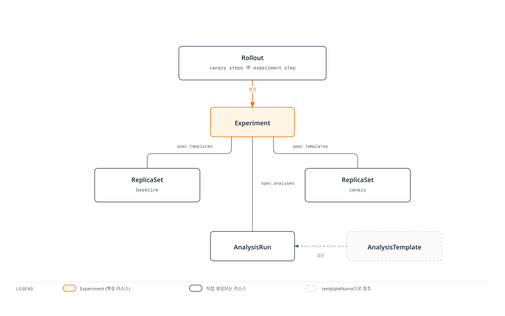
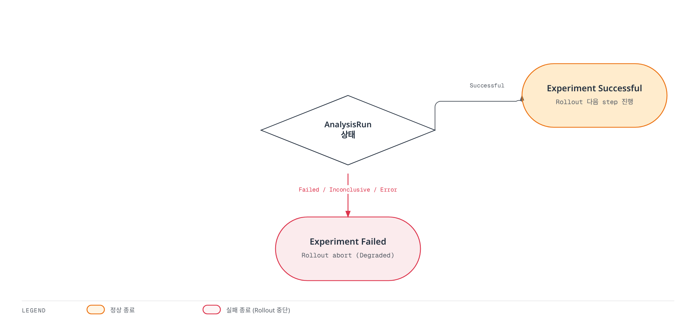

# Argo Rollouts Experiment 심층 분석

> **지원 버전**: Argo Rollouts v1.8+ (v1.8.3 / Kubernetes v1.33 실측 검증)
> **마지막 업데이트**: 2026년 7월 17일

## 목차

- [Experiment란?](#experiment란)
- [리소스 계층과 생성 체인](#리소스-계층과-생성-체인)
- [이름 생성 규칙](#이름-생성-규칙)
- [트래픽 라우팅 동작](#트래픽-라우팅-동작)
- [측정과 판정: AnalysisRun](#측정과-판정-analysisrun)
- [결과 전파와 Rollout 상태 전이](#결과-전파와-rollout-상태-전이)
- [실사용 예시](#실사용-예시)
- [kubectl 플러그인으로 관찰하기](#kubectl-플러그인으로-관찰하기)
- [실측 검증 결과](#실측-검증-결과)
- [다음 단계](#다음-단계)
- [참고 자료](#참고-자료)
- [퀴즈](#퀴즈)

## Experiment란?

Experiment는 하나 이상의 **일회성(ephemeral) ReplicaSet을 잠깐 띄웠다가 스케일 다운**하는 Argo Rollouts CRD입니다. 핵심 용도는 **프로덕션 트래픽과 분리된 채로 새 버전을 검증**하는 것입니다. 카나리 배포가 실제 사용자 트래픽 일부를 새 버전에 흘려보내며 검증하는 것과 달리, Experiment는 기본적으로 실제 서비스 트래픽을 받지 않는 별도 Pod 집합을 만들어 그 위에서 메트릭을 비교합니다.

| 구분 | 카나리 step | Experiment step |
|------|-------------|-----------------|
| 검증 대상 Pod | Rollout이 관리하는 canary ReplicaSet | Experiment가 만드는 **임시 ReplicaSet** |
| 프로덕션 트래픽 | 받음 (setWeight 비율만큼) | 기본적으로 받지 않음 |
| 수명 | 승격 후 stable로 전환 | `duration` 경과 또는 분석 종료 시 **0으로 스케일 다운** |
| 대표 시나리오 | 점진적 트래픽 이동 | baseline vs canary A/B 비교, 카나리 진입 전 사전 검증 |

Experiment는 단독 리소스로도 만들 수 있지만, 실무에서는 대부분 Rollout canary 전략의 **experiment step**으로 사용합니다.

## 리소스 계층과 생성 체인

Rollout이 experiment step에 도달하면 아래 체인으로 리소스가 생성됩니다.



동작 순서는 다음과 같습니다.

1. Rollout 컨트롤러가 experiment step에서 **Experiment 리소스를 생성**합니다. experiment step은 **blocking step**입니다 — Experiment가 Successful로 끝나야 다음 step으로 진행하고, 실패하면 Rollout이 **abort**됩니다.
2. Experiment 컨트롤러가 `spec.templates`의 각 항목(관례적으로 baseline/canary)마다 **ReplicaSet을 생성**하고, 모든 ReplicaSet의 Pod가 **healthy(available)** 상태가 될 때까지 기다립니다. 이때까지는 `duration` 타이머도 시작되지 않습니다.
3. 모든 템플릿이 healthy가 되면 `spec.analyses`의 각 항목마다 **AnalysisRun을 생성**합니다. AnalysisRun은 참조된 **AnalysisTemplate**의 메트릭 정의를 복사해 실행 인스턴스로 만든 것입니다.
4. `duration`이 경과하거나 분석이 끝나면 ReplicaSet들을 **0으로 스케일 다운**하고 결과를 Rollout에 보고합니다.

> Rollout을 거치지 않고 Experiment를 단독으로 생성해도 2~4번 체인은 동일하게 동작합니다.

## 이름 생성 규칙

Experiment 계열 리소스는 이름만 봐도 어느 Rollout의 몇 번째 revision, 몇 번째 step에서 나왔는지 추적할 수 있도록 규칙적으로 명명됩니다.

| 리소스 | 규칙 | 실측 예시 |
|--------|------|-----------|
| Experiment | `<Rollout명>-<새 버전 PodTemplateHash>-<revision>-<step 인덱스>` | `demo-app-74d8d8b4fb-2-0` |
| ReplicaSet | `<Experiment명>-<template명>` | `demo-app-74d8d8b4fb-2-0-baseline`, `demo-app-74d8d8b4fb-2-0-canary` |
| AnalysisRun | `<Experiment명>-<analysis명>` | `demo-app-74d8d8b4fb-2-0-success-rate` |

위 예시는 `demo-app` Rollout의 revision 2 업데이트에서 step 인덱스 0(첫 번째 step)의 experiment가 만든 리소스들입니다. [실측 검증 결과](#실측-검증-결과)의 트리 출력에서 실제 계층을 확인할 수 있습니다.

## 트래픽 라우팅 동작

기본 동작은 **label 기반 격리**입니다. Experiment의 ReplicaSet Pod들은 stable Pod와 다른 `rollouts-pod-template-hash` label 값을 갖기 때문에, ReplicaSet 단위의 정밀한 셀렉터를 쓰는 기존 Service의 트래픽 대상에서 자연스럽게 제외됩니다. 즉 아무 설정도 하지 않으면 experiment Pod는 프로덕션 트래픽을 받지 않습니다.

트래픽을 의도적으로 보내고 싶을 때는 두 가지 방법이 있습니다.

```yaml
templates:
  - name: canary
    specRef: canary
    # 방법 1: 실험 전용 Service 생성 (라우팅은 직접 구성)
    service: {}          # <Experiment명>-<template명> 이름의 Service가 생성됨
  - name: baseline
    specRef: stable
weight: 5                # 방법 2: 실험 Pod로 트래픽 5% 라우팅
```

- **`service` 속성**: 해당 템플릿의 Pod만 가리키는 Service를 Experiment 수명 동안 생성합니다(실측: `demo-app-74d8d8b4fb-2-0-canary` Service가 생성되고 실험 종료와 함께 삭제됨). `service.name`으로 이름도 지정할 수 있습니다.
- **`weight`**: 지정한 비율의 실제 트래픽을 실험 Pod로 보냅니다. 단, **trafficRouting이 구성된 Rollout에서만** 동작합니다 — weight 기반 분배는 Istio, ALB 같은 트래픽 제공자가 있어야 하기 때문입니다. 제공자별 설정은 [트래픽 관리](05-traffic-management.md#인그레스-컨트롤러-통합)를 참고하세요.

## 측정과 판정: AnalysisRun

AnalysisRun은 **provider**로 데이터를 수집하고 **조건식**으로 판정합니다. 주요 provider는 Prometheus, Datadog, CloudWatch, New Relic, **Web**(임의 HTTP 엔드포인트), **Job**(임의 Kubernetes Job 실행) 등이며, provider 상세 설정은 [트래픽 관리의 Analysis 섹션](05-traffic-management.md#analysis와-자동-롤백)을 참고하세요.

### 판정 조건 (boolean 평가)

```yaml
metrics:
  - name: success-rate
    interval: 15s          # 측정 간격
    count: 3               # 총 측정 횟수 (생략 시 무기한 반복)
    # 측정값(result)에 대한 boolean 식 — true면 그 측정은 Successful
    successCondition: result.status == 'ok' && result.success_rate >= 0.95
    # failureCondition을 함께 쓰면 실패 조건을 명시적으로 정의할 수 있음
    failureLimit: 1        # 허용 실패 횟수 — 초과 시 AnalysisRun 전체가 Failed
    inconclusiveLimit: 2   # 허용 판정불가 횟수 — 초과 시 Inconclusive
    consecutiveErrorLimit: 2  # 허용 연속 측정 오류(수집 실패) 횟수 — 초과 시 Error
```

각 측정은 `successCondition`/`failureCondition`의 boolean 평가로 Successful/Failed/Inconclusive가 되고, limit 계열 필드가 AnalysisRun 전체의 판정 기준이 됩니다.

| 필드 | 의미 | 초과 시 AnalysisRun 상태 |
|------|------|--------------------------|
| `failureLimit` | 허용되는 Failed 측정 횟수 | Failed |
| `inconclusiveLimit` | 허용되는 Inconclusive 측정 횟수 | Inconclusive |
| `consecutiveErrorLimit` | 허용되는 연속 측정 오류 횟수 (기본 4) | Error |

실측에서 `failureLimit: 1`인 메트릭이 2번 실패하자 AnalysisRun이 정확히 다음 메시지로 Failed 처리되었습니다.

```
Metric "success-rate" assessed Failed due to failed (2) > failureLimit (1)
```

## 결과 전파와 Rollout 상태 전이

AnalysisRun의 최종 상태가 Experiment를 거쳐 Rollout까지 전파됩니다.



- **Successful**: `duration` 경과와 분석 성공이 모두 충족되면 Experiment가 Successful이 되고, Rollout은 다음 step으로 진행합니다.
- **Failed / Inconclusive**: Experiment가 실패로 끝나고 Rollout이 abort됩니다. Rollout 상태는 `Degraded`가 되며 stable 버전이 그대로 유지됩니다.
- 어느 쪽이든 완료 시점에 Experiment의 ReplicaSet들은 **0으로 스케일 다운**되고, `service` 속성으로 만든 Service도 함께 정리됩니다.

## 실사용 예시

아래 매니페스트는 [실측 검증](#실측-검증-결과)에 사용한 것으로, 그대로 적용하면 동작합니다. canary 전략의 첫 step에서 baseline/canary 1개씩을 60초간 띄워 성공률을 비교한 뒤, 통과해야만 20% 카나리로 진행합니다.

```yaml
apiVersion: argoproj.io/v1alpha1
kind: AnalysisTemplate
metadata:
  name: success-rate-check
  namespace: demo
spec:
  metrics:
    - name: success-rate
      interval: 15s
      count: 3
      successCondition: result.status == 'ok' && result.success_rate >= 0.95
      failureLimit: 1
      inconclusiveLimit: 2
      consecutiveErrorLimit: 2
      provider:
        web:
          # 데모용 web provider — 실무에서는 Prometheus 등을 사용
          url: "http://metrics-mock.demo.svc.cluster.local/metrics.json"
          jsonPath: "{$}"
---
apiVersion: argoproj.io/v1alpha1
kind: Rollout
metadata:
  name: demo-app
  namespace: demo
spec:
  replicas: 3
  revisionHistoryLimit: 3
  selector:
    matchLabels:
      app: demo-app
  strategy:
    canary:
      steps:
        # step 0: 프로덕션 트래픽과 분리된 실험 (blocking — 실패 시 abort)
        - experiment:
            duration: 60s
            templates:
              - name: baseline
                specRef: stable    # 현재 stable Pod 스펙 사용
              - name: canary
                specRef: canary    # 새 버전 Pod 스펙 사용
                service: {}        # 실험 전용 Service 생성
            analyses:
              - name: success-rate
                templateName: success-rate-check
        # step 1~2: 실험 통과 후에만 진행되는 카나리
        - setWeight: 20
        - pause: { duration: 10s }
  template:
    metadata:
      labels:
        app: demo-app
    spec:
      containers:
        - name: app
          image: public.ecr.aws/nginx/nginx:1.27
          ports:
            - containerPort: 8080
```

실무에서는 web provider 대신 Prometheus provider로 baseline/canary의 메트릭을 각각 질의해 비교하는 패턴이 일반적입니다. 이때 `podTemplateHashValue: Baseline`/`Canary`로 각 ReplicaSet의 hash를 분석 인자로 넘겨 label 셀렉터에 사용합니다 — 전체 예시는 [트래픽 관리의 Experiment 섹션](05-traffic-management.md#experiment)을 참고하세요.

## kubectl 플러그인으로 관찰하기

`kubectl argo rollouts get rollout <이름> --watch`로 Experiment의 전체 계층(Experiment → ReplicaSet → Pod, AnalysisRun)을 실시간으로 볼 수 있습니다. 아래는 위 매니페스트의 experiment step 진행 중 실제 출력입니다.

```
$ kubectl argo rollouts get rollout demo-app -n demo
Name:            demo-app
Namespace:       demo
Status:          ◌ Progressing
Strategy:        Canary
  Step:          0/3
  SetWeight:     0
  ActualWeight:  0

NAME                                                  KIND         STATUS         AGE  INFO
⟳ demo-app                                            Rollout      ◌ Progressing  51s
├──# revision:2
│  ├──⧉ demo-app-74d8d8b4fb                           ReplicaSet   • ScaledDown   29s  canary
│  └──Σ demo-app-74d8d8b4fb-2-0                       Experiment   ◌ Running      29s
│     ├──⧉ demo-app-74d8d8b4fb-2-0-baseline           ReplicaSet   ✔ Healthy      29s
│     │  └──□ demo-app-74d8d8b4fb-2-0-baseline-gvgnq  Pod          ✔ Running      29s  ready:1/1
│     ├──⧉ demo-app-74d8d8b4fb-2-0-canary             ReplicaSet   ✔ Healthy      29s
│     │  └──□ demo-app-74d8d8b4fb-2-0-canary-jq6lb    Pod          ✔ Running      29s  ready:1/1
│     └──α demo-app-74d8d8b4fb-2-0-success-rate       AnalysisRun  ◌ Running      29s  ✔ 2
└──# revision:1
   └──⧉ demo-app-779c8779bf                           ReplicaSet   ✔ Healthy      51s  stable
```

experiment step 동안 revision 2의 본 ReplicaSet(`demo-app-74d8d8b4fb`)은 아직 `ScaledDown`인 점에 주목하세요 — 검증이 끝나기 전에는 새 버전이 프로덕션 경로에 배치되지 않습니다. AnalysisRun의 측정 내역은 status에 그대로 남아 사후 분석에 쓸 수 있습니다.

```
$ kubectl get analysisrun demo-app-74d8d8b4fb-2-0-success-rate -n demo \
    -o jsonpath='{.status.metricResults[0]}' | python3 -m json.tool
{
    "consecutiveSuccess": 2,
    "count": 2,
    "measurements": [
        {
            "finishedAt": "2026-07-17T01:24:09Z",
            "phase": "Successful",
            "value": "{\"error_rate\":0.004,\"status\":\"ok\",\"success_rate\":0.99}"
        },
        ...
    ],
    "name": "success-rate",
    "phase": "Running",
    "successful": 2
}
```

## 실측 검증 결과

Argo Rollouts v1.8.3 컨트롤러(공식 소스 빌드)와 Kubernetes v1.33 컨트롤 플레인으로 구성한 테스트 클러스터(kwok 기반 — API 서버/컨트롤러 매니저/스케줄러는 실제 바이너리, 노드와 Pod 라이프사이클은 시뮬레이션)에서 위 매니페스트로 검증했습니다. 리소스 생성 체인·이름 규칙·분석 판정·상태 전파는 모두 실제 컨트롤러 동작이며, **실제 트래픽 분배 비율 검증은 이 환경의 범위 밖**입니다(트래픽 실측은 [트래픽 관리의 EKS 검증](05-traffic-management.md#실측-검증-결과-eks) 참고).

| 검증 항목 | 결과 |
|-----------|------|
| experiment step 도달 시 Experiment 자동 생성, 이름 = `<Rollout명>-<PodHash>-<revision>-<step>` | ✅ `demo-app-74d8d8b4fb-2-0` (revision 2, step 0) |
| templates 기반 ReplicaSet 생성, 이름 = `<Experiment명>-<template명>` | ✅ `...-2-0-baseline`, `...-2-0-canary` 각 1 replica |
| `service: {}` 지정 템플릿의 실험 전용 Service 생성/정리 | ✅ `...-2-0-canary` Service 생성, 실험 종료 후 삭제 확인 |
| 모든 템플릿 healthy 후 AnalysisRun 생성, `interval: 15s`/`count: 3` 반복 측정 | ✅ 15초 간격 measurements 3회 기록, `successCondition` 평가 Successful |
| 성공 경로: duration 60s 경과 → Experiment Successful → 실험 RS 0으로 스케일 다운 → 다음 step(setWeight 20) 진행 → Rollout Healthy | ✅ 정상 |
| 실패 경로: 메트릭 악화 시 `failed (2) > failureLimit (1)`로 AnalysisRun Failed → Experiment Failed → Rollout abort (Degraded), stable 유지 | ✅ 정상 — abort 메시지가 원인 메트릭을 그대로 표기 |

## 다음 단계

1. **[트래픽 관리](05-traffic-management.md)**: 카나리/블루그린 전략과 인그레스 통합 속에서 experiment step을 조합하세요.

2. **[모범 사례](09-best-practices.md)**: 프로그레시브 딜리버리 운영 모범 사례를 학습하세요.

## 참고 자료

- [Experiment 공식 문서](https://argoproj.github.io/argo-rollouts/features/experiment/)
- [Analysis 공식 문서](https://argoproj.github.io/argo-rollouts/features/analysis/)
- [Experiment CRD 스펙](https://argoproj.github.io/argo-rollouts/features/specification/)

## 퀴즈

이 장에서 배운 내용을 테스트하려면 [Rollouts Experiment 퀴즈](../../quizzes/gitops/argocd/10-rollouts-experiment-quiz.md)를 풀어보세요.
