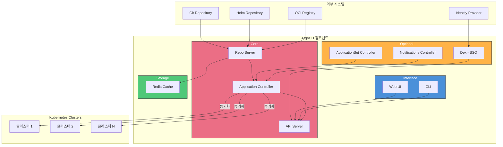
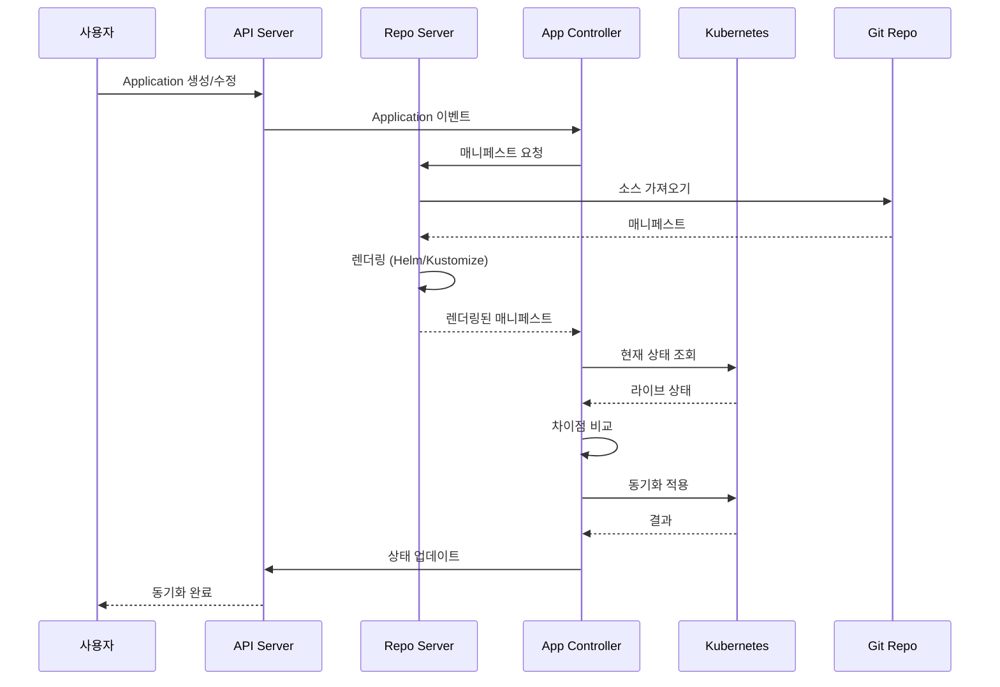
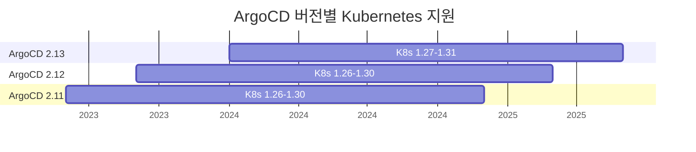
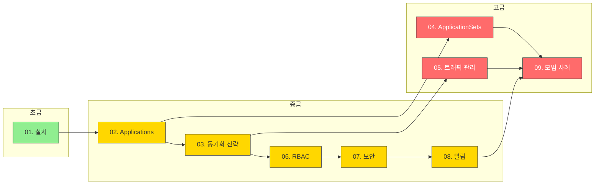

# ArgoCD

> **지원 버전**: ArgoCD v2.9+, Argo Rollouts v1.6+
> **마지막 업데이트**: 2026년 2월 21일

## 목차

- [ArgoCD란?](#argocd란)
- [주요 이점](#주요-이점)
- [아키텍처](#아키텍처)
- [핵심 개념](#핵심-개념)
- [버전 지원 정보](#버전-지원-정보)
- [하위 가이드](#하위-가이드)
- [빠른 시작](#빠른-시작)

## ArgoCD란?

ArgoCD는 Kubernetes를 위한 선언적 GitOps 지속적 배포(Continuous Delivery) 도구입니다. CNCF(Cloud Native Computing Foundation) Graduated 프로젝트로, Git 저장소에 정의된 애플리케이션 상태를 Kubernetes 클러스터에 자동으로 동기화합니다.

ArgoCD는 Git 저장소를 "진실의 원천(Single Source of Truth)"으로 사용하여:
- 애플리케이션 배포를 자동화
- 클러스터 상태를 지속적으로 모니터링
- 원하는 상태와 실제 상태의 차이를 감지하고 조정
- 배포 이력을 추적하고 롤백 지원

## 주요 이점

### 1. 선언적 배포

```yaml
# 원하는 상태를 선언적으로 정의
apiVersion: argoproj.io/v1alpha1
kind: Application
metadata:
  name: my-app
spec:
  source:
    repoURL: https://github.com/myorg/myapp
    path: manifests
  destination:
    server: https://kubernetes.default.svc
    namespace: production
```

### 2. 자동화된 동기화

- Git 변경 시 자동 배포
- 드리프트(Drift) 감지 및 자체 치유
- 수동 변경 자동 복구

### 3. 멀티 클러스터 관리

- 중앙 집중식 다중 클러스터 관리
- ApplicationSet을 통한 대규모 배포
- 클러스터 간 일관성 유지

### 4. 가시성과 감사

- 직관적인 웹 UI
- 배포 이력 및 롤백
- 실시간 상태 모니터링
- 감사 로그 자동 생성

### 5. 프로그레시브 딜리버리

- Argo Rollouts 통합
- 블루/그린, 카나리 배포
- 자동 롤백

## 아키텍처

ArgoCD는 Kubernetes 컨트롤러 패턴을 따르며, 여러 구성 요소로 이루어져 있습니다:



### 핵심 컴포넌트

| 컴포넌트 | 역할 | 설명 |
|----------|------|------|
| **API Server** | 인터페이스 | gRPC/REST API 제공, 인증/인가 처리 |
| **Application Controller** | 핵심 로직 | 애플리케이션 상태 모니터링 및 동기화 |
| **Repo Server** | 매니페스트 생성 | Git 저장소에서 매니페스트 렌더링 |
| **Redis** | 캐싱 | 매니페스트 캐시, 세션 저장 |
| **Dex** | SSO | OIDC/SAML/LDAP 인증 브로커 |
| **ApplicationSet Controller** | 대규모 배포 | 템플릿 기반 Application 생성 |
| **Notifications Controller** | 알림 | Slack, Email 등 알림 발송 |

### 데이터 흐름



## 핵심 개념

### Application

ArgoCD의 기본 배포 단위입니다. Git 저장소의 매니페스트를 특정 클러스터와 네임스페이스에 배포합니다.

```yaml
apiVersion: argoproj.io/v1alpha1
kind: Application
metadata:
  name: guestbook
  namespace: argocd
spec:
  project: default
  source:
    repoURL: https://github.com/argoproj/argocd-example-apps.git
    targetRevision: HEAD
    path: guestbook
  destination:
    server: https://kubernetes.default.svc
    namespace: guestbook
  syncPolicy:
    automated:
      prune: true
      selfHeal: true
```

### AppProject

Application을 논리적으로 그룹화하고 접근 제어를 설정합니다.

```yaml
apiVersion: argoproj.io/v1alpha1
kind: AppProject
metadata:
  name: production
  namespace: argocd
spec:
  description: Production applications
  sourceRepos:
    - 'https://github.com/myorg/*'
  destinations:
    - namespace: '*'
      server: https://prod-cluster.example.com
  clusterResourceWhitelist:
    - group: ''
      kind: Namespace
```

### ApplicationSet

템플릿을 사용하여 여러 Application을 자동 생성합니다.

```yaml
apiVersion: argoproj.io/v1alpha1
kind: ApplicationSet
metadata:
  name: cluster-apps
spec:
  generators:
    - clusters: {}
  template:
    metadata:
      name: '{{name}}-app'
    spec:
      source:
        repoURL: https://github.com/myorg/apps
        path: '{{metadata.labels.env}}'
      destination:
        server: '{{server}}'
```

### 동기화 상태

| 상태 | 설명 |
|------|------|
| **Synced** | Git과 클러스터 상태 일치 |
| **OutOfSync** | Git과 클러스터 상태 불일치 |
| **Unknown** | 상태 확인 불가 |

### 헬스 상태

| 상태 | 설명 |
|------|------|
| **Healthy** | 모든 리소스 정상 |
| **Progressing** | 배포 진행 중 |
| **Degraded** | 일부 리소스 비정상 |
| **Suspended** | 일시 중지됨 |
| **Missing** | 리소스 없음 |

## 버전 지원 정보

### ArgoCD 버전

| 버전 | Kubernetes 지원 | 주요 기능 |
|------|-----------------|-----------|
| **v2.13** | 1.27 - 1.31 | 최신 안정 버전 |
| **v2.12** | 1.26 - 1.30 | ApplicationSet Progressive Syncs |
| **v2.11** | 1.26 - 1.30 | Server-side Apply |
| **v2.10** | 1.25 - 1.29 | Multiple Sources |
| **v2.9** | 1.24 - 1.28 | ApplicationSet Matrix/Merge |

### Argo Rollouts 버전

| 버전 | 주요 기능 |
|------|-----------|
| **v1.7** | 최신 안정 버전, ALB 개선 |
| **v1.6** | Istio Gateway API 지원 |
| **v1.5** | Analysis improvements |

### Kubernetes 호환성



## 하위 가이드

이 ArgoCD 가이드는 다음 하위 문서로 구성되어 있습니다:

| 가이드 | 설명 | 난이도 |
|--------|------|--------|
| [01. 설치 및 구성](01-installation.md) | ArgoCD 설치, CLI 설정, 초기 구성 | 초급 |
| [02. Application 심층 분석](02-applications.md) | Application CRD 상세, 소스 유형, 훅 | 중급 |
| [03. 동기화 전략](03-sync-strategies.md) | 자동/수동 동기화, 웨이브, 윈도우 | 중급 |
| [04. ApplicationSets](04-applicationsets.md) | 9가지 생성기, 템플릿, 대규모 배포 | 고급 |
| [05. 트래픽 관리](05-traffic-management.md) | Argo Rollouts, 블루/그린, 카나리 | 고급 |
| [06. 프로젝트와 RBAC](06-projects-rbac.md) | AppProject, RBAC 정책, 멀티테넌시 | 중급 |
| [07. 보안](07-security.md) | SSO, 시크릿 관리, TLS | 중급 |
| [08. 알림](08-notifications.md) | Slack, Teams, Webhook 연동 | 중급 |
| [09. 모범 사례](09-best-practices.md) | 프로덕션 구성, 성능 최적화, 문제 해결 | 고급 |

### 학습 경로



## 빠른 시작

### 1. ArgoCD 설치

```bash
# 네임스페이스 생성
kubectl create namespace argocd

# ArgoCD 설치
kubectl apply -n argocd -f https://raw.githubusercontent.com/argoproj/argo-cd/stable/manifests/install.yaml

# 설치 확인
kubectl get pods -n argocd
```

### 2. CLI 설치

```bash
# macOS
brew install argocd

# Linux
curl -sSL -o argocd-linux-amd64 https://github.com/argoproj/argo-cd/releases/latest/download/argocd-linux-amd64
sudo install -m 555 argocd-linux-amd64 /usr/local/bin/argocd
rm argocd-linux-amd64
```

### 3. 초기 접근

```bash
# 포트 포워딩
kubectl port-forward svc/argocd-server -n argocd 8080:443 &

# 초기 비밀번호 가져오기
argocd admin initial-password -n argocd

# 로그인
argocd login localhost:8080
```

### 4. 첫 번째 Application 배포

```bash
# Application 생성
argocd app create guestbook \
  --repo https://github.com/argoproj/argocd-example-apps.git \
  --path guestbook \
  --dest-server https://kubernetes.default.svc \
  --dest-namespace guestbook

# 동기화
argocd app sync guestbook

# 상태 확인
argocd app get guestbook
```

### 5. 웹 UI 접근

브라우저에서 `https://localhost:8080`으로 접속합니다.

- **사용자명**: admin
- **비밀번호**: 위에서 얻은 초기 비밀번호

## Amazon EKS 통합

ArgoCD는 Amazon EKS와 원활하게 통합됩니다:

```yaml
# IRSA 설정
apiVersion: v1
kind: ServiceAccount
metadata:
  name: argocd-application-controller
  namespace: argocd
  annotations:
    eks.amazonaws.com/role-arn: arn:aws:iam::123456789012:role/ArgoCD
---
# ALB Ingress
apiVersion: networking.k8s.io/v1
kind: Ingress
metadata:
  name: argocd-server
  namespace: argocd
  annotations:
    kubernetes.io/ingress.class: alb
    alb.ingress.kubernetes.io/scheme: internet-facing
    alb.ingress.kubernetes.io/target-type: ip
    alb.ingress.kubernetes.io/backend-protocol: HTTPS
spec:
  rules:
    - host: argocd.example.com
      http:
        paths:
          - path: /
            pathType: Prefix
            backend:
              service:
                name: argocd-server
                port:
                  number: 443
```

자세한 EKS 통합 가이드는 [설치 및 구성](01-installation.md)을 참조하세요.

## 다음 단계

1. **[설치 및 구성](01-installation.md)**: ArgoCD를 클러스터에 설치하고 기본 구성을 완료하세요.

2. **[Application 심층 분석](02-applications.md)**: Application CRD의 모든 옵션을 학습하세요.

3. **[동기화 전략](03-sync-strategies.md)**: 자동 동기화와 동기화 웨이브를 구성하세요.

## 참고 자료

- [ArgoCD 공식 문서](https://argo-cd.readthedocs.io/)
- [ArgoCD GitHub](https://github.com/argoproj/argo-cd)
- [Argo Rollouts 문서](https://argoproj.github.io/argo-rollouts/)
- [CNCF ArgoCD](https://www.cncf.io/projects/argo/)

## 퀴즈

이 장에서 배운 내용을 테스트하려면 [ArgoCD 퀴즈](../../quizzes/gitops/argocd/README-quiz.md)를 풀어보세요.
