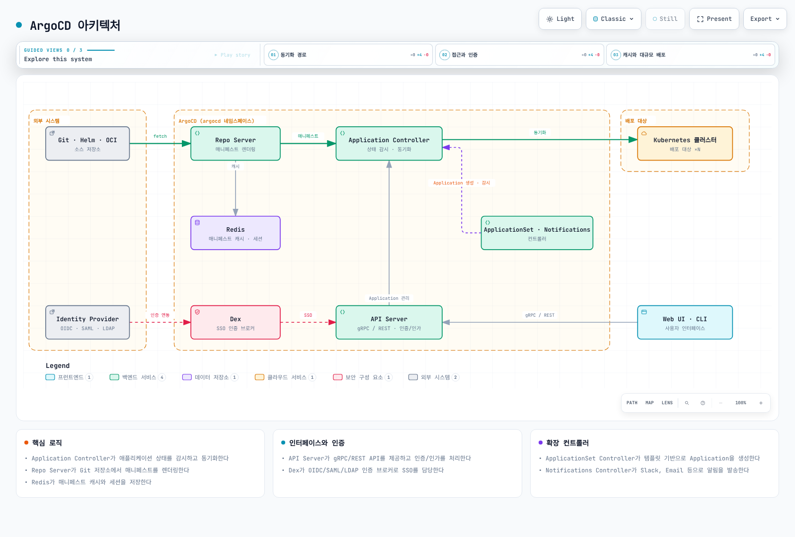
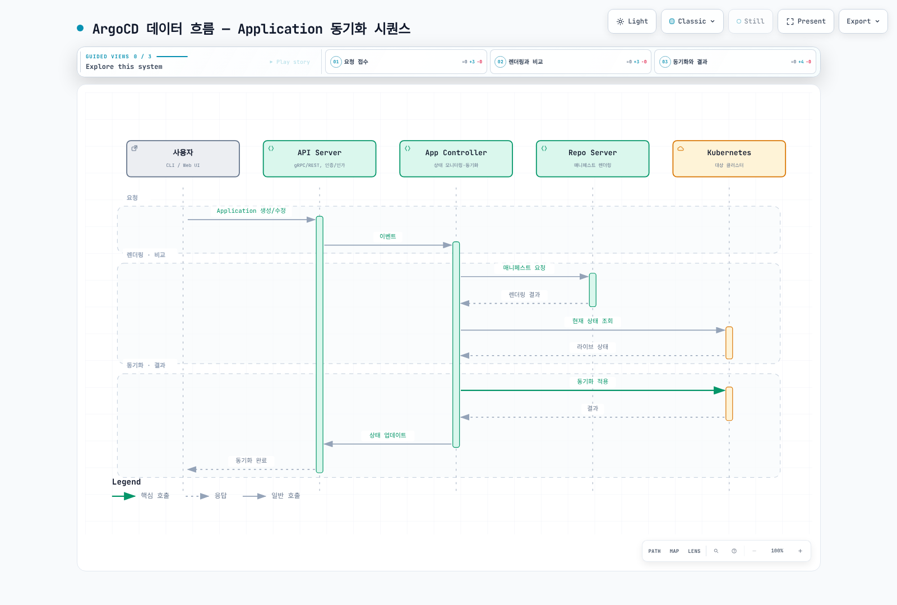
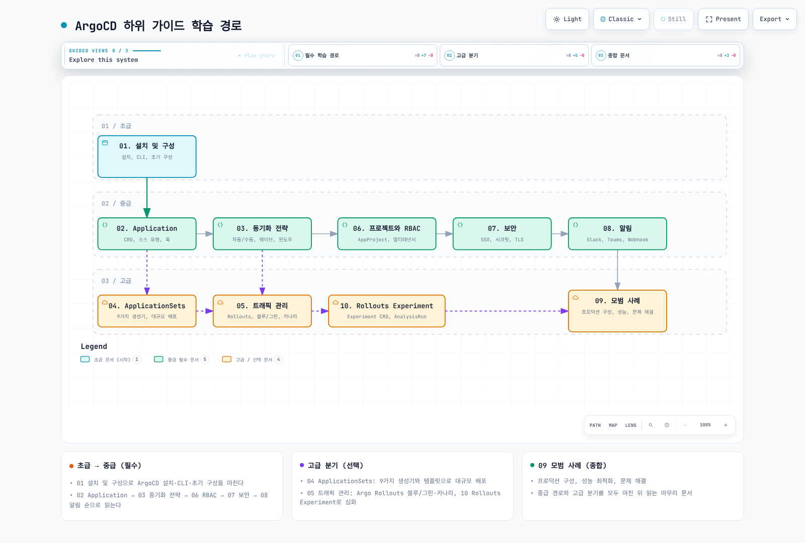

# ArgoCD

> **지원 버전**: Argo CD 3.5.2, Argo Rollouts 1.10.0 (검토 기준)
> **마지막 업데이트**: 2026년 9월 11일

## 목차

- [ArgoCD란?](#argocd란)
- [주요 이점](#주요-이점)
- [아키텍처](#아키텍처)
- [핵심 개념](#핵심-개념)
- [버전 지원 정보](#버전-지원-정보)
- [하위 가이드](#하위-가이드)
- [빠른 시작](#빠른-시작)

## ArgoCD란?

ArgoCD는 Kubernetes를 위한 선언적 GitOps 지속적 배포(Continuous Delivery) 도구입니다. CNCF Graduated 프로젝트인 Argo의 구성 요소로, Git 저장소에 정의된 애플리케이션 상태를 Kubernetes 클러스터에 자동으로 동기화합니다.

ArgoCD는 Git 저장소를 "진실의 원천(Single Source of Truth)"으로 사용하여:
- 애플리케이션 배포를 자동화
- 클러스터 상태를 지속적으로 모니터링
- 원하는 상태와 실제 상태의 차이를 감지하고 조정
- 배포 이력을 추적하고 롤백 지원

## 주요 이점

### 1. 선언적 배포

```yaml
# 원하는 상태를 선언적으로 정의
apiVersion: argoproj.io/v1alpha1
kind: Application
metadata:
  name: my-app
  namespace: argocd
spec:
  project: default
  source:
    repoURL: https://github.com/myorg/myapp
    targetRevision: main
    path: manifests
  destination:
    server: https://kubernetes.default.svc
    namespace: production
```

### 2. 자동화된 동기화

- 자동 sync 정책을 활성화한 경우 Git 변경을 적용
- 드리프트(Drift) 감지 및 자체 치유
- selfHeal을 활성화한 경우 비교 대상의 수동 변경을 조정

### 3. 멀티 클러스터 관리

- 중앙 집중식 다중 클러스터 관리
- ApplicationSet을 통한 대규모 배포
- 클러스터 간 일관성 유지

### 4. 가시성과 감사

- 직관적인 웹 UI
- 배포 이력 및 롤백
- 실시간 상태 모니터링
- 감사 로그 자동 생성

### 5. 프로그레시브 딜리버리

- Argo Rollouts 통합
- 블루/그린, 카나리 배포
- 자동 롤백

## 아키텍처

ArgoCD는 Kubernetes 컨트롤러 패턴을 따르며, 여러 구성 요소로 이루어져 있습니다:



[🔍 인터랙티브 다이어그램 보기](https://www.atomai.click/kubernetes-docs/archmaps/ko-gitops-argocd-overview-0.html)

### 핵심 컴포넌트

| 컴포넌트 | 역할 | 설명 |
|----------|------|------|
| **API Server** | 인터페이스 | gRPC/REST API 제공, 인증/인가 처리 |
| **Application Controller** | 핵심 로직 | 애플리케이션 상태 모니터링 및 동기화 |
| **Repo Server** | 매니페스트 생성 | Git 저장소에서 매니페스트 렌더링 |
| **Redis** | 캐싱 | 매니페스트·상태 캐시 |
| **Dex** | SSO | OIDC 브로커; 지원 커넥터로 다른 IdP 연동 |
| **ApplicationSet Controller** | 대규모 배포 | 템플릿 기반 Application 생성 |
| **Notifications Controller** | 알림 | Slack, Email 등 알림 발송 |

### 데이터 흐름



[🔍 인터랙티브 다이어그램 보기](https://www.atomai.click/kubernetes-docs/archmaps/ko-gitops-argocd-overview-1.html)

## 핵심 개념

### Application

ArgoCD의 기본 배포 단위입니다. Git 저장소의 매니페스트를 특정 클러스터와 네임스페이스에 배포합니다.

```yaml
apiVersion: argoproj.io/v1alpha1
kind: Application
metadata:
  name: guestbook
  namespace: argocd
spec:
  project: default
  source:
    repoURL: https://github.com/argoproj/argocd-example-apps.git
    targetRevision: HEAD
    path: guestbook
  destination:
    server: https://kubernetes.default.svc
    namespace: guestbook
  syncPolicy:
    automated:
      prune: true
      selfHeal: true
    syncOptions:
      - CreateNamespace=true
```

### AppProject

Application을 논리적으로 그룹화하고 접근 제어를 설정합니다.

```yaml
apiVersion: argoproj.io/v1alpha1
kind: AppProject
metadata:
  name: production
  namespace: argocd
spec:
  description: Production applications
  sourceRepos:
    - 'https://github.com/myorg/*'
  destinations:
    - namespace: production
      server: https://prod-cluster.example.com
  clusterResourceWhitelist:
    - group: ''
      kind: Namespace
```

### ApplicationSet

템플릿을 사용하여 여러 Application을 자동 생성합니다. 아래 selector는 등록된 cluster Secret의 `environment: demo` 라벨에만 일치합니다. 생성된 Application은 별도 자동 sync 정책이 없으면 수동으로 동기화합니다.

```yaml
apiVersion: argoproj.io/v1alpha1
kind: ApplicationSet
metadata:
  name: demo-cluster-apps
  namespace: argocd
spec:
  goTemplate: true
  goTemplateOptions: ["missingkey=error"]
  generators:
  - clusters:
      selector:
        matchLabels:
          environment: demo
  template:
    metadata:
      name: '{{.nameNormalized}}-guestbook'
    spec:
      project: default
      source:
        repoURL: https://github.com/argoproj/argocd-example-apps.git
        targetRevision: HEAD
        path: guestbook
      destination:
        server: '{{.server}}'
        namespace: guestbook
      syncPolicy:
        syncOptions: [CreateNamespace=true]
```

### 동기화 상태

| 상태 | 설명 |
|------|------|
| **Synced** | Git과 클러스터 상태 일치 |
| **OutOfSync** | Git과 클러스터 상태 불일치 |
| **Unknown** | 상태 확인 불가 |

### 헬스 상태

| 상태 | 설명 |
|------|------|
| **Healthy** | 설정된 헬스 체크가 정상으로 판정한 상태 (미정의 CR의 정상 보장은 아님) |
| **Progressing** | 배포 진행 중 |
| **Degraded** | 일부 리소스 비정상 |
| **Suspended** | 일시 중지됨 |
| **Missing** | 리소스 없음 |

## 버전 지원 정보

검토 기준은 **Argo CD 3.5.2 / Helm Chart 10.8.4**입니다. 앱 버전과 설치 Chart 버전은 다릅니다. Argo CD는 최근 세 minor 라인에 패치를 제공하며, 이보다 오래된 라인은 EOL입니다.

### 테스트된 Kubernetes 조합

| Argo CD | Kubernetes |
|---|---|
| 3.5 | 1.36, 1.35, 1.34, 1.33 |
| 3.4 | 1.35, 1.34, 1.33, 1.32 |
| 3.3 | 1.35, 1.34, 1.33, 1.32 |

위 표는 3.5.2 저장소에 기록된 업스트림 테스트 조합입니다. Helm Chart의 최소 `kubeVersion` 조건, Kubernetes 자체 지원 기간, EKS 지원 기간 및 관리형 Argo CD 버전 정책과는 별개입니다. EKS 버전 하나를 특정 Argo CD minor에 일대일로 대응시키지 않습니다.

### 최근 릴리스

- 3.5.0: **2026-08-04** 공개. 서버가 사용하는 Helm 렌더러의 4.x 전환 등은 업그레이드 가이드를 확인합니다.
- 3.5.1: 2026-08-12 공개.
- 3.5.2: 2026-08-27 공개. 패치 내용과 최신 지원 라인은 공식 릴리스 기록으로 확인합니다.

### Argo Rollouts

Rollouts는 별도 컨트롤러이며 Argo CD 없이도 사용할 수 있습니다. 여기서는 1.10.0 문서를 기준으로 확인했습니다. Argo CD·Rollouts의 버전 숫자를 대응시킨 호환성 표 대신 Rollouts CRD/컨트롤러, 트래픽 관리 플러그인, Kubernetes 버전과 Argo CD 헬스 체크의 실제 조합을 검증합니다.

### EKS 관리형 Argo CD 기능

EKS Capability for Argo CD는 자체 설치와 다른 운영 경로입니다. 2026-08 발표된 사용자 지정 구성은 **지원 목록에 있는** `argocd-cm` 키에만 적용됩니다. capability에 설정한 namespace와 `app.kubernetes.io/part-of: argocd` 라벨이 필요합니다. 지원되지 않는 키·플래그는 무시되며, Lua 표준 라이브러리나 임의 실행 플러그인을 사용할 수 있다고 가정하지 않습니다. 자세한 범위는 [관리형 구성 가이드](https://docs.aws.amazon.com/eks/latest/userguide/argocd-configure-settings.html)를 확인하세요.

## 하위 가이드

이 ArgoCD 가이드는 다음 하위 문서로 구성되어 있습니다:

| 가이드 | 설명 | 난이도 |
|--------|------|--------|
| [01. 설치 및 구성](01-installation.md) | ArgoCD 설치, CLI 설정, 초기 구성 | 초급 |
| [02. Application 심층 분석](02-applications.md) | Application CRD 상세, 소스 유형, 훅 | 중급 |
| [03. 동기화 전략](03-sync-strategies.md) | 자동/수동 동기화, 웨이브, 윈도우 | 중급 |
| [04. ApplicationSets](04-applicationsets.md) | 9가지 생성기, 템플릿, 대규모 배포 | 고급 |
| [05. 트래픽 관리](05-traffic-management.md) | Argo Rollouts, 블루/그린, 카나리 | 고급 |
| [06. 프로젝트와 RBAC](06-projects-rbac.md) | AppProject, RBAC 정책, 멀티테넌시 | 중급 |
| [07. 보안](07-security.md) | SSO, 시크릿 관리, TLS | 중급 |
| [08. 알림](08-notifications.md) | Slack, Teams, Webhook 연동 | 중급 |
| [09. 모범 사례](09-best-practices.md) | 프로덕션 구성, 성능 최적화, 문제 해결 | 고급 |
| [10. Rollouts Experiment 심층 분석](10-rollouts-experiment.md) | Experiment CRD, 임시 ReplicaSet 검증, AnalysisRun 판정 | 고급 |

### 학습 경로



[🔍 인터랙티브 다이어그램 보기](https://www.atomai.click/kubernetes-docs/archmaps/ko-gitops-argocd-readme-3.html)

## 빠른 시작

### 1. ArgoCD 설치

자체 설치의 비HA 평가 예제입니다. 호환되는 클러스터·CRD/RBAC 권한과 빈 전용 namespace를 준비하고, 프로덕션은 [설치 가이드](01-installation.md)의 HA·인증·업그레이드 절차를 따릅니다.

```bash
# 네임스페이스 생성
kubectl create namespace argocd

# ArgoCD 설치
kubectl apply --server-side -n argocd -f https://raw.githubusercontent.com/argoproj/argo-cd/v3.5.2/manifests/install.yaml

# 설치 확인
kubectl get pods -n argocd
```

### 2. CLI 설치

[설치 가이드](01-installation.md)의 OS·CPU 아키텍처별 설치와 릴리스 체크섬 검증을 따릅니다. macOS는 Homebrew도 사용할 수 있습니다. 서버와 맞는 버전인지 확인합니다.

```bash
argocd version --client
```

### 3. 초기 접근

```bash
# 별도 터미널에서 유지
kubectl port-forward svc/argocd-server -n argocd 8080:443
```

다른 터미널에서:

```bash
# 초기 비밀번호 가져오기
argocd admin initial-password -n argocd

# 로그인
argocd login localhost:8080
```

초기 비밀번호를 바꾼 뒤 `argocd-initial-admin-secret`을 삭제합니다. 포트 포워딩은 별도 터미널에서 유지합니다.

### 4. 첫 번째 Application 배포

```bash
# Application 생성
argocd app create guestbook \
  --repo https://github.com/argoproj/argocd-example-apps.git \
  --path guestbook \
  --dest-server https://kubernetes.default.svc \
  --dest-namespace guestbook \
  --sync-option CreateNamespace=true

# 동기화
argocd app sync guestbook

# 상태 확인
argocd app get guestbook
```

### 5. 웹 UI 접근

브라우저에서 `https://localhost:8080`으로 접속합니다.

- **사용자명**: admin
- **비밀번호**: 위에서 얻은 초기 비밀번호

## Amazon EKS 통합

AWS API를 호출하는 컴포넌트의 IAM 역할과 대상 EKS Kubernetes API의 인증·RBAC를 구분합니다. ServiceAccount annotation만으로 IRSA 신뢰 정책이나 클러스터 접근이 생기지는 않습니다. 노드의 이미지 풀 역할, Repo Server의 OCI 인증, Image Updater, External Secrets의 권한도 사용하는 기능에 맞춰 분리합니다.

UI 접근은 TLS와 접근 범위를 구성한 Ingress 또는 로컬 포트 포워딩을 사용합니다. [설치 및 구성](01-installation.md)에 AWS Load Balancer Controller·인증서·백엔드 프로토콜을 포함한 예제를 제공합니다.

## 다음 단계

1. **[설치 및 구성](01-installation.md)**: ArgoCD를 클러스터에 설치하고 기본 구성을 완료하세요.

2. **[Application 심층 분석](02-applications.md)**: Application CRD의 모든 옵션을 학습하세요.

3. **[동기화 전략](03-sync-strategies.md)**: 자동 동기화와 동기화 웨이브를 구성하세요.

## 참고 자료

- [ArgoCD 공식 문서](https://argo-cd.readthedocs.io/)
- [ArgoCD GitHub](https://github.com/argoproj/argo-cd)
- [Argo Rollouts 문서](https://argoproj.github.io/argo-rollouts/)
- [CNCF ArgoCD](https://www.cncf.io/projects/argo/)

## 퀴즈

이 장에서 배운 내용을 테스트하려면 [ArgoCD 설치 퀴즈](../../quizzes/gitops/argocd/01-installation-quiz.md)를 풀어보세요.

### 버전별 검토 근거

- [Argo CD 3.5.2 tested Kubernetes versions](https://github.com/argoproj/argo-cd/blob/v3.5.2/docs/operator-manual/tested-kubernetes-versions.md)
- [Release support policy](https://github.com/argoproj/argo-cd/blob/v3.5.2/docs/developer-guide/release-process-and-cadence.md)
- [3.5.0 release](https://github.com/argoproj/argo-cd/releases/tag/v3.5.0)
- [3.5.2 release](https://github.com/argoproj/argo-cd/releases/tag/v3.5.2)
- [HA component behavior](https://github.com/argoproj/argo-cd/blob/v3.5.2/docs/operator-manual/high_availability.md)
