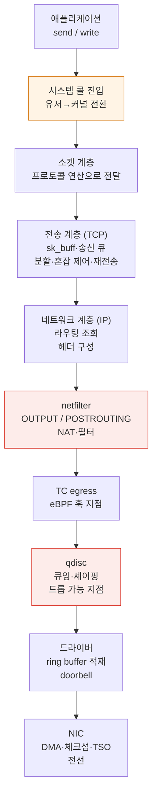
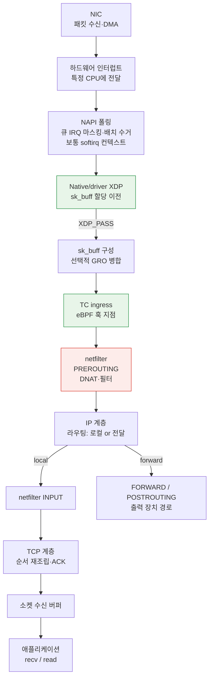

# 커널 네트워킹 스택

> **지원 버전**: Linux 6.1 / 6.12 / 6.18 (Amazon Linux 2023)
> **마지막 업데이트**: 2026년 9월 14일

## 이 문서에서 다루는 것

- `send()` 한 번이 NIC의 전선에 닿기까지 커널 안에서 지나는 경로와, 각 지점이 무엇을 하는가
- 소켓 파일 디스크립터가 가상 파일시스템(Virtual File System, VFS)과 연결되는 방식과 TCP 버퍼·윈도·큐 관측값의 차이
- 그 경로 어디에 훅을 걸 수 있는가 — XDP, TC, netfilter의 위치가 성능 차이를 만드는 이유
- Pod 간 통신이 같은 노드·같은 AZ·다른 AZ에서 실제로 다른 경로를 지나는 이유

## 왜 경로를 알아야 하는가

"네트워크가 느리다"는 진단할 수 없는 문장입니다. 커널 네트워크 경로에는 **각각 다른 이유로 지연과 손실이 생기는 지점이 여러 개** 있고, 어느 지점인지에 따라 대응이 완전히 달라집니다.

| 증상 | 조사할 후보 |
|---|---|
| 처리량이 어느 선에서 막힌다 | 애플리케이션 처리 속도, 소켓 버퍼, 수신·혼잡 윈도 또는 경로 한도 |
| 트래픽 폭주 시에만 드롭된다 | qdisc, NIC/드라이버 큐, 스택 메모리 압박 또는 이후 경로의 손실 |
| CPU 하나만 100%다 | 큐·인터럽트 분산, 단일 플로우 또는 해당 코어의 애플리케이션 작업 |
| 작은 요청이 유독 느리다 | 고정 오버헤드(시스템 콜, 컨텍스트 스위치) 비중 |
| 규칙이 많아지자 느려졌다 | netfilter 룰 평가 |

경로를 알면 이 표를 거꾸로 읽어 "어디를 볼지"가 나옵니다.

## 소켓과 VFS — FD에서 프로토콜까지 {#socket-vfs-bridge}

`socket()`이 반환하는 파일 디스크립터(FD)는 프로세스의 디스크립터 테이블 인덱스입니다. 소켓의 경우 이 항목이 **`struct file`**을 참조하고, 소켓용 파일 연산과 `private_data`가 이를 **`struct socket`**에 연결합니다. 인터넷 TCP 소켓에는 프로토콜 상태를 담는 **`struct sock`**이 연결됩니다. 파일 추상화를 공유하므로 `close()`, 디스크립터 복제, 입출력 준비 상태 폴링에 소켓을 사용할 수 있습니다. 하지만 **소켓은 디스크 파일이 아니며**, 일반적인 TCP 데이터는 디스크 페이지 캐시나 블록 I/O를 거치지 않습니다.

진입 경로는 API에 따라 다릅니다.

```text
FD → struct file → struct socket → struct sock / TCP 상태

read / write
  → VFS → socket_file_ops.read_iter / write_iter
  → sock_read_iter / sock_write_iter → 소켓 수신/송신 연산

recv / send / recvmsg / sendmsg
  → 소켓 전용 시스템 콜 경로 → FD로 소켓 조회
  → 소켓 수신/송신 연산
```

따라서 `read()`/`write()`는 VFS가 소켓 파일 연산으로 전달하고, 소켓 전용 API는 각 API에 맞는 플래그·주소·부가 데이터도 받습니다. **모든 호출이 `vfs_read()`/`vfs_write()`를 거치는 것은 아닙니다.** 두 경로는 소켓·프로토콜 연산으로 합류합니다. Linux v6.12의 [`net/socket.c`](https://github.com/torvalds/linux/blob/v6.12/net/socket.c) (`sock_alloc_file`, `socket_file_ops`, `__sys_sendto`, `__sys_recvfrom`)와 [`fs/read_write.c`](https://github.com/torvalds/linux/blob/v6.12/fs/read_write.c)를 참고합니다. 이는 버전을 고정한 예시이며 내부 함수 이름이 영구히 유지된다는 뜻은 아닙니다.

TCP는 바이트 스트림을 제공합니다. `write()` 한 번이 패킷 하나나 상대의 `read()` 한 번과 대응할 필요는 없습니다. `send()` 성공은 로컬에서 받아들인 바이트 수를 뜻하며, 상대 애플리케이션이 소비했다는 증거가 아닙니다 ([socket(7)](https://man7.org/linux/man-pages/man7/socket.7.html), [tcp(7)](https://man7.org/linux/man-pages/man7/tcp.7.html)).

## 송신 경로 — send()에서 전선까지

이 그림은 **로컬에서 생성된 TCP/IP 트래픽이 물리 NIC로 향하는 경로**를 단순화한 것입니다. 모든 패킷의 필수 경로는 아닙니다. 루프백·가상 장치, 포워딩, XDP/AF_XDP 등의 우회 경로, netfilter flowtable 오프로드, NIC 오프로드에 따라 처리가 생략·이동·결합될 수 있습니다. 훅은 설정된 작업을 수행하며, NAT 때문에 라우팅 조회를 다시 할 수도 있습니다.



각 단계에서 실제로 무슨 일이 일어나는지가 진단의 근거입니다.

### ① 시스템 콜 진입 — 고정 오버헤드의 출처

일반적인 `send()` 호출은 시스템 콜을 통해 커널에 진입합니다. 진입·복귀에는 호출당 오버헤드가 있고, 총비용은 복사·프로토콜 처리·스케줄링·블로킹 여부에도 달려 있습니다.

이 비용은 작은 쓰기가 많을 때 중요해질 수 있습니다. 매번 요청한 바이트를 모두 받아들인다고 가정하면, 64바이트를 1만 번 요청하는 것과 640,000바이트를 한 번 요청하는 것은 페이로드가 같지만 호출 횟수는 1만 배 차이납니다.

애플리케이션 버퍼링이나 `sendmsg()`의 scatter/gather로 여러 버퍼를 한 호출에 담을 수 있습니다. `sendmmsg()`는 여러 메시지를, `io_uring`은 제출을 묶을 수 있습니다. 각 방식의 의미는 다르며, 배치가 TCP 패킷 경계를 정하지는 않습니다.

### ② 소켓 계층 — sk_buff와 버퍼

이름과 달리 **`sk_buff`는 소켓의 송신 또는 수신 버퍼 전체가 아닙니다.** 헤더 위치, 선형 데이터·페이지 조각 참조 등 패킷 데이터와 메타데이터를 기술합니다. skb는 복제·분할·병합될 수 있고, GSO/GRO 때문에 전선상의 패킷 하나와 일대일로 대응하지 않을 수 있습니다. 커널의 [`sk_buff` 문서](https://docs.kernel.org/networking/skbuff.html)를 참고합니다.

| 개념 | 나타내는 것 |
|---|---|
| 애플리케이션 바이트 | 애플리케이션이 쓰거나 읽는 TCP 스트림 페이로드 |
| 소켓 송신 버퍼 | 송신 대기 데이터와 ACK·재전송을 위해 유지하는 데이터를 포함한 송신 큐의 메모리 한도 |
| 소켓 수신 버퍼 | 아직 읽지 않은 데이터와 순서가 어긋난 데이터 등을 포함한 수신 데이터의 메모리 한도 |
| 커널 메모리 회계 | skb 메타데이터·데이터 저장 공간·할당 오버헤드 등의 사용량. 페이로드 길이와 다름 |
| 광고 수신 윈도(`rwnd`) | 수신 여유와 TCP 윈도 규칙에 따라 수신 측이 상대에게 추가 송신을 허용하는 시퀀스 공간 |
| 혼잡 윈도(`cwnd`) | 미확인 데이터에 대한 송신 측 혼잡 제어 한도. 수신 측 버퍼 한도와 별개 |

송신 공간이 없으면 블로킹 호출은 기다릴 수 있고, 논블로킹 호출은 한 바이트도 받아들이지 못한 경우 `EAGAIN`/`EWOULDBLOCK`을 반환합니다. 두 모드 모두 요청보다 적은 바이트를 성공적으로 썼다고 반환할 수 있으므로 애플리케이션은 나머지를 처리해야 합니다. 큰 버퍼는 더 많은 로컬 큐잉을 허용하지만 상대 윈도나 송신 측 `cwnd`를 직접 늘리지는 않습니다.

### TCP 버퍼 정책과 소켓별 설정 {#tcp-buffer-policy}

TCP sysctl은 정책을 나타내며 모든 소켓의 현재 점유량을 나타내지는 않습니다.

| 설정 | 의미 |
|---|---|
| `net.ipv4.tcp_rmem` / `net.ipv4.tcp_wmem` | **바이트** 단위의 세 값: 메모리 압박 시 최소값, 초기 기본값, 수신·송신 버퍼 자동 조정의 상한 |
| `net.ipv4.tcp_moderate_rcvbuf` | 한도와 메모리 압박을 고려하는 수신 버퍼 자동 조정 활성화 |
| `SO_RCVBUF` / `SO_SNDBUF` | 애플리케이션이 특정 소켓에 요청하는 값. 명시적으로 설정하면 해당 방향의 일반적인 TCP 버퍼 자동 조정을 잠금 |
| `net.core.rmem_max` / `net.core.wmem_max` | 일반적인 애플리케이션 `SO_RCVBUF` / `SO_SNDBUF` 요청의 상한. TCP 자동 조정 상한과 구별 |

`SO_RCVBUF`는 `SOCK_RCVBUF_LOCK`을 설정해 해당 소켓의 수신 자동 조정을 끄고, `SO_SNDBUF`는 `SOCK_SNDBUF_LOCK`으로 일반적인 송신 버퍼 확장을 막습니다. 이는 설정 플래그이며 뮤텍스가 아닙니다. TCP sysctl을 높여도 애플리케이션의 명시적 설정이 해제되지 않습니다. Linux는 보통 회계용 여유를 위해 받아들인 `SO_*BUF` 요청값을 두 배로 만들고 `getsockopt()`로 그 값을 반환합니다(최소값·상한 적용). 이 값은 현재 할당된 메모리도, 보장된 페이로드 용량도 아닙니다. `tcp_rmem[2]`를 명시적인 `SO_RCVBUF` 요청의 최대값으로 해석하거나 모든 `tcp_*mem` 값을 두 배로 계산하지 않습니다. [IP sysctl](https://docs.kernel.org/networking/ip-sysctl.html), [socket(7)](https://man7.org/linux/man-pages/man7/socket.7.html), Linux v6.12의 [`net/core/sock.c`](https://github.com/torvalds/linux/blob/v6.12/net/core/sock.c) / [`tcp_input.c`](https://github.com/torvalds/linux/blob/v6.12/net/ipv4/tcp_input.c)를 참고합니다.

### BDP — 단위로 이해하기 {#tcp-bdp-reasoning}

가상의 **1 Gbit/s** 경로에서 **RTT가 40 ms**라면 대역폭·지연 곱은 다음과 같습니다.

```text
BDP = 1,000,000,000 bit/s × 0.040 s ÷ 8 bit/byte
    = 5,000,000 bytes = 5 MB ≈ 4.77 MiB
```

이는 이상적인 정상 상태에서 해당 전송률을 유지하는 데 필요한 전송 중 페이로드의 규모를 추정합니다. 편도 지연이 아니라 왕복 시간을 사용합니다. 수신 윈도와 혼잡 윈도 모두 충분한 미확인 데이터를 허용해야 합니다. `ss -i`의 `cwnd`는 보통 세그먼트 단위이므로 바이트 값과 비교하려면 `cwnd × MSS`를 사용합니다. 소켓 메모리에는 회계 오버헤드도 필요하고, 송신 측에는 아직 전송되지 않은 바이트도 쌓일 수 있습니다.

**BDP는 진단에 사용할 규모이지 sysctl 설정법이 아닙니다.** 느린 애플리케이션 데이터 생성, CPU 압박, 손실, 페이싱, 변하는 RTT, 경로 한도가 지배적일 수 있습니다. 큐잉을 늘리면 지연과 메모리 사용이 증가할 수 있습니다. 결론을 내리기 전에 [TCP 버퍼 실습](../networking/07-linux-network-diagnostics.md#tcp-buffer-lab)의 관측값을 비교합니다.

### ③ 전송 계층 (TCP) — 혼잡 제어가 사는 곳

TCP는 신뢰성, 흐름 제어, 혼잡 제어를 조율합니다.

- MSS와 경로 MTU에 맞게 세그먼트 페이로드를 제한합니다. 실제 분할은 GSO/TSO로 미룰 수 있습니다
- 상대의 **수신 윈도**와 송신 측 **혼잡 윈도(cwnd)** 모두로 미확인 데이터를 제한하며, 페이싱 등의 제약도 적용합니다
- 재전송 큐를 유지하고, ACK를 못 받으면 재전송합니다

혼잡 제어 알고리즘이 여기 있습니다. 두 예시는 송신을 제어하는 모델이 다릅니다.

| 알고리즘 | 주요 모델 | 해석 |
|---|---|---|
| **cubic** | 손실·ECN 등의 혼잡 이벤트에 따른 윈도 증가·감소 | 손실은 혼잡 외에도 원인이 있으므로 경로 확인 필요 |
| **bbr** | 전달률·RTT 추정으로 페이싱과 전송 중 데이터 제어 | 추정 방식과 손실·복구 동작은 구현·버전에 따라 다름 |

어느 모델도 특정 워크로드에서 더 빠른 알고리즘을 보장하지 않으며 BBR에서도 손실과 복구가 중요합니다. `ss -ti`로 사용 중인 알고리즘과 RTT/cwnd를 관측하고, 비교에는 커널 버전·부하·경로를 명시해야 합니다. 버전을 고정한 구현은 [`tcp_cubic.c`](https://github.com/torvalds/linux/blob/v6.12/net/ipv4/tcp_cubic.c), [`tcp_bbr.c`](https://github.com/torvalds/linux/blob/v6.12/net/ipv4/tcp_bbr.c)를 참고합니다.

### ④ 네트워크 계층 (IP) — 라우팅 조회

목적지로 가는 경로를 라우팅 테이블에서 찾습니다. **이 조회는 net namespace별**이라, Pod 안에서 보는 라우팅 테이블은 노드의 것이 아닙니다 ([컨테이너 커널 기능](./01-container-primitives.md)).

### ⑤ netfilter — 규칙이 평가되는 곳

로컬 생성 트래픽은 `OUTPUT`과 `POSTROUTING`을 거칠 수 있습니다. Pod의 veth로 들어온 트래픽은 노드 네임스페이스에서 `PREROUTING` → `FORWARD` → `POSTROUTING`을 거칠 수 있습니다. Service DNAT와 egress MASQUERADE의 위치는 설정된 데이터플레인과 훅에 달려 있으며 보편적인 단일 경로가 아닙니다.

선형으로 평가하는 긴 iptables 체인은 Service 증가에 따라 조회 작업을 늘릴 수 있습니다. 실제 비용은 규칙·조회 구조·데이터플레인 모드에 달려 있으므로 규칙 수만으로 지연을 측정할 수는 없습니다. 설정된 netfilter flowtable의 빠른 경로는 이후 포워딩 훅을 우회할 수 있습니다 ([netfilter flowtable](https://docs.kernel.org/networking/nf_flowtable.html)).

### ⑥ qdisc — 드롭이 실제로 일어나는 곳

qdisc(queueing discipline)는 **패킷을 NIC로 보내기 전 큐에 넣고 순서와 속도를 정합니다.**

운영상 중요한 사실:

> Qdisc overflow는 burst drop의 가능한 원인 중 하나입니다. Qdisc·NIC/driver·stack·cloud-network counter를 함께 확인한 뒤 원인을 판단합니다.

qdisc는 큐 한도 때문에 드롭하거나 큐가 가득 차기 전에도 능동적 큐 관리로 드롭할 수 있습니다. 드롭 카운터는 해당 qdisc의 드롭을 나타내며 경로 전체의 손실을 집계하지 않습니다. 일부 장치는 `noqueue`를 사용하며 직접 송신·오프로드 경로에서는 모든 패킷을 큐에 넣지 않을 수 있습니다.

**관측**: 문제가 발생한 구간에 `tc -s qdisc show dev <iface>`의 `dropped`, `backlog`, `overlimits`, `requeues`가 어떻게 변했는지 비교합니다. `overlimits`는 드롭 대신 셰이핑 동작을 나타낼 수 있고, `requeues`는 다시 큐에 넣은 패킷을 기록합니다. 인터페이스·드라이버 카운터도 확인하되 값이 일치하거나 서로 더할 수 있다고 가정하지 않습니다.

qdisc 종류에 따라 성격이 다릅니다.

| qdisc | 성격 |
|---|---|
| `pfifo_fast` | 단순 FIFO(우선순위 3밴드). 오래된 기본값 |
| `fq_codel` | 플로우 큐잉과 CoDel 지연 제어. 드롭 또는 ECN 표시로 혼잡 신호 전달 |
| `fq` | 페이싱을 지원하는 플로우 공정 큐잉 |
| `mq` | 멀티큐 NIC에서 하드웨어 큐별 qdisc를 두는 래퍼 |

**버퍼블로트**는 과도한 큐 대기 지연입니다. 큰 큐는 버스트를 흡수할 수 있지만 데이터를 오래 머무르게 할 수도 있습니다. `fq_codel`은 큐 체류 시간을 감시하고 드롭 또는 가능한 경우 ECN 표시로 혼잡을 알립니다. 큐가 커졌다고 자동으로 개선되는 것은 아닙니다 ([tc-fq_codel(8)](https://man7.org/linux/man-pages/man8/tc-fq_codel.8.html)).

### ⑦ 드라이버와 NIC — 오프로드

일반적인 물리 NIC 경로에서는 드라이버가 패킷 데이터를 DMA용으로 매핑하고, 해당 메모리를 참조하는 디스크립터를 송신 링에 준비한 뒤 NIC에 알립니다. NIC가 C 구조체인 `sk_buff`를 직접 소비하는 것은 아닙니다. 드라이버는 완료 시점까지 관련 관리 정보를 유지합니다.

오프로드는 작업이 수행되는 위치와 호스트 관측값의 의미를 바꿉니다.

| 오프로드 | 하는 일 |
|---|---|
| **TSO / GSO** | TSO는 지원 hardware에 segmentation을 위임하며 GSO는 kernel의 generic/software segmentation framework와 fallback입니다. 둘 다 NIC 전용 동작은 아닙니다 |
| **GRO** (Generic Receive Offload) | 수신 시 작은 패킷들을 **합쳐서** 스택에 올림 → 스택 통과 횟수 감소 |
| **체크섬 오프로드** | 체크섬 계산을 NIC가 수행 |
| **RSS** (Receive Side Scaling) | 수신 플로우를 해시로 하드웨어 큐에 배정. IRQ affinity와 이후 분산이 CPU 배치를 결정 |

TSO/GRO는 세그먼트별 작업을 줄일 수 있습니다. **읽기 전용 관측**: `ethtool -k <iface>`는 설정된 기능을 보여주며 모든 패킷이 이를 사용한다는 증거는 아닙니다. 호스트 캡처에는 큰 GSO/GRO 단위나 아직 완성되지 않은 송신 체크섬이 보일 수 있습니다. 따라서 큰 캡처 패킷이나 잘못된 것처럼 보이는 체크섬만으로 전선상의 오류를 입증할 수 없습니다 ([세그먼트 오프로드](https://docs.kernel.org/networking/segmentation-offloads.html), [체크섬 오프로드](https://docs.kernel.org/networking/checksum-offloads.html)).

## 수신 경로 — 인터럽트에서 애플리케이션까지

그림은 드라이버 NAPI와 선택적인 native XDP를 사용하는 일반적인 물리 NIC 수신 후 로컬 TCP 전달 경로입니다. `XDP_PASS`는 스택으로 이어지고 drop·redirect·transmit 동작은 다른 경로로 갑니다. Generic XDP는 skb가 이미 존재하는 상태에서 실행됩니다. 루프백·가상 장치·하드웨어 오프로드·busy polling·threaded NAPI에서는 순서가 달라질 수 있습니다.



### NAPI — 인터럽트 폭주를 막는 장치

패킷마다 인터럽트를 걸면 고부하에서 **인터럽트 처리만 하다 아무 일도 못 하는 상태**(livelock)가 될 수 있습니다.

일반적인 인터럽트 기반 NAPI에서는 드라이버가 해당 큐의 인터럽트를 마스킹하고 폴링을 예약합니다. 한 번의 폴링은 정해진 작업량 안에서 처리하고, 폴링 완료 후 드라이버가 해당 인터럽트를 다시 활성화할 수 있습니다. 모든 CPU 인터럽트를 끄는 것은 아닙니다. Busy polling과 threaded NAPI는 다른 실행 방식입니다 ([NAPI](https://docs.kernel.org/networking/napi.html)).

배치는 패킷당 오버헤드를 분산할 수 있지만, 고부하에서는 여전히 폴링 작업 한도를 소진하고 지연이나 드롭이 늘어날 수 있습니다.

### 인터럽트가 한 코어에 몰리는 문제

수신 인터럽트는 특정 CPU에 전달됩니다. 큐가 하나거나 처리가 집중되면 전체 CPU 사용률이 낮아도 한 코어가 포화될 수 있습니다. 단일 플로우나 애플리케이션 작업도 이 현상을 설명할 수 있습니다.

해결 계층이 세 개입니다.

| 기능 | 계층 | 하는 일 |
|---|---|---|
| **RSS** | 하드웨어 | NIC가 해시로 플로우를 수신 큐에 배정하며 IRQ affinity로 큐 처리를 여러 CPU에 분산 가능 |
| **RPS** | 소프트웨어 | 커널이 수신 처리를 다른 CPU로 넘김 (RSS 없거나 큐가 적을 때) |
| **RFS** | 소프트웨어 | 캐시 지역성을 위해 소비하는 애플리케이션의 CPU 쪽으로 수신 처리를 배치하려 함 |

**진단**: `/proc/interrupts`로 인터럽트가 코어에 고르게 분포하는지, `mpstat -P ALL`로 특정 코어의 `%soft`(softirq)가 튀는지 확인합니다.

RSS·RPS·RFS가 모두 하드웨어 인터럽트를 옮기는 것은 아닙니다. 순서를 유지하기 위해 단일 플로우는 한 큐에 남을 수 있습니다 ([네트워크 스택 확장](https://docs.kernel.org/networking/scaling.html)).

### 소켓 수신 버퍼와 백프레셔

애플리케이션이 수신 데이터를 충분히 빠르게 읽지 않으면 읽지 않은 바이트가 쌓이고 수신 여유가 줄어듭니다. TCP는 더 작거나 0인 수신 윈도를 광고해 흐름 제어 백프레셔를 걸 수 있습니다. 윈도 계산, 연결 설정 시 협상한 스케일링, 예약 메모리 때문에 광고 윈도는 단순히 `SO_RCVBUF - Recv-Q`가 아닙니다.

계속 증가하는 `Recv-Q`는 네트워크 증거와 함께 읽기 진행 상황·CPU 스케줄링·후속 애플리케이션 작업을 조사할 이유입니다. 스냅샷 한 번으로 애플리케이션이 유일한 원인이라고 입증할 수는 없습니다. 버퍼를 키워도 백프레셔 시점만 늦추고 더 많은 데이터를 유지하게 될 수 있습니다.

## 훅 지점 비교 — XDP, TC, netfilter

같은 "패킷을 가로채 처리한다"인데 **위치가 성능과 가능한 일을 결정합니다.**

| 항목 | **XDP** | **TC (eBPF)** | **netfilter** |
|---|---|---|---|
| **위치** | Native/driver XDP: `sk_buff` 이전. Generic XDP: skb 기반 | `sk_buff` 생성 후 ingress/egress | Stack hook |
| **방향** | ingress 중심 | ingress + egress | 전 방향 |
| **생략·추가되는 작업** | Native 조기 드롭은 skb 할당과 이후 스택 처리를 생략 가능 | skb 구성 이후 실행하며 프로그램·부착 위치가 작업 결정 | 훅·규칙·상태 추적·오프로드에 따라 비용 결정 |
| **볼 수 있는 정보** | 패킷 데이터, 허용된 메타데이터·helper·map | Verifier가 허용하는 `__sk_buff` 문맥·helper. 커널 메모리 무제한 접근 아님 | conntrack 활성화 시 연결 상태 |
| **주 용도** | **DDoS 드롭**, 로드밸런싱, 패킷 리다이렉트 | 정책 집행, 관측, 리다이렉트 | NAT, 상태 기반 필터 |
| **Hardware offload** | 일부 driver/NIC 조합 | 일부 | 일부 nftables flowtable offload. 모든 rule/path는 아님 |

조기 drop의 장점은 skb 할당 이전의 **native/driver XDP** 설명입니다. Generic XDP에는 이미 skb가 있으며 실제 성능은 driver 지원과 프로그램 처리에 달려 있습니다. 한 mode의 설명을 보편적인 benchmark 결과로 사용하지 않습니다.

XDP가 모든 socket/stack 문맥을 자동으로 받는 것은 아니지만 BPF map으로 상태를 유지하고 지원 helper로 정보를 얻을 수 있습니다. **XDP의 상태 기반 처리가 본질적으로 불가능한 것은 아닙니다.** 실제 프로그램·kernel·verifier·driver 제약을 평가합니다.

데이터플레인은 서로 다른 작업을 위해 여러 훅을 함께 사용할 수 있습니다. Cilium의 실제 부착 위치는 설정과 지원 기능에 따라 달라집니다 ([Cilium eBPF](../networking/cilium/02-ebpf.md), [Cilium L2-L7 네트워킹](../networking/cilium/05-l2-l7-networking.md)).

## Pod 간 통신 — 경로가 왜 다른가

Kubernetes에서 Pod 간 통신은 배치에 따라 **실제로 다른 커널 경로**를 지납니다. 이것이 [Pod 네트워크 실측 벤치마크](../networking/06-pod-network-benchmark.md)에서 관측된 RTT 사다리(같은 노드 0.040 ms → 같은 AZ 0.339 ms → 다른 AZ 0.544 ms)의 원인입니다.

### 같은 노드의 Pod 간

```text
Pod A [net ns A] → veth A → (노드 net ns) → veth B → Pod B [net ns B]
```

그림의 일반 veth/routed 동일 노드 경로는 물리 NIC를 통과할 필요가 없습니다. 다른 dataplane·overlay·SR-IOV·policy/service 우회 경로는 달라질 수 있으며 가상 장치도 kernel driver 처리를 거칩니다.

벤치마크에서 같은 노드 단일 플로우가 **29.97 Gbps**까지 나온 것(다른 노드는 4.96 Gbps에서 EC2 단일 플로우 한도에 막힘)이 이 때문입니다. 병목이 네트워크가 아니라 **CPU**였습니다 — 클라이언트 코어 하나가 99.8%였습니다.

### 다른 노드의 Pod 간 (VPC CNI)

```text
Pod A → veth → 노드 net ns → ENI → VPC 네트워크 → 대상 ENI → veth → Pod B
```

Amazon VPC CNI에서 Pod는 **VPC의 실제 IP**를 받으므로 오버레이 캡슐화가 없습니다. 오버레이(VXLAN 등)를 쓰는 CNI 대비 캡슐화·역캡슐화 비용과 MTU 손실이 없다는 것이 VPC CNI의 구조적 이점입니다 ([VPC CNI](../networking/01-vpc-cni.md)).

이 일반적인 노드 간 경로는 물리 네트워크 장치를 사용하며 **EC2 인스턴스의 네트워크 한도**를 받습니다. 단일 플로우 상한·인스턴스 총 대역폭·PPS 한도가 이에 해당합니다. 정확한 큐잉과 훅 경로는 여전히 장치와 데이터플레인에 달려 있습니다.

### AZ를 넘을 때

인용한 단일 flow 실험에서는 RTT +0.21 ms와 두 cross-node 배치의 약 4.96 Gbps를 관측했습니다. 해당 instance·부하·경로의 결과이며 모든 cross-AZ 워크로드의 처리량이 같다는 증명은 아닙니다.

### MTU와 단편화

**MTU**는 IP 헤더를 포함한 IP 패킷에 대한 인터페이스 한도이고, **PMTU**는 경로상 가장 작은 유효 MTU입니다. **MSS**는 IP/TCP 헤더를 제외한 TCP 세그먼트 페이로드의 한도입니다. IP MTU가 1500바이트이고 옵션이 없다면 IPv4 헤더 20바이트와 TCP 헤더 20바이트를 빼서 1460바이트가 남습니다. IPv6 헤더 40바이트와 TCP 헤더 20바이트라면 1440바이트입니다. 옵션과 캡슐화는 공간을 추가로 사용합니다. 상대가 광고한 MSS는 전체 경로를 측정한 값이 아닙니다.

IPv4 라우터는 DF가 꺼진 큰 패킷을 단편화할 수 있지만, DF가 켜져 있으면 드롭하고 일반적으로 ICMP "fragmentation needed"를 반환합니다. IPv6 라우터는 단편화하지 않고 ICMPv6 "Packet Too Big"을 반환하며, 크기 조정이나 송신지 단편화는 송신 측이 맡습니다. PMTUD는 이 피드백을 사용합니다. 관련 ICMP가 사라지면 블랙홀이 생길 수 있으나, 패킷화 계층의 탐색으로 복구하는 경우도 있습니다. 9001 같은 점보 MTU는 전체 경로가 필요한 크기를 지원해야 도움이 됩니다.

따라서 "핸드셰이크는 되는데 데이터에서 멈춘다"는 **PMTU 문제와 일치할 수 있는 증상**이지 확정 증거가 아닙니다. 인터페이스 MTU, TCP MSS/PMTU 정보, 적절한 지점의 캡처를 비교합니다. GSO/TSO/GRO와 체크섬 오프로드 때문에 호스트 캡처가 전선상의 패킷과 다를 수 있으므로 큰 호스트 캡처 단위만으로 단편화나 손상을 단정하지 않습니다. [MTU/MSS 실습](../networking/07-linux-network-diagnostics.md#mtu-mss-lab), [IPv4 PMTUD](https://www.rfc-editor.org/rfc/rfc1191), [IPv6 PMTUD](https://www.rfc-editor.org/rfc/rfc8201)를 참고합니다.

## 관측 도구 정리

계층별로 봐야 할 것이 다릅니다.

| 계층 | 도구 | 무엇을 보는가 |
|---|---|---|
| 소켓 | `ss -tinm`, `ss -ltn` | TCP 상태, 스트림 큐와 리스너 backlog의 차이, RTT/cwnd, 소켓 메모리 |
| TCP 전역 | `nstat` / `netstat -s` | 재전송, 순서 어긋남, 버퍼 오버런 |
| netfilter | `iptables-save`, `nft list ruleset` | 규칙 수와 내용 |
| conntrack | `conntrack -S` | `insert_failed` — count/max·로그와 대조. 포화만의 증거는 아님 |
| qdisc | `tc -s qdisc show dev <if>` | 해당 qdisc의 드롭·backlog·셰이핑·재큐잉 카운터 |
| 인터페이스 | `ip -s link`, `ethtool -S <if>` | 인터페이스·NIC 카운터 |
| 오프로드 | `ethtool -k <if>` | TSO/GRO/체크섬 상태 |
| 인터럽트 | `/proc/interrupts`, `mpstat -P ALL` | 코어 편중, softirq 비중 |
| 패킷 추적·플로우 상태 | `tcpdump`, `ss`, eBPF 도구 | 관측 지점의 패킷 또는 소켓·이벤트 상태. 오프로드·부착 위치 고려 |

Drop counter부터 확인한 뒤 시각·interface/namespace·traffic·resource pressure와 대조합니다. Counter 증가는 조사할 증거이지 유일한 원인의 증명은 아니며 counter 부재가 다른 곳의 손실을 배제하지도 않습니다. 필요하면 RTT/cwnd·앱 지표·packet capture를 사용합니다.

### 소켓 상태별 TCP 큐 읽기 {#ss-tcp-queues}

일반적인 Linux TCP 소켓에서 `ss`가 보고하는 양은 상태에 따라 다릅니다.

| 상태 | `Recv-Q` | `Send-Q` |
|---|---|---|
| `ESTABLISHED` | 순서대로 수신했지만 아직 애플리케이션으로 복사하지 않은 스트림 **바이트 수** | 썼지만 아직 누적 ACK를 받지 않은 스트림 **바이트 수**. 아직 송신하지 않은 바이트와 송신 후 미확인 바이트 포함 |
| `LISTEN` | `accept()`를 기다리는 **연결 수** | 설정된 최대 accept backlog. 페이로드가 아닌 **연결 수** |

리스너 값은 SYN 큐 점유량이나 바이트 버퍼 크기가 아닙니다. Accept backlog에는 `listen()`과 `somaxconn`의 한도가 적용되며, 미완료 요청과 SYN cookie의 동작은 별개입니다. Linux v6.12의 [`tcp_diag_get_info()`](https://github.com/torvalds/linux/blob/v6.12/net/ipv4/tcp_diag.c)가 이 상태별 값을 내보냅니다. [listen(2)](https://man7.org/linux/man-pages/man2/listen.2.html)도 참고합니다.

`ss -m`은 `skmem` 메모리 회계를 추가합니다. `r`(수신 메모리), `rb`(수신 한도), `w`(송신 큐 메모리), `tb`(송신 한도) 같은 필드는 오버헤드를 포함한 커널 바이트를 나타내므로 `Recv-Q`/`Send-Q`와 같을 필요가 없습니다. 순서가 어긋난 수신 데이터는 순서대로 읽을 수 있는 바이트에 포함되지 않아도 메모리를 차지할 수 있습니다. `Send-Q`가 0보다 크다는 사실만으로 손실이나 버퍼 포화를 입증할 수는 없습니다. `ss -i`는 가능한 경우 RTT·MSS·`cwnd`를 보여주며, `rcv_space`는 광고 윈도가 아닌 자동 조정용 내부 보조 값입니다 ([ss(8)](https://man7.org/linux/man-pages/man8/ss.8.html)).

다음 명령은 현재 네트워크 네임스페이스의 소켓을 관측하고 프로세스에 노출된 버퍼 정책을 읽습니다.

```bash
ss -tinm
ss -ltn
sysctl net.ipv4.tcp_rmem net.ipv4.tcp_wmem net.ipv4.tcp_moderate_rcvbuf
sysctl net.core.rmem_max net.core.wmem_max net.core.somaxconn
```

소켓 상태·단위·애플리케이션 읽기/쓰기 진행 상황·시간에 따른 변화를 함께 기록합니다. 조건을 통제한 예시와 해석은 [TCP 버퍼 실습](../networking/07-linux-network-diagnostics.md#tcp-buffer-lab)으로 이어집니다.

## 정리

- 소켓 FD는 VFS 파일 추상화를 공유합니다. `read`/`write`는 소켓 파일 연산으로 전달되고, `send`/`recv`는 소켓 전용 진입 경로를 사용합니다.
- skb 객체, 소켓 메모리 한도, 스트림 바이트, `rwnd`, `cwnd`는 다른 양입니다. `ss` 큐 열은 소켓 상태에 맞춰 읽습니다.
- TCP 버퍼 sysctl은 자동 조정 정책을 정하고, 명시적 `SO_*BUF` 설정은 해당 방향을 잠급니다. BDP는 이해를 위한 규모이며 보편적인 버퍼 설정값이 아닙니다.
- 일반 TCP/IP 경로에는 여러 관측 지점이 있으며 우회·포워딩·오프로드가 경로를 바꿉니다. qdisc 드롭은 가능한 손실 원인 중 하나입니다.
- NAPI는 작업을 배치로 처리하고 RSS/RPS/RFS는 큐 또는 처리를 분산합니다. Native XDP는 skb 구성 전이지만 generic XDP는 그렇지 않습니다.
- 동일 노드 veth 트래픽은 물리 NIC를 피할 수 있지만 실제 데이터플레인이 경로를 정합니다. PMTU 정체와 호스트 캡처 현상은 한 가지 증상의 추측이 아닌 증거로 판단합니다.

다음: [EKS 노드 커널 튜닝](./03-eks-node-tuning.md)에서 이 경로의 어느 파라미터를 언제 건드려야 하는지 봅니다.

## 참고 자료

- [Linux Networking Documentation — Kernel](https://docs.kernel.org/networking/index.html)
- [NAPI — Linux kernel documentation](https://docs.kernel.org/networking/napi.html)
- [Scaling in the Linux Networking Stack (RSS/RPS/RFS)](https://docs.kernel.org/networking/scaling.html)
- [XDP — eXpress Data Path](https://docs.kernel.org/networking/af_xdp.html)
- [Linux v6.12 소켓 구현](https://github.com/torvalds/linux/blob/v6.12/net/socket.c) — FD, VFS 연산, 소켓 API 진입점
- [소켓 API와 옵션 — socket(7)](https://man7.org/linux/man-pages/man7/socket.7.html)
- [TCP — tcp(7)](https://man7.org/linux/man-pages/man7/tcp.7.html)
- [소켓 관측 — ss(8)](https://man7.org/linux/man-pages/man8/ss.8.html)
- [Pod 네트워크 실측 벤치마크](../networking/06-pod-network-benchmark.md)
- [eBPF 기초와 실무 활용](../basics/05-ebpf-fundamentals.md)
- [Linux segmentation offload](https://docs.kernel.org/networking/segmentation-offloads.html) — hardware TSO와 software GSO
- [Linux IP sysctl](https://docs.kernel.org/networking/ip-sysctl.html) — TCP buffer 크기와 socket override
