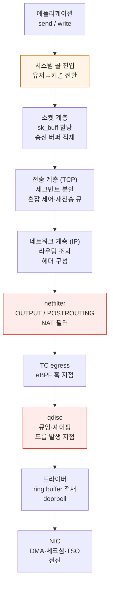
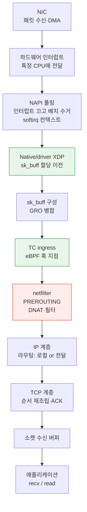

# 커널 네트워킹 스택

> **지원 버전**: Linux 6.1 / 6.12 / 6.18 (Amazon Linux 2023)
> **마지막 업데이트**: 2026년 9월 12일

## 이 문서에서 다루는 것

- `send()` 한 번이 NIC의 전선에 닿기까지 커널 안에서 지나는 경로와, 각 지점이 무엇을 하는가
- 그 경로 어디에 훅을 걸 수 있는가 — XDP, TC, netfilter의 위치가 성능 차이를 만드는 이유
- Pod 간 통신이 같은 노드·같은 AZ·다른 AZ에서 실제로 다른 경로를 지나는 이유

## 왜 경로를 알아야 하는가

"네트워크가 느리다"는 진단할 수 없는 문장입니다. 커널 네트워크 경로에는 **각각 다른 이유로 지연과 손실이 생기는 지점이 여러 개** 있고, 어느 지점인지에 따라 대응이 완전히 달라집니다.

| 증상 | 실제 지점 |
|---|---|
| 처리량이 어느 선에서 막힌다 | 소켓 버퍼, 또는 단일 플로우 한도 |
| 트래픽 폭주 시에만 드롭된다 | qdisc 큐 오버플로 또는 NIC ring buffer |
| CPU 하나만 100%다 | RSS/RPS 미설정 — 인터럽트가 한 코어에 몰림 |
| 작은 요청이 유독 느리다 | 고정 오버헤드(시스템 콜, 컨텍스트 스위치) 비중 |
| 규칙이 많아지자 느려졌다 | netfilter 룰 평가 |

경로를 알면 이 표를 거꾸로 읽어 "어디를 볼지"가 나옵니다.

## 송신 경로 — send()에서 전선까지



각 단계에서 실제로 무슨 일이 일어나는지가 진단의 근거입니다.

### ① 시스템 콜 진입 — 고정 오버헤드의 출처

`send()`는 시스템 콜이므로 유저 공간에서 커널로 전환됩니다. 이 전환 비용은 **전송하는 데이터 크기와 무관한 고정 비용**입니다.

그래서 **작은 요청이 많은 워크로드에서 이 비용의 비중이 커집니다.** 64바이트를 1만 번 보내는 것과 640KB를 한 번 보내는 것은 데이터양이 같아도 시스템 콜 횟수가 1만 배 차이납니다.

대응은 배치화입니다 — `sendmsg`/`sendmmsg`로 묶어 보내기, 애플리케이션 레벨에서 버퍼링, 또는 `io_uring`으로 제출 자체를 배치화.

### ② 소켓 계층 — sk_buff와 버퍼

커널은 패킷을 `sk_buff`(socket buffer) 구조체로 다룹니다. 데이터와 각 계층의 헤더 위치, 메타데이터를 담은 자료구조입니다. 경로 전체에서 이 구조체 포인터가 전달되며, **복사를 최소화하는 것이 설계 목표**입니다.

송신 버퍼가 차면 어떻게 되는가가 여기서 갈립니다.

- **블로킹 소켓**: `send()`가 대기합니다
- **논블로킹 소켓**: `EAGAIN`을 반환하고, 애플리케이션이 재시도해야 합니다

즉 소켓 버퍼 크기(`net.ipv4.tcp_wmem`)는 **애플리케이션이 얼마나 앞서 나갈 수 있는가**를 정합니다. BDP(대역폭 × 지연)보다 작으면 링크를 채우지 못합니다.

### ③ 전송 계층 (TCP) — 혼잡 제어가 사는 곳

TCP가 하는 일이 성능에 가장 크게 영향을 줍니다.

- 데이터를 MSS 단위 세그먼트로 나눕니다
- **혼잡 윈도(cwnd)**로 얼마나 앞서 보낼지 결정합니다
- 재전송 큐를 유지하고, ACK를 못 받으면 재전송합니다

혼잡 제어 알고리즘이 여기 있습니다. `cubic`이 오래 기본이었고, **`bbr`**이 대안입니다. 둘의 차이는 **혼잡을 무엇으로 판단하는가**입니다.

| 알고리즘 | 혼잡 신호 | 잘 맞는 환경 |
|---|---|---|
| **cubic** | **패킷 손실** | 손실이 혼잡을 의미하는 유선 환경 |
| **bbr** | **대역폭·RTT 추정** | 손실이 혼잡과 무관하게 생기는 환경(무선, 버퍼 얕은 경로), 긴 지연 경로 |

cubic의 전제는 "손실 = 혼잡"입니다. 그런데 손실이 다른 이유로 나는 경로에서는 cubic이 불필요하게 물러섭니다. bbr은 손실 대신 실측 대역폭과 최소 RTT로 판단해 이 문제를 피합니다.

VPC 내부 통신은 손실이 드문 품질 좋은 경로라 cubic으로도 대개 충분합니다. **리전 간이나 인터넷 경유처럼 지연이 길고 손실이 섞이는 경로에서 bbr의 이점이 나타납니다.**

### ④ 네트워크 계층 (IP) — 라우팅 조회

목적지로 가는 경로를 라우팅 테이블에서 찾습니다. **이 조회는 net namespace별**이라, Pod 안에서 보는 라우팅 테이블은 노드의 것이 아닙니다 ([컨테이너 커널 기능](./01-container-primitives.md)).

### ⑤ netfilter — 규칙이 평가되는 곳

`OUTPUT`과 `POSTROUTING` 훅에서 필터링과 NAT가 일어납니다. Kubernetes에서는 Service DNAT와 egress MASQUERADE가 이 지점입니다.

**여기가 규칙 수에 비례해 느려질 수 있는 지점입니다.** iptables 모드 kube-proxy에서 Service가 수천 개면 체인이 길어지고 선형 평가 비용이 붙습니다. nftables 모드와 eBPF 데이터플레인이 해결하려는 문제가 정확히 이것입니다.

### ⑥ qdisc — 드롭이 실제로 일어나는 곳

qdisc(queueing discipline)는 **패킷을 NIC로 보내기 전 큐에 넣고 순서와 속도를 정합니다.**

운영상 중요한 사실:

> Qdisc overflow는 burst drop의 가능한 원인 중 하나입니다. Qdisc·NIC/driver·stack·cloud-network counter를 함께 확인한 뒤 원인을 판단합니다.

qdisc 큐가 가득 차면 패킷을 버립니다. 이것은 NIC나 네트워크의 문제가 아니고 **노드 안에서 일어나는 드롭**입니다. 그래서 "네트워크가 패킷을 잃었다"고 생각하고 밖을 찾다가 시간을 버리기 쉽습니다.

**관측**: `tc -s qdisc show dev <iface>`의 `dropped` 카운터. `ip -s link`의 송신 드롭도 함께 봅니다.

qdisc 종류에 따라 성격이 다릅니다.

| qdisc | 성격 |
|---|---|
| `pfifo_fast` | 단순 FIFO(우선순위 3밴드). 오래된 기본값 |
| `fq_codel` | **버퍼블로트 완화** — 큐가 길어지면 능동적으로 드롭해 지연을 억제. 여러 배포판의 현대적 기본값 |
| `fq` | 플로우 공정 큐잉 + 페이싱. bbr과 함께 쓰기 좋음 |
| `mq` | 멀티큐 NIC에서 하드웨어 큐별 qdisc를 두는 래퍼 |

**버퍼블로트**는 이해할 가치가 있는 개념입니다. 큐를 크게 잡으면 드롭은 줄지만 **큐에서 기다리는 시간이 지연으로 나타납니다.** 처리량은 좋아 보이는데 지연이 나빠지는 상황입니다. `fq_codel`은 큐 지연을 감시해 일부러 드롭함으로써 TCP에게 "물러서라"는 신호를 빨리 주는 방식으로 이를 완화합니다.

### ⑦ 드라이버와 NIC — 오프로드

드라이버가 `sk_buff`를 ring buffer(디스크립터 링)에 넣고 NIC에 알립니다. NIC가 DMA로 메모리를 읽어 전송합니다.

NIC가 대신 해주는 일들이 **CPU 사용을 크게 줄입니다.**

| 오프로드 | 하는 일 |
|---|---|
| **TSO / GSO** | TSO는 지원 hardware에 segmentation을 위임하며 GSO는 kernel의 generic/software segmentation framework와 fallback입니다. 둘 다 NIC 전용 동작은 아닙니다 |
| **GRO** (Generic Receive Offload) | 수신 시 작은 패킷들을 **합쳐서** 스택에 올림 → 스택 통과 횟수 감소 |
| **체크섬 오프로드** | 체크섬 계산을 NIC가 수행 |
| **RSS** (Receive Side Scaling) | 수신 패킷을 **여러 큐/코어에 해시로 분산** |

TSO/GRO의 효과는 큽니다 — 스택을 통과하는 횟수를 줄이는 것이 곧 CPU 절약입니다. **관측**: `ethtool -k <iface>`로 현재 상태 확인.

## 수신 경로 — 인터럽트에서 애플리케이션까지

수신은 송신의 역순이지만 **인터럽트 처리라는 고유한 구조**가 있습니다.



### NAPI — 인터럽트 폭주를 막는 장치

패킷마다 인터럽트를 걸면 고부하에서 **인터럽트 처리만 하다 아무 일도 못 하는 상태**(livelock)가 됩니다.

NAPI가 이를 막습니다. 첫 인터럽트가 오면 **인터럽트를 끄고 폴링으로 전환**해 큐에 쌓인 패킷을 한 번에 여러 개 수거합니다. 큐가 비면 다시 인터럽트를 켭니다. 부하가 높을 때 자동으로 폴링 모드가 되는 구조입니다.

이것이 **고부하에서 오히려 효율이 좋아지는 이유**입니다. 배치가 커지면 패킷당 오버헤드가 내려갑니다.

### 인터럽트가 한 코어에 몰리는 문제

수신 인터럽트는 특정 CPU에 전달됩니다. 큐가 하나거나 분산이 설정되지 않으면 **그 코어만 100%가 되고 나머지는 놀게 됩니다.** 전체 CPU 사용률 그래프는 낮게 보이는데 처리량이 막힙니다.

해결 계층이 세 개입니다.

| 기능 | 계층 | 하는 일 |
|---|---|---|
| **RSS** | 하드웨어 | NIC가 해시로 여러 수신 큐에 분산, 각 큐를 다른 CPU가 처리 |
| **RPS** | 소프트웨어 | 커널이 수신 처리를 다른 CPU로 넘김 (RSS 없거나 큐가 적을 때) |
| **RFS** | 소프트웨어 | 해당 소켓을 **실제로 읽는 프로세스가 있는 CPU**로 보냄 → 캐시 지역성 향상 |

**진단**: `/proc/interrupts`로 인터럽트가 코어에 고르게 분포하는지, `mpstat -P ALL`로 특정 코어의 `%soft`(softirq)가 튀는지 확인합니다.

### 소켓 수신 버퍼와 백프레셔

애플리케이션이 `recv()`를 충분히 빠르게 부르지 않으면 수신 버퍼가 찹니다. TCP는 **수신 윈도를 줄여** 상대에게 "천천히 보내라"고 알립니다(백프레셔).

여기서 자주 오해되는 지점: **이 상황에서 지연이 늘어나는 원인은 네트워크가 아니라 애플리케이션입니다.** 애플리케이션이 처리를 못 따라가서 큐가 쌓인 것이고, 버퍼를 키우면 지연이 더 늘어납니다(버퍼블로트와 같은 구조). 근본 대응은 처리 능력을 늘리는 것입니다.

## 훅 지점 비교 — XDP, TC, netfilter

같은 "패킷을 가로채 처리한다"인데 **위치가 성능과 가능한 일을 결정합니다.**

| 항목 | **XDP** | **TC (eBPF)** | **netfilter** |
|---|---|---|---|
| **위치** | Native/driver XDP: `sk_buff` 이전. Generic XDP: skb 기반 | `sk_buff` 생성 후 ingress/egress | Stack hook |
| **방향** | ingress 중심 | ingress + egress | 전 방향 |
| **성능** | **가장 빠름** — 스택을 안 타고 즉시 드롭/전달 가능 | 빠름 | 상대적으로 느림 (규칙 수 영향) |
| **볼 수 있는 정보** | 원시 패킷 (메타데이터 제한적) | `sk_buff` 메타데이터 전체 | 연결 상태(conntrack) 포함 |
| **주 용도** | **DDoS 드롭**, 로드밸런싱, 패킷 리다이렉트 | 정책 집행, 관측, 리다이렉트 | NAT, 상태 기반 필터 |
| **Hardware offload** | 일부 driver/NIC 조합 | 일부 | 일부 nftables flowtable offload. 모든 rule/path는 아님 |

조기 drop의 장점은 skb 할당 이전의 **native/driver XDP** 설명입니다. Generic XDP에는 이미 skb가 있으며 실제 성능은 driver 지원과 프로그램 처리에 달려 있습니다. 한 mode의 설명을 보편적인 benchmark 결과로 사용하지 않습니다.

XDP가 모든 socket/stack 문맥을 자동으로 받는 것은 아니지만 BPF map으로 상태를 유지하고 지원 helper로 정보를 얻을 수 있습니다. **XDP의 상태 기반 처리가 본질적으로 불가능한 것은 아닙니다.** 실제 프로그램·kernel·verifier·driver 제약을 평가합니다.

Cilium이 두 훅을 함께 쓰는 이유가 여기 있습니다 — 가능한 것은 XDP에서 빠르게 처리하고, 상태나 L7 정보가 필요한 것은 TC 이후로 넘깁니다 ([Cilium eBPF](../networking/cilium/02-ebpf.md), [Cilium L2-L7 네트워킹](../networking/cilium/05-l2-l7-networking.md)).

## Pod 간 통신 — 경로가 왜 다른가

Kubernetes에서 Pod 간 통신은 배치에 따라 **실제로 다른 커널 경로**를 지납니다. 이것이 [Pod 네트워크 실측 벤치마크](../networking/06-pod-network-benchmark.md)에서 관측된 RTT 사다리(같은 노드 0.040 ms → 같은 AZ 0.339 ms → 다른 AZ 0.544 ms)의 원인입니다.

### 같은 노드의 Pod 간

```text
Pod A [net ns A] → veth A → (노드 net ns) → veth B → Pod B [net ns B]
```

그림의 일반 veth/routed 동일 노드 경로는 물리 NIC를 통과할 필요가 없습니다. 다른 dataplane·overlay·SR-IOV·policy/service 우회 경로는 달라질 수 있으며 가상 장치도 kernel driver 처리를 거칩니다.

벤치마크에서 같은 노드 단일 플로우가 **29.97 Gbps**까지 나온 것(다른 노드는 4.96 Gbps에서 EC2 단일 플로우 한도에 막힘)이 이 때문입니다. 병목이 네트워크가 아니라 **CPU**였습니다 — 클라이언트 코어 하나가 99.8%였습니다.

### 다른 노드의 Pod 간 (VPC CNI)

```text
Pod A → veth → 노드 net ns → ENI → VPC 네트워크 → 대상 ENI → veth → Pod B
```

Amazon VPC CNI에서 Pod는 **VPC의 실제 IP**를 받으므로 오버레이 캡슐화가 없습니다. 오버레이(VXLAN 등)를 쓰는 CNI 대비 캡슐화·역캡슐화 비용과 MTU 손실이 없다는 것이 VPC CNI의 구조적 이점입니다 ([VPC CNI](../networking/01-vpc-cni.md)).

대신 여기서는 송신 경로 전체(qdisc, 드라이버, NIC)를 지나고, **EC2 인스턴스의 네트워크 한도**를 받습니다 — 단일 플로우 상한, 인스턴스 총 대역폭, PPS 한도.

### AZ를 넘을 때

인용한 단일 flow 실험에서는 RTT +0.21 ms와 두 cross-node 배치의 약 4.96 Gbps를 관측했습니다. 해당 instance·부하·경로의 결과이며 모든 cross-AZ 워크로드의 처리량이 같다는 증명은 아닙니다.

### MTU와 단편화

패킷이 경로 최소 MTU보다 크면 단편화되거나 드롭됩니다. **점보 프레임(9001)**을 VPC 내부에서 쓸 수 있지만, 경로에 더 작은 MTU가 섞이면 문제가 됩니다.

특히 주의할 것이 **PMTUD(Path MTU Discovery)의 실패**입니다. 경로 MTU를 알려주는 ICMP가 차단되면 송신 측은 계속 큰 패킷을 보내고, 그것이 중간에서 드롭되면서 **연결이 멈춘 것처럼 보입니다.** "핸드셰이크는 되는데 데이터 전송에서 멈춘다"는 증상의 전형적 원인입니다 — 작은 패킷(핸드셰이크)은 통과하고 큰 패킷만 드롭되기 때문입니다.

## 관측 도구 정리

계층별로 봐야 할 것이 다릅니다.

| 계층 | 도구 | 무엇을 보는가 |
|---|---|---|
| 소켓 | `ss -tin` | 연결 상태, cwnd, RTT, 재전송 |
| TCP 전역 | `nstat` / `netstat -s` | 재전송, 순서 어긋남, 버퍼 오버런 |
| netfilter | `iptables-save`, `nft list ruleset` | 규칙 수와 내용 |
| conntrack | `conntrack -S` | **`insert_failed`** — 포화 증거 |
| qdisc | `tc -s qdisc show dev <if>` | **`dropped`** — 노드 내 드롭 |
| 인터페이스 | `ip -s link`, `ethtool -S <if>` | 인터페이스·NIC 카운터 |
| 오프로드 | `ethtool -k <if>` | TSO/GRO/체크섬 상태 |
| 인터럽트 | `/proc/interrupts`, `mpstat -P ALL` | 코어 편중, softirq 비중 |
| 경로 추적 | `tcpdump`, `ss`, eBPF 도구 | 실제 패킷 |

Drop counter부터 확인한 뒤 시각·interface/namespace·traffic·resource pressure와 대조합니다. Counter 증가는 조사할 증거이지 유일한 원인의 증명은 아니며 counter 부재가 다른 곳의 손실을 배제하지도 않습니다. 필요하면 RTT/cwnd·앱 지표·packet capture를 사용합니다.

## 정리

- 송신은 **시스템 콜 → 소켓 → TCP → IP → netfilter → TC → qdisc → 드라이버 → NIC** 순서입니다. 각 지점이 다른 이유로 문제를 만듭니다.
- **트래픽 폭주 시 드롭은 대개 qdisc에서** 일어납니다. 노드 안의 문제인데 네트워크 밖을 찾다가 시간을 버리기 쉽습니다.
- 수신은 **NAPI**가 인터럽트 폭주를 막고, 인터럽트가 한 코어에 몰리는 문제는 **RSS/RPS/RFS**로 분산합니다.
- 훅 지점의 성능 차이는 위치에서 나옵니다 — **XDP는 `sk_buff` 할당 전**이라 가장 빠르지만 conntrack 상태를 모릅니다.
- Pod 간 통신은 배치에 따라 **다른 경로**를 지납니다. 같은 노드는 veth만 지나 NIC를 건드리지 않고, 그래서 병목이 네트워크가 아니라 CPU입니다.
- **PMTUD 실패는 "핸드셰이크는 되는데 데이터에서 멈춘다"로 나타납니다.**

다음: [EKS 노드 커널 튜닝](./03-eks-node-tuning.md)에서 이 경로의 어느 파라미터를 언제 건드려야 하는지 봅니다.

## 참고 자료

- [Linux Networking Documentation — Kernel](https://docs.kernel.org/networking/index.html)
- [NAPI — Linux kernel documentation](https://docs.kernel.org/networking/napi.html)
- [Scaling in the Linux Networking Stack (RSS/RPS/RFS)](https://docs.kernel.org/networking/scaling.html)
- [XDP — eXpress Data Path](https://docs.kernel.org/networking/af_xdp.html)
- [BBR congestion control](https://datatracker.ietf.org/doc/draft-cardwell-iccrg-bbr-congestion-control/)
- [Pod 네트워크 실측 벤치마크](../networking/06-pod-network-benchmark.md)
- [eBPF 기초와 실무 활용](../basics/05-ebpf-fundamentals.md)


- [Linux segmentation offload](https://docs.kernel.org/networking/segmentation-offloads.html) — hardware TSO와 software GSO
- [Linux IP sysctl](https://docs.kernel.org/networking/ip-sysctl.html) — TCP buffer 크기와 socket override
