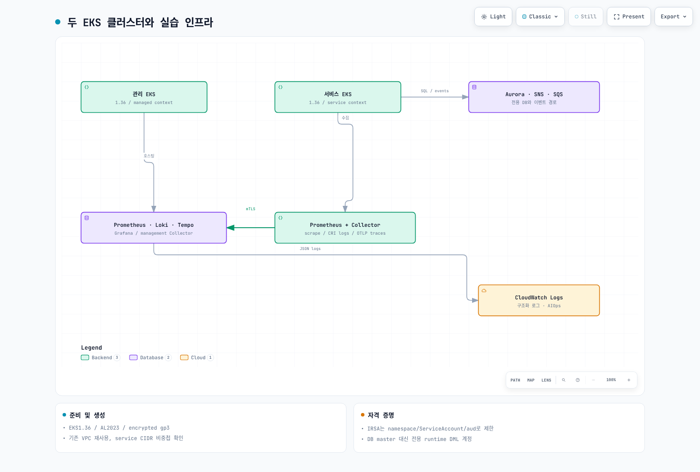

# Part 1: 인프라 구성

<span id="aws-managed-services-상태-확인"></span>
<span id="eksctl을-사용한-클러스터-생성"></span>
<span id="step-1-1-managed-cluster-생성"></span>
<span id="step-1-10-argo-rollouts-설치"></span>
<span id="step-1-2-service-cluster-생성"></span>
<span id="step-1-3-sqs-큐-sns-토픽-생성"></span>
<span id="step-1-4-aurora-postgresql-생성"></span>
<span id="step-1-5-mwaa-환경-생성"></span>
<span id="step-1-6-amp-워크스페이스-생성"></span>
<span id="step-1-7-amg-워크스페이스-생성"></span>
<span id="step-1-8-opensearch-도메인-생성"></span>
<span id="step-1-9-argocd-설치-및-멀티-클러스터-등록"></span>
<span id="terraform을-사용한-클러스터-생성-대안"></span>
<span id="검증-verification"></span>
<span id="구성-단계-요약"></span>
<span id="다음-단계"></span>
<span id="아키텍처-개요"></span>
<span id="예상-결과"></span>
<span id="정리-이-part에서-정리하지-않음"></span>
<span id="참조-문서"></span>
<span id="클러스터-상태-확인"></span>
<span id="학습-목표"></span>

> **난이도**: 고급
> **마지막 업데이트**: 2026년 9월 13일
두 EKS 클러스터와 전용 실습 DB·메시지 경로를 준비합니다. 실행 파일은 [application 예제](https://github.com/Atom-oh/kubernetes-docs/tree/main/examples/labs/observability/application)에 있습니다. 과금되는 리소스 생성 전에 계정·리전·네트워크·권한과 정리 계획을 검토합니다. 이 감사에서는 실제 AWS 리소스를 생성하지 않았습니다.



[🔍 인터랙티브 다이어그램 보기](https://www.atomai.click/kubernetes-docs/archmaps/ko-labs-observability-01-infrastructure-setup-lab-0.html)

## 1. 환경과 소유권 확인 {#prerequisites}

AWS CLI v2, eksctl 0.229.0, kubectl 1.36.2, Helm 3.21.3, Python 3.12, Docker, Git, jq를 기준으로 예제를 검토했습니다. EKS 1.36은 검토일의 표준 지원 대상입니다. 이전 1.31은 확장 지원이며 “이미 지원 종료”로 혼동하지 않습니다. 실행 시점의 지원 버전·리전 가용성을 다시 확인합니다.

```bash
aws --version
eksctl version
kubectl version --client
helm version
python3 --version
aws sts get-caller-identity
```
승인된 임시 역할을 사용하고 EKS·EC2/VPC·CloudFormation·IAM/PassRole·RDS·SNS/SQS·KMS·Logs의 필요한 작업을 배포 계획에 맞춰 검토합니다. 모든 서비스의 FullAccess를 일괄 부여하거나 새 장기 IAM access key를 만들지 않습니다.

```bash
umask 077
export LAB_STATE="$(mktemp -d "$PWD/obs-lab.XXXXXXXX")"
# Set AWS_REGION, EXPECTED_ACCOUNT_ID and a unique LAB_PREFIX first.
test "$(aws sts get-caller-identity --query Account --output text)" = "$EXPECTED_ACCOUNT_ID"
```

## 2. 네트워크와 두 클러스터 {#clusters}

이 예제는 검토한 기존 VPC와 서로 다른 AZ의 private subnet 2개를 재사용합니다. NAT 또는 필요한 VPC endpoint, DNS, 주소 여유, SG/NACL을 먼저 준비합니다. 두 Kubernetes service CIDR은 172.20.0.0/16과 172.21.0.0/16이며 실제 VPC·연결 네트워크와 겹치지 않아야 합니다. 다른 VPC를 사용하면 peering/TGW·양방향 route·DNS·source IP 처리를 별도로 검증합니다.

```bash
cd examples/labs/observability/application
python3 prepare_clusters.py --region "$AWS_REGION" --vpc-id "$VPC_ID" \
  --subnet-a "$PRIVATE_SUBNET_A" --az-a "$AZ_A" \
  --subnet-b "$PRIVATE_SUBNET_B" --az-b "$AZ_B" \
  --client-cidr "$CLIENT_CIDR" --prefix "$LAB_PREFIX" \
  --output-directory "$LAB_STATE/clusters"
```
생성기는 EKS1.36, API access entry, OIDC, AL2023 관리형 노드, 암호화 gp3와 좁은 public API client CIDR을 지정합니다. 기본 노드 크기·개수는 실습 설정이며 수용량 측정치가 아닙니다. JSON과 비용을 검토한 뒤 생성합니다. 실패 시 같은 이름의 부분 생성 리소스를 확인하고 새 이름으로 중복 생성하지 않습니다.

```bash
eksctl create cluster -f "$LAB_STATE/clusters/managed.json" --write-kubeconfig=false
eksctl create cluster -f "$LAB_STATE/clusters/service.json" --write-kubeconfig=false
export KUBECONFIG="$LAB_STATE/kubeconfig"
aws eks update-kubeconfig --name "$LAB_PREFIX-managed" --alias managed --kubeconfig "$KUBECONFIG"
aws eks update-kubeconfig --name "$LAB_PREFIX-service" --alias service --kubeconfig "$KUBECONFIG"
kubectl --context managed get nodes
kubectl --context service get nodes
```
기존 [EKS 생성 가이드](../../eks/02-eks-cluster-creation-part1.md)와 [클러스터 실습](../eks/01-eks-cluster-creation-lab.md)의 계정/endpoint/소유권 검사를 함께 적용합니다. 두 context가 의도한 서로 다른 클러스터인지 확인합니다.

## 3. 스토리지·LB·OIDC 전제 {#platform-prerequisites}

EBS CSI와 검토한 `gp3` StorageClass, NetworkPolicy를 실제 적용하는 CNI, AWS Load Balancer Controller(`service.k8s.aws/nlb`)가 필요합니다. 공유 StorageClass를 무작정 덮지 않습니다. 관리/서비스 OIDC issuer와 대응 IAM provider ARN을 확보합니다. issuer는 `https://`를 제거한 host/path이며 provider ARN suffix와 일치해야 합니다.

```bash
aws eks describe-cluster --name "$LAB_PREFIX-managed" --query cluster.identity.oidc.issuer --output text
aws eks describe-cluster --name "$LAB_PREFIX-service" --query cluster.identity.oidc.issuer --output text
kubectl --context managed get storageclass gp3
kubectl --context service get storageclass gp3
```

## 4. Aurora·SNS/SQS·역할 {#managed-resources}

`application/infra.yaml`은 private Aurora writer, 관리형 master Secret, SNS fanout, 소비자별 queue/DLQ, CloudWatch log group과 역할을 생성합니다. DB 접근 SG는 실제 서비스 노드 SG만 허용합니다. 단일 writer 실습을 Multi-AZ HA라고 표시하지 않습니다. 지원되는 Aurora engine version은 리전에서 확인해 명시적으로 입력합니다.

```bash
aws rds describe-db-engine-versions --engine aurora-postgresql \
  --query "DBEngineVersions[].EngineVersion" --output table
```
템플릿의 VpcId, PrivateSubnetIds, ServiceNodeSecurityGroupId, AuroraEngineVersion, 두 OIDC provider/issuer 값을 채워 CloudFormation change set을 검토·실행합니다. ARN·서비스 계정·account가 같은 리소스를 가리키는지 확인합니다. 런타임 앱 역할, KEDA의 queue 조회 역할, 관리 Collector 로그 역할은 다릅니다.

```bash
aws cloudformation describe-stacks --stack-name "$LAB_STACK" \
  --query "Stacks[0].Outputs" --output json > "$LAB_STATE/infra-outputs.json"
```

Part 2의 Collector IAM 설정도 여기서 생성합니다. 사용할 이미지 저장소와 불변 tag를 먼저 정하고, 실제 빌드·push는 Part 3에서 수행합니다.

```bash
python3.12 -m venv .venv
.venv/bin/python -m pip install -r requirements.txt PyYAML==6.0.3
.venv/bin/python prepare_values.py --outputs-file "$LAB_STATE/infra-outputs.json"   --region "$AWS_REGION" --image-repository "$IMAGE_REPOSITORY"   --image-tag "$IMAGE_TAG" --output-directory "$LAB_STATE/helm-inputs"
```

## 5. DB 런타임 계정·다음 단계 {#database-and-next}

master Secret은 승인된 환경에서만 읽어 비공개 JSON connection file에 저장합니다. RDS CA bundle과 `sslmode=verify-full`을 사용합니다. [bootstrap_db.py 절차](https://github.com/Atom-oh/kubernetes-docs/tree/main/examples/labs/observability/application#infrastructure-and-credentials)는 전용 `lab_runtime` DML 계정을 생성하고 기존 비밀번호를 덮어쓰지 않습니다. 런타임 JSON의 CA 경로는 Pod 내부 `/run/database-ca/global-bundle.pem`으로 맞춥니다.

스택·클러스터·보존 snapshot·IAM attachment·LB/PVC를 소유권 inventory에 기록합니다. EKS/노드/NAT/EBS/Aurora/Logs/SNS/SQS/KMS/전송 비용은 실제 리전·사용량으로 산정합니다. 고정 시간당 합계나 AMG 사용자 월요금을 시간당 workspace 가격으로 변환하지 않습니다. [Part 2](./02-observability-stack-lab.md)에서 관측 경로를 연결합니다.

## 검증 범위

eksctl 스키마·CloudFormation lint·역할 구조와 로컬 PostgreSQL 동작을 확인했습니다. 실제 EKS/VPC/OIDC/IRSA/Aurora/TLS/할당량·생성 시간은 검증하지 않았습니다.
