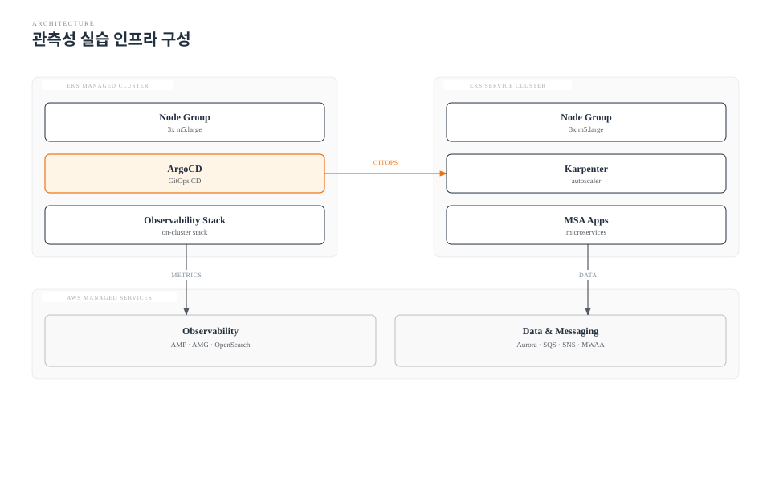

# Part 1: 인프라 구성

> **난이도**: 중급 (Intermediate) **예상 소요 시간**: 60분 **마지막 업데이트**: 2026년 2월 23일

## 학습 목표

* 2개의 EKS 클러스터(Managed Cluster, Service Cluster) 프로비저닝
* AWS Managed Services(Aurora, SQS/SNS, MWAA, AMP, AMG, OpenSearch) 구성
* ArgoCD 멀티 클러스터 등록 및 Argo Rollouts 설치

## 아키텍처 개요




***

## 구성 단계 요약

| Step | 리소스                   | 도구               | 상세                       |
| ---- | --------------------- | ---------------- | ------------------------ |
| 1.1  | Managed Cluster (EKS) | Terraform/eksctl | VPC, EKS, IRSA           |
| 1.2  | Service Cluster (EKS) | Terraform/eksctl | VPC, EKS, Karpenter IRSA |
| 1.3  | SQS 큐 + SNS 토픽        | Terraform        | 메시지 큐 구성                 |
| 1.4  | Aurora PostgreSQL     | Terraform        | 데이터베이스                   |
| 1.5  | MWAA 환경               | Terraform        | Airflow 환경               |
| 1.6  | AMP 워크스페이스            | Terraform/CLI    | Prometheus 백엔드           |
| 1.7  | AMG 워크스페이스            | Terraform/CLI    | Grafana 백엔드              |
| 1.8  | OpenSearch 도메인        | Terraform        | 로그 저장소                   |
| 1.9  | ArgoCD                | Helm             | GitOps 컨트롤러              |
| 1.10 | Argo Rollouts         | Helm             | Progressive Delivery     |

***

## Step 1.1: Managed Cluster 생성

### eksctl을 사용한 클러스터 생성

**Step 1.1.1: eksctl 클러스터 설정 파일 생성**

```yaml
# managed-cluster.yaml
apiVersion: eksctl.io/v1alpha5
kind: ClusterConfig

metadata:
  name: obs-managed-cluster
  region: us-east-1
  version: "1.29"

vpc:
  cidr: 10.10.0.0/16
  nat:
    gateway: Single

iam:
  withOIDC: true

managedNodeGroups:
  - name: managed-ng
    instanceType: m5.large
    desiredCapacity: 3
    minSize: 2
    maxSize: 5
    volumeSize: 100
    volumeType: gp3
    labels:
      role: observability
    tags:
      Environment: lab
      Purpose: observability
    iam:
      attachPolicyARNs:
        - arn:aws:iam::aws:policy/AmazonEKSWorkerNodePolicy
        - arn:aws:iam::aws:policy/AmazonEKS_CNI_Policy
        - arn:aws:iam::aws:policy/AmazonEC2ContainerRegistryReadOnly
        - arn:aws:iam::aws:policy/AmazonPrometheusRemoteWriteAccess
        - arn:aws:iam::aws:policy/CloudWatchAgentServerPolicy

addons:
  - name: vpc-cni
    version: latest
  - name: coredns
    version: latest
  - name: kube-proxy
    version: latest
  - name: aws-ebs-csi-driver
    version: latest
    serviceAccountRoleARN: arn:aws:iam::${AWS_ACCOUNT_ID}:role/AmazonEKS_EBS_CSI_DriverRole
```

**Step 1.1.2: 클러스터 생성 실행**

```bash
# 환경 변수 설정
export AWS_ACCOUNT_ID=$(aws sts get-caller-identity --query Account --output text)
export AWS_REGION=us-east-1

# 클러스터 설정 파일의 변수 치환
envsubst < managed-cluster.yaml > managed-cluster-final.yaml

# 클러스터 생성 (~20분 소요)
eksctl create cluster -f managed-cluster-final.yaml

# kubeconfig 설정
aws eks update-kubeconfig --name obs-managed-cluster --region $AWS_REGION --alias managed
```

### Terraform을 사용한 클러스터 생성 (대안)

```hcl
# main.tf - Managed Cluster
terraform {
  required_providers {
    aws = {
      source  = "hashicorp/aws"
      version = "~> 5.0"
    }
  }
}

provider "aws" {
  region = var.aws_region
}

variable "aws_region" {
  default = "us-east-1"
}

variable "cluster_name" {
  default = "obs-managed-cluster"
}

# VPC Module
module "vpc" {
  source  = "terraform-aws-modules/vpc/aws"
  version = "~> 5.0"

  name = "${var.cluster_name}-vpc"
  cidr = "10.10.0.0/16"

  azs             = ["${var.aws_region}a", "${var.aws_region}b", "${var.aws_region}c"]
  private_subnets = ["10.10.1.0/24", "10.10.2.0/24", "10.10.3.0/24"]
  public_subnets  = ["10.10.101.0/24", "10.10.102.0/24", "10.10.103.0/24"]

  enable_nat_gateway   = true
  single_nat_gateway   = true
  enable_dns_hostnames = true

  public_subnet_tags = {
    "kubernetes.io/role/elb" = 1
  }

  private_subnet_tags = {
    "kubernetes.io/role/internal-elb" = 1
  }

  tags = {
    Environment = "lab"
    Terraform   = "true"
  }
}

# EKS Module
module "eks" {
  source  = "terraform-aws-modules/eks/aws"
  version = "~> 20.0"

  cluster_name    = var.cluster_name
  cluster_version = "1.29"

  vpc_id     = module.vpc.vpc_id
  subnet_ids = module.vpc.private_subnets

  cluster_endpoint_public_access = true

  enable_cluster_creator_admin_permissions = true

  eks_managed_node_groups = {
    managed = {
      instance_types = ["m5.large"]
      min_size       = 2
      max_size       = 5
      desired_size   = 3

      labels = {
        role = "observability"
      }
    }
  }

  tags = {
    Environment = "lab"
  }
}

# IRSA for AMP
module "amp_irsa" {
  source  = "terraform-aws-modules/iam/aws//modules/iam-role-for-service-accounts-eks"
  version = "~> 5.0"

  role_name = "${var.cluster_name}-amp-role"

  attach_amazon_managed_service_prometheus_policy = true

  oidc_providers = {
    main = {
      provider_arn               = module.eks.oidc_provider_arn
      namespace_service_accounts = ["monitoring:prometheus"]
    }
  }
}

output "cluster_endpoint" {
  value = module.eks.cluster_endpoint
}

output "cluster_name" {
  value = module.eks.cluster_name
}
```

```bash
# Terraform 실행
cd terraform/managed-cluster
terraform init
terraform plan
terraform apply -auto-approve
```

***

## Step 1.2: Service Cluster 생성

**Step 1.2.1: eksctl 클러스터 설정 파일 생성**

```yaml
# service-cluster.yaml
apiVersion: eksctl.io/v1alpha5
kind: ClusterConfig

metadata:
  name: obs-service-cluster
  region: us-east-1
  version: "1.29"

vpc:
  cidr: 10.20.0.0/16
  nat:
    gateway: Single

iam:
  withOIDC: true
  serviceAccounts:
    - metadata:
        name: karpenter
        namespace: karpenter
      roleName: KarpenterControllerRole-obs-service
      attachPolicyARNs:
        - arn:aws:iam::${AWS_ACCOUNT_ID}:policy/KarpenterControllerPolicy
      wellKnownPolicies:
        karpenterController: true

managedNodeGroups:
  - name: system-ng
    instanceType: m5.large
    desiredCapacity: 3
    minSize: 2
    maxSize: 5
    volumeSize: 100
    volumeType: gp3
    labels:
      role: system
    taints:
      - key: CriticalAddonsOnly
        value: "true"
        effect: PreferNoSchedule
    tags:
      Environment: lab
      Purpose: service

karpenter:
  version: 'v0.35.0'
  createServiceAccount: true
  withSpotInterruptionQueue: true
```

**Step 1.2.2: 클러스터 생성 및 Karpenter 설정**

```bash
# Service Cluster 생성
envsubst < service-cluster.yaml > service-cluster-final.yaml
eksctl create cluster -f service-cluster-final.yaml

# kubeconfig 추가
aws eks update-kubeconfig --name obs-service-cluster --region $AWS_REGION --alias service

# Karpenter NodePool 생성
cat <<EOF | kubectl --context service apply -f -
apiVersion: karpenter.sh/v1
kind: NodePool
metadata:
  name: default
spec:
  template:
    spec:
      requirements:
        - key: kubernetes.io/arch
          operator: In
          values: ["amd64"]
        - key: karpenter.sh/capacity-type
          operator: In
          values: ["on-demand", "spot"]
        - key: node.kubernetes.io/instance-type
          operator: In
          values: ["m5.large", "m5.xlarge", "m5.2xlarge", "m6i.large", "m6i.xlarge"]
      nodeClassRef:
        name: default
  limits:
    cpu: 100
    memory: 200Gi
  disruption:
    consolidationPolicy: WhenUnderutilized
    consolidateAfter: 30s
---
apiVersion: karpenter.k8s.aws/v1
kind: EC2NodeClass
metadata:
  name: default
spec:
  amiFamily: AL2
  subnetSelectorTerms:
    - tags:
        karpenter.sh/discovery: obs-service-cluster
  securityGroupSelectorTerms:
    - tags:
        karpenter.sh/discovery: obs-service-cluster
  role: KarpenterNodeRole-obs-service
  tags:
    Environment: lab
EOF
```

***

## Step 1.3: SQS 큐 + SNS 토픽 생성

**Step 1.3.1: Terraform으로 SQS/SNS 생성**

```hcl
# messaging.tf
# SQS Queue for Order Events
resource "aws_sqs_queue" "order_events" {
  name                       = "obs-lab-order-events"
  delay_seconds              = 0
  max_message_size           = 262144
  message_retention_seconds  = 345600
  receive_wait_time_seconds  = 10
  visibility_timeout_seconds = 30

  redrive_policy = jsonencode({
    deadLetterTargetArn = aws_sqs_queue.order_events_dlq.arn
    maxReceiveCount     = 3
  })

  tags = {
    Environment = "lab"
    Purpose     = "observability"
  }
}

resource "aws_sqs_queue" "order_events_dlq" {
  name = "obs-lab-order-events-dlq"

  tags = {
    Environment = "lab"
  }
}

# SNS Topic for Payment Notifications
resource "aws_sns_topic" "payment_notifications" {
  name = "obs-lab-payment-notifications"

  tags = {
    Environment = "lab"
  }
}

# SNS Topic for Alerts
resource "aws_sns_topic" "alerts" {
  name = "obs-lab-alerts"

  tags = {
    Environment = "lab"
  }
}

# Email Subscription for Alerts
resource "aws_sns_topic_subscription" "alert_email" {
  topic_arn = aws_sns_topic.alerts.arn
  protocol  = "email"
  endpoint  = var.alert_email
}

# SQS Policy for cross-account access from EKS
resource "aws_sqs_queue_policy" "order_events_policy" {
  queue_url = aws_sqs_queue.order_events.id

  policy = jsonencode({
    Version = "2012-10-17"
    Statement = [
      {
        Effect = "Allow"
        Principal = {
          AWS = "arn:aws:iam::${data.aws_caller_identity.current.account_id}:root"
        }
        Action   = "sqs:*"
        Resource = aws_sqs_queue.order_events.arn
      }
    ]
  })
}

output "sqs_queue_url" {
  value = aws_sqs_queue.order_events.url
}

output "sqs_queue_arn" {
  value = aws_sqs_queue.order_events.arn
}

output "sns_topic_arn" {
  value = aws_sns_topic.payment_notifications.arn
}

output "alerts_topic_arn" {
  value = aws_sns_topic.alerts.arn
}
```

**Step 1.3.2: IRSA for SQS/SNS 접근**

```bash
# Service Cluster에서 SQS/SNS 접근을 위한 IAM 정책
cat > sqs-sns-policy.json << 'EOF'
{
  "Version": "2012-10-17",
  "Statement": [
    {
      "Effect": "Allow",
      "Action": [
        "sqs:SendMessage",
        "sqs:ReceiveMessage",
        "sqs:DeleteMessage",
        "sqs:GetQueueAttributes",
        "sqs:GetQueueUrl"
      ],
      "Resource": "arn:aws:sqs:*:*:obs-lab-*"
    },
    {
      "Effect": "Allow",
      "Action": [
        "sns:Publish"
      ],
      "Resource": "arn:aws:sns:*:*:obs-lab-*"
    }
  ]
}
EOF

aws iam create-policy \
  --policy-name ObsLabSQSSNSPolicy \
  --policy-document file://sqs-sns-policy.json

# IRSA 설정
eksctl create iamserviceaccount \
  --cluster=obs-service-cluster \
  --namespace=msa \
  --name=msa-service-account \
  --attach-policy-arn=arn:aws:iam::${AWS_ACCOUNT_ID}:policy/ObsLabSQSSNSPolicy \
  --approve
```

***

## Step 1.4: Aurora PostgreSQL 생성

**Step 1.4.1: Terraform으로 Aurora 클러스터 생성**

```hcl
# aurora.tf
# DB Subnet Group
resource "aws_db_subnet_group" "aurora" {
  name       = "obs-lab-aurora-subnet-group"
  subnet_ids = module.vpc_service.private_subnets

  tags = {
    Environment = "lab"
  }
}

# Security Group for Aurora
resource "aws_security_group" "aurora" {
  name        = "obs-lab-aurora-sg"
  description = "Security group for Aurora PostgreSQL"
  vpc_id      = module.vpc_service.vpc_id

  ingress {
    from_port       = 5432
    to_port         = 5432
    protocol        = "tcp"
    security_groups = [module.eks_service.cluster_security_group_id]
  }

  egress {
    from_port   = 0
    to_port     = 0
    protocol    = "-1"
    cidr_blocks = ["0.0.0.0/0"]
  }

  tags = {
    Environment = "lab"
  }
}

# Aurora Cluster
resource "aws_rds_cluster" "aurora" {
  cluster_identifier     = "obs-lab-aurora"
  engine                 = "aurora-postgresql"
  engine_version         = "15.4"
  database_name          = "obslab"
  master_username        = "obsadmin"
  master_password        = var.db_password
  db_subnet_group_name   = aws_db_subnet_group.aurora.name
  vpc_security_group_ids = [aws_security_group.aurora.id]

  backup_retention_period = 7
  preferred_backup_window = "03:00-04:00"
  skip_final_snapshot     = true

  enabled_cloudwatch_logs_exports = ["postgresql"]

  tags = {
    Environment = "lab"
  }
}

# Aurora Instances
resource "aws_rds_cluster_instance" "aurora" {
  count              = 2
  identifier         = "obs-lab-aurora-${count.index}"
  cluster_identifier = aws_rds_cluster.aurora.id
  instance_class     = "db.r5.large"
  engine             = aws_rds_cluster.aurora.engine
  engine_version     = aws_rds_cluster.aurora.engine_version

  performance_insights_enabled = true

  tags = {
    Environment = "lab"
  }
}

output "aurora_endpoint" {
  value = aws_rds_cluster.aurora.endpoint
}

output "aurora_reader_endpoint" {
  value = aws_rds_cluster.aurora.reader_endpoint
}
```

**Step 1.4.2: 데이터베이스 초기화**

```bash
# Aurora 엔드포인트 확인
export AURORA_ENDPOINT=$(terraform output -raw aurora_endpoint)

# kubectl port-forward를 통한 접속 (또는 Bastion 사용)
kubectl --context service run -it --rm psql-client \
  --image=postgres:15 \
  --restart=Never \
  -- psql -h $AURORA_ENDPOINT -U obsadmin -d obslab

# 테이블 생성
CREATE TABLE orders (
    id SERIAL PRIMARY KEY,
    customer_id VARCHAR(50) NOT NULL,
    product_id VARCHAR(50) NOT NULL,
    quantity INT NOT NULL,
    status VARCHAR(20) DEFAULT 'pending',
    created_at TIMESTAMP DEFAULT CURRENT_TIMESTAMP,
    updated_at TIMESTAMP DEFAULT CURRENT_TIMESTAMP
);

CREATE TABLE payments (
    id SERIAL PRIMARY KEY,
    order_id INT REFERENCES orders(id),
    amount DECIMAL(10,2) NOT NULL,
    status VARCHAR(20) DEFAULT 'pending',
    payment_method VARCHAR(20),
    created_at TIMESTAMP DEFAULT CURRENT_TIMESTAMP
);

CREATE INDEX idx_orders_customer ON orders(customer_id);
CREATE INDEX idx_orders_status ON orders(status);
CREATE INDEX idx_payments_order ON payments(order_id);
```

***

## Step 1.5: MWAA 환경 생성

**Step 1.5.1: MWAA S3 버킷 및 환경**

```hcl
# mwaa.tf
# S3 Bucket for DAGs
resource "aws_s3_bucket" "mwaa_dags" {
  bucket = "obs-lab-mwaa-dags-${data.aws_caller_identity.current.account_id}"

  tags = {
    Environment = "lab"
  }
}

resource "aws_s3_bucket_versioning" "mwaa_dags" {
  bucket = aws_s3_bucket.mwaa_dags.id
  versioning_configuration {
    status = "Enabled"
  }
}

# MWAA Execution Role
resource "aws_iam_role" "mwaa_execution" {
  name = "obs-lab-mwaa-execution-role"

  assume_role_policy = jsonencode({
    Version = "2012-10-17"
    Statement = [
      {
        Action = "sts:AssumeRole"
        Effect = "Allow"
        Principal = {
          Service = ["airflow.amazonaws.com", "airflow-env.amazonaws.com"]
        }
      }
    ]
  })
}

resource "aws_iam_role_policy_attachment" "mwaa_execution" {
  role       = aws_iam_role.mwaa_execution.name
  policy_arn = "arn:aws:iam::aws:policy/AmazonMWAAFullConsoleAccess"
}

# MWAA Environment
resource "aws_mwaa_environment" "obs_lab" {
  name              = "obs-lab-airflow"
  airflow_version   = "2.8.1"
  environment_class = "mw1.small"
  execution_role_arn = aws_iam_role.mwaa_execution.arn
  source_bucket_arn  = aws_s3_bucket.mwaa_dags.arn
  dag_s3_path        = "dags"

  network_configuration {
    security_group_ids = [aws_security_group.mwaa.id]
    subnet_ids         = slice(module.vpc_service.private_subnets, 0, 2)
  }

  logging_configuration {
    dag_processing_logs {
      enabled   = true
      log_level = "INFO"
    }
    scheduler_logs {
      enabled   = true
      log_level = "INFO"
    }
    task_logs {
      enabled   = true
      log_level = "INFO"
    }
    webserver_logs {
      enabled   = true
      log_level = "INFO"
    }
    worker_logs {
      enabled   = true
      log_level = "INFO"
    }
  }

  tags = {
    Environment = "lab"
  }
}

output "mwaa_webserver_url" {
  value = aws_mwaa_environment.obs_lab.webserver_url
}
```

***

## Step 1.6: AMP 워크스페이스 생성

**Step 1.6.1: Terraform으로 AMP 생성**

```hcl
# amp.tf
resource "aws_prometheus_workspace" "obs_lab" {
  alias = "obs-lab-prometheus"

  tags = {
    Environment = "lab"
  }
}

# Alert Manager Definition
resource "aws_prometheus_alert_manager_definition" "obs_lab" {
  workspace_id = aws_prometheus_workspace.obs_lab.id

  definition = <<EOF
alertmanager_config: |
  global:
    resolve_timeout: 5m
  route:
    receiver: 'default'
    group_by: ['alertname', 'severity']
    group_wait: 30s
    group_interval: 5m
    repeat_interval: 4h
  receivers:
    - name: 'default'
      sns_configs:
        - topic_arn: ${aws_sns_topic.alerts.arn}
          sigv4:
            region: ${var.aws_region}
          subject: '[ALERT] {{ .GroupLabels.alertname }}'
EOF
}

output "amp_workspace_id" {
  value = aws_prometheus_workspace.obs_lab.id
}

output "amp_endpoint" {
  value = aws_prometheus_workspace.obs_lab.prometheus_endpoint
}
```

**Step 1.6.2: AWS CLI로 AMP 생성 (대안)**

```bash
# AMP 워크스페이스 생성
aws amp create-workspace \
  --alias obs-lab-prometheus \
  --tags Environment=lab

# 워크스페이스 ID 확인
export AMP_WORKSPACE_ID=$(aws amp list-workspaces \
  --query "workspaces[?alias=='obs-lab-prometheus'].workspaceId" \
  --output text)

echo "AMP Workspace ID: $AMP_WORKSPACE_ID"

# 엔드포인트 확인
aws amp describe-workspace \
  --workspace-id $AMP_WORKSPACE_ID \
  --query "workspace.prometheusEndpoint" \
  --output text
```

***

## Step 1.7: AMG 워크스페이스 생성

**Step 1.7.1: Terraform으로 AMG 생성**

```hcl
# amg.tf
resource "aws_grafana_workspace" "obs_lab" {
  name                     = "obs-lab-grafana"
  account_access_type      = "CURRENT_ACCOUNT"
  authentication_providers = ["AWS_SSO"]
  permission_type          = "SERVICE_MANAGED"
  role_arn                 = aws_iam_role.amg.arn

  data_sources = [
    "AMAZON_OPENSEARCH_SERVICE",
    "CLOUDWATCH",
    "PROMETHEUS",
    "XRAY"
  ]

  notification_destinations = ["SNS"]

  tags = {
    Environment = "lab"
  }
}

resource "aws_iam_role" "amg" {
  name = "obs-lab-amg-role"

  assume_role_policy = jsonencode({
    Version = "2012-10-17"
    Statement = [
      {
        Action = "sts:AssumeRole"
        Effect = "Allow"
        Principal = {
          Service = "grafana.amazonaws.com"
        }
      }
    ]
  })
}

resource "aws_iam_role_policy_attachment" "amg_prometheus" {
  role       = aws_iam_role.amg.name
  policy_arn = "arn:aws:iam::aws:policy/AmazonPrometheusQueryAccess"
}

resource "aws_iam_role_policy_attachment" "amg_cloudwatch" {
  role       = aws_iam_role.amg.name
  policy_arn = "arn:aws:iam::aws:policy/CloudWatchReadOnlyAccess"
}

resource "aws_iam_role_policy_attachment" "amg_xray" {
  role       = aws_iam_role.amg.name
  policy_arn = "arn:aws:iam::aws:policy/AWSXrayReadOnlyAccess"
}

output "amg_workspace_url" {
  value = aws_grafana_workspace.obs_lab.endpoint
}
```

***

## Step 1.8: OpenSearch 도메인 생성

**Step 1.8.1: Terraform으로 OpenSearch 생성**

```hcl
# opensearch.tf
resource "aws_opensearch_domain" "obs_lab" {
  domain_name    = "obs-lab-logs"
  engine_version = "OpenSearch_2.11"

  cluster_config {
    instance_type          = "m5.large.search"
    instance_count         = 3
    zone_awareness_enabled = true

    zone_awareness_config {
      availability_zone_count = 3
    }
  }

  ebs_options {
    ebs_enabled = true
    volume_size = 100
    volume_type = "gp3"
    iops        = 3000
    throughput  = 125
  }

  vpc_options {
    subnet_ids         = slice(module.vpc_managed.private_subnets, 0, 3)
    security_group_ids = [aws_security_group.opensearch.id]
  }

  encrypt_at_rest {
    enabled = true
  }

  node_to_node_encryption {
    enabled = true
  }

  domain_endpoint_options {
    enforce_https       = true
    tls_security_policy = "Policy-Min-TLS-1-2-2019-07"
  }

  advanced_security_options {
    enabled                        = true
    internal_user_database_enabled = true

    master_user_options {
      master_user_name     = "admin"
      master_user_password = var.opensearch_password
    }
  }

  log_publishing_options {
    cloudwatch_log_group_arn = aws_cloudwatch_log_group.opensearch.arn
    log_type                 = "INDEX_SLOW_LOGS"
  }

  tags = {
    Environment = "lab"
  }
}

resource "aws_security_group" "opensearch" {
  name        = "obs-lab-opensearch-sg"
  description = "Security group for OpenSearch"
  vpc_id      = module.vpc_managed.vpc_id

  ingress {
    from_port   = 443
    to_port     = 443
    protocol    = "tcp"
    cidr_blocks = [module.vpc_managed.vpc_cidr_block]
  }

  egress {
    from_port   = 0
    to_port     = 0
    protocol    = "-1"
    cidr_blocks = ["0.0.0.0/0"]
  }
}

output "opensearch_endpoint" {
  value = aws_opensearch_domain.obs_lab.endpoint
}

output "opensearch_dashboard_endpoint" {
  value = aws_opensearch_domain.obs_lab.dashboard_endpoint
}
```

***

## Step 1.9: ArgoCD 설치 및 멀티 클러스터 등록

**Step 1.9.1: Managed Cluster에 ArgoCD 설치**

```bash
# Managed Cluster context 전환
kubectl config use-context managed

# ArgoCD 네임스페이스 생성
kubectl create namespace argocd

# ArgoCD 설치 (HA 모드)
helm repo add argo https://argoproj.github.io/argo-helm
helm repo update

cat > argocd-values.yaml << 'EOF'
global:
  domain: argocd.obs-lab.local

configs:
  params:
    server.insecure: true

server:
  replicas: 2
  autoscaling:
    enabled: true
    minReplicas: 2
    maxReplicas: 5

controller:
  replicas: 1

repoServer:
  replicas: 2
  autoscaling:
    enabled: true
    minReplicas: 2
    maxReplicas: 5

applicationSet:
  replicas: 2

redis-ha:
  enabled: true

notifications:
  enabled: true
  argocdUrl: https://argocd.obs-lab.local

metrics:
  enabled: true
  serviceMonitor:
    enabled: true
EOF

helm install argocd argo/argo-cd \
  --namespace argocd \
  --values argocd-values.yaml \
  --wait

# ArgoCD 초기 비밀번호 확인
kubectl -n argocd get secret argocd-initial-admin-secret \
  -o jsonpath="{.data.password}" | base64 -d
echo

# ArgoCD 서버 포트 포워딩
kubectl port-forward svc/argocd-server -n argocd 8080:443 &
```

**Step 1.9.2: Service Cluster를 ArgoCD에 등록**

```bash
# ArgoCD CLI 로그인
argocd login localhost:8080 --username admin --password $(kubectl -n argocd get secret argocd-initial-admin-secret -o jsonpath="{.data.password}" | base64 -d) --insecure

# Service Cluster 컨텍스트 확인
kubectl config get-contexts

# Service Cluster 등록
argocd cluster add service --name obs-service-cluster

# 등록된 클러스터 확인
argocd cluster list
```

**Step 1.9.3: ArgoCD Project 생성**

```yaml
# argocd-project.yaml
apiVersion: argoproj.io/v1alpha1
kind: AppProject
metadata:
  name: obs-lab
  namespace: argocd
spec:
  description: Observability Lab Project
  sourceRepos:
    - '*'
  destinations:
    - namespace: '*'
      server: https://kubernetes.default.svc
      name: in-cluster
    - namespace: '*'
      server: https://obs-service-cluster-endpoint
      name: obs-service-cluster
  clusterResourceWhitelist:
    - group: '*'
      kind: '*'
  namespaceResourceWhitelist:
    - group: '*'
      kind: '*'
```

```bash
kubectl apply -f argocd-project.yaml
```

***

## Step 1.10: Argo Rollouts 설치

**Step 1.10.1: Service Cluster에 Argo Rollouts 설치**

```bash
# Service Cluster context 전환
kubectl config use-context service

# Argo Rollouts 네임스페이스 생성
kubectl create namespace argo-rollouts

# Argo Rollouts 설치
cat > rollouts-values.yaml << 'EOF'
controller:
  replicas: 2
  metrics:
    enabled: true
    serviceMonitor:
      enabled: true

dashboard:
  enabled: true
  service:
    type: ClusterIP
EOF

helm install argo-rollouts argo/argo-rollouts \
  --namespace argo-rollouts \
  --values rollouts-values.yaml \
  --wait

# Rollouts Dashboard 포트 포워딩
kubectl port-forward svc/argo-rollouts-dashboard -n argo-rollouts 3100:3100 &
```

**Step 1.10.2: Argo Rollouts kubectl plugin 설치**

```bash
# kubectl-argo-rollouts 플러그인 설치
curl -LO https://github.com/argoproj/argo-rollouts/releases/latest/download/kubectl-argo-rollouts-linux-amd64
chmod +x kubectl-argo-rollouts-linux-amd64
sudo mv kubectl-argo-rollouts-linux-amd64 /usr/local/bin/kubectl-argo-rollouts

# 설치 확인
kubectl argo rollouts version
```

***

## 검증 (Verification)

### 클러스터 상태 확인

```bash
# Managed Cluster 노드 상태
echo "=== Managed Cluster Nodes ==="
kubectl --context managed get nodes -o wide

# Service Cluster 노드 상태
echo "=== Service Cluster Nodes ==="
kubectl --context service get nodes -o wide

# ArgoCD 상태
echo "=== ArgoCD Status ==="
kubectl --context managed -n argocd get pods

# Argo Rollouts 상태
echo "=== Argo Rollouts Status ==="
kubectl --context service -n argo-rollouts get pods
```

### AWS Managed Services 상태 확인

```bash
# Aurora 상태
echo "=== Aurora Status ==="
aws rds describe-db-clusters \
  --db-cluster-identifier obs-lab-aurora \
  --query "DBClusters[0].Status" \
  --output text

# SQS 상태
echo "=== SQS Queue ==="
aws sqs get-queue-url --queue-name obs-lab-order-events

# AMP 상태
echo "=== AMP Workspace ==="
aws amp list-workspaces --query "workspaces[?alias=='obs-lab-prometheus']"

# AMG 상태
echo "=== AMG Workspace ==="
aws grafana list-workspaces --query "workspaces[?name=='obs-lab-grafana']"

# OpenSearch 상태
echo "=== OpenSearch Domain ==="
aws opensearch describe-domain \
  --domain-name obs-lab-logs \
  --query "DomainStatus.Processing" \
  --output text

# MWAA 상태
echo "=== MWAA Environment ==="
aws mwaa get-environment \
  --name obs-lab-airflow \
  --query "Environment.Status" \
  --output text
```

### 예상 결과

| 리소스                   | 예상 상태                                |
| --------------------- | ------------------------------------ |
| Managed Cluster Nodes | 3/3 Ready                            |
| Service Cluster Nodes | 3/3 Ready                            |
| ArgoCD Pods           | Running                              |
| Argo Rollouts Pods    | Running                              |
| Aurora                | available                            |
| SQS Queue             | Active                               |
| AMP                   | ACTIVE                               |
| AMG                   | ACTIVE                               |
| OpenSearch            | false (Processing=false means ready) |
| MWAA                  | AVAILABLE                            |

***

## 정리 (이 Part에서 정리하지 않음)

> **참고**: 인프라는 전체 실습이 완료될 때까지 유지합니다. 정리는 [Part 6](06-distributed-tracing-lab.md)의 마지막에서 진행합니다.

***

## 참조 문서

* [EKS 클러스터 생성 Part 1](../../eks/02-eks-cluster-creation-part1.md)
* [EKS 클러스터 생성 Part 2](../../eks/02-eks-cluster-creation-part2.md)
* [Karpenter 오토스케일링](../../autoscaling/02-karpenter.md)
* [ArgoCD 설치](../../gitops/argocd/01-installation.md)

***

## 다음 단계

인프라 구성이 완료되었습니다. [Part 2: Observability 스택 배포](02-observability-stack-lab.md)로 진행하여 메트릭, 로그, 트레이스 수집 파이프라인을 구축합니다.
