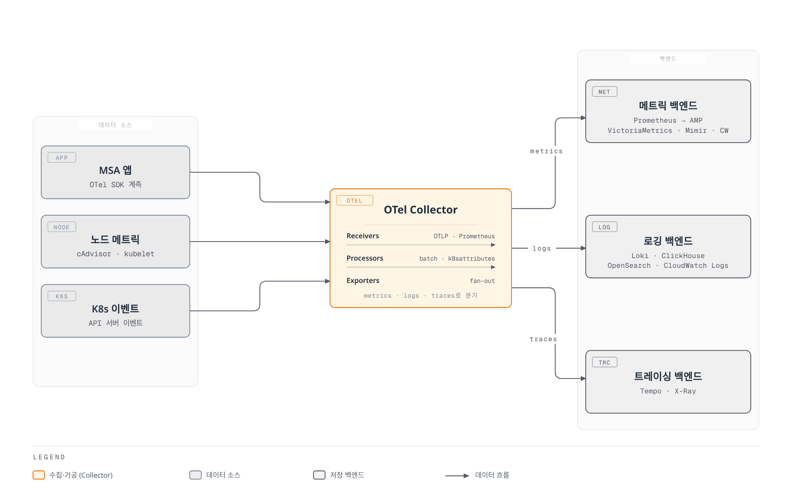

# Part 2: Observability 스택 배포

> **난이도**: 고급 (Advanced)
> **예상 소요 시간**: 90분
> **마지막 업데이트**: 2026년 2월 23일

## 학습 목표

- 메트릭, 로그, 트레이스 3대 축 Observability 스택 구축
- OpenTelemetry Collector 중앙 파이프라인 구성
- 다중 백엔드 fan-out 아키텍처 구현

## 아키텍처 개요



---

## Step 2.1: OpenTelemetry Collector 배포

### OTel Collector 아키텍처

| 배포 모드 | 역할 | 위치 |
|----------|------|------|
| DaemonSet (Agent) | 노드별 텔레메트리 수집 | Service Cluster |
| Deployment (Gateway) | 중앙 집중식 처리 및 export | Managed Cluster |

**Step 2.1.1: OTel Operator 설치**

```bash
# Managed Cluster로 전환
kubectl config use-context managed

# cert-manager 설치 (OTel Operator 의존성)
kubectl apply -f https://github.com/cert-manager/cert-manager/releases/download/v1.14.4/cert-manager.yaml

# cert-manager Ready 대기
kubectl wait --for=condition=Available deployment/cert-manager -n cert-manager --timeout=300s
kubectl wait --for=condition=Available deployment/cert-manager-webhook -n cert-manager --timeout=300s

# OTel Operator 설치
kubectl apply -f https://github.com/open-telemetry/opentelemetry-operator/releases/latest/download/opentelemetry-operator.yaml

# Operator Ready 대기
kubectl wait --for=condition=Available deployment/opentelemetry-operator-controller-manager -n opentelemetry-operator-system --timeout=300s
```

**Step 2.1.2: OTel Collector Gateway 배포 (Managed Cluster)**

```yaml
# otel-collector-gateway.yaml
apiVersion: opentelemetry.io/v1alpha1
kind: OpenTelemetryCollector
metadata:
  name: otel-gateway
  namespace: monitoring
spec:
  mode: deployment
  replicas: 2
  image: otel/opentelemetry-collector-contrib:0.96.0

  resources:
    limits:
      cpu: 1000m
      memory: 2Gi
    requests:
      cpu: 200m
      memory: 400Mi

  config: |
    receivers:
      otlp:
        protocols:
          grpc:
            endpoint: 0.0.0.0:4317
          http:
            endpoint: 0.0.0.0:4318

      prometheus:
        config:
          scrape_configs:
            - job_name: 'otel-collector'
              scrape_interval: 15s
              static_configs:
                - targets: ['localhost:8888']

    processors:
      batch:
        timeout: 10s
        send_batch_size: 1024
        send_batch_max_size: 2048

      memory_limiter:
        check_interval: 1s
        limit_mib: 1500
        spike_limit_mib: 500

      k8sattributes:
        auth_type: "serviceAccount"
        passthrough: false
        extract:
          metadata:
            - k8s.pod.name
            - k8s.pod.uid
            - k8s.deployment.name
            - k8s.namespace.name
            - k8s.node.name
            - k8s.pod.start_time
        pod_association:
          - sources:
              - from: resource_attribute
                name: k8s.pod.ip
          - sources:
              - from: resource_attribute
                name: k8s.pod.uid

      resource:
        attributes:
          - key: cluster
            value: "obs-service-cluster"
            action: upsert

    exporters:
      # Prometheus (로컬)
      prometheus:
        endpoint: 0.0.0.0:8889
        namespace: otel
        resource_to_telemetry_conversion:
          enabled: true

      # Prometheus Remote Write -> AMP
      prometheusremotewrite:
        endpoint: "${AMP_REMOTE_WRITE_ENDPOINT}"
        auth:
          authenticator: sigv4auth
        resource_to_telemetry_conversion:
          enabled: true

      # Loki
      loki:
        endpoint: http://loki-gateway.monitoring.svc:3100/loki/api/v1/push
        labels:
          resource:
            cluster: ""
            namespace: ""
            pod: ""
            container: ""
          attributes:
            severity: ""
            service.name: ""

      # Tempo
      otlp/tempo:
        endpoint: tempo.monitoring.svc:4317
        tls:
          insecure: true

      # CloudWatch Logs
      awscloudwatchlogs:
        log_group_name: "/aws/eks/obs-lab/application"
        log_stream_name: "otel-collector"
        region: "us-east-1"

      # CloudWatch Metrics (via EMF)
      awsemf:
        namespace: ObsLab
        log_group_name: "/aws/eks/obs-lab/metrics"
        dimension_rollup_option: "NoDimensionRollup"
        resource_to_telemetry_conversion:
          enabled: true

      # X-Ray
      awsxray:
        region: "us-east-1"

      # OpenSearch
      opensearch:
        http:
          endpoint: "${OPENSEARCH_ENDPOINT}"
          tls:
            insecure: false
        logs_index: "obs-lab-logs"

      debug:
        verbosity: detailed

    extensions:
      health_check:
        endpoint: 0.0.0.0:13133

      sigv4auth:
        region: "us-east-1"
        service: "aps"

    service:
      extensions: [health_check, sigv4auth]

      pipelines:
        metrics:
          receivers: [otlp, prometheus]
          processors: [memory_limiter, k8sattributes, resource, batch]
          exporters: [prometheus, prometheusremotewrite, awsemf]

        logs:
          receivers: [otlp]
          processors: [memory_limiter, k8sattributes, resource, batch]
          exporters: [loki, awscloudwatchlogs, opensearch]

        traces:
          receivers: [otlp]
          processors: [memory_limiter, k8sattributes, resource, batch]
          exporters: [otlp/tempo, awsxray]

      telemetry:
        logs:
          level: info
        metrics:
          address: 0.0.0.0:8888
```

```bash
# 환경 변수 설정
export AMP_REMOTE_WRITE_ENDPOINT="https://aps-workspaces.us-east-1.amazonaws.com/workspaces/${AMP_WORKSPACE_ID}/api/v1/remote_write"
export OPENSEARCH_ENDPOINT="https://${OPENSEARCH_DOMAIN_ENDPOINT}"

# ConfigMap으로 환경 변수 전달
kubectl create namespace monitoring --dry-run=client -o yaml | kubectl apply -f -

kubectl create configmap otel-config \
  --from-literal=AMP_REMOTE_WRITE_ENDPOINT="${AMP_REMOTE_WRITE_ENDPOINT}" \
  --from-literal=OPENSEARCH_ENDPOINT="${OPENSEARCH_ENDPOINT}" \
  -n monitoring

# OTel Collector Gateway 배포
envsubst < otel-collector-gateway.yaml | kubectl apply -f -
```

**Step 2.1.3: OTel Collector Agent 배포 (Service Cluster)**

```yaml
# otel-collector-agent.yaml
apiVersion: opentelemetry.io/v1alpha1
kind: OpenTelemetryCollector
metadata:
  name: otel-agent
  namespace: msa
spec:
  mode: daemonset
  image: otel/opentelemetry-collector-contrib:0.96.0

  resources:
    limits:
      cpu: 500m
      memory: 512Mi
    requests:
      cpu: 100m
      memory: 128Mi

  env:
    - name: K8S_NODE_NAME
      valueFrom:
        fieldRef:
          fieldPath: spec.nodeName
    - name: K8S_POD_IP
      valueFrom:
        fieldRef:
          fieldPath: status.podIP

  config: |
    receivers:
      otlp:
        protocols:
          grpc:
            endpoint: 0.0.0.0:4317
          http:
            endpoint: 0.0.0.0:4318

      # Host metrics
      hostmetrics:
        collection_interval: 30s
        scrapers:
          cpu:
          memory:
          disk:
          filesystem:
          network:
          load:

      # Kubernetes events
      k8s_events:
        namespaces: [msa]

      # Kubelet stats
      kubeletstats:
        collection_interval: 30s
        auth_type: "serviceAccount"
        endpoint: "https://${K8S_NODE_NAME}:10250"
        insecure_skip_verify: true

    processors:
      batch:
        timeout: 5s
        send_batch_size: 512

      memory_limiter:
        check_interval: 1s
        limit_mib: 400
        spike_limit_mib: 100

      resourcedetection:
        detectors: [env, eks]
        timeout: 5s
        override: false

      k8sattributes:
        auth_type: "serviceAccount"
        extract:
          metadata:
            - k8s.pod.name
            - k8s.namespace.name
            - k8s.node.name

    exporters:
      otlp:
        endpoint: "otel-gateway.monitoring.svc:4317"
        tls:
          insecure: true

    service:
      pipelines:
        metrics:
          receivers: [otlp, hostmetrics, kubeletstats]
          processors: [memory_limiter, resourcedetection, k8sattributes, batch]
          exporters: [otlp]

        logs:
          receivers: [otlp, k8s_events]
          processors: [memory_limiter, resourcedetection, k8sattributes, batch]
          exporters: [otlp]

        traces:
          receivers: [otlp]
          processors: [memory_limiter, resourcedetection, k8sattributes, batch]
          exporters: [otlp]
```

```bash
# Service Cluster로 전환
kubectl config use-context service

# MSA 네임스페이스 생성
kubectl create namespace msa --dry-run=client -o yaml | kubectl apply -f -

# OTel Agent 배포
kubectl apply -f otel-collector-agent.yaml
```

---

## Step 2.2: Metrics 스택 배포

### 2.2.1 kube-prometheus-stack (Prometheus + Alertmanager + Grafana)

```bash
# Managed Cluster로 전환
kubectl config use-context managed

# Prometheus 커뮤니티 Helm repo 추가
helm repo add prometheus-community https://prometheus-community.github.io/helm-charts
helm repo update
```

```yaml
# kube-prometheus-values.yaml
prometheus:
  prometheusSpec:
    replicas: 2
    retention: 7d
    retentionSize: "40GB"

    resources:
      requests:
        cpu: 500m
        memory: 2Gi
      limits:
        cpu: 2000m
        memory: 8Gi

    storageSpec:
      volumeClaimTemplate:
        spec:
          storageClassName: gp3
          accessModes: ["ReadWriteOnce"]
          resources:
            requests:
              storage: 50Gi

    # Remote Write to AMP
    remoteWrite:
      - url: "${AMP_REMOTE_WRITE_ENDPOINT}"
        sigv4:
          region: us-east-1
        queueConfig:
          maxSamplesPerSend: 1000
          maxShards: 200
          capacity: 2500

    # External Labels
    externalLabels:
      cluster: obs-managed-cluster
      environment: lab

    # Service Monitor Selector
    serviceMonitorSelector: {}
    serviceMonitorNamespaceSelector: {}
    podMonitorSelector: {}
    podMonitorNamespaceSelector: {}

    # Additional Scrape Configs
    additionalScrapeConfigs:
      - job_name: 'otel-collector'
        static_configs:
          - targets: ['otel-gateway-collector.monitoring:8889']

alertmanager:
  alertmanagerSpec:
    replicas: 2
    storage:
      volumeClaimTemplate:
        spec:
          storageClassName: gp3
          accessModes: ["ReadWriteOnce"]
          resources:
            requests:
              storage: 10Gi

  config:
    global:
      resolve_timeout: 5m

    route:
      group_by: ['alertname', 'severity', 'namespace']
      group_wait: 30s
      group_interval: 5m
      repeat_interval: 4h
      receiver: 'default'
      routes:
        - match:
            severity: critical
          receiver: 'critical-alerts'
        - match:
            severity: warning
          receiver: 'warning-alerts'

    receivers:
      - name: 'default'
        sns_configs:
          - topic_arn: '${SNS_ALERTS_TOPIC_ARN}'
            sigv4:
              region: us-east-1
            subject: '[OBS-LAB] {{ .GroupLabels.alertname }}'

      - name: 'critical-alerts'
        sns_configs:
          - topic_arn: '${SNS_ALERTS_TOPIC_ARN}'
            sigv4:
              region: us-east-1
            subject: '[CRITICAL] {{ .GroupLabels.alertname }}'

      - name: 'warning-alerts'
        sns_configs:
          - topic_arn: '${SNS_ALERTS_TOPIC_ARN}'
            sigv4:
              region: us-east-1
            subject: '[WARNING] {{ .GroupLabels.alertname }}'

grafana:
  enabled: true
  replicas: 2

  adminUser: admin
  adminPassword: "ObsLab2026!"

  persistence:
    enabled: true
    storageClassName: gp3
    size: 10Gi

  datasources:
    datasources.yaml:
      apiVersion: 1
      datasources:
        - name: Prometheus
          type: prometheus
          url: http://prometheus-operated:9090
          isDefault: true
          editable: false

        - name: AMP
          type: prometheus
          url: "${AMP_QUERY_ENDPOINT}"
          jsonData:
            httpMethod: POST
            sigV4Auth: true
            sigV4AuthType: default
            sigV4Region: us-east-1
          editable: false

        - name: Loki
          type: loki
          url: http://loki-gateway:3100
          jsonData:
            derivedFields:
              - datasourceUid: Tempo
                matcherRegex: "traceID=(\\w+)"
                name: TraceID
                url: '$${__value.raw}'
          editable: false

        - name: Tempo
          type: tempo
          url: http://tempo:3100
          jsonData:
            tracesToLogs:
              datasourceUid: Loki
              tags: ['service.name', 'k8s.namespace.name']
              mapTagNamesEnabled: true
              spanStartTimeShift: '-1h'
              spanEndTimeShift: '1h'
              filterByTraceID: true
              filterBySpanID: false
            serviceMap:
              datasourceUid: Prometheus
            nodeGraph:
              enabled: true
          editable: false

        - name: CloudWatch
          type: cloudwatch
          jsonData:
            authType: default
            defaultRegion: us-east-1
          editable: false

  dashboardProviders:
    dashboardproviders.yaml:
      apiVersion: 1
      providers:
        - name: 'default'
          orgId: 1
          folder: ''
          type: file
          disableDeletion: false
          editable: true
          options:
            path: /var/lib/grafana/dashboards/default

  dashboards:
    default:
      kubernetes-cluster:
        gnetId: 7249
        revision: 1
        datasource: Prometheus

      kubernetes-pods:
        gnetId: 6336
        revision: 1
        datasource: Prometheus

      node-exporter:
        gnetId: 1860
        revision: 33
        datasource: Prometheus

nodeExporter:
  enabled: true

kubeStateMetrics:
  enabled: true
```

```bash
# 환경 변수 치환 및 설치
export AMP_QUERY_ENDPOINT="https://aps-workspaces.us-east-1.amazonaws.com/workspaces/${AMP_WORKSPACE_ID}"
export SNS_ALERTS_TOPIC_ARN=$(aws sns list-topics --query "Topics[?contains(TopicArn, 'obs-lab-alerts')].TopicArn" --output text)

envsubst < kube-prometheus-values.yaml > kube-prometheus-values-final.yaml

helm install kube-prometheus prometheus-community/kube-prometheus-stack \
  --namespace monitoring \
  --values kube-prometheus-values-final.yaml \
  --wait --timeout 10m
```

### 2.2.2 VictoriaMetrics

```bash
# VictoriaMetrics Helm repo 추가
helm repo add vm https://victoriametrics.github.io/helm-charts/
helm repo update
```

```yaml
# victoriametrics-values.yaml
server:
  enabled: true
  replicaCount: 2

  persistentVolume:
    enabled: true
    storageClass: gp3
    size: 50Gi

  resources:
    requests:
      cpu: 500m
      memory: 1Gi
    limits:
      cpu: 2000m
      memory: 4Gi

  retentionPeriod: 30d

  extraArgs:
    envflag.enable: "true"
    envflag.prefix: VM_
    loggerFormat: json

vmagent:
  enabled: true
  replicaCount: 2

  resources:
    requests:
      cpu: 200m
      memory: 256Mi
    limits:
      cpu: 500m
      memory: 512Mi

  remoteWriteUrls:
    - http://vminsert:8480/insert/0/prometheus/

  config:
    global:
      scrape_interval: 30s
      external_labels:
        cluster: obs-managed-cluster

    scrape_configs:
      - job_name: 'kubernetes-pods'
        kubernetes_sd_configs:
          - role: pod
        relabel_configs:
          - source_labels: [__meta_kubernetes_pod_annotation_prometheus_io_scrape]
            action: keep
            regex: true

vmalert:
  enabled: true
  replicaCount: 2

  datasource:
    url: http://vmselect:8481/select/0/prometheus

  notifier:
    alertmanager:
      url: http://alertmanager-operated:9093

vmselect:
  enabled: true
  replicaCount: 2

  resources:
    requests:
      cpu: 200m
      memory: 256Mi
    limits:
      cpu: 1000m
      memory: 1Gi

vminsert:
  enabled: true
  replicaCount: 2

  resources:
    requests:
      cpu: 200m
      memory: 256Mi
    limits:
      cpu: 1000m
      memory: 1Gi

vmstorage:
  enabled: true
  replicaCount: 2

  persistentVolume:
    enabled: true
    storageClass: gp3
    size: 50Gi

  resources:
    requests:
      cpu: 500m
      memory: 1Gi
    limits:
      cpu: 2000m
      memory: 4Gi

  retentionPeriod: 30d
```

```bash
helm install victoriametrics vm/victoria-metrics-cluster \
  --namespace monitoring \
  --values victoriametrics-values.yaml \
  --wait
```

### 2.2.3 Mimir

```yaml
# mimir-values.yaml
mimir:
  structuredConfig:
    common:
      storage:
        backend: s3
        s3:
          endpoint: s3.us-east-1.amazonaws.com
          bucket_name: obs-lab-mimir-${AWS_ACCOUNT_ID}
          region: us-east-1

    blocks_storage:
      backend: s3
      s3:
        bucket_name: obs-lab-mimir-${AWS_ACCOUNT_ID}

    limits:
      max_global_series_per_user: 1000000
      ingestion_rate: 100000
      ingestion_burst_size: 200000

distributor:
  replicas: 2
  resources:
    requests:
      cpu: 200m
      memory: 256Mi
    limits:
      cpu: 1000m
      memory: 1Gi

ingester:
  replicas: 3
  persistentVolume:
    enabled: true
    storageClass: gp3
    size: 50Gi
  resources:
    requests:
      cpu: 500m
      memory: 1Gi
    limits:
      cpu: 2000m
      memory: 4Gi

querier:
  replicas: 2
  resources:
    requests:
      cpu: 200m
      memory: 256Mi
    limits:
      cpu: 1000m
      memory: 1Gi

query_frontend:
  replicas: 2
  resources:
    requests:
      cpu: 200m
      memory: 256Mi
    limits:
      cpu: 500m
      memory: 512Mi

compactor:
  replicas: 1
  persistentVolume:
    enabled: true
    storageClass: gp3
    size: 20Gi

store_gateway:
  replicas: 2
  persistentVolume:
    enabled: true
    storageClass: gp3
    size: 20Gi
```

```bash
# Mimir S3 버킷 생성
aws s3 mb s3://obs-lab-mimir-${AWS_ACCOUNT_ID} --region us-east-1

# Grafana Mimir Helm repo 추가
helm repo add grafana https://grafana.github.io/helm-charts
helm repo update

# Mimir 설치
envsubst < mimir-values.yaml > mimir-values-final.yaml
helm install mimir grafana/mimir-distributed \
  --namespace monitoring \
  --values mimir-values-final.yaml \
  --wait
```

### 2.2.4 CloudWatch Metrics (ADOT)

```yaml
# adot-collector.yaml
apiVersion: opentelemetry.io/v1alpha1
kind: OpenTelemetryCollector
metadata:
  name: adot-cw-metrics
  namespace: monitoring
spec:
  mode: deployment
  image: public.ecr.aws/aws-observability/aws-otel-collector:v0.37.0
  serviceAccount: adot-collector

  config: |
    receivers:
      prometheus:
        config:
          scrape_configs:
            - job_name: 'kubernetes-service-endpoints'
              kubernetes_sd_configs:
                - role: endpoints
              relabel_configs:
                - source_labels: [__meta_kubernetes_service_annotation_prometheus_io_scrape]
                  action: keep
                  regex: true

    processors:
      batch:
        timeout: 60s

    exporters:
      awsemf:
        namespace: ObsLab/Kubernetes
        log_group_name: '/aws/eks/obs-lab/containerinsights'
        dimension_rollup_option: NoDimensionRollup
        metric_declarations:
          - dimensions: [[ClusterName, Namespace, PodName]]
            metric_name_selectors:
              - "^container_.*"
          - dimensions: [[ClusterName, Namespace]]
            metric_name_selectors:
              - "^kube_.*"

    service:
      pipelines:
        metrics:
          receivers: [prometheus]
          processors: [batch]
          exporters: [awsemf]
```

```bash
# ADOT ServiceAccount IRSA 설정
eksctl create iamserviceaccount \
  --cluster=obs-managed-cluster \
  --namespace=monitoring \
  --name=adot-collector \
  --attach-policy-arn=arn:aws:iam::aws:policy/CloudWatchAgentServerPolicy \
  --approve

kubectl apply -f adot-collector.yaml
```

---

## Step 2.3: Logging 스택 배포

### 2.3.1 Loki (SimpleScalable mode)

```yaml
# loki-values.yaml
loki:
  auth_enabled: false

  commonConfig:
    replication_factor: 2

  schemaConfig:
    configs:
      - from: 2024-01-01
        store: tsdb
        object_store: s3
        schema: v12
        index:
          prefix: loki_index_
          period: 24h

  storage:
    type: s3
    bucketNames:
      chunks: obs-lab-loki-chunks-${AWS_ACCOUNT_ID}
      ruler: obs-lab-loki-ruler-${AWS_ACCOUNT_ID}
    s3:
      region: us-east-1
      s3ForcePathStyle: false

  limits_config:
    retention_period: 30d
    max_query_series: 5000
    max_query_parallelism: 32

  rulerConfig:
    storage:
      type: s3
      s3:
        bucketnames: obs-lab-loki-ruler-${AWS_ACCOUNT_ID}
        region: us-east-1

deploymentMode: SimpleScalable

backend:
  replicas: 2
  persistence:
    storageClass: gp3
    size: 10Gi

read:
  replicas: 2
  resources:
    requests:
      cpu: 200m
      memory: 256Mi
    limits:
      cpu: 1000m
      memory: 1Gi

write:
  replicas: 3
  persistence:
    storageClass: gp3
    size: 10Gi
  resources:
    requests:
      cpu: 200m
      memory: 256Mi
    limits:
      cpu: 1000m
      memory: 1Gi

gateway:
  replicas: 2
  resources:
    requests:
      cpu: 100m
      memory: 128Mi
    limits:
      cpu: 500m
      memory: 256Mi

minio:
  enabled: false

serviceAccount:
  create: true
  name: loki
  annotations:
    eks.amazonaws.com/role-arn: arn:aws:iam::${AWS_ACCOUNT_ID}:role/LokiS3Role
```

```bash
# Loki S3 버킷 생성
aws s3 mb s3://obs-lab-loki-chunks-${AWS_ACCOUNT_ID} --region us-east-1
aws s3 mb s3://obs-lab-loki-ruler-${AWS_ACCOUNT_ID} --region us-east-1

# Loki용 IRSA 생성
cat > loki-s3-policy.json << 'EOF'
{
  "Version": "2012-10-17",
  "Statement": [
    {
      "Effect": "Allow",
      "Action": [
        "s3:GetObject",
        "s3:PutObject",
        "s3:DeleteObject",
        "s3:ListBucket"
      ],
      "Resource": [
        "arn:aws:s3:::obs-lab-loki-*",
        "arn:aws:s3:::obs-lab-loki-*/*"
      ]
    }
  ]
}
EOF

aws iam create-policy \
  --policy-name LokiS3Policy \
  --policy-document file://loki-s3-policy.json

eksctl create iamserviceaccount \
  --cluster=obs-managed-cluster \
  --namespace=monitoring \
  --name=loki \
  --attach-policy-arn=arn:aws:iam::${AWS_ACCOUNT_ID}:policy/LokiS3Policy \
  --approve

# Loki 설치
envsubst < loki-values.yaml > loki-values-final.yaml
helm install loki grafana/loki \
  --namespace monitoring \
  --values loki-values-final.yaml \
  --wait
```

### 2.3.2 ClickHouse

```yaml
# clickhouse.yaml
apiVersion: v1
kind: ConfigMap
metadata:
  name: clickhouse-config
  namespace: monitoring
data:
  config.xml: |
    <?xml version="1.0"?>
    <clickhouse>
      <logger>
        <level>information</level>
        <console>true</console>
      </logger>
      <http_port>8123</http_port>
      <tcp_port>9000</tcp_port>
      <listen_host>0.0.0.0</listen_host>
      <max_connections>4096</max_connections>
      <keep_alive_timeout>3</keep_alive_timeout>
      <max_concurrent_queries>100</max_concurrent_queries>
      <mark_cache_size>5368709120</mark_cache_size>
      <path>/var/lib/clickhouse/</path>
      <user_files_path>/var/lib/clickhouse/user_files/</user_files_path>
    </clickhouse>

  users.xml: |
    <?xml version="1.0"?>
    <clickhouse>
      <users>
        <default>
          <password></password>
          <networks>
            <ip>::/0</ip>
          </networks>
          <profile>default</profile>
          <quota>default</quota>
        </default>
        <obslab>
          <password_sha256_hex>CHANGE_ME_HASH</password_sha256_hex>
          <networks>
            <ip>::/0</ip>
          </networks>
          <profile>default</profile>
          <quota>default</quota>
        </obslab>
      </users>
      <profiles>
        <default>
          <max_memory_usage>10000000000</max_memory_usage>
          <use_uncompressed_cache>0</use_uncompressed_cache>
          <load_balancing>random</load_balancing>
        </default>
      </profiles>
      <quotas>
        <default>
          <interval>
            <duration>3600</duration>
            <queries>0</queries>
            <errors>0</errors>
            <result_rows>0</result_rows>
            <read_rows>0</read_rows>
            <execution_time>0</execution_time>
          </interval>
        </default>
      </quotas>
    </clickhouse>
---
apiVersion: apps/v1
kind: StatefulSet
metadata:
  name: clickhouse
  namespace: monitoring
spec:
  serviceName: clickhouse
  replicas: 1
  selector:
    matchLabels:
      app: clickhouse
  template:
    metadata:
      labels:
        app: clickhouse
    spec:
      containers:
        - name: clickhouse
          image: clickhouse/clickhouse-server:24.2
          ports:
            - containerPort: 8123
              name: http
            - containerPort: 9000
              name: native
          resources:
            requests:
              cpu: 500m
              memory: 2Gi
            limits:
              cpu: 2000m
              memory: 8Gi
          volumeMounts:
            - name: data
              mountPath: /var/lib/clickhouse
            - name: config
              mountPath: /etc/clickhouse-server/config.xml
              subPath: config.xml
            - name: config
              mountPath: /etc/clickhouse-server/users.xml
              subPath: users.xml
      volumes:
        - name: config
          configMap:
            name: clickhouse-config
  volumeClaimTemplates:
    - metadata:
        name: data
      spec:
        storageClassName: gp3
        accessModes: ["ReadWriteOnce"]
        resources:
          requests:
            storage: 100Gi
---
apiVersion: v1
kind: Service
metadata:
  name: clickhouse
  namespace: monitoring
spec:
  selector:
    app: clickhouse
  ports:
    - name: http
      port: 8123
    - name: native
      port: 9000
```

```bash
kubectl apply -f clickhouse.yaml

# ClickHouse 로그 테이블 생성
kubectl exec -it clickhouse-0 -n monitoring -- clickhouse-client --query "
CREATE DATABASE IF NOT EXISTS logs;

CREATE TABLE IF NOT EXISTS logs.application_logs (
    timestamp DateTime64(9),
    trace_id String,
    span_id String,
    severity String,
    service String,
    namespace String,
    pod String,
    message String,
    attributes Map(String, String)
) ENGINE = MergeTree()
PARTITION BY toYYYYMMDD(timestamp)
ORDER BY (service, timestamp)
TTL timestamp + INTERVAL 30 DAY;
"
```

### 2.3.3 OpenSearch (FluentBit)

```yaml
# fluentbit-opensearch.yaml
apiVersion: v1
kind: ConfigMap
metadata:
  name: fluent-bit-config
  namespace: monitoring
data:
  fluent-bit.conf: |
    [SERVICE]
        Flush         5
        Log_Level     info
        Daemon        off
        Parsers_File  parsers.conf

    [INPUT]
        Name              tail
        Path              /var/log/containers/*.log
        Parser            docker
        Tag               kube.*
        Refresh_Interval  5
        Mem_Buf_Limit     50MB
        Skip_Long_Lines   On

    [FILTER]
        Name                kubernetes
        Match               kube.*
        Kube_URL            https://kubernetes.default.svc:443
        Kube_CA_File        /var/run/secrets/kubernetes.io/serviceaccount/ca.crt
        Kube_Token_File     /var/run/secrets/kubernetes.io/serviceaccount/token
        Merge_Log           On
        K8S-Logging.Parser  On
        K8S-Logging.Exclude On

    [OUTPUT]
        Name            opensearch
        Match           kube.*
        Host            ${OPENSEARCH_ENDPOINT}
        Port            443
        HTTP_User       admin
        HTTP_Passwd     ${OPENSEARCH_PASSWORD}
        Index           obs-lab-logs
        Type            _doc
        AWS_Auth        On
        AWS_Region      us-east-1
        tls             On
        tls.verify      On
        Suppress_Type_Name On
        Replace_Dots    On
        Trace_Error     On

  parsers.conf: |
    [PARSER]
        Name        docker
        Format      json
        Time_Key    time
        Time_Format %Y-%m-%dT%H:%M:%S.%L
        Time_Keep   On

    [PARSER]
        Name        containerd
        Format      regex
        Regex       ^(?<time>[^ ]+) (?<stream>stdout|stderr) (?<logtag>[^ ]*) (?<log>.*)$
        Time_Key    time
        Time_Format %Y-%m-%dT%H:%M:%S.%L%z
---
apiVersion: apps/v1
kind: DaemonSet
metadata:
  name: fluent-bit-opensearch
  namespace: monitoring
spec:
  selector:
    matchLabels:
      app: fluent-bit-opensearch
  template:
    metadata:
      labels:
        app: fluent-bit-opensearch
    spec:
      serviceAccountName: fluent-bit
      containers:
        - name: fluent-bit
          image: fluent/fluent-bit:2.2
          env:
            - name: OPENSEARCH_ENDPOINT
              valueFrom:
                secretKeyRef:
                  name: opensearch-credentials
                  key: endpoint
            - name: OPENSEARCH_PASSWORD
              valueFrom:
                secretKeyRef:
                  name: opensearch-credentials
                  key: password
          volumeMounts:
            - name: varlog
              mountPath: /var/log
            - name: varlibdockercontainers
              mountPath: /var/lib/docker/containers
              readOnly: true
            - name: config
              mountPath: /fluent-bit/etc/
          resources:
            requests:
              cpu: 100m
              memory: 128Mi
            limits:
              cpu: 500m
              memory: 256Mi
      volumes:
        - name: varlog
          hostPath:
            path: /var/log
        - name: varlibdockercontainers
          hostPath:
            path: /var/lib/docker/containers
        - name: config
          configMap:
            name: fluent-bit-config
```

```bash
# OpenSearch credentials Secret 생성
kubectl create secret generic opensearch-credentials \
  --from-literal=endpoint=${OPENSEARCH_ENDPOINT} \
  --from-literal=password=${OPENSEARCH_PASSWORD} \
  -n monitoring

kubectl apply -f fluentbit-opensearch.yaml
```

### 2.3.4 CloudWatch Logs (FluentBit)

```yaml
# fluentbit-cloudwatch.yaml
apiVersion: v1
kind: ConfigMap
metadata:
  name: fluent-bit-cloudwatch-config
  namespace: monitoring
data:
  fluent-bit.conf: |
    [SERVICE]
        Flush         5
        Log_Level     info
        Daemon        off
        Parsers_File  parsers.conf

    [INPUT]
        Name              tail
        Path              /var/log/containers/*msa*.log
        Parser            docker
        Tag               msa.*
        Refresh_Interval  5
        Mem_Buf_Limit     50MB

    [FILTER]
        Name                kubernetes
        Match               msa.*
        Kube_URL            https://kubernetes.default.svc:443
        Kube_CA_File        /var/run/secrets/kubernetes.io/serviceaccount/ca.crt
        Kube_Token_File     /var/run/secrets/kubernetes.io/serviceaccount/token
        Merge_Log           On

    [OUTPUT]
        Name                cloudwatch_logs
        Match               msa.*
        region              us-east-1
        log_group_name      /aws/eks/obs-lab/application
        log_stream_prefix   msa-
        auto_create_group   true
        log_retention_days  30

  parsers.conf: |
    [PARSER]
        Name        docker
        Format      json
        Time_Key    time
        Time_Format %Y-%m-%dT%H:%M:%S.%L
---
apiVersion: apps/v1
kind: DaemonSet
metadata:
  name: fluent-bit-cloudwatch
  namespace: monitoring
spec:
  selector:
    matchLabels:
      app: fluent-bit-cloudwatch
  template:
    metadata:
      labels:
        app: fluent-bit-cloudwatch
    spec:
      serviceAccountName: fluent-bit-cw
      containers:
        - name: fluent-bit
          image: public.ecr.aws/aws-observability/aws-for-fluent-bit:2.31.12
          volumeMounts:
            - name: varlog
              mountPath: /var/log
            - name: varlibdockercontainers
              mountPath: /var/lib/docker/containers
              readOnly: true
            - name: config
              mountPath: /fluent-bit/etc/
          resources:
            requests:
              cpu: 100m
              memory: 128Mi
            limits:
              cpu: 500m
              memory: 256Mi
      volumes:
        - name: varlog
          hostPath:
            path: /var/log
        - name: varlibdockercontainers
          hostPath:
            path: /var/lib/docker/containers
        - name: config
          configMap:
            name: fluent-bit-cloudwatch-config
```

```bash
# FluentBit IRSA 설정
eksctl create iamserviceaccount \
  --cluster=obs-managed-cluster \
  --namespace=monitoring \
  --name=fluent-bit-cw \
  --attach-policy-arn=arn:aws:iam::aws:policy/CloudWatchAgentServerPolicy \
  --approve

kubectl apply -f fluentbit-cloudwatch.yaml
```

---

## Step 2.4: Tracing 스택 배포

### 2.4.1 Tempo

```yaml
# tempo-values.yaml
tempo:
  repository: grafana/tempo
  tag: 2.4.0

  searchEnabled: true
  metricsGenerator:
    enabled: true
    remoteWriteUrl: http://prometheus-operated:9090/api/v1/write

  storage:
    trace:
      backend: s3
      s3:
        bucket: obs-lab-tempo-${AWS_ACCOUNT_ID}
        endpoint: s3.us-east-1.amazonaws.com
        region: us-east-1

  receivers:
    otlp:
      protocols:
        grpc:
          endpoint: 0.0.0.0:4317
        http:
          endpoint: 0.0.0.0:4318

  global_overrides:
    per_tenant_override_config: /runtime-config/overrides.yaml

persistence:
  enabled: true
  storageClassName: gp3
  size: 10Gi

resources:
  requests:
    cpu: 500m
    memory: 1Gi
  limits:
    cpu: 2000m
    memory: 4Gi

serviceAccount:
  create: true
  name: tempo
  annotations:
    eks.amazonaws.com/role-arn: arn:aws:iam::${AWS_ACCOUNT_ID}:role/TempoS3Role
```

```bash
# Tempo S3 버킷 생성
aws s3 mb s3://obs-lab-tempo-${AWS_ACCOUNT_ID} --region us-east-1

# Tempo용 IRSA 생성
cat > tempo-s3-policy.json << 'EOF'
{
  "Version": "2012-10-17",
  "Statement": [
    {
      "Effect": "Allow",
      "Action": [
        "s3:GetObject",
        "s3:PutObject",
        "s3:DeleteObject",
        "s3:ListBucket"
      ],
      "Resource": [
        "arn:aws:s3:::obs-lab-tempo-*",
        "arn:aws:s3:::obs-lab-tempo-*/*"
      ]
    }
  ]
}
EOF

aws iam create-policy \
  --policy-name TempoS3Policy \
  --policy-document file://tempo-s3-policy.json

eksctl create iamserviceaccount \
  --cluster=obs-managed-cluster \
  --namespace=monitoring \
  --name=tempo \
  --attach-policy-arn=arn:aws:iam::${AWS_ACCOUNT_ID}:policy/TempoS3Policy \
  --approve

# Tempo 설치
envsubst < tempo-values.yaml > tempo-values-final.yaml
helm install tempo grafana/tempo \
  --namespace monitoring \
  --values tempo-values-final.yaml \
  --wait
```

### 2.4.2 X-Ray (OTel Collector Exporter)

X-Ray는 OTel Collector Gateway 설정에 이미 포함되어 있습니다. 추가 IRSA 설정만 진행합니다.

```bash
# X-Ray용 IRSA 추가 (OTel Collector ServiceAccount에)
cat > xray-policy.json << 'EOF'
{
  "Version": "2012-10-17",
  "Statement": [
    {
      "Effect": "Allow",
      "Action": [
        "xray:PutTraceSegments",
        "xray:PutTelemetryRecords",
        "xray:GetSamplingRules",
        "xray:GetSamplingTargets",
        "xray:GetSamplingStatisticSummaries"
      ],
      "Resource": "*"
    }
  ]
}
EOF

aws iam create-policy \
  --policy-name XRayPolicy \
  --policy-document file://xray-policy.json

# OTel Collector ServiceAccount에 정책 추가
eksctl create iamserviceaccount \
  --cluster=obs-managed-cluster \
  --namespace=monitoring \
  --name=otel-gateway-collector \
  --attach-policy-arn=arn:aws:iam::${AWS_ACCOUNT_ID}:policy/XRayPolicy \
  --attach-policy-arn=arn:aws:iam::${AWS_ACCOUNT_ID}:policy/LokiS3Policy \
  --attach-policy-arn=arn:aws:iam::${AWS_ACCOUNT_ID}:policy/TempoS3Policy \
  --attach-policy-arn=arn:aws:iam::aws:policy/AmazonPrometheusRemoteWriteAccess \
  --attach-policy-arn=arn:aws:iam::aws:policy/CloudWatchAgentServerPolicy \
  --override-existing-serviceaccounts \
  --approve
```

---

## Step 2.5: Visualization 구성

### 2.5.1 Grafana Datasource Provisioning

```yaml
# grafana-datasources.yaml
apiVersion: v1
kind: ConfigMap
metadata:
  name: grafana-datasources
  namespace: monitoring
  labels:
    grafana_datasource: "true"
data:
  datasources.yaml: |
    apiVersion: 1
    datasources:
      - name: Prometheus
        type: prometheus
        access: proxy
        url: http://prometheus-operated:9090
        isDefault: true
        editable: false
        jsonData:
          timeInterval: "15s"
          exemplarTraceIdDestinations:
            - name: traceID
              datasourceUid: tempo

      - name: AMP
        type: prometheus
        access: proxy
        url: https://aps-workspaces.us-east-1.amazonaws.com/workspaces/${AMP_WORKSPACE_ID}
        editable: false
        jsonData:
          httpMethod: POST
          sigV4Auth: true
          sigV4AuthType: default
          sigV4Region: us-east-1

      - name: VictoriaMetrics
        type: prometheus
        access: proxy
        url: http://vmselect:8481/select/0/prometheus
        editable: false

      - name: Mimir
        type: prometheus
        access: proxy
        url: http://mimir-query-frontend:8080/prometheus
        editable: false

      - name: Loki
        type: loki
        access: proxy
        url: http://loki-gateway:3100
        editable: false
        jsonData:
          derivedFields:
            - datasourceUid: tempo
              matcherRegex: '"traceID":"([a-f0-9]+)"'
              name: TraceID
              url: '$${__value.raw}'
            - datasourceUid: tempo
              matcherRegex: 'trace_id=([a-f0-9]+)'
              name: TraceID
              url: '$${__value.raw}'

      - name: Tempo
        uid: tempo
        type: tempo
        access: proxy
        url: http://tempo:3100
        editable: false
        jsonData:
          httpMethod: GET
          tracesToLogs:
            datasourceUid: loki
            tags: ['service.name', 'k8s.namespace.name', 'k8s.pod.name']
            mapTagNamesEnabled: true
            spanStartTimeShift: '-1h'
            spanEndTimeShift: '1h'
            filterByTraceID: true
          tracesToMetrics:
            datasourceUid: prometheus
            tags:
              - key: service.name
                value: service
            queries:
              - name: 'Request Rate'
                query: 'sum(rate(traces_spanmetrics_calls_total{$$__tags}[5m]))'
              - name: 'Error Rate'
                query: 'sum(rate(traces_spanmetrics_calls_total{$$__tags, status_code="STATUS_CODE_ERROR"}[5m]))'
          serviceMap:
            datasourceUid: prometheus
          nodeGraph:
            enabled: true
          search:
            hide: false
          lokiSearch:
            datasourceUid: loki

      - name: CloudWatch
        type: cloudwatch
        access: proxy
        editable: false
        jsonData:
          authType: default
          defaultRegion: us-east-1

      - name: X-Ray
        type: grafana-x-ray-datasource
        access: proxy
        editable: false
        jsonData:
          authType: default
          defaultRegion: us-east-1
```

```bash
envsubst < grafana-datasources.yaml | kubectl apply -f -

# Grafana Pod 재시작
kubectl rollout restart deployment kube-prometheus-grafana -n monitoring
```

### 2.5.2 Amazon Managed Grafana 설정

```bash
# AMG API Key 생성
AMG_WORKSPACE_ID=$(aws grafana list-workspaces \
  --query "workspaces[?name=='obs-lab-grafana'].id" \
  --output text)

# Datasource 추가 (AWS Console 또는 Terraform으로 진행)
# - AMP, CloudWatch, X-Ray datasource는 자동으로 사용 가능
```

### 2.5.3 Exemplar 설정

```yaml
# prometheus-exemplar-config.yaml
apiVersion: monitoring.coreos.com/v1
kind: Prometheus
metadata:
  name: prometheus
  namespace: monitoring
spec:
  # ... existing config ...
  enableFeatures:
    - exemplar-storage

  # Exemplar storage config
  exemplars:
    maxSize: 100000
```

---

## Step 2.6: Alerting 기본 구성

### 2.6.1 Alertmanager + SNS Receiver

```yaml
# alertmanager-config.yaml
apiVersion: v1
kind: Secret
metadata:
  name: alertmanager-config
  namespace: monitoring
stringData:
  alertmanager.yaml: |
    global:
      resolve_timeout: 5m

    route:
      group_by: ['alertname', 'severity', 'namespace', 'service']
      group_wait: 30s
      group_interval: 5m
      repeat_interval: 4h
      receiver: 'default'
      routes:
        - match:
            severity: critical
          receiver: 'critical-sns'
          continue: true
        - match:
            severity: warning
          receiver: 'warning-sns'

    receivers:
      - name: 'default'
        sns_configs:
          - topic_arn: '${SNS_ALERTS_TOPIC_ARN}'
            sigv4:
              region: us-east-1
            subject: '[OBS-LAB] {{ .GroupLabels.alertname }}'
            message: |
              {{ range .Alerts }}
              Alert: {{ .Labels.alertname }}
              Severity: {{ .Labels.severity }}
              Namespace: {{ .Labels.namespace }}
              Service: {{ .Labels.service }}
              Description: {{ .Annotations.description }}
              {{ end }}

      - name: 'critical-sns'
        sns_configs:
          - topic_arn: '${SNS_ALERTS_TOPIC_ARN}'
            sigv4:
              region: us-east-1
            subject: '[CRITICAL] {{ .GroupLabels.alertname }}'

      - name: 'warning-sns'
        sns_configs:
          - topic_arn: '${SNS_ALERTS_TOPIC_ARN}'
            sigv4:
              region: us-east-1
            subject: '[WARNING] {{ .GroupLabels.alertname }}'

    inhibit_rules:
      - source_match:
          severity: 'critical'
        target_match:
          severity: 'warning'
        equal: ['alertname', 'namespace']
```

```bash
envsubst < alertmanager-config.yaml | kubectl apply -f -
```

### 2.6.2 Grafana OnCall 설치

```bash
# Grafana OnCall Helm 설치
helm repo add grafana https://grafana.github.io/helm-charts
helm repo update

cat > oncall-values.yaml << 'EOF'
base_url: oncall.obs-lab.local

grafana:
  enabled: false

oncall:
  replicas: 2

  resources:
    requests:
      cpu: 200m
      memory: 256Mi
    limits:
      cpu: 1000m
      memory: 1Gi

celery:
  replicas: 2

redis:
  enabled: true

postgresql:
  enabled: true
  persistence:
    enabled: true
    storageClass: gp3
    size: 10Gi
EOF

helm install oncall grafana/oncall \
  --namespace monitoring \
  --values oncall-values.yaml \
  --wait
```

### 2.6.3 CloudWatch Alarms

```bash
# Aurora CPU Alarm
aws cloudwatch put-metric-alarm \
  --alarm-name "obs-lab-aurora-cpu-high" \
  --alarm-description "Aurora CPU > 80%" \
  --metric-name CPUUtilization \
  --namespace AWS/RDS \
  --statistic Average \
  --period 300 \
  --threshold 80 \
  --comparison-operator GreaterThanThreshold \
  --dimensions Name=DBClusterIdentifier,Value=obs-lab-aurora \
  --evaluation-periods 2 \
  --alarm-actions ${SNS_ALERTS_TOPIC_ARN}

# SQS Message Age Alarm
aws cloudwatch put-metric-alarm \
  --alarm-name "obs-lab-sqs-age-high" \
  --alarm-description "SQS Message Age > 5min" \
  --metric-name ApproximateAgeOfOldestMessage \
  --namespace AWS/SQS \
  --statistic Maximum \
  --period 60 \
  --threshold 300 \
  --comparison-operator GreaterThanThreshold \
  --dimensions Name=QueueName,Value=obs-lab-order-events \
  --evaluation-periods 3 \
  --alarm-actions ${SNS_ALERTS_TOPIC_ARN}
```

---

## 검증 (Verification)

### Observability 스택 상태 확인

```bash
# 모든 Pod 상태 확인
echo "=== Monitoring Namespace Pods ==="
kubectl get pods -n monitoring -o wide

# OTel Collector 확인
echo "=== OTel Collector Gateway ==="
kubectl get opentelemetrycollector -n monitoring

# Prometheus targets 확인
echo "=== Prometheus Targets ==="
kubectl port-forward svc/prometheus-operated 9090:9090 -n monitoring &
sleep 3
curl -s http://localhost:9090/api/v1/targets | jq '.data.activeTargets | length'
```

### Grafana Explore 테스트

```bash
# Grafana 포트 포워딩
kubectl port-forward svc/kube-prometheus-grafana 3000:80 -n monitoring &

# 브라우저에서 http://localhost:3000 접속
# admin / ObsLab2026!
```

| 확인 항목 | Datasource | 테스트 쿼리 |
|----------|------------|------------|
| Metrics | Prometheus | `up` |
| Metrics | AMP | `up{cluster="obs-managed-cluster"}` |
| Logs | Loki | `{namespace="monitoring"}` |
| Traces | Tempo | Service 선택 후 Search |

### 예상 결과

| 컴포넌트 | Pod 수 | 상태 |
|---------|--------|------|
| OTel Gateway | 2 | Running |
| Prometheus | 2 | Running |
| Alertmanager | 2 | Running |
| Grafana | 2 | Running |
| Loki (read) | 2 | Running |
| Loki (write) | 3 | Running |
| Tempo | 1 | Running |
| VictoriaMetrics | 6+ | Running |
| Mimir | 10+ | Running |
| ClickHouse | 1 | Running |
| FluentBit | DaemonSet | Running |

---

## 참조 문서

- [Prometheus 기초](../../observability/metrics/01-prometheus.md)
- [Grafana 대시보드](../../observability/grafana/README.md)
- [OpenTelemetry 기초](../../observability/tracing/03-opentelemetry.md)
- [Loki 로깅](../../observability/logging/01-loki.md)

---

## 다음 단계

Observability 스택 배포가 완료되었습니다. [Part 3: MSA 배포 및 카나리](./03-msa-deployment-lab.md)로 진행하여 애플리케이션을 배포하고 텔레메트리 수집을 확인합니다.
