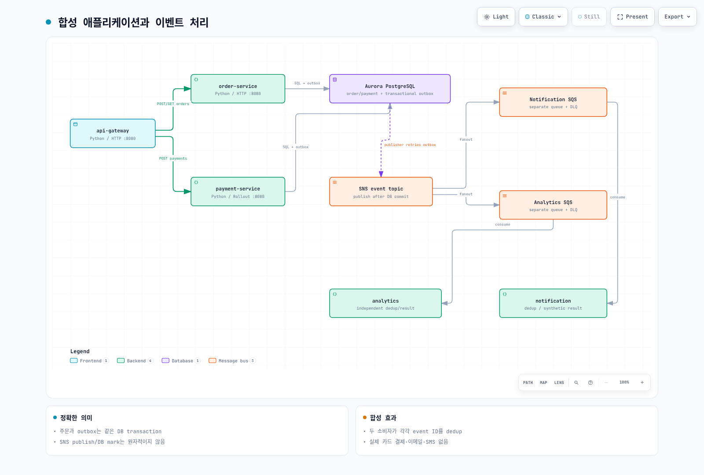
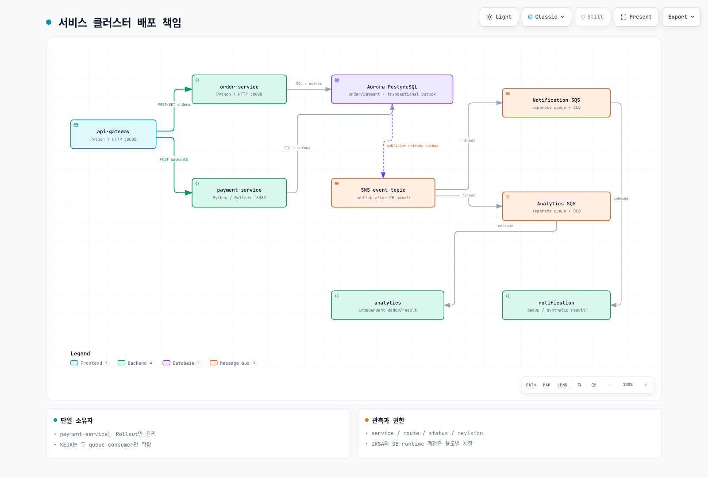
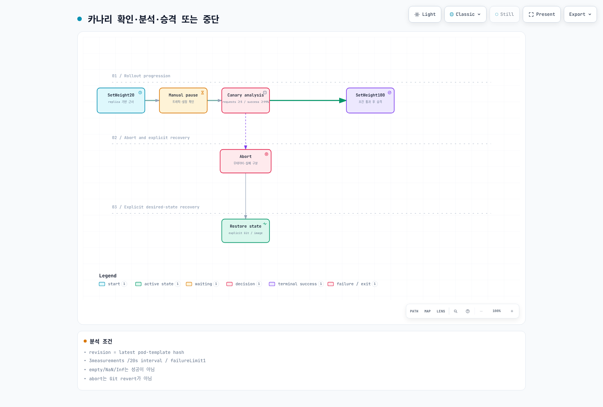

# Part 3: MSA 배포 및 카나리

<span id="argo-rollouts-dashboard"></span>
<span id="canary-배포-상태-다이어그램"></span>
<span id="dockerfile-예시"></span>
<span id="git-저장소-구조"></span>
<span id="grafana에서-트래픽-분할-확인"></span>
<span id="step-3-1-msa-애플리케이션-소개"></span>
<span id="step-3-2-karpenter-nodepool-구성"></span>
<span id="step-3-3-keda-scaledobject-구성"></span>
<span id="step-3-4-argocd-application-applicationset"></span>
<span id="step-3-5-초기-배포-확인"></span>
<span id="step-3-6-otel-auto-instrumentation-구성"></span>
<span id="step-3-7-argo-rollouts-canary-배포"></span>
<span id="step-3-8-의도적-실패-주입-및-자동-롤백"></span>
<span id="검증-verification"></span>
<span id="검증-항목"></span>
<span id="다음-단계"></span>
<span id="서비스-구성"></span>
<span id="서비스-코드-예시"></span>
<span id="아키텍처-개요"></span>
<span id="예상-결과"></span>
<span id="예상-결과-1"></span>
<span id="참조-문서"></span>
<span id="학습-목표"></span>

> **난이도**: 고급
> **마지막 업데이트**: 2026년 9월 13일
실제 실행 가능한 5개 Python 역할을 별도 workload로 배포합니다. [application README](https://github.com/Atom-oh/kubernetes-docs/tree/main/examples/labs/observability/application)가 코드·DB·이미지·차트 입력의 기준입니다. 결제/알림은 합성 실습이며 실제 결제나 이메일/SMS 발송을 수행하지 않습니다.



[🔍 인터랙티브 다이어그램 보기](https://www.atomai.click/kubernetes-docs/archmaps/ko-labs-observability-03-msa-deployment-lab-10.html)

## 1. 공유 API·저장 계약 {#contracts}

| Request/role | Contract |
|---|---|
| `POST /orders` | 201 + `id`; order and outbox commit together |
| `POST /payments` | 200 + `status: completed`; same order/amount/method is idempotent |
| `GET /orders/{id}` | 200 + same ID, or404 |
| `notification` | Own SQS queue, persisted synthetic notification |
| `analytics` | Separate SQS queue, independent persisted result |

gateway→service HTTP와 producer→consumer에 W3C context를 전달합니다. Outbox publish 성공 후 DB mark 전에 실패하면 재전송되므로 소비자는 event ID를 DB transaction으로 dedup합니다. 외부 이메일/결제 side effect까지 DB transaction으로 exactly-once라고 주장하지 않습니다. 주문 POST 자체의 일반 Idempotency-Key 처리는 포함하지 않습니다.

앱 metric은 `lab_http_requests_total`, `lab_http_request_duration_seconds`이며 service/route/status/revision label만 사용합니다. JSON 로그에 service/level/trace_id/span_id를 기록하고 고객·결제 payload를 metric label로 쓰지 않습니다.

## 2. DB 파일과 이미지 {#image-database}

Part1의 전용 runtime 계정과 private connection file을 사용합니다. Pod에서는 CA 경로 `/run/database-ca/global-bundle.pem`, connection path `/run/database/connection.json`을 사용합니다. 연결 파일과 public RDS CA를 각각 Secret/ConfigMap으로 mount합니다.

```bash
cd examples/labs/observability/application
kubectl --context service create namespace msa --dry-run=client -o yaml | kubectl --context service apply -f -
kubectl --context service -n msa create secret generic lab-database --from-file=connection.json="$LAB_STATE/runtime-pod-connection.json"
kubectl --context service -n msa create configmap lab-database-ca --from-file=global-bundle.pem="$LAB_STATE/global-bundle.pem"
docker buildx build --platform linux/amd64 \
  --tag "$IMAGE_REPOSITORY:$IMAGE_TAG" --push .
docker buildx imagetools inspect "$IMAGE_REPOSITORY:$IMAGE_TAG"
```
태그는 Part1에서 선택한 immutable version과 일치시킵니다. 기존 Secret을 갱신할 때는 값을 출력하거나 chart에 넣지 말고 조직의 secret rotation 절차를 사용합니다. Dockerfile은 고정 base digest·non-root UID10001·제한된 build context를 사용합니다.

생성되는 `m6i.large` 노드는 AMD64입니다. AMD64 또는 해당 대상의 교차 빌드를 지원하는 Buildx builder를 사용하고, 배포 전에 push된 manifest의 `linux/amd64`를 확인합니다. 감사에서 실행한 로컬 ARM64 smoke test는 AMD64 빌드 검증을 대신하지 않습니다.

## 3. controller와 chart 설치 {#deployment}

```bash
helm repo add kedacore https://kedacore.github.io/charts
helm repo add argo https://argoproj.github.io/argo-helm
helm upgrade --install keda kedacore/keda --version 2.20.2   --kube-context service -n keda --create-namespace -f "$LAB_STATE/helm-inputs/keda.yaml"
helm upgrade --install argo-rollouts argo/argo-rollouts --version 2.43.1   --kube-context service -n argo-rollouts --create-namespace
helm upgrade --install observability-lab ./chart --kube-context service -n msa   -f "$LAB_STATE/helm-inputs/application.yaml"
kubectl --context service -n msa get deployment,rollout,pods,svc,scaledobject
```
5개 ServiceAccount의 역할과 IRSA subject를 확인합니다. gateway는 AWS 역할이 없고, publisher는 SNS, 소비자는 자기 queue, KEDA는 queue attributes만 접근합니다. 기존 Pod Identity와 IRSA를 같은 workload에 중복 구성하지 않습니다. readiness는 DB/schema를 확인하지만 SQS/IAM delivery 성공까지 의미하지 않습니다.

ServiceMonitor label은 service Prometheus release와 일치합니다. `honorLabels`로 앱 service label을 유지합니다. NodePool이 없는 환경에서도 EKS managed node group에서 실행할 수 있으며, Karpenter는 [별도 가이드](../../autoscaling/02-karpenter.md)의 IAM·discovery·EC2NodeClass·AMI·taint 검증 후 추가합니다.



[🔍 인터랙티브 다이어그램 보기](https://www.atomai.click/kubernetes-docs/archmaps/ko-labs-observability-03-msa-deployment-lab-0.html)

## 4. 기본 트래픽과 비동기 처리 검증 {#verify}

```bash
kubectl --context service -n msa port-forward svc/api-gateway 8080:8080
# Run in another terminal from the repository root:
BASE_URL=http://127.0.0.1:8080 LOAD_PROFILE=smoke   k6 run --no-usage-report examples/labs/observability/load-test/k6-scenario.js
```
생성한 ID로만 조회하고 합성 결제 상태까지 검증합니다. 두 큐에 각각 이벤트가 도착하는지, consumer의 `/stats`·DB count·log가 증가하는지 확인합니다. 같은 큐를 notification과 analytics가 경쟁 소비하면 fanout이 아니므로 큐를 분리했습니다. 실패/poison message는 ack하지 않고 DLQ 정책으로 처리합니다.

CloudWatch·Loki의 JSON trace_id와 Tempo의 실제 span, Prometheus exemplar ID를 대조합니다. 수집기만 설치한 상태를 전체 E2E 성공으로 기록하지 않습니다.

## 5. 카나리·GitOps 책임 {#canary}




[🔍 인터랙티브 다이어그램 보기](https://www.atomai.click/kubernetes-docs/archmaps/ko-labs-observability-03-msa-deployment-lab-1.html)
payment-service는 Rollout 하나만 소유합니다. 기본 5 replicas의 20% step은 replica 비율 기반이며 실제 요청 20%를 보장하지 않습니다. 기본 pause에서 새 revision에 트래픽을 만든 뒤 분석합니다. 쿼리는 `rollouts-pod-template-hash` revision으로 제한하고 최근 요청5개 이상·성공률99% 이상을 요구합니다. empty/NaN/Inf/multi-series는 통과하지 않습니다.

Argo Rollouts1.10.0의 실제 조건 평가와 PromQL을 검증했지만 실제 클러스터 promotion은 실행하지 않았습니다. abort는 Git revert나 desired image 복구가 아닙니다. ArgoCD를 선택하면 [설치 가이드](../../gitops/argocd/01-installation.md)를 따라 이 저장소의 실제 chart 경로와 검토한 revision을 사용하고, 직접 Helm 관리와 동시에 소유하지 않습니다. Secret은 Git에 넣지 않고 기존 이름을 참조합니다. App-of-apps sync wave만으로 child readiness가 보장된다고 가정하지 않습니다.

[Part4](./04-load-testing-scaling-lab.md)로 진행합니다. 전체 정리는 [Part6](./06-distributed-tracing-lab.md#cleanup)의 소유권·의존성 순서를 따릅니다.

## 검증 범위

로컬 SQLite/PostgreSQL·HTTP3서비스·OTel상관관계·SDK모의SNS/SQS·container smoke·Helm/CRD·PromQL/Argo조건을 확인했습니다. 실제 AuroraTLS·EKS/IRSA·SQSfanout·KEDA/Karpenter·canary traffic split은 실행하지 않았습니다.
