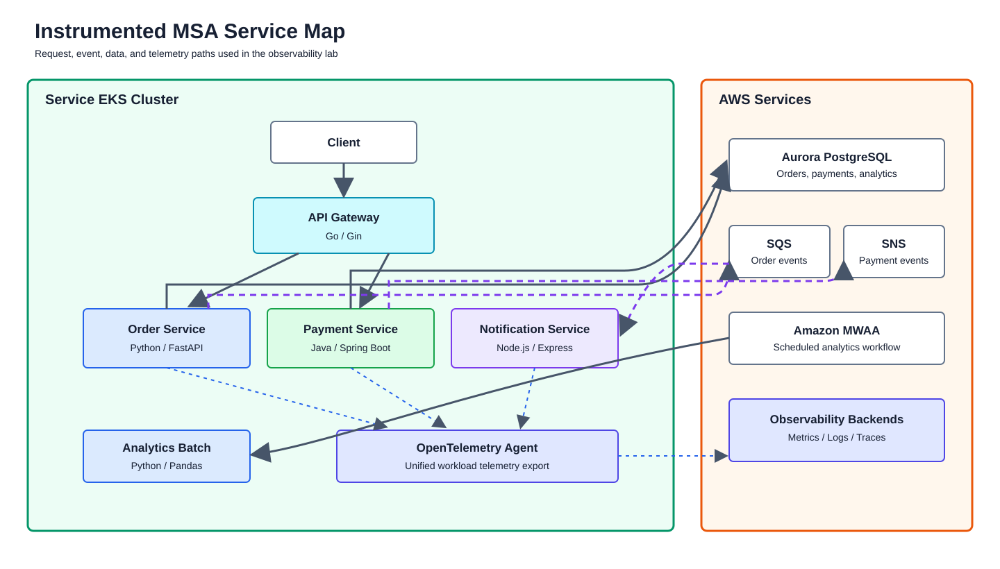
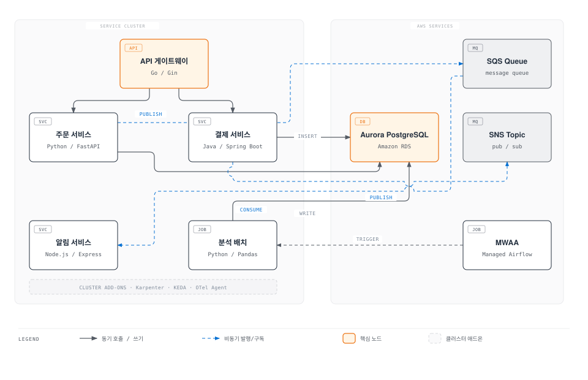
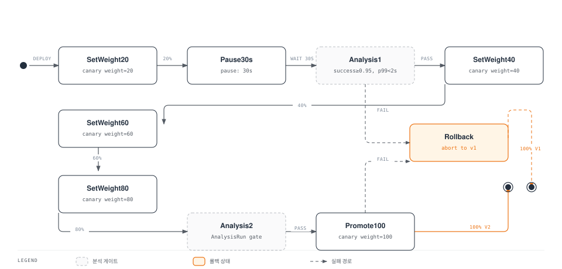

# Part 3: MSA 배포 및 카나리

> **난이도**: 고급 (Advanced) **예상 소요 시간**: 60분 **마지막 업데이트**: 2026년 2월 23일

## 학습 목표

* ArgoCD 멀티 클러스터 MSA 배포
* Argo Rollouts Canary 배포 및 AnalysisTemplate 구성
* OpenTelemetry auto-instrumentation 적용

## 아키텍처 개요





***

## Step 3.1: MSA 애플리케이션 소개

### 서비스 구성

| 서비스                  | 언어/프레임워크           | 포트   | 역할          | OTel SDK                                         |
| -------------------- | ------------------ | ---- | ----------- | ------------------------------------------------ |
| api-gateway          | Go / Gin           | 8080 | API 라우팅, 인증 | Manual                                           |
| order-service        | Python / FastAPI   | 8000 | 주문 CRUD     | Auto (opentelemetry-instrument)                  |
| payment-service      | Java / Spring Boot | 8080 | 결제 처리       | Auto (javaagent)                                 |
| notification-service | Node.js / Express  | 3000 | 알림 발송       | Auto (@opentelemetry/auto-instrumentations-node) |
| analytics-batch      | Python / Pandas    | -    | 배치 분석       | Auto (opentelemetry-instrument)                  |

### Git 저장소 구조

```
observability-lab-code/
├── apps/
│   ├── api-gateway/
│   │   ├── main.go
│   │   ├── Dockerfile
│   │   └── k8s/
│   │       ├── deployment.yaml
│   │       └── service.yaml
│   ├── order-service/
│   │   ├── main.py
│   │   ├── requirements.txt
│   │   ├── Dockerfile
│   │   └── k8s/
│   ├── payment-service/
│   │   ├── src/main/java/...
│   │   ├── pom.xml
│   │   ├── Dockerfile
│   │   └── k8s/
│   ├── notification-service/
│   │   ├── index.js
│   │   ├── package.json
│   │   ├── Dockerfile
│   │   └── k8s/
│   └── analytics-batch/
│       ├── batch.py
│       ├── requirements.txt
│       ├── Dockerfile
│       └── dags/
├── argocd/
│   ├── app-of-apps.yaml
│   └── applications/
└── rollouts/
    ├── rollout.yaml
    └── analysis-template.yaml
```

### 서비스 코드 예시

**API Gateway (Go)**

```go
// apps/api-gateway/main.go
package main

import (
    "context"
    "net/http"
    "os"

    "github.com/gin-gonic/gin"
    "go.opentelemetry.io/contrib/instrumentation/github.com/gin-gonic/gin/otelgin"
    "go.opentelemetry.io/otel"
    "go.opentelemetry.io/otel/exporters/otlp/otlptrace/otlptracegrpc"
    "go.opentelemetry.io/otel/propagation"
    "go.opentelemetry.io/otel/sdk/resource"
    sdktrace "go.opentelemetry.io/otel/sdk/trace"
    semconv "go.opentelemetry.io/otel/semconv/v1.24.0"
)

func initTracer() (*sdktrace.TracerProvider, error) {
    ctx := context.Background()

    exporter, err := otlptracegrpc.New(ctx,
        otlptracegrpc.WithEndpoint(os.Getenv("OTEL_EXPORTER_OTLP_ENDPOINT")),
        otlptracegrpc.WithInsecure(),
    )
    if err != nil {
        return nil, err
    }

    tp := sdktrace.NewTracerProvider(
        sdktrace.WithBatcher(exporter),
        sdktrace.WithResource(resource.NewWithAttributes(
            semconv.SchemaURL,
            semconv.ServiceNameKey.String("api-gateway"),
            semconv.ServiceVersionKey.String("v1.0.0"),
        )),
    )

    otel.SetTracerProvider(tp)
    otel.SetTextMapPropagator(propagation.NewCompositeTextMapPropagator(
        propagation.TraceContext{},
        propagation.Baggage{},
    ))

    return tp, nil
}

func main() {
    tp, err := initTracer()
    if err != nil {
        panic(err)
    }
    defer tp.Shutdown(context.Background())

    r := gin.Default()
    r.Use(otelgin.Middleware("api-gateway"))

    // Health check
    r.GET("/health", func(c *gin.Context) {
        c.JSON(http.StatusOK, gin.H{"status": "healthy"})
    })

    // Order endpoints - proxy to order-service
    r.POST("/orders", proxyToService("order-service:8000"))
    r.GET("/orders/:id", proxyToService("order-service:8000"))

    // Payment endpoints - proxy to payment-service
    r.POST("/payments", proxyToService("payment-service:8080"))
    r.GET("/payments/:id", proxyToService("payment-service:8080"))

    r.Run(":8080")
}

func proxyToService(target string) gin.HandlerFunc {
    return func(c *gin.Context) {
        // Proxy implementation with trace context propagation
        // ...
    }
}
```

**Order Service (Python/FastAPI)**

```python
# apps/order-service/main.py
import os
import json
import logging
from datetime import datetime
from typing import Optional

import boto3
from fastapi import FastAPI, HTTPException
from pydantic import BaseModel
from sqlalchemy import create_engine, Column, Integer, String, DateTime
from sqlalchemy.ext.declarative import declarative_base
from sqlalchemy.orm import sessionmaker

# OpenTelemetry auto-instrumentation handles this
# Just need to configure via environment variables

logging.basicConfig(level=logging.INFO)
logger = logging.getLogger(__name__)

app = FastAPI(title="Order Service")

# Database setup
DATABASE_URL = os.getenv("DATABASE_URL")
engine = create_engine(DATABASE_URL)
SessionLocal = sessionmaker(bind=engine)
Base = declarative_base()

# SQS client
sqs = boto3.client('sqs', region_name=os.getenv("AWS_REGION", "us-east-1"))
SQS_QUEUE_URL = os.getenv("SQS_QUEUE_URL")

class Order(Base):
    __tablename__ = "orders"
    id = Column(Integer, primary_key=True)
    customer_id = Column(String(50))
    product_id = Column(String(50))
    quantity = Column(Integer)
    status = Column(String(20), default="pending")
    created_at = Column(DateTime, default=datetime.utcnow)

class OrderCreate(BaseModel):
    customer_id: str
    product_id: str
    quantity: int

class OrderResponse(BaseModel):
    id: int
    customer_id: str
    product_id: str
    quantity: int
    status: str
    created_at: datetime

@app.get("/health")
async def health():
    return {"status": "healthy", "service": "order-service"}

@app.post("/orders", response_model=OrderResponse, status_code=201)
async def create_order(order: OrderCreate):
    logger.info(f"Creating order for customer {order.customer_id}")

    db = SessionLocal()
    try:
        db_order = Order(
            customer_id=order.customer_id,
            product_id=order.product_id,
            quantity=order.quantity
        )
        db.add(db_order)
        db.commit()
        db.refresh(db_order)

        # Publish to SQS
        message = {
            "event_type": "order_created",
            "order_id": db_order.id,
            "customer_id": db_order.customer_id,
            "timestamp": datetime.utcnow().isoformat()
        }
        sqs.send_message(
            QueueUrl=SQS_QUEUE_URL,
            MessageBody=json.dumps(message)
        )
        logger.info(f"Order {db_order.id} created and event published")

        return db_order
    except Exception as e:
        logger.error(f"Error creating order: {e}")
        raise HTTPException(status_code=500, detail=str(e))
    finally:
        db.close()

@app.get("/orders/{order_id}", response_model=OrderResponse)
async def get_order(order_id: int):
    db = SessionLocal()
    try:
        order = db.query(Order).filter(Order.id == order_id).first()
        if not order:
            raise HTTPException(status_code=404, detail="Order not found")
        return order
    finally:
        db.close()

if __name__ == "__main__":
    import uvicorn
    uvicorn.run(app, host="0.0.0.0", port=8000)
```

**Payment Service (Java/Spring Boot)**

```java
// apps/payment-service/src/main/java/com/obslab/payment/PaymentController.java
package com.obslab.payment;

import org.slf4j.Logger;
import org.slf4j.LoggerFactory;
import org.springframework.beans.factory.annotation.Autowired;
import org.springframework.beans.factory.annotation.Value;
import org.springframework.http.HttpStatus;
import org.springframework.http.ResponseEntity;
import org.springframework.web.bind.annotation.*;
import software.amazon.awssdk.services.sns.SnsClient;
import software.amazon.awssdk.services.sns.model.PublishRequest;

import java.time.LocalDateTime;

@RestController
@RequestMapping("/payments")
public class PaymentController {

    private static final Logger logger = LoggerFactory.getLogger(PaymentController.class);

    @Autowired
    private PaymentRepository paymentRepository;

    @Autowired
    private SnsClient snsClient;

    @Value("${aws.sns.topic-arn}")
    private String snsTopicArn;

    @PostMapping
    public ResponseEntity<Payment> createPayment(@RequestBody PaymentRequest request) {
        logger.info("Processing payment for order {}", request.getOrderId());

        Payment payment = new Payment();
        payment.setOrderId(request.getOrderId());
        payment.setAmount(request.getAmount());
        payment.setPaymentMethod(request.getPaymentMethod());
        payment.setStatus("completed");
        payment.setCreatedAt(LocalDateTime.now());

        Payment saved = paymentRepository.save(payment);

        // Publish to SNS
        String message = String.format(
            "{\"event_type\":\"payment_completed\",\"payment_id\":%d,\"order_id\":%d,\"amount\":%.2f}",
            saved.getId(), saved.getOrderId(), saved.getAmount()
        );

        snsClient.publish(PublishRequest.builder()
            .topicArn(snsTopicArn)
            .message(message)
            .build());

        logger.info("Payment {} completed for order {}", saved.getId(), saved.getOrderId());

        return ResponseEntity.status(HttpStatus.CREATED).body(saved);
    }

    @GetMapping("/{id}")
    public ResponseEntity<Payment> getPayment(@PathVariable Long id) {
        return paymentRepository.findById(id)
            .map(ResponseEntity::ok)
            .orElse(ResponseEntity.notFound().build());
    }

    @GetMapping("/health")
    public ResponseEntity<String> health() {
        return ResponseEntity.ok("{\"status\":\"healthy\",\"service\":\"payment-service\"}");
    }
}
```

**Notification Service (Node.js/Express)**

```javascript
// apps/notification-service/index.js
const express = require('express');
const { SQSClient, ReceiveMessageCommand, DeleteMessageCommand } = require('@aws-sdk/client-sqs');

// OpenTelemetry auto-instrumentation is loaded via -r flag
// node -r @opentelemetry/auto-instrumentations-node/register index.js

const app = express();
const port = process.env.PORT || 3000;

const sqsClient = new SQSClient({ region: process.env.AWS_REGION || 'us-east-1' });
const queueUrl = process.env.SQS_QUEUE_URL;

app.get('/health', (req, res) => {
  res.json({ status: 'healthy', service: 'notification-service' });
});

// SQS Consumer
async function pollMessages() {
  while (true) {
    try {
      const command = new ReceiveMessageCommand({
        QueueUrl: queueUrl,
        MaxNumberOfMessages: 10,
        WaitTimeSeconds: 20,
        MessageAttributeNames: ['All'],
      });

      const response = await sqsClient.send(command);

      if (response.Messages) {
        for (const message of response.Messages) {
          await processMessage(message);
        }
      }
    } catch (error) {
      console.error('Error polling messages:', error);
      await new Promise(resolve => setTimeout(resolve, 5000));
    }
  }
}

async function processMessage(message) {
  console.log('Processing message:', message.MessageId);

  try {
    const body = JSON.parse(message.Body);

    // Send notification based on event type
    if (body.event_type === 'order_created') {
      await sendNotification({
        type: 'email',
        to: body.customer_id,
        subject: 'Order Confirmation',
        body: `Your order ${body.order_id} has been created.`,
      });
    }

    // Delete message from queue
    await sqsClient.send(new DeleteMessageCommand({
      QueueUrl: queueUrl,
      ReceiptHandle: message.ReceiptHandle,
    }));

    console.log('Message processed successfully:', message.MessageId);
  } catch (error) {
    console.error('Error processing message:', error);
    throw error;
  }
}

async function sendNotification(notification) {
  // Simulate notification sending
  console.log('Sending notification:', notification);
  await new Promise(resolve => setTimeout(resolve, 100));
  console.log('Notification sent:', notification.type);
}

app.listen(port, () => {
  console.log(`Notification service listening on port ${port}`);
  pollMessages();
});
```

### Dockerfile 예시

**Order Service Dockerfile**

```dockerfile
# apps/order-service/Dockerfile
FROM python:3.11-slim

WORKDIR /app

# Install dependencies
COPY requirements.txt .
RUN pip install --no-cache-dir -r requirements.txt

# Install OpenTelemetry instrumentation
RUN pip install opentelemetry-distro opentelemetry-exporter-otlp
RUN opentelemetry-bootstrap -a install

COPY . .

# Use opentelemetry-instrument to auto-instrument
CMD ["opentelemetry-instrument", "uvicorn", "main:app", "--host", "0.0.0.0", "--port", "8000"]
```

**Payment Service Dockerfile**

```dockerfile
# apps/payment-service/Dockerfile
FROM eclipse-temurin:21-jdk-alpine AS builder

WORKDIR /app
COPY pom.xml .
COPY src ./src

RUN ./mvnw clean package -DskipTests

FROM eclipse-temurin:21-jre-alpine

WORKDIR /app

# Download OpenTelemetry Java agent
ADD https://github.com/open-telemetry/opentelemetry-java-instrumentation/releases/download/v2.2.0/opentelemetry-javaagent.jar /app/opentelemetry-javaagent.jar

COPY --from=builder /app/target/*.jar app.jar

# Run with Java agent
ENTRYPOINT ["java", "-javaagent:/app/opentelemetry-javaagent.jar", "-jar", "app.jar"]
```

***

## Step 3.2: Karpenter NodePool 구성

**Step 3.2.1: Service Cluster Karpenter 설정**

```bash
# Service Cluster로 전환
kubectl config use-context service
```

```yaml
# karpenter-nodepool.yaml
apiVersion: karpenter.sh/v1
kind: NodePool
metadata:
  name: msa-workloads
spec:
  template:
    metadata:
      labels:
        workload-type: msa
    spec:
      requirements:
        - key: kubernetes.io/arch
          operator: In
          values: ["amd64"]
        - key: karpenter.sh/capacity-type
          operator: In
          values: ["spot", "on-demand"]
        - key: node.kubernetes.io/instance-type
          operator: In
          values:
            - m5.large
            - m5.xlarge
            - m5.2xlarge
            - m6i.large
            - m6i.xlarge
            - m6i.2xlarge
            - c5.large
            - c5.xlarge
            - c6i.large
            - c6i.xlarge
      nodeClassRef:
        name: default
  limits:
    cpu: 200
    memory: 400Gi
  disruption:
    consolidationPolicy: WhenUnderutilized
    consolidateAfter: 30s
    budgets:
      - nodes: "20%"
---
apiVersion: karpenter.k8s.aws/v1
kind: EC2NodeClass
metadata:
  name: default
spec:
  amiFamily: AL2
  role: KarpenterNodeRole-obs-service
  subnetSelectorTerms:
    - tags:
        karpenter.sh/discovery: obs-service-cluster
  securityGroupSelectorTerms:
    - tags:
        karpenter.sh/discovery: obs-service-cluster
  blockDeviceMappings:
    - deviceName: /dev/xvda
      ebs:
        volumeSize: 100Gi
        volumeType: gp3
        iops: 3000
        throughput: 125
        deleteOnTermination: true
  tags:
    Environment: lab
    ManagedBy: karpenter
```

```bash
kubectl apply -f karpenter-nodepool.yaml
```

***

## Step 3.3: KEDA ScaledObject 구성

| Scaler     | Target Service       | Trigger         | Scale 기준  |
| ---------- | -------------------- | --------------- | --------- |
| SQS        | notification-service | SQS Queue Depth | 메시지 > 10개 |
| Prometheus | order-service        | Request Rate    | RPS > 100 |

**Step 3.3.1: KEDA 설치**

```bash
helm repo add kedacore https://kedacore.github.io/charts
helm repo update

helm install keda kedacore/keda \
  --namespace keda \
  --create-namespace \
  --wait
```

**Step 3.3.2: SQS Scaler (notification-service)**

```yaml
# keda-sqs-scaler.yaml
apiVersion: keda.sh/v1alpha1
kind: TriggerAuthentication
metadata:
  name: aws-credentials
  namespace: msa
spec:
  podIdentity:
    provider: aws-eks
---
apiVersion: keda.sh/v1alpha1
kind: ScaledObject
metadata:
  name: notification-service-scaler
  namespace: msa
spec:
  scaleTargetRef:
    name: notification-service
  pollingInterval: 15
  cooldownPeriod: 60
  minReplicaCount: 1
  maxReplicaCount: 20
  triggers:
    - type: aws-sqs-queue
      authenticationRef:
        name: aws-credentials
      metadata:
        queueURL: "${SQS_QUEUE_URL}"
        queueLength: "10"
        awsRegion: "us-east-1"
        identityOwner: operator
```

**Step 3.3.3: Prometheus Scaler (order-service)**

```yaml
# keda-prometheus-scaler.yaml
apiVersion: keda.sh/v1alpha1
kind: ScaledObject
metadata:
  name: order-service-scaler
  namespace: msa
spec:
  scaleTargetRef:
    name: order-service
  pollingInterval: 15
  cooldownPeriod: 60
  minReplicaCount: 2
  maxReplicaCount: 15
  triggers:
    - type: prometheus
      metadata:
        serverAddress: http://prometheus-operated.monitoring.svc:9090
        metricName: http_requests_total
        query: sum(rate(http_requests_total{service="order-service"}[1m]))
        threshold: "100"
```

```bash
envsubst < keda-sqs-scaler.yaml | kubectl apply -f -
kubectl apply -f keda-prometheus-scaler.yaml
```

***

## Step 3.4: ArgoCD Application/ApplicationSet

**Step 3.4.1: App-of-Apps 패턴**

```yaml
# argocd/app-of-apps.yaml
apiVersion: argoproj.io/v1alpha1
kind: Application
metadata:
  name: obs-lab-apps
  namespace: argocd
  finalizers:
    - resources-finalizer.argocd.argoproj.io
spec:
  project: obs-lab
  source:
    repoURL: https://github.com/example/observability-lab-code.git
    targetRevision: main
    path: argocd/applications
  destination:
    server: https://kubernetes.default.svc
    namespace: argocd
  syncPolicy:
    automated:
      prune: true
      selfHeal: true
    syncOptions:
      - CreateNamespace=true
```

**Step 3.4.2: ApplicationSet (서비스별)**

```yaml
# argocd/applications/msa-apps.yaml
apiVersion: argoproj.io/v1alpha1
kind: ApplicationSet
metadata:
  name: msa-services
  namespace: argocd
spec:
  generators:
    - list:
        elements:
          - name: api-gateway
            path: apps/api-gateway/k8s
          - name: order-service
            path: apps/order-service/k8s
          - name: payment-service
            path: apps/payment-service/k8s
          - name: notification-service
            path: apps/notification-service/k8s

  template:
    metadata:
      name: '{{name}}'
      namespace: argocd
      labels:
        app.kubernetes.io/part-of: obs-lab-msa
    spec:
      project: obs-lab
      source:
        repoURL: https://github.com/example/observability-lab-code.git
        targetRevision: main
        path: '{{path}}'
      destination:
        server: https://obs-service-cluster-endpoint
        namespace: msa
      syncPolicy:
        automated:
          prune: true
          selfHeal: true
        syncOptions:
          - CreateNamespace=true
          - ApplyOutOfSyncOnly=true
```

```bash
# Managed Cluster로 전환
kubectl config use-context managed

# App-of-Apps 배포
kubectl apply -f argocd/app-of-apps.yaml
```

***

## Step 3.5: 초기 배포 확인

```bash
# ArgoCD Application 상태 확인
argocd app list

# Service Cluster의 MSA Pod 확인
kubectl --context service get pods -n msa -o wide

# 모든 서비스 Ready 대기
kubectl --context service wait --for=condition=Ready pod -l app.kubernetes.io/part-of=obs-lab-msa -n msa --timeout=300s
```

### 예상 결과

| Application          | Sync Status | Health Status |
| -------------------- | ----------- | ------------- |
| api-gateway          | Synced      | Healthy       |
| order-service        | Synced      | Healthy       |
| payment-service      | Synced      | Healthy       |
| notification-service | Synced      | Healthy       |

***

## Step 3.6: OTel Auto-Instrumentation 구성

| 서비스                  | 언어      | Instrumentation 방식                | 설정 방법                 |
| -------------------- | ------- | --------------------------------- | --------------------- |
| api-gateway          | Go      | Manual SDK                        | 코드에 직접 통합             |
| order-service        | Python  | Auto (opentelemetry-instrument)   | Dockerfile ENTRYPOINT |
| payment-service      | Java    | Auto (javaagent)                  | -javaagent JVM 옵션     |
| notification-service | Node.js | Auto (auto-instrumentations-node) | -r 플래그                |
| analytics-batch      | Python  | Auto (opentelemetry-instrument)   | Dockerfile ENTRYPOINT |

**Step 3.6.1: OTel 환경 변수 ConfigMap**

```yaml
# otel-env-configmap.yaml
apiVersion: v1
kind: ConfigMap
metadata:
  name: otel-env
  namespace: msa
data:
  OTEL_EXPORTER_OTLP_ENDPOINT: "http://otel-agent-collector.msa.svc:4317"
  OTEL_EXPORTER_OTLP_PROTOCOL: "grpc"
  OTEL_RESOURCE_ATTRIBUTES: "service.namespace=obs-lab,deployment.environment=lab"
  OTEL_TRACES_SAMPLER: "parentbased_traceidratio"
  OTEL_TRACES_SAMPLER_ARG: "1.0"
  OTEL_LOGS_EXPORTER: "otlp"
  OTEL_METRICS_EXPORTER: "otlp"
```

**Step 3.6.2: 서비스별 Deployment에 환경 변수 적용**

```yaml
# apps/order-service/k8s/deployment.yaml
apiVersion: apps/v1
kind: Deployment
metadata:
  name: order-service
  namespace: msa
spec:
  replicas: 2
  selector:
    matchLabels:
      app: order-service
  template:
    metadata:
      labels:
        app: order-service
      annotations:
        prometheus.io/scrape: "true"
        prometheus.io/port: "8000"
    spec:
      serviceAccountName: msa-service-account
      containers:
        - name: order-service
          image: ${ECR_REPO}/order-service:v1.0.0
          ports:
            - containerPort: 8000
          envFrom:
            - configMapRef:
                name: otel-env
          env:
            - name: OTEL_SERVICE_NAME
              value: "order-service"
            - name: DATABASE_URL
              valueFrom:
                secretKeyRef:
                  name: aurora-credentials
                  key: url
            - name: SQS_QUEUE_URL
              valueFrom:
                configMapKeyRef:
                  name: aws-resources
                  key: sqs-queue-url
            - name: AWS_REGION
              value: "us-east-1"
          resources:
            requests:
              cpu: 200m
              memory: 256Mi
            limits:
              cpu: 1000m
              memory: 512Mi
          livenessProbe:
            httpGet:
              path: /health
              port: 8000
            initialDelaySeconds: 10
            periodSeconds: 10
          readinessProbe:
            httpGet:
              path: /health
              port: 8000
            initialDelaySeconds: 5
            periodSeconds: 5
```

**Step 3.6.3: Java 서비스 (Payment) - javaagent 설정**

```yaml
# apps/payment-service/k8s/deployment.yaml
apiVersion: apps/v1
kind: Deployment
metadata:
  name: payment-service
  namespace: msa
spec:
  replicas: 2
  selector:
    matchLabels:
      app: payment-service
  template:
    metadata:
      labels:
        app: payment-service
    spec:
      serviceAccountName: msa-service-account
      containers:
        - name: payment-service
          image: ${ECR_REPO}/payment-service:v1.0.0
          ports:
            - containerPort: 8080
          env:
            - name: OTEL_SERVICE_NAME
              value: "payment-service"
            - name: OTEL_EXPORTER_OTLP_ENDPOINT
              value: "http://otel-agent-collector.msa.svc:4317"
            - name: OTEL_TRACES_EXPORTER
              value: "otlp"
            - name: OTEL_METRICS_EXPORTER
              value: "otlp"
            - name: OTEL_LOGS_EXPORTER
              value: "otlp"
            - name: JAVA_TOOL_OPTIONS
              value: "-javaagent:/app/opentelemetry-javaagent.jar"
            - name: SPRING_DATASOURCE_URL
              valueFrom:
                secretKeyRef:
                  name: aurora-credentials
                  key: jdbc-url
          resources:
            requests:
              cpu: 500m
              memory: 512Mi
            limits:
              cpu: 2000m
              memory: 1Gi
```

***

## Step 3.7: Argo Rollouts Canary 배포

### Canary 배포 상태 다이어그램



**Step 3.7.1: Rollout 리소스**

```yaml
# rollouts/order-service-rollout.yaml
apiVersion: argoproj.io/v1alpha1
kind: Rollout
metadata:
  name: order-service
  namespace: msa
spec:
  replicas: 4
  revisionHistoryLimit: 3
  selector:
    matchLabels:
      app: order-service
  template:
    metadata:
      labels:
        app: order-service
    spec:
      serviceAccountName: msa-service-account
      containers:
        - name: order-service
          image: ${ECR_REPO}/order-service:v1.0.0
          ports:
            - containerPort: 8000
          envFrom:
            - configMapRef:
                name: otel-env
          env:
            - name: OTEL_SERVICE_NAME
              value: "order-service"
          resources:
            requests:
              cpu: 200m
              memory: 256Mi
            limits:
              cpu: 1000m
              memory: 512Mi
  strategy:
    canary:
      canaryService: order-service-canary
      stableService: order-service-stable
      trafficRouting:
        nginx:
          stableIngress: order-service-ingress
      steps:
        - setWeight: 20
        - pause: { duration: 30s }
        - analysis:
            templates:
              - templateName: success-rate-latency
            args:
              - name: service-name
                value: order-service
        - setWeight: 40
        - pause: { duration: 30s }
        - setWeight: 60
        - pause: { duration: 30s }
        - setWeight: 80
        - analysis:
            templates:
              - templateName: success-rate-latency
            args:
              - name: service-name
                value: order-service
        - setWeight: 100
      analysis:
        successfulRunHistoryLimit: 3
        unsuccessfulRunHistoryLimit: 3
```

**Step 3.7.2: AnalysisTemplate**

```yaml
# rollouts/analysis-template.yaml
apiVersion: argoproj.io/v1alpha1
kind: AnalysisTemplate
metadata:
  name: success-rate-latency
  namespace: msa
spec:
  args:
    - name: service-name
  metrics:
    - name: success-rate
      interval: 30s
      count: 3
      successCondition: result[0] >= 0.95
      failureLimit: 1
      provider:
        prometheus:
          address: http://prometheus-operated.monitoring.svc:9090
          query: |
            sum(rate(http_requests_total{service="{{args.service-name}}", status=~"2.."}[5m])) /
            sum(rate(http_requests_total{service="{{args.service-name}}"}[5m]))

    - name: p99-latency
      interval: 30s
      count: 3
      successCondition: result[0] < 2
      failureLimit: 1
      provider:
        prometheus:
          address: http://prometheus-operated.monitoring.svc:9090
          query: |
            histogram_quantile(0.99,
              sum(rate(http_request_duration_seconds_bucket{service="{{args.service-name}}"}[5m])) by (le)
            )

    - name: error-rate
      interval: 30s
      count: 3
      successCondition: result[0] < 0.05
      failureLimit: 1
      provider:
        prometheus:
          address: http://prometheus-operated.monitoring.svc:9090
          query: |
            sum(rate(http_requests_total{service="{{args.service-name}}", status=~"5.."}[5m])) /
            sum(rate(http_requests_total{service="{{args.service-name}}"}[5m]))
```

**Step 3.7.3: Service 리소스**

```yaml
# rollouts/services.yaml
apiVersion: v1
kind: Service
metadata:
  name: order-service-stable
  namespace: msa
spec:
  selector:
    app: order-service
  ports:
    - port: 8000
      targetPort: 8000
---
apiVersion: v1
kind: Service
metadata:
  name: order-service-canary
  namespace: msa
spec:
  selector:
    app: order-service
  ports:
    - port: 8000
      targetPort: 8000
```

```bash
# Rollout 및 AnalysisTemplate 배포
kubectl --context service apply -f rollouts/
```

***

## Step 3.8: 의도적 실패 주입 및 자동 롤백

**Step 3.8.1: 버그가 있는 v2 버전 배포**

```bash
# v2 이미지 (의도적으로 500 에러 발생)
kubectl --context service set image rollout/order-service \
  order-service=${ECR_REPO}/order-service:v2-buggy \
  -n msa

# Rollout 상태 관찰
kubectl argo rollouts get rollout order-service -n msa --watch
```

**Step 3.8.2: 자동 롤백 확인**

```bash
# AnalysisRun 상태 확인
kubectl --context service get analysisrun -n msa

# 롤백 이벤트 확인
kubectl --context service get events -n msa --sort-by='.lastTimestamp' | grep -i rollback
```

### 예상 결과

```
NAME                                   STATUS   STEP  SETWEIGHT  ACTUALWEIGHT
order-service-6b7d8f9c5d              Degraded 2     20         20

AnalysisRun:
NAME                                    STATUS   AGE
order-service-6b7d8f9c5d-2-analysis-1  Failed   2m

Events:
RolloutAborted   Rollout is aborted due to AnalysisRun 'order-service-6b7d8f9c5d-2-analysis-1' failure
```

***

## 검증 (Verification)

### Argo Rollouts Dashboard

```bash
# Rollouts Dashboard 포트 포워딩
kubectl --context service port-forward svc/argo-rollouts-dashboard 3100:3100 -n argo-rollouts &

# 브라우저에서 http://localhost:3100 접속
```

### Grafana에서 트래픽 분할 확인

```promql
# v1 vs v2 트래픽 비율
sum(rate(http_requests_total{service="order-service", version="v1"}[5m])) /
sum(rate(http_requests_total{service="order-service"}[5m]))

sum(rate(http_requests_total{service="order-service", version="v2"}[5m])) /
sum(rate(http_requests_total{service="order-service"}[5m]))
```

### 검증 항목

| 항목                | 확인 방법                             | 예상 결과              |
| ----------------- | --------------------------------- | ------------------ |
| ArgoCD Sync       | `argocd app list`                 | All Synced/Healthy |
| MSA Pods          | `kubectl get pods -n msa`         | All Running        |
| OTel Traces       | Grafana Tempo                     | Traces visible     |
| KEDA ScaledObject | `kubectl get scaledobject -n msa` | Active             |
| Rollout Status    | `kubectl argo rollouts status`    | Healthy            |

***

## 참조 문서

* [ArgoCD 설치](../../gitops/argocd/01-installation.md)
* [트래픽 관리](../../gitops/argocd/05-traffic-management.md)
* [KEDA 이벤트 기반 스케일링](../../autoscaling/01-keda.md)
* [Karpenter 오토스케일링](../../autoscaling/02-karpenter.md)

***

## 다음 단계

MSA 배포가 완료되었습니다. [Part 4: 부하 테스트 및 스케일링](04-load-testing-scaling-lab.md)로 진행하여 실제 부하 상황에서의 Observability를 확인합니다.
