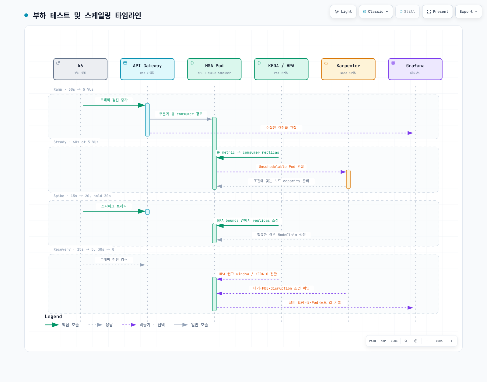

# Part 4: 부하 테스트 및 스케일링

<span id="grafana-dashboard-패널"></span>
<span id="grafana-확인-항목"></span>
<span id="step-4-1-k6-부하-시나리오"></span>
<span id="step-4-2-locust-배포-대안"></span>
<span id="step-4-3-부하-실행-중-관찰-항목"></span>
<span id="step-4-4-cool-down-스케일-인"></span>
<span id="step-4-5-스케일링-대시보드-패널-구성"></span>
<span id="검증-verification"></span>
<span id="관찰-포인트"></span>
<span id="다음-단계"></span>
<span id="부하-테스트-단계"></span>
<span id="부하-테스트-및-스케일링-타임라인"></span>
<span id="스케일-아웃-인-이벤트-확인"></span>
<span id="스케일-인-동작"></span>
<span id="예상-결과"></span>
<span id="참조-문서"></span>
<span id="학습-목표"></span>

> **난이도**: 중급 · **예상 소요 시간**: 45분
> **마지막 업데이트**: 2026년 9월 13일

같은 주문·결제·조회 요청을 k6와 Locust로 실행하고 Pod·노드 변화의 원인을 관찰합니다. 실습용 API에만 요청합니다. 이 문서의 VU·지연 임계값은 학습 설정이며 실제 처리량이나 스케일링 결과를 측정한 값이 아닙니다.

## 사전 조건 {#prerequisites}

- [Part 3](./03-msa-deployment-lab.md)의 API가 준비되어 있어야 합니다. `/orders` POST는 `201`과 `id`, `/payments` POST는 `200/201`과 `status: completed`, `/orders/{id}` GET은 같은 `id`를 반환해야 합니다. 다른 API라면 경로·payload·assertion을 함께 변경합니다.
- 서비스 클러스터 context는 `service`입니다. 명령마다 context를 명시합니다.
- k6 **2.2.0**, Locust **2.46.5**/Python **3.12**로 예제 동작을 확인했습니다. [공식 설치 안내](https://grafana.com/docs/k6/latest/set-up/install-k6/)에서 운영체제·CPU 아키텍처에 맞는 설치 방법을 선택합니다.
- KEDA ScaledObject와 Karpenter NodePool/EC2NodeClass는 [Part 3](./03-msa-deployment-lab.md)에서 구성합니다. Prometheus에 kube-state-metrics·cAdvisor가 실제 수집되어 있어야 인프라 쿼리가 나옵니다.



[🔍 인터랙티브 다이어그램 보기](https://www.atomai.click/kubernetes-docs/archmaps/ko-labs-observability-04-load-testing-scaling-lab-0.html)

## 1. 작은 요청으로 API 검증 {#smoke-test}

[실행 예제](https://github.com/Atom-oh/kubernetes-docs/tree/main/examples/labs/observability/load-test)의 `k6-scenario.js`를 사용합니다. 존재하지 않는 저장소를 clone하거나 문서의 긴 코드를 다시 복사할 필요가 없습니다. 다음 port-forward는 현재 터미널에서 유지합니다.

```bash
# Run from the repository root.
cd examples/labs/observability/load-test
kubectl --context service -n msa port-forward svc/api-gateway 8080:8080
```

```bash
# In another terminal, from the same directory.
BASE_URL=http://127.0.0.1:8080 LOAD_PROFILE=smoke \
  k6 run --no-usage-report k6-scenario.js
```

기본 smoke는 1 VU로 2회 반복합니다. 생성된 주문 ID로만 조회하며, 잘못된 JSON·ID 누락·결제 거절·다른 주문 반환을 실패로 처리합니다. `check()` 실패를 CLI 실패로 연결하는 threshold도 설정했습니다. `k6-summary.json`과 종료 코드를 함께 확인합니다. p99를 출력하므로 `summaryTrendStats`에 `p(99)`를 포함합니다.

## 2. 연속적인 부하 단계 {#load-stages}

```bash
BASE_URL=http://127.0.0.1:8080 LOAD_PROFILE=scale \
  k6 run --no-usage-report k6-scenario.js
```

| 구간 | 시간 | 목표 VU |
|---|---|---|
| Ramp | 30s | 5 |
| Steady | 60s | 5 |
| Spike ramp | 15s | 20 |
| Spike hold | 30s | 20 |
| Recovery | 15s | 5 |
| Cool-down | 30s | 0 |

총 stage 시간은 3분이며 종료 대기 시간이 추가될 수 있습니다. 별도 scenario를 동시에 이어 붙이지 않고 하나의 `stages`를 사용합니다. VU는 RPS가 아니며 응답 시간·요청 개수·sleep에 따라 실제 RPS가 달라집니다. NodePool 한도와 예산을 확인한 뒤 단계를 키웁니다. controller의 한도나 AWS Budgets 알림을 절대적인 비용 차단 장치로 간주하지 않습니다.

`k6-job.yaml`은 클러스터 내부의 **smoke 전용** 대안입니다. 먼저 README 명령으로 `obs-lab-k6` ConfigMap을 생성합니다. Job은 재시도 0회·120초 deadline·자원 제한을 사용합니다. Job 생성 성공과 테스트 성공을 구분하고 로그·Pod 종료 코드·Complete/Failed를 확인합니다.

## 3. Locust 대안 {#locust}

```bash
python3.12 -m venv .venv
.venv/bin/python -m pip install -r requirements.txt
.venv/bin/locust -f locustfile.py --headless \
  --host http://127.0.0.1:8080 --users 1 --spawn-rate 1 \
  --run-time 10s --stop-timeout 5 --exit-code-on-error 99 \
  --csv locust-results
```

기본 headless 실행은 관리 UI나 worker RPC를 외부에 공개하지 않습니다. 분산 실행이 필요하면 인증·내부 네트워크·worker 연결을 별도로 구성합니다. k6와 Locust는 같은 API 흐름을 검증하지만 부하 스케줄러가 다르므로 VU/user 수만 맞춘 결과를 동일한 실험으로 간주하지 않습니다.

## 4. Pod와 노드를 따로 관찰 {#observe-scaling}

```bash
kubectl --context service -n msa get scaledobject,hpa
kubectl --context service -n msa describe scaledobject
kubectl --context service -n msa get pods -o wide
kubectl --context service get nodepools,nodeclaims
kubectl --context service get nodes -L karpenter.sh/nodepool,karpenter.sh/capacity-type
kubectl --context service -n msa get events --sort-by=.metadata.creationTimestamp
```

SQS scaler는 메시지를 소비하지 않고 큐 속성을 읽습니다. 실제 consumer가 연결된 queue와 ScaledObject queue URL이 같은지 확인합니다. `queueLength`는 Pod당 목표이며 현재 메시지 수, in-flight/delayed 포함 설정, min/max replicas와 HPA 동작이 결과에 영향을 줍니다. 큐 backlog가 늘어도 producer인 API만 늘리면 원인이 해결되지 않습니다.

Karpenter는 리소스 제약 때문에 스케줄되지 못한 Pod를 보고 capacity를 준비합니다. ImagePullBackOff·잘못된 PVC·taint 불일치처럼 노드 추가로 해결되지 않는 원인도 확인합니다. NodePool과 일치하는 label로 노드를 찾고 hostname 문자열로 추정하지 않습니다.

## 5. 대시보드와 쿼리 {#dashboard-queries}

```promql
# Running Pods: phase series also exist with value zero.
sum(kube_pod_status_phase{namespace="msa", phase="Running"})

# Deployment total/ready replicas are different measurements.
kube_deployment_status_replicas{namespace="msa"}
kube_deployment_status_replicas_ready{namespace="msa"}

# HPA desired/current replicas.
kube_horizontalpodautoscaler_status_desired_replicas{namespace="msa"}
kube_horizontalpodautoscaler_status_current_replicas{namespace="msa"}

# Container resource usage; exclude the empty and Pod infrastructure series.
sum by (pod) (rate(container_cpu_usage_seconds_total{namespace="msa", container!="", container!="POD"}[5m]))
sum by (pod) (container_memory_working_set_bytes{namespace="msa", container!="", container!="POD"})
```

Running phase의 0/1 gauge를 합하므로 전부 Pending이면 0, series 자체가 없으면 데이터 없음입니다. `== 1` 필터로 모두 제거한 빈 vector를 0개 Pod로 오해하지 않습니다.

`kube_deployment_status_replicas`는 ready 수가 아닙니다. Rollout을 사용하는 워크로드는 Deployment 메트릭 대신 Rollouts exporter·ReplicaSet·Pod 상태를 확인합니다. `kube_node_labels`의 사용자 label은 kube-state-metrics allowlist에 포함되어야 노출됩니다. `changes(kube_node_created[10m])`는 고정 생성 timestamp의 변화만 계산하므로 새 노드 탐지 쿼리가 아닙니다.

RED 패널은 실제 애플리케이션의 metric 이름·단위·label을 먼저 확인합니다. OTel HTTP histogram과 직접 만든 Prometheus counter는 이름이 다를 수 있습니다. 낮은 cardinality의 service·route·status만 집계하고 주문 ID·고객 ID를 label로 사용하지 않습니다. 에러율은 같은 service/route 범위의 에러 요청 수 ÷ 전체 요청 수이며, 요청이 없는 구간은 측정값 없음으로 표시합니다.

## 6. 스케일 인과 검증 기록 {#scale-in}

| 제어 | 실제 의미 |
|---|---|
| KEDA `cooldownPeriod` | 마지막 active trigger 이후 **0으로** 줄일 때의 대기 시간 |
| HPA `scaleDown.stabilizationWindowSeconds` | 과거 window에서 가장 큰 replica 권고를 고려하는 1→N 조정 |
| Karpenter `consolidateAfter` | Pod 추가·삭제 이후 consolidation 검토 대기 시간 |
| PDB·disruption budget·제약 | consolidation/termination을 지연하거나 차단할 수 있음 |

빈 노드 즉시 삭제, 특정 시간 후 정확한 replica 수를 보장하지 않습니다. 시작·최대·회복 시점의 실제 RPS, 오류율, p99, queue depth, desired/ready Pod, NodeClaim, Pending 이유를 기록합니다. node 수 감소만으로 총 AWS 비용 절감을 계산하지 않습니다.

## 정리와 다음 단계 {#cleanup}

테스트가 종료됐는지 확인하고, 사용한 `obs-lab-k6-smoke` Job·ConfigMap과 port-forward를 정리합니다. 이후 [Part 5](./05-alerting-aiops-lab.md)에서 알림을 검증합니다. 전체 인프라 정리는 [Part 6](./06-distributed-tracing-lab.md#cleanup)을 따릅니다.

## 참고 자료와 검증 범위

- [k6 thresholds](https://grafana.com/docs/k6/latest/using-k6/thresholds/)
- [Locust](https://docs.locust.io/en/stable/running-without-web-ui.html)
- [KEDA ScaledObject](https://keda.sh/docs/2.20/reference/scaledobject-spec/)
- [Karpenter disruption](https://karpenter.sh/docs/concepts/disruption/)
- [Prometheus](../../observability/metrics/01-prometheus.md)

실제 k6·Locust를 합성 로컬 HTTP 서버에 연결해 각각 정상/실패 6개 사례를 검증했습니다. 클러스터·실제 MSA·AWS 부하·노드 스케일링·성능 한계는 실행하지 않았습니다.
