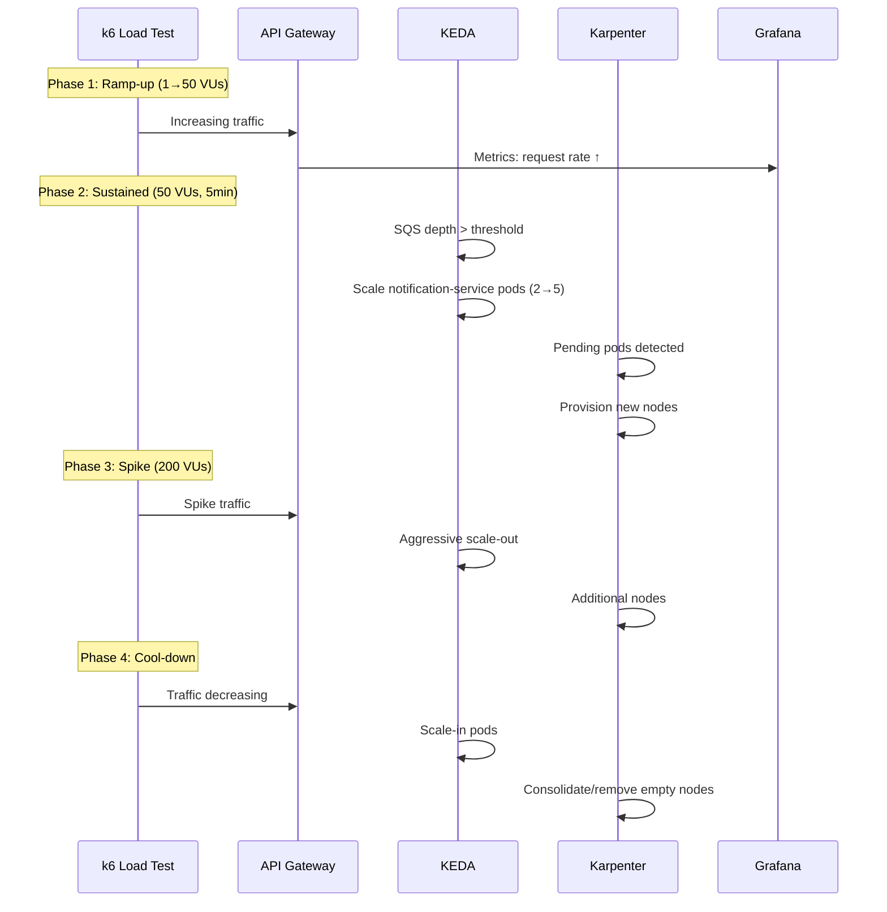

# Part 4: 부하 테스트 및 스케일링

> **난이도**: 중급 (Intermediate)
> **예상 소요 시간**: 45분
> **마지막 업데이트**: 2026년 2월 22일

## 학습 목표

- k6/Locust를 사용한 부하 시나리오 실행
- KEDA Pod 오토스케일링 동작 확인
- Karpenter Node 오토스케일링 관찰
- Grafana 실시간 대시보드 모니터링

## 부하 테스트 및 스케일링 타임라인



---

## Step 4.1: k6 부하 시나리오

### 부하 테스트 단계

| Phase | Duration | VUs | 목표 |
|-------|----------|-----|------|
| Ramp-up | 2분 | 1 → 50 | 점진적 트래픽 증가 |
| Sustained | 5분 | 50 | 안정 상태 부하 |
| Spike | 2분 | 200 | 트래픽 스파이크 |
| Sustained 2 | 3분 | 50 | 스파이크 후 안정화 |
| Cool-down | 2분 | 50 → 0 | 점진적 감소 |

**Step 4.1.1: k6 스크립트 작성**

```javascript
// load-test/k6-scenario.js
import http from 'k6/http';
import { check, sleep, group } from 'k6';
import { Counter, Rate, Trend } from 'k6/metrics';
import { randomIntBetween, randomString } from 'https://jslib.k6.io/k6-utils/1.4.0/index.js';

// Custom metrics
const orderCreated = new Counter('orders_created');
const paymentProcessed = new Counter('payments_processed');
const errorRate = new Rate('error_rate');
const orderLatency = new Trend('order_latency');
const paymentLatency = new Trend('payment_latency');

// Configuration
const BASE_URL = __ENV.BASE_URL || 'http://api-gateway.msa.svc:8080';

export const options = {
  scenarios: {
    // Phase 1: Ramp-up
    ramp_up: {
      executor: 'ramping-vus',
      startVUs: 1,
      stages: [
        { duration: '2m', target: 50 },  // Ramp to 50 VUs
      ],
      startTime: '0s',
    },
    // Phase 2: Sustained load
    sustained: {
      executor: 'constant-vus',
      vus: 50,
      duration: '5m',
      startTime: '2m',
    },
    // Phase 3: Spike
    spike: {
      executor: 'ramping-vus',
      startVUs: 50,
      stages: [
        { duration: '30s', target: 200 },  // Spike to 200
        { duration: '1m', target: 200 },   // Hold at 200
        { duration: '30s', target: 50 },   // Back to 50
      ],
      startTime: '7m',
    },
    // Phase 4: Post-spike sustained
    post_spike: {
      executor: 'constant-vus',
      vus: 50,
      duration: '3m',
      startTime: '9m',
    },
    // Phase 5: Cool-down
    cool_down: {
      executor: 'ramping-vus',
      startVUs: 50,
      stages: [
        { duration: '2m', target: 0 },
      ],
      startTime: '12m',
    },
  },
  thresholds: {
    http_req_duration: ['p(95)<2000', 'p(99)<5000'],
    error_rate: ['rate<0.05'],
    http_req_failed: ['rate<0.05'],
  },
};

// Shared data
const customers = ['customer-001', 'customer-002', 'customer-003', 'customer-004', 'customer-005'];
const products = ['product-A', 'product-B', 'product-C', 'product-D'];
const paymentMethods = ['credit_card', 'debit_card', 'bank_transfer'];

export default function () {
  const customerId = customers[randomIntBetween(0, customers.length - 1)];
  const productId = products[randomIntBetween(0, products.length - 1)];

  group('Order Flow', function () {
    // Create Order
    const orderPayload = JSON.stringify({
      customer_id: customerId,
      product_id: productId,
      quantity: randomIntBetween(1, 5),
    });

    const orderStart = Date.now();
    const orderRes = http.post(`${BASE_URL}/orders`, orderPayload, {
      headers: { 'Content-Type': 'application/json' },
      tags: { name: 'CreateOrder' },
    });
    orderLatency.add(Date.now() - orderStart);

    const orderSuccess = check(orderRes, {
      'order created': (r) => r.status === 201,
      'order has id': (r) => r.json('id') !== undefined,
    });

    if (orderSuccess) {
      orderCreated.add(1);
      errorRate.add(0);

      const orderId = orderRes.json('id');

      // Small delay before payment
      sleep(randomIntBetween(1, 3));

      // Process Payment
      const paymentPayload = JSON.stringify({
        order_id: orderId,
        amount: randomIntBetween(10, 500) + 0.99,
        payment_method: paymentMethods[randomIntBetween(0, paymentMethods.length - 1)],
      });

      const paymentStart = Date.now();
      const paymentRes = http.post(`${BASE_URL}/payments`, paymentPayload, {
        headers: { 'Content-Type': 'application/json' },
        tags: { name: 'ProcessPayment' },
      });
      paymentLatency.add(Date.now() - paymentStart);

      const paymentSuccess = check(paymentRes, {
        'payment processed': (r) => r.status === 200 || r.status === 201,
        'payment completed': (r) => r.json('status') === 'completed',
      });

      if (paymentSuccess) {
        paymentProcessed.add(1);
        errorRate.add(0);
      } else {
        errorRate.add(1);
      }
    } else {
      errorRate.add(1);
    }
  });

  // Random read operations
  if (Math.random() < 0.3) {
    group('Read Operations', function () {
      const orderId = randomIntBetween(1, 1000);
      http.get(`${BASE_URL}/orders/${orderId}`, {
        tags: { name: 'GetOrder' },
      });
    });
  }

  sleep(randomIntBetween(1, 3));
}

export function handleSummary(data) {
  return {
    'stdout': textSummary(data, { indent: ' ', enableColors: true }),
    'summary.json': JSON.stringify(data),
  };
}

function textSummary(data, options) {
  // Custom summary format
  return `
=== Load Test Summary ===
Total Requests: ${data.metrics.http_reqs.values.count}
Success Rate: ${(1 - data.metrics.http_req_failed.values.rate) * 100}%
Average Latency: ${data.metrics.http_req_duration.values.avg.toFixed(2)}ms
P95 Latency: ${data.metrics.http_req_duration.values['p(95)'].toFixed(2)}ms
P99 Latency: ${data.metrics.http_req_duration.values['p(99)'].toFixed(2)}ms
Orders Created: ${data.metrics.orders_created ? data.metrics.orders_created.values.count : 0}
Payments Processed: ${data.metrics.payments_processed ? data.metrics.payments_processed.values.count : 0}
`;
}
```

**Step 4.1.2: k6 실행**

```bash
# k6 실행 (로컬에서)
export BASE_URL="http://$(kubectl --context service get svc api-gateway -n msa -o jsonpath='{.status.loadBalancer.ingress[0].hostname}'):8080"

k6 run load-test/k6-scenario.js

# 또는 Kubernetes Job으로 실행
cat <<EOF | kubectl --context service apply -f -
apiVersion: batch/v1
kind: Job
metadata:
  name: k6-load-test
  namespace: msa
spec:
  template:
    spec:
      containers:
        - name: k6
          image: grafana/k6:0.50.0
          command: ["k6", "run", "/scripts/k6-scenario.js"]
          env:
            - name: BASE_URL
              value: "http://api-gateway.msa.svc:8080"
          volumeMounts:
            - name: scripts
              mountPath: /scripts
      volumes:
        - name: scripts
          configMap:
            name: k6-scripts
      restartPolicy: Never
  backoffLimit: 1
EOF
```

---

## Step 4.2: Locust 배포 (대안)

**Step 4.2.1: Locust 스크립트**

```python
# load-test/locustfile.py
from locust import HttpUser, task, between, events
from locust.runners import MasterRunner
import random
import json
import logging

logging.basicConfig(level=logging.INFO)
logger = logging.getLogger(__name__)

class MSAUser(HttpUser):
    wait_time = between(1, 3)

    customers = ['customer-001', 'customer-002', 'customer-003', 'customer-004', 'customer-005']
    products = ['product-A', 'product-B', 'product-C', 'product-D']
    payment_methods = ['credit_card', 'debit_card', 'bank_transfer']

    def on_start(self):
        """Called when a User starts"""
        self.customer_id = random.choice(self.customers)
        logger.info(f"User started with customer_id: {self.customer_id}")

    @task(10)
    def create_order_and_payment(self):
        """Main flow: Create order and process payment"""
        # Create Order
        order_payload = {
            "customer_id": self.customer_id,
            "product_id": random.choice(self.products),
            "quantity": random.randint(1, 5)
        }

        with self.client.post(
            "/orders",
            json=order_payload,
            name="Create Order",
            catch_response=True
        ) as response:
            if response.status_code == 201:
                order_data = response.json()
                order_id = order_data.get('id')
                response.success()

                # Process Payment
                payment_payload = {
                    "order_id": order_id,
                    "amount": round(random.uniform(10, 500), 2),
                    "payment_method": random.choice(self.payment_methods)
                }

                with self.client.post(
                    "/payments",
                    json=payment_payload,
                    name="Process Payment",
                    catch_response=True
                ) as pay_response:
                    if pay_response.status_code in [200, 201]:
                        pay_response.success()
                    else:
                        pay_response.failure(f"Payment failed: {pay_response.status_code}")
            else:
                response.failure(f"Order failed: {response.status_code}")

    @task(3)
    def get_order(self):
        """Read order by ID"""
        order_id = random.randint(1, 1000)
        with self.client.get(
            f"/orders/{order_id}",
            name="Get Order",
            catch_response=True
        ) as response:
            if response.status_code in [200, 404]:
                response.success()
            else:
                response.failure(f"Unexpected status: {response.status_code}")

    @task(1)
    def health_check(self):
        """Health check endpoint"""
        self.client.get("/health", name="Health Check")

@events.test_start.add_listener
def on_test_start(environment, **kwargs):
    logger.info("Load test starting...")

@events.test_stop.add_listener
def on_test_stop(environment, **kwargs):
    logger.info("Load test completed")
    if isinstance(environment.runner, MasterRunner):
        logger.info(f"Total requests: {environment.stats.total.num_requests}")
        logger.info(f"Total failures: {environment.stats.total.num_failures}")
```

**Step 4.2.2: Locust Helm 배포**

```yaml
# load-test/locust-values.yaml
loadtest:
  name: msa-load-test
  locust_locustfile_configmap: locust-scripts
  locust_host: http://api-gateway.msa.svc:8080

master:
  image: locustio/locust:2.24.0
  resources:
    requests:
      cpu: 200m
      memory: 256Mi
    limits:
      cpu: 1000m
      memory: 512Mi

worker:
  image: locustio/locust:2.24.0
  replicas: 4
  resources:
    requests:
      cpu: 200m
      memory: 256Mi
    limits:
      cpu: 500m
      memory: 512Mi

service:
  type: ClusterIP
```

```bash
# Locust scripts ConfigMap 생성
kubectl create configmap locust-scripts \
  --from-file=main.py=load-test/locustfile.py \
  -n msa

# Locust Helm 설치
helm repo add deliveryhero https://charts.deliveryhero.io/
helm install locust deliveryhero/locust \
  --namespace msa \
  --values load-test/locust-values.yaml

# Locust UI 접속
kubectl port-forward svc/locust 8089:8089 -n msa &
# 브라우저에서 http://localhost:8089
```

---

## Step 4.3: 부하 실행 중 관찰 항목

### 관찰 포인트

| 관찰 대상 | 도구 | 주요 지표 |
|----------|------|----------|
| Traffic Rate | Grafana (Prometheus) | `http_requests_total` |
| Pod Scaling | KEDA / kubectl | HPA replicas, ScaledObject status |
| Node Scaling | Karpenter / kubectl | Node count, pending pods |
| Latency | Grafana / Tempo | p50, p95, p99 latency |
| Error Rate | Grafana | 5xx errors / total requests |
| SQS Depth | CloudWatch / KEDA | ApproximateNumberOfMessages |

**Step 4.3.1: 실시간 모니터링 터미널**

```bash
# Terminal 1: Pod 스케일링 관찰
watch -n 5 "kubectl --context service get pods -n msa -l 'app in (order-service,notification-service)' -o wide"

# Terminal 2: HPA/ScaledObject 상태
watch -n 5 "kubectl --context service get scaledobject,hpa -n msa"

# Terminal 3: Karpenter 노드 스케일링
watch -n 10 "kubectl --context service get nodes -l karpenter.sh/provisioner-name=default"

# Terminal 4: SQS 메트릭
watch -n 10 "aws sqs get-queue-attributes \
  --queue-url ${SQS_QUEUE_URL} \
  --attribute-names ApproximateNumberOfMessages ApproximateNumberOfMessagesNotVisible"
```

**Step 4.3.2: Grafana 대시보드 쿼리**

```promql
# Request Rate (per service)
sum(rate(http_requests_total{namespace="msa"}[1m])) by (service)

# Error Rate
sum(rate(http_requests_total{namespace="msa", status=~"5.."}[1m])) /
sum(rate(http_requests_total{namespace="msa"}[1m]))

# Latency P99
histogram_quantile(0.99,
  sum(rate(http_request_duration_seconds_bucket{namespace="msa"}[5m])) by (le, service)
)

# Pod Count
count(kube_pod_status_phase{namespace="msa", phase="Running"}) by (pod)

# CPU Usage per Pod
sum(rate(container_cpu_usage_seconds_total{namespace="msa"}[5m])) by (pod)

# Memory Usage per Pod
sum(container_memory_working_set_bytes{namespace="msa"}) by (pod)
```

---

## Step 4.4: Cool-down 스케일-인

부하 테스트가 완료되면 KEDA와 Karpenter가 자동으로 스케일-인을 수행합니다.

### 스케일-인 동작

| 컴포넌트 | Trigger | 동작 | 대기 시간 |
|---------|---------|------|----------|
| KEDA | SQS depth < 10 | Pod 스케일-인 | cooldownPeriod: 60s |
| KEDA | Request rate < 100 RPS | Pod 스케일-인 | cooldownPeriod: 60s |
| Karpenter | Underutilized nodes | Node consolidation | consolidateAfter: 30s |
| Karpenter | Empty nodes | Node termination | 즉시 |

**Step 4.4.1: 스케일-인 관찰**

```bash
# KEDA ScaledObject 이벤트
kubectl --context service describe scaledobject -n msa

# Karpenter consolidation 로그
kubectl --context service logs -n karpenter -l app.kubernetes.io/name=karpenter --tail=100 | grep -i consolidat

# Node 종료 이벤트
kubectl --context service get events -n default --field-selector reason=TerminatingNode
```

---

## Step 4.5: 스케일링 대시보드 패널 구성

### Grafana Dashboard 패널

| 패널 | 쿼리 | 시각화 |
|------|------|--------|
| Pod Count | `count(kube_pod_status_phase{namespace="msa", phase="Running"}) by (pod)` | Time Series |
| Node Count | `count(kube_node_info{node=~".*karpenter.*"})` | Stat |
| CPU Usage | `sum(rate(container_cpu_usage_seconds_total{namespace="msa"}[5m])) by (pod)` | Time Series |
| Memory Usage | `sum(container_memory_working_set_bytes{namespace="msa"}) by (pod) / 1024 / 1024` | Time Series |
| SQS Depth | CloudWatch: `AWS/SQS.ApproximateNumberOfMessages` | Time Series |
| Request Rate | `sum(rate(http_requests_total{namespace="msa"}[1m])) by (service)` | Time Series |
| KEDA Scaler Metrics | `keda_scaler_metrics_value` | Time Series |
| HPA Desired Replicas | `kube_horizontalpodautoscaler_status_desired_replicas{namespace="msa"}` | Time Series |

**Step 4.5.1: Dashboard JSON 예시**

```json
{
  "dashboard": {
    "title": "Observability Lab - Scaling Dashboard",
    "uid": "obs-lab-scaling",
    "panels": [
      {
        "title": "Pod Scaling Timeline",
        "type": "timeseries",
        "gridPos": { "x": 0, "y": 0, "w": 12, "h": 8 },
        "targets": [
          {
            "expr": "count(kube_pod_status_phase{namespace=\"msa\", phase=\"Running\"}) by (deployment)",
            "legendFormat": "{{deployment}}"
          }
        ]
      },
      {
        "title": "Node Count",
        "type": "stat",
        "gridPos": { "x": 12, "y": 0, "w": 6, "h": 4 },
        "targets": [
          {
            "expr": "count(kube_node_info)",
            "legendFormat": "Total Nodes"
          }
        ]
      },
      {
        "title": "Karpenter Nodes",
        "type": "stat",
        "gridPos": { "x": 18, "y": 0, "w": 6, "h": 4 },
        "targets": [
          {
            "expr": "count(kube_node_labels{label_karpenter_sh_provisioner_name!=\"\"})",
            "legendFormat": "Karpenter Nodes"
          }
        ]
      },
      {
        "title": "SQS Queue Depth",
        "type": "timeseries",
        "gridPos": { "x": 12, "y": 4, "w": 12, "h": 4 },
        "datasource": "CloudWatch",
        "targets": [
          {
            "namespace": "AWS/SQS",
            "metricName": "ApproximateNumberOfMessages",
            "dimensions": { "QueueName": "obs-lab-order-events" },
            "region": "us-east-1"
          }
        ]
      },
      {
        "title": "Request Rate by Service",
        "type": "timeseries",
        "gridPos": { "x": 0, "y": 8, "w": 12, "h": 8 },
        "targets": [
          {
            "expr": "sum(rate(http_requests_total{namespace=\"msa\"}[1m])) by (service)",
            "legendFormat": "{{service}}"
          }
        ]
      },
      {
        "title": "CPU Usage by Pod",
        "type": "timeseries",
        "gridPos": { "x": 12, "y": 8, "w": 12, "h": 8 },
        "targets": [
          {
            "expr": "sum(rate(container_cpu_usage_seconds_total{namespace=\"msa\", container!=\"\"}[5m])) by (pod)",
            "legendFormat": "{{pod}}"
          }
        ]
      },
      {
        "title": "KEDA Scaler Metrics",
        "type": "timeseries",
        "gridPos": { "x": 0, "y": 16, "w": 12, "h": 8 },
        "targets": [
          {
            "expr": "keda_scaler_metrics_value{namespace=\"msa\"}",
            "legendFormat": "{{scaledObject}} - {{scaler}}"
          }
        ]
      },
      {
        "title": "HPA Desired vs Current Replicas",
        "type": "timeseries",
        "gridPos": { "x": 12, "y": 16, "w": 12, "h": 8 },
        "targets": [
          {
            "expr": "kube_horizontalpodautoscaler_status_desired_replicas{namespace=\"msa\"}",
            "legendFormat": "{{horizontalpodautoscaler}} - Desired"
          },
          {
            "expr": "kube_horizontalpodautoscaler_status_current_replicas{namespace=\"msa\"}",
            "legendFormat": "{{horizontalpodautoscaler}} - Current"
          }
        ]
      }
    ]
  }
}
```

```bash
# Dashboard import via Grafana API
curl -X POST \
  -H "Content-Type: application/json" \
  -H "Authorization: Bearer ${GRAFANA_API_KEY}" \
  -d @scaling-dashboard.json \
  http://localhost:3000/api/dashboards/db
```

---

## 검증 (Verification)

### 스케일 아웃/인 이벤트 확인

```bash
# 스케일 이벤트 요약
echo "=== KEDA ScaledObject Status ==="
kubectl --context service get scaledobject -n msa -o wide

echo ""
echo "=== Pod Scaling Events ==="
kubectl --context service get events -n msa --field-selector reason=SuccessfulRescale

echo ""
echo "=== Karpenter Events ==="
kubectl --context service get events --field-selector source=karpenter

echo ""
echo "=== Final Pod Count ==="
kubectl --context service get pods -n msa --no-headers | wc -l

echo ""
echo "=== Final Node Count ==="
kubectl --context service get nodes --no-headers | wc -l
```

### 예상 결과

| Phase | Pod Count | Node Count | SQS Depth |
|-------|-----------|------------|-----------|
| Before Load | 2-4 | 3 | 0 |
| Ramp-up | 4-6 | 3-4 | 10-50 |
| Sustained | 6-10 | 4-5 | 50-100 |
| Spike | 10-20 | 5-8 | 100-500 |
| Cool-down | 2-4 | 3-4 | 0-10 |
| After Load | 2-4 | 3 | 0 |

### Grafana 확인 항목

1. **Request Rate 그래프**: Ramp-up → Sustained → Spike → Cool-down 패턴 확인
2. **Pod Count 그래프**: KEDA에 의한 스케일 아웃/인 확인
3. **Node Count 그래프**: Karpenter에 의한 노드 추가/제거 확인
4. **SQS Depth 그래프**: 메시지 처리량과 큐 깊이 상관관계 확인
5. **Latency 그래프**: 부하 증가에 따른 latency 변화 확인

---

## 참조 문서

- [KEDA 이벤트 기반 스케일링](../../autoscaling/01-keda.md)
- [Karpenter 오토스케일링](../../autoscaling/02-karpenter.md)
- [Prometheus 메트릭 수집](../../observability/metrics/01-prometheus.md)

---

## 다음 단계

부하 테스트 및 스케일링 관찰이 완료되었습니다. [Part 5: 알림 및 AIOps](./05-alerting-aiops-lab.md)로 진행하여 이상 탐지 및 자동화된 인시던트 대응을 구성합니다.
