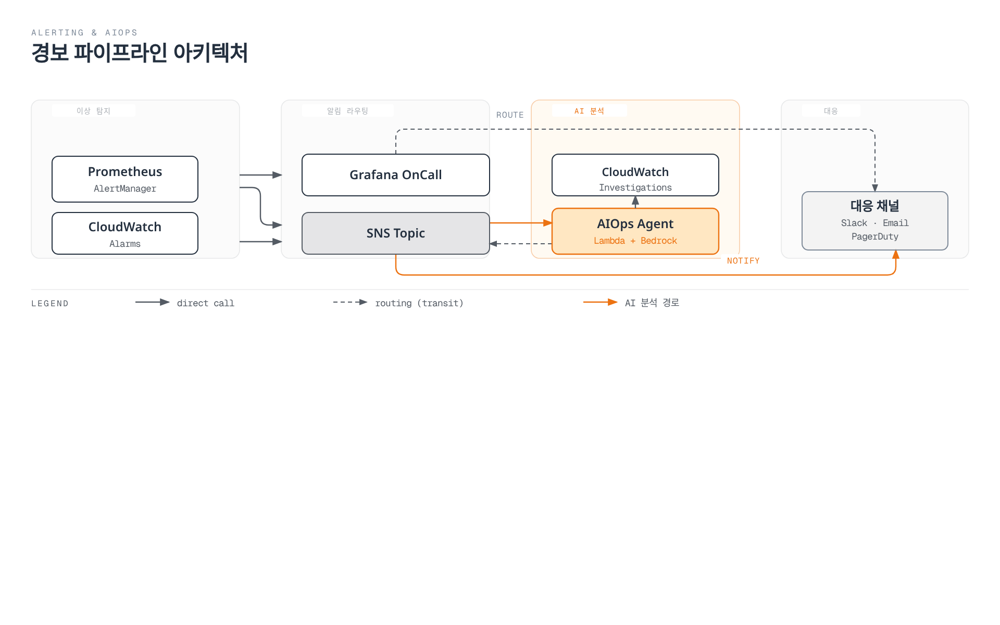
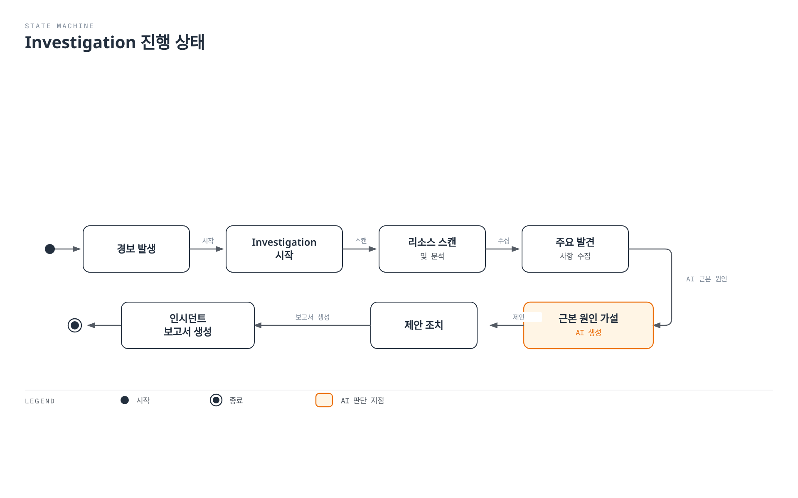
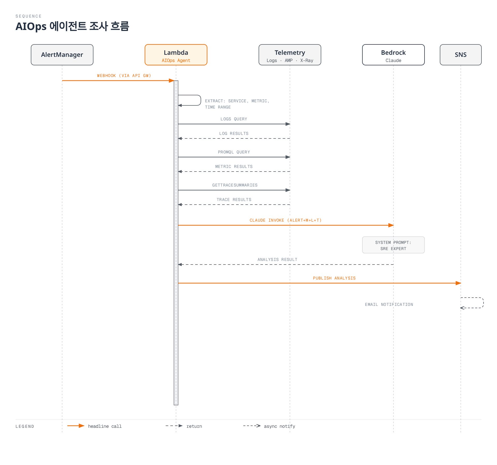
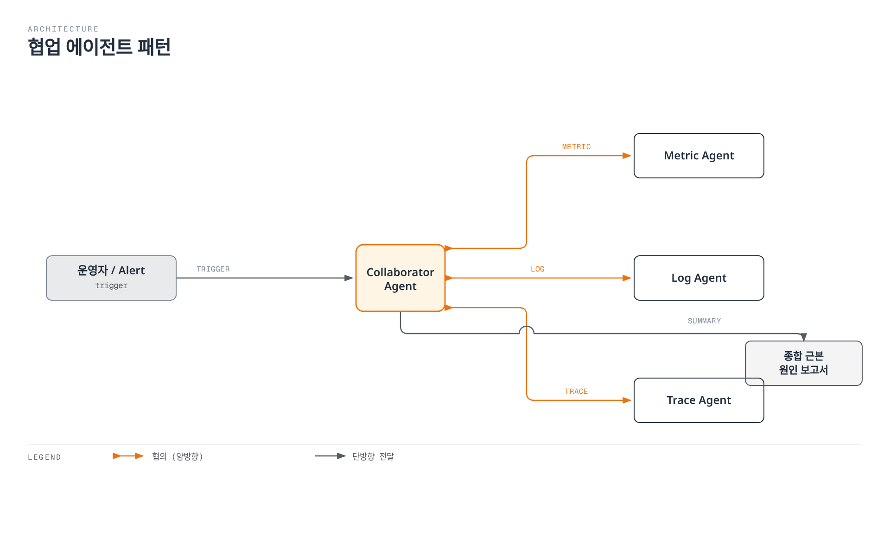

# Part 5: 알림 및 AIOps

> **난이도**: 고급 (Advanced) **예상 소요 시간**: 60분 **마지막 업데이트**: 2026년 2월 23일

## 학습 목표

* AlertManager PrometheusRule을 통한 이상 감지
* Grafana OnCall 인시던트 관리 구성
* CloudWatch Investigations AI 분석 활용
* AIOps Agent (Lambda + Bedrock Claude) 구현

## 아키텍처 개요




***

## Step 5.1: AlertManager PrometheusRule 구성

### 알림 규칙 목록

| 알림 이름               | 조건              | Severity | For |
| ------------------- | --------------- | -------- | --- |
| HighErrorRate       | 5xx > 5%        | critical | 2m  |
| HighLatency         | p99 > 2s        | warning  | 5m  |
| PodCrashLoopBackOff | restarts > 5    | critical | 5m  |
| SQSQueueBacklog     | messages > 1000 | warning  | 10m |
| NodeNotReady        | node not ready  | critical | 5m  |

**Step 5.1.1: PrometheusRule 생성**

```yaml
# alerting/prometheus-rules.yaml
apiVersion: monitoring.coreos.com/v1
kind: PrometheusRule
metadata:
  name: msa-alerts
  namespace: monitoring
  labels:
    release: kube-prometheus
spec:
  groups:
    - name: msa.availability
      rules:
        - alert: HighErrorRate
          expr: |
            (
              sum(rate(http_requests_total{namespace="msa", status=~"5.."}[5m])) /
              sum(rate(http_requests_total{namespace="msa"}[5m]))
            ) > 0.05
          for: 2m
          labels:
            severity: critical
            team: platform
          annotations:
            summary: "High error rate detected in MSA services"
            description: "Error rate is {{ $value | humanizePercentage }} for namespace msa, which exceeds the 5% threshold."
            runbook_url: "https://runbooks.obs-lab.local/high-error-rate"
            dashboard_url: "https://grafana.obs-lab.local/d/msa-overview"

        - alert: HighLatency
          expr: |
            histogram_quantile(0.99,
              sum(rate(http_request_duration_seconds_bucket{namespace="msa"}[5m])) by (le, service)
            ) > 2
          for: 5m
          labels:
            severity: warning
            team: platform
          annotations:
            summary: "High latency detected for {{ $labels.service }}"
            description: "P99 latency is {{ $value | humanizeDuration }} for {{ $labels.service }}, exceeding 2s threshold."
            dashboard_url: "https://grafana.obs-lab.local/d/msa-latency"

        - alert: ServiceDown
          expr: |
            up{namespace="msa"} == 0
          for: 1m
          labels:
            severity: critical
            team: platform
          annotations:
            summary: "Service {{ $labels.service }} is down"
            description: "The service {{ $labels.service }} in namespace msa has been down for more than 1 minute."

    - name: msa.pods
      rules:
        - alert: PodCrashLoopBackOff
          expr: |
            increase(kube_pod_container_status_restarts_total{namespace="msa"}[1h]) > 5
          for: 5m
          labels:
            severity: critical
            team: platform
          annotations:
            summary: "Pod {{ $labels.pod }} is crash looping"
            description: "Pod {{ $labels.pod }} in namespace {{ $labels.namespace }} has restarted {{ $value }} times in the last hour."

        - alert: PodNotReady
          expr: |
            kube_pod_status_ready{namespace="msa", condition="true"} == 0
          for: 5m
          labels:
            severity: warning
            team: platform
          annotations:
            summary: "Pod {{ $labels.pod }} is not ready"
            description: "Pod {{ $labels.pod }} has been in a non-ready state for more than 5 minutes."

        - alert: ContainerOOMKilled
          expr: |
            kube_pod_container_status_last_terminated_reason{namespace="msa", reason="OOMKilled"} == 1
          for: 0m
          labels:
            severity: critical
            team: platform
          annotations:
            summary: "Container OOM killed"
            description: "Container {{ $labels.container }} in pod {{ $labels.pod }} was OOM killed."

    - name: msa.sqs
      rules:
        - alert: SQSQueueBacklog
          expr: |
            aws_sqs_approximate_number_of_messages_visible_average{queue_name="obs-lab-order-events"} > 1000
          for: 10m
          labels:
            severity: warning
            team: platform
          annotations:
            summary: "SQS queue backlog is high"
            description: "SQS queue obs-lab-order-events has {{ $value }} messages waiting, indicating processing delays."

        - alert: SQSMessageAge
          expr: |
            aws_sqs_approximate_age_of_oldest_message_maximum{queue_name="obs-lab-order-events"} > 300
          for: 5m
          labels:
            severity: warning
            team: platform
          annotations:
            summary: "SQS messages are aging"
            description: "Oldest message in queue is {{ $value | humanizeDuration }} old."

    - name: msa.nodes
      rules:
        - alert: NodeNotReady
          expr: |
            kube_node_status_condition{condition="Ready", status="true"} == 0
          for: 5m
          labels:
            severity: critical
            team: infrastructure
          annotations:
            summary: "Node {{ $labels.node }} is not ready"
            description: "Node {{ $labels.node }} has been in NotReady state for more than 5 minutes."

        - alert: NodeHighCPU
          expr: |
            (1 - avg by(instance) (rate(node_cpu_seconds_total{mode="idle"}[5m]))) > 0.9
          for: 10m
          labels:
            severity: warning
            team: infrastructure
          annotations:
            summary: "High CPU usage on node"
            description: "Node {{ $labels.instance }} CPU usage is above 90% for more than 10 minutes."

        - alert: NodeHighMemory
          expr: |
            (1 - (node_memory_MemAvailable_bytes / node_memory_MemTotal_bytes)) > 0.9
          for: 10m
          labels:
            severity: warning
            team: infrastructure
          annotations:
            summary: "High memory usage on node"
            description: "Node {{ $labels.instance }} memory usage is above 90% for more than 10 minutes."
```

```bash
kubectl apply -f alerting/prometheus-rules.yaml

# 알림 규칙 확인
kubectl get prometheusrules -n monitoring
```

***

## Step 5.2: CloudWatch Alarms 구성

**Step 5.2.1: Aurora 알람**

```bash
# Aurora CPU 알람
aws cloudwatch put-metric-alarm \
  --alarm-name "obs-lab-aurora-cpu-critical" \
  --alarm-description "Aurora PostgreSQL CPU usage critical" \
  --metric-name CPUUtilization \
  --namespace AWS/RDS \
  --statistic Average \
  --period 300 \
  --threshold 80 \
  --comparison-operator GreaterThanThreshold \
  --dimensions Name=DBClusterIdentifier,Value=obs-lab-aurora \
  --evaluation-periods 2 \
  --alarm-actions ${SNS_ALERTS_TOPIC_ARN} \
  --ok-actions ${SNS_ALERTS_TOPIC_ARN} \
  --treat-missing-data notBreaching

# Aurora 연결 수 알람
aws cloudwatch put-metric-alarm \
  --alarm-name "obs-lab-aurora-connections-high" \
  --alarm-description "Aurora PostgreSQL connection count high" \
  --metric-name DatabaseConnections \
  --namespace AWS/RDS \
  --statistic Average \
  --period 300 \
  --threshold 100 \
  --comparison-operator GreaterThanThreshold \
  --dimensions Name=DBClusterIdentifier,Value=obs-lab-aurora \
  --evaluation-periods 2 \
  --alarm-actions ${SNS_ALERTS_TOPIC_ARN}

# Aurora Replication Lag 알람
aws cloudwatch put-metric-alarm \
  --alarm-name "obs-lab-aurora-replication-lag" \
  --alarm-description "Aurora replication lag high" \
  --metric-name AuroraReplicaLag \
  --namespace AWS/RDS \
  --statistic Average \
  --period 60 \
  --threshold 100 \
  --comparison-operator GreaterThanThreshold \
  --dimensions Name=DBClusterIdentifier,Value=obs-lab-aurora \
  --evaluation-periods 3 \
  --alarm-actions ${SNS_ALERTS_TOPIC_ARN}
```

**Step 5.2.2: SQS 알람**

```bash
# SQS 메시지 나이 알람
aws cloudwatch put-metric-alarm \
  --alarm-name "obs-lab-sqs-message-age" \
  --alarm-description "SQS oldest message age exceeds threshold" \
  --metric-name ApproximateAgeOfOldestMessage \
  --namespace AWS/SQS \
  --statistic Maximum \
  --period 60 \
  --threshold 300 \
  --comparison-operator GreaterThanThreshold \
  --dimensions Name=QueueName,Value=obs-lab-order-events \
  --evaluation-periods 3 \
  --alarm-actions ${SNS_ALERTS_TOPIC_ARN}

# SQS DLQ 메시지 알람
aws cloudwatch put-metric-alarm \
  --alarm-name "obs-lab-sqs-dlq-messages" \
  --alarm-description "Messages in DLQ detected" \
  --metric-name ApproximateNumberOfMessagesVisible \
  --namespace AWS/SQS \
  --statistic Sum \
  --period 60 \
  --threshold 1 \
  --comparison-operator GreaterThanOrEqualToThreshold \
  --dimensions Name=QueueName,Value=obs-lab-order-events-dlq \
  --evaluation-periods 1 \
  --alarm-actions ${SNS_ALERTS_TOPIC_ARN}
```

***

## Step 5.3: Grafana OnCall 구성

**Step 5.3.1: OnCall Integration 설정**

```yaml
# alerting/oncall-integration.yaml
apiVersion: v1
kind: ConfigMap
metadata:
  name: oncall-integration
  namespace: monitoring
data:
  alertmanager-integration.yaml: |
    name: alertmanager
    type: alertmanager
    settings:
      url: http://alertmanager-operated.monitoring.svc:9093
```

**Step 5.3.2: Escalation Chain**

```yaml
# Escalation Chain 구성 (OnCall UI 또는 Terraform)
# Level 1: 5분 대기 후 다음 레벨
# Level 2: 10분 대기 후 다음 레벨
# Level 3: 매니저 호출

escalation_chains:
  - name: "msa-critical"
    steps:
      - type: notify_persons
        persons:
          - "@on-call-engineer"
        duration: 300  # 5 minutes
      - type: notify_persons
        persons:
          - "@senior-engineer"
        duration: 600  # 10 minutes
      - type: notify_persons
        persons:
          - "@engineering-manager"
        important: true
```

**Step 5.3.3: OnCall Terraform 구성**

```hcl
# oncall.tf
resource "grafana_oncall_integration" "alertmanager" {
  name = "AlertManager Integration"
  type = "alertmanager"
}

resource "grafana_oncall_escalation_chain" "critical" {
  name = "MSA Critical Alerts"
}

resource "grafana_oncall_escalation" "step1" {
  escalation_chain_id = grafana_oncall_escalation_chain.critical.id
  type                = "notify_on_call_from_schedule"
  position            = 0
  notify_on_call_from_schedule = grafana_oncall_schedule.primary.id
  duration            = 300
}

resource "grafana_oncall_escalation" "step2" {
  escalation_chain_id = grafana_oncall_escalation_chain.critical.id
  type                = "notify_persons"
  position            = 1
  persons_to_notify   = [data.grafana_oncall_user.senior.id]
  duration            = 600
}

resource "grafana_oncall_schedule" "primary" {
  name      = "Primary On-Call"
  type      = "calendar"
  time_zone = "Asia/Seoul"
}

resource "grafana_oncall_route" "critical" {
  integration_id      = grafana_oncall_integration.alertmanager.id
  escalation_chain_id = grafana_oncall_escalation_chain.critical.id
  routing_regex       = "severity=critical"
  position            = 0
}
```

***

## Step 5.4: SNS 토픽 + 이메일 구독

```bash
# 알림용 SNS 토픽 확인
aws sns list-topics --query "Topics[?contains(TopicArn, 'obs-lab-alerts')]"

# 이메일 구독 추가
aws sns subscribe \
  --topic-arn ${SNS_ALERTS_TOPIC_ARN} \
  --protocol email \
  --notification-endpoint "oncall-team@example.com"

# Lambda 구독 추가 (AIOps Agent용)
aws sns subscribe \
  --topic-arn ${SNS_ALERTS_TOPIC_ARN} \
  --protocol lambda \
  --notification-endpoint arn:aws:lambda:us-east-1:${AWS_ACCOUNT_ID}:function:obs-lab-aiops-agent

# 구독 확인
aws sns list-subscriptions-by-topic --topic-arn ${SNS_ALERTS_TOPIC_ARN}
```

***

## Step 5.5: CloudWatch Investigations

### 조사 프로세스



**Step 5.5.1: CloudWatch Investigations 활성화**

```bash
# Application Signals 활성화 (필요한 경우)
aws application-signals start-discovery \
  --region us-east-1

# Investigation 권한 확인
aws iam get-role --role-name CloudWatchInvestigationsRole
```

**Step 5.5.2: Investigation 시작 (수동)**

CloudWatch Console에서:

1. **CloudWatch > Investigations** 이동
2. **Start investigation** 클릭
3. 알람 또는 시간 범위 선택
4. 관련 리소스 (EKS, RDS, SQS) 선택
5. **Investigate** 클릭

**Step 5.5.3: Investigation 결과 분석**

| 분석 항목             | 설명               |
| ----------------- | ---------------- |
| Timeline          | 이벤트 발생 타임라인      |
| Key Findings      | AI가 식별한 주요 발견 사항 |
| Related Resources | 영향받은 리소스 목록      |
| Hypothesis        | 근본 원인에 대한 AI 가설  |
| Suggestions       | 권장 조치 사항         |

***

## Step 5.6: AIOps Agent (Lambda + Bedrock Claude)

### AIOps Agent 아키텍처



**Step 5.6.1: Lambda 함수 코드**

```python
# lambda/aiops_agent.py
import json
import boto3
import os
from datetime import datetime, timedelta
from typing import Dict, Any, List

# AWS Clients
bedrock_runtime = boto3.client('bedrock-runtime', region_name='us-east-1')
logs_client = boto3.client('logs', region_name='us-east-1')
amp_client = boto3.client('amp', region_name='us-east-1')
xray_client = boto3.client('xray', region_name='us-east-1')
sns_client = boto3.client('sns', region_name='us-east-1')

# Configuration
AMP_WORKSPACE_ID = os.environ.get('AMP_WORKSPACE_ID')
SNS_TOPIC_ARN = os.environ.get('SNS_TOPIC_ARN')
LOG_GROUP = os.environ.get('LOG_GROUP', '/aws/eks/obs-lab/application')

SYSTEM_PROMPT = """You are an expert Site Reliability Engineer (SRE) analyzing production incidents.
Your role is to:
1. Analyze the provided alert, metrics, logs, and traces
2. Identify the root cause of the issue
3. Provide actionable recommendations

Format your response as follows:
## Summary
[Brief summary of the incident]

## Root Cause Analysis
[Detailed analysis of what caused the issue]

## Evidence
- Metrics: [relevant metric observations]
- Logs: [relevant log patterns]
- Traces: [trace observations if available]

## Recommendations
1. [Immediate action]
2. [Short-term fix]
3. [Long-term prevention]

## Severity Assessment
[Critical/High/Medium/Low] - [Justification]
"""

def lambda_handler(event: Dict[str, Any], context) -> Dict[str, Any]:
    """Main Lambda handler for AIOps agent"""
    print(f"Received event: {json.dumps(event)}")

    # Parse alert from SNS or AlertManager webhook
    alert = parse_alert(event)
    if not alert:
        return {'statusCode': 400, 'body': 'Invalid alert format'}

    print(f"Parsed alert: {json.dumps(alert)}")

    # Determine time range for analysis
    end_time = datetime.utcnow()
    start_time = end_time - timedelta(minutes=30)

    # Collect telemetry data in parallel (simulated)
    telemetry = collect_telemetry(
        alert=alert,
        start_time=start_time,
        end_time=end_time
    )

    # Invoke Bedrock Claude for analysis
    analysis = analyze_with_claude(alert, telemetry)

    # Publish analysis to SNS
    publish_analysis(alert, analysis)

    return {
        'statusCode': 200,
        'body': json.dumps({
            'alert': alert.get('alertname'),
            'analysis_sent': True
        })
    }

def parse_alert(event: Dict[str, Any]) -> Dict[str, Any]:
    """Parse alert from various sources"""
    # SNS message
    if 'Records' in event:
        for record in event['Records']:
            if record.get('EventSource') == 'aws:sns':
                message = json.loads(record['Sns']['Message'])
                return parse_alertmanager_payload(message)

    # Direct AlertManager webhook
    if 'alerts' in event:
        return parse_alertmanager_payload(event)

    # API Gateway
    if 'body' in event:
        body = json.loads(event['body'])
        return parse_alertmanager_payload(body)

    return None

def parse_alertmanager_payload(payload: Dict[str, Any]) -> Dict[str, Any]:
    """Parse AlertManager payload"""
    if 'alerts' in payload and len(payload['alerts']) > 0:
        alert = payload['alerts'][0]
        return {
            'alertname': alert.get('labels', {}).get('alertname'),
            'severity': alert.get('labels', {}).get('severity'),
            'service': alert.get('labels', {}).get('service'),
            'namespace': alert.get('labels', {}).get('namespace'),
            'summary': alert.get('annotations', {}).get('summary'),
            'description': alert.get('annotations', {}).get('description'),
            'status': alert.get('status'),
            'startsAt': alert.get('startsAt'),
            'labels': alert.get('labels', {})
        }
    return payload

def collect_telemetry(alert: Dict[str, Any], start_time: datetime, end_time: datetime) -> Dict[str, Any]:
    """Collect relevant telemetry data"""
    telemetry = {
        'logs': [],
        'metrics': [],
        'traces': []
    }

    service = alert.get('service', '')
    namespace = alert.get('namespace', 'msa')

    # 1. CloudWatch Logs Insights query
    try:
        query = f"""
        fields @timestamp, @message, @logStream
        | filter @message like /error|Error|ERROR|exception|Exception/
        | filter @logStream like /{service}/
        | sort @timestamp desc
        | limit 20
        """

        query_response = logs_client.start_query(
            logGroupName=LOG_GROUP,
            startTime=int(start_time.timestamp()),
            endTime=int(end_time.timestamp()),
            queryString=query
        )

        query_id = query_response['queryId']

        # Wait for query to complete (simplified)
        import time
        time.sleep(5)

        results = logs_client.get_query_results(queryId=query_id)
        telemetry['logs'] = results.get('results', [])[:10]

    except Exception as e:
        print(f"Error querying logs: {e}")
        telemetry['logs'] = [{'error': str(e)}]

    # 2. AMP (Prometheus) metrics
    try:
        # Query error rate
        error_rate_query = f'sum(rate(http_requests_total{{namespace="{namespace}", service="{service}", status=~"5.."}}[5m])) / sum(rate(http_requests_total{{namespace="{namespace}", service="{service}"}}[5m]))'

        # Query latency
        latency_query = f'histogram_quantile(0.99, sum(rate(http_request_duration_seconds_bucket{{namespace="{namespace}", service="{service}"}}[5m])) by (le))'

        # Note: AMP queries require workspace query API
        telemetry['metrics'] = {
            'error_rate_query': error_rate_query,
            'latency_query': latency_query,
            'note': 'Actual values would be fetched from AMP workspace'
        }

    except Exception as e:
        print(f"Error querying metrics: {e}")
        telemetry['metrics'] = {'error': str(e)}

    # 3. X-Ray traces
    try:
        trace_response = xray_client.get_trace_summaries(
            StartTime=start_time,
            EndTime=end_time,
            FilterExpression=f'service("{service}") AND responseTime > 2'
        )

        telemetry['traces'] = [
            {
                'id': t.get('Id'),
                'duration': t.get('Duration'),
                'has_error': t.get('HasError'),
                'http_status': t.get('Http', {}).get('HttpStatus')
            }
            for t in trace_response.get('TraceSummaries', [])[:5]
        ]

    except Exception as e:
        print(f"Error querying traces: {e}")
        telemetry['traces'] = [{'error': str(e)}]

    return telemetry

def analyze_with_claude(alert: Dict[str, Any], telemetry: Dict[str, Any]) -> str:
    """Invoke Bedrock Claude for analysis"""

    user_message = f"""
Please analyze this production incident:

## Alert Details
- Alert Name: {alert.get('alertname')}
- Severity: {alert.get('severity')}
- Service: {alert.get('service')}
- Namespace: {alert.get('namespace')}
- Summary: {alert.get('summary')}
- Description: {alert.get('description')}
- Started At: {alert.get('startsAt')}

## Collected Telemetry

### Logs (last 30 minutes)
{json.dumps(telemetry.get('logs', []), indent=2)}

### Metrics Queries
{json.dumps(telemetry.get('metrics', {}), indent=2)}

### Trace Summaries
{json.dumps(telemetry.get('traces', []), indent=2)}

Please provide your analysis following the specified format.
"""

    try:
        response = bedrock_runtime.invoke_model(
            modelId='anthropic.claude-3-5-sonnet-20241022-v2:0',
            contentType='application/json',
            accept='application/json',
            body=json.dumps({
                'anthropic_version': 'bedrock-2023-05-31',
                'max_tokens': 2048,
                'system': SYSTEM_PROMPT,
                'messages': [
                    {
                        'role': 'user',
                        'content': user_message
                    }
                ]
            })
        )

        response_body = json.loads(response['body'].read())
        return response_body['content'][0]['text']

    except Exception as e:
        print(f"Error invoking Bedrock: {e}")
        return f"Error analyzing alert: {str(e)}"

def publish_analysis(alert: Dict[str, Any], analysis: str) -> None:
    """Publish analysis to SNS"""

    message = f"""
=== AIOps Alert Analysis ===

Alert: {alert.get('alertname')}
Service: {alert.get('service')}
Severity: {alert.get('severity')}
Time: {datetime.utcnow().isoformat()}

{analysis}

---
Generated by Observability Lab AIOps Agent
"""

    try:
        sns_client.publish(
            TopicArn=SNS_TOPIC_ARN,
            Subject=f"[AIOps Analysis] {alert.get('alertname')} - {alert.get('severity')}",
            Message=message
        )
        print("Analysis published to SNS")

    except Exception as e:
        print(f"Error publishing to SNS: {e}")
```

**Step 5.6.2: Lambda IAM Role**

```hcl
# lambda-iam.tf
resource "aws_iam_role" "aiops_lambda" {
  name = "obs-lab-aiops-lambda-role"

  assume_role_policy = jsonencode({
    Version = "2012-10-17"
    Statement = [
      {
        Action = "sts:AssumeRole"
        Effect = "Allow"
        Principal = {
          Service = "lambda.amazonaws.com"
        }
      }
    ]
  })
}

resource "aws_iam_role_policy" "aiops_lambda_policy" {
  name = "aiops-lambda-policy"
  role = aws_iam_role.aiops_lambda.id

  policy = jsonencode({
    Version = "2012-10-17"
    Statement = [
      {
        Effect = "Allow"
        Action = [
          "logs:CreateLogGroup",
          "logs:CreateLogStream",
          "logs:PutLogEvents",
          "logs:StartQuery",
          "logs:GetQueryResults"
        ]
        Resource = "*"
      },
      {
        Effect = "Allow"
        Action = [
          "bedrock:InvokeModel"
        ]
        Resource = "arn:aws:bedrock:us-east-1::foundation-model/anthropic.claude-*"
      },
      {
        Effect = "Allow"
        Action = [
          "xray:GetTraceSummaries",
          "xray:BatchGetTraces"
        ]
        Resource = "*"
      },
      {
        Effect = "Allow"
        Action = [
          "aps:QueryMetrics"
        ]
        Resource = "arn:aws:aps:us-east-1:*:workspace/*"
      },
      {
        Effect = "Allow"
        Action = [
          "sns:Publish"
        ]
        Resource = var.sns_alerts_topic_arn
      }
    ]
  })
}
```

**Step 5.6.3: Lambda 배포**

```bash
# Lambda 함수 패키징
cd lambda
zip -r aiops_agent.zip aiops_agent.py

# Lambda 생성
aws lambda create-function \
  --function-name obs-lab-aiops-agent \
  --runtime python3.11 \
  --handler aiops_agent.lambda_handler \
  --role arn:aws:iam::${AWS_ACCOUNT_ID}:role/obs-lab-aiops-lambda-role \
  --zip-file fileb://aiops_agent.zip \
  --timeout 60 \
  --memory-size 512 \
  --environment Variables="{AMP_WORKSPACE_ID=${AMP_WORKSPACE_ID},SNS_TOPIC_ARN=${SNS_ALERTS_TOPIC_ARN},LOG_GROUP=/aws/eks/obs-lab/application}"

# SNS 트리거 추가
aws lambda add-permission \
  --function-name obs-lab-aiops-agent \
  --statement-id sns-trigger \
  --action lambda:InvokeFunction \
  --principal sns.amazonaws.com \
  --source-arn ${SNS_ALERTS_TOPIC_ARN}
```

***

## Step 5.7: 부하 + Fault Injection 테스트

**Step 5.7.1: Order Service에 지연 주입**

```bash
# Order service에 인위적 지연 추가
kubectl --context service patch deployment order-service -n msa --type='json' -p='[
  {
    "op": "add",
    "path": "/spec/template/spec/containers/0/env/-",
    "value": {
      "name": "INJECT_DELAY_MS",
      "value": "3000"
    }
  }
]'
```

**Step 5.7.2: Payment Service 버그 버전 배포**

```bash
# 5xx 에러를 발생시키는 버전 배포
kubectl --context service set image deployment/payment-service \
  payment-service=${ECR_REPO}/payment-service:v2-buggy \
  -n msa
```

**Step 5.7.3: 부하 생성**

```bash
# k6로 부하 생성
k6 run --vus 50 --duration 5m load-test/k6-scenario.js
```

***

## Step 5.8: AIOps 동작 확인

**Step 5.8.1: CloudWatch Investigations 확인**

1. AWS Console > CloudWatch > Investigations 이동
2. 활성 알람에 대한 Investigation 확인
3. AI Hypothesis 및 Suggestions 검토

**Step 5.8.2: Lambda 로그 확인**

```bash
# Lambda 실행 로그 확인
aws logs tail /aws/lambda/obs-lab-aiops-agent --follow

# 최근 실행 확인
aws logs filter-log-events \
  --log-group-name /aws/lambda/obs-lab-aiops-agent \
  --start-time $(date -d '1 hour ago' +%s000) \
  --filter-pattern "analysis"
```

**Step 5.8.3: SNS 이메일 확인**

* 이메일 수신함에서 AIOps 분석 결과 확인
* Alert Name, Root Cause Analysis, Recommendations 검토

***

## Step 5.9: (심화) A2A 멀티 에이전트 패턴

### 멀티 에이전트 아키텍처



| Agent        | 역할      | 데이터 소스                      |
| ------------ | ------- | --------------------------- |
| Collaborator | 조율 및 종합 | 다른 에이전트 결과                  |
| Metric Agent | 메트릭 분석  | Prometheus, AMP, CloudWatch |
| Log Agent    | 로그 분석   | Loki, CloudWatch Logs       |
| Trace Agent  | 트레이스 분석 | Tempo, X-Ray                |

> **참고**: A2A 멀티 에이전트 패턴 구현은 고급 주제로, Amazon Bedrock Agents 또는 LangGraph를 사용하여 구현할 수 있습니다.

***

## 검증 (Verification)

### 알림 흐름 확인

| 단계                | 확인 방법                | 예상 결과                |
| ----------------- | -------------------- | -------------------- |
| AlertManager      | Prometheus UI Alerts | Alert firing         |
| Grafana OnCall    | OnCall Dashboard     | Incident created     |
| SNS               | Email inbox          | Alert email received |
| Lambda            | CloudWatch Logs      | Analysis executed    |
| AIOps             | Email inbox          | Analysis report      |
| CW Investigations | Console              | Hypothesis generated |

```bash
# AlertManager 알람 확인
kubectl --context managed port-forward svc/alertmanager-operated 9093:9093 -n monitoring &
curl -s http://localhost:9093/api/v2/alerts | jq '.[] | {alertname: .labels.alertname, status: .status.state}'

# Lambda 실행 횟수 확인
aws cloudwatch get-metric-statistics \
  --namespace AWS/Lambda \
  --metric-name Invocations \
  --dimensions Name=FunctionName,Value=obs-lab-aiops-agent \
  --start-time $(date -u -d '1 hour ago' +%Y-%m-%dT%H:%M:%SZ) \
  --end-time $(date -u +%Y-%m-%dT%H:%M:%SZ) \
  --period 300 \
  --statistics Sum
```

***

## 정리 (이 Part에서 정리하지 않음)

Fault injection 원복:

```bash
# Order service 지연 제거
kubectl --context service patch deployment order-service -n msa --type='json' -p='[
  {
    "op": "remove",
    "path": "/spec/template/spec/containers/0/env/-1"
  }
]'

# Payment service 정상 버전 복구
kubectl --context service set image deployment/payment-service \
  payment-service=${ECR_REPO}/payment-service:v1.0.0 \
  -n msa
```

***

## 참조 문서

* [Alertmanager](../../observability/alerting/01-alertmanager.md)
* [CloudWatch Alarms](../../observability/alerting/02-cloudwatch-alarms.md)
* [Grafana OnCall](../../observability/alerting/03-grafana-oncall.md)

***

## 다음 단계

알림 및 AIOps 구성이 완료되었습니다. [Part 6: 분산 추적 분석](06-distributed-tracing-lab.md)로 진행하여 Tempo와 Grafana를 활용한 end-to-end 트레이스 분석을 수행합니다.
