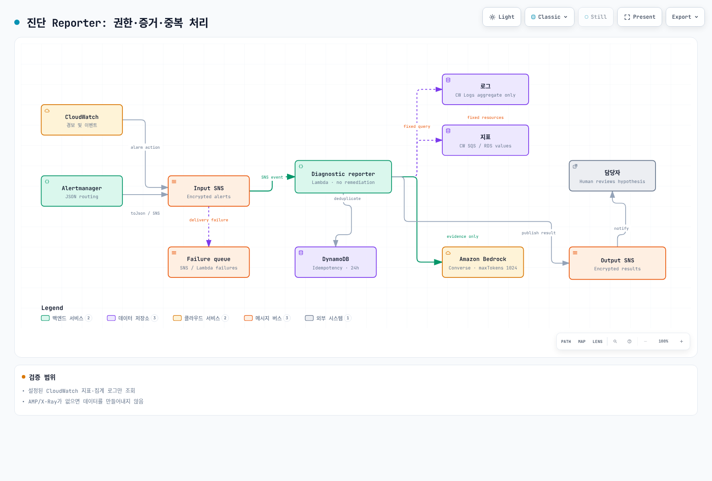

# Part 5: 알림 및 AIOps

<span id="aiops-agent-아키텍처"></span>
<span id="step-5-1-alertmanager-prometheusrule-구성"></span>
<span id="step-5-2-cloudwatch-alarms-구성"></span>
<span id="step-5-3-grafana-oncall-구성"></span>
<span id="step-5-4-sns-토픽-이메일-구독"></span>
<span id="step-5-5-cloudwatch-investigations"></span>
<span id="step-5-6-aiops-agent-lambda-bedrock-claude"></span>
<span id="step-5-7-부하-fault-injection-테스트"></span>
<span id="step-5-8-aiops-동작-확인"></span>
<span id="step-5-9-심화-a2a-멀티-에이전트-패턴"></span>
<span id="검증-verification"></span>
<span id="다음-단계"></span>
<span id="멀티-에이전트-아키텍처"></span>
<span id="아키텍처-개요"></span>
<span id="알림-규칙-목록"></span>
<span id="알림-흐름-확인"></span>
<span id="정리-이-part에서-정리하지-않음"></span>
<span id="조사-프로세스"></span>
<span id="참조-문서"></span>
<span id="학습-목표"></span>

> **난이도**: 고급 · **예상 소요 시간**: 60분
> **마지막 업데이트**: 2026년 9월 13일

알림을 수신하고 실제 지표·집계 로그를 확인한 뒤, 사람이 검토할 진단 가설을 만드는 실습입니다. [실행 예제](https://github.com/Atom-oh/kubernetes-docs/tree/main/examples/labs/observability/aiops)는 입력/결과 SNS 토픽을 분리한 Lambda reporter입니다. 자동 복구나 익명 HTTP webhook은 포함하지 않습니다.

[Part 2](./02-observability-stack-lab.md)의 수집, [Part 3](./03-msa-deployment-lab.md)의 서비스, [Part 4](./04-load-testing-scaling-lab.md)의 정상 smoke test가 선행 조건입니다. 예제 코드와 템플릿은 로컬 검증했으며 이번 감사에서 AWS 배포·모델 호출·알림 전송은 실행하지 않았습니다.


[🔍 인터랙티브 다이어그램 보기](https://www.atomai.click/kubernetes-docs/archmaps/ko-labs-observability-05-alerting-aiops-lab-0.html)

## 1. 알림 평가와 라우팅을 구분 {#rules-and-routing}

**Prometheus가 alert rule을 평가**하고, **Alertmanager가 grouping·deduplication·routing·inhibition·notification을 담당**합니다. `PrometheusRule`은 Prometheus Operator CRD이며 Alertmanager가 직접 평가하는 리소스가 아닙니다.

| 설정 | 확인 사항 |
|---|---|
| Prometheus `for` | 평가마다 조건이 지속되는 동안 pending, 지정 기간 후 firing |
| rule selector | Prometheus CR의 namespace/label selector가 실제 rule을 선택하는지 |
| Alertmanager route | `matchers`, route 순서, child route, `continue`와 receiver 일치 |
| metrics | 실제 SDK 이름·단위·label, missing series·무트래픽·counter reset |
| service label | reporter catalog에 등록한 service만 허용 |

`up == 0`은 이미 알려진 scrape target의 실패를 보여주며 발견 자체가 안 된 target의 부재를 모두 감지하지는 않습니다. 재시작 증가와 CrashLoopBackOff, 과거 OOMKilled 상태와 방금 발생한 OOM은 다른 신호입니다. exporter가 없는 SQS metric 이름을 PromQL에 적어도 값은 생성되지 않습니다.

```bash
kubectl --context managed -n monitoring get prometheus,alertmanager,prometheusrule
kubectl --context managed -n monitoring get services
# Use the actual Prometheus Service name in the next command.
kubectl --context managed -n monitoring port-forward svc/REPLACE_WITH_PROMETHEUS_SERVICE 9090:9090
```

```bash
curl --fail --silent http://127.0.0.1:9090/api/v1/rules
curl --fail --silent http://127.0.0.1:9090/api/v1/alerts
```

설치한 chart의 release/Service 이름을 확인해 치환합니다. 고정된 다른 release 이름이나 존재하지 않는 ConfigMap을 검색하지 않습니다. rule 리소스가 존재하는지와 Prometheus가 실제로 로드·평가하는지는 별도 확인입니다.

## 2. CloudWatch alarm의 의미 {#cloudwatch-alarms}

템플릿의 SQS backlog alarm은 `AWS/SQS`, `ApproximateNumberOfMessagesVisible`, 정확한 `QueueName`, `Maximum`, `Period=60`, `EvaluationPeriods=3`, `DatapointsToAlarm=2`를 사용합니다. 이는 최근 평가 범위에서 **3개 중 2개**가 위반하는 조건이며 반드시 연속 위반이라는 뜻이 아닙니다. `Period`는 집계 간격이고 평가 수행 빈도와 동의어가 아닙니다.

missing data는 이번 실습에서 `missing`으로 남깁니다. inactive queue나 수집 문제를 정상 0으로 단정하지 않습니다. RDS CPU를 추가한다면 실제 instance metric의 `DBInstanceIdentifier` dimension을 사용합니다. cluster aggregate나 다른 통계가 필요하면 해당 metric이 실제 지원하는 dimension 조합을 먼저 확인합니다.

Alertmanager의 알림 재전송, CloudWatch state transition, SNS delivery, Lambda async retry는 서로 다른 계층입니다. 한 계층의 dedup 설정으로 전체 파이프라인의 exactly-once를 보장하지 않습니다.

## 3. 현재 온콜 경로 선택 {#oncall}

Grafana OnCall OSS는 **2026년 3월 24일 보관 처리**되었고 Cloud Connection 기반 SMS·전화·push 지원도 종료됐습니다. 이전 실습의 OnCall 신규 설치·가짜 escalation YAML을 그대로 사용하지 않습니다. 기존에 운영하는 incident/notification 시스템이나 Grafana Cloud IRM 등 현재 지원되는 경로를 조직에 맞게 선택합니다. [공식 유지보수 공지](https://grafana.com/docs/oncall/latest/set-up/open-source/)를 확인합니다.

이 예제는 결과 SNS topic만 제공합니다. 담당자 구독·escalation·acknowledge·resolve는 선택한 시스템에서 구성하고 실제 전달을 검증합니다. 템플릿이 자동으로 이메일·Slack·PagerDuty 구독을 만든다고 가정하지 않습니다.

## 4. 진단 reporter 준비 {#reporter}




[🔍 인터랙티브 다이어그램 보기](https://www.atomai.click/kubernetes-docs/archmaps/ko-labs-observability-05-alerting-aiops-lab-10.html)
| 파일 | 책임 |
|---|---|
| `alerts.py` | SNS topic·형식·allowlist 검사, CloudWatch/Alertmanager 정규화 |
| `evidence.py` | 고정 source catalog의 CloudWatch metrics와 집계 로그 조회 |
| `analysis.py` | 근거가 있을 때만 Converse, 1024 output token, 완료 상태 검사 |
| `handler.py` | 2-worker 수집, Powertools idempotency, 결과 전용 topic publish |
| `template.yaml` | 15개 SAM/CloudFormation 리소스와 제한된 IAM |
| `tests/` | 정상·실패·중복·timeout·없는 데이터 검증 |

```bash
cd examples/labs/observability/aiops
python3.12 -m venv .venv
.venv/bin/python -m pip install -r requirements.txt
.venv/bin/python -m unittest discover -s tests -v
```

코드는 boto3 **1.43.93**, Powertools **3.34.0**, Python **3.12**로 확인했습니다. 실제 배포에서는 기존 SQS queue·로그 그룹과 승인한 service name, 현재 사용 가능한 Converse model/inference-profile ID, 필요한 **정확한 model/profile ARN**을 입력합니다. 오래된 Claude 모델 ID를 하드코딩하지 않습니다. cross-region profile은 대상 모델 ARN 권한도 필요할 수 있습니다.

로그는 `service`·`level` structured field를 가져야 합니다. reporter는 raw message 대신 error count를 조회하며 모델이 만든 resource ID/쿼리를 실행하지 않습니다. 지표·로그가 없으면 no_data/error로 남기고 분석을 생략할 수 있습니다. 이번 예제는 실제로 구성하지 않은 AMP 값·X-Ray trace를 수집했다고 표시하지 않습니다.

## 5. 배포와 Alertmanager 연결 {#deploy}

```bash
sam build --template-file template.yaml
sam deploy --guided --capabilities CAPABILITY_IAM
```

위 명령은 승인한 실습 계정에서 operator가 change set을 검토한 뒤 실행합니다. 템플릿은 암호화된 입력/결과 SNS, Lambda, idempotency table, failure queue, queue alarm 등을 생성합니다. `AWS_REGION` 같은 Lambda 예약 환경 변수를 직접 설정하지 않습니다.

배포 output의 InputTopicArn과 실제 Region을 아래에 대입합니다. Alertmanager **0.34.0**의 native template로 `toJson` 직렬화를 검증했습니다. 기존 설정 전체를 덮지 말고 실제로 로드되는 receiver·route에 병합합니다.

```yaml
receivers:
- name: lab-diagnostics
  sns_configs:
  - topic_arn: REPLACE_WITH_INPUT_TOPIC_ARN
    sigv4:
      region: REPLACE_WITH_REGION
    message: '{{ . | toJson }}'
    send_resolved: true
```

`toJson`의 template Data는 대문자 필드(`Alerts`, `Labels`, `Status`)를 사용하므로 parser가 이를 처리합니다. webhook의 소문자 JSON도 지원합니다. 기본 human-readable SNS 메시지를 이 JSON으로 오해하지 않습니다.

템플릿의 AlertmanagerPublishPolicyArn은 기존 **Alertmanager workload role에만** 연결합니다. node role에 공유 권한을 추가하지 않고 실제 Pod의 IAM credential 경로·KMS/SNS 권한을 확인합니다. `service` label은 catalog와 일치해야 하며 allowed alert 목록도 실제 rule과 맞춥니다. 결과 OutputTopicArn에는 reporter를 구독하지 않습니다.

## 6. 재시도·근거·완료 상태 {#execution}


[🔍 인터랙티브 다이어그램 보기](https://www.atomai.click/kubernetes-docs/archmaps/ko-labs-observability-05-alerting-aiops-lab-2.html)
성공한 SNS message ID는 DynamoDB로 **24시간** 중복 처리합니다. 같은 ID에 다른 payload를 넣으면 거부합니다. SNS delivery는 at-least-once이며 publish와 idempotency commit 사이 장애는 결과 통지를 중복시킬 수 있습니다. exactly-once라고 설명하지 않습니다.

Lambda reserved concurrency=2, async retry=2, 최대 event age=1시간입니다. 이는 Lambda가 받은 이후 설정이며 SNS 재전송 정책은 별도입니다. 결과·실패 큐와 재처리 절차를 함께 확인합니다. raw event나 비밀번호를 로그에 출력하지 않습니다.

조회는 현재 시각 기준 최대 15분 window를 사용하고 결과에 실제 start/end를 표시합니다. 원래 알람 시각의 완전한 재구성을 주장하지 않습니다. Logs Insights는 완료 상태까지 제한적으로 polling하고 미완료 query를 취소합니다. model response가 `max_tokens`·차단·빈 text이면 성공한 분석으로 게시하지 않습니다.

## 7. CloudWatch Investigations는 별도 구성 {#investigations}


[🔍 인터랙티브 다이어그램 보기](https://www.atomai.click/kubernetes-docs/archmaps/ko-labs-observability-05-alerting-aiops-lab-1.html)
계정의 investigation group·권한·보존·암호화 설정을 먼저 준비한 다음, alarm의 **Investigation action에 group ARN을 추가**합니다. metric/composite alarm을 통해 시작할 수 있습니다. ARN 형식은 다음과 같습니다.

```text
arn:aws:aiops:REGION:ACCOUNT_ID:investigation-group/GROUP_ID
```

[공식 절차](https://docs.aws.amazon.com/AmazonCloudWatch/latest/monitoring/Investigations-configure-alarm-procedures.html)에 따라 기존 alarm 설정을 보존하며 action을 추가합니다. `put-anomaly-detector`, `put-insight-rule`, `list-dashboards`는 investigation group 생성이나 조사 목록 API가 아닙니다. Application Signals discovery 활성화만으로 모든 조사 설정이 끝나는 것도 아닙니다. 이 예제 SAM stack은 investigation group을 생성하지 않습니다.

## 8. 장애 주입과 운영 검증 {#verification}

먼저 정상 smoke 결과와 알림 경로를 기록합니다. 앱이 실제 지원하는 지연/오류 주입 기능만 전용 canary에 사용하고 제한 시간·대상·원복 방법을 정합니다. 구현하지 않은 `/admin/chaos` endpoint나 읽지 않는 환경 변수를 호출하지 않습니다. Pod 삭제는 CrashLoopBackOff를 보장하지 않습니다.

GitOps가 소유한 workload는 Git/지원하는 Rollouts 흐름으로 변경·복구합니다. Deployment와 Rollout을 혼동하거나 JSON Patch의 음수 index로 환경 변수를 지우지 않습니다.

1. Prometheus rule이 실제 로드되고 pending/firing을 거치는지 확인합니다.
2. Alertmanager가 선택한 receiver와 SNS 입력 message를 확인합니다.
3. Lambda의 완료/실패·DLQ·idempotency 결과를 확인합니다.
4. 결과 topic이 다른 topic이고 reporter 재진입이 없는지 확인합니다.
5. 보고서의 시간 범위·실제 관측·미확인 사항과 담당자 수신을 대조합니다.
6. 주입한 변경을 원복하고 재시도·부하 실행이 종료됐는지 확인합니다.

## 9. 선택 확장과 정리 {#extensions}


[🔍 인터랙티브 다이어그램 보기](https://www.atomai.click/kubernetes-docs/archmaps/ko-labs-observability-05-alerting-aiops-lab-3.html)
여러 분석 모듈의 호출만으로 A2A 프로토콜을 구현했다고 하지 않습니다. 실제 agent discovery·인증·메시지/task 계약·timeout·권한을 별도로 설계해야 합니다. 이 실습의 reporter는 단일 진단 함수입니다.

정리 전 증거를 보관하고 입력 alarm action/구독을 중지합니다. 생성한 SAM stack과 외부 workload-role policy attachment·추가 구독을 소유권 inventory로 대조해 제거합니다. 운영 중인 queue/log group까지 지우지 않습니다. [Part 6](./06-distributed-tracing-lab.md#cleanup)의 의존성 순서와 비용 확인을 따릅니다.

## 검증 범위

로컬 24개 테스트, 실제 Powertools의 메모리 저장소 중복 처리, botocore Stubber 6개 사례, Alertmanager 0.34.0의 native JSON template, CloudFormation lint·15개 policy statement를 확인했습니다. 이는 AWS IAM/KMS 유효 권한, 실제 SNS 전달·DynamoDB 저장·CloudWatch query·Bedrock 답변 품질·클러스터 배포를 실행한 결과가 아닙니다.
