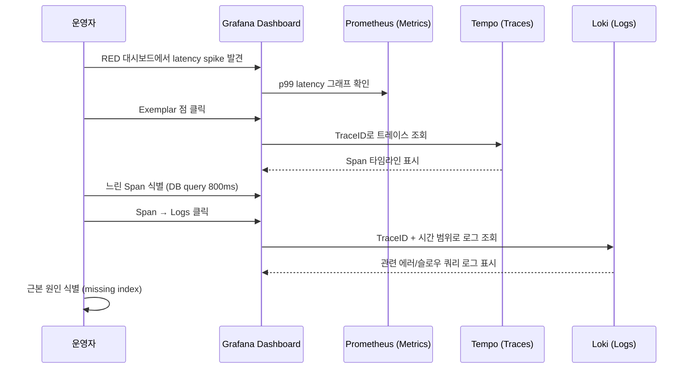
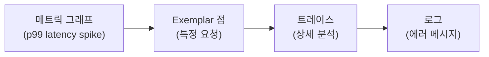

# Part 6: 분산 추적 분석

> **난이도**: 고급 (Advanced)
> **예상 소요 시간**: 45분
> **마지막 업데이트**: 2025년 2월

## 학습 목표

- Tempo + Grafana를 사용한 end-to-end 트레이스 분석
- 서비스 간 병목 구간 식별
- Loki와 Tempo 상관관계 분석
- Exemplar를 통한 메트릭에서 트레이스 drill-down

## 분석 워크플로우



---

## Step 6.1: TraceQL 트레이스 검색

### TraceQL 기본 문법

| 연산자 | 설명 | 예시 |
|--------|------|------|
| `{}` | 모든 트레이스 | `{}` |
| `{ .attr = "value" }` | 속성 필터 | `{ .service.name = "order-service" }` |
| `{ status = error }` | 상태 필터 | `{ status = error }` |
| `{ duration > 1s }` | 시간 필터 | `{ duration > 2s }` |
| `&&` | AND 조건 | `{ .service.name = "api-gateway" && status = error }` |
| `\|\|` | OR 조건 | `{ status = error \|\| duration > 5s }` |

### 주요 검색 쿼리

| 검색 목적 | TraceQL 쿼리 |
|----------|-------------|
| 서버 에러 (5xx) | `{ status = error && .http.status_code >= 500 }` |
| Order Service 느린 응답 | `{ .service.name = "order-service" && duration > 1s }` |
| DB 쿼리 지연 | `{ .db.system = "postgresql" && duration > 500ms }` |
| SQS 발행 지연 | `{ .messaging.system = "aws_sqs" && .messaging.operation = "publish" && duration > 200ms }` |
| 특정 고객 요청 | `{ .customer_id = "customer-001" }` |
| 에러 트레이스 (전체) | `{ status = error }` |

**Step 6.1.1: Grafana Explore에서 TraceQL 실행**

```bash
# Grafana 포트 포워딩 (이미 실행 중이면 생략)
kubectl --context managed port-forward svc/kube-prometheus-grafana 3000:80 -n monitoring &

# 브라우저에서 http://localhost:3000 접속
# Explore > Tempo datasource 선택
```

**Step 6.1.2: 에러 트레이스 검색**

Grafana Explore에서:

1. **Datasource**: Tempo 선택
2. **Query type**: TraceQL 선택
3. **Query**:

```
{ status = error && .service.name =~ ".*-service" }
```

**Step 6.1.3: 느린 요청 검색**

```
{ .service.name = "order-service" && duration > 2s } | select(status, .http.method, .http.url, duration)
```

**Step 6.1.4: 복합 조건 검색**

```
// Payment service 에러 또는 느린 응답
{ .service.name = "payment-service" && (status = error || duration > 1s) }

// DB 쿼리가 포함된 느린 트레이스
{ .db.system = "postgresql" } >> { duration > 1s }
```

---

## Step 6.2: 서비스 그래프 (Service Graph)

### Tempo Service Graph 활성화

Service Graph는 Tempo의 메트릭 생성기(metrics-generator)를 통해 생성됩니다.

**Step 6.2.1: 서비스 그래프 확인**

Grafana에서:

1. **Explore** > **Tempo** 선택
2. **Service Graph** 탭 클릭
3. 서비스 간 연결 관계 확인

### 서비스 그래프 해석

| 노드 색상 | 의미 |
|----------|------|
| 녹색 | 정상 (에러율 < 1%) |
| 노란색 | 경고 (에러율 1-5%) |
| 빨간색 | 위험 (에러율 > 5%) |

| 엣지 두께 | 의미 |
|----------|------|
| 가는 선 | 낮은 트래픽 |
| 두꺼운 선 | 높은 트래픽 |

**Step 6.2.2: 서비스 그래프 메트릭**

```promql
# 서비스 간 요청 수
sum(rate(traces_service_graph_request_total[5m])) by (client, server)

# 서비스 간 에러율
sum(rate(traces_service_graph_request_failed_total[5m])) by (client, server) /
sum(rate(traces_service_graph_request_total[5m])) by (client, server)

# 서비스 간 평균 지연
sum(rate(traces_service_graph_request_duration_seconds_sum[5m])) by (client, server) /
sum(rate(traces_service_graph_request_duration_seconds_count[5m])) by (client, server)
```

---

## Step 6.3: 지연 구간 식별 워크플로우

### 분석 단계

| 단계 | 작업 | 도구 |
|------|------|------|
| 1. 트레이스 선택 | 느린 또는 에러 트레이스 선택 | TraceQL |
| 2. Span 분석 | 타임라인에서 각 span 시간 확인 | Tempo UI |
| 3. 병목 분류 | 어떤 유형의 작업인지 분류 | Span attributes |
| 4. 근본 원인 식별 | 로그, 메트릭과 연계하여 원인 파악 | Loki, Prometheus |

### Span 유형별 병목 분류

| Span 종류 | 일반적인 병목 원인 | 확인 방법 |
|----------|------------------|----------|
| HTTP Client | 외부 서비스 응답 지연 | `.http.url`, duration |
| Database | 쿼리 최적화 필요, 인덱스 부재 | `.db.statement`, duration |
| Message Queue | 큐 지연, 처리 지연 | `.messaging.destination`, duration |
| Internal | 코드 로직, CPU 바운드 | span gap 분석 |

**Step 6.3.1: 느린 트레이스 분석**

```
// 전체 요청 중 가장 느린 트레이스 찾기
{ .http.method = "POST" && .http.url =~ "/orders" } | sort(duration) | limit(10)
```

Grafana에서 트레이스 선택 후:

1. **Trace 타임라인** 확인
2. 가장 긴 span 식별
3. **Span Details** 패널에서 attributes 확인

**Step 6.3.2: 병목 구간 파악**

예시 트레이스 분석:

```
Total Duration: 2.5s
├── api-gateway (50ms)
│   └── HTTP POST /orders
├── order-service (2.4s)  ← 병목!
│   ├── DB query (1.8s)   ← 근본 원인
│   │   └── SELECT * FROM orders WHERE customer_id = ?
│   └── SQS publish (600ms)
└── Response (50ms)
```

분석 결과:
- 병목: `order-service` (2.4s 중 전체의 96%)
- 근본 원인: DB 쿼리 (1.8s) - customer_id 인덱스 필요

---

## Step 6.4: Loki와 Tempo 상관관계

### Logs → Traces 연동

Loki 로그에서 TraceID를 추출하여 Tempo 트레이스로 이동합니다.

**Step 6.4.1: Loki Derived Fields 설정**

Grafana Datasource 설정에서 이미 구성됨:

```yaml
derivedFields:
  - datasourceUid: tempo
    matcherRegex: '"traceID":"([a-f0-9]+)"'
    name: TraceID
    url: '${__value.raw}'
  - datasourceUid: tempo
    matcherRegex: 'trace_id=([a-f0-9]+)'
    name: TraceID
    url: '${__value.raw}'
```

**Step 6.4.2: Loki에서 에러 로그 검색**

```logql
{namespace="msa", app="order-service"} |= "error" | json | line_format "{{.traceID}} - {{.message}}"
```

로그 라인의 **TraceID** 링크 클릭 → Tempo 트레이스로 이동

### Traces → Logs 연동

**Step 6.4.3: Tempo에서 관련 로그 조회**

1. Tempo에서 트레이스 선택
2. Span 선택
3. **Logs for this span** 클릭
4. Loki에서 해당 시간 범위 + TraceID로 로그 검색

자동 생성되는 Loki 쿼리:

```logql
{namespace="msa"} | json | traceID = "abc123def456" | timestamp >= 2025-02-22T10:00:00Z | timestamp <= 2025-02-22T10:01:00Z
```

---

## Step 6.5: Exemplar 활용

Exemplar는 메트릭 데이터 포인트에 연결된 트레이스 ID로, 집계된 메트릭에서 개별 트레이스로 드릴다운할 수 있게 합니다.

### Exemplar 워크플로우



**Step 6.5.1: Exemplar가 있는 메트릭 쿼리**

```promql
# p99 latency with exemplars
histogram_quantile(0.99,
  sum(rate(http_request_duration_seconds_bucket{namespace="msa"}[5m])) by (le, service)
)
```

**Step 6.5.2: Grafana에서 Exemplar 확인**

1. Time series 패널에서 **Exemplars** 옵션 활성화
2. 그래프 위의 다이아몬드(◇) 마커 확인
3. 마커 위에 마우스 올리면 TraceID 표시
4. 클릭하면 Tempo 트레이스로 이동

**Step 6.5.3: Exemplar 저장 Prometheus 설정 확인**

```yaml
# Prometheus에서 exemplar storage 활성화
prometheus:
  prometheusSpec:
    enableFeatures:
      - exemplar-storage
    exemplars:
      maxSize: 100000
```

---

## Step 6.6: 종합 대시보드 구성

### 대시보드 패널 구성

| 대시보드 | 목적 | 주요 패널 |
|---------|------|----------|
| RED Overview | 서비스 상태 요약 | Rate, Errors, Duration |
| SLI/SLO | 서비스 수준 목표 | Availability, Latency SLOs |
| Infrastructure | 인프라 상태 | Node/Pod CPU, Memory |
| Traces | 트레이스 분석 | Service Graph, Recent Traces |

**Step 6.6.1: RED Overview Dashboard**

```json
{
  "dashboard": {
    "title": "MSA RED Overview",
    "uid": "msa-red-overview",
    "panels": [
      {
        "title": "Request Rate by Service",
        "type": "timeseries",
        "gridPos": { "x": 0, "y": 0, "w": 8, "h": 8 },
        "targets": [
          {
            "expr": "sum(rate(http_requests_total{namespace=\"msa\"}[5m])) by (service)",
            "legendFormat": "{{service}}"
          }
        ],
        "fieldConfig": {
          "defaults": {
            "unit": "reqps"
          }
        }
      },
      {
        "title": "Error Rate by Service",
        "type": "timeseries",
        "gridPos": { "x": 8, "y": 0, "w": 8, "h": 8 },
        "targets": [
          {
            "expr": "sum(rate(http_requests_total{namespace=\"msa\", status=~\"5..\"}[5m])) by (service) / sum(rate(http_requests_total{namespace=\"msa\"}[5m])) by (service)",
            "legendFormat": "{{service}}"
          }
        ],
        "fieldConfig": {
          "defaults": {
            "unit": "percentunit",
            "max": 1
          }
        }
      },
      {
        "title": "P99 Latency by Service",
        "type": "timeseries",
        "gridPos": { "x": 16, "y": 0, "w": 8, "h": 8 },
        "targets": [
          {
            "expr": "histogram_quantile(0.99, sum(rate(http_request_duration_seconds_bucket{namespace=\"msa\"}[5m])) by (le, service))",
            "legendFormat": "{{service}}",
            "exemplar": true
          }
        ],
        "fieldConfig": {
          "defaults": {
            "unit": "s"
          }
        },
        "options": {
          "exemplars": true
        }
      },
      {
        "title": "Service Graph",
        "type": "nodeGraph",
        "gridPos": { "x": 0, "y": 8, "w": 12, "h": 10 },
        "datasource": "Tempo",
        "targets": [
          {
            "queryType": "serviceMap"
          }
        ]
      },
      {
        "title": "Recent Error Traces",
        "type": "table",
        "gridPos": { "x": 12, "y": 8, "w": 12, "h": 10 },
        "datasource": "Tempo",
        "targets": [
          {
            "query": "{ status = error }",
            "queryType": "traceql",
            "limit": 20
          }
        ]
      }
    ]
  }
}
```

**Step 6.6.2: SLI/SLO Dashboard**

```json
{
  "dashboard": {
    "title": "MSA SLI/SLO",
    "uid": "msa-sli-slo",
    "panels": [
      {
        "title": "Availability SLO (99.9%)",
        "type": "gauge",
        "gridPos": { "x": 0, "y": 0, "w": 6, "h": 6 },
        "targets": [
          {
            "expr": "1 - (sum(rate(http_requests_total{namespace=\"msa\", status=~\"5..\"}[24h])) / sum(rate(http_requests_total{namespace=\"msa\"}[24h])))"
          }
        ],
        "fieldConfig": {
          "defaults": {
            "unit": "percentunit",
            "thresholds": {
              "mode": "absolute",
              "steps": [
                { "value": 0, "color": "red" },
                { "value": 0.99, "color": "yellow" },
                { "value": 0.999, "color": "green" }
              ]
            }
          }
        }
      },
      {
        "title": "Latency SLO (p99 < 500ms)",
        "type": "gauge",
        "gridPos": { "x": 6, "y": 0, "w": 6, "h": 6 },
        "targets": [
          {
            "expr": "histogram_quantile(0.99, sum(rate(http_request_duration_seconds_bucket{namespace=\"msa\"}[24h])) by (le))"
          }
        ],
        "fieldConfig": {
          "defaults": {
            "unit": "s",
            "thresholds": {
              "mode": "absolute",
              "steps": [
                { "value": 0, "color": "green" },
                { "value": 0.3, "color": "yellow" },
                { "value": 0.5, "color": "red" }
              ]
            }
          }
        }
      },
      {
        "title": "Error Budget Remaining (30 day)",
        "type": "stat",
        "gridPos": { "x": 12, "y": 0, "w": 6, "h": 6 },
        "targets": [
          {
            "expr": "1 - ((sum(increase(http_requests_total{namespace=\"msa\", status=~\"5..\"}[30d]))) / (sum(increase(http_requests_total{namespace=\"msa\"}[30d])) * 0.001))"
          }
        ],
        "fieldConfig": {
          "defaults": {
            "unit": "percentunit"
          }
        }
      },
      {
        "title": "SLO Compliance Timeline",
        "type": "timeseries",
        "gridPos": { "x": 0, "y": 6, "w": 24, "h": 8 },
        "targets": [
          {
            "expr": "1 - (sum(rate(http_requests_total{namespace=\"msa\", status=~\"5..\"}[1h])) / sum(rate(http_requests_total{namespace=\"msa\"}[1h])))",
            "legendFormat": "Availability"
          },
          {
            "expr": "0.999",
            "legendFormat": "SLO Target (99.9%)"
          }
        ]
      }
    ]
  }
}
```

**Step 6.6.3: Dashboard Import**

```bash
# Dashboard JSON 파일 생성 후 import
curl -X POST \
  -H "Content-Type: application/json" \
  -H "Authorization: Bearer ${GRAFANA_API_KEY}" \
  -d @msa-red-dashboard.json \
  http://localhost:3000/api/dashboards/db
```

---

## Step 6.7: 정리 (Cleanup)

전체 실습 리소스를 정리합니다.

### 정리 순서

| 순서 | 대상 | 명령어 |
|------|------|--------|
| 1 | MSA 애플리케이션 | ArgoCD에서 삭제 |
| 2 | Observability 스택 | Helm uninstall |
| 3 | KEDA, Karpenter | Helm uninstall |
| 4 | AWS Managed Services | Terraform destroy |
| 5 | EKS 클러스터 | eksctl delete |

**Step 6.7.1: MSA 애플리케이션 삭제**

```bash
# ArgoCD Applications 삭제
argocd app delete obs-lab-apps --cascade

# MSA 네임스페이스 삭제 (Service Cluster)
kubectl --context service delete namespace msa
```

**Step 6.7.2: Observability 스택 삭제**

```bash
# Managed Cluster로 전환
kubectl config use-context managed

# Helm releases 삭제
helm uninstall kube-prometheus -n monitoring
helm uninstall loki -n monitoring
helm uninstall tempo -n monitoring
helm uninstall victoriametrics -n monitoring
helm uninstall mimir -n monitoring
helm uninstall oncall -n monitoring
helm uninstall argocd -n argocd

# OTel Operator 삭제
kubectl delete -f https://github.com/open-telemetry/opentelemetry-operator/releases/latest/download/opentelemetry-operator.yaml

# cert-manager 삭제
kubectl delete -f https://github.com/cert-manager/cert-manager/releases/download/v1.14.4/cert-manager.yaml

# 네임스페이스 삭제
kubectl delete namespace monitoring
kubectl delete namespace argocd
```

**Step 6.7.3: Service Cluster 컴포넌트 삭제**

```bash
# Service Cluster로 전환
kubectl config use-context service

# KEDA 삭제
helm uninstall keda -n keda

# Argo Rollouts 삭제
helm uninstall argo-rollouts -n argo-rollouts

# 네임스페이스 삭제
kubectl delete namespace keda
kubectl delete namespace argo-rollouts
```

**Step 6.7.4: AWS Managed Services 삭제**

```bash
# Terraform으로 생성한 리소스 삭제
cd terraform
terraform destroy -auto-approve

# 또는 개별 삭제

# S3 버킷 (비우고 삭제)
aws s3 rb s3://obs-lab-loki-chunks-${AWS_ACCOUNT_ID} --force
aws s3 rb s3://obs-lab-loki-ruler-${AWS_ACCOUNT_ID} --force
aws s3 rb s3://obs-lab-tempo-${AWS_ACCOUNT_ID} --force
aws s3 rb s3://obs-lab-mimir-${AWS_ACCOUNT_ID} --force
aws s3 rb s3://obs-lab-mwaa-dags-${AWS_ACCOUNT_ID} --force

# CloudWatch Alarms
aws cloudwatch delete-alarms --alarm-names \
  "obs-lab-aurora-cpu-critical" \
  "obs-lab-aurora-connections-high" \
  "obs-lab-aurora-replication-lag" \
  "obs-lab-sqs-message-age" \
  "obs-lab-sqs-dlq-messages"

# Lambda 함수
aws lambda delete-function --function-name obs-lab-aiops-agent

# SNS 구독 삭제 (topic은 Terraform에서 삭제)
# SQS 큐 삭제 (Terraform에서 삭제)
# Aurora 삭제 (Terraform에서 삭제)
# OpenSearch 삭제 (Terraform에서 삭제)
# AMP 워크스페이스 삭제
aws amp delete-workspace --workspace-id ${AMP_WORKSPACE_ID}

# AMG 워크스페이스 삭제
aws grafana delete-workspace --workspace-id ${AMG_WORKSPACE_ID}

# MWAA 환경 삭제
aws mwaa delete-environment --name obs-lab-airflow
```

**Step 6.7.5: EKS 클러스터 삭제**

```bash
# Service Cluster 삭제
eksctl delete cluster --name obs-service-cluster --region us-east-1

# Managed Cluster 삭제
eksctl delete cluster --name obs-managed-cluster --region us-east-1

# 또는 Terraform으로 생성한 경우
cd terraform/managed-cluster
terraform destroy -auto-approve

cd ../service-cluster
terraform destroy -auto-approve
```

**Step 6.7.6: IAM 리소스 정리**

```bash
# IRSA 역할 삭제
aws iam delete-role-policy --role-name LokiS3Role --policy-name loki-s3-policy
aws iam delete-role --role-name LokiS3Role

aws iam delete-role-policy --role-name TempoS3Role --policy-name tempo-s3-policy
aws iam delete-role --role-name TempoS3Role

# 정책 삭제
aws iam delete-policy --policy-arn arn:aws:iam::${AWS_ACCOUNT_ID}:policy/ObsLabSQSSNSPolicy
aws iam delete-policy --policy-arn arn:aws:iam::${AWS_ACCOUNT_ID}:policy/LokiS3Policy
aws iam delete-policy --policy-arn arn:aws:iam::${AWS_ACCOUNT_ID}:policy/TempoS3Policy
aws iam delete-policy --policy-arn arn:aws:iam::${AWS_ACCOUNT_ID}:policy/XRayPolicy
```

### 정리 확인

```bash
# 남은 리소스 확인
echo "=== Remaining EKS Clusters ==="
aws eks list-clusters --region us-east-1

echo ""
echo "=== Remaining RDS Clusters ==="
aws rds describe-db-clusters --query "DBClusters[?contains(DBClusterIdentifier, 'obs-lab')]"

echo ""
echo "=== Remaining S3 Buckets ==="
aws s3 ls | grep obs-lab

echo ""
echo "=== Remaining CloudWatch Log Groups ==="
aws logs describe-log-groups --log-group-name-prefix "/aws/eks/obs-lab"
```

---

## 검증 (Verification)

### Full Drill-down 테스트

메트릭 → Exemplar → 트레이스 → 로그 전체 흐름 확인:

```bash
# 1. Grafana 접속
# 브라우저에서 http://localhost:3000

# 2. RED Overview 대시보드로 이동

# 3. P99 Latency 그래프에서 spike 확인

# 4. Exemplar (◇) 클릭 → Tempo 트레이스로 이동

# 5. 트레이스에서 느린 span 식별

# 6. Span의 "Logs" 버튼 클릭 → Loki 로그 확인

# 7. 에러 메시지 또는 slow query 로그 확인
```

### 검증 체크리스트

| 항목 | 확인 방법 | 예상 결과 |
|------|----------|----------|
| TraceQL 검색 | `{ status = error }` | 에러 트레이스 목록 |
| Service Graph | Tempo > Service Graph | 서비스 연결 그래프 |
| Logs → Traces | Loki에서 TraceID 클릭 | Tempo 트레이스 표시 |
| Traces → Logs | Tempo에서 Logs 버튼 | Loki 로그 표시 |
| Exemplar | 메트릭 그래프 ◇ 클릭 | Tempo 트레이스 표시 |
| 리소스 정리 | AWS Console 확인 | 모든 리소스 삭제 완료 |

---

## 실습 완료

축하합니다! Observability End-to-End 실습 시리즈를 모두 완료했습니다.

### 학습 내용 요약

| Part | 주제 | 핵심 기술 |
|------|------|----------|
| 1 | 인프라 구성 | EKS, Terraform, eksctl |
| 2 | Observability 스택 | OTel, Prometheus, Loki, Tempo |
| 3 | MSA 배포 | ArgoCD, Argo Rollouts, KEDA |
| 4 | 부하 테스트 | k6, Karpenter, 스케일링 |
| 5 | 알림 및 AIOps | AlertManager, Bedrock, Lambda |
| 6 | 분산 추적 | TraceQL, Exemplar, Correlation |

### 다음 단계 권장

1. **프로덕션 적용**: 학습한 내용을 실제 프로덕션 환경에 적용
2. **커스텀 대시보드**: 조직의 SLO에 맞는 대시보드 구성
3. **알림 튜닝**: 노이즈 감소를 위한 알림 임계값 조정
4. **AIOps 확장**: 멀티 에이전트 패턴으로 AIOps 고도화

---

## 참조 문서

- [OpenTelemetry 기초](../../observability/tracing/03-opentelemetry.md)
- [Grafana Tempo 가이드](../../observability/tracing/01-tempo.md)
- [Loki 로깅](../../observability/logging/01-loki.md)
- [Prometheus 메트릭](../../observability/metrics/01-prometheus.md)

---

## 시리즈 목차

- [README: 시리즈 소개](./README.md)
- [Part 1: 인프라 구성](./01-infrastructure-setup-lab.md)
- [Part 2: Observability 스택 배포](./02-observability-stack-lab.md)
- [Part 3: MSA 배포 및 카나리](./03-msa-deployment-lab.md)
- [Part 4: 부하 테스트 및 스케일링](./04-load-testing-scaling-lab.md)
- [Part 5: 알림 및 AIOps](./05-alerting-aiops-lab.md)
- **Part 6: 분산 추적 분석** (현재 문서)
