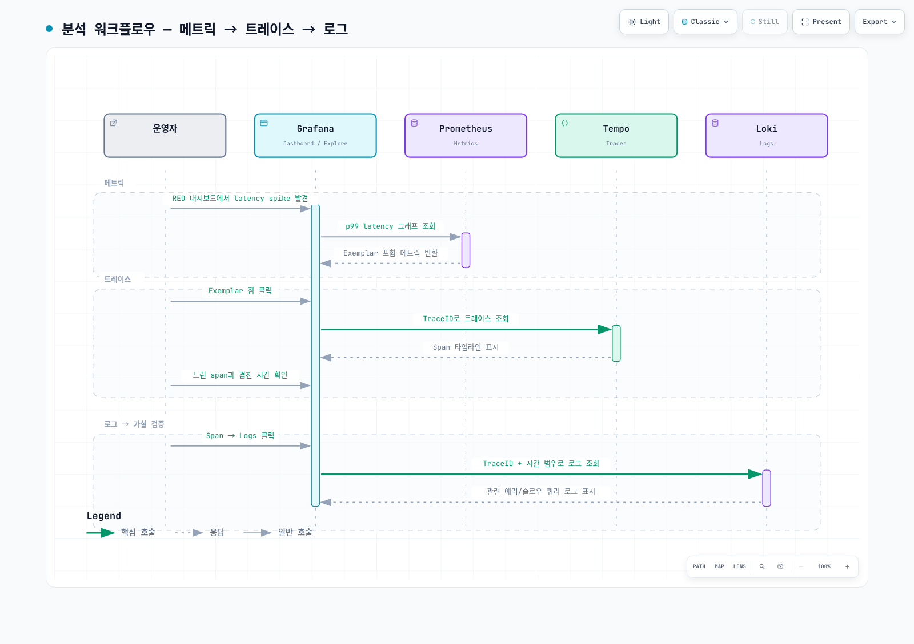
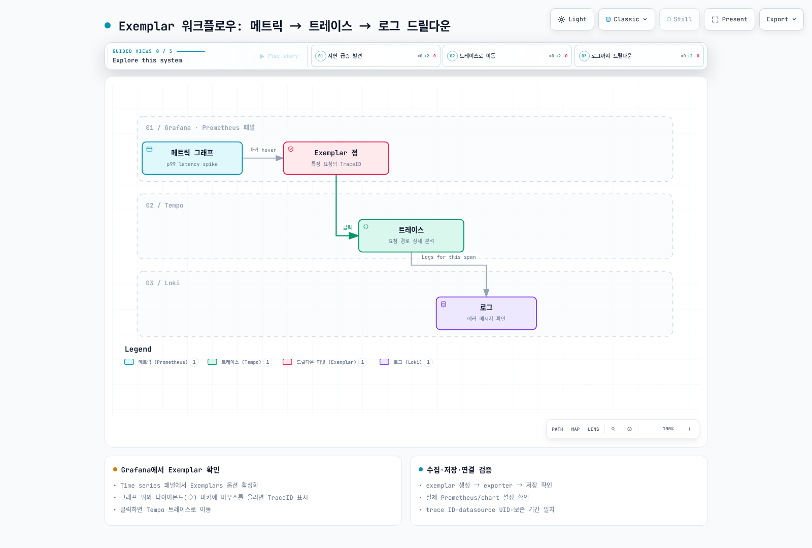

# Part 6: 분산 추적 분석

<span id="exemplar-워크플로우"></span>
<span id="full-drill-down-테스트"></span>
<span id="logs-→-traces-연동"></span>
<span id="span-유형별-병목-분류"></span>
<span id="step-6-1-traceql-트레이스-검색"></span>
<span id="step-6-2-서비스-그래프-service-graph"></span>
<span id="step-6-3-지연-구간-식별-워크플로우"></span>
<span id="step-6-4-loki와-tempo-상관관계"></span>
<span id="step-6-5-exemplar-활용"></span>
<span id="step-6-6-종합-대시보드-구성"></span>
<span id="step-6-7-정리-cleanup"></span>
<span id="tempo-service-graph-활성화"></span>
<span id="traceql-기본-문법"></span>
<span id="traces-→-logs-연동"></span>
<span id="검증-verification"></span>
<span id="검증-체크리스트"></span>
<span id="다음-단계-권장"></span>
<span id="대시보드-패널-구성"></span>
<span id="분석-단계"></span>
<span id="분석-워크플로우"></span>
<span id="서비스-그래프-해석"></span>
<span id="시리즈-목차"></span>
<span id="실습-완료"></span>
<span id="정리-순서"></span>
<span id="정리-확인"></span>
<span id="주요-검색-쿼리"></span>
<span id="참조-문서"></span>
<span id="학습-내용-요약"></span>
<span id="학습-목표"></span>

> **난이도**: 고급 · **예상 소요 시간**: 45분
> **마지막 업데이트**: 2026년 9월 13일

실제 요청 하나를 metrics → exemplar → trace → logs로 따라가고, 관찰한 사실과 원인 가설을 구분합니다. [Part 2](./02-observability-stack-lab.md)의 수집 경로와 [Part 3](./03-msa-deployment-lab.md)의 context propagation이 선행 조건입니다. 아래 TraceQL은 Tempo **3.0.3**의 실제 parser로 검증했으며, 현재 OTel 속성을 사용하는 예제입니다.



[🔍 인터랙티브 다이어그램 보기](https://www.atomai.click/kubernetes-docs/archmaps/ko-labs-observability-06-distributed-tracing-lab-0.html)

## 1. TraceQL 검색 {#traceql}

```traceql
{ resource.service.name = "order-service" && span:duration > 1s }

{ trace:duration > 2s && resource.service.name = "order-service" }

{ span:kind = server && span.http.response.status_code >= 500 }

{ span.db.system.name = "postgresql" && span:duration > 100ms }

{ span.messaging.system = "aws_sqs" && span.messaging.operation.type = "send" }

{ resource.service.name = "api-gateway" } >> { resource.service.name = "order-service" }

{ resource.service.name = "order-service" } >> { span.db.system.name = "postgresql" }

{ span:status = error } | select(resource.service.name, span.http.response.status_code, span:duration)
```

`span:duration`은 개별 span, `trace:duration`은 전체 trace 시간입니다. `span:`으로 intrinsic을, `span.`/`resource.`로 사용자 속성을 명시합니다. `>>`는 왼쪽 span의 descendant인 오른쪽 span을 찾습니다. DB span 이후 자식을 찾는 쿼리와 서비스 아래 DB span을 찾는 쿼리는 다릅니다.

`sort(duration)`, SQL의 `order by`, `| limit 20`, `{ duration > p99 }`는 이 검색 문법이 아닙니다. Grafana의 결과 정렬·검색 limit·시간 범위를 설정하고, p99 측정값을 `800ms`처럼 실제 duration literal로 바꿔 검색합니다. `select()`는 표시할 속성을 추가하며 저장된 모든 span을 자동으로 만들어내지 않습니다.

구버전 SDK는 `http.status_code`, `http.method`, `db.system`, `db.statement`, `messaging.operation`을 보낼 수 있습니다. 현재 표준의 `http.response.status_code`, `http.request.method`, `db.system.name`, `db.query.text`, `messaging.operation.type`와 혼용하지 말고 실제 span을 열어 속성·SDK 버전을 확인합니다. 속성 이름만 바꾼 쿼리가 수집기의 데이터 변환을 수행하지는 않습니다. DB query text는 선택적으로 수집·sanitization하며 비밀번호·SQL literal·고객 정보를 저장하지 않습니다.

## 2. Service graph의 전제 조건 {#service-graph}

Tempo에 trace가 들어오는 것만으로 Grafana service graph가 완성되지 않습니다. service-graphs processor를 활성화한 metrics-generator, metrics 저장소로의 실제 전달, Grafana Tempo datasource의 serviceMap datasource UID 연결이 필요합니다. client/server 또는 producer/consumer span이 context를 공유해야 엣지를 정확히 만들 수 있습니다. sampling·누락된 span·잘못된 span kind는 결과를 왜곡합니다.

```promql
sum by (client, server) (rate(traces_service_graph_request_total[5m]))

(
  sum by (client, server) (rate(traces_service_graph_request_failed_total[5m]))
  or on (client, server)
  (0 * sum by (client, server) (rate(traces_service_graph_request_total[5m])))
)
/ on (client, server)
(sum by (client, server) (rate(traces_service_graph_request_total[5m])) > 0)

sum by (client, server) (rate(traces_service_graph_request_server_seconds_sum[5m]))
/
sum by (client, server) (rate(traces_service_graph_request_server_seconds_count[5m]))
```

에러 counter는 오류가 한 번도 없으면 series 자체가 없을 수 있습니다. 분자는 대응하는 request-total의 0으로 보완하고, 분모는 양수인 요청률만 남겨 정상 0%와 무트래픽·수집 누락을 구분합니다.

마지막 쿼리는 server 측 평균 지연입니다. client 측은 `traces_service_graph_request_client_seconds_*`를 사용합니다. 존재하지 않는 `traces_service_graph_request_duration_seconds_*`를 사용하지 않습니다. 0 요청 구간은 0% 정상으로 오해하지 않도록 처리합니다. UI 색상·굵기는 dashboard/Grafana 설정에 따라 달라지므로 고정 1%·5% 색상 규칙으로 판정하지 않고 실제 request/error/duration 값을 봅니다.

## 3. Waterfall에서 병목 가설 찾기 {#waterfall}

| 관찰 | 다음 확인 |
|---|---|
| 느린 DB span | query plan·lock wait·connection pool·서버 지표 확인 |
| 긴 client span | DNS·TLS·네트워크·서버 대기·재시도 구간 비교 |
| 부모와 자식 사이 gap | 미계측 코드·큐 대기·GC·thread scheduling 확인 |
| 병렬 child span | 단순 duration 합 대신 critical path·겹침 확인 |
| 메시지 처리 지연 | send/receive/process span과 큐 대기·재전달을 구분 |

부모 span 시간에는 자식 span이 포함되므로 전부 더하면 이중 계산됩니다. DB span이 1.8초라는 사실만으로 인덱스 부재를 확정하지 않습니다. 같은 배포·트래픽·시간 범위의 로그와 지표를 대조하고 가설을 검증합니다.

## 4. 로그와 trace 연결 {#correlation}

```logql
{service_name="order-service"} | json | level="ERROR"

{service_name="order-service"} | json | trace_id="0123456789abcdef0123456789abcdef"
```

위 쿼리는 `service_name` stream label과 JSON `trace_id` 필드가 실제로 존재하는 경우의 예입니다. trace ID 예시는 32자리 hex이며 실제 요청의 값으로 바꿉니다. `traceID`, `traceId`, `trace_id`는 서로 다른 필드입니다. `trace_id`를 고유 stream label로 만들지 말고 로그 필드/structured metadata로 유지합니다. 시간 범위는 Grafana/HTTP query parameter에서 설정하며 LogQL에 `timestamp >= 2025-...`를 덧붙이지 않습니다.

Loki derived field는 로그의 trace ID를 추출해 Tempo UID에 연결합니다. Grafana provisioning YAML의 내부 링크 표현식은 `$${__value.raw}`처럼 `$`를 escape해야 합니다. 이중 quote 안에 정규식을 넣거나 shell envsubst를 광범위하게 실행하면 역슬래시·Grafana 변수가 바뀔 수 있으므로 단일 quote와 제한된 치환을 사용합니다.

Tempo `tracesToLogsV2`에는 Loki datasource UID, 실제 resource→log label 매핑, 시간 여유, trace ID filter를 설정합니다. “Logs for this span” 클릭 후 생성된 LogQL이 실제 label/field와 일치하는지 확인합니다. 링크가 있다는 것과 같은 요청의 로그를 찾았다는 것은 별도 검증입니다.

## 5. Exemplar의 의미와 검증 {#exemplars}



[🔍 인터랙티브 다이어그램 보기](https://www.atomai.click/kubernetes-docs/archmaps/ko-labs-observability-06-distributed-tracing-lab-1.html)

Exemplar는 집계 값에 연결된 **대표 관측값**입니다. p99 그래프의 점을 클릭했다고 그 요청이 정확히 99번째 percentile 경계를 결정한 요청이라고 단정하지 않습니다. 애플리케이션/metrics-generator의 exemplar 생성, exporter/remote-write 보존, Prometheus 저장, Grafana exemplar datasource 연결이 모두 필요합니다. trace sampling·보존 기간 때문에 ID는 있으나 trace가 없을 수도 있습니다.

Prometheus에서 실제 exemplar API 결과를 확인하고 그 `trace_id`로 Tempo를 조회합니다. Grafana UI 옵션만 켜거나 존재하지 않는 Prometheus ConfigMap을 검색하는 것은 ingestion 검증이 아닙니다. exemplar-storage 설정은 사용하는 Prometheus/chart 버전의 값과 실제 Prometheus resource/실행 인자를 확인합니다.

## 6. RED·SLI/SLO 대시보드 {#slo}

실제 수집된 metric 이름·label·histogram 단위를 기준으로 RED를 구성합니다. 같은 service·route 범위에서 request rate, 실패 요청 비율, duration 분포를 비교합니다. availability의 eligible 요청과 성공 정의를 먼저 정하고 4xx·헬스체크·retry 포함 여부를 명시합니다.

30일 SLO는 실제 30일 보존·수집 데이터가 필요합니다. 막 시작한 실습의 `[30d]` 쿼리가 30일 관측 증거를 만드는 것은 아닙니다. 무트래픽·missing series·counter reset을 다루고 낮은 요청 수로 산출한 percentile의 한계를 표시합니다. error budget은 허용 실패 비율과 실제 실패 요청을 같은 window로 계산합니다. 고정 “가용성 99.9% 달성” 대신 실제 기간·분모·값을 기록합니다.

## 7. 전체 흐름 확인 후 정리 {#cleanup}

정리 **전에** 한 요청의 exemplar ID·Tempo trace ID·로그 trace ID 일치, service graph의 실제 dependency, alert 전달 여부를 기록합니다. 측정값·timestamp·설정 버전으로 결과를 남기고 추정치를 성공 결과로 채우지 않습니다.

| 순서 | 작업과 완료 조건 |
|---|---|
| 1 | k6/Locust·fault injection·AI 분석 trigger 종료, 결과 저장 |
| 2 | GitOps ApplicationSet/parent 자동 재생성을 중지하고 실제 app을 cascade 삭제 |
| 3 | 서비스 클러스터의 LoadBalancer/Ingress·workload·PVC 제거와 외부 LB/volume 정리 완료 확인 |
| 4 | telemetry custom resource를 먼저 제거하고 실제 namespace/release 이름으로 Helm uninstall |
| 5 | Karpenter NodeClaim drain·삭제 완료 후 controller 제거; API/LB/storage controller는 의존 리소스가 남아 있는 동안 유지 |
| 6 | IaC로 만든 AWS 리소스는 같은 state의 destroy plan을 검토해 제거; 직접 만든 리소스는 저장한 정확한 ID/ARN 사용 |
| 7 | dependency 정리 후 EKS와 VPC 제거, 관리 서비스 삭제 완료·잔여 자원 확인 |

공유 클러스터에서 namespace나 CRD 전체를 삭제하지 않습니다. installer의 `latest` URL로 삭제 대상을 추정하지 않고 설치 기록의 release·namespace·version을 사용합니다. 버전 관리 S3는 현재 객체뿐 아니라 이전 version/delete marker도 확인해야 합니다. Aurora snapshot 정책, MWAA 환경·DAG bucket, AMG workspace, AMP, OpenSearch, SNS/SQS/DLQ, Lambda/API Gateway, IAM attachment, EBS/LB, 로그 그룹·알람을 inventory와 대조합니다. 삭제 요청 수락을 삭제 완료로 오해하지 않습니다.

`terraform destroy -auto-approve`, 모든 오류를 `|| true`로 무시하는 스크립트, 작업 디렉터리 전체 삭제는 이 실습의 정리 명령으로 제공하지 않습니다. 증거·state를 보존하고 소유한 리소스만 제거합니다.

## 검증 범위와 참고 자료

현재 Tempo parser로 유효한 query 12개와 이전 오류 query 3개를 확인했습니다. 임시 로컬 Loki 3.7.7에 합성 로그 2줄을 넣어 두 LogQL query가 같은 trace ID를 정확히 찾는 것도 확인했습니다. 실제 서비스의 Tempo search·Loki 수집·Grafana UI 데이터 연결·클라우드 삭제는 실행하지 않았습니다.

- [TraceQL](https://grafana.com/docs/tempo/latest/traceql/)
- [Service graph metrics](https://grafana.com/docs/tempo/latest/metrics-from-traces/service_graphs/)
- [OTel HTTP spans](https://opentelemetry.io/docs/specs/semconv/http/http-spans/)
- [OTel database spans](https://opentelemetry.io/docs/specs/semconv/database/database-spans/)
- [Loki derived fields](https://grafana.com/docs/grafana/latest/datasources/loki/configure-loki-data-source/)
- [Tempo guide](../../observability/tracing/01-tempo.md)
- [Loki guide](../../observability/logging/01-loki.md)
- [Series index](./README.md)
