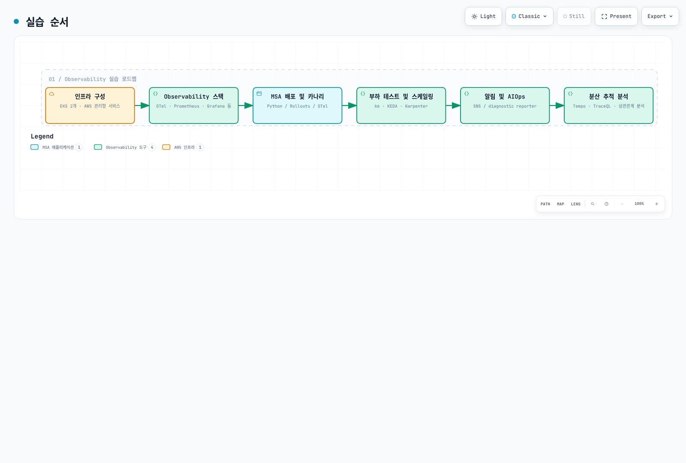
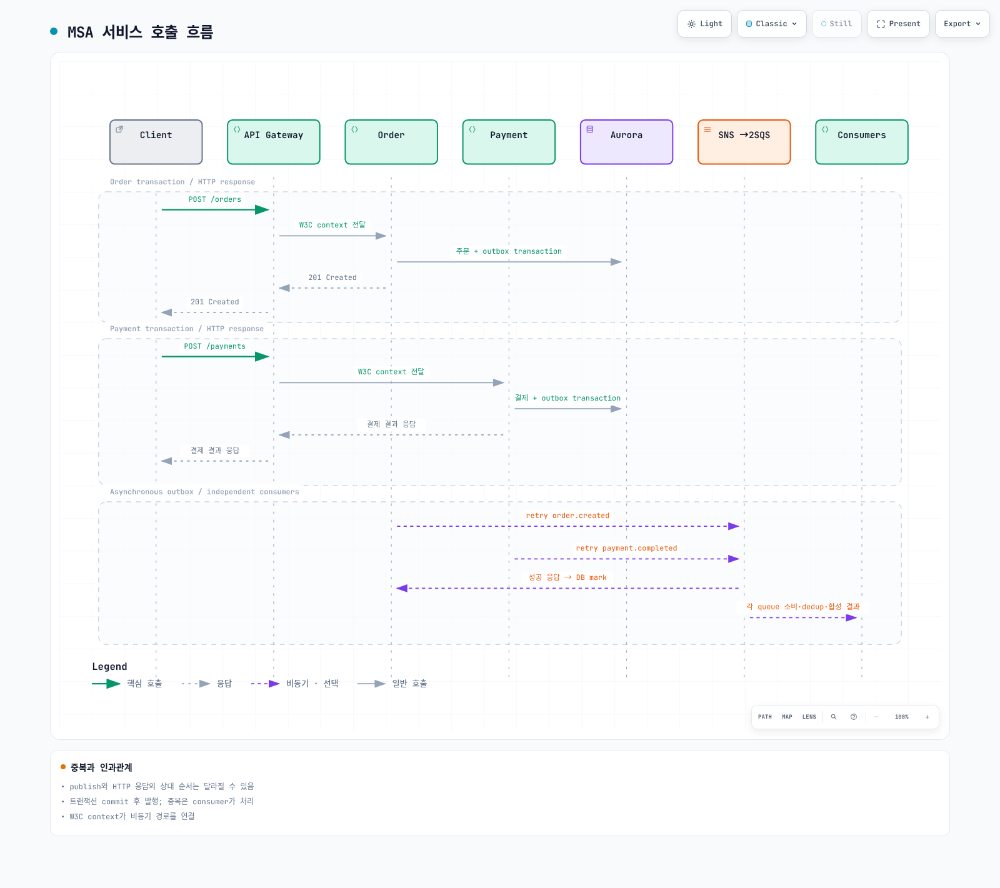
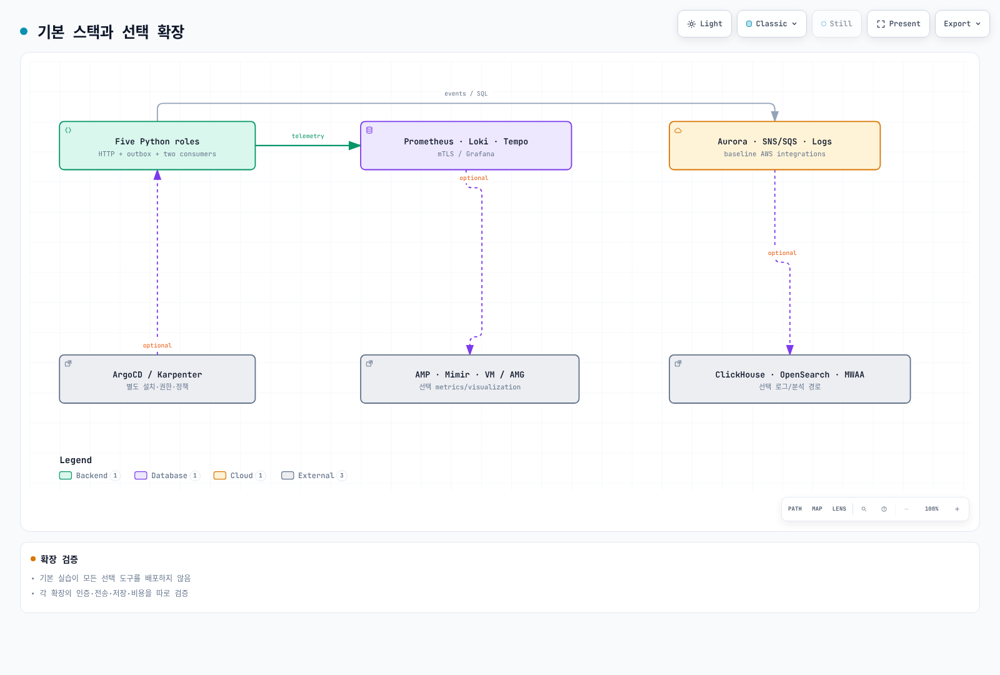

# Observability 실습 시리즈

> **난이도**: 고급
> **마지막 업데이트**: 2026년 9월 13일
두 EKS 클러스터에서 실제 실행 가능한 합성 주문 애플리케이션과 metrics·logs·traces 경로를 연결합니다. 기본 backend는 Prometheus·Loki·Tempo·Grafana이며 AWS SNS/SQS·Aurora·CloudWatch와 연동합니다. 실습 설정과 운영 HA/용량 검증을 구분합니다.

[🔍 인터랙티브 다이어그램 보기](https://www.atomai.click/kubernetes-docs/archmaps/ko-labs-observability-overview-0.html)

## 준비 사항 {#prerequisites}

승인된 임시 AWS 역할, 검토한 private VPC/subnet·route·DNS·SG, EBS CSI/gp3, NetworkPolicy 지원 CNI와 AWS Load Balancer Controller가 필요합니다. 모든 서비스 FullAccess나 장기 access key를 요구하지 않습니다. 버전·권한·할당량은 각 단계에서 다시 확인합니다.

| Tool | Reviewed baseline |
|---|---|
| EKS / kubectl | 1.36 / 1.36.2 |
| eksctl / Helm | 0.229.0 / 3.21.3 |
| Python / AWS CLI | 3.12 / v2 |
| k6 / Locust | 2.2.0 / 2.46.5 |
| Application / controllers | Pinned requirements, image digest and chart versions in examples |

## 실행 코드와 순서 {#sequence}

[application](https://github.com/Atom-oh/kubernetes-docs/tree/main/examples/labs/observability/application), [stack](https://github.com/Atom-oh/kubernetes-docs/tree/main/examples/labs/observability/stack), [load-test](https://github.com/Atom-oh/kubernetes-docs/tree/main/examples/labs/observability/load-test), [aiops](https://github.com/Atom-oh/kubernetes-docs/tree/main/examples/labs/observability/aiops) 예제를 함께 사용합니다. 존재하지 않는 example 저장소를 clone하지 않습니다. 검토한 commit/tag를 고정하고 private LAB_STATE를 보관합니다.

[🔍 인터랙티브 다이어그램 보기](https://www.atomai.click/kubernetes-docs/archmaps/ko-labs-observability-overview-2.html)

| Part | 단계 | 결과 |
|---|---|---|
| 1 | [인프라 구성](01-infrastructure-setup-lab.md) | EKS, private DB, SNS fanout, scoped roles |
| 2 | [관측 스택](02-observability-stack-lab.md) | mTLS collectors/remote-write, Loki/Tempo/Grafana |
| 3 | [MSA·카나리](03-msa-deployment-lab.md) | Five runnable roles, outbox, revision-only analysis |
| 4 | [부하·스케일링](04-load-testing-scaling-lab.md) | Measured requests and consumer/node observations |
| 5 | [알림·AIOps](05-alerting-aiops-lab.md) | Separate-topic diagnostic reporter, human review |
| 6 | [분산 추적](06-distributed-tracing-lab.md) | Actual metric/exemplar/trace/log correlation, cleanup |

## 애플리케이션과 데이터 흐름 {#application}

Python 애플리케이션 이미지 하나를 api-gateway, order-service, payment-service, notification, analytics 역할로 별도 배포합니다. 결제·알림은 합성 결과이며 실제 결제/이메일/SMS를 실행하지 않습니다. 주문과 outbox는 같은 transaction, notification/analytics는 각자 queue와 event-ID dedup을 사용합니다. gateway 인증·일반 rate limiting·실제 결제 gateway를 구현했다고 주장하지 않습니다.

[🔍 인터랙티브 다이어그램 보기](https://www.atomai.click/kubernetes-docs/archmaps/ko-labs-observability-overview-3.html)

## 기본 범위와 선택 확장 {#coverage}

[🔍 인터랙티브 다이어그램 보기](https://www.atomai.click/kubernetes-docs/archmaps/ko-labs-observability-overview-1.html)

| Baseline | Optional separate integration |
|---|---|
| Prometheus / CloudWatch metrics | VictoriaMetrics, Mimir, AMP |
| Loki / CloudWatch Logs | ClickHouse, OpenSearch |
| OTel / Tempo | X-Ray, Dynatrace |
| Grafana | Amazon Managed Grafana, commercial tools |
| Alertmanager / SNS / diagnostic Lambda | Existing on-call platform, CloudWatch Investigations group |
| Synthetic event consumers | MWAA scheduling/batch analytics, production transaction systems |

선택 도구를 설치했다는 사실과 실제 수집·조회·권한·비용 검증은 다릅니다. [metrics](../../observability/metrics/README.md), [logging](../../observability/logging/README.md), [tracing](../../observability/tracing/README.md), [Grafana](../../observability/grafana/README.md) 문서에서 해당 확장을 검토합니다. OnCall OSS 보관 처리 등 변경 사항은 Part5에 반영했습니다.

## 비용·검증·정리 {#cost-and-cleanup}

리전·노드·NAT·EBS·Aurora ACU/storage/I/O·로그 수집/보존·메시지·KMS·LB·전송·모델 호출을 실제 사용량으로 산정합니다. 월별 사용자 과금과 시간별 인프라 비용을 섞은 고정 총액은 제공하지 않습니다. 단일 writer/backend 실습은 production-grade HA가 아니며 replica 증가가 비용 상한을 보장하지 않습니다.

로컬 native/SDK/schema/브라우저 검증과 실제 AWS 실습 결과를 구분합니다. 생성한 리소스·IAM attachment·snapshot·DNS·LB/PVC를 inventory에 기록하고 Part6의 의존성 순서로 정리합니다. 실패를 모두 무시하거나 cluster부터 지워 리소스를 남기지 않습니다.
