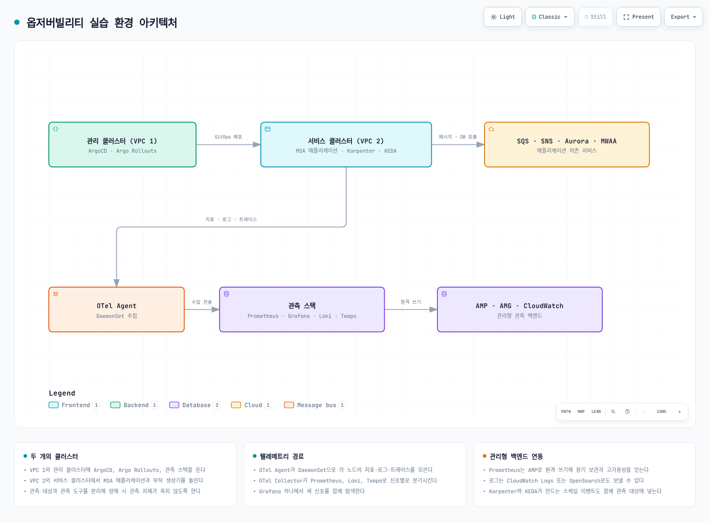
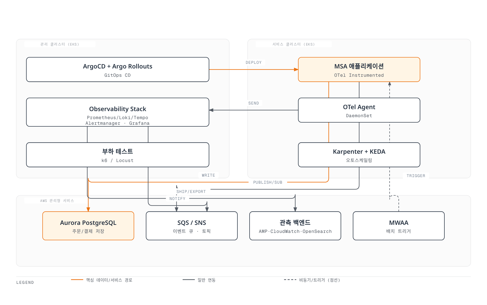
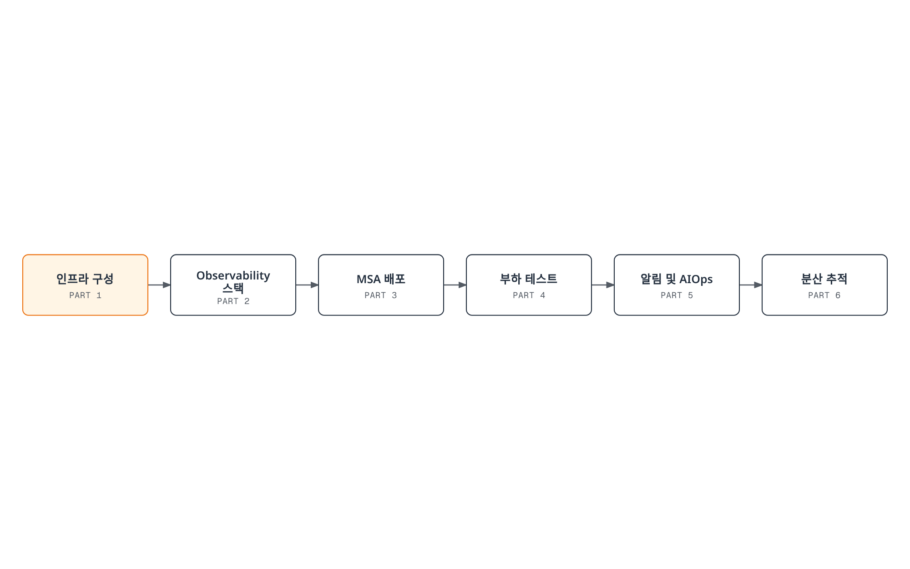
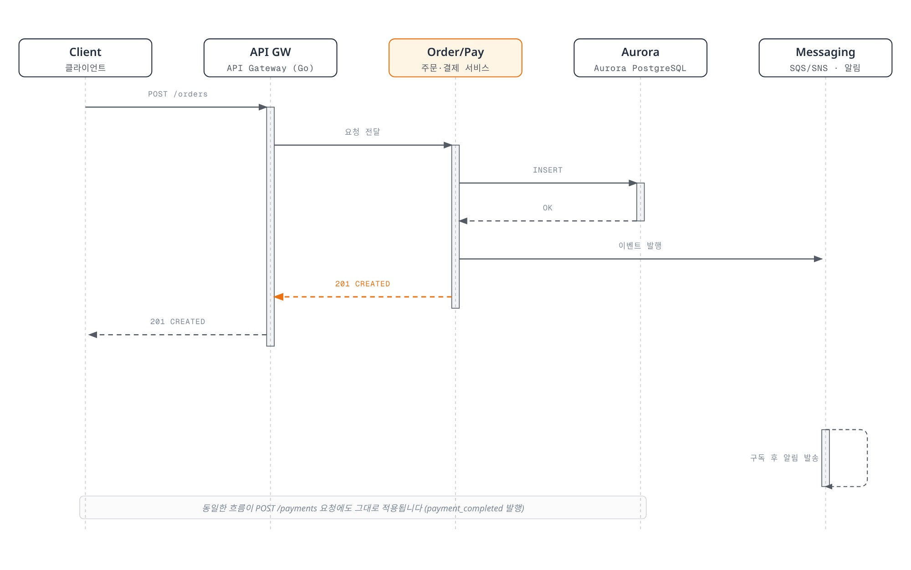

# 실습 시리즈 소개

> **난이도**: 고급 (Advanced) **마지막 업데이트**: 2026년 2월 23일

## 개요

이 실습 시리즈는 2개의 EKS 클러스터(Managed Cluster + Service Cluster)와 AWS Managed Services를 기반으로 한 **Full-Stack Observability** 환경을 구축합니다. 메트릭, 로그, 트레이스의 3대 축을 중심으로 실제 운영 환경에서 필요한 모든 Observability 컴포넌트를 직접 배포하고 연동합니다.

### 아키텍처 개요



[🔍 인터랙티브 다이어그램 보기](https://www.atomai.click/kubernetes-docs/archmaps/ko-labs-observability-overview-0.html)



***

## 사전 요구 사항

실습을 시작하기 전에 다음 도구와 환경이 준비되어 있어야 합니다.

| 항목        | 버전      | 확인 명령어                     |
| --------- | ------- | -------------------------- |
| AWS 계정    | -       | AWS Console 로그인 가능         |
| AWS CLI   | v2.x    | `aws --version`            |
| eksctl    | v0.170+ | `eksctl version`           |
| kubectl   | v1.28+  | `kubectl version --client` |
| Helm      | v3.14+  | `helm version`             |
| Terraform | v1.7+   | `terraform version`        |
| k6        | v0.50+  | `k6 version`               |
| Docker    | v24+    | `docker --version`         |
| Git       | v2.x    | `git --version`            |

### 환경 확인 스크립트

```bash
#!/bin/bash
echo "=== Observability Lab Prerequisites Check ==="

# AWS CLI
echo -n "AWS CLI: "
aws --version 2>/dev/null || echo "NOT INSTALLED"

# eksctl
echo -n "eksctl: "
eksctl version 2>/dev/null || echo "NOT INSTALLED"

# kubectl
echo -n "kubectl: "
kubectl version --client --short 2>/dev/null || echo "NOT INSTALLED"

# Helm
echo -n "Helm: "
helm version --short 2>/dev/null || echo "NOT INSTALLED"

# Terraform
echo -n "Terraform: "
terraform version -json 2>/dev/null | jq -r '.terraform_version' || echo "NOT INSTALLED"

# k6
echo -n "k6: "
k6 version 2>/dev/null || echo "NOT INSTALLED"

# Docker
echo -n "Docker: "
docker --version 2>/dev/null || echo "NOT INSTALLED"

# AWS Credentials
echo -n "AWS Credentials: "
aws sts get-caller-identity --query "Account" --output text 2>/dev/null && echo "OK" || echo "NOT CONFIGURED"
```

***

## 비용 안내

이 실습에서 사용하는 AWS 리소스의 예상 시간당 비용입니다 (us-east-1 기준).

| 서비스                       | 구성                            | 예상 시간당 비용               |
| ------------------------- | ----------------------------- | ----------------------- |
| EKS Cluster (x2)          | 2 clusters                    | $0.20                   |
| EC2 (Managed Cluster)     | 3x m5.large                   | $0.288                  |
| EC2 (Service Cluster)     | 3x m5.large + Karpenter nodes | $0.288 \~ $0.576        |
| Aurora PostgreSQL         | db.r5.large, Multi-AZ         | $0.48                   |
| OpenSearch                | 3x m5.large.search            | $0.52                   |
| Amazon Managed Prometheus | 기본 사용량                        | $0.03                   |
| Amazon Managed Grafana    | 1 workspace                   | $0.15                   |
| MWAA (Airflow)            | mw1.small                     | $0.49                   |
| SQS/SNS                   | 사용량 기반                        | \~$0.01                 |
| NAT Gateway (x2)          | 2 VPCs                        | $0.09                   |
| **총 예상 비용**               | -                             | **\~$2.50 \~ $3.00/시간** |

> **주의**: 실습 완료 후 반드시 리소스를 정리하여 불필요한 비용이 발생하지 않도록 합니다. 전체 실습 완료 시 약 **$15 \~ $25** 정도의 비용이 발생할 수 있습니다.

***

## 실습 순서



| Part                                     | 제목                  | 소요 시간 | 주요 내용                                           |
| ---------------------------------------- | ------------------- | ----- | ----------------------------------------------- |
| [Part 1](01-infrastructure-setup-lab.md) | 인프라 구성              | 60분   | EKS 클러스터 2개, AWS Managed Services 프로비저닝         |
| [Part 2](02-observability-stack-lab.md)  | Observability 스택 배포 | 90분   | OTel, Prometheus, Loki, Tempo, Grafana 등        |
| [Part 3](03-msa-deployment-lab.md)       | MSA 배포 및 카나리        | 60분   | ArgoCD, Argo Rollouts, OTel Instrumentation     |
| [Part 4](04-load-testing-scaling-lab.md) | 부하 테스트 및 스케일링       | 45분   | k6, KEDA, Karpenter 연동                          |
| [Part 5](05-alerting-aiops-lab.md)       | 알림 및 AIOps          | 60분   | AlertManager, Grafana OnCall, CW Investigations |
| [Part 6](06-distributed-tracing-lab.md)  | 분산 추적 분석            | 45분   | Tempo, TraceQL, 메트릭-로그-트레이스 상관관계                |

***

## MSA 애플리케이션 구성

실습에서 배포할 MSA 애플리케이션은 5개의 마이크로서비스로 구성됩니다.

| 서비스                      | 언어/프레임워크           | 역할                         | 의존성                            |
| ------------------------ | ------------------ | -------------------------- | ------------------------------ |
| **api-gateway**          | Go / Gin           | API 라우팅, 인증, Rate Limiting | order-service, payment-service |
| **order-service**        | Python / FastAPI   | 주문 생성, 조회, 상태 관리           | Aurora PostgreSQL, SQS         |
| **payment-service**      | Java / Spring Boot | 결제 처리, 결제 상태 관리            | Aurora PostgreSQL, SNS         |
| **notification-service** | Node.js / Express  | 알림 발송 (이메일, SMS)           | SQS (Consumer)                 |
| **analytics-batch**      | Python / Pandas    | 일별 분석 리포트 생성               | Aurora PostgreSQL, MWAA        |

### MSA 서비스 호출 흐름



***

## Observability 도구 커버리지

이 실습에서 다루는 Observability 도구 목록입니다.

| 카테고리              | 도구                              | 유형           | 실습 포함   |
| ----------------- | ------------------------------- | ------------ | ------- |
| **Metrics**       | Prometheus                      | Self-managed | O       |
|                   | VictoriaMetrics                 | Self-managed | O       |
|                   | Mimir                           | Self-managed | O       |
|                   | Amazon Managed Prometheus (AMP) | AWS Managed  | O       |
|                   | CloudWatch Metrics              | AWS Managed  | O       |
| **Logging**       | Loki                            | Self-managed | O       |
|                   | ClickHouse                      | Self-managed | O       |
|                   | OpenSearch                      | AWS Managed  | O       |
|                   | CloudWatch Logs                 | AWS Managed  | O       |
| **Tracing**       | Tempo                           | Self-managed | O       |
|                   | OpenTelemetry Collector         | CNCF         | O       |
|                   | AWS X-Ray                       | AWS Managed  | O       |
| **Alerting**      | Alertmanager                    | Self-managed | O       |
|                   | Grafana OnCall                  | Self-managed | O       |
|                   | CloudWatch Alarms               | AWS Managed  | O       |
| **Visualization** | Grafana                         | Self-managed | O       |
|                   | Amazon Managed Grafana (AMG)    | AWS Managed  | O       |
| **상용 SaaS**       | Datadog                         | 상용           | X (미포함) |
|                   | Dynatrace                       | 상용           | X (미포함) |
|                   | New Relic                       | 상용           | X (미포함) |

***

## 참고할 기존 문서

실습을 진행하기 전에 다음 이론 문서를 참고하면 도움이 됩니다.

### Observability 기초

* [Prometheus 기초](../../observability/metrics/01-prometheus.md)
* [Grafana 대시보드](../../observability/grafana/README.md)
* [Logging Stack 개요](../../observability/logging/README.md)

### EKS 및 인프라

* [EKS 클러스터 생성](../../eks/02-eks-cluster-creation-part1.md)
* [Karpenter 오토스케일링](../../autoscaling/02-karpenter.md)
* [KEDA 이벤트 기반 스케일링](../../autoscaling/01-keda.md)

### GitOps 및 배포

* [ArgoCD 설치](../../gitops/argocd/01-installation.md)
* [트래픽 관리](../../gitops/argocd/05-traffic-management.md)

### 서비스 메시 및 네트워킹

* [Cilium CNI](../../networking/cilium/01-introduction.md)
* [OpenTelemetry 기초](../../observability/tracing/03-opentelemetry.md)

***

## 실습 시작하기

모든 사전 요구 사항이 준비되었다면, [Part 1: 인프라 구성](01-infrastructure-setup-lab.md)부터 시작하세요.

```bash
# 실습 디렉토리 생성
mkdir -p ~/observability-lab
cd ~/observability-lab

# Git 저장소 클론 (실습 코드)
git clone https://github.com/example/observability-lab-code.git
cd observability-lab-code
```

> **Tip**: 각 Part는 이전 Part의 결과물을 기반으로 진행됩니다. 순서대로 진행하는 것을 권장합니다.
