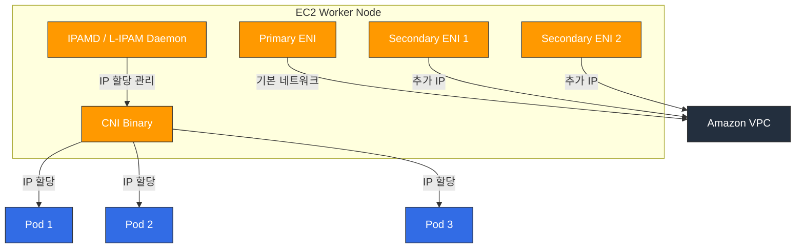

# Amazon VPC CNI

> **지원 버전**: VPC CNI v1.19+, EKS 1.25+
> **마지막 업데이트**: 2026년 2월 22일

## 목차
- [VPC CNI 개요](#vpc-cni-개요)
- [네트워킹 모델](#네트워킹-모델)
- [설치 및 구성](#설치-및-구성)
- [IP 주소 관리](#ip-주소-관리)
- [Network Policy 지원](#network-policy-지원)
- [고급 기능](#고급-기능)
- [트러블슈팅](#트러블슈팅)
- [모범 사례](#모범-사례)

## VPC CNI 개요

Amazon VPC CNI(Container Network Interface)는 Amazon EKS의 기본 네트워킹 플러그인입니다. 각 Pod에 VPC 서브넷의 실제 IP 주소를 할당하여 Pod가 VPC 네트워크에서 네이티브하게 통신할 수 있도록 합니다.

### 핵심 특징

1. **네이티브 VPC 네트워킹**: Pod가 VPC의 실제 IP를 사용하여 오버레이 네트워크 없이 통신
2. **AWS 서비스 통합**: Security Group, VPC Flow Logs, 라우팅 테이블 등 AWS 네트워킹 기능과 직접 통합
3. **고성능**: 오버레이 오버헤드 없이 네이티브 네트워크 성능 제공
4. **IPv4/IPv6 듀얼 스택**: IPv4 및 IPv6 네트워킹 모두 지원

### 아키텍처

VPC CNI는 두 가지 주요 구성 요소로 이루어져 있습니다:



1. **IPAMD (L-IPAM Daemon)**: 각 노드에서 실행되는 데몬으로, ENI와 IP 주소를 사전 할당하고 관리
2. **CNI Binary**: kubelet이 호출하는 CNI 플러그인으로, IPAMD에서 IP를 할당받아 Pod 네트워크 네임스페이스를 설정

### IP 할당 방식

VPC CNI는 두 가지 IP 할당 모드를 지원합니다:

| 특성 | Secondary IP 모드 | Prefix Delegation 모드 |
|------|-------------------|----------------------|
| 할당 단위 | 개별 IP 주소 | /28 IPv4 접두사 (16 IPs) |
| IP 효율성 | 중간 | 높음 |
| Pod 밀도 | ENI당 IP 수에 제한 | 더 높은 Pod 밀도 |
| 지원 시작 | 초기 버전 | v1.9+ |
| 권장 환경 | 소규모 클러스터 | 대규모 클러스터 |

## 네트워킹 모델

### ENI 아키텍처

각 EC2 인스턴스는 하나 이상의 ENI(Elastic Network Interface)를 가질 수 있으며, 각 ENI는 여러 개의 프라이빗 IP 주소를 할당받을 수 있습니다.

```
┌─────────────────────────────────────────────────┐
│                 EC2 Instance                      │
│                                                   │
│  ┌─────────────┐  ┌─────────────┐  ┌──────────┐ │
│  │ Primary ENI  │  │Secondary ENI│  │Secondary │ │
│  │ (eth0)       │  │ (eth1)      │  │ENI (eth2)│ │
│  │              │  │             │  │          │ │
│  │ Primary IP   │  │ IP 1→Pod A  │  │IP 1→PodD│ │
│  │ IP 1 → Pod X │  │ IP 2→Pod B  │  │IP 2→PodE│ │
│  │ IP 2 → Pod Y │  │ IP 3→Pod C  │  │IP 3→PodF│ │
│  └─────────────┘  └─────────────┘  └──────────┘ │
└─────────────────────────────────────────────────┘
```

### 인스턴스 유형별 ENI/IP 제한

| 인스턴스 유형 | 최대 ENI 수 | ENI당 IPv4 수 | 최대 Pod 수 |
|-------------|-----------|-------------|-----------|
| t3.medium | 3 | 6 | 17 |
| t3.large | 3 | 12 | 35 |
| m5.large | 3 | 10 | 29 |
| m5.xlarge | 4 | 15 | 58 |
| m5.2xlarge | 4 | 15 | 58 |
| c5.4xlarge | 8 | 30 | 234 |
| m5.8xlarge | 8 | 30 | 234 |

> **참고**: 최대 Pod 수 = (ENI 수 × ENI당 IP 수) - ENI 수. Primary IP는 노드에 사용됩니다.

### Prefix Delegation (IPv4/IPv6)

Prefix Delegation 모드에서는 개별 IP 대신 /28 IPv4 접두사(16개 IP)를 ENI에 할당합니다:

```bash
# Prefix Delegation 활성화
kubectl set env daemonset aws-node -n kube-system ENABLE_PREFIX_DELEGATION=true

# 또는 EKS 애드온 구성에서
aws eks create-addon \
  --cluster-name my-cluster \
  --addon-name vpc-cni \
  --configuration-values '{"env":{"ENABLE_PREFIX_DELEGATION":"true"}}'
```

Prefix Delegation의 이점:
- **더 높은 Pod 밀도**: /28 접두사당 16개 IP를 할당하여 노드당 Pod 수 대폭 증가
- **IP 할당 속도 향상**: 한 번의 API 호출로 16개 IP를 확보
- **Nitro 인스턴스 최적화**: Nitro 기반 인스턴스에서 최적의 성능

## 설치 및 구성

### EKS 애드온으로 설치

```bash
# VPC CNI 애드온 설치 (최신 버전)
aws eks create-addon \
  --cluster-name my-cluster \
  --addon-name vpc-cni \
  --resolve-conflicts OVERWRITE

# 애드온 상태 확인
aws eks describe-addon \
  --cluster-name my-cluster \
  --addon-name vpc-cni

# 애드온 버전 업데이트
aws eks update-addon \
  --cluster-name my-cluster \
  --addon-name vpc-cni \
  --addon-version v1.19.0-eksbuild.1
```

### Helm 차트 설치

```bash
# Helm 리포지토리 추가
helm repo add eks https://aws.github.io/eks-charts

# 설치
helm install aws-vpc-cni eks/aws-vpc-cni \
  --namespace kube-system \
  --set init.image.tag=v1.19.0 \
  --set image.tag=v1.19.0
```

### 주요 환경 변수

| 환경 변수 | 설명 | 기본값 |
|----------|------|--------|
| `WARM_IP_TARGET` | 사전 할당할 여유 IP 수 | 미설정 |
| `MINIMUM_IP_TARGET` | 노드에서 유지할 최소 IP 수 | 미설정 |
| `WARM_ENI_TARGET` | 사전 할당할 여유 ENI 수 | 1 |
| `WARM_PREFIX_TARGET` | 사전 할당할 여유 접두사 수 | 미설정 |
| `ENABLE_PREFIX_DELEGATION` | Prefix Delegation 활성화 | false |
| `AWS_VPC_K8S_CNI_CUSTOM_NETWORK_CFG` | Custom Networking 활성화 | false |
| `ENI_CONFIG_LABEL_DEF` | ENIConfig 선택 레이블 | 미설정 |
| `ENABLE_POD_ENI` | Pod별 Security Group 활성화 | false |
| `POD_SECURITY_GROUP_ENFORCING_MODE` | Security Group 적용 모드 | strict |

### Custom Networking (ENIConfig)

Custom Networking을 사용하면 Pod에 노드와 다른 서브넷의 IP를 할당할 수 있습니다:

```yaml
apiVersion: crd.k8s.amazonaws.com/v1alpha1
kind: ENIConfig
metadata:
  name: ap-northeast-2a
spec:
  subnet: subnet-0123456789abcdef0
  securityGroups:
    - sg-0123456789abcdef0
---
apiVersion: crd.k8s.amazonaws.com/v1alpha1
kind: ENIConfig
metadata:
  name: ap-northeast-2b
spec:
  subnet: subnet-0abcdef0123456789
  securityGroups:
    - sg-0123456789abcdef0
```

```bash
# Custom Networking 활성화
kubectl set env daemonset aws-node -n kube-system AWS_VPC_K8S_CNI_CUSTOM_NETWORK_CFG=true
kubectl set env daemonset aws-node -n kube-system ENI_CONFIG_LABEL_DEF=topology.kubernetes.io/zone
```

## IP 주소 관리

### WARM_IP_TARGET 튜닝

`WARM_IP_TARGET`은 노드에서 사전 할당하여 대기시킬 여유 IP 수를 제어합니다:

```bash
# 소규모 클러스터: 적은 여유 IP
kubectl set env daemonset aws-node -n kube-system WARM_IP_TARGET=2 MINIMUM_IP_TARGET=4

# 대규모 클러스터: 빠른 Pod 시작을 위해 더 많은 여유 IP
kubectl set env daemonset aws-node -n kube-system WARM_IP_TARGET=5 MINIMUM_IP_TARGET=10
```

### Secondary CIDR 추가

VPC의 기본 CIDR이 부족한 경우 Secondary CIDR을 추가할 수 있습니다:

```bash
# VPC에 Secondary CIDR 추가
aws ec2 associate-vpc-cidr-block \
  --vpc-id vpc-0123456789abcdef0 \
  --cidr-block 100.64.0.0/16

# Secondary CIDR용 서브넷 생성
aws ec2 create-subnet \
  --vpc-id vpc-0123456789abcdef0 \
  --cidr-block 100.64.0.0/19 \
  --availability-zone ap-northeast-2a
```

### IPv6 클러스터 구성

```bash
# IPv6 EKS 클러스터 생성
eksctl create cluster \
  --name ipv6-cluster \
  --version 1.28 \
  --ip-family ipv6
```

## Network Policy 지원

### VPC CNI 네이티브 Network Policy (v1.14+)

VPC CNI v1.14부터 eBPF 기반의 네이티브 Network Policy를 지원합니다:

```bash
# Network Policy 활성화
aws eks create-addon \
  --cluster-name my-cluster \
  --addon-name vpc-cni \
  --configuration-values '{"enableNetworkPolicy":"true"}'
```

### Network Policy 예시

```yaml
apiVersion: networking.k8s.io/v1
kind: NetworkPolicy
metadata:
  name: allow-frontend-to-backend
  namespace: app
spec:
  podSelector:
    matchLabels:
      app: backend
  policyTypes:
    - Ingress
  ingress:
    - from:
        - podSelector:
            matchLabels:
              app: frontend
      ports:
        - protocol: TCP
          port: 8080
```

### Network Policy 확인

```bash
# Network Policy 컨트롤러 로그 확인
kubectl logs -n kube-system -l k8s-app=aws-node -c aws-network-policy-agent

# Network Policy 목록 확인
kubectl get networkpolicy -A

# eBPF 정책 맵 확인
kubectl exec -n kube-system ds/aws-node -c aws-node -- ebpf-sdk list-maps
```

## 고급 기능

### Pod별 Security Group

개별 Pod에 AWS Security Group을 직접 할당할 수 있습니다:

```yaml
apiVersion: vpcresources.k8s.aws/v1beta1
kind: SecurityGroupPolicy
metadata:
  name: my-security-group-policy
  namespace: app
spec:
  podSelector:
    matchLabels:
      app: database
  securityGroups:
    groupIds:
      - sg-0123456789abcdef0
      - sg-0abcdef0123456789
```

```bash
# Pod Security Group 활성화
kubectl set env daemonset aws-node -n kube-system ENABLE_POD_ENI=true
```

### Trunk ENI / Branch ENI

Pod별 Security Group은 Trunk ENI와 Branch ENI 아키텍처를 사용합니다:

- **Trunk ENI**: 노드의 메인 ENI로 Branch ENI를 수용
- **Branch ENI**: 각 Pod에 할당되는 가상 ENI로 독립적인 Security Group 적용

### Multus CNI 연동

VPC CNI를 기본 CNI로 사용하면서 Multus를 통해 추가 네트워크 인터페이스를 구성할 수 있습니다:

```yaml
apiVersion: k8s.cni.cncf.io/v1
kind: NetworkAttachmentDefinition
metadata:
  name: ipvlan-conf
spec:
  config: |
    {
      "cniVersion": "0.3.1",
      "type": "ipvlan",
      "master": "eth1",
      "mode": "l2",
      "ipam": {
        "type": "host-local",
        "subnet": "192.168.1.0/24"
      }
    }
```

### Windows 노드 지원

VPC CNI는 Windows 노드에서도 사용 가능합니다:

```bash
# Windows 노드 그룹 생성
eksctl create nodegroup \
  --cluster my-cluster \
  --name windows-ng \
  --node-type m5.large \
  --nodes 2 \
  --node-ami-family WindowsServer2022FullContainer
```

## 트러블슈팅

### IP 고갈 대응

**증상**: Pod가 `Pending` 상태에서 머무르며 IP 할당 실패

```bash
# IPAMD 로그 확인
kubectl logs -n kube-system -l k8s-app=aws-node -c aws-node | grep -i "insufficient"

# 노드별 IP 사용량 확인
kubectl get nodes -o json | jq '.items[] | {name: .metadata.name, allocatable_pods: .status.allocatable.pods}'

# 서브넷 가용 IP 확인
aws ec2 describe-subnets --subnet-ids subnet-xxx --query 'Subnets[].AvailableIpAddressCount'
```

**해결 방법**:
1. Prefix Delegation 활성화로 Pod 밀도 증가
2. Secondary CIDR 추가로 IP 풀 확장
3. Custom Networking으로 전용 Pod 서브넷 사용
4. `WARM_IP_TARGET` 조정으로 IP 사전 할당 최적화

### ENI 제한 초과

**증상**: `ENI limit reached` 오류

```bash
# 노드의 ENI 수 확인
aws ec2 describe-instances --instance-ids i-xxx \
  --query 'Reservations[].Instances[].NetworkInterfaces | length(@)'

# 인스턴스 유형별 ENI 제한 확인
aws ec2 describe-instance-types --instance-types m5.large \
  --query 'InstanceTypes[].NetworkInfo.{MaxENI: MaximumNetworkInterfaces, IPv4PerENI: Ipv4AddressesPerInterface}'
```

### IPAMD 로그 분석

```bash
# IPAMD 로그 실시간 확인
kubectl logs -n kube-system -l k8s-app=aws-node -c aws-node -f

# IP 할당 관련 이벤트 필터링
kubectl logs -n kube-system -l k8s-app=aws-node -c aws-node | grep -E "(allocated|freed|assigned)"

# IPAMD 메트릭 확인
kubectl exec -n kube-system ds/aws-node -c aws-node -- curl http://localhost:61678/v1/enis
```

### 일반적 오류 및 해결 방법

| 오류 | 원인 | 해결 방법 |
|------|------|----------|
| `InsufficientFreeAddressesInSubnet` | 서브넷 IP 부족 | Secondary CIDR 추가 또는 Prefix Delegation 활성화 |
| `SecurityGroupLimitExceeded` | Security Group 수 초과 | 불필요한 SG 정리 또는 SG 통합 |
| `ENI limit reached` | ENI 수 초과 | 더 큰 인스턴스 유형 사용 |
| `Failed to create ENI` | IAM 권한 부족 | 노드 역할에 ENI 생성 권한 추가 |
| `Timeout waiting for pod IP` | IPAMD 지연 | IPAMD 재시작 및 로그 확인 |

## 모범 사례

### 서브넷 CIDR 계획

1. **충분한 서브넷 크기 확보**: /19 이상의 서브넷 사용 권장
2. **AZ별 서브넷 분리**: 각 가용 영역에 별도의 Pod 서브넷 할당
3. **100.64.0.0/10 대역 활용**: RFC 6598 주소 공간을 Pod용으로 사용

```
VPC CIDR: 10.0.0.0/16
├── 10.0.0.0/19   - 노드 서브넷 (AZ-a)
├── 10.0.32.0/19  - 노드 서브넷 (AZ-b)
├── 10.0.64.0/19  - 노드 서브넷 (AZ-c)
└── Secondary CIDR: 100.64.0.0/16
    ├── 100.64.0.0/19  - Pod 서브넷 (AZ-a)
    ├── 100.64.32.0/19 - Pod 서브넷 (AZ-b)
    └── 100.64.64.0/19 - Pod 서브넷 (AZ-c)
```

### Prefix Delegation 권장 설정

```bash
kubectl set env daemonset aws-node -n kube-system \
  ENABLE_PREFIX_DELEGATION=true \
  WARM_PREFIX_TARGET=1 \
  WARM_IP_TARGET=5 \
  MINIMUM_IP_TARGET=2
```

### 대규모 클러스터 최적화

1. **Prefix Delegation 필수**: 대규모 환경에서 IP 효율성 극대화
2. **Custom Networking 사용**: 노드와 Pod에 별도의 서브넷 할당
3. **WARM_IP_TARGET 조정**: Pod 스케줄링 지연 최소화
4. **모니터링 설정**: IP 사용률 모니터링 및 알림 구성

```yaml
# IP 사용률 모니터링 Prometheus 규칙
apiVersion: monitoring.coreos.com/v1
kind: PrometheusRule
metadata:
  name: vpc-cni-alerts
spec:
  groups:
    - name: vpc-cni
      rules:
        - alert: HighIPUtilization
          expr: awscni_assigned_ip_addresses / awscni_total_ip_addresses > 0.9
          for: 5m
          labels:
            severity: warning
          annotations:
            summary: "VPC CNI IP utilization is above 90%"
```

## 참고 자료

- [AWS VPC CNI 공식 문서](https://docs.aws.amazon.com/eks/latest/userguide/managing-vpc-cni.html)
- [VPC CNI GitHub 저장소](https://github.com/aws/amazon-vpc-cni-k8s)
- [EKS Best Practices - Networking](https://aws.github.io/aws-eks-best-practices/networking/)
- [Prefix Delegation 가이드](https://docs.aws.amazon.com/eks/latest/userguide/cni-increase-ip-addresses.html)
- [Security Groups for Pods](https://docs.aws.amazon.com/eks/latest/userguide/security-groups-for-pods.html)

## 퀴즈

이 장에서 배운 내용을 테스트하려면 [VPC CNI 퀴즈](../quizzes/networking/01-vpc-cni-quiz.md)를 풀어보세요.
