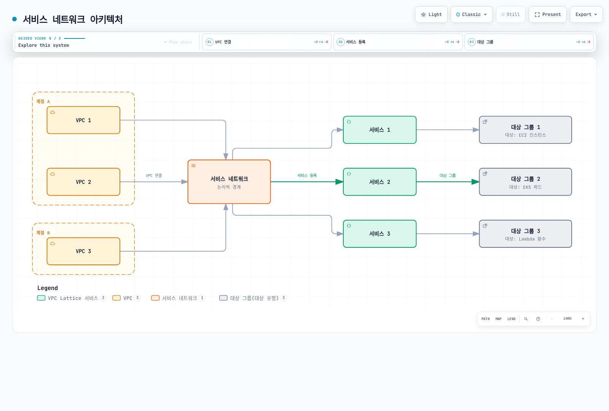

# VPC Lattice

Amazon VPC Lattice는 VPC와 AWS 계정 간 애플리케이션을 연결합니다. 이 문서는 리소스 모델, EKS 연동, 라우팅, IAM 인가, 모니터링과 문제 해결을 설명합니다.

> 2026-09-11에 AWS Gateway API Controller **v2.1.3**과 Gateway API **v1.5.0**을 기준으로 검토했습니다. 예제는 구성 및 검증 절차를 설명하며, 이번 검토에서 실제 AWS 계정에 배포하지는 않았습니다.

## 목차

- [개요](#개요)
- [아키텍처](#아키텍처)
- [EKS와 VPC Lattice 통합](#eks와-vpc-lattice-통합)
- [설치 및 구성](#설치-및-구성)
- [서비스 관리](#서비스-관리)
- [라우팅 및 트래픽 관리](#라우팅-및-트래픽-관리)
- [보안 및 인증](#보안-및-인증)
- [모니터링 및 로깅](#모니터링-및-로깅)
- [모범 사례](#모범-사례)
- [문제 해결](#문제-해결)
- [참고 자료](#참고-자료)

## 개요

### VPC Lattice란?

VPC Lattice는 각 애플리케이션 옆에 프록시를 배치하지 않아도 애플리케이션 네트워킹을 제공합니다. **서비스 네트워크**는 서비스와 리소스 구성을 묶고 허용된 소비자와 연결합니다. 서비스는 리스너, 라우팅 규칙, 대상 그룹, 서비스 DNS 이름을 제공합니다.

현재 제품은 리소스 게이트웨이와 **리소스 구성(resource configuration)**을 통해 TCP를 사용하는 RDS 데이터베이스 같은 리소스도 연결합니다. 이 접근 모델은 대상 그룹을 사용하는 HTTP 서비스와 구분해야 합니다. 서비스 네트워크/서비스의 IAM 인증 정책은 리소스 구성 트래픽을 인가하지 않습니다. PrivateLink 기반 **서비스 네트워크 VPC 엔드포인트**를 사용하면 피어링, Transit Gateway, Direct Connect, VPN을 거치는 클라이언트에도 접근 경로를 제공할 수 있습니다. 직접 VPC 연결만으로는 Transit Gateway나 피어링 너머의 클라이언트까지 접근이 확장되지 않습니다.

대표적인 용도는 계정 간 애플리케이션 API, EKS와 다른 컴퓨팅 서비스 간 통신, 공유 데이터 리소스 접근입니다. 연결 관계, 라우팅, 보안 그룹, 인증과 애플리케이션 인가는 여전히 구성해야 합니다.

### 다른 서비스와 비교

| 서비스 | 주요 역할 | 구분할 점 |
|---|---|---|
| VPC Lattice | 프라이빗 애플리케이션 및 리소스 연결 | HTTP/HTTPS/gRPC 서비스 라우팅과 별도의 TLS/TCP 리소스 기능. 인터넷 API 진입점은 아님 |
| API Gateway | 관리형 API 엔드포인트와 API 관리 | REST, HTTP, WebSocket API의 기능이 다름. GraphQL은 API Gateway의 별도 API 유형이 아님 |
| AWS App Mesh | Envoy 기반 서비스 메시 | **2026-09-30** 지원 종료 예정. 검토일에는 아직 종료 전이며, 신규 설치보다 마이그레이션을 계획 |
| Transit Gateway | IP 라우팅을 통한 네트워크 연결 | 네트워크를 연결하며 서비스별 HTTP 라우팅과 인가를 대체하지 않음 |
| Istio / Linkerd / Cilium | 각 데이터 플레인으로 메시 기능 구현 | 기능과 운영 비용이 다르며, 모든 메시 아키텍처에 사이드카가 필수인 것은 아님 |

VPC Lattice의 관리형 데이터 플레인을 직접 운영할 필요는 없지만, 총비용 절감이나 다른 메시와 동일한 기능을 보장하지는 않습니다. 실제 워크로드의 요청·데이터·리소스 요금, 컨트롤러 운영, 신원 요구사항, 재시도, 라우팅과 관측성을 비교하세요. [Istio–Lattice 비교](../service-mesh/istio/comparison/02-istio-vs-lattice.md)도 참고할 수 있습니다.

## 아키텍처

### 구성 요소와 트래픽 흐름

| 구성 요소 | 역할 |
|---|---|
| 서비스 네트워크 | 논리적 그룹과 연결 관계, 선택적으로 IAM 인가 경계 제공 |
| 서비스 | 고유 DNS 이름을 가진 애플리케이션 엔드포인트 |
| 리스너와 규칙 | **서비스**에 속하며 동작과 대상 그룹을 선택 |
| 대상 그룹 | 등록한 인스턴스, IP, Lambda, ALB 대상. 대상 유형별 동작이 다름 |
| VPC 연결 | 보안 제어를 충족하는 연결 VPC의 클라이언트에 접근 경로 제공 |
| 서비스 네트워크 VPC 엔드포인트 | 지원되는 전이 네트워크/온프레미스 경로를 포함한 PrivateLink 기반 접근 |
| 리소스 구성 / 리소스 게이트웨이 | TCP·데이터베이스 리소스 등을 위한 별도 접근 모델 |



[인터랙티브 다이어그램 보기](https://www.atomai.click/kubernetes-docs/archmaps/ko-networking-02-vpc-lattice-1.html)

그림은 하나의 라우터 프로세스가 아니라 논리적 연결 관계를 나타냅니다. 실제 접근에는 네트워크 도달성과 해당 정책도 필요합니다. 요청은 **서비스의** DNS 이름을 해석하고 리스너에 도착한 뒤, 적용되는 인가 검사를 통과하면 리스너 규칙에 따라 대상으로 전달됩니다. 대상 그룹은 목적지를 정의하는 리소스이며 또 하나의 애플리케이션 홉은 아닙니다.

실제 도메인은 `get-service --query dnsEntry` 또는 컨트롤러의 Route 어노테이션에서 조회하세요. 서비스 이름과 서비스 네트워크 ID로 직접 조합하지 마세요. 할당 이름에는 서비스별 식별자가 포함되며, 서비스를 재생성하면 달라질 수 있습니다.

### 보안 모델

네트워크 접근, IAM 인가와 암호화는 별도 제어입니다. `AWS_IAM`은 지원되는 서명 요청과 적절한 정책을 요구합니다. `NONE`은 해당 계층의 IAM 인증을 비활성화할 뿐 다른 계층의 IAM 정책, 보안 그룹이나 애플리케이션 인가를 우회하지 않습니다. HTTPS는 클라이언트와 Lattice 사이를 보호합니다. 백엔드 TLS를 명시적으로 설정하지 않으면 HTTP 백엔드 구간은 평문입니다.

## EKS와 VPC Lattice 통합

AWS Gateway API Controller는 Kubernetes 리소스를 VPC Lattice 리소스로 조정합니다.

| Kubernetes 리소스 | Lattice에서의 의미 |
|---|---|
| GatewayClass | `application-networking.k8s.aws/gateway-api-controller` 선택 |
| Gateway | 네임스페이스를 제외한 **Gateway 이름**으로 서비스 네트워크 참조 |
| HTTPRoute / GRPCRoute | 고유 도메인과 리스너·라우팅 구성을 가진 서비스 생성 |
| 백엔드 Service와 엔드포인트 | 대상 그룹 및 등록할 파드 엔드포인트 정의 |
| TargetGroupPolicy | 대상 그룹 프로토콜과 상태 검사 구성 |
| IAMAuthPolicy | Gateway의 네트워크 또는 Route의 서비스에 인증 정책 연결 |
| AccessLogPolicy | 대상 리소스의 액세스 로그 목적지 구성 |

Kubernetes 네임스페이스가 달라도 이름이 같은 Gateway는 같은 서비스 네트워크를 참조할 수 있습니다. Gateway만으로 네트워크나 공통 인그레스 IP가 생성되지는 않습니다. 네트워크를 외부에서 관리하거나, 단순한 구성에서는 컨트롤러의 `defaultServiceNetwork` 옵션을 사용하거나, 컨트롤러의 ServiceNetwork CRD로 관리할 수 있습니다. 클라우드 리소스마다 관리 주체를 하나로 정하세요.

아래 예제는 네트워크와 VPC 연결을 외부에서 관리합니다. `defaultServiceNetwork`는 설정하지 않고, 해당 연결에 VpcAssociationPolicy도 적용하지 않습니다. CRD 기반 모델을 선택한다면 네트워크, VPC 연결, 인가를 각각 별도 리소스로 관리하며 같은 리소스를 CloudFormation에서도 관리하지 마세요.

## 설치 및 구성

### 사전 요구사항

컨트롤러 v2.1 업그레이드 가이드는 **Kubernetes 1.31 이상**, **Gateway API 1.5 이상**을 요구합니다. 이 예제는 v2.1이 사용하는 **1.5.0**으로 고정합니다. 이 최소 버전은 EKS 지원 매트릭스도, 이후 모든 Gateway API 릴리스와의 호환성 증명도 아닙니다. 변경 전 EKS 버전 수명주기와 Gateway API CRD를 공유하는 모든 컨트롤러를 확인하세요. 특히 Gateway API 1.5의 TLSRoute 저장/API 버전 전환 후에는 v2.0 컨트롤러가 실패할 수 있습니다.

지원되는 EKS 클러스터, 버전이 맞는 `kubectl`, Helm, AWS CLI v2, 필요한 리소스를 구성할 운영자 권한을 준비합니다. 백엔드 예제는 VPC Lattice에서 IP로 도달 가능한 Linux 파드를 가정합니다. 클러스터의 CNI, 서브넷 용량, 엔드포인트 준비 상태, DNS와 네트워크 정책을 확인하세요.

```bash
export AWS_REGION=us-west-2
export CLUSTER_NAME=my-cluster
export AWS_ACCOUNT_ID="$(aws sts get-caller-identity --query Account --output text)"
export VPC_ID="$(aws eks describe-cluster --name "$CLUSTER_NAME" \
  --query 'cluster.resourcesVpcConfig.vpcId' --output text)"
export NETWORK_NAME=my-network
export ASSOCIATION_SG_ID=sg-0123456789abcdef0
kubectl config current-context
kubectl version
```

예시 보안 그룹 ID를 교체하세요. VPC 연결의 보안 그룹은 **허용된 클라이언트**의 TCP 443 접근을 허용해야 합니다. 백엔드 파드/노드 보안 그룹은 실제 백엔드·상태 검사 포트(여기서는 TCP 8080)에 대해 해당 Lattice 관리형 접두사 목록의 접근을 허용해야 합니다. 모든 노드가 EKS 클러스터 보안 그룹을 사용한다고 가정하지 말고 실제 파드 ENI나 노드 ENI의 그룹을 확인하세요. EKS 제어 플레인에서 컨트롤러 웹훅의 필요한 포트로도 접근할 수 있어야 합니다. 모든 포트를 인터넷 전체에 열지 마세요.

### IAM 역할 구성

**컨트롤러 역할**은 클라우드 리소스를 관리합니다. **호출자 역할**은 애플리케이션 요청에 서명하고 `vpc-lattice-svcs:Invoke` 권한을 사용합니다. 두 역할을 구분하세요.

지원되는 노드에서는 EKS Pod Identity를 사용하거나 IRSA를 사용할 수 있습니다. 아래 IRSA 예제는 클러스터의 IAM OIDC 공급자가 이미 존재한다고 가정하고 전용 서비스 계정을 만듭니다. Pod Identity를 선택하면 현재 EKS 애드온과 동일한 네임스페이스/서비스 계정의 연결, 적절한 신뢰 정책을 구성하세요. 같은 예제에서 IRSA 어노테이션에도 동시에 의존하지 마세요.

릴리스의 권장 컨트롤러 정책에는 넓은 `vpc-lattice:*`, 로깅 및 태그 권한이 포함됩니다. 이를 **최소 권한 정책으로 간주하지 말고** upstream 출발점으로 사용하세요. 리소스 범위와 활성화 기능을 검토하고 서비스 연결 역할의 제한 조건을 유지한 검토본을 저장한 뒤 정책을 생성합니다. 이후 실행에서는 정책을 중복 생성하지 말고 기존 검토된 정책 ARN을 재사용하세요.

```bash
curl --fail --location --output controller-policy-upstream.json \
  https://raw.githubusercontent.com/aws/aws-application-networking-k8s/v2.1.3/files/controller-installation/recommended-inline-policy.json

# Use the policy reviewed for this account and the enabled controller features.
export REVIEWED_POLICY_FILE=controller-policy-reviewed.json
test -s "$REVIEWED_POLICY_FILE"
export CONTROLLER_POLICY_ARN="$(aws iam create-policy \
  --policy-name VPCLatticeControllerPolicy \
  --policy-document "file://$REVIEWED_POLICY_FILE" \
  --query Policy.Arn --output text)"

# Prerequisite: this cluster's IAM OIDC provider already exists.
eksctl create iamserviceaccount \
  --cluster "$CLUSTER_NAME" --region "$AWS_REGION" \
  --namespace aws-application-networking-system \
  --name gateway-api-controller \
  --attach-policy-arn "$CONTROLLER_POLICY_ARN" \
  --approve
```

기존 서비스 계정에는 소유권과 역할의 의도적인 마이그레이션이 필요합니다. 예제는 이를 자동으로 덮어쓰지 않습니다.

### 릴리스된 컨트롤러 설치

```bash
curl --fail --location --output gateway-api-v1.5.0.yaml \
  https://github.com/kubernetes-sigs/gateway-api/releases/download/v1.5.0/standard-install.yaml
# Inspect changes first if any Gateway API controller is already installed.
kubectl apply --server-side -f gateway-api-v1.5.0.yaml

helm pull oci://public.ecr.aws/aws-application-networking-k8s/aws-gateway-controller-chart \
  --version v2.1.3
helm show crds ./aws-gateway-controller-chart-v2.1.3.tgz > lattice-crds.yaml
kubectl apply --server-side -f lattice-crds.yaml

helm install gateway-api-controller ./aws-gateway-controller-chart-v2.1.3.tgz \
  --namespace aws-application-networking-system --create-namespace \
  --set serviceAccount.create=false \
  --set serviceAccount.name=gateway-api-controller \
  --set-string awsRegion="$AWS_REGION" \
  --set-string awsAccountId="$AWS_ACCOUNT_ID" \
  --set-string clusterVpcId="$VPC_ID" \
  --set-string clusterName="$CLUSTER_NAME" \
  --wait --timeout 5m

kubectl -n aws-application-networking-system get pods
kubectl -n aws-application-networking-system logs \
  -l control-plane=gateway-api-controller -c manager --tail=100
```

기존 Helm 릴리스는 저장된 values와 검토된 `helm upgrade` 계획으로 변경하세요. Helm은 `crds/`의 CRD를 자동 업그레이드하지 않으므로 변경 내용을 별도로 검토해야 합니다. 업그레이드를 통과시키기 위해 공유 Gateway API CRD나 admission 정책을 삭제하지 마세요.

매니페스트 방식이 필요하면 **동일한 차트**를 같은 values와 서비스 계정 설정으로 `helm template --include-crds` 렌더링하고 결과를 검토·적용하세요. 릴리스의 RBAC, EndpointSlice 감시, 리더 선출 권한과 웹훅 구성이 유지됩니다. 오래된 수동 v1.0 Deployment는 사용하지 마세요. 차트는 인증서를 직접 제공하거나 cert-manager 옵션을 쓰지 않으면 웹훅 인증서를 생성합니다. 업그레이드 시 Secret과 CA bundle 중 하나만 따로 재생성하지 말고 일치 상태를 유지해야 합니다.

### 서비스 네트워크 생성

동일한 네트워크에는 **CLI와 CloudFormation 중 하나**를 선택하세요. CLI 예제는 `AWS_IAM` 네트워크를 만듭니다. 적용 가능한 Allow 정책이 설치되고 전파되기 전에는 요청이 거부됩니다.

다음을 `api-auth-policy.json`으로 저장하고 계정과 호출자 역할을 교체하세요. 네트워크 정책은 이 데모의 `/api`와 하위 경로만 허용합니다. 운영 네트워크에는 실제 서비스와 호출자 범위에 맞는 검토된 정책이 필요합니다.

```json
{
  "Version": "2012-10-17",
  "Statement": [
    {
      "Effect": "Allow",
      "Principal": {
        "AWS": "arn:aws:iam::123456789012:role/MyAppRole"
      },
      "Action": "vpc-lattice-svcs:Invoke",
      "Resource": "*",
      "Condition": {
        "StringLike": {
          "vpc-lattice-svcs:RequestPath": [
            "/api",
            "/api/*"
          ]
        }
      }
    }
  ]
}
```

```bash
aws vpc-lattice create-service-network --name "$NETWORK_NAME" \
  --auth-type AWS_IAM > service-network.json
export SERVICE_NETWORK_ID="$(python3 -c \
  'import json; print(json.load(open("service-network.json"))["id"])')"
export SERVICE_NETWORK_ARN="$(python3 -c \
  'import json; print(json.load(open("service-network.json"))["arn"])')"

aws vpc-lattice create-service-network-vpc-association \
  --service-network-identifier "$SERVICE_NETWORK_ID" \
  --vpc-identifier "$VPC_ID" --security-group-ids "$ASSOCIATION_SG_ID"

# Save the reviewed policy below as api-auth-policy.json, then compact it.
python3 -c 'import json; print(json.dumps(json.load(open("api-auth-policy.json")),separators=(",",":")))' \
  > api-auth-policy.compact.json
aws vpc-lattice put-auth-policy --resource-identifier "$SERVICE_NETWORK_ID" \
  --policy file://api-auth-policy.compact.json
aws vpc-lattice get-service-network --service-network-identifier "$SERVICE_NETWORK_ID"
aws vpc-lattice get-auth-policy --resource-identifier "$SERVICE_NETWORK_ID"
aws vpc-lattice list-service-network-vpc-associations \
  --service-network-identifier "$SERVICE_NETWORK_ID"
```

Route를 노출하기 전에 연결이 `ACTIVE`이고, 네트워크의 `authType`이 여전히 `AWS_IAM`이며, `get-auth-policy` 결과가 의도한 정책인지 확인하세요. 정책 전파에는 수 분이 걸릴 수 있습니다.

같은 **네트워크와 연결**을 정의하는 CloudFormation 템플릿은 다음과 같습니다.

```yaml
AWSTemplateFormatVersion: '2010-09-09'
Description: VPC Lattice service network and client VPC association
Parameters:
  NetworkName:
    Type: String
    Default: my-network
    MinLength: 3
    MaxLength: 63
    AllowedPattern: '^[a-z0-9]+(-[a-z0-9]+)*$'
    Description: Must match the Kubernetes Gateway name
  VpcId:
    Type: AWS::EC2::VPC::Id
    Description: VPC containing the intended clients
  AssociationSecurityGroupIds:
    Type: List<AWS::EC2::SecurityGroup::Id>
    Description: Existing security groups allowing approved clients on listener ports
Resources:
  ServiceNetwork:
    Type: AWS::VpcLattice::ServiceNetwork
    Properties:
      Name: {Ref: NetworkName}
      AuthType: AWS_IAM
  ClientAssociation:
    Type: AWS::VpcLattice::ServiceNetworkVpcAssociation
    Properties:
      ServiceNetworkIdentifier: {Ref: ServiceNetwork}
      VpcIdentifier: {Ref: VpcId}
      SecurityGroupIds: {Ref: AssociationSecurityGroupIds}
Outputs:
  ServiceNetworkArn:
    Description: ARN used for authorization and sharing
    Value: {Fn::GetAtt: [ServiceNetwork, Arn]}
  ServiceNetworkId:
    Description: ID used with VPC Lattice API operations
    Value: {Fn::GetAtt: [ServiceNetwork, Id]}
```

이 템플릿은 인증 정책을 연결하지 않습니다. 같은 관리 모델에 인증 정책 리소스를 추가하거나, 요청을 시험하기 전에 검토된 네트워크 정책을 명시적으로 적용하세요. 네트워크 ID/ARN은 스택 출력에서 얻습니다. 배포 전 템플릿 검증과 변경 세트 확인이 필요하며, 이 예제는 VPC나 보안 그룹을 만들지 않습니다.

### Gateway와 애플리케이션

다음을 `gateway.yaml`로 저장하고 적용합니다. Gateway 이름은 앞서 생성한 `my-network`와 같아야 합니다.

```yaml
apiVersion: v1
kind: Namespace
metadata:
  name: lattice-demo
---
apiVersion: gateway.networking.k8s.io/v1
kind: GatewayClass
metadata:
  name: amazon-vpc-lattice
spec:
  controllerName: application-networking.k8s.aws/gateway-api-controller
---
apiVersion: gateway.networking.k8s.io/v1
kind: Gateway
metadata:
  name: my-network
  namespace: lattice-demo
spec:
  gatewayClassName: amazon-vpc-lattice
  listeners:
  - name: https
    protocol: HTTPS
    port: 443
    tls:
      mode: Terminate
      certificateRefs:
      - name: unused
```

`certificateRefs: [{name: unused}]`는 이 컨트롤러의 공식 예제 구성입니다. Gateway API의 TLS 구성을 충족하지만 이 컨트롤러는 해당 Kubernetes TLS Secret을 읽지 않습니다. 사용자 지정 호스트 이름이 없으면 Lattice가 생성 도메인용 인증서를 제공합니다. 이는 **컨트롤러별 동작**이며 다른 구현에 그대로 적용할 인증서 관리법은 아닙니다.

다음을 `stable.yaml`로 저장하세요. NGINX가 실제로 8080에서 수신하고 `/health`를 제공하도록 구성합니다. `containerPort` 선언만으로 이 동작이 만들어지지는 않습니다.

```yaml
apiVersion: v1
kind: ConfigMap
metadata:
  name: service-stable
  namespace: lattice-demo
data:
  nginx.conf: |
    worker_processes 1;
    pid /tmp/nginx.pid;
    error_log stderr notice;
    events { worker_connections 1024; }
    http {
        access_log /dev/stdout;
        default_type application/json;
        client_body_temp_path /tmp/client_temp;
        proxy_temp_path /tmp/proxy_temp;
        fastcgi_temp_path /tmp/fastcgi_temp;
        uwsgi_temp_path /tmp/uwsgi_temp;
        scgi_temp_path /tmp/scgi_temp;
        server {
            listen 8080;
            location = /health { return 200 '{"status":"ok"}\n'; }
            location = /api { return 200 '{"version":"stable"}\n'; }
            location /api/ { return 200 '{"version":"stable"}\n'; }
            location / { return 404 '{"error":"not found"}\n'; }
        }
    }
---
apiVersion: apps/v1
kind: Deployment
metadata:
  name: service-stable
  namespace: lattice-demo
spec:
  replicas: 2
  selector:
    matchLabels: &id001
      app: lattice-demo
      version: stable
  template:
    metadata:
      labels: *id001
    spec:
      automountServiceAccountToken: false
      securityContext:
        runAsNonRoot: true
        runAsUser: 101
        runAsGroup: 101
        fsGroup: 101
        seccompProfile:
          type: RuntimeDefault
      containers:
      - name: app
        image: nginx:1.30.4-alpine@sha256:dc5069ad14f19660b141b21236140b91656bf89bbc3e2417c70ae650cd66104c
        command:
        - nginx
        args:
        - -c
        - /etc/lattice/nginx.conf
        - -g
        - daemon off;
        ports:
        - name: http
          containerPort: 8080
        readinessProbe:
          httpGet:
            path: /health
            port: http
          periodSeconds: 5
        resources:
          requests:
            cpu: 50m
            memory: 32Mi
          limits:
            cpu: 250m
            memory: 64Mi
        securityContext:
          allowPrivilegeEscalation: false
          readOnlyRootFilesystem: true
          capabilities:
            drop:
            - ALL
        volumeMounts:
        - name: config
          mountPath: /etc/lattice
          readOnly: true
        - name: tmp
          mountPath: /tmp
      volumes:
      - name: config
        configMap:
          name: service-stable
      - name: tmp
        emptyDir: {}
---
apiVersion: v1
kind: Service
metadata:
  name: service-stable
  namespace: lattice-demo
spec:
  selector:
    app: lattice-demo
    version: stable
  ports:
  - name: http
    port: 8080
    targetPort: http
```

같은 세 리소스로 `canary.yaml`을 만들되 모든 `service-stable` 이름을 `service-canary`로, selector/template의 `version: stable`을 모두 `version: canary`로, JSON 응답 값 `"stable"`을 `"canary"`로 바꾸세요. `app: lattice-demo`, 포트와 상태 검사 경로는 유지합니다. 두 파일을 `lattice-demo`에 적용하세요. 고정된 이미지는 Linux AMD64와 ARM64 변형을 제공합니다. 리소스 요청과 복제본 수는 실습 설정이며 운영 환경의 측정된 적정값이 아닙니다.

아래 TargetGroupPolicy를 저장·적용하고, `service-canary`를 대상으로 하는 같은 구성의 `canary-health` 정책도 만드세요.

```yaml
apiVersion: application-networking.k8s.aws/v1alpha1
kind: TargetGroupPolicy
metadata:
  name: stable-health
  namespace: lattice-demo
spec:
  targetRef:
    group: ''
    kind: Service
    name: service-stable
  protocol: HTTP
  protocolVersion: HTTP1
  healthCheck:
    enabled: true
    protocol: HTTP
    protocolVersion: HTTP1
    port: 8080
    path: /health
    intervalSeconds: 30
    timeoutSeconds: 5
    healthyThresholdCount: 2
    unhealthyThresholdCount: 2
    statusMatch: '200'
```

CRD는 `intervalSeconds`, `timeoutSeconds`, `statusMatch`를 사용합니다. 뒤에서 설명하는 AWS CLI 필드 이름과 다릅니다. 프로토콜/버전을 변경하면 대상 그룹이 교체될 수 있고, 정책 삭제 시 HTTP/HTTP1 기본값을 포함한 설정으로 돌아갑니다.

## 서비스 관리

### HTTPRoute로 서비스 생성

다음을 `api-route.yaml`, 그 아래 IAMAuthPolicy를 `api-iam.yaml`로 저장하세요. 애플리케이션과 상태 검사 정책을 적용한 다음 Route와 인증 정책을 적용합니다. 조정 과정에서 Route의 서비스를 만들고 보호하는 동안 네트워크의 `AWS_IAM` 정책을 유지하세요.

```yaml
apiVersion: gateway.networking.k8s.io/v1
kind: HTTPRoute
metadata:
  name: api
  namespace: lattice-demo
spec:
  parentRefs:
  - name: my-network
    sectionName: https
  rules:
  - matches:
    - path:
        type: PathPrefix
        value: /api
    backendRefs:
    - name: service-stable
      port: 8080
      weight: 90
    - name: service-canary
      port: 8080
      weight: 10
```

```yaml
apiVersion: application-networking.k8s.aws/v1alpha1
kind: IAMAuthPolicy
metadata:
  name: api-caller
  namespace: lattice-demo
spec:
  targetRef:
    group: gateway.networking.k8s.io
    kind: HTTPRoute
    name: api
  policy: '{"Version":"2012-10-17","Statement":[{"Effect":"Allow","Principal":{"AWS":"arn:aws:iam::123456789012:role/MyAppRole"},"Action":"vpc-lattice-svcs:Invoke","Resource":"*","Condition":{"StringLike":{"vpc-lattice-svcs:RequestPath":["/api","/api/*"]}}}]}'
```

`spec.policy`는 JSON **문자열**입니다. 이 CRD가 대상 서비스의 `AWS_IAM`을 활성화합니다. auth-type 어노테이션이나 정책을 담은 ConfigMap으로 대체할 수 없습니다. `Gateway`를 대상으로 하면 네트워크 정책을 관리하므로, 이 예제의 외부 관리 네트워크 정책과 충돌하지 않게 해야 합니다.

`Accepted` / `ResolvedRefs`, 정책 상태, AWS 리소스 상태와 백엔드 준비 상태를 확인하세요. `kubectl apply` 성공만으로 클라우드 조정이나 로그 전달 성공이 증명되지는 않습니다.

```bash
kubectl -n lattice-demo get gateway my-network -o yaml
kubectl -n lattice-demo get httproute api -o yaml
kubectl -n lattice-demo get iamauthpolicy api-caller -o yaml
kubectl -n lattice-demo get endpointslices \
  -l kubernetes.io/service-name=service-stable
kubectl -n lattice-demo rollout status deployment/service-stable --timeout=120s
kubectl -n lattice-demo rollout status deployment/service-canary --timeout=120s

export SERVICE_DNS="$(kubectl -n lattice-demo get httproute api \
  -o jsonpath='{.metadata.annotations.application-networking\.k8s\.aws/lattice-assigned-domain-name}')"
test -n "$SERVICE_DNS"
# A caller inside the associated VPC, with MyAppRole credentials, runs:
lattice-client/bin/python lattice_get.py --region "$AWS_REGION" "https://${SERVICE_DNS}/api"
```

마지막 명령 전에 다음 절의 서명 클라이언트를 준비하세요. 허용된 네트워크 위치에서 **호출자 역할** 자격 증명으로 실행해야 합니다. 워크스테이션에도 AWS 자격 증명뿐 아니라 적절한 네트워크 경로가 필요합니다.

### 서명된 HTTPS 클라이언트

다음을 `lattice_get.py`로 저장하세요. 기본 AWS 자격 증명 공급자 체인을 사용하고 요청별로 자격 증명을 고정한 뒤, **`vpc-lattice-svcs`** 서비스 이름으로 서명합니다. VPC Lattice가 요구하는 **`UNSIGNED-PAYLOAD`**를 지정하며 TLS를 검증합니다. 이전 URL의 서명으로 리다이렉트를 따라가거나 요청을 자동 재시도하지 않습니다.

```python
import argparse
import ssl
import sys
from urllib.error import HTTPError, URLError
from urllib.parse import urlsplit
from urllib.request import HTTPRedirectHandler, HTTPSHandler, Request, build_opener

from botocore.auth import SigV4Auth
from botocore.awsrequest import AWSRequest
from botocore.exceptions import BotoCoreError
from botocore.session import Session


class NoRedirect(HTTPRedirectHandler):
    def redirect_request(self, req, fp, code, msg, headers, newurl):
        return None


def signed_request(url: str, region: str, credentials) -> Request:
    parts = urlsplit(url)
    if (parts.scheme != "https" or not parts.hostname or parts.username
            or parts.password or parts.fragment):
        raise ValueError("Use an HTTPS URL without user info or a fragment")
    request = AWSRequest(method="GET", url=url, headers={
        "x-amz-content-sha256": "UNSIGNED-PAYLOAD",
    })
    request.context["payload_signing_enabled"] = False
    SigV4Auth(credentials, "vpc-lattice-svcs", region).add_auth(request)
    return Request(url, method="GET", headers=dict(request.headers.items()))


def main() -> int:
    parser = argparse.ArgumentParser()
    parser.add_argument("--region", required=True)
    parser.add_argument("url")
    args = parser.parse_args()
    try:
        provider = Session().get_credentials()
        if provider is None:
            raise ValueError("No AWS credentials available")
        request = signed_request(args.url, args.region, provider.get_frozen_credentials())
        opener = build_opener(NoRedirect(), HTTPSHandler(context=ssl.create_default_context()))
        with opener.open(request, timeout=10) as response:
            print(response.status)
            print(response.read(1048576).decode("utf-8", errors="replace"))
        return 0
    except HTTPError as exc:
        print(f"HTTP {exc.code}; check the policy and access logs", file=sys.stderr)
    except (URLError, BotoCoreError, ValueError) as exc:
        print(f"Request failed: {type(exc).__name__}", file=sys.stderr)
    return 1


if __name__ == "__main__":
    sys.exit(main())
```

```bash
python3.12 -m venv lattice-client
lattice-client/bin/python -m pip install 'botocore==1.43.93'
lattice-client/bin/python lattice_get.py --region "$AWS_REGION" "https://${SERVICE_DNS}/api"
```

GET 전용 예제는 Python 3.12와 botocore 1.43.93으로 확인했습니다. 워크로드는 구성된 Pod Identity 또는 IRSA 자격 증명을 사용해야 합니다. 정적 자격 증명이나 서명 헤더를 매니페스트, 로그, 지원 티켓에 복사하지 마세요. VPC Lattice는 SigV4A도 지원하지만 이 예제는 리전 기반 SigV4를 사용합니다.

### AWS API로 직접 관리

다음은 독립적으로 관리하는 리소스의 **대안**입니다. 8080에서 HTTP와 `/health`를 제공하는 도달 가능한 안정적인 백엔드 IP가 필요합니다. 임시 파드 IP는 교체를 추적할 컨트롤러가 필요합니다. HTTPRoute가 소유한 서비스를 수동 변경한 뒤 컨트롤러가 그 변경을 보존할 것으로 기대하지 마세요.

```bash
# Separate API-managed example; do not use for controller-managed resources.
export TARGET_IP=10.0.1.25
export TARGET_GROUP_ID="$(aws vpc-lattice create-target-group \
  --name api-manual --type IP \
  --config "{\"port\":8080,\"protocol\":\"HTTP\",\"protocolVersion\":\"HTTP1\",\"vpcIdentifier\":\"${VPC_ID}\"}" \
  --query id --output text)"
aws vpc-lattice register-targets --target-group-identifier "$TARGET_GROUP_ID" \
  --targets "id=$TARGET_IP,port=8080"
export SERVICE_ID="$(aws vpc-lattice create-service \
  --name api-manual --auth-type AWS_IAM --query id --output text)"
aws vpc-lattice put-auth-policy --resource-identifier "$SERVICE_ID" \
  --policy file://api-auth-policy.compact.json
export LISTENER_ID="$(aws vpc-lattice create-listener \
  --service-identifier "$SERVICE_ID" --name https --protocol HTTPS --port 443 \
  --default-action "{\"forward\":{\"targetGroups\":[{\"targetGroupIdentifier\":\"${TARGET_GROUP_ID}\",\"weight\":1}]}}" \
  --query id --output text)"
aws vpc-lattice create-service-network-service-association \
  --service-identifier "$SERVICE_ID" --service-network-identifier "$SERVICE_NETWORK_ID"
aws vpc-lattice list-targets --target-group-identifier "$TARGET_GROUP_ID"
aws vpc-lattice get-service --service-identifier "$SERVICE_ID" --query dnsEntry
```

대상 상태와 연결 활성화를 확인한 뒤 조회한 HTTPS 도메인을 호출하세요. 이 예제는 사용자 지정 도메인이 아니라 생성 도메인의 AWS 관리형 인증서를 사용합니다.

### 서비스 변경과 삭제

Kubernetes 소유 리소스는 Route, 백엔드 워크로드 또는 정책 매니페스트를 변경하고 조정 결과를 확인합니다. API 소유 리소스는 해당 update API와 결과 상태를 확인하세요. 계정의 첫 서비스를 임의로 선택하지 말고 응답의 리소스 ID를 저장합니다.

삭제 전 모든 소비자, 네트워크 연결, 리스너/규칙, 대상 그룹 참조와 소유권을 확인하세요. 특정 Route/서비스 연결 및 서비스 리소스를 의존 순서대로 제거한 후 사용하지 않는 대상 그룹을 정리합니다. 공유 Gateway/네트워크는 다른 네임스페이스나 계정에 영향을 줄 수 있습니다. finalizer와 클라우드 정리가 끝날 때까지 컨트롤러를 유지하고 일괄 삭제는 사용하지 마세요.

**IAMAuthPolicy를 삭제하면 대상 IAM 인증이 `NONE`으로 비활성화된 후 정책이 분리됩니다.** 접근을 거부하거나 인가를 안전하게 되돌리는 방법이 아닙니다. 서비스를 제거하는 동안 제한적인 정책을 유지하고 남은 네트워크/서비스 제어를 확인하세요.

## 라우팅 및 트래픽 관리

### 경로와 헤더 매칭

앞선 Route는 `/api`와 그 하위 경로를 매칭합니다. 명시적인 헤더 기반 카나리 규칙을 추가하려면 **같은** HTTPRoute를 다음으로 교체하세요.

```yaml
apiVersion: gateway.networking.k8s.io/v1
kind: HTTPRoute
metadata:
  name: api
  namespace: lattice-demo
spec:
  parentRefs:
  - name: my-network
    sectionName: https
  rules:
  - matches:
    - path:
        type: PathPrefix
        value: /api
      headers:
      - name: x-version
        value: canary
    backendRefs:
    - name: service-canary
      port: 8080
      weight: 1
  - matches:
    - path:
        type: PathPrefix
        value: /api
    backendRefs:
    - name: service-stable
      port: 8080
      weight: 90
    - name: service-canary
      port: 8080
      weight: 10
```

컨트롤러는 경로를 대소문자 구분 없이 매칭하며, 규칙당 메서드 매치 하나, 최대 다섯 헤더 매치를 지원하고 쿼리 매개변수 매칭은 지원하지 않는다고 문서화합니다. 모든 Gateway API 필터나 매치가 구현되어 있다고 가정하지 마세요. HTTPRoute를 별도로 만들면 첫 서비스에 규칙이 자동 추가되는 것이 아니라 다른 Lattice 서비스와 도메인이 생깁니다.

### 가중치 라우팅

`backendRefs.weight: 90`과 `10`은 Gateway API의 기본 구성입니다. 별도 가중치 어노테이션은 필요하지 않습니다. 상대적 분배 비율을 뜻하며 열 번의 요청에서 정확한 비율을 보장하지 않습니다. 카나리 비중을 늘리기 전 두 버전의 엔드포인트, 상태, 오류와 지연 시간을 적절한 표본으로 확인하세요.

독립적으로 관리하는 AWS 리소스에서는 다음과 같이 구성합니다.

```bash
# TG_STABLE and TG_CANARY are existing target groups managed by this API workflow.
aws vpc-lattice create-rule --service-identifier "$SERVICE_ID" \
  --listener-identifier "$LISTENER_ID" --name api-canary --priority 10 \
  --match '{"httpMatch":{"pathMatch":{"match":{"prefix":"/api"},"caseSensitive":false}}}' \
  --action "{\"forward\":{\"targetGroups\":[{\"targetGroupIdentifier\":\"${TG_STABLE}\",\"weight\":90},{\"targetGroupIdentifier\":\"${TG_CANARY}\",\"weight\":10}]}}"
```

CLI의 접두사 매칭은 문자열 접두사이므로 Kubernetes `PathPrefix`와 경계 동작을 별도로 검토하세요. 라우팅 매치는 인가 경계가 아닙니다. 경로 라우팅 시험만으로 IAM 정책이 모든 정규화·인코딩 경로 변형을 보호한다고 판단하지 마세요.

### 상태 검사

Kubernetes 예제는 TargetGroupPolicy를 사용합니다. 같은 API 변경은 다음과 같습니다.

```bash
aws vpc-lattice update-target-group --target-group-identifier "$TARGET_GROUP_ID" \
  --health-check '{"enabled":true,"protocol":"HTTP","protocolVersion":"HTTP1","port":8080,"path":"/health","healthCheckIntervalSeconds":30,"healthCheckTimeoutSeconds":5,"healthyThresholdCount":2,"unhealthyThresholdCount":2,"matcher":{"httpCode":"200"}}'
```

상태 검사는 임계값에 따라 준비 상태를 평가하며 가용성이나 무중단을 보장하지 않습니다. HTTP1 대상 그룹은 기본 활성화지만 HTTP2는 명시적인 검토가 필요합니다. gRPC 대상의 상태 검사는 HTTP1/HTTP2를 사용하며 Lambda/ALB 대상 유형은 동작이 다릅니다. 파드 예제를 모든 대상에 적용하지 말고 현재 대상 유형별 문서를 확인하세요.

## 보안 및 인증

### 인증 정책과 호출자 권한

`put-auth-policy` / `get-auth-policy`는 호출 인가를 관리합니다. `put-resource-policy`는 별도의 관리·공유 API입니다. 호출자에게는 **`vpc-lattice-svcs:Invoke`** 동작을 사용하세요.

네트워크와 서비스가 모두 `AWS_IAM`이면 호출자의 자격 증명 기반 정책과 **두 인증 정책 모두** 접근을 허용해야 합니다. 명시적 Deny가 우선합니다. 한 리소스의 `NONE`은 다른 리소스의 IAM 요구를 취소하지 않습니다. Kubernetes ClusterIP/Pod IP 직접 통신은 Lattice 인증을 우회하므로 적절한 네트워크·애플리케이션 제어로 해당 경로도 보호하세요.

`StringEquals`는 `/api/*`를 와일드카드로 해석하지 않습니다. 예제는 `StringLike`와 함께 `/api`, `/api/*`를 모두 포함합니다. IAM 조건 매칭과 애플리케이션의 경로 정규화는 컨트롤러 라우팅과 다를 수 있습니다. 관리 기능에는 관리 역할만 허용하는 전용 서비스를 우선 고려하고 애플리케이션 인가도 유지하세요. 광범위한 일반 Allow를 추가한 뒤 경로 와일드카드가 모든 별칭을 보호한다고 가정하지 마세요.

### 계정 간 접근

RAM 공유는 공유 리소스와의 연결을 허용할 뿐 애플리케이션 호출 권한 자체를 주지 않습니다. 네트워크/서비스 인증 정책, 호출자 권한, 연결 보안 그룹과 네트워크 경로가 모두 요청을 허용해야 합니다.

```bash
# Owner account: choose a verified account ID or the actual Organizations ARN.
export CONSUMER_ACCOUNT_ID=111122223333
aws ram create-resource-share --name lattice-network-share \
  --resource-arns "$SERVICE_NETWORK_ARN" --principals "$CONSUMER_ACCOUNT_ID"

# Consumer account: inspect invitations only when the sharing mode requires one.
aws ram get-resource-share-invitations
# After verifying the owner, resources, and intended permissions:
aws ram accept-resource-share-invitation \
  --resource-share-invitation-arn "$VERIFIED_INVITATION_ARN"

# Run with consumer credentials and that account's VPC/security group values.
aws vpc-lattice create-service-network-vpc-association \
  --service-network-identifier "$SERVICE_NETWORK_ARN" \
  --vpc-identifier "$CONSUMER_VPC_ID" \
  --security-group-ids "$CONSUMER_ASSOCIATION_SG_ID"
```

Organizations 공유가 활성화된 조직 내부 소비자는 초대 없이 접근 권한을 받습니다. 그 외 지원되는 공유 구성에서는 초대 수락이 필요합니다. 조직이나 OU에 공유할 때는 멤버 계정 ID로 조합하지 말고 관리 계정 식별자를 포함한 **Organizations의 실제 ARN**을 사용하세요.

서비스, 네트워크와 리소스 구성은 공유할 수 있지만 개별 IAM 역할을 RAM 소비자로 지정할 수는 없습니다. 공유 중단은 새 연결을 막지만 **기존 연결을 제거하지 않습니다**. 접근 철회 시 연결도 명시적으로 검토하세요.

### TLS와 사용자 지정 도메인

예제 Gateway는 HTTPS만 노출합니다. 사용자 지정 호스트 이름은 서비스 생성 시 설정하고 일치하는 ACM 인증서와 실제 할당 도메인을 가리키는 DNS를 구성하세요. 서비스당 사용자 지정 도메인은 하나이며 생성 후 변경할 수 없습니다.

컨트롤러에서는 HTTPRoute의 `spec.hostnames`, Gateway 리스너의 `tls.options["application-networking.k8s.aws/certificate-arn"]`을 설정하거나 문서화된 ACM 탐색을 사용합니다. 어노테이션에 개인 키를 넣지 마세요. ExternalDNS 자동화에는 컨트롤러, 권한과 DNSEndpoint CRD도 필요합니다. 호스트 이름을 설정했다고 DNS 레코드 존재가 증명되지는 않습니다.

```bash
# For an API-managed service created with the required custom domain name:
aws vpc-lattice update-service --service-identifier "$SERVICE_ID" \
  --certificate-arn "$ACM_CERTIFICATE_ARN"
# Create an HTTPS listener separately if the service does not already have one.
# create-listener uses --protocol HTTPS; there is no --tls mode=STRICT option.
```

클라이언트 HTTPS와 백엔드 TLS는 별도입니다. 백엔드 TargetGroupPolicy의 `protocol: HTTPS`에는 실제 TLS 백엔드와 호환되는 HTTPS 상태 검사도 필요합니다. VPC Lattice는 **백엔드 인증서를 검증하지 않습니다**. 연결은 암호화하지만 인증서 기반 백엔드 신원 인증은 제공하지 않습니다. TLS 통과가 목적이라면 별도의 TLSRoute/TLS passthrough 모델과 그 기능 제한을 검토하세요.

## 모니터링 및 로깅

### CloudWatch 지표, 대시보드와 경보

서비스 지표는 **`AWS/VpcLattice`** 네임스페이스를 사용합니다.

| 지표 | 의미 / 통계 |
|---|---|
| `TotalRequestCount` | 요청 수, `Sum` |
| `HTTPCode_4XX_Count` | 4xx 응답, `Sum` |
| `HTTPCode_5XX_Count` | 5xx 응답, `Sum` |
| `RequestTime` | **밀리초** 단위 요청 시간, 평균 또는 적절한 백분위 |

서비스 지표의 차원은 `Service`이며 `AvailabilityZone`이 추가될 수 있습니다. 대상 그룹 지표는 `TargetGroup`을 사용합니다. `ServiceName=my-service` 같은 이름으로는 이 지표가 식별되지 않습니다. 실제 차원 값과 조합을 조회하세요.

```bash
aws cloudwatch list-metrics --namespace AWS/VpcLattice \
  --metric-name HTTPCode_5XX_Count --dimensions Name=Service > metrics.json
python3 - <<'PY'
import json
for metric in json.load(open("metrics.json"))["Metrics"]:
    print(json.dumps(metric["Dimensions"]))
PY
```

트래픽으로 지표가 생성된 후 의도한 서비스의 **서비스 전체** 차원 배열을 선택하여 `service-dimensions.json`으로 저장합니다. 첫 결과를 임의로 선택하거나 AZ 지표와 전체 지표를 섞지 마세요. 관측할 서비스의 식별자인지 대조합니다. 다음 코드로 `dashboard.json`을 만드세요.

```python
import json
import os

dimensions = json.load(open("service-dimensions.json"))
if {d["Name"] for d in dimensions} != {"Service"}:
    raise ValueError("Select the service-wide metric, without AvailabilityZone")
pairs = [item for d in dimensions for item in (d["Name"], d["Value"])]
dashboard = {"widgets": [{
    "type": "metric", "width": 12, "height": 6,
    "properties": {
        "title": "VPC Lattice requests and errors",
        "region": os.environ["AWS_REGION"], "period": 60, "stat": "Sum",
        "metrics": [["AWS/VpcLattice", name, *pairs] for name in
                    ("TotalRequestCount", "HTTPCode_4XX_Count", "HTTPCode_5XX_Count")],
    },
}]}
with open("dashboard.json", "w") as output:
    json.dump(dashboard, output)
```

```bash
aws cloudwatch put-dashboard --dashboard-name VPCLattice \
  --dashboard-body file://dashboard.json
aws cloudwatch put-metric-alarm --alarm-name LatticeApi5xx \
  --namespace AWS/VpcLattice --metric-name HTTPCode_5XX_Count \
  --dimensions file://service-dimensions.json \
  --statistic Sum --period 60 --evaluation-periods 3 --datapoints-to-alarm 2 \
  --threshold 5 --comparison-operator GreaterThanThreshold \
  --treat-missing-data missing
```

이 경보는 **3개 구간 중 2개에서 분당 5xx가 5건 초과**라는 뜻이며 오류율 5%가 아닙니다. 알림이 필요하면 검토된 경보 동작을 별도로 설정하세요. 누락 데이터 처리도 명시합니다. 트래픽이 시작되어야 지표가 발행되며 NoData를 조용히 정상으로 간주하면 안 됩니다. 대시보드와 경보 값은 예시이며 워크로드별 SLO가 아닙니다.

### 액세스 로깅

CloudWatch Logs의 기존 목적지를 사용하거나 보존 정책이 있는 전용 로그 그룹을 만듭니다.

```bash
export LOG_GROUP=/aws/vendedlogs/vpc-lattice/api
aws logs create-log-group --log-group-name "$LOG_GROUP"
aws logs put-retention-policy --log-group-name "$LOG_GROUP" --retention-in-days 30
export LOG_DESTINATION_ARN="arn:aws:logs:${AWS_REGION}:${AWS_ACCOUNT_ID}:log-group:${LOG_GROUP}:*"

# API-managed service only; for an HTTPRoute use AccessLogPolicy below instead.
aws vpc-lattice create-access-log-subscription \
  --resource-identifier "$SERVICE_ID" --destination-arn "$LOG_DESTINATION_ARN"
```

설정 주체에는 문서화된 로그 전달 권한도 필요합니다. 필요한 권한이 있으면 AWS가 로그 리소스 정책을 생성·갱신할 수 있고, 없으면 사전 구성이 필요합니다. `delivery.logs.amazonaws.com` 권한과 소스 계정/소스 ARN 조건을 확인하세요.

Kubernetes 관리 Route에는 충돌하는 CLI 구독을 만들지 말고 다음을 사용합니다.

```yaml
apiVersion: application-networking.k8s.aws/v1alpha1
kind: AccessLogPolicy
metadata:
  name: api-logs
  namespace: lattice-demo
spec:
  targetRef:
    group: gateway.networking.k8s.io
    kind: HTTPRoute
    name: api
  destinationArn: arn:aws:logs:us-west-2:123456789012:log-group:/aws/vendedlogs/vpc-lattice/api:*
```

ARN을 교체하고 정책 상태뿐 아니라 실제 전달 이벤트도 확인하세요. Gateway는 네트워크 로그, Route는 서비스 로그 대상으로 지정할 수 있습니다. 대상별로 지원되는 각 목적지 유형 하나씩을 사용할 수 있습니다.

S3는 Block Public Access, 암호화, 보존/수명주기 규칙과 적절한 전달 권한이 검토된 목적지 버킷을 사용합니다.

```bash
# Existing reviewed destination bucket; no policy is overwritten by this snippet.
aws vpc-lattice create-access-log-subscription \
  --resource-identifier "$SERVICE_ID" --destination-arn "$LOG_BUCKET_ARN"
```

S3 전달에는 `delivery.logs.amazonaws.com`의 문서화된 `s3:GetBucketAcl`, `s3:PutObject` 권한, 전달 접두사, `aws:SourceAccount`, `aws:SourceArn` 조건이 필요합니다. 기존 정책은 덮어쓰지 말고 병합해야 합니다. SSE-KMS는 지원되는 고객 관리형 키와 로그 전달용 키 정책이 필요합니다. `--destination-name`은 액세스 로그 구독의 매개변수가 아닙니다.

### 로그 분석과 추적

HTTP 서비스 액세스 로그에는 `sourceIpPort`, `requestMethod`, `requestPath`, `responseCode`, `durationMS`, `callerPrincipal`, `authDeniedReason` 등이 있습니다. 리소스/TCP 로그의 스키마는 다릅니다.

```bash
END_TIME="$(python3 -c 'import time; print(int(time.time()))')"
START_TIME="$((END_TIME - 3600))"
QUERY_ID="$(aws logs start-query --log-group-name "$LOG_GROUP" \
  --start-time "$START_TIME" --end-time "$END_TIME" \
  --query-string 'fields @timestamp, sourceIpPort, requestMethod, requestPath, responseCode, durationMS, callerPrincipal, authDeniedReason | filter responseCode >= 400 | sort @timestamp desc | limit 100' \
  --query queryId --output text)"
aws logs get-query-results --query-id "$QUERY_ID"
# Repeat get-query-results until Complete; Failed/Cancelled/Timeout are errors.
```

VPC Lattice에는 애플리케이션을 자동으로 X-Ray 계측하는 `update-service --tracing-config` 옵션이나 컨트롤러 어노테이션이 없습니다. OpenTelemetry/ADOT 또는 적절한 추적 SDK로 애플리케이션을 계측하고 추적 컨텍스트 전파, 내보내기와 샘플링을 구성하세요. 애플리케이션 추적을 액세스 로그·요청 ID와 연관시키되 클라이언트가 제공한 요청 ID를 인증된 신원으로 보지는 마세요.

## 모범 사례

- **설계와 소유권:** 명확한 네트워크/서비스 이름과 환경 경계를 사용합니다. 네임스페이스 간 같은 Gateway 이름, 공유 네트워크 소비자, 할당량과 각 정책·연결의 소유권을 고려하세요.
- **배포:** 안정 버전과 카나리 백엔드를 각각 선택할 수 있게 합니다. 가중치 전환 전에 엔드포인트, 대상 상태와 인가를 확인하고 롤백 기준 및 마지막 정상 구성을 보존하세요.
- **성능:** 제한된 타임아웃과 적절한 연결 재사용을 설정합니다. 상태 검사 경로는 가볍고 의미 있게 유지하세요. 애플리케이션 의미가 허용할 때만 캐시·배치를 사용합니다. 캐시를 활성화했다고 프라이빗 Lattice 서비스가 CDN 원본이 되지는 않습니다.
- **보안:** 관리 역할과 호출자 역할을 분리하고 자격 증명을 매니페스트에 넣지 않습니다. 허용·거부 역할, 루트·하위 경로, 직접 백엔드 접근과 TLS를 시험하세요. 트래픽 거부 목적으로 IAM 정책 CRD를 삭제하지 마세요.
- **관측성:** 요청 수, 오류 수/비율, 지연 시간, 대상 상태와 텔레메트리 누락을 각각 관측합니다. 필요한 기간 동안 액세스 로그를 보존하고 애플리케이션 추적을 명시적으로 계측하세요.
- **비용:** 선택한 모델의 현재 리전별 서비스/리소스, 요청, 데이터 처리, 엔드포인트와 로그 요금을 검토합니다. 태그를 사용하고 미사용이 확인된 리소스만 제거하며, 백엔드 자동 확장은 관리형 Lattice 데이터 플레인과 별도로 산정하세요.

## 문제 해결

컨트롤러 어노테이션/상태와 AWS 목록에서 식별자를 얻으세요. 직접 API 예제의 `$SERVICE_ID`가 Kubernetes Route의 서비스라고 가정하면 안 됩니다.

```bash
aws vpc-lattice list-service-network-vpc-associations \
  --service-network-identifier "$SERVICE_NETWORK_ID"
aws vpc-lattice list-service-network-service-associations \
  --service-network-identifier "$SERVICE_NETWORK_ID"
aws vpc-lattice get-service --service-identifier "$SERVICE_ID"
aws vpc-lattice get-auth-policy --resource-identifier "$SERVICE_NETWORK_ID"
aws vpc-lattice get-auth-policy --resource-identifier "$SERVICE_ID"
aws vpc-lattice list-listeners --service-identifier "$SERVICE_ID"
aws vpc-lattice list-rules --service-identifier "$SERVICE_ID" \
  --listener-identifier "$LISTENER_ID"
aws vpc-lattice get-target-group --target-group-identifier "$TARGET_GROUP_ID"
aws vpc-lattice list-targets --target-group-identifier "$TARGET_GROUP_ID"
```

| 증상 | 확인할 사항 |
|---|---|
| DNS/연결 실패 | 실제 할당 DNS, 클라이언트 VPC 연결 또는 엔드포인트 경로, 연결 상태, SG, NACL, 파드 도달성 |
| 403/인증 실패 | 호출자 역할, 자격 증명 만료와 서명 리전/서비스, `UNSIGNED-PAYLOAD`, 두 인증 계층, 전파, 거부 사유 로그 |
| 잘못된 경로·버전 | Route 조건, 리스너/규칙 우선순위와 매치, 대상 그룹 구성원, 가중치, Route별 도메인 |
| 비정상 대상 | 실제 수신 포트, `/health`, HTTP/HTTPS, readiness, SG, 대상 유형과 상태 검사 임계값 |
| 로그/지표 없음 | 목적지 권한·전달 상태, 정확한 지표 차원, 초기 트래픽, 보존 기간, 쿼리 상태 |
| 컨트롤러 조정 실패 | `manager` 로그, IAM 역할, EndpointSlice, CRD 버전 호환성, 웹훅과 리더 선출 상태 |

GNU 전용 `date -d`에 의존하지 않고 제한된 시간 범위의 지표를 조회합니다.

```bash
export METRIC_END="$(python3 -c 'from datetime import datetime,timezone; print(datetime.now(timezone.utc).isoformat())')"
export METRIC_START="$(python3 -c 'from datetime import datetime,timedelta,timezone; print((datetime.now(timezone.utc)-timedelta(hours=1)).isoformat())')"
aws cloudwatch get-metric-statistics --namespace AWS/VpcLattice \
  --metric-name HTTPCode_5XX_Count --dimensions file://service-dimensions.json \
  --start-time "$METRIC_START" --end-time "$METRIC_END" \
  --period 60 --statistics Sum
```

AWS 서비스 사고는 AWS Health와 관련 계정 이벤트를 확인하세요. 계정별 API 접근 및 지원 작업은 해당 플랜과 엔드포인트의 영향을 받습니다. 지원 사례에는 검토한 리소스 ID, 시간 범위, 실패 증상과 민감 정보를 제거한 로그를 포함하세요. 계정에서 현재 제공되는 서비스/분류/심각도 옵션을 선택하고 `urgent`를 고정한 사례 생성 명령을 그대로 실행하지 마세요.

## 참고 자료

- [VPC Lattice 개요](https://docs.aws.amazon.com/vpc-lattice/latest/ug/what-is-vpc-lattice.html)
- [서비스 네트워크 연결](https://docs.aws.amazon.com/vpc-lattice/latest/ug/service-network-associations.html)
- [컨트롤러 v2.1.3 설치](https://github.com/aws/aws-application-networking-k8s/blob/v2.1.3/docs/guides/deploy.md)
- [컨트롤러 v2.1 업그레이드 요구사항](https://github.com/aws/aws-application-networking-k8s/blob/v2.1.3/docs/guides/upgrading-v2-0-x-to-v2-1-y.md)
- [컨트롤러 API 참조](https://github.com/aws/aws-application-networking-k8s/tree/v2.1.3/docs/api-types)
- [컨트롤러 HTTPS와 백엔드 TLS](https://github.com/aws/aws-application-networking-k8s/blob/v2.1.3/docs/guides/https.md)
- [VPC Lattice 인증 정책](https://docs.aws.amazon.com/vpc-lattice/latest/ug/auth-policies.html)
- [요청 서명](https://docs.aws.amazon.com/vpc-lattice/latest/ug/sigv4-authenticated-requests.html)
- [리소스 공유](https://docs.aws.amazon.com/vpc-lattice/latest/ug/sharing.html)
- [CloudWatch 지표](https://docs.aws.amazon.com/vpc-lattice/latest/ug/monitoring-cloudwatch.html)
- [액세스 로그](https://docs.aws.amazon.com/vpc-lattice/latest/ug/monitoring-access-logs.html)
- [CloudWatch Logs 전달 권한](https://docs.aws.amazon.com/AmazonCloudWatch/latest/logs/AWS-logs-infrastructure-CWL.html)
- [S3 전달 권한](https://docs.aws.amazon.com/AmazonCloudWatch/latest/logs/AWS-logs-infrastructure-S3.html)

## 퀴즈

[VPC Lattice 퀴즈](../quizzes/networking/02-vpc-lattice-quiz.md)로 학습 내용을 확인하세요.
