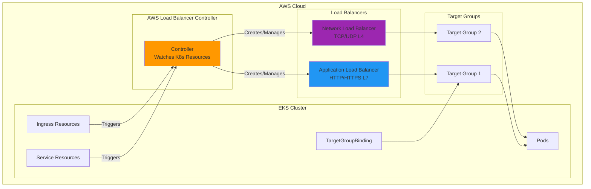
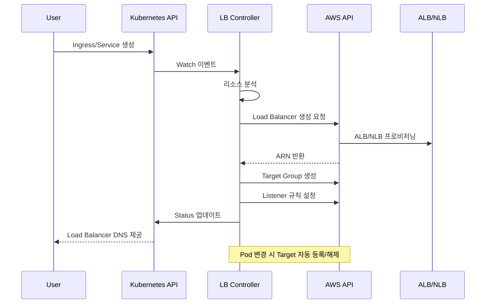

# AWS Load Balancer Controller

> **지원 버전**: AWS Load Balancer Controller v2.8+
> **마지막 업데이트**: 2026년 7월 3일

## 개요

AWS Load Balancer Controller는 Kubernetes 클러스터에서 AWS Elastic Load Balancer(ELB)를 관리하는 컨트롤러입니다. Kubernetes Ingress 및 Service 리소스를 AWS Application Load Balancer(ALB) 및 Network Load Balancer(NLB)와 자동으로 연동합니다.

### 주요 기능

- **Application Load Balancer (ALB)**: HTTP/HTTPS 트래픽, 경로 기반 라우팅, 호스트 기반 라우팅
- **Network Load Balancer (NLB)**: TCP/UDP 트래픽, 고성능 L4 로드밸런싱
- **TargetGroupBinding**: 기존 Target Group을 Kubernetes Service와 연결
- **AWS WAF 통합**: 웹 애플리케이션 방화벽 적용
- **AWS Shield**: DDoS 보호



## 아키텍처

### 컨트롤러 동작 방식



### 컴포넌트 구성

```yaml
# Deployment 구조
apiVersion: apps/v1
kind: Deployment
metadata:
  name: aws-load-balancer-controller
  namespace: kube-system
spec:
  replicas: 2  # HA 구성
  selector:
    matchLabels:
      app.kubernetes.io/name: aws-load-balancer-controller
  template:
    spec:
      serviceAccountName: aws-load-balancer-controller
      containers:
        - name: controller
          image: public.ecr.aws/eks/aws-load-balancer-controller:v2.8.0
          args:
            - --cluster-name=my-cluster
            - --ingress-class=alb
            - --aws-vpc-id=vpc-xxxxxxxxx
            - --aws-region=ap-northeast-2
```

## 사전 요구사항

### 1. IAM 정책 생성

```json
{
  "Version": "2012-10-17",
  "Statement": [
    {
      "Effect": "Allow",
      "Action": [
        "iam:CreateServiceLinkedRole"
      ],
      "Resource": "*",
      "Condition": {
        "StringEquals": {
          "iam:AWSServiceName": "elasticloadbalancing.amazonaws.com"
        }
      }
    },
    {
      "Effect": "Allow",
      "Action": [
        "ec2:DescribeAccountAttributes",
        "ec2:DescribeAddresses",
        "ec2:DescribeAvailabilityZones",
        "ec2:DescribeInternetGateways",
        "ec2:DescribeVpcs",
        "ec2:DescribeVpcPeeringConnections",
        "ec2:DescribeSubnets",
        "ec2:DescribeSecurityGroups",
        "ec2:DescribeInstances",
        "ec2:DescribeNetworkInterfaces",
        "ec2:DescribeTags",
        "ec2:GetCoipPoolUsage",
        "ec2:DescribeCoipPools",
        "elasticloadbalancing:DescribeLoadBalancers",
        "elasticloadbalancing:DescribeLoadBalancerAttributes",
        "elasticloadbalancing:DescribeListeners",
        "elasticloadbalancing:DescribeListenerCertificates",
        "elasticloadbalancing:DescribeSSLPolicies",
        "elasticloadbalancing:DescribeRules",
        "elasticloadbalancing:DescribeTargetGroups",
        "elasticloadbalancing:DescribeTargetGroupAttributes",
        "elasticloadbalancing:DescribeTargetHealth",
        "elasticloadbalancing:DescribeTags",
        "elasticloadbalancing:DescribeTrustStores"
      ],
      "Resource": "*"
    },
    {
      "Effect": "Allow",
      "Action": [
        "cognito-idp:DescribeUserPoolClient",
        "acm:ListCertificates",
        "acm:DescribeCertificate",
        "iam:ListServerCertificates",
        "iam:GetServerCertificate",
        "waf-regional:GetWebACL",
        "waf-regional:GetWebACLForResource",
        "waf-regional:AssociateWebACL",
        "waf-regional:DisassociateWebACL",
        "wafv2:GetWebACL",
        "wafv2:GetWebACLForResource",
        "wafv2:AssociateWebACL",
        "wafv2:DisassociateWebACL",
        "shield:GetSubscriptionState",
        "shield:DescribeProtection",
        "shield:CreateProtection",
        "shield:DeleteProtection"
      ],
      "Resource": "*"
    },
    {
      "Effect": "Allow",
      "Action": [
        "ec2:AuthorizeSecurityGroupIngress",
        "ec2:RevokeSecurityGroupIngress"
      ],
      "Resource": "*"
    },
    {
      "Effect": "Allow",
      "Action": [
        "ec2:CreateSecurityGroup"
      ],
      "Resource": "*"
    },
    {
      "Effect": "Allow",
      "Action": [
        "ec2:CreateTags"
      ],
      "Resource": "arn:aws:ec2:*:*:security-group/*",
      "Condition": {
        "StringEquals": {
          "ec2:CreateAction": "CreateSecurityGroup"
        },
        "Null": {
          "aws:RequestTag/elbv2.k8s.aws/cluster": "false"
        }
      }
    },
    {
      "Effect": "Allow",
      "Action": [
        "ec2:CreateTags",
        "ec2:DeleteTags"
      ],
      "Resource": "arn:aws:ec2:*:*:security-group/*",
      "Condition": {
        "Null": {
          "aws:RequestTag/elbv2.k8s.aws/cluster": "true",
          "aws:ResourceTag/elbv2.k8s.aws/cluster": "false"
        }
      }
    },
    {
      "Effect": "Allow",
      "Action": [
        "ec2:AuthorizeSecurityGroupIngress",
        "ec2:RevokeSecurityGroupIngress",
        "ec2:DeleteSecurityGroup"
      ],
      "Resource": "*",
      "Condition": {
        "Null": {
          "aws:ResourceTag/elbv2.k8s.aws/cluster": "false"
        }
      }
    },
    {
      "Effect": "Allow",
      "Action": [
        "elasticloadbalancing:CreateLoadBalancer",
        "elasticloadbalancing:CreateTargetGroup"
      ],
      "Resource": "*",
      "Condition": {
        "Null": {
          "aws:RequestTag/elbv2.k8s.aws/cluster": "false"
        }
      }
    },
    {
      "Effect": "Allow",
      "Action": [
        "elasticloadbalancing:CreateListener",
        "elasticloadbalancing:DeleteListener",
        "elasticloadbalancing:CreateRule",
        "elasticloadbalancing:DeleteRule"
      ],
      "Resource": "*"
    },
    {
      "Effect": "Allow",
      "Action": [
        "elasticloadbalancing:AddTags",
        "elasticloadbalancing:RemoveTags"
      ],
      "Resource": [
        "arn:aws:elasticloadbalancing:*:*:targetgroup/*/*",
        "arn:aws:elasticloadbalancing:*:*:loadbalancer/net/*/*",
        "arn:aws:elasticloadbalancing:*:*:loadbalancer/app/*/*"
      ],
      "Condition": {
        "Null": {
          "aws:RequestTag/elbv2.k8s.aws/cluster": "true",
          "aws:ResourceTag/elbv2.k8s.aws/cluster": "false"
        }
      }
    },
    {
      "Effect": "Allow",
      "Action": [
        "elasticloadbalancing:AddTags",
        "elasticloadbalancing:RemoveTags"
      ],
      "Resource": [
        "arn:aws:elasticloadbalancing:*:*:listener/net/*/*/*",
        "arn:aws:elasticloadbalancing:*:*:listener/app/*/*/*",
        "arn:aws:elasticloadbalancing:*:*:listener-rule/net/*/*/*",
        "arn:aws:elasticloadbalancing:*:*:listener-rule/app/*/*/*"
      ]
    },
    {
      "Effect": "Allow",
      "Action": [
        "elasticloadbalancing:ModifyLoadBalancerAttributes",
        "elasticloadbalancing:SetIpAddressType",
        "elasticloadbalancing:SetSecurityGroups",
        "elasticloadbalancing:SetSubnets",
        "elasticloadbalancing:DeleteLoadBalancer",
        "elasticloadbalancing:ModifyTargetGroup",
        "elasticloadbalancing:ModifyTargetGroupAttributes",
        "elasticloadbalancing:DeleteTargetGroup"
      ],
      "Resource": "*",
      "Condition": {
        "Null": {
          "aws:ResourceTag/elbv2.k8s.aws/cluster": "false"
        }
      }
    },
    {
      "Effect": "Allow",
      "Action": [
        "elasticloadbalancing:AddTags"
      ],
      "Resource": [
        "arn:aws:elasticloadbalancing:*:*:targetgroup/*/*",
        "arn:aws:elasticloadbalancing:*:*:loadbalancer/net/*/*",
        "arn:aws:elasticloadbalancing:*:*:loadbalancer/app/*/*"
      ],
      "Condition": {
        "StringEquals": {
          "elasticloadbalancing:CreateAction": [
            "CreateTargetGroup",
            "CreateLoadBalancer"
          ]
        },
        "Null": {
          "aws:RequestTag/elbv2.k8s.aws/cluster": "false"
        }
      }
    },
    {
      "Effect": "Allow",
      "Action": [
        "elasticloadbalancing:RegisterTargets",
        "elasticloadbalancing:DeregisterTargets"
      ],
      "Resource": "arn:aws:elasticloadbalancing:*:*:targetgroup/*/*"
    },
    {
      "Effect": "Allow",
      "Action": [
        "elasticloadbalancing:SetWebAcl",
        "elasticloadbalancing:ModifyListener",
        "elasticloadbalancing:AddListenerCertificates",
        "elasticloadbalancing:RemoveListenerCertificates",
        "elasticloadbalancing:ModifyRule"
      ],
      "Resource": "*"
    }
  ]
}
```

### 2. IRSA 설정

```bash
# OIDC Provider 확인
aws eks describe-cluster --name my-cluster --query "cluster.identity.oidc.issuer" --output text

# OIDC Provider가 없으면 생성
eksctl utils associate-iam-oidc-provider --cluster my-cluster --approve

# IAM 정책 생성
curl -o iam_policy.json https://raw.githubusercontent.com/kubernetes-sigs/aws-load-balancer-controller/v2.8.0/docs/install/iam_policy.json

aws iam create-policy \
  --policy-name AWSLoadBalancerControllerIAMPolicy \
  --policy-document file://iam_policy.json

# Service Account 생성
eksctl create iamserviceaccount \
  --cluster=my-cluster \
  --namespace=kube-system \
  --name=aws-load-balancer-controller \
  --role-name AmazonEKSLoadBalancerControllerRole \
  --attach-policy-arn=arn:aws:iam::<ACCOUNT_ID>:policy/AWSLoadBalancerControllerIAMPolicy \
  --approve
```

## 설치

### Helm을 사용한 설치

```bash
# Helm repo 추가
helm repo add eks https://aws.github.io/eks-charts
helm repo update

# 설치
helm install aws-load-balancer-controller eks/aws-load-balancer-controller \
  -n kube-system \
  --set clusterName=my-cluster \
  --set serviceAccount.create=false \
  --set serviceAccount.name=aws-load-balancer-controller \
  --set region=ap-northeast-2 \
  --set vpcId=vpc-xxxxxxxxx
```

```yaml
# values.yaml 예시
clusterName: my-cluster
serviceAccount:
  create: false
  name: aws-load-balancer-controller

region: ap-northeast-2
vpcId: vpc-xxxxxxxxx

# 리소스 설정
resources:
  requests:
    cpu: 100m
    memory: 128Mi
  limits:
    cpu: 200m
    memory: 256Mi

# 복제본 수
replicaCount: 2

# Pod 분산 배치
podDisruptionBudget:
  minAvailable: 1

# 고가용성을 위한 Anti-Affinity
affinity:
  podAntiAffinity:
    preferredDuringSchedulingIgnoredDuringExecution:
      - weight: 100
        podAffinityTerm:
          labelSelector:
            matchExpressions:
              - key: app.kubernetes.io/name
                operator: In
                values:
                  - aws-load-balancer-controller
          topologyKey: kubernetes.io/hostname

# Webhook 인증서
enableCertManager: false

# 로그 레벨
logLevel: info

# IngressClass 설정
ingressClass: alb
createIngressClassResource: true

# 추가 설정
enableShield: false
enableWaf: false
enableWafv2: true
```

### 설치 확인

```bash
# Deployment 상태 확인
kubectl get deployment -n kube-system aws-load-balancer-controller

# Pod 상태 확인
kubectl get pods -n kube-system -l app.kubernetes.io/name=aws-load-balancer-controller

# 로그 확인
kubectl logs -n kube-system -l app.kubernetes.io/name=aws-load-balancer-controller

# IngressClass 확인
kubectl get ingressclass
```

## Application Load Balancer (ALB)

### 기본 Ingress 설정

```yaml
apiVersion: networking.k8s.io/v1
kind: Ingress
metadata:
  name: my-ingress
  namespace: default
  annotations:
    # ALB 스키마 (internet-facing 또는 internal)
    alb.ingress.kubernetes.io/scheme: internet-facing

    # Target Type (ip 또는 instance)
    alb.ingress.kubernetes.io/target-type: ip

    # 리스너 포트
    alb.ingress.kubernetes.io/listen-ports: '[{"HTTP": 80}, {"HTTPS": 443}]'

    # SSL 리다이렉트
    alb.ingress.kubernetes.io/ssl-redirect: "443"

    # ACM 인증서
    alb.ingress.kubernetes.io/certificate-arn: arn:aws:acm:ap-northeast-2:ACCOUNT:certificate/CERT_ID

    # 서브넷 지정
    alb.ingress.kubernetes.io/subnets: subnet-xxx,subnet-yyy,subnet-zzz

    # 보안 그룹
    alb.ingress.kubernetes.io/security-groups: sg-xxxxxxxxx

    # 헬스체크 설정
    alb.ingress.kubernetes.io/healthcheck-path: /health
    alb.ingress.kubernetes.io/healthcheck-interval-seconds: "15"
    alb.ingress.kubernetes.io/healthcheck-timeout-seconds: "5"
    alb.ingress.kubernetes.io/healthy-threshold-count: "2"
    alb.ingress.kubernetes.io/unhealthy-threshold-count: "2"

spec:
  ingressClassName: alb
  rules:
    - host: api.example.com
      http:
        paths:
          - path: /
            pathType: Prefix
            backend:
              service:
                name: api-service
                port:
                  number: 80
```

### 고급 Ingress 설정

```yaml
apiVersion: networking.k8s.io/v1
kind: Ingress
metadata:
  name: advanced-ingress
  annotations:
    alb.ingress.kubernetes.io/scheme: internet-facing
    alb.ingress.kubernetes.io/target-type: ip

    # 그룹으로 여러 Ingress를 하나의 ALB로 통합
    alb.ingress.kubernetes.io/group.name: my-app-group
    alb.ingress.kubernetes.io/group.order: "10"

    # Sticky Sessions
    alb.ingress.kubernetes.io/target-group-attributes: stickiness.enabled=true,stickiness.lb_cookie.duration_seconds=60

    # 슬로우 스타트
    alb.ingress.kubernetes.io/target-group-attributes: slow_start.duration_seconds=30

    # 연결 드레이닝
    alb.ingress.kubernetes.io/target-group-attributes: deregistration_delay.timeout_seconds=30

    # IP 주소 유형
    alb.ingress.kubernetes.io/ip-address-type: dualstack

    # 로드밸런서 속성
    alb.ingress.kubernetes.io/load-balancer-attributes: >-
      idle_timeout.timeout_seconds=60,
      routing.http2.enabled=true,
      routing.http.drop_invalid_header_fields.enabled=true

    # 액세스 로그
    alb.ingress.kubernetes.io/load-balancer-attributes: >-
      access_logs.s3.enabled=true,
      access_logs.s3.bucket=my-alb-logs,
      access_logs.s3.prefix=my-app

    # 태그
    alb.ingress.kubernetes.io/tags: Environment=production,Team=platform

    # WAF v2 연동
    alb.ingress.kubernetes.io/wafv2-acl-arn: arn:aws:wafv2:ap-northeast-2:ACCOUNT:regional/webacl/my-acl/xxx

    # Shield Advanced
    alb.ingress.kubernetes.io/shield-advanced-protection: "true"

spec:
  ingressClassName: alb
  tls:
    - hosts:
        - api.example.com
        - www.example.com
  rules:
    - host: api.example.com
      http:
        paths:
          - path: /v1
            pathType: Prefix
            backend:
              service:
                name: api-v1
                port:
                  number: 80
          - path: /v2
            pathType: Prefix
            backend:
              service:
                name: api-v2
                port:
                  number: 80
    - host: www.example.com
      http:
        paths:
          - path: /
            pathType: Prefix
            backend:
              service:
                name: web-frontend
                port:
                  number: 80
```

### 경로 기반 라우팅

```yaml
apiVersion: networking.k8s.io/v1
kind: Ingress
metadata:
  name: path-based-routing
  annotations:
    alb.ingress.kubernetes.io/scheme: internet-facing
    alb.ingress.kubernetes.io/target-type: ip

    # 조건 기반 라우팅
    alb.ingress.kubernetes.io/conditions.api-v2: >-
      [{"field":"http-header","httpHeaderConfig":{"httpHeaderName":"X-Api-Version","values":["v2"]}}]

spec:
  ingressClassName: alb
  rules:
    - host: api.example.com
      http:
        paths:
          # 정확한 경로 매칭
          - path: /health
            pathType: Exact
            backend:
              service:
                name: health-service
                port:
                  number: 80

          # API 버전별 라우팅
          - path: /api
            pathType: Prefix
            backend:
              service:
                name: api-v1
                port:
                  number: 80

          # 정적 파일
          - path: /static
            pathType: Prefix
            backend:
              service:
                name: static-service
                port:
                  number: 80

          # 기본 경로
          - path: /
            pathType: Prefix
            backend:
              service:
                name: default-service
                port:
                  number: 80
```

### 인증 설정

```yaml
apiVersion: networking.k8s.io/v1
kind: Ingress
metadata:
  name: auth-ingress
  annotations:
    alb.ingress.kubernetes.io/scheme: internet-facing
    alb.ingress.kubernetes.io/target-type: ip

    # Cognito 인증
    alb.ingress.kubernetes.io/auth-type: cognito
    alb.ingress.kubernetes.io/auth-idp-cognito: >-
      {"userPoolARN":"arn:aws:cognito-idp:ap-northeast-2:ACCOUNT:userpool/ap-northeast-2_xxxxx",
       "userPoolClientID":"xxxxxxxxx",
       "userPoolDomain":"my-domain"}
    alb.ingress.kubernetes.io/auth-on-unauthenticated-request: authenticate
    alb.ingress.kubernetes.io/auth-scope: "openid profile email"
    alb.ingress.kubernetes.io/auth-session-cookie: "AWSELBAuthSessionCookie"
    alb.ingress.kubernetes.io/auth-session-timeout: "3600"

spec:
  ingressClassName: alb
  rules:
    - host: app.example.com
      http:
        paths:
          - path: /
            pathType: Prefix
            backend:
              service:
                name: protected-app
                port:
                  number: 80
```

```yaml
# OIDC 인증 예시
apiVersion: networking.k8s.io/v1
kind: Ingress
metadata:
  name: oidc-ingress
  annotations:
    alb.ingress.kubernetes.io/scheme: internet-facing
    alb.ingress.kubernetes.io/target-type: ip

    # OIDC 인증
    alb.ingress.kubernetes.io/auth-type: oidc
    alb.ingress.kubernetes.io/auth-idp-oidc: >-
      {"issuer":"https://accounts.google.com",
       "authorizationEndpoint":"https://accounts.google.com/o/oauth2/v2/auth",
       "tokenEndpoint":"https://oauth2.googleapis.com/token",
       "userInfoEndpoint":"https://openidconnect.googleapis.com/v1/userinfo",
       "secretName":"oidc-secret"}
    alb.ingress.kubernetes.io/auth-on-unauthenticated-request: authenticate

spec:
  ingressClassName: alb
  rules:
    - host: app.example.com
      http:
        paths:
          - path: /
            pathType: Prefix
            backend:
              service:
                name: protected-app
                port:
                  number: 80
---
# OIDC Secret
apiVersion: v1
kind: Secret
metadata:
  name: oidc-secret
type: Opaque
stringData:
  clientID: your-client-id
  clientSecret: your-client-secret
```

## Network Load Balancer (NLB)

### 기본 NLB Service 설정

```yaml
apiVersion: v1
kind: Service
metadata:
  name: nlb-service
  annotations:
    # NLB 유형 지정
    service.beta.kubernetes.io/aws-load-balancer-type: "external"
    service.beta.kubernetes.io/aws-load-balancer-nlb-target-type: "ip"

    # 스키마
    service.beta.kubernetes.io/aws-load-balancer-scheme: "internet-facing"

    # 서브넷 지정
    service.beta.kubernetes.io/aws-load-balancer-subnets: subnet-xxx,subnet-yyy

    # 헬스체크
    service.beta.kubernetes.io/aws-load-balancer-healthcheck-protocol: "HTTP"
    service.beta.kubernetes.io/aws-load-balancer-healthcheck-path: "/health"
    service.beta.kubernetes.io/aws-load-balancer-healthcheck-port: "8080"
    service.beta.kubernetes.io/aws-load-balancer-healthcheck-interval: "10"
    service.beta.kubernetes.io/aws-load-balancer-healthcheck-healthy-threshold: "2"
    service.beta.kubernetes.io/aws-load-balancer-healthcheck-unhealthy-threshold: "2"

spec:
  type: LoadBalancer
  selector:
    app: my-app
  ports:
    - name: tcp
      port: 80
      targetPort: 8080
      protocol: TCP
```

### TLS 종료 NLB

```yaml
apiVersion: v1
kind: Service
metadata:
  name: nlb-tls-service
  annotations:
    service.beta.kubernetes.io/aws-load-balancer-type: "external"
    service.beta.kubernetes.io/aws-load-balancer-nlb-target-type: "ip"
    service.beta.kubernetes.io/aws-load-balancer-scheme: "internet-facing"

    # TLS 설정
    service.beta.kubernetes.io/aws-load-balancer-ssl-cert: "arn:aws:acm:ap-northeast-2:ACCOUNT:certificate/CERT_ID"
    service.beta.kubernetes.io/aws-load-balancer-ssl-ports: "443"
    service.beta.kubernetes.io/aws-load-balancer-ssl-negotiation-policy: "ELBSecurityPolicy-TLS13-1-2-2021-06"

    # Backend은 HTTP
    service.beta.kubernetes.io/aws-load-balancer-backend-protocol: "tcp"

spec:
  type: LoadBalancer
  selector:
    app: my-app
  ports:
    - name: https
      port: 443
      targetPort: 8080
      protocol: TCP
```

### 내부 NLB

```yaml
apiVersion: v1
kind: Service
metadata:
  name: internal-nlb
  annotations:
    service.beta.kubernetes.io/aws-load-balancer-type: "external"
    service.beta.kubernetes.io/aws-load-balancer-nlb-target-type: "ip"

    # 내부 스키마
    service.beta.kubernetes.io/aws-load-balancer-scheme: "internal"

    # 크로스 존 로드밸런싱
    service.beta.kubernetes.io/aws-load-balancer-attributes: "load_balancing.cross_zone.enabled=true"

    # 프라이빗 서브넷
    service.beta.kubernetes.io/aws-load-balancer-subnets: subnet-private-a,subnet-private-b

    # 보안 그룹 (선택)
    service.beta.kubernetes.io/aws-load-balancer-security-groups: sg-xxxxxxxxx

spec:
  type: LoadBalancer
  selector:
    app: internal-service
  ports:
    - port: 80
      targetPort: 8080
```

### UDP 지원 NLB

```yaml
apiVersion: v1
kind: Service
metadata:
  name: udp-nlb
  annotations:
    service.beta.kubernetes.io/aws-load-balancer-type: "external"
    service.beta.kubernetes.io/aws-load-balancer-nlb-target-type: "ip"
    service.beta.kubernetes.io/aws-load-balancer-scheme: "internet-facing"

spec:
  type: LoadBalancer
  selector:
    app: dns-server
  ports:
    - name: dns-udp
      port: 53
      targetPort: 53
      protocol: UDP
    - name: dns-tcp
      port: 53
      targetPort: 53
      protocol: TCP
```

### Proxy Protocol v2

```yaml
apiVersion: v1
kind: Service
metadata:
  name: proxy-protocol-nlb
  annotations:
    service.beta.kubernetes.io/aws-load-balancer-type: "external"
    service.beta.kubernetes.io/aws-load-balancer-nlb-target-type: "ip"
    service.beta.kubernetes.io/aws-load-balancer-scheme: "internet-facing"

    # Proxy Protocol v2 활성화
    service.beta.kubernetes.io/aws-load-balancer-proxy-protocol: "*"

    # Target Group 속성
    service.beta.kubernetes.io/aws-load-balancer-target-group-attributes: >-
      proxy_protocol_v2.enabled=true,
      preserve_client_ip.enabled=true

spec:
  type: LoadBalancer
  selector:
    app: proxy-aware-app
  ports:
    - port: 80
      targetPort: 8080
```

## IngressClass 및 IngressClassParams

### IngressClass 정의

```yaml
apiVersion: networking.k8s.io/v1
kind: IngressClass
metadata:
  name: alb
  annotations:
    ingressclass.kubernetes.io/is-default-class: "true"
spec:
  controller: ingress.k8s.aws/alb
  parameters:
    apiGroup: elbv2.k8s.aws
    kind: IngressClassParams
    name: alb-params
```

### IngressClassParams 설정

```yaml
apiVersion: elbv2.k8s.aws/v1beta1
kind: IngressClassParams
metadata:
  name: alb-params
spec:
  # 기본 스키마
  scheme: internet-facing

  # IP 주소 유형
  ipAddressType: dualstack

  # 네임스페이스 셀렉터 (특정 네임스페이스만 허용)
  namespaceSelector:
    matchLabels:
      alb-enabled: "true"

  # 기본 태그
  tags:
    - key: Environment
      value: production
    - key: ManagedBy
      value: aws-load-balancer-controller

  # 로드밸런서 속성
  loadBalancerAttributes:
    - key: idle_timeout.timeout_seconds
      value: "60"
    - key: routing.http2.enabled
      value: "true"

  # 서브넷 선택
  # subnets:
  #   ids:
  #     - subnet-xxx
  #     - subnet-yyy
  #   tags:
  #     - key: kubernetes.io/role/elb
  #       value: "1"

  # 그룹 설정
  group:
    name: my-default-group
```

## TargetGroupBinding

TargetGroupBinding CRD를 사용하면 기존 AWS Target Group을 Kubernetes Service와 직접 연결할 수 있습니다.

### 기본 TargetGroupBinding

```yaml
apiVersion: elbv2.k8s.aws/v1beta1
kind: TargetGroupBinding
metadata:
  name: my-tgb
  namespace: default
spec:
  # 기존 Target Group ARN
  targetGroupARN: arn:aws:elasticloadbalancing:ap-northeast-2:ACCOUNT:targetgroup/my-tg/xxxxxxxxxxxx

  # 연결할 Service
  serviceRef:
    name: my-service
    port: 80

  # Target Type (ip 또는 instance)
  targetType: ip

  # 네트워킹 설정
  networking:
    ingress:
      - from:
          - securityGroup:
              groupID: sg-xxxxxxxxx
        ports:
          - port: 80
            protocol: TCP
```

### 고급 TargetGroupBinding

```yaml
apiVersion: elbv2.k8s.aws/v1beta1
kind: TargetGroupBinding
metadata:
  name: advanced-tgb
  namespace: production
spec:
  targetGroupARN: arn:aws:elasticloadbalancing:ap-northeast-2:ACCOUNT:targetgroup/prod-tg/xxxxxxxxxxxx

  serviceRef:
    name: production-service
    port: 8080

  targetType: ip

  # IP 주소 유형
  ipAddressType: ipv4

  # VPC ID (자동 감지, 명시적 지정 가능)
  # vpcID: vpc-xxxxxxxxx

  # 네트워킹 설정
  networking:
    ingress:
      # 여러 보안 그룹에서의 트래픽 허용
      - from:
          - securityGroup:
              groupID: sg-alb-sg
          - securityGroup:
              groupID: sg-internal-sg
        ports:
          - port: 8080
            protocol: TCP
          - port: 8443
            protocol: TCP

  # Node Selector (특정 노드의 Pod만 타겟으로)
  # nodeSelector:
  #   matchLabels:
  #     node-type: compute
```

### 멀티포트 TargetGroupBinding

```yaml
# 여러 포트를 위한 별도의 TargetGroupBinding
---
apiVersion: elbv2.k8s.aws/v1beta1
kind: TargetGroupBinding
metadata:
  name: http-tgb
spec:
  targetGroupARN: arn:aws:elasticloadbalancing:...:targetgroup/http-tg/xxx
  serviceRef:
    name: multi-port-service
    port: 80
  targetType: ip
---
apiVersion: elbv2.k8s.aws/v1beta1
kind: TargetGroupBinding
metadata:
  name: https-tgb
spec:
  targetGroupARN: arn:aws:elasticloadbalancing:...:targetgroup/https-tg/yyy
  serviceRef:
    name: multi-port-service
    port: 443
  targetType: ip
```

## WAF 및 Shield 통합

### AWS WAF v2 연동

```yaml
apiVersion: networking.k8s.io/v1
kind: Ingress
metadata:
  name: waf-protected-ingress
  annotations:
    alb.ingress.kubernetes.io/scheme: internet-facing
    alb.ingress.kubernetes.io/target-type: ip

    # WAF v2 WebACL 연결
    alb.ingress.kubernetes.io/wafv2-acl-arn: arn:aws:wafv2:ap-northeast-2:ACCOUNT:regional/webacl/my-webacl/xxxxxxxx-xxxx-xxxx-xxxx-xxxxxxxxxxxx

spec:
  ingressClassName: alb
  rules:
    - host: api.example.com
      http:
        paths:
          - path: /
            pathType: Prefix
            backend:
              service:
                name: api-service
                port:
                  number: 80
```

### AWS Shield Advanced

```yaml
apiVersion: networking.k8s.io/v1
kind: Ingress
metadata:
  name: shield-protected-ingress
  annotations:
    alb.ingress.kubernetes.io/scheme: internet-facing
    alb.ingress.kubernetes.io/target-type: ip

    # Shield Advanced 보호 활성화
    alb.ingress.kubernetes.io/shield-advanced-protection: "true"

spec:
  ingressClassName: alb
  rules:
    - host: critical-app.example.com
      http:
        paths:
          - path: /
            pathType: Prefix
            backend:
              service:
                name: critical-service
                port:
                  number: 80
```

## 버전별 주요 업데이트

### v2.16 (2025년 12월)

- **ALB Target Optimizer**: 사이드카 컨테이너가 타겟의 실시간 처리량을 수집해 용량 기반으로 트래픽을 라우팅
- **NLB Weighted Target Groups**: 하나의 NLB로 Blue/Green, Canary 배포 구성 가능
- **ALB JWT Validation**: `alb.ingress.kubernetes.io/jwt-validation` annotation으로 ALB 레벨 JWT 검증 수행
- **NLB QUIC Passthrough**: QUIC 프로토콜 트래픽 패스스루 지원

```yaml
# ALB JWT Validation 예시
alb.ingress.kubernetes.io/jwt-validation: >-
  {"issuer":"https://accounts.example.com","jwksUri":"https://accounts.example.com/.well-known/jwks.json"}
```

### v2.17 (v2.17.0 / v2.17.1, 2025년 12월~2026년 1월, Kubernetes 1.22+)

- **AWS Global Accelerator Controller 도입**: `Accelerator`/`Listener`/`EndpointGroup`/`Endpoint` CRD로 Global Accelerator를 Kubernetes 리소스로 선언적 관리
- QUIC 프로토콜 지원 범위 확대
- `--default-load-balancer-scheme` 플래그 추가 (스키마 annotation 미지정 시 기본값 지정)

> 이 버전부터 Gateway API 지원이 GA 직전 Release Candidate 단계로 성숙했습니다. Gateway API 정식 GA(v3.0.0) 및 이후 마이그레이션 도구는 [Gateway API 문서](./04-gateway-api.md)를 참고하세요.

## 주요 Annotation 레퍼런스

### ALB Ingress Annotations

| Annotation | 설명 | 기본값 |
|------------|------|--------|
| `alb.ingress.kubernetes.io/scheme` | internet-facing 또는 internal | internal |
| `alb.ingress.kubernetes.io/target-type` | ip 또는 instance | instance |
| `alb.ingress.kubernetes.io/subnets` | 서브넷 ID 또는 이름 | 자동 감지 |
| `alb.ingress.kubernetes.io/security-groups` | 보안 그룹 ID | 자동 생성 |
| `alb.ingress.kubernetes.io/listen-ports` | 리스너 포트 JSON | [{"HTTP": 80}] |
| `alb.ingress.kubernetes.io/certificate-arn` | ACM 인증서 ARN | - |
| `alb.ingress.kubernetes.io/ssl-redirect` | SSL 리다이렉트 포트 | - |
| `alb.ingress.kubernetes.io/ssl-policy` | SSL 정책 | ELBSecurityPolicy-2016-08 |
| `alb.ingress.kubernetes.io/healthcheck-path` | 헬스체크 경로 | / |
| `alb.ingress.kubernetes.io/healthcheck-port` | 헬스체크 포트 | traffic-port |
| `alb.ingress.kubernetes.io/healthcheck-protocol` | 헬스체크 프로토콜 | HTTP |
| `alb.ingress.kubernetes.io/healthcheck-interval-seconds` | 헬스체크 간격 | 15 |
| `alb.ingress.kubernetes.io/healthcheck-timeout-seconds` | 헬스체크 타임아웃 | 5 |
| `alb.ingress.kubernetes.io/healthy-threshold-count` | 정상 임계값 | 2 |
| `alb.ingress.kubernetes.io/unhealthy-threshold-count` | 비정상 임계값 | 2 |
| `alb.ingress.kubernetes.io/group.name` | Ingress 그룹 이름 | - |
| `alb.ingress.kubernetes.io/group.order` | 그룹 내 우선순위 | 0 |
| `alb.ingress.kubernetes.io/ip-address-type` | ipv4 또는 dualstack | ipv4 |
| `alb.ingress.kubernetes.io/load-balancer-attributes` | LB 속성 | - |
| `alb.ingress.kubernetes.io/target-group-attributes` | TG 속성 | - |
| `alb.ingress.kubernetes.io/tags` | 리소스 태그 | - |
| `alb.ingress.kubernetes.io/wafv2-acl-arn` | WAF v2 WebACL ARN | - |
| `alb.ingress.kubernetes.io/shield-advanced-protection` | Shield 보호 | false |
| `alb.ingress.kubernetes.io/auth-type` | 인증 유형 (none, cognito, oidc) | none |

### NLB Service Annotations

| Annotation | 설명 | 기본값 |
|------------|------|--------|
| `service.beta.kubernetes.io/aws-load-balancer-type` | external (NLB) 또는 nlb | - |
| `service.beta.kubernetes.io/aws-load-balancer-nlb-target-type` | ip 또는 instance | instance |
| `service.beta.kubernetes.io/aws-load-balancer-scheme` | internet-facing 또는 internal | internal |
| `service.beta.kubernetes.io/aws-load-balancer-subnets` | 서브넷 ID | 자동 감지 |
| `service.beta.kubernetes.io/aws-load-balancer-ssl-cert` | ACM 인증서 ARN | - |
| `service.beta.kubernetes.io/aws-load-balancer-ssl-ports` | SSL 적용 포트 | - |
| `service.beta.kubernetes.io/aws-load-balancer-ssl-negotiation-policy` | SSL 정책 | - |
| `service.beta.kubernetes.io/aws-load-balancer-backend-protocol` | 백엔드 프로토콜 | - |
| `service.beta.kubernetes.io/aws-load-balancer-proxy-protocol` | Proxy Protocol | - |
| `service.beta.kubernetes.io/aws-load-balancer-cross-zone-load-balancing-enabled` | 크로스 존 LB | true |
| `service.beta.kubernetes.io/aws-load-balancer-healthcheck-protocol` | 헬스체크 프로토콜 | TCP |
| `service.beta.kubernetes.io/aws-load-balancer-healthcheck-path` | 헬스체크 경로 | - |
| `service.beta.kubernetes.io/aws-load-balancer-healthcheck-port` | 헬스체크 포트 | - |
| `service.beta.kubernetes.io/aws-load-balancer-attributes` | LB 속성 | - |
| `service.beta.kubernetes.io/aws-load-balancer-target-group-attributes` | TG 속성 | - |
| `service.beta.kubernetes.io/aws-load-balancer-security-groups` | 보안 그룹 | 자동 생성 |

## EKS 모범 사례

### 1. 서브넷 태깅

```bash
# 퍼블릭 서브넷 (인터넷 연결 ALB/NLB용)
aws ec2 create-tags \
  --resources subnet-xxx \
  --tags Key=kubernetes.io/role/elb,Value=1

# 프라이빗 서브넷 (내부 ALB/NLB용)
aws ec2 create-tags \
  --resources subnet-yyy \
  --tags Key=kubernetes.io/role/internal-elb,Value=1

# 클러스터별 태그 (선택)
aws ec2 create-tags \
  --resources subnet-xxx subnet-yyy \
  --tags Key=kubernetes.io/cluster/my-cluster,Value=shared
```

### 2. 보안 그룹 관리

```yaml
apiVersion: networking.k8s.io/v1
kind: Ingress
metadata:
  name: secure-ingress
  annotations:
    alb.ingress.kubernetes.io/scheme: internet-facing
    alb.ingress.kubernetes.io/target-type: ip

    # 명시적 보안 그룹 지정
    alb.ingress.kubernetes.io/security-groups: sg-alb-external

    # 인바운드 CIDR 제한
    alb.ingress.kubernetes.io/inbound-cidrs: "10.0.0.0/8, 172.16.0.0/12"

    # 추가 보안 그룹 (백엔드 통신용)
    alb.ingress.kubernetes.io/manage-backend-security-group-rules: "true"

spec:
  ingressClassName: alb
  rules:
    - host: api.example.com
      http:
        paths:
          - path: /
            pathType: Prefix
            backend:
              service:
                name: api-service
                port:
                  number: 80
```

### 3. 비용 최적화

```yaml
# Ingress 그룹을 사용하여 ALB 공유
apiVersion: networking.k8s.io/v1
kind: Ingress
metadata:
  name: app1-ingress
  annotations:
    alb.ingress.kubernetes.io/group.name: shared-alb
    alb.ingress.kubernetes.io/group.order: "1"
spec:
  ingressClassName: alb
  rules:
    - host: app1.example.com
      http:
        paths:
          - path: /
            pathType: Prefix
            backend:
              service:
                name: app1
                port:
                  number: 80
---
apiVersion: networking.k8s.io/v1
kind: Ingress
metadata:
  name: app2-ingress
  annotations:
    alb.ingress.kubernetes.io/group.name: shared-alb
    alb.ingress.kubernetes.io/group.order: "2"
spec:
  ingressClassName: alb
  rules:
    - host: app2.example.com
      http:
        paths:
          - path: /
            pathType: Prefix
            backend:
              service:
                name: app2
                port:
                  number: 80
```

### 4. 고가용성 구성

```yaml
apiVersion: networking.k8s.io/v1
kind: Ingress
metadata:
  name: ha-ingress
  annotations:
    alb.ingress.kubernetes.io/scheme: internet-facing
    alb.ingress.kubernetes.io/target-type: ip

    # 3개 이상의 AZ에 서브넷 지정
    alb.ingress.kubernetes.io/subnets: subnet-az-a,subnet-az-b,subnet-az-c

    # 크로스 존 로드밸런싱
    alb.ingress.kubernetes.io/load-balancer-attributes: load_balancing.cross_zone.enabled=true

    # 헬스체크 최적화
    alb.ingress.kubernetes.io/healthcheck-interval-seconds: "10"
    alb.ingress.kubernetes.io/healthy-threshold-count: "2"
    alb.ingress.kubernetes.io/unhealthy-threshold-count: "2"

    # 드레이닝 타임아웃
    alb.ingress.kubernetes.io/target-group-attributes: deregistration_delay.timeout_seconds=30

spec:
  ingressClassName: alb
  rules:
    - host: api.example.com
      http:
        paths:
          - path: /
            pathType: Prefix
            backend:
              service:
                name: api-service
                port:
                  number: 80
```

## 트러블슈팅

### 일반적인 문제

#### 1. ALB가 생성되지 않음

```bash
# 컨트롤러 로그 확인
kubectl logs -n kube-system -l app.kubernetes.io/name=aws-load-balancer-controller

# Ingress 이벤트 확인
kubectl describe ingress <ingress-name>

# 일반적인 원인:
# - IAM 권한 부족
# - 서브넷 태그 누락
# - IngressClass 미지정
```

#### 2. Target이 Unhealthy

```bash
# Target Group 상태 확인
aws elbv2 describe-target-health \
  --target-group-arn arn:aws:elasticloadbalancing:...

# Pod 로그 확인
kubectl logs <pod-name>

# 헬스체크 엔드포인트 테스트
kubectl exec -it <pod-name> -- curl localhost:8080/health

# 보안 그룹 확인
aws ec2 describe-security-groups --group-ids sg-xxx
```

#### 3. 502 Bad Gateway

```bash
# 원인 분석:
# 1. Pod가 준비되지 않음
kubectl get pods -l app=my-app

# 2. Target Group 드레이닝 중
aws elbv2 describe-target-health --target-group-arn ...

# 3. 헬스체크 실패
# - 헬스체크 경로 확인
# - 헬스체크 타임아웃 조정

# 4. 보안 그룹 규칙
# - ALB -> Pod 통신 허용 확인
```

#### 4. SSL 인증서 문제

```bash
# ACM 인증서 상태 확인
aws acm describe-certificate --certificate-arn arn:aws:acm:...

# 인증서가 ISSUED 상태인지 확인
# 도메인 검증 완료 여부 확인

# 리전 확인 (ALB와 같은 리전이어야 함)
```

### 디버깅 명령어

```bash
# 컨트롤러 상세 로그
kubectl logs -n kube-system deployment/aws-load-balancer-controller -f

# Ingress 상태 확인
kubectl get ingress -o wide
kubectl describe ingress <name>

# Service 상태 확인
kubectl get svc -o wide
kubectl describe svc <name>

# TargetGroupBinding 상태 확인
kubectl get targetgroupbindings -A
kubectl describe targetgroupbinding <name>

# AWS 리소스 확인
aws elbv2 describe-load-balancers --query 'LoadBalancers[?contains(LoadBalancerName, `k8s`)]'
aws elbv2 describe-target-groups --query 'TargetGroups[?contains(TargetGroupName, `k8s`)]'
```

---

## 참고 자료

- [AWS Load Balancer Controller 문서](https://kubernetes-sigs.github.io/aws-load-balancer-controller/)
- [GitHub 저장소](https://github.com/kubernetes-sigs/aws-load-balancer-controller)
- [EKS 사용자 가이드](https://docs.aws.amazon.com/eks/latest/userguide/aws-load-balancer-controller.html)
- [ALB 문서](https://docs.aws.amazon.com/elasticloadbalancing/latest/application/)
- [NLB 문서](https://docs.aws.amazon.com/elasticloadbalancing/latest/network/)
