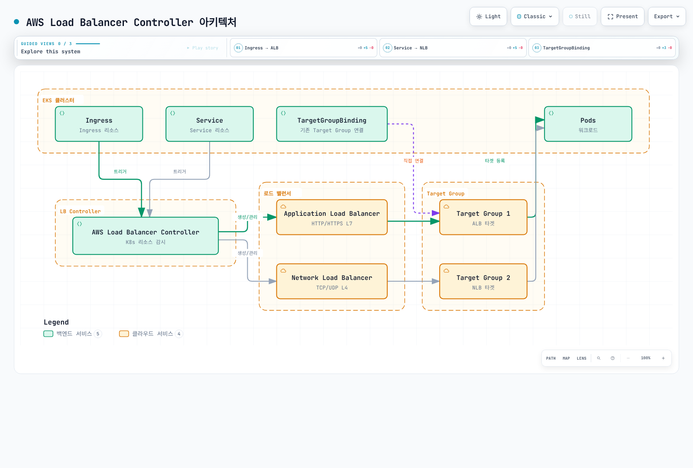
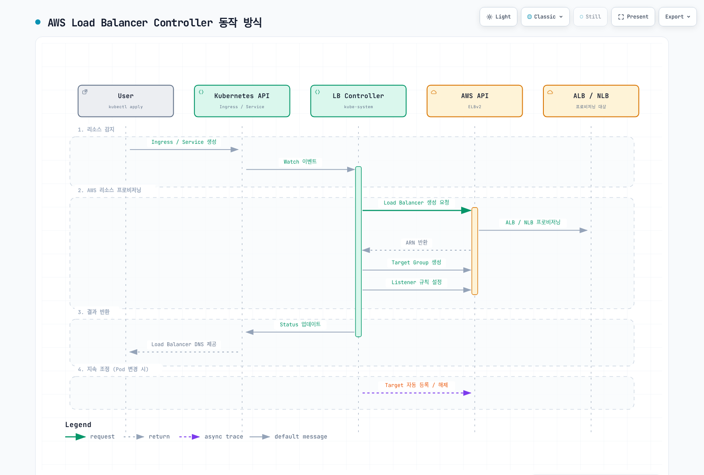

# AWS Load Balancer Controller

> **검토 기준**: AWS Load Balancer Controller / Helm 차트 v3.5.0
> **마지막 업데이트**: 2026년 9월 11일

## 개요

AWS Load Balancer Controller는 Kubernetes 클러스터에서 AWS Elastic Load Balancer(ELB)를 관리하는 컨트롤러입니다. Kubernetes Ingress 및 Service 리소스를 AWS Application Load Balancer(ALB) 및 Network Load Balancer(NLB)와 자동으로 연동합니다.

### 주요 기능

- **Application Load Balancer (ALB)**: HTTP/HTTPS 트래픽, 경로 기반 라우팅, 호스트 기반 라우팅
- **Network Load Balancer (NLB)**: TCP/UDP 트래픽, 고성능 L4 로드밸런싱
- **TargetGroupBinding**: 기존 Target Group을 Kubernetes Service와 연결
- **AWS WAF 통합**: 웹 애플리케이션 방화벽 적용
- **AWS Shield**: DDoS 보호



[🔍 인터랙티브 다이어그램 보기](https://www.atomai.click/kubernetes-docs/archmaps/ko-networking-03-aws-lb-controller-0.html)

## 아키텍처

### 컨트롤러 동작 방식



[🔍 인터랙티브 다이어그램 보기](https://www.atomai.click/kubernetes-docs/archmaps/ko-networking-03-aws-lb-controller-1.html)

### 컴포넌트 구성

RBAC, CRD, 프로브와 웹훅 인증서를 포함한 전체 릴리스 차트를 설치하세요. 컨트롤러는 Kubernetes 객체를 감시하고 AWS API를 호출하며, 애플리케이션 트래픽은 컨트롤러 파드가 아니라 로드밸런서와 대상을 통과합니다. 리더 선출로 한 복제본이 조정하고 나머지는 대기 용량과 웹훅 가용성을 제공합니다. 복제본 수만으로 노드·가용 영역 분산 배치가 보장되지는 않습니다.

## 사전 요구사항

### 관리 주체와 호환성

이 장은 **직접 관리하는 오픈소스 컨트롤러**를 구성합니다. EKS Auto Mode에는 별도의 관리형 로드밸런싱이 있습니다. NLB Service는 `eks.amazonaws.com/nlb`, ALB IngressClass는 `eks.amazonaws.com/alb`를 사용하며 TargetGroupBinding API도 `elbv2.k8s.aws/v1beta1`과 다릅니다. 클래스를 제자리 변경하거나 모든 어노테이션을 복사하지 말고 Auto Mode 마이그레이션 가이드를 확인하세요. 두 모델을 함께 사용할 때는 명시적인 클래스로 관리 주체를 구분합니다.

현재 지원되는 EKS Kubernetes 릴리스를 사용하고 클러스터 전체 CRD를 공유하는 모든 컨트롤러를 확인하세요. LBC **v3.5.0**은 **2026-08-03**에 공개되었으며 검증한 차트 **3.5.0**이 해당 컨트롤러를 포함합니다. Gateway API 사용자는 업그레이드 전에 **v1.6.0** CRD가 필요하고, LBC 전용 Gateway CRD는 이제 `gateway.k8s.aws/v1`을 사용합니다. 임의의 최신 Gateway API나 Kubernetes 릴리스와 호환된다는 뜻은 아닙니다. 예전의 일반적인 “Kubernetes 1.22+” 설치 하한을 현재 EKS 지원 매트릭스로 해석하면 안 됩니다.

컨트롤러 웹훅에는 제어 플레인에서 TCP 9443으로 접근할 수 있어야 합니다. IMDS가 제한되거나 컨트롤러가 Fargate/Hybrid Nodes에서 실행되면 리전/VPC 값을 명시하고 해당 컴퓨팅 유형에서 지원되는 자격 증명 방식을 선택하세요. IP 대상에는 VPC에서 라우팅 가능한 파드 주소와 지원되는 엔드포인트/ENI 탐색이 필요합니다. Amazon VPC CNI가 일반적인 EKS 선택이지만 가능한 유일한 CNI 구성은 아닙니다. Instance 대상에는 NodePort를 사용할 수 있는 Service와 적절한 노드 네트워킹이 필요합니다.


### 1. IAM 정책 생성

**v3.5.0**에 포함된 IAM 정책과 올바른 AWS 파티션을 사용하세요. 넓은 조회·보안 그룹 권한, 리소스/태그 조건과 이 배포에서 활성화할 기능을 검토하고 검토본을 저장한 뒤 정책을 생성합니다. upstream 정책을 최소 권한 보장으로 간주하거나 현재 설치에 오래된 v2.8 정책을 복사하지 마세요. 지원되는 노드에서는 **IRSA 또는 EKS Pod Identity**로 AWS 자격 증명을 제공할 수 있으며 Kubernetes API RBAC와는 별도입니다.

### 2. IRSA 설정

```bash
export AWS_REGION=ap-northeast-2
export CLUSTER_NAME=my-cluster
export AWS_ACCOUNT_ID="$(aws sts get-caller-identity --query Account --output text)"
export VPC_ID="$(aws eks describe-cluster --name "$CLUSTER_NAME" \
  --query 'cluster.resourcesVpcConfig.vpcId' --output text)"
kubectl config current-context

aws eks describe-cluster --name "$CLUSTER_NAME" \
  --query cluster.identity.oidc.issuer --output text
# Only if this cluster's IAM OIDC provider does not already exist:
eksctl utils associate-iam-oidc-provider --cluster "$CLUSTER_NAME" \
  --region "$AWS_REGION" --approve

curl --fail --location --output iam-policy-upstream.json \
  https://raw.githubusercontent.com/kubernetes-sigs/aws-load-balancer-controller/v3.5.0/docs/install/iam_policy.json
export REVIEWED_POLICY_FILE=iam-policy-reviewed.json
test -s "$REVIEWED_POLICY_FILE"
export CONTROLLER_POLICY_ARN="$(aws iam create-policy \
  --policy-name AWSLoadBalancerControllerIAMPolicy \
  --policy-document "file://$REVIEWED_POLICY_FILE" --query Policy.Arn --output text)"
eksctl create iamserviceaccount --cluster "$CLUSTER_NAME" --region "$AWS_REGION" \
  --namespace kube-system --name aws-load-balancer-controller \
  --attach-policy-arn "$CONTROLLER_POLICY_ARN" --approve
```

기존 검토된 정책/역할은 재생성하지 말고 재사용하세요. IRSA 역할을 재사용하면 이 클러스터의 OIDC 공급자와 의도한 서비스 계정에 대한 신뢰 구문이 필요합니다. 기존 서비스 계정은 변경 전에 소유권과 어노테이션을 검토하세요. Pod Identity에는 별도의 에이전트/연결과 역할 신뢰 구성이 필요하며 정적 액세스 키를 차트 values에 복사하지 마세요.

## 설치

### Helm을 사용한 설치

```bash
helm repo add eks https://aws.github.io/eks-charts
helm repo update eks
helm pull eks/aws-load-balancer-controller --version 3.5.0

# Review cluster-wide CRD changes and other controllers before applying.
curl --fail --location --output gateway-api-v1.6.0.yaml \
  https://github.com/kubernetes-sigs/gateway-api/releases/download/v1.6.0/standard-install.yaml
kubectl apply --server-side -f gateway-api-v1.6.0.yaml
helm show crds ./aws-load-balancer-controller-3.5.0.tgz > lbc-crds.yaml
kubectl apply --server-side -f lbc-crds.yaml

# Save the values below as controller-values.yaml and replace its cluster/region/VPC.
helm install aws-load-balancer-controller ./aws-load-balancer-controller-3.5.0.tgz \
  -n kube-system -f controller-values.yaml --wait --timeout 5m
```

```yaml
# values.yaml 예시
clusterName: my-cluster
serviceAccount:
  create: false
  name: aws-load-balancer-controller

region: ap-northeast-2
vpcId: vpc-0123456789abcdef0

# 리소스 설정
resources:
  requests:
    cpu: 100m
    memory: 128Mi
  limits:
    cpu: 200m
    memory: 256Mi

# 복제본 수
replicaCount: 2

# Pod 분산 배치
podDisruptionBudget:
  minAvailable: 1

# 고가용성을 위한 Anti-Affinity
affinity:
  podAntiAffinity:
    preferredDuringSchedulingIgnoredDuringExecution:
      - weight: 100
        podAffinityTerm:
          labelSelector:
            matchExpressions:
              - key: app.kubernetes.io/name
                operator: In
                values:
                  - aws-load-balancer-controller
          topologyKey: kubernetes.io/hostname

# Webhook 인증서
enableCertManager: false

# 로그 레벨
logLevel: info

# IngressClass 설정
ingressClass: alb
createIngressClassResource: true

# 추가 설정
enableShield: false
enableWaf: false
enableWafv2: true
# Use explicit Service classes; do not claim unclassified LoadBalancer Services.
enableServiceMutatorWebhook: false
enableEndpointSlices: true
keepTLSSecret: true
clusterSecretsPermissions:
  allowAllSecrets: false
```

리소스 값은 예시이며 운영 환경에서 측정된 적정값이 아닙니다. 기존 릴리스는 저장된 values로 `helm upgrade`를 검토해야 하며 Helm은 CRD를 자동 업그레이드하지 않습니다. `enableServiceMutatorWebhook: false`를 사용하므로 이 장의 NLB Service는 `service.k8s.aws/nlb`를 명시합니다. 기본 웹훅은 새로 생성하는 LoadBalancer Service를 변경하며 나중에 type을 바꾸는 기존 Service에는 적용되지 않습니다. `keepTLSSecret: true`는 기존 Helm 관리 웹훅 Secret이 있으면 재사용합니다. GitOps/인증서 교체 시 CA bundle과 파드 인증서를 함께 조정하거나 별도로 설치한 호환 cert-manager를 사용하세요. 업그레이드를 강제하기 위해 공유 CRD를 삭제하지 마세요.

### 설치 확인

```bash
# Deployment 상태 확인
kubectl get deployment -n kube-system aws-load-balancer-controller

# Pod 상태 확인
kubectl get pods -n kube-system -l app.kubernetes.io/name=aws-load-balancer-controller

# 로그 확인
kubectl logs -n kube-system -l app.kubernetes.io/name=aws-load-balancer-controller

# IngressClass 확인
kubectl get ingressclass
```

## Application Load Balancer (ALB)

아래 매니페스트는 각각 독립적인 예제입니다. 계정/리소스 ID, 도메인, 서브넷, 보안 그룹과 인증서 ARN을 올바른 리전의 검증된 값으로 교체하세요. 참조하는 네임스페이스, Service와 준비된 백엔드 워크로드를 먼저 만듭니다. Service 포트 80과 대상 포트 8080은 역할이 다르며 containerPort 선언만으로 애플리케이션 수신이나 /health가 구현되지는 않습니다. 상태 검사 경로, 실제 대상 포트, HTTP/TLS 프로토콜, 보안 그룹과 NetworkPolicy가 맞아야 합니다. 개요 그림은 **IP 대상**을 나타내며 instance 대상은 노드를 등록하고 NodePort를 사용합니다. TargetGroupBinding도 이 컨트롤러가 조정하며 시퀀스 그림은 원자적 트랜잭션이 아니라 설명용입니다.

### 기본 Ingress 설정

```yaml
apiVersion: networking.k8s.io/v1
kind: Ingress
metadata:
  name: my-ingress
  namespace: default
  annotations:
    # ALB 노출 방식 (internet-facing 또는 internal)
    alb.ingress.kubernetes.io/scheme: internet-facing

    # Target Type (ip 또는 instance)
    alb.ingress.kubernetes.io/target-type: ip

    # 리스너 포트
    alb.ingress.kubernetes.io/listen-ports: '[{"HTTP": 80}, {"HTTPS": 443}]'

    # SSL 리다이렉트
    alb.ingress.kubernetes.io/ssl-redirect: "443"

    # ACM 인증서
    alb.ingress.kubernetes.io/certificate-arn: arn:aws:acm:ap-northeast-2:ACCOUNT:certificate/CERT_ID

    # 서브넷 지정
    alb.ingress.kubernetes.io/subnets: subnet-xxx,subnet-yyy,subnet-zzz

    # 보안 그룹
    alb.ingress.kubernetes.io/security-groups: sg-xxxxxxxxx
    alb.ingress.kubernetes.io/manage-backend-security-group-rules: "true"

    # 헬스체크 설정
    alb.ingress.kubernetes.io/healthcheck-path: /health
    alb.ingress.kubernetes.io/healthcheck-interval-seconds: "15"
    alb.ingress.kubernetes.io/healthcheck-timeout-seconds: "5"
    alb.ingress.kubernetes.io/healthy-threshold-count: "2"
    alb.ingress.kubernetes.io/unhealthy-threshold-count: "2"

spec:
  ingressClassName: alb
  rules:
    - host: api.example.com
      http:
        paths:
          - path: /
            pathType: Prefix
            backend:
              service:
                name: api-service
                port:
                  number: 80
```

### 고급 Ingress 설정

```yaml
apiVersion: networking.k8s.io/v1
kind: Ingress
metadata:
  name: advanced-ingress
  annotations:
    alb.ingress.kubernetes.io/scheme: internet-facing
    alb.ingress.kubernetes.io/target-type: ip

    # 그룹으로 여러 Ingress를 하나의 ALB로 통합
    alb.ingress.kubernetes.io/group.name: my-app-group
    alb.ingress.kubernetes.io/group.order: "10"

    # Target group attributes
    alb.ingress.kubernetes.io/target-group-attributes: >-
      stickiness.enabled=true,
      stickiness.lb_cookie.duration_seconds=60,
      slow_start.duration_seconds=30,
      deregistration_delay.timeout_seconds=30

    # IP 주소 유형
    alb.ingress.kubernetes.io/ip-address-type: dualstack

    # 로드밸런서 속성
    alb.ingress.kubernetes.io/load-balancer-attributes: >-
      idle_timeout.timeout_seconds=60,
      routing.http2.enabled=true,
      routing.http.drop_invalid_header_fields.enabled=true,
      access_logs.s3.enabled=true,
      access_logs.s3.bucket=my-alb-logs,
      access_logs.s3.prefix=my-app

    # 태그
    alb.ingress.kubernetes.io/tags: Environment=production,Team=platform

    # WAF v2 연동
    alb.ingress.kubernetes.io/wafv2-acl-arn: arn:aws:wafv2:ap-northeast-2:ACCOUNT:regional/webacl/my-acl/xxx

    # Shield Advanced
    alb.ingress.kubernetes.io/shield-advanced-protection: "true"

spec:
  ingressClassName: alb
  tls:
    - hosts:
        - api.example.com
        - www.example.com
  rules:
    - host: api.example.com
      http:
        paths:
          - path: /v1
            pathType: Prefix
            backend:
              service:
                name: api-v1
                port:
                  number: 80
          - path: /v2
            pathType: Prefix
            backend:
              service:
                name: api-v2
                port:
                  number: 80
    - host: www.example.com
      http:
        paths:
          - path: /
            pathType: Prefix
            backend:
              service:
                name: web-frontend
                port:
                  number: 80
```

### 경로 기반 라우팅

```yaml
apiVersion: networking.k8s.io/v1
kind: Ingress
metadata:
  name: path-based-routing
  annotations:
    alb.ingress.kubernetes.io/scheme: internet-facing
    alb.ingress.kubernetes.io/target-type: ip

    # 조건 기반 라우팅
    alb.ingress.kubernetes.io/conditions.api-v2: >-
      [{"field":"http-header","httpHeaderConfig":{"httpHeaderName":"X-Api-Version","values":["v2"]}}]

spec:
  ingressClassName: alb
  rules:
    - host: api.example.com
      http:
        paths:
          # 정확한 경로 매칭
          - path: /health
            pathType: Exact
            backend:
              service:
                name: health-service
                port:
                  number: 80

          # API 버전별 라우팅
          - path: /api
            pathType: Prefix
            backend:
              service:
                name: api-v2
                port:
                  number: 80
          - path: /api
            pathType: Prefix
            backend:
              service:
                name: api-v1
                port:
                  number: 80

          # 정적 파일
          - path: /static
            pathType: Prefix
            backend:
              service:
                name: static-service
                port:
                  number: 80

          # 기본 경로
          - path: /
            pathType: Prefix
            backend:
              service:
                name: default-service
                port:
                  number: 80
```

### 인증 설정

예제에는 기존 HTTPS 인증서와 신원 공급자 애플리케이션이 필요합니다. 콜백 `https://app.example.com/oauth2/idpresponse`, authorization-code 흐름, 허용 scope와 필요한 client secret을 구성하세요. ALB는 공급자의 token/user-info 엔드포인트에 IPv4로 도달해야 하며 내부 ALB에는 적절한 egress/NAT 경로가 필요할 수 있습니다. 인증은 HTTPS 리스너에만 적용됩니다. 미인증 요청을 `allow`하면 백엔드를 보호하지 않습니다. 직접 백엔드 접근을 제한하고 애플리케이션 요구에 따라 ALB가 서명한 사용자 claim을 검증하세요.

```yaml
apiVersion: networking.k8s.io/v1
kind: Ingress
metadata:
  name: auth-ingress
  annotations:
    alb.ingress.kubernetes.io/scheme: internet-facing
    alb.ingress.kubernetes.io/target-type: ip
    alb.ingress.kubernetes.io/listen-ports: '[{"HTTPS": 443}]'
    alb.ingress.kubernetes.io/certificate-arn: arn:aws:acm:ap-northeast-2:123456789012:certificate/12345678-1234-1234-1234-123456789012

    # Cognito 인증
    alb.ingress.kubernetes.io/auth-type: cognito
    alb.ingress.kubernetes.io/auth-idp-cognito: >-
      {"userPoolARN":"arn:aws:cognito-idp:ap-northeast-2:ACCOUNT:userpool/ap-northeast-2_xxxxx",
       "userPoolClientID":"xxxxxxxxx",
       "userPoolDomain":"my-domain"}
    alb.ingress.kubernetes.io/auth-on-unauthenticated-request: authenticate
    alb.ingress.kubernetes.io/auth-scope: "openid profile email"
    alb.ingress.kubernetes.io/auth-session-cookie: "AWSELBAuthSessionCookie"
    alb.ingress.kubernetes.io/auth-session-timeout: "3600"

spec:
  ingressClassName: alb
  rules:
    - host: app.example.com
      http:
        paths:
          - path: /
            pathType: Prefix
            backend:
              service:
                name: protected-app
                port:
                  number: 80
```

```yaml
# OIDC 인증 예시
apiVersion: networking.k8s.io/v1
kind: Ingress
metadata:
  name: oidc-ingress
  annotations:
    alb.ingress.kubernetes.io/scheme: internet-facing
    alb.ingress.kubernetes.io/target-type: ip
    alb.ingress.kubernetes.io/listen-ports: '[{"HTTPS": 443}]'
    alb.ingress.kubernetes.io/certificate-arn: arn:aws:acm:ap-northeast-2:123456789012:certificate/12345678-1234-1234-1234-123456789012

    # OIDC 인증
    alb.ingress.kubernetes.io/auth-type: oidc
    alb.ingress.kubernetes.io/auth-idp-oidc: >-
      {"issuer":"https://accounts.google.com",
       "authorizationEndpoint":"https://accounts.google.com/o/oauth2/v2/auth",
       "tokenEndpoint":"https://oauth2.googleapis.com/token",
       "userInfoEndpoint":"https://openidconnect.googleapis.com/v1/userinfo",
       "secretName":"oidc-secret"}
    alb.ingress.kubernetes.io/auth-on-unauthenticated-request: authenticate

spec:
  ingressClassName: alb
  rules:
    - host: app.example.com
      http:
        paths:
          - path: /
            pathType: Prefix
            backend:
              service:
                name: protected-app
                port:
                  number: 80
---
# OIDC Secret
apiVersion: v1
kind: Secret
metadata:
  name: oidc-secret
type: Opaque
stringData:
  clientID: your-client-id
  clientSecret: your-client-secret
```

OIDC Secret은 Ingress와 같은 네임스페이스에 있어야 합니다. 차트 기본값은 `clusterSecretsPermissions.allowAllSecrets: false`이므로 필요한 Secret 접근만 부여하세요. v3.5.0은 `metadata.name` 필드 셀렉터로 Secret을 감시하므로 Role의 `resourceNames`를 제한할 수 있습니다. 실제 Secret은 승인된 비밀 관리 절차로 생성하고 실제 client secret을 커밋하지 마세요.

```yaml
apiVersion: rbac.authorization.k8s.io/v1
kind: Role
metadata:
  name: lbc-oidc-secret
  namespace: default
rules:
- apiGroups:
  - ''
  resources:
  - secrets
  resourceNames:
  - oidc-secret
  verbs:
  - get
  - list
  - watch
---
apiVersion: rbac.authorization.k8s.io/v1
kind: RoleBinding
metadata:
  name: lbc-oidc-secret
  namespace: default
subjects:
- kind: ServiceAccount
  name: aws-load-balancer-controller
  namespace: kube-system
roleRef:
  apiGroup: rbac.authorization.k8s.io
  kind: Role
  name: lbc-oidc-secret
```

## Network Load Balancer (NLB)

### 기본 NLB Service 설정

```yaml
apiVersion: v1
kind: Service
metadata:
  name: nlb-service
  annotations:
    # NLB 유형 지정
    service.beta.kubernetes.io/aws-load-balancer-nlb-target-type: "ip"

    # 노출 방식
    service.beta.kubernetes.io/aws-load-balancer-scheme: "internet-facing"

    # 서브넷 지정
    service.beta.kubernetes.io/aws-load-balancer-subnets: subnet-xxx,subnet-yyy

    # 헬스체크
    service.beta.kubernetes.io/aws-load-balancer-healthcheck-protocol: "HTTP"
    service.beta.kubernetes.io/aws-load-balancer-healthcheck-path: "/health"
    service.beta.kubernetes.io/aws-load-balancer-healthcheck-port: "8080"
    service.beta.kubernetes.io/aws-load-balancer-healthcheck-interval: "10"
    service.beta.kubernetes.io/aws-load-balancer-healthcheck-healthy-threshold: "2"
    service.beta.kubernetes.io/aws-load-balancer-healthcheck-unhealthy-threshold: "2"

spec:
  type: LoadBalancer
  loadBalancerClass: service.k8s.aws/nlb
  selector:
    app: my-app
  ports:
    - name: tcp
      port: 80
      targetPort: 8080
      protocol: TCP
```

### 가중치 대상 그룹

아래 Service는 자신의 암시적 대상 그룹에 가중치 90, 기존 `service-canary:8080` 백엔드에 10을 줍니다. 두 Service에는 의도한 준비된 엔드포인트와 호환 대상 설정이 필요하며 어노테이션이 카나리 워크로드를 만들지는 않습니다. 어노테이션 접미사는 리스너 프로토콜과 포트인 **`actions.TCP-80`**입니다.

가중치는 **0~999**의 상대값으로 새 연결에 적용됩니다. 일반적인 가중치 변경은 기존 연결을 유지하지만, **대상 그룹의 가중치를 0으로 설정하면 잠시 후 기존 연결도 닫히고** 새 연결도 중단됩니다. 무중단 드레이닝을 보장한다고 설명하면 안 됩니다. TLS 리스너에는 호환되는 대상 그룹 프로토콜이 필요하며 대상 그룹 고정 세션은 지원하지 않습니다.

```yaml
apiVersion: v1
kind: Service
metadata:
  name: nlb-weighted
  namespace: default
  annotations:
    service.beta.kubernetes.io/aws-load-balancer-nlb-target-type: ip
    service.beta.kubernetes.io/aws-load-balancer-scheme: internal
    service.beta.kubernetes.io/actions.TCP-80: '{"type":"forward","forwardConfig":{"baseServiceWeight":90,"targetGroups":[{"serviceName":"service-canary","servicePort":8080,"weight":10}]}}'
spec:
  type: LoadBalancer
  loadBalancerClass: service.k8s.aws/nlb
  selector:
    app: my-app
    version: stable
  ports:
  - name: tcp
    port: 80
    targetPort: 8080
    protocol: TCP
```

### TLS 종료 NLB

```yaml
apiVersion: v1
kind: Service
metadata:
  name: nlb-tls-service
  annotations:
    service.beta.kubernetes.io/aws-load-balancer-nlb-target-type: "ip"
    service.beta.kubernetes.io/aws-load-balancer-scheme: "internet-facing"

    # TLS 설정
    service.beta.kubernetes.io/aws-load-balancer-ssl-cert: "arn:aws:acm:ap-northeast-2:ACCOUNT:certificate/CERT_ID"
    service.beta.kubernetes.io/aws-load-balancer-ssl-ports: "443"
    service.beta.kubernetes.io/aws-load-balancer-ssl-negotiation-policy: "ELBSecurityPolicy-TLS13-1-2-2021-06"

    # Backend은 HTTP
    service.beta.kubernetes.io/aws-load-balancer-backend-protocol: "tcp"

spec:
  type: LoadBalancer
  loadBalancerClass: service.k8s.aws/nlb
  selector:
    app: my-app
  ports:
    - name: https
      port: 443
      targetPort: 8080
      protocol: TCP
```

### 내부 NLB

```yaml
apiVersion: v1
kind: Service
metadata:
  name: internal-nlb
  annotations:
    service.beta.kubernetes.io/aws-load-balancer-nlb-target-type: "ip"

    # 내부 노출 방식
    service.beta.kubernetes.io/aws-load-balancer-scheme: "internal"

    # 크로스 존 로드밸런싱
    service.beta.kubernetes.io/aws-load-balancer-attributes: "load_balancing.cross_zone.enabled=true"

    # 프라이빗 서브넷
    service.beta.kubernetes.io/aws-load-balancer-subnets: subnet-private-a,subnet-private-b

    # 보안 그룹 (선택)
    service.beta.kubernetes.io/aws-load-balancer-security-groups: sg-xxxxxxxxx
    service.beta.kubernetes.io/aws-load-balancer-manage-backend-security-group-rules: "true"

spec:
  type: LoadBalancer
  loadBalancerClass: service.k8s.aws/nlb
  selector:
    app: internal-service
  ports:
    - port: 80
      targetPort: 8080
```

### UDP 지원 NLB

```yaml
apiVersion: v1
kind: Service
metadata:
  name: udp-nlb
  annotations:
    service.beta.kubernetes.io/aws-load-balancer-enable-tcp-udp-listener: "true"
    service.beta.kubernetes.io/aws-load-balancer-nlb-target-type: "ip"
    service.beta.kubernetes.io/aws-load-balancer-scheme: "internet-facing"

spec:
  type: LoadBalancer
  loadBalancerClass: service.k8s.aws/nlb
  selector:
    app: dns-server
  ports:
    - name: dns-udp
      port: 53
      targetPort: 53
      protocol: UDP
    - name: dns-tcp
      port: 53
      targetPort: 53
      protocol: TCP
```

### Proxy Protocol v2

Proxy Protocol v2는 원래 클라이언트 주소를 바이너리 연결 메타데이터로 전달하며 **IP 패킷의 소스 주소를 보존하는 것은 아닙니다**. 차이를 명확히 하기 위해 예제는 패킷 수준 원본 IP 보존을 비활성화합니다. 백엔드는 해당 상태 검사 연결을 포함하여 애플리케이션 데이터 전에 Proxy Protocol을 해석해야 합니다. 일반 HTTP/TLS 서버는 별도 구성 없이 이 접두사를 처리할 수 없습니다.

`preserve_client_ip.enabled`는 대상 유형·프로토콜·네트워크 경로가 지원하는 NLB 패킷 소스 보존을 제어합니다. Instance/NodePort 대상의 `externalTrafficPolicy: Local`은 이후 kube-proxy SNAT 홉을 피할 수 있지만 NLB 원본 IP 보존을 보편적으로 대체하지 않습니다. IP 계열 변환과 지원되지 않는 전이·헤어핀 경로는 별도로 검토하세요.

```yaml
apiVersion: v1
kind: Service
metadata:
  name: proxy-protocol-nlb
  annotations:
    service.beta.kubernetes.io/aws-load-balancer-nlb-target-type: "ip"
    service.beta.kubernetes.io/aws-load-balancer-scheme: "internet-facing"

    # Proxy Protocol v2 활성화

    # Target Group 속성
    service.beta.kubernetes.io/aws-load-balancer-target-group-attributes: >-
      proxy_protocol_v2.enabled=true,
      preserve_client_ip.enabled=false

spec:
  type: LoadBalancer
  loadBalancerClass: service.k8s.aws/nlb
  selector:
    app: proxy-aware-app
  ports:
    - port: 80
      targetPort: 8080
```

## IngressClass 및 IngressClassParams

선택적 클래스 이름을 `alb-platform`으로 하여 차트 소유 `alb` 클래스를 덮어쓰지 않습니다. 대상 네임스페이스에 `alb-enabled=true`를 붙이고 Ingress의 `spec.ingressClassName`을 `alb-platform`으로 설정하세요. 의도한 정책이 아니라면 클러스터 기본 클래스로 지정하지 마세요. IngressClassParams 설정은 대응되는 어노테이션보다 우선합니다.

### IngressClass 정의

```yaml
apiVersion: networking.k8s.io/v1
kind: IngressClass
metadata:
  name: alb-platform
spec:
  controller: ingress.k8s.aws/alb
  parameters:
    apiGroup: elbv2.k8s.aws
    kind: IngressClassParams
    name: alb-params
```

### IngressClassParams 설정

```yaml
apiVersion: elbv2.k8s.aws/v1beta1
kind: IngressClassParams
metadata:
  name: alb-params
spec:
  # 기본 노출 방식
  scheme: internet-facing

  # IP 주소 유형
  ipAddressType: dualstack

  # 네임스페이스 셀렉터 (특정 네임스페이스만 허용)
  namespaceSelector:
    matchLabels:
      alb-enabled: "true"

  # 기본 태그
  tags:
    - key: Environment
      value: production
    - key: ManagedBy
      value: aws-load-balancer-controller

  # 로드밸런서 속성
  loadBalancerAttributes:
    - key: idle_timeout.timeout_seconds
      value: "60"
    - key: routing.http2.enabled
      value: "true"

  # 서브넷 선택
  # subnets:
  #   ids:
  #     - subnet-xxx
  #     - subnet-yyy
  #   tags:
  #     kubernetes.io/role/elb: ["1"]

  # 그룹 설정
  group:
    name: my-default-group
```

## TargetGroupBinding

TargetGroupBinding CRD를 사용하면 기존 AWS Target Group을 Kubernetes Service와 직접 연결할 수 있습니다.

### 기본 TargetGroupBinding

```yaml
apiVersion: elbv2.k8s.aws/v1beta1
kind: TargetGroupBinding
metadata:
  name: my-tgb
  namespace: default
spec:
  # 기존 Target Group ARN
  targetGroupARN: arn:aws:elasticloadbalancing:ap-northeast-2:ACCOUNT:targetgroup/my-tg/xxxxxxxxxxxx

  # 연결할 Service
  serviceRef:
    name: my-service
    port: 80

  # Target Type (ip 또는 instance)
  targetType: ip

  # 네트워킹 설정
  networking:
    ingress:
      - from:
          - securityGroup:
              groupID: sg-xxxxxxxxx
        ports:
          - port: 80
            protocol: TCP
```

TGB는 등록 대상을 관리하며 기존 로드밸런서/리스너의 수명주기를 관리하지 않습니다. Service 포트, 대상 그룹 프로토콜/IP 계열, 백엔드 대상 포트와 보안 그룹 규칙을 일치시키세요. `nodeSelector`는 **instance** 대상만 필터링하며 IP 모드 파드를 고르지 않습니다. 컨트롤러 IAM 권한으로 계정 내 다른 대상 그룹도 참조할 수 있으므로 TGB 생성/변경은 신뢰할 수 있는 운영자로 제한하세요.

여러 클러스터나 TGB가 하나의 대상 그룹을 공유하면 **모든 참여 TGB를 생성할 때부터** `spec.multiClusterTargetGroup: true`를 설정합니다. 기본값 `false`는 전체 소유권을 가정하므로 다른 클러스터 대상을 등록 해제할 수 있습니다. 생성 후 이 값을 임의로 바꾸면 문서화된 대상 누락 정리 문제가 생길 수 있습니다. 클러스터별 별도 대상 그룹도 하나의 관리 모델입니다.

### 고급 TargetGroupBinding

```yaml
apiVersion: elbv2.k8s.aws/v1beta1
kind: TargetGroupBinding
metadata:
  name: advanced-tgb
  namespace: production
spec:
  targetGroupARN: arn:aws:elasticloadbalancing:ap-northeast-2:ACCOUNT:targetgroup/prod-tg/xxxxxxxxxxxx

  serviceRef:
    name: production-service
    port: 8080

  targetType: ip

  # IP 주소 유형
  ipAddressType: ipv4

  # VPC ID (자동 감지, 명시적 지정 가능)
  # vpcID: vpc-xxxxxxxxx

  # 네트워킹 설정
  networking:
    ingress:
      # 여러 보안 그룹에서의 트래픽 허용
      - from:
          - securityGroup:
              groupID: sg-alb-sg
          - securityGroup:
              groupID: sg-internal-sg
        ports:
          - port: 8080
            protocol: TCP
          - port: 8443
            protocol: TCP

  # Node selector는 instance 대상 선택용이며 IP 모드의 파드 선택 조건이 아님
  # nodeSelector:
  #   matchLabels:
  #     node-type: compute
```

### 멀티포트 TargetGroupBinding

```yaml
# 여러 포트를 위한 별도의 TargetGroupBinding
---
apiVersion: elbv2.k8s.aws/v1beta1
kind: TargetGroupBinding
metadata:
  name: http-tgb
spec:
  targetGroupARN: arn:aws:elasticloadbalancing:...:targetgroup/http-tg/xxx
  serviceRef:
    name: multi-port-service
    port: 80
  targetType: ip
---
apiVersion: elbv2.k8s.aws/v1beta1
kind: TargetGroupBinding
metadata:
  name: https-tgb
spec:
  targetGroupARN: arn:aws:elasticloadbalancing:...:targetgroup/https-tg/yyy
  serviceRef:
    name: multi-port-service
    port: 443
  targetType: ip
```

## WAF 및 Shield 통합

ALB와 같은 리전의 기존 regional Web ACL과 의도한 규칙을 사용하세요. 설치 values는 WAF v2를 켜고 Shield 연동은 끕니다. Shield Advanced 예제에는 필요한 구독/권한을 준비하고 컨트롤러의 Shield 연동을 활성화해야 합니다. 어노테이션만으로 유료 구독이 활성화되거나 비활성 컨트롤러 기능이 재정의되지는 않습니다. 이러한 ALB 연동이 임의의 NLB TCP/UDP 트래픽을 WAF가 검사한다는 뜻은 아닙니다. S3 액세스 로그 예제에도 기존 목적지 버킷과 문서화된 ALB 로그 전달 버킷 정책이 필요합니다.

### AWS WAF v2 연동

```yaml
apiVersion: networking.k8s.io/v1
kind: Ingress
metadata:
  name: waf-protected-ingress
  annotations:
    alb.ingress.kubernetes.io/scheme: internet-facing
    alb.ingress.kubernetes.io/target-type: ip

    # WAF v2 WebACL 연결
    alb.ingress.kubernetes.io/wafv2-acl-arn: arn:aws:wafv2:ap-northeast-2:ACCOUNT:regional/webacl/my-webacl/xxxxxxxx-xxxx-xxxx-xxxx-xxxxxxxxxxxx

spec:
  ingressClassName: alb
  rules:
    - host: api.example.com
      http:
        paths:
          - path: /
            pathType: Prefix
            backend:
              service:
                name: api-service
                port:
                  number: 80
```

### AWS Shield Advanced

```yaml
apiVersion: networking.k8s.io/v1
kind: Ingress
metadata:
  name: shield-protected-ingress
  annotations:
    alb.ingress.kubernetes.io/scheme: internet-facing
    alb.ingress.kubernetes.io/target-type: ip

    # Shield Advanced 보호 활성화
    alb.ingress.kubernetes.io/shield-advanced-protection: "true"

spec:
  ingressClassName: alb
  rules:
    - host: critical-app.example.com
      http:
        paths:
          - path: /
            pathType: Prefix
            backend:
              service:
                name: critical-service
                port:
                  number: 80
```

## 버전별 주요 업데이트

- **v2.16.0 — 2025-11-20:** ALB Target Optimizer와 NLB 가중치 대상 그룹. Target Optimizer에는 대상 제어 에이전트와 구성이 필요하며 LBC 설치만으로 활성화되지 않습니다.
- **v2.17.0 — 2025-12-19:** 리스너·엔드포인트 그룹·엔드포인트를 포함한 단일 `aga.k8s.aws/v1beta1` `GlobalAccelerator` CRD와 Gateway API GA 릴리스 후보 지원. Global Accelerator에는 추가 IAM 권한과 기능 구성이 필요합니다.
- **v3.5.0 — 2026-08-03:** Gateway API v1.6.0 적합성과 안정 v1 TCPRoute/UDPRoute 지원. LBC Gateway 구성 리소스는 `gateway.k8s.aws/v1`을 사용하며, 여전히 제공되는 v1beta1은 deprecated입니다.

현재 v3.5는 QUIC/TCP_QUIC 구성과 ALB JWT 검증을 지원합니다. 서로 다른 기능이며 프로토콜별 제약이 있습니다. JWT 검증은 HTTPS 전용이고 JSON은 `jwksUri`가 아니라 **`jwksEndpoint`**를 사용합니다. 유효한 인증서, 도달 가능한 신뢰하는 JWKS 엔드포인트와 검토된 issuer/claim을 갖춘 HTTPS Ingress 어노테이션에 다음을 추가하세요.

```yaml
alb.ingress.kubernetes.io/jwt-validation: >-
  {"issuer":"https://accounts.example.com","jwksEndpoint":"https://accounts.example.com/.well-known/jwks.json"}
```

이는 어노테이션 조각이며 완전한 Kubernetes 객체가 아닙니다. 서명 검증만으로 인가가 충분하다고 가정하지 말고 애플리케이션에 필요한 audience/추가 claim을 검증하세요. 별도의 Gateway 구성은 [Gateway API 문서](./04-gateway-api.md)를 참고하세요.

## 주요 Annotation 레퍼런스

### ALB Ingress Annotations

| Annotation | 설명 | 기본값 |
|------------|------|--------|
| `alb.ingress.kubernetes.io/scheme` | internet-facing 또는 internal | internal |
| `alb.ingress.kubernetes.io/target-type` | ip 또는 instance | instance |
| `alb.ingress.kubernetes.io/subnets` | 서브넷 ID 또는 이름 | 자동 감지 |
| `alb.ingress.kubernetes.io/security-groups` | 보안 그룹 ID | 자동 생성 |
| `alb.ingress.kubernetes.io/listen-ports` | 리스너 포트 JSON | HTTP 80, or HTTPS 443 when certificate-arn is specified |
| `alb.ingress.kubernetes.io/certificate-arn` | ACM 인증서 ARN | - |
| `alb.ingress.kubernetes.io/ssl-redirect` | SSL 리다이렉트 포트 | - |
| `alb.ingress.kubernetes.io/ssl-policy` | SSL 정책 | ELBSecurityPolicy-2016-08 |
| `alb.ingress.kubernetes.io/healthcheck-path` | 헬스체크 경로 | / |
| `alb.ingress.kubernetes.io/healthcheck-port` | 헬스체크 포트 | traffic-port |
| `alb.ingress.kubernetes.io/healthcheck-protocol` | 헬스체크 프로토콜 | HTTP |
| `alb.ingress.kubernetes.io/healthcheck-interval-seconds` | 헬스체크 간격 | 15 |
| `alb.ingress.kubernetes.io/healthcheck-timeout-seconds` | 헬스체크 타임아웃 | 5 |
| `alb.ingress.kubernetes.io/healthy-threshold-count` | 정상 임계값 | 2 |
| `alb.ingress.kubernetes.io/unhealthy-threshold-count` | 비정상 임계값 | 2 |
| `alb.ingress.kubernetes.io/group.name` | Ingress 그룹 이름 | - |
| `alb.ingress.kubernetes.io/group.order` | 그룹 내 우선순위 | 0 |
| `alb.ingress.kubernetes.io/ip-address-type` | ipv4 또는 dualstack | ipv4 |
| `alb.ingress.kubernetes.io/load-balancer-attributes` | LB 속성 | - |
| `alb.ingress.kubernetes.io/target-group-attributes` | TG 속성 | - |
| `alb.ingress.kubernetes.io/tags` | 리소스 태그 | - |
| `alb.ingress.kubernetes.io/wafv2-acl-arn` | WAF v2 WebACL ARN | - |
| `alb.ingress.kubernetes.io/shield-advanced-protection` | Shield 보호 | false |
| `alb.ingress.kubernetes.io/auth-type` | 인증 유형 (none, cognito, oidc) | none |

### NLB Service Annotations

| Annotation | 설명 | 기본값 |
|------------|------|--------|
| `service.beta.kubernetes.io/aws-load-balancer-type` | external (NLB) 또는 nlb | - |
| `service.beta.kubernetes.io/aws-load-balancer-nlb-target-type` | ip 또는 instance | instance |
| `service.beta.kubernetes.io/aws-load-balancer-scheme` | internet-facing 또는 internal | internal |
| `service.beta.kubernetes.io/aws-load-balancer-subnets` | 서브넷 ID | 자동 감지 |
| `service.beta.kubernetes.io/aws-load-balancer-ssl-cert` | ACM 인증서 ARN | - |
| `service.beta.kubernetes.io/aws-load-balancer-ssl-ports` | SSL 적용 포트 | - |
| `service.beta.kubernetes.io/aws-load-balancer-ssl-negotiation-policy` | SSL 정책 | - |
| `service.beta.kubernetes.io/aws-load-balancer-backend-protocol` | 백엔드 프로토콜 | - |
| `service.beta.kubernetes.io/aws-load-balancer-proxy-protocol` | Proxy Protocol | - |
| `service.beta.kubernetes.io/aws-load-balancer-cross-zone-load-balancing-enabled` | Deprecated; aws-load-balancer-attributes 사용 | false |
| `service.beta.kubernetes.io/aws-load-balancer-healthcheck-protocol` | 헬스체크 프로토콜 | TCP |
| `service.beta.kubernetes.io/aws-load-balancer-healthcheck-path` | 헬스체크 경로 | - |
| `service.beta.kubernetes.io/aws-load-balancer-healthcheck-port` | 헬스체크 포트 | - |
| `service.beta.kubernetes.io/aws-load-balancer-attributes` | LB 속성 | - |
| `service.beta.kubernetes.io/aws-load-balancer-target-group-attributes` | TG 속성 | - |
| `service.beta.kubernetes.io/aws-load-balancer-security-groups` | 보안 그룹 | 자동 생성 |

## EKS 모범 사례

### 1. 서브넷 태깅

역할 태그는 의도한 퍼블릭/프라이빗 서브넷을 명확히 선택하는 방법입니다. 직접 관리하는 LBC v2.12.1 이상에서는 일치하는 역할 태그 서브넷이 없으면 기본 `SubnetDiscoveryByReachability` 동작으로 라우팅 테이블에서 분류할 수 있습니다. 명시적 서브넷 ID나 IngressClassParams 태그 필터도 별도 경로입니다. EKS Auto Mode에는 여전히 문서화된 서브넷 태그가 필요합니다. 클러스터 태그 필터, 가용 IP와 선택 AZ별 적격 서브넷을 확인하세요. 일반 ALB에는 최소 두 AZ가 필요합니다. 태그를 붙였다고 라우팅 테이블이 바뀌거나 퍼블릭 서브넷이 되지는 않습니다.

```bash
# 퍼블릭 서브넷 (인터넷 연결 ALB/NLB용)
aws ec2 create-tags \
  --resources subnet-xxx \
  --tags Key=kubernetes.io/role/elb,Value=1

# 프라이빗 서브넷 (내부 ALB/NLB용)
aws ec2 create-tags \
  --resources subnet-yyy \
  --tags Key=kubernetes.io/role/internal-elb,Value=1

# 클러스터별 태그 (선택)
aws ec2 create-tags \
  --resources subnet-xxx subnet-yyy \
  --tags Key=kubernetes.io/cluster/my-cluster,Value=shared
```

### 2. 보안 그룹 관리

```yaml
apiVersion: networking.k8s.io/v1
kind: Ingress
metadata:
  name: secure-ingress
  annotations:
    alb.ingress.kubernetes.io/scheme: internet-facing
    alb.ingress.kubernetes.io/target-type: ip

    # 명시적 보안 그룹 지정
    alb.ingress.kubernetes.io/security-groups: sg-alb-external

    # 이 명시적 보안 그룹에서 허용할 인바운드 소스를 직접 구성하세요.
    # security-groups 지정 시 inbound-cidrs는 무시됩니다.

    # 추가 보안 그룹 (백엔드 통신용)
    alb.ingress.kubernetes.io/manage-backend-security-group-rules: "true"

spec:
  ingressClassName: alb
  rules:
    - host: api.example.com
      http:
        paths:
          - path: /
            pathType: Prefix
            backend:
              service:
                name: api-service
                port:
                  number: 80
```

### 3. 비용 최적화

IngressGroup은 ALB와 규칙 공간을 공유합니다. 신뢰 경계 안에서만 사용하세요. 그룹에 참여하는 Ingress를 생성할 수 있는 사용자는 라우팅과 우선순위에 영향을 줄 수 있습니다. RBAC/admission을 적용하고 병합/독점 어노테이션 설정을 검토하세요. 그룹 참여는 네임스페이스 격리 기능이나 무조건적인 비용 절감 보장이 아닙니다.

```yaml
# Ingress 그룹을 사용하여 ALB 공유
apiVersion: networking.k8s.io/v1
kind: Ingress
metadata:
  name: app1-ingress
  annotations:
    alb.ingress.kubernetes.io/group.name: shared-alb
    alb.ingress.kubernetes.io/group.order: "1"
spec:
  ingressClassName: alb
  rules:
    - host: app1.example.com
      http:
        paths:
          - path: /
            pathType: Prefix
            backend:
              service:
                name: app1
                port:
                  number: 80
---
apiVersion: networking.k8s.io/v1
kind: Ingress
metadata:
  name: app2-ingress
  annotations:
    alb.ingress.kubernetes.io/group.name: shared-alb
    alb.ingress.kubernetes.io/group.order: "2"
spec:
  ingressClassName: alb
  rules:
    - host: app2.example.com
      http:
        paths:
          - path: /
            pathType: Prefix
            backend:
              service:
                name: app2
                port:
                  number: 80
```

### 4. 고가용성 구성

```yaml
apiVersion: networking.k8s.io/v1
kind: Ingress
metadata:
  name: ha-ingress
  annotations:
    alb.ingress.kubernetes.io/scheme: internet-facing
    alb.ingress.kubernetes.io/target-type: ip

    # 3개 이상의 AZ에 서브넷 지정
    alb.ingress.kubernetes.io/subnets: subnet-az-a,subnet-az-b,subnet-az-c

    # ALB 수준의 크로스 존은 활성화되어 있습니다.
    # 대상 그룹별 재정의는 별도로 검토하세요.

    # 헬스체크 최적화
    alb.ingress.kubernetes.io/healthcheck-interval-seconds: "10"
    alb.ingress.kubernetes.io/healthy-threshold-count: "2"
    alb.ingress.kubernetes.io/unhealthy-threshold-count: "2"

    # 드레이닝 타임아웃
    alb.ingress.kubernetes.io/target-group-attributes: deregistration_delay.timeout_seconds=30

spec:
  ingressClassName: alb
  rules:
    - host: api.example.com
      http:
        paths:
          - path: /
            pathType: Prefix
            backend:
              service:
                name: api-service
                port:
                  number: 80
```

## 트러블슈팅

아래 이름 변수는 실제 네임스페이스와 리소스 목록에서 설정하세요. 인프라 변경 전에 컨트롤러 이벤트/오류 사유를 확인합니다. 선택적 exec 상태 검사는 애플리케이션 이미지에 curl이 있다고 가정하며 없으면 승인된 진단 컨테이너를 사용하세요. 근거 수집 시 로그와 자격 증명을 보호합니다. 502에는 연결 재설정, 잘못된 응답이나 TLS 원인도 있으므로 모든 비정상 대상이 같은 HTTP 상태를 만든다고 가정하지 말고 ALB 액세스 로그의 오류 세부 내용을 확인하세요.

### 일반적인 문제

#### 1. ALB가 생성되지 않음

```bash
# 컨트롤러 로그 확인
kubectl logs -n kube-system -l app.kubernetes.io/name=aws-load-balancer-controller

# Ingress 이벤트 확인
kubectl describe ingress "$INGRESS_NAME" -n "$NAMESPACE"

# 일반적인 원인:
# - IAM 권한 부족
# - 서브넷 태그 누락
# - IngressClass 미지정
```

#### 2. Target이 Unhealthy

```bash
# Target Group 상태 확인
aws elbv2 describe-target-health \
  --target-group-arn "$TARGET_GROUP_ARN"

# Pod 로그 확인
kubectl logs "$POD_NAME" -n "$NAMESPACE" --tail=100

# 헬스체크 엔드포인트 테스트
kubectl exec "$POD_NAME" -n "$NAMESPACE" -- curl --fail --max-time 5 http://localhost:8080/health

# 보안 그룹 확인
aws ec2 describe-security-groups --group-ids "$SECURITY_GROUP_ID"
```

#### 3. 502 Bad Gateway

```bash
# 원인 분석:
# 1. Pod가 준비되지 않음
kubectl get pods -l app=my-app

# 2. Target Group 드레이닝 중
aws elbv2 describe-target-health --target-group-arn "$TARGET_GROUP_ARN"

# 3. 헬스체크 실패
# - 헬스체크 경로 확인
# - 헬스체크 타임아웃 조정

# 4. 보안 그룹 규칙
# - ALB -> Pod 통신 허용 확인
```

#### 4. SSL 인증서 문제

```bash
# ACM 인증서 상태 확인
aws acm describe-certificate --certificate-arn "$ACM_CERTIFICATE_ARN"

# 인증서가 ISSUED 상태인지 확인
# 도메인 검증 완료 여부 확인

# 리전 확인 (ALB와 같은 리전이어야 함)
```

### 디버깅 명령어

```bash
# 컨트롤러 상세 로그
kubectl logs -n kube-system deployment/aws-load-balancer-controller -f

# Ingress 상태 확인
kubectl get ingress -o wide
kubectl describe ingress "$INGRESS_NAME" -n "$NAMESPACE"

# Service 상태 확인
kubectl get svc -o wide
kubectl describe svc "$SERVICE_NAME" -n "$NAMESPACE"

# TargetGroupBinding 상태 확인
kubectl get targetgroupbindings -A
kubectl describe targetgroupbinding "$TGB_NAME" -n "$NAMESPACE"

# AWS 리소스 확인
aws elbv2 describe-load-balancers --query 'LoadBalancers[?contains(LoadBalancerName, `k8s`)]'
aws elbv2 describe-target-groups --query 'TargetGroups[?contains(TargetGroupName, `k8s`)]'
```

---

## 참고 자료

- [AWS Load Balancer Controller 문서](https://kubernetes-sigs.github.io/aws-load-balancer-controller/)
- [GitHub 저장소](https://github.com/kubernetes-sigs/aws-load-balancer-controller)
- [EKS 사용자 가이드](https://docs.aws.amazon.com/eks/latest/userguide/aws-load-balancer-controller.html)
- [ALB 문서](https://docs.aws.amazon.com/elasticloadbalancing/latest/application/)
- [NLB 문서](https://docs.aws.amazon.com/elasticloadbalancing/latest/network/)

- [LBC v3.5.0 release](https://github.com/kubernetes-sigs/aws-load-balancer-controller/releases/tag/v3.5.0)
- [LBC v3.5.0 Ingress annotations](https://github.com/kubernetes-sigs/aws-load-balancer-controller/blob/v3.5.0/docs/guide/ingress/annotations.md)
- [LBC v3.5.0 Service annotations](https://github.com/kubernetes-sigs/aws-load-balancer-controller/blob/v3.5.0/docs/guide/service/annotations.md)
- [TargetGroupBinding ownership](https://github.com/kubernetes-sigs/aws-load-balancer-controller/blob/v3.5.0/docs/guide/targetgroupbinding/targetgroupbinding.md)
- [Subnet discovery](https://github.com/kubernetes-sigs/aws-load-balancer-controller/blob/v3.5.0/docs/deploy/subnet_discovery.md)
- [NLB listener weights and connections](https://docs.aws.amazon.com/elasticloadbalancing/latest/network/load-balancer-listeners.html)
- [ALB authentication prerequisites](https://docs.aws.amazon.com/elasticloadbalancing/latest/application/listener-authenticate-users.html)
- [EKS Auto Mode NLB](https://docs.aws.amazon.com/eks/latest/userguide/auto-configure-nlb.html)
