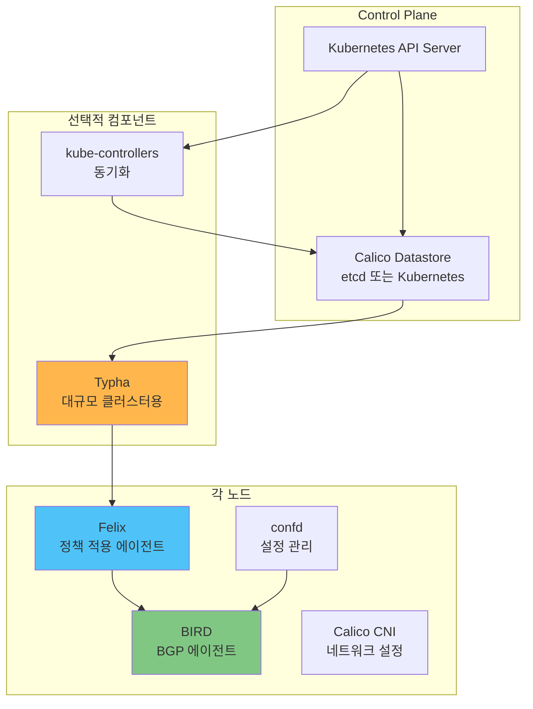
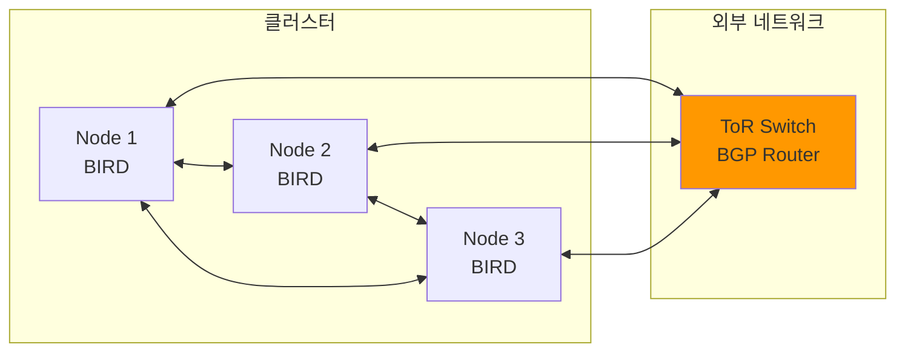
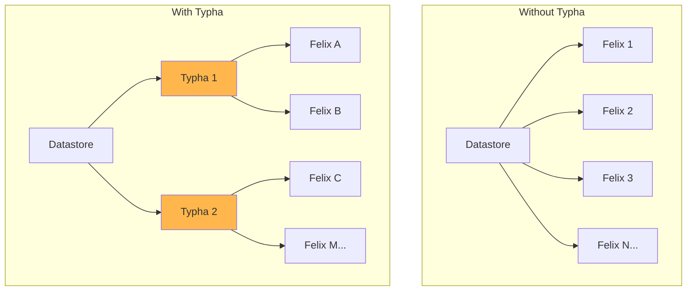
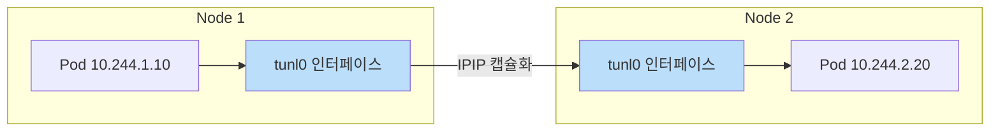
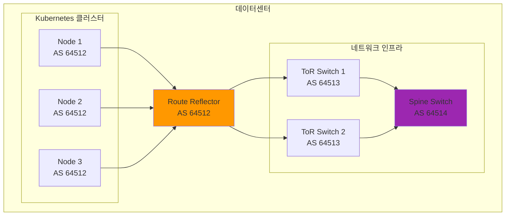
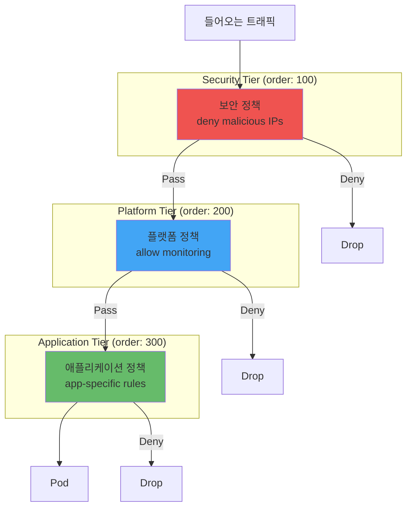
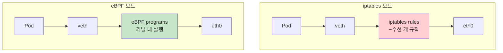
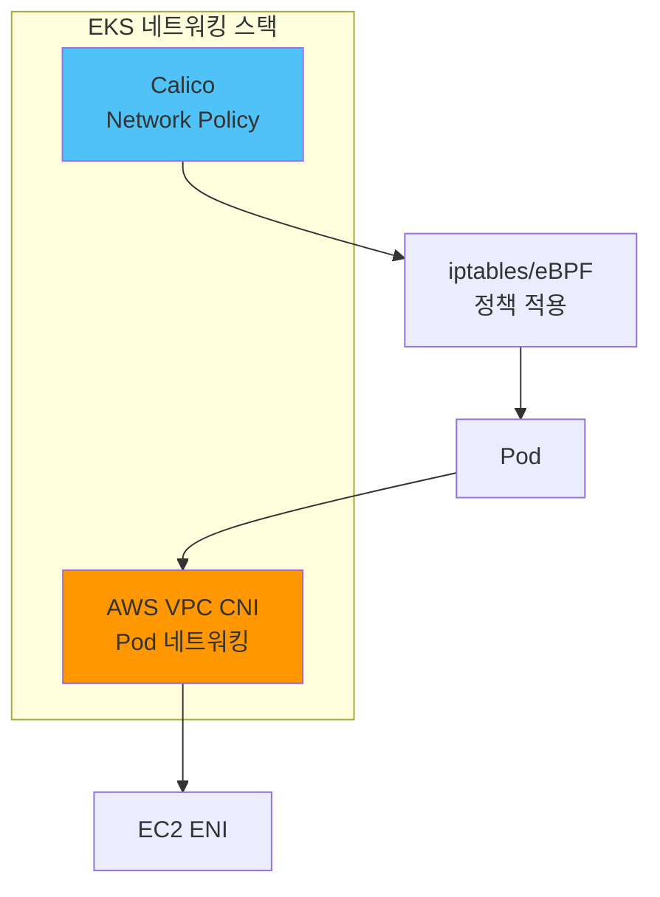

# Calico 네트워크 CNI

> **지원 버전**: Calico 3.28+
> **마지막 업데이트**: 2026년 2월 21일

## 개요

Calico는 Kubernetes, 가상 머신, 베어메탈 워크로드를 위한 오픈소스 네트워킹 및 네트워크 보안 솔루션입니다. Project Calico에서 시작하여 현재는 Tigera에서 관리하며, 전 세계적으로 가장 널리 사용되는 Kubernetes CNI 중 하나입니다.

### Calico의 주요 특징

- **고성능 네트워킹**: BGP 기반 라우팅, eBPF 데이터플레인
- **강력한 Network Policy**: Kubernetes 표준 + Calico 확장 정책
- **유연한 네트워킹 모드**: Overlay, Direct Routing, BGP
- **대규모 클러스터 지원**: Typha를 통한 수천 노드 확장
- **멀티 환경 지원**: 클라우드, 온프레미스, 하이브리드


## Calico 역사

| 연도 | 이벤트 |
|------|--------|
| 2014 | Metaswitch에서 Project Calico 시작 |
| 2016 | Tigera 설립, Calico 상업화 |
| 2017 | Calico 2.0 출시, Kubernetes 네이티브 지원 |
| 2019 | Calico Enterprise 출시 |
| 2020 | eBPF 데이터플레인 도입 |
| 2022 | Calico Cloud 서비스 출시 |
| 2024 | Calico 3.28 - 향상된 eBPF 및 Windows 지원 |

## 아키텍처

Calico는 여러 핵심 컴포넌트로 구성됩니다.



### 핵심 컴포넌트

#### 1. Felix

Felix는 각 노드에서 실행되는 핵심 에이전트입니다.

**주요 역할:**
- 인터페이스 관리 (Pod veth pair 생성)
- 라우팅 테이블 프로그래밍
- iptables/eBPF 규칙 관리
- Network Policy 적용

```yaml
# Felix 설정 예시
apiVersion: projectcalico.org/v3
kind: FelixConfiguration
metadata:
  name: default
spec:
  # eBPF 모드 활성화
  bpfEnabled: true
  bpfDataIfacePattern: "^(en.*|eth.*)"

  # 로깅 설정
  logSeverityScreen: Info
  logSeverityFile: Warning

  # IP 자동 감지
  ipAutoDetectionMethod: "kubernetes-internal-ip"

  # 플로우 로그
  flowLogsFlushInterval: "15s"
  flowLogsFileEnabled: true

  # 헬스체크
  healthEnabled: true
  healthPort: 9099

  # 성능 튜닝
  iptablesRefreshInterval: "90s"
  routeRefreshInterval: "90s"
```

#### 2. BIRD

BIRD (BIRD Internet Routing Daemon)는 BGP 라우팅을 담당합니다.

**주요 역할:**
- BGP 피어 연결 관리
- 라우트 교환 및 전파
- Route Reflector 기능



#### 3. confd

confd는 BIRD 설정 파일을 동적으로 생성합니다.

**주요 역할:**
- BGP 설정 템플릿 처리
- 노드/피어 변경 감지
- BIRD 설정 자동 업데이트

#### 4. Typha

Typha는 대규모 클러스터(50+ 노드)에서 필수적인 컴포넌트입니다.

**주요 역할:**
- 데이터스토어 연결 집계
- Felix에게 캐시된 데이터 제공
- API 서버 부하 감소



```yaml
# Typha 배포 설정
apiVersion: apps/v1
kind: Deployment
metadata:
  name: calico-typha
  namespace: calico-system
spec:
  replicas: 3  # 노드 수에 따라 조정
  selector:
    matchLabels:
      k8s-app: calico-typha
  template:
    metadata:
      labels:
        k8s-app: calico-typha
    spec:
      tolerations:
        - key: CriticalAddonsOnly
          operator: Exists
      containers:
        - name: calico-typha
          image: calico/typha:v3.28.0
          ports:
            - containerPort: 5473
              name: calico-typha
          env:
            - name: TYPHA_LOGSEVERITYSCREEN
              value: "info"
            - name: TYPHA_DATASTORETYPE
              value: "kubernetes"
            - name: TYPHA_MAXCONNECTIONSLOWERLIMIT
              value: "100"
            - name: TYPHA_CONNECTIONREBALANCINGMODE
              value: "kubernetes"
          resources:
            requests:
              cpu: 200m
              memory: 256Mi
            limits:
              cpu: 1000m
              memory: 512Mi
          livenessProbe:
            httpGet:
              path: /liveness
              port: 9098
            periodSeconds: 30
          readinessProbe:
            httpGet:
              path: /readiness
              port: 9098
            periodSeconds: 10
```

#### 5. kube-controllers

kube-controllers는 Kubernetes와 Calico 데이터스토어 간 동기화를 담당합니다.

**포함된 컨트롤러:**
- Policy Controller: NetworkPolicy 동기화
- Namespace Controller: 네임스페이스 프로필 관리
- ServiceAccount Controller: 서비스 계정 동기화
- WorkloadEndpoint Controller: 엔드포인트 정리
- Node Controller: 노드 정보 동기화

## 네트워킹 모드

Calico는 여러 네트워킹 모드를 지원합니다.

### 1. IPIP (IP-in-IP) 모드

IP 패킷을 다른 IP 패킷 내에 캡슐화합니다.



```yaml
# IPIP 모드 설정
apiVersion: projectcalico.org/v3
kind: IPPool
metadata:
  name: default-ipv4-ippool
spec:
  cidr: 10.244.0.0/16
  ipipMode: Always  # Always, CrossSubnet, Never
  vxlanMode: Never
  natOutgoing: true
  nodeSelector: all()
```

**IPIP 모드 옵션:**

| 옵션 | 설명 | 사용 사례 |
|------|------|----------|
| `Always` | 항상 IPIP 캡슐화 | 복잡한 네트워크, 클라우드 환경 |
| `CrossSubnet` | 다른 서브넷만 캡슐화 | 하이브리드 환경 |
| `Never` | IPIP 비활성화 | BGP 직접 라우팅 |

### 2. VXLAN 모드

Virtual Extensible LAN을 사용한 오버레이 네트워크입니다.

```yaml
# VXLAN 모드 설정
apiVersion: projectcalico.org/v3
kind: IPPool
metadata:
  name: default-ipv4-ippool
spec:
  cidr: 10.244.0.0/16
  ipipMode: Never
  vxlanMode: Always  # Always, CrossSubnet, Never
  natOutgoing: true
  nodeSelector: all()
```

**IPIP vs VXLAN 비교:**

| 특성 | IPIP | VXLAN |
|------|------|-------|
| 오버헤드 | 20 bytes | 50 bytes |
| 성능 | 더 좋음 | 약간 낮음 |
| 호환성 | IP 프로토콜 4 필요 | UDP 기반, 더 호환성 좋음 |
| Azure 지원 | 제한적 | 지원 |
| 하드웨어 오프로드 | 제한적 | 광범위 지원 |

### 3. Direct / Unencapsulated 모드

캡슐화 없이 직접 라우팅합니다. BGP와 함께 사용됩니다.

```yaml
# Direct 라우팅 설정
apiVersion: projectcalico.org/v3
kind: IPPool
metadata:
  name: direct-routing-pool
spec:
  cidr: 10.244.0.0/16
  ipipMode: Never
  vxlanMode: Never
  natOutgoing: false
  nodeSelector: all()
```

### 4. BGP 피어링

외부 라우터와 BGP 연결을 설정합니다.



#### Global BGP Peer 설정

```yaml
# 글로벌 BGP 피어 (모든 노드에 적용)
apiVersion: projectcalico.org/v3
kind: BGPPeer
metadata:
  name: global-tor-peer
spec:
  peerIP: 192.168.1.1
  asNumber: 64513
  # 모든 노드가 이 피어와 연결
---
# 특정 노드에만 적용
apiVersion: projectcalico.org/v3
kind: BGPPeer
metadata:
  name: rack1-tor-peer
spec:
  peerIP: 192.168.1.1
  asNumber: 64513
  nodeSelector: "rack == 'rack1'"
  # rack1의 노드만 이 피어와 연결
```

#### BGPConfiguration 설정

```yaml
apiVersion: projectcalico.org/v3
kind: BGPConfiguration
metadata:
  name: default
spec:
  # 로컬 AS 번호
  asNumber: 64512

  # Service External IP 광고
  serviceExternalIPs:
    - cidr: 203.0.113.0/24

  # Service LoadBalancer IP 광고
  serviceLoadBalancerIPs:
    - cidr: 198.51.100.0/24

  # Service ClusterIP 광고 (선택)
  serviceClusterIPs:
    - cidr: 10.96.0.0/12

  # Node-to-Node mesh 비활성화 (Route Reflector 사용 시)
  nodeToNodeMeshEnabled: false

  # 커뮤니티 태그
  communities:
    - name: internal
      value: "64512:100"

  # 접두사 광고 설정
  prefixAdvertisements:
    - cidr: 10.244.0.0/16
      communities:
        - internal
```

#### Route Reflector 설정

대규모 클러스터에서는 full-mesh BGP 대신 Route Reflector를 사용합니다.

```yaml
# Route Reflector 노드 레이블 지정
# kubectl label node rr-node-1 route-reflector=true

# Route Reflector 설정
apiVersion: projectcalico.org/v3
kind: BGPPeer
metadata:
  name: node-to-rr
spec:
  nodeSelector: "!has(route-reflector)"
  peerSelector: "has(route-reflector)"
---
apiVersion: projectcalico.org/v3
kind: BGPPeer
metadata:
  name: rr-mesh
spec:
  nodeSelector: "has(route-reflector)"
  peerSelector: "has(route-reflector)"
---
# Route Reflector 노드 설정
apiVersion: projectcalico.org/v3
kind: Node
metadata:
  name: rr-node-1
  labels:
    route-reflector: "true"
spec:
  bgp:
    routeReflectorClusterID: 244.0.0.1
```

## Network Policy 심화

### Kubernetes 표준 NetworkPolicy

```yaml
# 기본 NetworkPolicy 예시
apiVersion: networking.k8s.io/v1
kind: NetworkPolicy
metadata:
  name: allow-frontend-to-backend
  namespace: production
spec:
  podSelector:
    matchLabels:
      app: backend
  policyTypes:
    - Ingress
  ingress:
    - from:
        - podSelector:
            matchLabels:
              app: frontend
      ports:
        - protocol: TCP
          port: 8080
```

### Calico NetworkPolicy (확장)

Calico는 Kubernetes NetworkPolicy를 확장하여 더 많은 기능을 제공합니다.

```yaml
# Calico 확장 NetworkPolicy
apiVersion: projectcalico.org/v3
kind: NetworkPolicy
metadata:
  name: advanced-policy
  namespace: production
spec:
  selector: app == 'backend'

  # Policy 순서 (낮을수록 먼저 평가)
  order: 100

  # Ingress 규칙
  ingress:
    - action: Allow
      protocol: TCP
      source:
        selector: app == 'frontend'
      destination:
        ports:
          - 8080

    # HTTP 메서드 기반 (L7)
    - action: Allow
      protocol: TCP
      source:
        selector: app == 'api-gateway'
      destination:
        ports:
          - 8080
      http:
        methods: ["GET", "POST"]
        paths:
          - prefix: "/api/v1/"

  # Egress 규칙
  egress:
    # DNS 허용
    - action: Allow
      protocol: UDP
      destination:
        selector: k8s-app == 'kube-dns'
        ports:
          - 53

    # 외부 데이터베이스
    - action: Allow
      protocol: TCP
      destination:
        nets:
          - 10.0.100.0/24
        ports:
          - 5432

    # FQDN 기반 허용
    - action: Allow
      protocol: TCP
      destination:
        domains:
          - "*.amazonaws.com"
        ports:
          - 443
```

### GlobalNetworkPolicy

클러스터 전체에 적용되는 정책입니다.

```yaml
apiVersion: projectcalico.org/v3
kind: GlobalNetworkPolicy
metadata:
  name: default-deny
spec:
  # 모든 Pod에 적용
  selector: all()

  # Host Endpoint에도 적용
  applyOnForward: true

  # 정책 순서
  order: 1000

  types:
    - Ingress
    - Egress

  # 기본 거부 - 아무 규칙도 없음
---
apiVersion: projectcalico.org/v3
kind: GlobalNetworkPolicy
metadata:
  name: allow-dns
spec:
  selector: all()
  order: 100

  egress:
    - action: Allow
      protocol: UDP
      destination:
        ports:
          - 53

    - action: Allow
      protocol: TCP
      destination:
        ports:
          - 53
---
apiVersion: projectcalico.org/v3
kind: GlobalNetworkPolicy
metadata:
  name: deny-external-egress
spec:
  selector: "!has(internet-access)"
  order: 200

  egress:
    - action: Deny
      destination:
        notNets:
          - 10.0.0.0/8
          - 172.16.0.0/12
          - 192.168.0.0/16
```

### NetworkSet

IP 주소 집합을 정의하여 재사용합니다.

```yaml
# 외부 서비스 IP 집합
apiVersion: projectcalico.org/v3
kind: NetworkSet
metadata:
  name: external-databases
  namespace: production
  labels:
    service-type: database
spec:
  nets:
    - 10.0.100.10/32  # Primary DB
    - 10.0.100.11/32  # Secondary DB
    - 10.0.100.12/32  # Analytics DB
---
# GlobalNetworkSet (클러스터 전역)
apiVersion: projectcalico.org/v3
kind: GlobalNetworkSet
metadata:
  name: trusted-partners
  labels:
    partner: trusted
spec:
  nets:
    - 203.0.113.0/24
    - 198.51.100.0/24
```

```yaml
# NetworkSet 참조하는 정책
apiVersion: projectcalico.org/v3
kind: NetworkPolicy
metadata:
  name: allow-db-access
  namespace: production
spec:
  selector: app == 'backend'
  egress:
    - action: Allow
      protocol: TCP
      destination:
        selector: service-type == 'database'
        namespaceSelector: projectcalico.org/name == 'production'
        ports:
          - 5432
```

### Tier 기반 정책

정책을 계층화하여 관리합니다.

```yaml
# Tier 생성
apiVersion: projectcalico.org/v3
kind: Tier
metadata:
  name: security
spec:
  order: 100
---
apiVersion: projectcalico.org/v3
kind: Tier
metadata:
  name: platform
spec:
  order: 200
---
apiVersion: projectcalico.org/v3
kind: Tier
metadata:
  name: application
spec:
  order: 300
```



```yaml
# Security Tier 정책
apiVersion: projectcalico.org/v3
kind: GlobalNetworkPolicy
metadata:
  name: security.block-malicious
spec:
  tier: security
  order: 10
  selector: all()
  ingress:
    - action: Deny
      source:
        selector: "global(name == 'blocked-ips')"
    - action: Pass  # 다음 Tier로 전달
---
# Platform Tier 정책
apiVersion: projectcalico.org/v3
kind: GlobalNetworkPolicy
metadata:
  name: platform.allow-monitoring
spec:
  tier: platform
  order: 10
  selector: all()
  ingress:
    - action: Allow
      source:
        namespaceSelector: "projectcalico.org/name == 'monitoring'"
    - action: Pass
---
# Application Tier 정책
apiVersion: projectcalico.org/v3
kind: NetworkPolicy
metadata:
  name: application.frontend-policy
  namespace: production
spec:
  tier: application
  order: 10
  selector: app == 'frontend'
  ingress:
    - action: Allow
      source:
        selector: app == 'load-balancer'
```

## eBPF 모드 vs iptables 모드

### 데이터플레인 비교



### 성능 비교

| 항목 | iptables | eBPF |
|------|----------|------|
| **처리량** | 기준 | +20~40% |
| **지연 시간** | 기준 | -20~30% |
| **CPU 사용량** | 높음 (규칙 수에 비례) | 낮음 (일정) |
| **확장성** | 규칙 수 증가 시 저하 | 일정한 성능 |
| **Policy 평가** | 선형 검색 | 최적화된 맵 |

### eBPF 모드 활성화

```yaml
# FelixConfiguration에서 eBPF 활성화
apiVersion: projectcalico.org/v3
kind: FelixConfiguration
metadata:
  name: default
spec:
  bpfEnabled: true

  # Direct Server Return (DSR) 활성화
  bpfExternalServiceMode: "DSR"

  # kube-proxy 대체
  bpfKubeProxyIptablesCleanupEnabled: true

  # 데이터 인터페이스 패턴
  bpfDataIfacePattern: "^(en.*|eth.*|ens.*)"

  # 로그 레벨
  bpfLogLevel: "Info"

  # 연결 추적 테이블 크기
  bpfConnectTimeLoadBalancingEnabled: true
```

```bash
# eBPF 활성화 후 kube-proxy 비활성화
kubectl patch ds -n kube-system kube-proxy -p '{"spec": {"template": {"spec": {"nodeSelector": {"non-existing": "true"}}}}}'

# 또는 kube-proxy DaemonSet 삭제
kubectl delete ds kube-proxy -n kube-system
```

### eBPF 모드 요구사항

- Linux 커널 5.3+ (권장 5.8+)
- x86_64 또는 ARM64 아키텍처
- BTF (BPF Type Format) 지원
- 호스트의 `/sys/fs/bpf` 마운트

## EKS 통합

### VPC CNI + Calico 조합

EKS에서는 AWS VPC CNI로 네트워킹을, Calico로 Network Policy를 처리할 수 있습니다.



#### 설치 방법

```bash
# 1. EKS 클러스터 생성 (VPC CNI 기본 포함)
eksctl create cluster \
  --name my-cluster \
  --region ap-northeast-2 \
  --nodegroup-name standard-workers \
  --node-type m5.large \
  --nodes 3

# 2. Calico 설치 (Policy only 모드)
kubectl create -f https://raw.githubusercontent.com/projectcalico/calico/v3.28.0/manifests/calico-policy-only.yaml

# 또는 Helm으로 설치
helm repo add projectcalico https://docs.tigera.io/calico/charts
helm install calico projectcalico/tigera-operator \
  --namespace tigera-operator \
  --create-namespace \
  --set installation.kubernetesProvider=EKS \
  --set installation.cni.type=AmazonVPC
```

```yaml
# Helm values.yaml (EKS용)
installation:
  kubernetesProvider: EKS
  cni:
    type: AmazonVPC
  calicoNetwork:
    # VPC CNI 사용하므로 BGP/IPAM 비활성화
    bgp: Disabled

# Typha 활성화 (50+ 노드 시)
typhaDeployment:
  replicas: 3
```

### EKS Network Policy 컨트롤러

EKS v1.25+에서는 네이티브 Network Policy 지원이 포함됩니다.

```yaml
# EKS 애드온으로 Network Policy 활성화
apiVersion: eksctl.io/v1alpha5
kind: ClusterConfig
metadata:
  name: my-cluster
  region: ap-northeast-2
addons:
  - name: vpc-cni
    version: latest
    configurationValues: |
      enableNetworkPolicy: "true"
```

## Cilium과 비교

| 기능 | Calico | Cilium |
|------|--------|--------|
| **핵심 기술** | iptables/eBPF | eBPF |
| **성숙도** | 매우 높음 | 높음 |
| **Network Policy** | L3-L4 (L7은 Enterprise) | L3-L7 |
| **Service Mesh** | 별도 (Enterprise) | 내장 |
| **BGP 지원** | 강력함 | 지원 |
| **관측성** | 기본 | Hubble (강력함) |
| **Windows 지원** | 완전 지원 | 베타 |
| **커뮤니티** | 매우 크고 활발 | 빠르게 성장 |
| **엔터프라이즈** | Calico Enterprise | Cilium Enterprise |
| **학습 곡선** | 중간 | 높음 |
| **문서화** | 우수 | 우수 |

### 선택 가이드

**Calico 선택:**
- BGP 기반 온프레미스 환경
- Windows 워크로드 필요
- 성숙한 솔루션 선호
- 엔터프라이즈 지원 필요

**Cilium 선택:**
- L7 Network Policy 필수
- Service Mesh 내장 필요
- 고급 관측성 필요
- 최신 eBPF 기능 활용

## 설치

### Operator 설치 (권장)

```bash
# Tigera Operator 설치
kubectl create -f https://raw.githubusercontent.com/projectcalico/calico/v3.28.0/manifests/tigera-operator.yaml

# Installation 리소스 적용
kubectl create -f - <<EOF
apiVersion: operator.tigera.io/v1
kind: Installation
metadata:
  name: default
spec:
  # 기본 설정
  calicoNetwork:
    bgp: Enabled
    ipPools:
      - cidr: 10.244.0.0/16
        encapsulation: VXLANCrossSubnet
        natOutgoing: Enabled
        nodeSelector: all()

  # 컴포넌트 리소스
  componentResources:
    - componentName: Node
      resourceRequirements:
        requests:
          cpu: 200m
          memory: 256Mi
        limits:
          cpu: 1000m
          memory: 512Mi

    - componentName: Typha
      resourceRequirements:
        requests:
          cpu: 100m
          memory: 128Mi
        limits:
          cpu: 500m
          memory: 256Mi

  # Typha 배포 (자동)
  typhaDeployment:
    spec:
      minReadySeconds: 10
EOF
```

### Manifest 설치

```bash
# 전체 Calico 설치 (self-managed)
kubectl apply -f https://raw.githubusercontent.com/projectcalico/calico/v3.28.0/manifests/calico.yaml
```

### Helm 설치

```bash
# Helm repo 추가
helm repo add projectcalico https://docs.tigera.io/calico/charts
helm repo update

# 설치
helm install calico projectcalico/tigera-operator \
  --namespace tigera-operator \
  --create-namespace \
  --version v3.28.0 \
  -f values.yaml
```

```yaml
# values.yaml 예시
installation:
  calicoNetwork:
    bgp: Enabled
    ipPools:
      - cidr: 10.244.0.0/16
        encapsulation: VXLANCrossSubnet
        natOutgoing: Enabled
    nodeAddressAutodetectionV4:
      kubernetes: NodeInternalIP

  # eBPF 활성화
  # calicoNetwork:
  #   linuxDataplane: BPF

  # 컴포넌트 커스터마이징
  nodeUpdateStrategy:
    rollingUpdate:
      maxUnavailable: 1

# API Server 활성화 (Calico Enterprise 기능)
# apiServer:
#   enabled: true
```

### 설치 검증

```bash
# Calico 컴포넌트 상태 확인
kubectl get pods -n calico-system

# 또는 kube-system (manifest 설치의 경우)
kubectl get pods -n kube-system -l k8s-app=calico-node

# Installation 상태 확인
kubectl get installation default -o yaml

# calicoctl로 노드 상태 확인
calicoctl node status

# BGP 피어 상태 확인
calicoctl get bgppeer
calicoctl get node -o wide
```

## 트러블슈팅

### 일반적인 문제

#### 1. Pod가 IP를 받지 못함

```bash
# calico-node 로그 확인
kubectl logs -n calico-system -l k8s-app=calico-node -c calico-node

# IPAM 블록 확인
calicoctl ipam show
calicoctl ipam show --show-blocks

# IP Pool 확인
calicoctl get ippool -o yaml
```

#### 2. Pod 간 통신 실패

```bash
# 라우팅 테이블 확인
kubectl exec -n calico-system <calico-node-pod> -- ip route

# BIRD 상태 확인
kubectl exec -n calico-system <calico-node-pod> -c calico-node -- birdcl show protocols

# Felix 로그 확인
kubectl logs -n calico-system -l k8s-app=calico-node -c calico-node | grep -i felix
```

#### 3. Network Policy가 작동하지 않음

```bash
# Policy 목록 확인
calicoctl get networkpolicy -A
calicoctl get globalnetworkpolicy

# 특정 Pod의 엔드포인트 확인
calicoctl get workloadendpoint -n <namespace>

# Felix가 Policy를 인식하는지 확인
kubectl exec -n calico-system <calico-node-pod> -c calico-node -- \
  calico-node -felix-live
```

#### 4. BGP 피어링 실패

```bash
# BGP 피어 상태 확인
calicoctl node status

# BIRD 로그 확인
kubectl exec -n calico-system <calico-node-pod> -c calico-node -- \
  cat /var/log/calico/bird/current

# BGP 설정 확인
calicoctl get bgpconfig default -o yaml
calicoctl get bgppeer -o yaml
```

### calicoctl 설치

```bash
# Linux
curl -L https://github.com/projectcalico/calico/releases/download/v3.28.0/calicoctl-linux-amd64 -o calicoctl
chmod +x calicoctl
sudo mv calicoctl /usr/local/bin/

# macOS
curl -L https://github.com/projectcalico/calico/releases/download/v3.28.0/calicoctl-darwin-amd64 -o calicoctl
chmod +x calicoctl
sudo mv calicoctl /usr/local/bin/

# 데이터스토어 설정 (Kubernetes API)
export DATASTORE_TYPE=kubernetes
export KUBECONFIG=~/.kube/config
```

## 모범 사례

### 1. 대규모 클러스터 구성

```yaml
# 50+ 노드 클러스터용 설정
apiVersion: operator.tigera.io/v1
kind: Installation
metadata:
  name: default
spec:
  typhaDeployment:
    spec:
      minReadySeconds: 10
      template:
        spec:
          containers:
            - name: calico-typha
              resources:
                requests:
                  cpu: 200m
                  memory: 256Mi
                limits:
                  cpu: 1000m
                  memory: 512Mi

  # Typha 복제본 수 (노드 수 / 200, 최소 3)
  # typhaDeployment:
  #   replicas: 3

  calicoNetwork:
    # Route Reflector 사용
    bgp: Enabled
```

### 2. 보안 강화

```yaml
# 기본 거부 정책
apiVersion: projectcalico.org/v3
kind: GlobalNetworkPolicy
metadata:
  name: default-deny
spec:
  selector: all()
  types:
    - Ingress
    - Egress
---
# 필수 트래픽만 허용
apiVersion: projectcalico.org/v3
kind: GlobalNetworkPolicy
metadata:
  name: allow-essential
spec:
  selector: all()
  order: 100
  egress:
    # DNS
    - action: Allow
      protocol: UDP
      destination:
        ports: [53]
    # Kubernetes API
    - action: Allow
      protocol: TCP
      destination:
        nets: ["10.96.0.1/32"]
        ports: [443]
```

### 3. 관측성 설정

```yaml
# Felix 플로우 로그 활성화
apiVersion: projectcalico.org/v3
kind: FelixConfiguration
metadata:
  name: default
spec:
  flowLogsFlushInterval: "15s"
  flowLogsFileEnabled: true
  flowLogsFileDirectory: "/var/log/calico/flowlogs"
  flowLogsFileMaxFiles: 5
  flowLogsFileMaxFileSizeMb: 100

  # Prometheus 메트릭
  prometheusMetricsEnabled: true
  prometheusMetricsPort: 9091
```

---

## 참고 자료

- [Calico 공식 문서](https://docs.tigera.io/calico/latest/about/)
- [Calico GitHub](https://github.com/projectcalico/calico)
- [Calico Network Policy 레퍼런스](https://docs.tigera.io/calico/latest/reference/resources/networkpolicy)
- [BGP 구성 가이드](https://docs.tigera.io/calico/latest/networking/configuring/bgp)
- [eBPF 데이터플레인](https://docs.tigera.io/calico/latest/operations/ebpf/)
