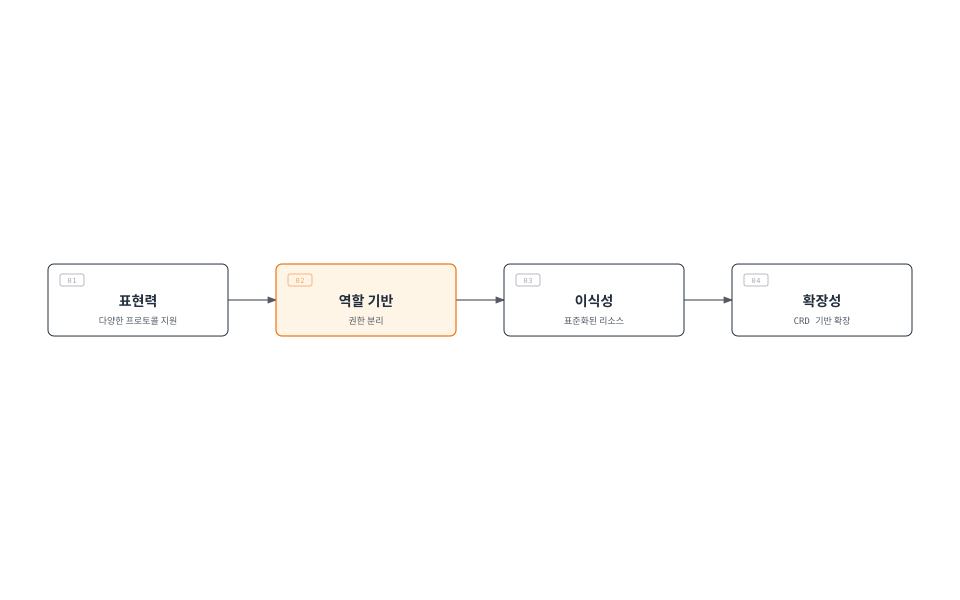
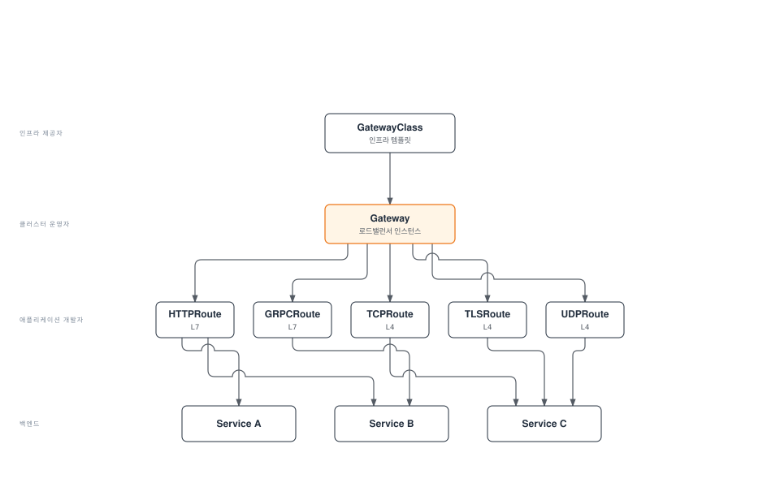

# Kubernetes Gateway API

> **지원 버전**: Gateway API v1.2+
> **마지막 업데이트**: 2026년 8월 10일

## 개요

Gateway API는 Kubernetes의 차세대 인그레스 API로, 기존 Ingress API의 한계를 극복하고 더 표현력 있고 확장 가능한 네트워크 라우팅 기능을 제공합니다. SIG-Network에서 개발하며, 다양한 구현체(Istio, Cilium, Envoy Gateway 등)에서 지원됩니다.

### Ingress API의 한계

| 문제 | 설명 |
|------|------|
| **표현력 부족** | HTTP 라우팅 외 TCP/UDP/gRPC 지원 미흡 |
| **역할 분리 불가** | 인프라 관리자와 애플리케이션 개발자 권한 구분 어려움 |
| **Annotation 남용** | 구현체별 기능을 annotation으로 처리하여 이식성 저하 |
| **확장성 제한** | 새로운 프로토콜이나 기능 추가 어려움 |
| **크로스 네임스페이스** | 네임스페이스 간 라우팅 복잡 |

### Gateway API의 장점



## 리소스 모델

Gateway API는 계층화된 리소스 모델을 사용합니다.



### 역할 분리

| 역할 | 담당 리소스 | 책임 |
|------|------------|------|
| **인프라 제공자** | GatewayClass | 기본 인프라 구성 정의 |
| **클러스터 운영자** | Gateway, ReferenceGrant | 로드밸런서 프로비저닝, 권한 관리 |
| **애플리케이션 개발자** | HTTPRoute, GRPCRoute 등 | 애플리케이션 라우팅 규칙 정의 |

## GatewayClass

GatewayClass는 Gateway를 생성할 때 사용할 컨트롤러와 설정을 정의합니다.

```yaml
apiVersion: gateway.networking.k8s.io/v1
kind: GatewayClass
metadata:
  name: istio
spec:
  # 이 GatewayClass를 처리할 컨트롤러
  controllerName: istio.io/gateway-controller

  # 컨트롤러별 파라미터 (선택)
  parametersRef:
    group: ""
    kind: ConfigMap
    name: istio-gateway-config
    namespace: istio-system

  # 설명
  description: "Istio Gateway Controller for production workloads"
```

### 주요 구현체별 GatewayClass

```yaml
# Istio
apiVersion: gateway.networking.k8s.io/v1
kind: GatewayClass
metadata:
  name: istio
spec:
  controllerName: istio.io/gateway-controller
---
# Cilium
apiVersion: gateway.networking.k8s.io/v1
kind: GatewayClass
metadata:
  name: cilium
spec:
  controllerName: io.cilium/gateway-controller
---
# AWS Gateway API Controller
apiVersion: gateway.networking.k8s.io/v1
kind: GatewayClass
metadata:
  name: amazon-vpc-lattice
spec:
  controllerName: application-networking.k8s.aws/gateway-api-controller
---
# Envoy Gateway
apiVersion: gateway.networking.k8s.io/v1
kind: GatewayClass
metadata:
  name: envoy-gateway
spec:
  controllerName: gateway.envoyproxy.io/gatewayclass-controller
---
# Contour
apiVersion: gateway.networking.k8s.io/v1
kind: GatewayClass
metadata:
  name: contour
spec:
  controllerName: projectcontour.io/gateway-controller
---
# NGINX Gateway Fabric
apiVersion: gateway.networking.k8s.io/v1
kind: GatewayClass
metadata:
  name: nginx
spec:
  controllerName: gateway.nginx.org/nginx-gateway-controller
```

## Gateway

Gateway는 실제 로드밸런서 인스턴스를 정의합니다.

### 기본 Gateway 설정

```yaml
apiVersion: gateway.networking.k8s.io/v1
kind: Gateway
metadata:
  name: production-gateway
  namespace: gateway-system
spec:
  # 사용할 GatewayClass
  gatewayClassName: istio

  # 리스너 설정
  listeners:
    # HTTP 리스너
    - name: http
      protocol: HTTP
      port: 80
      # 모든 네임스페이스의 Route 허용
      allowedRoutes:
        namespaces:
          from: All

    # HTTPS 리스너
    - name: https
      protocol: HTTPS
      port: 443
      tls:
        mode: Terminate
        certificateRefs:
          - kind: Secret
            name: tls-cert
            namespace: gateway-system
      allowedRoutes:
        namespaces:
          from: Selector
          selector:
            matchLabels:
              gateway-access: "true"

    # 특정 호스트 리스너
    - name: api
      protocol: HTTPS
      port: 443
      hostname: "api.example.com"
      tls:
        mode: Terminate
        certificateRefs:
          - kind: Secret
            name: api-tls-cert
      allowedRoutes:
        namespaces:
          from: Same

  # 주소 설정 (선택)
  addresses:
    - type: IPAddress
      value: "192.168.1.100"
```

### 고급 Gateway 설정

```yaml
apiVersion: gateway.networking.k8s.io/v1
kind: Gateway
metadata:
  name: multi-protocol-gateway
  namespace: gateway-system
  annotations:
    # 구현체별 annotation
    networking.istio.io/service-type: LoadBalancer
spec:
  gatewayClassName: istio

  listeners:
    # HTTP -> HTTPS 리다이렉트용
    - name: http-redirect
      protocol: HTTP
      port: 80
      allowedRoutes:
        namespaces:
          from: All

    # HTTPS 와일드카드
    - name: https-wildcard
      protocol: HTTPS
      port: 443
      hostname: "*.example.com"
      tls:
        mode: Terminate
        certificateRefs:
          - kind: Secret
            name: wildcard-cert
      allowedRoutes:
        namespaces:
          from: All
        kinds:
          - kind: HTTPRoute

    # gRPC 전용
    - name: grpc
      protocol: HTTPS
      port: 443
      hostname: "grpc.example.com"
      tls:
        mode: Terminate
        certificateRefs:
          - kind: Secret
            name: grpc-cert
      allowedRoutes:
        kinds:
          - kind: GRPCRoute

    # TCP 패스스루
    - name: tcp-passthrough
      protocol: TLS
      port: 8443
      tls:
        mode: Passthrough
      allowedRoutes:
        kinds:
          - kind: TLSRoute

    # TCP
    - name: tcp
      protocol: TCP
      port: 9000
      allowedRoutes:
        kinds:
          - kind: TCPRoute
```

### TLS 모드

| 모드 | 설명 | 사용 사례 |
|------|------|----------|
| **Terminate** | Gateway에서 TLS 종료 | 일반적인 HTTPS |
| **Passthrough** | TLS를 백엔드로 전달 | End-to-end 암호화 |

```yaml
# TLS Terminate 예시
listeners:
  - name: https
    protocol: HTTPS
    port: 443
    tls:
      mode: Terminate
      certificateRefs:
        - kind: Secret
          name: server-cert
---
# TLS Passthrough 예시
listeners:
  - name: tls-passthrough
    protocol: TLS
    port: 443
    tls:
      mode: Passthrough
```

## HTTPRoute

HTTPRoute는 HTTP/HTTPS 트래픽의 라우팅 규칙을 정의합니다.

### 기본 HTTPRoute

```yaml
apiVersion: gateway.networking.k8s.io/v1
kind: HTTPRoute
metadata:
  name: basic-route
  namespace: production
spec:
  # 연결할 Gateway
  parentRefs:
    - name: production-gateway
      namespace: gateway-system
      sectionName: https  # 특정 리스너 지정

  # 호스트 매칭
  hostnames:
    - "api.example.com"
    - "www.example.com"

  # 라우팅 규칙
  rules:
    - matches:
        - path:
            type: PathPrefix
            value: /api/v1
      backendRefs:
        - name: api-v1-service
          port: 80

    - matches:
        - path:
            type: PathPrefix
            value: /api/v2
      backendRefs:
        - name: api-v2-service
          port: 80

    # 기본 경로
    - backendRefs:
        - name: default-service
          port: 80
```

### 고급 매칭 규칙

```yaml
apiVersion: gateway.networking.k8s.io/v1
kind: HTTPRoute
metadata:
  name: advanced-matching
  namespace: production
spec:
  parentRefs:
    - name: production-gateway
      namespace: gateway-system

  hostnames:
    - "api.example.com"

  rules:
    # 정확한 경로 매칭
    - matches:
        - path:
            type: Exact
            value: /health
      backendRefs:
        - name: health-service
          port: 80

    # 정규식 경로 매칭 (구현체에 따라 지원)
    - matches:
        - path:
            type: RegularExpression
            value: "/users/[0-9]+"
      backendRefs:
        - name: user-service
          port: 80

    # 헤더 기반 라우팅
    - matches:
        - headers:
            - name: X-Version
              value: "v2"
      backendRefs:
        - name: api-v2-service
          port: 80

    # 쿼리 파라미터 기반
    - matches:
        - queryParams:
            - name: debug
              value: "true"
      backendRefs:
        - name: debug-service
          port: 80

    # HTTP 메서드 기반
    - matches:
        - method: POST
          path:
            type: PathPrefix
            value: /api/data
      backendRefs:
        - name: write-service
          port: 80

    - matches:
        - method: GET
          path:
            type: PathPrefix
            value: /api/data
      backendRefs:
        - name: read-service
          port: 80

    # 복합 조건 (AND)
    - matches:
        - path:
            type: PathPrefix
            value: /admin
          headers:
            - name: X-Admin-Token
              type: Exact
              value: "secret-token"
      backendRefs:
        - name: admin-service
          port: 80

    # 여러 조건 (OR)
    - matches:
        - path:
            type: PathPrefix
            value: /api
        - path:
            type: PathPrefix
            value: /v1
      backendRefs:
        - name: api-service
          port: 80
```

### 필터 (Filters)

필터를 사용하여 요청/응답을 수정할 수 있습니다.

```yaml
apiVersion: gateway.networking.k8s.io/v1
kind: HTTPRoute
metadata:
  name: filtered-route
  namespace: production
spec:
  parentRefs:
    - name: production-gateway
      namespace: gateway-system

  rules:
    # 요청 헤더 수정
    - matches:
        - path:
            type: PathPrefix
            value: /api
      filters:
        - type: RequestHeaderModifier
          requestHeaderModifier:
            add:
              - name: X-Request-ID
                value: "generated-id"
            set:
              - name: X-Forwarded-Proto
                value: "https"
            remove:
              - X-Internal-Header
      backendRefs:
        - name: api-service
          port: 80

    # 응답 헤더 수정
    - matches:
        - path:
            type: PathPrefix
            value: /public
      filters:
        - type: ResponseHeaderModifier
          responseHeaderModifier:
            add:
              - name: Cache-Control
                value: "public, max-age=3600"
            set:
              - name: X-Content-Type-Options
                value: "nosniff"
      backendRefs:
        - name: public-service
          port: 80

    # URL 리라이트
    - matches:
        - path:
            type: PathPrefix
            value: /old-api
      filters:
        - type: URLRewrite
          urlRewrite:
            path:
              type: ReplacePrefixMatch
              replacePrefixMatch: /new-api
            hostname: "new-api.example.com"
      backendRefs:
        - name: new-api-service
          port: 80

    # 리다이렉트
    - matches:
        - path:
            type: PathPrefix
            value: /legacy
      filters:
        - type: RequestRedirect
          requestRedirect:
            scheme: https
            hostname: "new.example.com"
            port: 443
            statusCode: 301
            path:
              type: ReplacePrefixMatch
              replacePrefixMatch: /modern

    # 미러링
    - matches:
        - path:
            type: PathPrefix
            value: /api
      filters:
        - type: RequestMirror
          requestMirror:
            backendRef:
              name: shadow-service
              port: 80
      backendRefs:
        - name: main-service
          port: 80
```

### 트래픽 분할 (가중치)

```yaml
apiVersion: gateway.networking.k8s.io/v1
kind: HTTPRoute
metadata:
  name: canary-route
  namespace: production
spec:
  parentRefs:
    - name: production-gateway
      namespace: gateway-system

  hostnames:
    - "app.example.com"

  rules:
    - matches:
        - path:
            type: PathPrefix
            value: /
      backendRefs:
        # 90% 트래픽은 stable 버전으로
        - name: app-stable
          port: 80
          weight: 90

        # 10% 트래픽은 canary 버전으로
        - name: app-canary
          port: 80
          weight: 10
```

### 타임아웃 및 재시도

```yaml
apiVersion: gateway.networking.k8s.io/v1
kind: HTTPRoute
metadata:
  name: resilient-route
  namespace: production
spec:
  parentRefs:
    - name: production-gateway
      namespace: gateway-system

  rules:
    - matches:
        - path:
            type: PathPrefix
            value: /api
      # 타임아웃 설정 (구현체에 따라 지원)
      timeouts:
        request: "30s"
        backendRequest: "25s"
      backendRefs:
        - name: api-service
          port: 80
```

## GRPCRoute

gRPC 트래픽을 위한 라우팅 규칙을 정의합니다.

```yaml
apiVersion: gateway.networking.k8s.io/v1
kind: GRPCRoute
metadata:
  name: grpc-route
  namespace: production
spec:
  parentRefs:
    - name: production-gateway
      namespace: gateway-system
      sectionName: grpc

  hostnames:
    - "grpc.example.com"

  rules:
    # 서비스별 라우팅
    - matches:
        - method:
            service: "myapp.UserService"
      backendRefs:
        - name: user-grpc-service
          port: 50051

    - matches:
        - method:
            service: "myapp.OrderService"
            method: "CreateOrder"
      backendRefs:
        - name: order-grpc-service
          port: 50052

    # 헤더 기반 라우팅
    - matches:
        - headers:
            - name: x-environment
              value: "staging"
      backendRefs:
        - name: staging-grpc-service
          port: 50051

    # 기본 라우팅
    - backendRefs:
        - name: default-grpc-service
          port: 50051
```

## TCPRoute

TCP 트래픽 라우팅을 정의합니다.

```yaml
# Gateway API v1.6부터 v1으로 GA (v1alpha2는 deprecated)
apiVersion: gateway.networking.k8s.io/v1
kind: TCPRoute
metadata:
  name: database-route
  namespace: production
spec:
  parentRefs:
    - name: production-gateway
      namespace: gateway-system
      sectionName: tcp

  rules:
    - backendRefs:
        - name: database-service
          port: 5432
---
# 멀티 백엔드 TCP 라우팅
apiVersion: gateway.networking.k8s.io/v1
kind: TCPRoute
metadata:
  name: tcp-loadbalance
  namespace: production
spec:
  parentRefs:
    - name: production-gateway
      namespace: gateway-system
      sectionName: tcp

  rules:
    - backendRefs:
        - name: tcp-backend-1
          port: 9000
          weight: 50
        - name: tcp-backend-2
          port: 9000
          weight: 50
```

## TLSRoute

TLS passthrough 트래픽 라우팅을 정의합니다.

```yaml
apiVersion: gateway.networking.k8s.io/v1alpha2
kind: TLSRoute
metadata:
  name: tls-passthrough-route
  namespace: production
spec:
  parentRefs:
    - name: production-gateway
      namespace: gateway-system
      sectionName: tcp-passthrough

  hostnames:
    - "secure.example.com"

  rules:
    - backendRefs:
        - name: secure-backend
          port: 8443
```

## UDPRoute

UDP 트래픽 라우팅을 정의합니다.

```yaml
# Gateway API v1.6부터 v1으로 GA (v1alpha2는 deprecated)
apiVersion: gateway.networking.k8s.io/v1
kind: UDPRoute
metadata:
  name: dns-route
  namespace: production
spec:
  parentRefs:
    - name: production-gateway
      namespace: gateway-system
      sectionName: udp

  rules:
    - backendRefs:
        - name: dns-service
          port: 53
```

## ReferenceGrant

ReferenceGrant를 사용하여 크로스 네임스페이스 참조를 허용합니다.

```yaml
# 다른 네임스페이스의 Route가 이 네임스페이스의 Service를 참조할 수 있도록 허용
apiVersion: gateway.networking.k8s.io/v1beta1
kind: ReferenceGrant
metadata:
  name: allow-routes-to-backend
  namespace: backend-services
spec:
  from:
    # production 네임스페이스의 HTTPRoute가
    - group: gateway.networking.k8s.io
      kind: HTTPRoute
      namespace: production
    # staging 네임스페이스의 HTTPRoute도
    - group: gateway.networking.k8s.io
      kind: HTTPRoute
      namespace: staging
  to:
    # 이 네임스페이스의 Service를 참조할 수 있음
    - group: ""
      kind: Service
---
# Gateway가 다른 네임스페이스의 Secret(TLS 인증서)을 참조할 수 있도록 허용
apiVersion: gateway.networking.k8s.io/v1beta1
kind: ReferenceGrant
metadata:
  name: allow-gateway-to-secrets
  namespace: cert-management
spec:
  from:
    - group: gateway.networking.k8s.io
      kind: Gateway
      namespace: gateway-system
  to:
    - group: ""
      kind: Secret
```

## 구현체 비교

### 주요 구현체

| 구현체 | 컨트롤러 | 특징 |
|--------|---------|------|
| **Istio** | istio.io/gateway-controller | Service Mesh 통합, 고급 트래픽 관리 |
| **Cilium** | io.cilium/gateway-controller | eBPF 기반, 고성능 |
| **Envoy Gateway** | gateway.envoyproxy.io/gatewayclass-controller | Envoy 기반, 표준 준수 |
| **AWS Gateway API Controller** | application-networking.k8s.aws/gateway-api-controller | VPC Lattice 통합 |
| **Contour** | projectcontour.io/gateway-controller | Envoy 기반, 간단한 설정 |
| **NGINX Gateway Fabric** | gateway.nginx.org/nginx-gateway-controller | NGINX 기반 |
| **Traefik** | traefik.io/gateway-controller | 동적 설정 |

### 기능 지원 현황

| 기능 | Istio | Cilium | Envoy GW | AWS | Contour |
|------|-------|--------|----------|-----|---------|
| HTTPRoute | ✅ | ✅ | ✅ | ✅ | ✅ |
| GRPCRoute | ✅ | ✅ | ✅ | ⚠️ | ✅ |
| TCPRoute | ✅ | ✅ | ✅ | ❌ | ✅ |
| TLSRoute | ✅ | ✅ | ✅ | ❌ | ✅ |
| UDPRoute | ✅ | ✅ | ⚠️ | ❌ | ❌ |
| ReferenceGrant | ✅ | ✅ | ✅ | ✅ | ✅ |
| 트래픽 분할 | ✅ | ✅ | ✅ | ✅ | ✅ |
| 헤더 수정 | ✅ | ✅ | ✅ | ⚠️ | ✅ |
| URL 리라이트 | ✅ | ✅ | ✅ | ⚠️ | ✅ |
| 미러링 | ✅ | ⚠️ | ✅ | ❌ | ✅ |

## AWS Load Balancer Controller의 Gateway API 지원 (v3.0 GA)

AWS Load Balancer Controller v3.0.0(2026년 1월)부터 Gateway API가 정식 GA로 전환되어, ALB/NLB를 GatewayClass/Gateway/HTTPRoute 역할 분리 모델로 선언적으로 관리할 수 있습니다.

- **배경**: NGINX Ingress Controller가 2026년 3월 지원 종료를 앞두고 있어, AWS는 LBC v3.0 + Gateway API를 네이티브 대안으로 제시했습니다.
- **하위 호환성**: 기존 Ingress/Service 리소스는 계속 지원되며, 즉시 전환이 필요하지 않고 점진적 이전이 가능합니다.
- **장점**: 헤더/쿼리 기반 라우팅, 가중치 분산(Blue/Green, Canary), TCP/UDP/gRPC까지 포괄하는 멀티프로토콜 설계
- **업그레이드 주의사항**: Helm으로 설치하고 `enableCertManager=true`를 사용 중이라면 업그레이드 전 `keepTLSSecret=false`로 설정해야 합니다(v3.0.0부터는 자동으로 처리됨).

### v3.4.0 마이그레이션 도구 (2026년 6월)

기존 ALB 기반 Ingress를 무중단으로 Gateway API로 전환하기 위한 도구가 추가되었습니다.

- **Ingress to Gateway Migration Tool**: 기존 ALB를 유지한 채 신규 Gateway API 리소스를 병행 생성해 무중단 전환을 지원
- **lbc-migrate CLI**: 기존 Ingress의 annotation, 라우팅 규칙, IngressGroup을 자동으로 Gateway API 리소스로 변환. `--from-cluster` 옵션으로 클러스터를 직접 분석 가능
- **Migration Console**: 웹 UI에서 마이그레이션 전 변환 결과를 검증

> **주의**: Gateway API + NLB 조합에서 동작이 변경되었습니다. 하나의 Listener에 여러 TCP/UDP/TLS Route가 연결되면 가장 오래된 Route만 트래픽을 수신합니다. 업그레이드 전 L4 Route 구성을 점검하세요.

(공통 출처: [AWS Load Balancer Controller Releases](https://github.com/kubernetes-sigs/aws-load-balancer-controller/releases))

## Ingress에서 Gateway API로 마이그레이션

### 단계별 마이그레이션 가이드

#### 1단계: 기존 Ingress 분석

```yaml
# 기존 Ingress
apiVersion: networking.k8s.io/v1
kind: Ingress
metadata:
  name: my-ingress
  annotations:
    kubernetes.io/ingress.class: "nginx"
    nginx.ingress.kubernetes.io/rewrite-target: /
    nginx.ingress.kubernetes.io/ssl-redirect: "true"
spec:
  tls:
    - hosts:
        - api.example.com
      secretName: api-tls
  rules:
    - host: api.example.com
      http:
        paths:
          - path: /api/v1
            pathType: Prefix
            backend:
              service:
                name: api-v1
                port:
                  number: 80
          - path: /api/v2
            pathType: Prefix
            backend:
              service:
                name: api-v2
                port:
                  number: 80
```

#### 2단계: Gateway 및 GatewayClass 생성

```yaml
# GatewayClass (인프라 관리자)
apiVersion: gateway.networking.k8s.io/v1
kind: GatewayClass
metadata:
  name: production
spec:
  controllerName: istio.io/gateway-controller
---
# Gateway (클러스터 운영자)
apiVersion: gateway.networking.k8s.io/v1
kind: Gateway
metadata:
  name: production-gateway
  namespace: gateway-system
spec:
  gatewayClassName: production
  listeners:
    - name: http
      protocol: HTTP
      port: 80
      allowedRoutes:
        namespaces:
          from: All
    - name: https
      protocol: HTTPS
      port: 443
      tls:
        mode: Terminate
        certificateRefs:
          - kind: Secret
            name: api-tls
            namespace: gateway-system
      allowedRoutes:
        namespaces:
          from: All
```

#### 3단계: HTTPRoute 생성

```yaml
# HTTPRoute (애플리케이션 개발자)
apiVersion: gateway.networking.k8s.io/v1
kind: HTTPRoute
metadata:
  name: api-route
  namespace: default
spec:
  parentRefs:
    - name: production-gateway
      namespace: gateway-system

  hostnames:
    - "api.example.com"

  rules:
    # HTTP -> HTTPS 리다이렉트
    - matches:
        - path:
            type: PathPrefix
            value: /
      filters:
        - type: RequestRedirect
          requestRedirect:
            scheme: https
            statusCode: 301

---
# HTTPS용 HTTPRoute
apiVersion: gateway.networking.k8s.io/v1
kind: HTTPRoute
metadata:
  name: api-route-https
  namespace: default
spec:
  parentRefs:
    - name: production-gateway
      namespace: gateway-system
      sectionName: https

  hostnames:
    - "api.example.com"

  rules:
    - matches:
        - path:
            type: PathPrefix
            value: /api/v1
      filters:
        - type: URLRewrite
          urlRewrite:
            path:
              type: ReplacePrefixMatch
              replacePrefixMatch: /
      backendRefs:
        - name: api-v1
          port: 80

    - matches:
        - path:
            type: PathPrefix
            value: /api/v2
      filters:
        - type: URLRewrite
          urlRewrite:
            path:
              type: ReplacePrefixMatch
              replacePrefixMatch: /
      backendRefs:
        - name: api-v2
          port: 80
```

#### 4단계: 점진적 전환

```yaml
# 트래픽 분할을 통한 점진적 전환
apiVersion: gateway.networking.k8s.io/v1
kind: HTTPRoute
metadata:
  name: gradual-migration
spec:
  parentRefs:
    - name: production-gateway
      namespace: gateway-system

  rules:
    - backendRefs:
        # 기존 서비스 (점진적 감소)
        - name: legacy-service
          port: 80
          weight: 90
        # 새 서비스 (점진적 증가)
        - name: new-service
          port: 80
          weight: 10
```

### 마이그레이션 체크리스트

- [ ] 기존 Ingress annotation 분석
- [ ] 해당 구현체 선택 및 GatewayClass 생성
- [ ] Gateway 리소스 생성 및 리스너 설정
- [ ] HTTPRoute로 라우팅 규칙 변환
- [ ] ReferenceGrant로 크로스 네임스페이스 접근 설정
- [ ] TLS 인증서 마이그레이션
- [ ] 트래픽 분할을 통한 점진적 전환
- [ ] 모니터링 및 로깅 설정
- [ ] 기존 Ingress 리소스 제거

## EKS 패턴

### AWS Gateway API Controller (VPC Lattice)

```yaml
# GatewayClass
apiVersion: gateway.networking.k8s.io/v1
kind: GatewayClass
metadata:
  name: amazon-vpc-lattice
spec:
  controllerName: application-networking.k8s.aws/gateway-api-controller
---
# Gateway (VPC Lattice Service Network에 매핑)
apiVersion: gateway.networking.k8s.io/v1
kind: Gateway
metadata:
  name: lattice-gateway
  namespace: default
spec:
  gatewayClassName: amazon-vpc-lattice
  listeners:
    - name: http
      protocol: HTTP
      port: 80
      allowedRoutes:
        namespaces:
          from: All
---
# HTTPRoute (VPC Lattice Service에 매핑)
apiVersion: gateway.networking.k8s.io/v1
kind: HTTPRoute
metadata:
  name: lattice-route
spec:
  parentRefs:
    - name: lattice-gateway
  rules:
    - backendRefs:
        - name: my-service
          port: 80
```

### ALB Controller와 함께 사용

```yaml
# Istio Gateway API + ALB Ingress 조합
apiVersion: gateway.networking.k8s.io/v1
kind: Gateway
metadata:
  name: internal-gateway
  namespace: istio-system
  annotations:
    # Internal Gateway
    networking.istio.io/service-type: ClusterIP
spec:
  gatewayClassName: istio
  listeners:
    - name: http
      protocol: HTTP
      port: 80
      allowedRoutes:
        namespaces:
          from: All
---
# ALB가 외부 트래픽을 받아 Gateway로 전달
apiVersion: networking.k8s.io/v1
kind: Ingress
metadata:
  name: alb-to-gateway
  annotations:
    alb.ingress.kubernetes.io/scheme: internet-facing
    alb.ingress.kubernetes.io/target-type: ip
spec:
  ingressClassName: alb
  rules:
    - host: "*.example.com"
      http:
        paths:
          - path: /
            pathType: Prefix
            backend:
              service:
                name: internal-gateway
                port:
                  number: 80
```

## API 채널 및 성숙도

Gateway API는 다양한 성숙도 수준의 기능을 제공합니다.

### 채널 구분

| 채널 | 성숙도 | 리소스 |
|------|--------|--------|
| **Standard** | GA | GatewayClass, Gateway, HTTPRoute, ReferenceGrant, TCPRoute, UDPRoute |
| **Experimental** | Beta/Alpha | GRPCRoute, TLSRoute |

### 버전 및 호환성

```yaml
# Standard 채널 (안정)
apiVersion: gateway.networking.k8s.io/v1
kind: HTTPRoute

# Experimental 채널
apiVersion: gateway.networking.k8s.io/v1alpha2
kind: TLSRoute
```

### 2026년 8월 업데이트: Gateway API v1.6 — TCPRoute·UDPRoute Standard 승격

Gateway API v1.6.0이 2026년 6월 30일 릴리스되었고, [2026년 8월 3일 Kubernetes 블로그에 공식 소개](https://kubernetes.io/blog/2026/08/03/gateway-api-v1-6-release/)되었습니다. 위 표와 관련해 중요한 변경 사항은 두 가지입니다.

- **TCPRoute와 UDPRoute가 Standard(GA)로 승격**: 두 리소스 모두 `gateway.networking.k8s.io/v1` API 버전으로 이동해, 데이터베이스·DNS·VoIP·게임 서버·IoT 텔레메트리 같은 순수 L4 워크로드에도 이식 가능한 안정 라우팅 모델이 생겼습니다. 각 리소스의 `v1alpha2` 버전은 v1.6부터 deprecated이며 향후 릴리스에서 제거됩니다.
- **Experimental API 그룹 분리**: 실험적 리소스는 별도 API 그룹인 `gateway.networking.x-k8s.io`로 이동하고 `X` 접두사(예: 신규 `XBackend` 리소스)를 사용해 Standard와 Experimental의 경계가 명확해졌습니다.

구현체들의 v1.6 채택도 빠르게 진행 중입니다. 예를 들어 Cilium 1.20(2026년 7월)은 TCPRoute/UDPRoute를 포함한 Gateway API v1.6.1 지원을 탑재했습니다.

## Ingress API 비교

| 기능 | Ingress | Gateway API |
|------|---------|-------------|
| **역할 분리** | ❌ | ✅ (3계층) |
| **HTTP 라우팅** | ✅ | ✅ |
| **TCP/UDP** | ❌ | ✅ |
| **gRPC** | ⚠️ annotation | ✅ 네이티브 |
| **TLS Passthrough** | ⚠️ 구현체 의존 | ✅ |
| **트래픽 분할** | ⚠️ annotation | ✅ 네이티브 |
| **헤더 기반 라우팅** | ⚠️ annotation | ✅ 네이티브 |
| **크로스 네임스페이스** | ⚠️ 제한적 | ✅ ReferenceGrant |
| **이식성** | ⚠️ annotation 의존 | ✅ 표준화 |
| **확장성** | ❌ | ✅ CRD |

## 모범 사례

### 1. 역할 분리 준수

```yaml
# 인프라 팀: GatewayClass 관리
# 플랫폼 팀: Gateway 관리
# 앱 팀: HTTPRoute 관리
```

### 2. ReferenceGrant 최소 권한

```yaml
# 필요한 네임스페이스만 명시적으로 허용
apiVersion: gateway.networking.k8s.io/v1beta1
kind: ReferenceGrant
metadata:
  name: minimal-access
  namespace: backend
spec:
  from:
    - group: gateway.networking.k8s.io
      kind: HTTPRoute
      namespace: frontend  # 특정 네임스페이스만
  to:
    - group: ""
      kind: Service
      name: specific-service  # 특정 서비스만
```

### 3. Gateway 분리

```yaml
# 환경별 Gateway 분리
# production-gateway, staging-gateway

# 프로토콜별 Gateway 분리
# http-gateway, grpc-gateway
```

### 4. 모니터링 설정

```yaml
# Prometheus 메트릭 수집 설정 (구현체별 상이)
# - 요청 수, 지연 시간, 오류율
# - 백엔드 상태
# - TLS 인증서 만료
```

---

## 참고 자료

- [Gateway API 공식 문서](https://gateway-api.sigs.k8s.io/)
- [Gateway API GitHub](https://github.com/kubernetes-sigs/gateway-api)
- [Istio Gateway API 지원](https://istio.io/latest/docs/tasks/traffic-management/ingress/gateway-api/)
- [Cilium Gateway API](https://docs.cilium.io/en/stable/network/servicemesh/gateway-api/)
- [AWS Gateway API Controller](https://www.gateway-api-controller.eks.aws.dev/)
- [Envoy Gateway](https://gateway.envoyproxy.io/)
