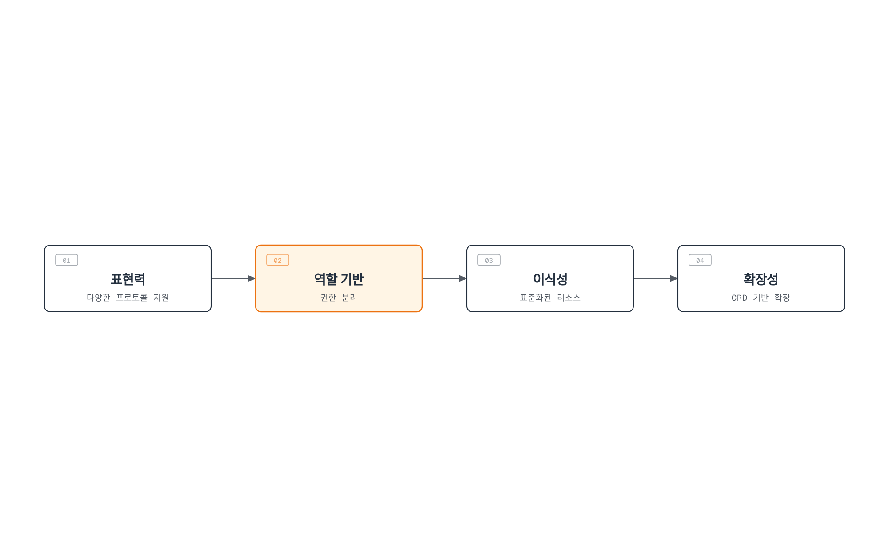
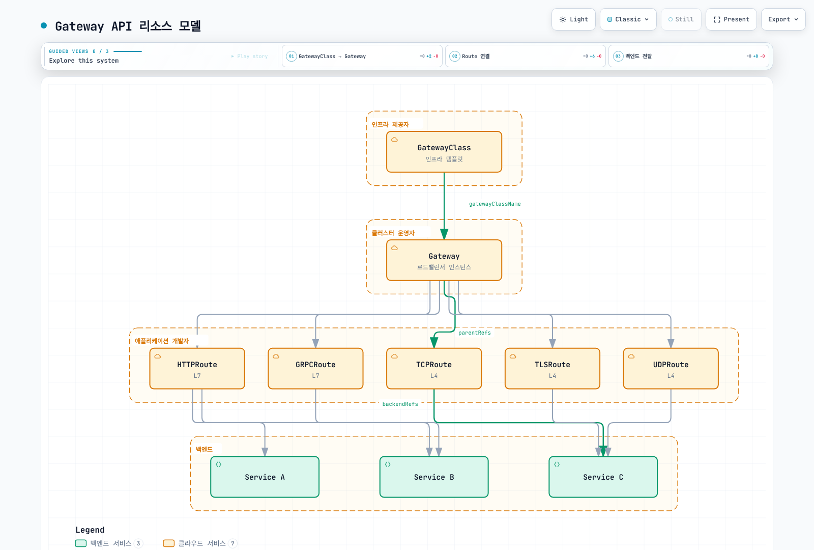

# Kubernetes Gateway API

> **API 기준**: Gateway API v1.6 Standard. 정확한 번들은 컨트롤러 지원 버전에 맞춰 선택하세요.
> **마지막 업데이트**: 2026년 9월 12일

## 개요

Gateway API는 Kubernetes의 차세대 인그레스 API로, 기존 Ingress API의 한계를 극복하고 더 표현력 있고 확장 가능한 네트워크 라우팅 기능을 제공합니다. SIG-Network에서 개발하며, 다양한 구현체(Istio, Cilium, Envoy Gateway 등)에서 지원됩니다.

### Ingress API의 한계

| 문제 | 설명 |
|------|------|
| **표현력 부족** | HTTP 라우팅 외 TCP/UDP/gRPC 지원 미흡 |
| **책임 결합** | RBAC/IngressClass로 접근을 제한할 수 있지만 리스너·경로 책임이 덜 명시적으로 분리됨 |
| **Annotation 남용** | 구현체별 기능을 annotation으로 처리하여 이식성 저하 |
| **확장성 제한** | 새로운 프로토콜이나 기능 추가 어려움 |
| **크로스 네임스페이스** | 네임스페이스 간 라우팅 복잡 |

### Gateway API의 장점



[🔍 인터랙티브 다이어그램 보기](https://www.atomai.click/kubernetes-docs/archmaps/ko-networking-04-gateway-api-0.html)

표현력, 책임 분리, 이식성과 확장성은 각각의 설계 목표입니다. 실제 기능 지원은 컨트롤러와 적합성 프로파일에 따라 다르며, 각 리소스의 변경 권한은 Kubernetes RBAC와 admission 정책으로 강제합니다.

## 리소스 모델

Gateway API는 계층화된 리소스 모델을 사용합니다.



[🔍 인터랙티브 다이어그램 보기](https://www.atomai.click/kubernetes-docs/archmaps/ko-networking-04-gateway-api-1.html)

그림은 리소스 관계와 일반적인 Gateway 배포 모델을 보여줍니다. Gateway가 항상 클라우드 로드밸런서 하나인 것은 아닙니다. Istio는 프록시 Deployment/Service를 만들 수 있고 VPC Lattice는 서비스 네트워크에 매핑합니다. 다른 네임스페이스의 백엔드/Secret 참조는 **참조 대상 네임스페이스의 소유자**가 ReferenceGrant로 허용합니다.

### 역할 분리

| 역할 | 담당 리소스 | 책임 |
|------|------------|------|
| **인프라 제공자** | GatewayClass | 기본 인프라 구성 정의 |
| **클러스터 운영자** | Gateway | Gateway 인프라와 Route 연결 정책 |
| **참조 대상 네임스페이스 소유자** | ReferenceGrant | 소유한 백엔드/Secret 참조 인가 |
| **애플리케이션 개발자** | HTTPRoute, GRPCRoute 등 | 애플리케이션 라우팅 규칙 정의 |

## GatewayClass

GatewayClass는 Gateway를 생성할 때 사용할 컨트롤러와 설정을 정의합니다.

```yaml
apiVersion: gateway.networking.k8s.io/v1
kind: GatewayClass
metadata:
  name: istio
spec:
  controllerName: istio.io/gateway-controller
  description: Istio Gateway Controller for production workloads
```

GatewayClass는 이미 설치된 컨트롤러를 선택하며, 클래스 생성이 컨트롤러를 설치하지는 않습니다. 아래 정의는 대안들입니다. `Accepted` 조건이 true인 클래스를 사용하고 예제 클래스 이름은 실제 수락된 이름에 맞추세요.

`parametersRef` 지원 여부와 group/kind는 구현체에 따라 다릅니다. Istio 1.31의 Gateway별 ConfigMap은 Gateway와 같은 네임스페이스에 두고 `Gateway.spec.infrastructure.parametersRef`에서 참조합니다. 클래스 전체 기본값은 Istio 루트 네임스페이스에서 `gateway.istio.io/defaults-for-class` 레이블이 있는 ConfigMap을 사용합니다. 뒤의 ALB→Istio 예제가 Gateway별 구성을 보여줍니다.

### 주요 구현체별 GatewayClass

```yaml
# Istio
apiVersion: gateway.networking.k8s.io/v1
kind: GatewayClass
metadata:
  name: istio
spec:
  controllerName: istio.io/gateway-controller
---
# Cilium
apiVersion: gateway.networking.k8s.io/v1
kind: GatewayClass
metadata:
  name: cilium
spec:
  controllerName: io.cilium/gateway-controller
---
# AWS Gateway API Controller
apiVersion: gateway.networking.k8s.io/v1
kind: GatewayClass
metadata:
  name: amazon-vpc-lattice
spec:
  controllerName: application-networking.k8s.aws/gateway-api-controller
---
# Envoy Gateway
apiVersion: gateway.networking.k8s.io/v1
kind: GatewayClass
metadata:
  name: envoy-gateway
spec:
  controllerName: gateway.envoyproxy.io/gatewayclass-controller
---
# Contour
apiVersion: gateway.networking.k8s.io/v1
kind: GatewayClass
metadata:
  name: contour
spec:
  controllerName: projectcontour.io/gateway-controller
---
# NGINX Gateway Fabric
apiVersion: gateway.networking.k8s.io/v1
kind: GatewayClass
metadata:
  name: nginx
spec:
  controllerName: gateway.nginx.org/nginx-gateway-controller
```

## Gateway

Gateway는 트래픽 처리 인프라와 리스너를 정의합니다. 프록시 워크로드, 관리형 로드밸런서 또는 서비스 네트워크에 매핑되는 방식은 컨트롤러에 따라 다릅니다.

### 기본 Gateway 설정

아래는 개별 구성 시나리오이며 모든 Route를 함께 적용하는 하나의 묶음이 아닙니다. 같은 호스트/리스너의 겹치는 Route는 우선순위를 바꿀 수 있습니다. 선택한 컨트롤러와 호환 CRD를 먼저 설치하고 `gateway-system`, 이름이 지정된 Service, 준비된 엔드포인트와 TLS Secret을 준비하세요. 인증서는 구성한 DNS 이름을 포함해야 합니다. 플랫폼에 맞는 데이터 플레인 Service 노출, DNS와 네트워크 제어도 필요합니다. GatewayClass나 요청한 IP 주소만으로 외부 주소가 예약되지는 않습니다.

HTTP/gRPC/TCP/TLS 예제는 Istio 1.31을 사용합니다. Istio 1.31은 UDP 리스너를 명시적으로 거부하므로 UDP 예제는 별도 Envoy Gateway를 사용합니다. Envoy Gateway 1.9에는 Gateway API 1.6.1과 공식 Kubernetes 버전 조합이 필요합니다. 공유 CRD의 버전/채널을 변경하기 전에 다른 컨트롤러를 검토하세요.

기본 예제의 Namespace에는 `gateway-access: "true"`가 있습니다. 이는 **Namespace 레이블**이며 변경 권한은 Gateway 접근을 관리하는 운영자가 통제해야 합니다. `allowedRoutes`는 애플리케이션 클라이언트를 인증하지 않습니다.

```yaml
apiVersion: v1
kind: Namespace
metadata:
  name: production
  labels:
    gateway-access: 'true'
---
apiVersion: gateway.networking.k8s.io/v1
kind: Gateway
metadata:
  name: production-gateway
  namespace: gateway-system
spec:
  gatewayClassName: istio
  listeners:
  - name: http
    protocol: HTTP
    port: 80
    allowedRoutes:
      namespaces:
        from: Selector
        selector:
          matchLabels:
            gateway-access: 'true'
  - name: https
    protocol: HTTPS
    port: 443
    tls:
      mode: Terminate
      certificateRefs:
      - kind: Secret
        name: tls-cert
        namespace: gateway-system
    allowedRoutes:
      namespaces:
        from: Selector
        selector:
          matchLabels:
            gateway-access: 'true'
```

### 고급 Gateway 설정

다음은 `multi-protocol-gateway`라는 별도 Gateway입니다. 아래 gRPC, TLS, TCP Route는 이 Gateway의 일치하는 리스너 이름에 연결됩니다. 데이터베이스와 다른 TCP 예제는 별도 리스너를 사용하므로 하나의 L4 리스너에서 경쟁하지 않습니다.

```yaml
apiVersion: gateway.networking.k8s.io/v1
kind: Gateway
metadata:
  name: multi-protocol-gateway
  namespace: gateway-system
spec:
  gatewayClassName: istio
  listeners:
  - name: http
    protocol: HTTP
    port: 80
    allowedRoutes:
      namespaces:
        from: Selector
        selector:
          matchLabels:
            gateway-access: 'true'
  - name: https-wildcard
    protocol: HTTPS
    port: 443
    hostname: '*.example.com'
    tls:
      mode: Terminate
      certificateRefs:
      - kind: Secret
        name: wildcard-cert
    allowedRoutes:
      namespaces:
        from: Selector
        selector:
          matchLabels:
            gateway-access: 'true'
      kinds:
      - kind: HTTPRoute
  - name: grpc
    protocol: HTTPS
    port: 443
    hostname: grpc.example.com
    tls:
      mode: Terminate
      certificateRefs:
      - kind: Secret
        name: grpc-cert
    allowedRoutes:
      namespaces:
        from: Selector
        selector:
          matchLabels:
            gateway-access: 'true'
      kinds:
      - kind: GRPCRoute
  - name: tcp-passthrough
    protocol: TLS
    port: 8443
    tls:
      mode: Passthrough
    allowedRoutes:
      namespaces:
        from: Selector
        selector:
          matchLabels:
            gateway-access: 'true'
      kinds:
      - kind: TLSRoute
  - name: tcp
    protocol: TCP
    port: 9000
    allowedRoutes:
      namespaces:
        from: Selector
        selector:
          matchLabels:
            gateway-access: 'true'
      kinds:
      - kind: TCPRoute
  - name: database
    protocol: TCP
    port: 5432
    allowedRoutes:
      namespaces:
        from: Selector
        selector:
          matchLabels:
            gateway-access: 'true'
      kinds:
      - kind: TCPRoute
```

### TLS 모드

Terminate는 게이트웨이에서 다운스트림 TLS 연결을 종료합니다. 백엔드 연결은 별도 설정이며 지원되는 BackendTLSPolicy 등으로 HTTP 또는 TLS를 사용할 수 있습니다. Passthrough는 `TLS` 리스너의 `mode: Passthrough`를 사용하고 백엔드가 TLS를 종료합니다. `HTTPS` 리스너의 mode만 바꿔 passthrough로 사용할 수는 없습니다.

| 모드 | 설명 | 사용 사례 |
|------|------|----------|
| **Terminate** | Gateway에서 TLS 종료 | 일반적인 HTTPS |
| **Passthrough** | TLS를 백엔드로 전달 | End-to-end 암호화 |

```yaml
# TLS Terminate 예시
listeners:
  - name: https
    protocol: HTTPS
    port: 443
    tls:
      mode: Terminate
      certificateRefs:
        - kind: Secret
          name: server-cert
---
# TLS Passthrough 예시
listeners:
  - name: tls-passthrough
    protocol: TLS
    port: 443
    tls:
      mode: Passthrough
```

## HTTPRoute

HTTPRoute는 HTTP/HTTPS 트래픽의 라우팅 규칙을 정의합니다.

### 기본 HTTPRoute

```yaml
apiVersion: gateway.networking.k8s.io/v1
kind: HTTPRoute
metadata:
  name: basic-route
  namespace: production
spec:
  # 연결할 Gateway
  parentRefs:
    - name: production-gateway
      namespace: gateway-system
      sectionName: https  # 특정 리스너 지정

  # 호스트 매칭
  hostnames:
    - "api.example.com"
    - "www.example.com"

  # 라우팅 규칙
  rules:
    - matches:
        - path:
            type: PathPrefix
            value: /api/v1
      backendRefs:
        - name: api-v1-service
          port: 80

    - matches:
        - path:
            type: PathPrefix
            value: /api/v2
      backendRefs:
        - name: api-v2-service
          port: 80

    # 기본 경로
    - backendRefs:
        - name: default-service
          port: 80
```

### 고급 매칭 규칙

한 `matches` 항목의 필드는 AND, 여러 항목은 OR입니다. PathPrefix는 임의 문자열 접두사가 아니라 경로 요소를 매칭합니다. RegularExpression 지원과 문법은 구현체별입니다. 아래 데모 tenant 헤더는 클라이언트가 임의로 제공할 수 있는 라우팅 선택 조건이며 관리 애플리케이션의 인증 수단이 아닙니다.

```yaml
apiVersion: gateway.networking.k8s.io/v1
kind: HTTPRoute
metadata:
  name: advanced-matching
  namespace: production
spec:
  parentRefs:
  - name: production-gateway
    namespace: gateway-system
    sectionName: https
  hostnames:
  - api.example.com
  rules:
  - matches:
    - path:
        type: Exact
        value: /health
    backendRefs:
    - name: health-service
      port: 80
  - matches:
    - path:
        type: RegularExpression
        value: /users/[0-9]+
    backendRefs:
    - name: user-service
      port: 80
  - matches:
    - headers:
      - name: X-Version
        value: v2
    backendRefs:
    - name: api-v2-service
      port: 80
  - matches:
    - queryParams:
      - name: debug
        value: 'true'
    backendRefs:
    - name: debug-service
      port: 80
  - matches:
    - method: POST
      path:
        type: PathPrefix
        value: /api/data
    backendRefs:
    - name: write-service
      port: 80
  - matches:
    - method: GET
      path:
        type: PathPrefix
        value: /api/data
    backendRefs:
    - name: read-service
      port: 80
  - matches:
    - path:
        type: PathPrefix
        value: /admin
      headers:
      - name: X-Demo-Tenant
        type: Exact
        value: operations
    backendRefs:
    - name: admin-service
      port: 80
  - matches:
    - path:
        type: PathPrefix
        value: /api
    - path:
        type: PathPrefix
        value: /v1
    backendRefs:
    - name: api-service
      port: 80
```

### 필터 (Filters)

헤더 수정자는 리터럴 값을 설정합니다. `X-Example-Source: gateway-demo`는 고정 표식이며 생성된 고유 요청 ID가 아닙니다. ID에는 프록시/애플리케이션의 추적 기능을 사용하세요. 미러링은 별도의 `/mirror` 경로를 사용하여 앞의 `/api` 규칙에 가려지지 않습니다. GET 요청을 섀도우 백엔드로 복사하고 그 백엔드 응답은 무시합니다. 부작용을 격리하고 섀도우 서비스에 복사되는 데이터·자격 증명을 검토하세요. public 캐시 헤더는 실제로 공개 캐시해도 되는 콘텐츠에만 적합합니다.

필터를 사용하여 요청/응답을 수정할 수 있습니다.

```yaml
apiVersion: gateway.networking.k8s.io/v1
kind: HTTPRoute
metadata:
  name: filtered-route
  namespace: production
spec:
  parentRefs:
  - name: production-gateway
    namespace: gateway-system
    sectionName: https
  rules:
  - matches:
    - path:
        type: PathPrefix
        value: /api
    filters:
    - type: RequestHeaderModifier
      requestHeaderModifier:
        add:
        - name: X-Example-Source
          value: gateway-demo
        set:
        - name: X-Api-Version
          value: v1
        remove:
        - X-Internal-Header
    backendRefs:
    - name: api-service
      port: 80
  - matches:
    - path:
        type: PathPrefix
        value: /public
    filters:
    - type: ResponseHeaderModifier
      responseHeaderModifier:
        add:
        - name: Cache-Control
          value: public, max-age=3600
        set:
        - name: X-Content-Type-Options
          value: nosniff
    backendRefs:
    - name: public-service
      port: 80
  - matches:
    - path:
        type: PathPrefix
        value: /old-api
    filters:
    - type: URLRewrite
      urlRewrite:
        path:
          type: ReplacePrefixMatch
          replacePrefixMatch: /new-api
        hostname: new-api.example.com
    backendRefs:
    - name: new-api-service
      port: 80
  - matches:
    - path:
        type: PathPrefix
        value: /legacy
    filters:
    - type: RequestRedirect
      requestRedirect:
        scheme: https
        hostname: new.example.com
        port: 443
        statusCode: 301
        path:
          type: ReplacePrefixMatch
          replacePrefixMatch: /modern
  - matches:
    - method: GET
      path:
        type: PathPrefix
        value: /mirror
    filters:
    - type: RequestMirror
      requestMirror:
        backendRef:
          name: shadow-service
          port: 80
    backendRefs:
    - name: main-service
      port: 80
```

### 트래픽 분할 (가중치)

```yaml
apiVersion: gateway.networking.k8s.io/v1
kind: HTTPRoute
metadata:
  name: canary-route
  namespace: production
spec:
  parentRefs:
  - name: production-gateway
    namespace: gateway-system
    sectionName: https
  hostnames:
  - app.example.com
  rules:
  - matches:
    - path:
        type: PathPrefix
        value: /
    backendRefs:
    - name: app-stable
      port: 80
      weight: 90
    - name: app-canary
      port: 80
      weight: 10
```

### 타임아웃 및 재시도

v1.6 Standard 스키마에는 `timeouts`가 있지만 `HTTPRoute.rules.retry`는 없습니다. Experimental 스키마에는 재시도 필드가 추가되며 별도의 admission·구현체 요구사항이 있습니다. 아래 예제는 GET 요청의 시간 예산만 설정합니다. `backendRequest`는 0이 아닌 전체 `request` 예산을 넘을 수 없습니다.

재시도 필드를 생략했다고 클라이언트, Gateway, 메시 프록시나 SDK가 재시도하지 않는다는 뜻은 아닙니다. 특히 비멱등 쓰기는 적용되는 각 계층을 구성·검증하세요. Experimental v1.6의 `retry.attempts` 최소값은 1이므로 0을 넣어 재시도를 비활성화할 수 없습니다. 구현체의 문서화된 제어와 애플리케이션 멱등성 동작을 사용하세요.

```yaml
apiVersion: gateway.networking.k8s.io/v1
kind: HTTPRoute
metadata:
  name: resilient-route
  namespace: production
spec:
  parentRefs:
  - name: production-gateway
    namespace: gateway-system
    sectionName: https
  rules:
  - matches:
    - path:
        type: PathPrefix
        value: /api
      method: GET
    timeouts:
      request: 30s
      backendRequest: 25s
    backendRefs:
    - name: api-service
      port: 80
```

## GRPCRoute

백엔드는 예상한 gRPC/HTTP2 전송 방식과 적절한 TLS 구성을 제공해야 합니다. 포트 번호만으로 그 동작이 설정되지는 않습니다.

gRPC 트래픽을 위한 라우팅 규칙을 정의합니다.

```yaml
apiVersion: gateway.networking.k8s.io/v1
kind: GRPCRoute
metadata:
  name: grpc-route
  namespace: production
spec:
  parentRefs:
  - name: multi-protocol-gateway
    namespace: gateway-system
    sectionName: grpc
  hostnames:
  - grpc.example.com
  rules:
  - matches:
    - method:
        service: myapp.UserService
    backendRefs:
    - name: user-grpc-service
      port: 50051
  - matches:
    - method:
        service: myapp.OrderService
        method: CreateOrder
    backendRefs:
    - name: order-grpc-service
      port: 50052
  - matches:
    - headers:
      - name: x-environment
        value: staging
    backendRefs:
    - name: staging-grpc-service
      port: 50051
  - backendRefs:
    - name: default-grpc-service
      port: 50051
```

## TCPRoute

TCP 트래픽 라우팅을 정의합니다.

```yaml
apiVersion: gateway.networking.k8s.io/v1
kind: TCPRoute
metadata:
  name: database-route
  namespace: production
spec:
  parentRefs:
  - name: multi-protocol-gateway
    namespace: gateway-system
    sectionName: database
  rules:
  - backendRefs:
    - name: database-service
      port: 5432
---
apiVersion: gateway.networking.k8s.io/v1
kind: TCPRoute
metadata:
  name: tcp-loadbalance
  namespace: production
spec:
  parentRefs:
  - name: multi-protocol-gateway
    namespace: gateway-system
    sectionName: tcp
  rules:
  - backendRefs:
    - name: tcp-backend-1
      port: 9000
      weight: 50
    - name: tcp-backend-2
      port: 9000
      weight: 50
```

## TLSRoute

TLS passthrough 트래픽 라우팅을 정의합니다.

```yaml
apiVersion: gateway.networking.k8s.io/v1
kind: TLSRoute
metadata:
  name: tls-passthrough-route
  namespace: production
spec:
  parentRefs:
  - name: multi-protocol-gateway
    namespace: gateway-system
    sectionName: tcp-passthrough
  hostnames:
  - secure.example.com
  rules:
  - backendRefs:
    - name: secure-backend
      port: 8443
```

## UDPRoute

이 시나리오에는 설치된 Envoy Gateway 컨트롤러, 수락된 `envoy-gateway` 클래스, 호환 Gateway API 번들과 `dns-service` UDP 백엔드가 필요합니다. UDP 5300을 노출하여 백엔드 53으로 전달합니다. Envoy UDP 프록시는 투명 프록시가 아니므로 백엔드는 Gateway의 소스 IP/포트를 봅니다. 플랫폼 로드밸런서/Service가 이 UDP 노출을 지원하는지도 확인하세요.

UDP 트래픽 라우팅을 정의합니다.

```yaml
apiVersion: gateway.networking.k8s.io/v1
kind: Gateway
metadata:
  name: udp-gateway
  namespace: gateway-system
spec:
  gatewayClassName: envoy-gateway
  listeners:
  - name: udp
    protocol: UDP
    port: 5300
    allowedRoutes:
      namespaces:
        from: Selector
        selector:
          matchLabels:
            gateway-access: 'true'
      kinds:
      - kind: UDPRoute
---
apiVersion: gateway.networking.k8s.io/v1
kind: UDPRoute
metadata:
  name: dns-route
  namespace: production
spec:
  parentRefs:
  - name: udp-gateway
    namespace: gateway-system
    sectionName: udp
  rules:
  - backendRefs:
    - name: dns-service
      port: 53
```

## ReferenceGrant

ReferenceGrant는 **참조 대상 Service나 Secret이 있는 네임스페이스**에서 그 소유자가 생성합니다. `from`은 소스 group/kind/namespace를 고르고 `to.name`으로 대상 이름을 제한할 수 있습니다. Grant는 가산적으로 적용되며 애플리케이션 호출자가 아니라 참조를 인가합니다.

네임스페이스가 다른 Route→Gateway 연결은 ReferenceGrant 대신 `parentRefs`와 Gateway 리스너의 `allowedRoutes` 상호 허용을 사용합니다. 백엔드·인증서 참조는 아래처럼 ReferenceGrant를 사용합니다. 지정한 `shared-api` Service와 `shared-tls` Secret은 실제 존재해야 하며 Grant가 이를 만들지는 않습니다.

ReferenceGrant를 사용하여 크로스 네임스페이스 참조를 허용합니다.

```yaml
apiVersion: gateway.networking.k8s.io/v1beta1
kind: ReferenceGrant
metadata:
  name: allow-routes-to-backend
  namespace: backend-services
spec:
  from:
  - group: gateway.networking.k8s.io
    kind: HTTPRoute
    namespace: production
  - group: gateway.networking.k8s.io
    kind: HTTPRoute
    namespace: staging
  to:
  - group: ''
    kind: Service
    name: shared-api
---
apiVersion: gateway.networking.k8s.io/v1beta1
kind: ReferenceGrant
metadata:
  name: allow-gateway-to-secrets
  namespace: cert-management
spec:
  from:
  - group: gateway.networking.k8s.io
    kind: Gateway
    namespace: gateway-system
  to:
  - group: ''
    kind: Secret
    name: shared-tls
```

## 구현체 비교

### 주요 구현체

| 구현체 | 컨트롤러 | 특징 |
|--------|---------|------|
| **Istio** | istio.io/gateway-controller | Service Mesh 통합, 고급 트래픽 관리 |
| **Cilium** | io.cilium/gateway-controller | Cilium 네트워킹과 Envoy L7 처리 |
| **Envoy Gateway** | gateway.envoyproxy.io/gatewayclass-controller | Envoy 기반, 표준 준수 |
| **AWS Gateway API Controller** | application-networking.k8s.aws/gateway-api-controller | VPC Lattice 통합 |
| **Contour** | projectcontour.io/gateway-controller | Envoy 기반, 간단한 설정 |
| **NGINX Gateway Fabric** | gateway.nginx.org/nginx-gateway-controller | NGINX 기반 |
| **Traefik** | traefik.io/gateway-controller | 동적 설정 |

### 버전을 명시한 구현체 비교

API 릴리스 채널, 기능의 Core/Extended/구현체별 지원 수준, 컨트롤러의 적합성 프로파일은 서로 다른 개념입니다. CRD가 필드를 수락한다고 컨트롤러의 구현이 증명되지는 않습니다. 공개된 적합성 결과와 해당 리소스의 `Accepted`, `ResolvedRefs`, `Programmed` 등 상태를 확인하세요.

| 확인한 구현체 | 검증된 범위와 주요 제약 |
|---|---|
| Istio **1.31.0** | HTTP/gRPC와 v1 TCP/TLS Route. UDP 리스너는 명시적으로 미지원. 구성 가능한 Envoy 데이터 플레인이지만 모든 Gateway API 확장 지원을 보장하지 않음 |
| Cilium **1.20.1** | TCPRoute/UDPRoute를 포함한 Gateway API **1.6.1**. Cilium 네트워킹과 L7 처리용 Envoy를 함께 사용 |
| Envoy Gateway **1.9.1** | Gateway API **1.6.1**, 공개된 Kubernetes 매트릭스는 **1.33–1.36**. 문서화된 전송 동작에 따른 UDP 라우팅과 TLS passthrough 지원 |
| AWS Load Balancer Controller **3.5.0** | Gateway API **1.6.0**. ALB는 HTTP/gRPC, NLB는 L4 Route 처리. NLB 리스너별 가장 오래된 L4 Route만 적격이므로 리스너당 Route 하나 사용 |
| AWS Gateway API Controller **2.1.3** | VPC Lattice 연동. v2.1은 Gateway API **1.5 이상** 요구. HTTPRoute, GRPCRoute, TLSRoute 지원. TCP 리소스 접근은 별도 Lattice 리소스 구성 모델이며 일반 TCPRoute/UDPRoute 지원을 의미하지 않음 |
| Contour **1.33.7** | Gateway API **1.3.0**으로 빌드되고 릴리스에서 Kubernetes **1.32–1.34** 시험. HTTP/gRPC/TCP/TLS Route를 문서화하며 최신 번들을 임의 적용하지 말고 맞는 채널/프로비저닝 구성 사용 |
| NGINX Gateway Fabric **2.7.0** | Gateway API **1.6.1**, 문서상 최소 Kubernetes **1.32**. v1 TCPRoute/UDPRoute 지원 추가. 지원 종료된 community ingress-nginx와 별도 제품 |

버전 없는 지원/미지원 표 대신 확인한 버전의 범위를 제시합니다. 개별 필터, TLS 정책, 확장과 운영 요구사항은 구현체 문서를 확인하세요. Contour에 포함된 호환성 페이지에는 1.33.7 전용 행이 없어, 위 API 의존성과 Kubernetes 범위는 정확한 릴리스의 모듈 파일과 릴리스 노트에서 확인했습니다.

## AWS Load Balancer Controller의 Gateway API 지원

Gateway API는 **2026-01-23의 LBC v3.0.0**에서 GA가 되었습니다. 기존 Ingress/Service API도 계속 지원하므로 컨트롤러 업그레이드와 Gateway 마이그레이션은 별도로 계획할 수 있습니다. 현재 v3.5.0의 호환 Gateway API 및 LBC Gateway CRD 요구사항은 [LBC 설치 문서](./03-aws-lb-controller.md)를 따르세요. EKS Auto Mode는 별도 관리형 구현이며 직접 관리하는 LBC의 기능을 그대로 Auto Mode 설명으로 사용할 수 없습니다.

지원이 종료된 컨트롤러는 2026년 3월 유지보수가 끝난 Kubernetes community **ingress-nginx**입니다. Kubernetes Ingress API나 F5의 다른 NGINX 제품이 종료되었다는 뜻은 아닙니다.

v3.0 릴리스 노트의 `keepTLSSecret=false` 우회 방법은 cert-manager 소유권 버그가 있는 **이전 버전에 남는 사용자**에게 적용되었습니다. v3.0으로 업그레이드하면 추가 작업 없이 수정이 포함됩니다. 과거의 우회 방법을 모든 업그레이드에 적용하지 말고 현재 차트의 인증서 관리 옵션을 따르세요.

### LBC v3.4.0 마이그레이션 도구

**2026-06-03** 릴리스에서 실제 `lbc-migrate` CLI와 Migration Console이 추가되었습니다. 정상 동작 중인 **LBC Ingress**가 대상이며 모든 Ingress 구현을 위한 범용 변환기는 아닙니다.

- `lbc-migrate`는 파일을 읽거나 `--from-cluster`로 클러스터 리소스를 list/get합니다. 지원 어노테이션을 변환해 Gateway API 리소스를 출력하고, 기본 출력에는 LBC Gateway dry-run 어노테이션이 있습니다.
- Migration Console은 컨트롤러가 생성한 리소스 계획을 비교합니다. 해당 계획 어노테이션, 기능 구성과 읽기 권한이 필요합니다. 계획도 접근 제한·민감 정보 제거가 필요할 수 있는 구성 데이터로 다루세요.
- 검토한 live Gateway 매니페스트를 적용하면 **기존 ALB 옆에 새 ALB**를 만듭니다. 새 ALB 검증 후 프런트엔드 트래픽을 별도로 전환합니다. 한 HTTPRoute의 백엔드 가중치가 이 프런트엔드 이전을 수행하지는 않습니다.

선택한 LBC 릴리스에서 빌드한 바이너리가 있으면 파일 기반 변환을 다음처럼 시작할 수 있습니다.

```bash
lbc-migrate -f ingress.yaml --output-dir ./gateway-output/
```

변환기는 기존 Deployment/Service를 만들거나 모든 Ingress 어노테이션을 재검증하지 않습니다. 미지원 어노테이션, Service/IngressClassParams 재정의, 네임스페이스 간 IngressGroup 구성원, 규칙 우선순위와 TLS를 검토하세요. 기존 ALB에 연결된 외부 대상 그룹을 새 ALB에도 그대로 동시에 연결할 수 없으므로 호환되는 복제/전환 전략이 필요합니다.

도구는 마이그레이션 절차를 제공하며 무중단을 보장하지 않습니다. [버전 고정 마이그레이션 가이드](https://github.com/kubernetes-sigs/aws-load-balancer-controller/blob/v3.5.0/docs/guide/ingress2gateway/migrate_from_ingress.md)와 [CLI 참조](https://github.com/kubernetes-sigs/aws-load-balancer-controller/blob/v3.5.0/docs/guide/ingress2gateway/lbc_migrate_reference.md)를 확인하세요.

## Ingress에서 Gateway API로 마이그레이션

### 단계별 마이그레이션 가이드

#### 1단계: 기존 Ingress 분석

다음은 Istio Gateway API로 수동 변환하는 방법을 설명하기 위한 **과거 community ingress-nginx 입력**입니다. 새 ingress-nginx 설치 권장이나 앞의 LBC 전용 변환기 입력이 아닙니다. 설정 이름뿐 아니라 실제 요청 동작을 보존해야 합니다.

```yaml
apiVersion: networking.k8s.io/v1
kind: Ingress
metadata:
  name: my-ingress
  annotations:
    kubernetes.io/ingress.class: nginx
    nginx.ingress.kubernetes.io/rewrite-target: /
    nginx.ingress.kubernetes.io/ssl-redirect: 'true'
  namespace: default
spec:
  tls:
  - hosts:
    - api.example.com
    secretName: api-tls
  rules:
  - host: api.example.com
    http:
      paths:
      - path: /api/v1
        pathType: Prefix
        backend:
          service:
            name: api-v1
            port:
              number: 80
      - path: /api/v2
        pathType: Prefix
        backend:
          service:
            name: api-v2
            port:
              number: 80
```

#### 2단계: Gateway 및 GatewayClass 생성

새 Gateway 이름은 `migration-gateway`입니다. 기존 `api-tls` Secret은 `default`에 유지하며, 그 네임스페이스의 ReferenceGrant가 Gateway 네임스페이스의 참조를 명시적으로 허용합니다. `api.example.com`에 유효한 인증서가 필요합니다. Route 연결 셀렉터에는 `default` Namespace의 기본 이름 레이블을 사용합니다.

```yaml
apiVersion: gateway.networking.k8s.io/v1
kind: GatewayClass
metadata:
  name: production
spec:
  controllerName: istio.io/gateway-controller
---
apiVersion: gateway.networking.k8s.io/v1beta1
kind: ReferenceGrant
metadata:
  name: migration-tls
  namespace: default
spec:
  from:
  - group: gateway.networking.k8s.io
    kind: Gateway
    namespace: gateway-system
  to:
  - group: ''
    kind: Secret
    name: api-tls
---
apiVersion: gateway.networking.k8s.io/v1
kind: Gateway
metadata:
  name: migration-gateway
  namespace: gateway-system
spec:
  gatewayClassName: production
  listeners:
  - name: http
    protocol: HTTP
    port: 80
    allowedRoutes:
      namespaces:
        from: Selector
        selector:
          matchLabels:
            kubernetes.io/metadata.name: default
    hostname: api.example.com
  - name: https
    protocol: HTTPS
    port: 443
    tls:
      mode: Terminate
      certificateRefs:
      - kind: Secret
        name: api-tls
        namespace: default
    allowedRoutes:
      namespaces:
        from: Selector
        selector:
          matchLabels:
            kubernetes.io/metadata.name: default
    hostname: api.example.com
```

#### 3단계: HTTPRoute 생성

리다이렉트 Route는 HTTP 리스너에만 연결하고 HTTPS Route는 애플리케이션 요청을 전달합니다. 기존 `rewrite-target: /` 예제는 매칭한 요청 경로 전체를 `/`로 바꾸므로 변환 예제는 **ReplaceFullPath**를 사용합니다. ReplacePrefixMatch는 접미사를 보존하여 `/api/v1/users`를 `/users`로 보내므로 동작이 달라집니다. 전환 전에 루트·하위 경로, 쿼리 문자열과 리다이렉트를 기존 애플리케이션과 비교하세요.

아래 리다이렉트는 요청 메서드/본문을 보존하는 ingress-nginx 기본 **308**을 가정합니다. `http-redirect-code` 재정의를 확인하세요. 기존 rewrite 어노테이션은 해당 호스트에 대소문자를 구분하지 않는 정규식 location도 활성화하지만 Gateway API PathPrefix는 대소문자를 구분하고 경로 요소를 매칭합니다. 따라서 `/API/V1`, `/api/v10` 등의 결과는 다를 수 있습니다. 예제는 더 엄격한 PathPrefix 정책을 보여주며 완전한 매칭 동등성을 보장하지 않습니다. 기존 동작에 의존하는 클라이언트가 있으면 전환 전에 지원되는 정규식 매치나 명시적 호환 규칙을 설계·시험하세요.

```yaml
apiVersion: gateway.networking.k8s.io/v1
kind: HTTPRoute
metadata:
  name: api-route
  namespace: default
spec:
  parentRefs:
  - name: migration-gateway
    namespace: gateway-system
    sectionName: http
  hostnames:
  - api.example.com
  rules:
  - matches:
    - path:
        type: PathPrefix
        value: /
    filters:
    - type: RequestRedirect
      requestRedirect:
        scheme: https
        statusCode: 308
---
apiVersion: gateway.networking.k8s.io/v1
kind: HTTPRoute
metadata:
  name: api-route-https
  namespace: default
spec:
  parentRefs:
  - name: migration-gateway
    namespace: gateway-system
    sectionName: https
  hostnames:
  - api.example.com
  rules:
  - matches:
    - path:
        type: PathPrefix
        value: /api/v1
    filters:
    - type: URLRewrite
      urlRewrite:
        path:
          type: ReplaceFullPath
          replaceFullPath: /
    backendRefs:
    - name: api-v1
      port: 80
  - matches:
    - path:
        type: PathPrefix
        value: /api/v2
    filters:
    - type: URLRewrite
      urlRewrite:
        path:
          type: ReplaceFullPath
          replaceFullPath: /
    backendRefs:
    - name: api-v2
      port: 80
```

#### 4단계: 프런트엔드 트래픽 전환

클라이언트를 옮기기 전에 새 Gateway 주소, 인증서, HTTP 리다이렉트, 경로 매칭, 백엔드 동작과 관측성을 검증하세요. 검토된 DNS/로드밸런서 라우팅 등 해당 프런트엔드에 맞는 방식으로 트래픽을 옮기고 실패와 지연 시간을 관측합니다. DNS 캐시, 지속 연결과 세션을 고려하고 이전 프런트엔드로 되돌리는 검증된 경로를 유지하세요.

HTTPRoute 백엔드 가중치는 **선택된 Gateway 내부**의 트래픽을 제어하며 전용 트래픽 분할 절에서 설명합니다. 프런트엔드 이전에서는 클라이언트 전환과 필요한 드레이닝/롤백 검증이 끝날 때까지 기존 Ingress/컨트롤러를 유지하세요.

### 마이그레이션 체크리스트

- [ ] 기존 Ingress annotation 분석
- [ ] 해당 구현체 선택 및 GatewayClass 생성
- [ ] Gateway 리소스 생성 및 리스너 설정
- [ ] HTTPRoute로 라우팅 규칙 변환
- [ ] 연결은 allowedRoutes, 백엔드/Secret 참조는 ReferenceGrant로 구성
- [ ] TLS 인증서 마이그레이션
- [ ] 검증된 롤백 경로와 함께 프런트엔드 트래픽 검증·전환
- [ ] 모니터링 및 로깅 설정
- [ ] 전환 및 드레이닝/롤백 검증 후 기존 Ingress 리소스 제거

## EKS 패턴

### AWS Gateway API Controller (VPC Lattice)

[VPC Lattice 문서](./02-vpc-lattice.md)의 설치된 컨트롤러, 검토된 `AWS_IAM` 정책이 있는 `my-network` 서비스 네트워크, 호출자 권한과 `service-stable:8080` 백엔드를 사용합니다. Gateway 이름은 네트워크를 선택하며 생성하지 않습니다. 이 별도 Route에는 고유 Lattice 서비스와 도메인이 생깁니다. 아래 IAMAuthPolicy는 해당 서비스를 보호하며 조정 중 네트워크 정책도 유지해야 합니다. Route의 할당 도메인을 조회하고 본문의 서명된 HTTPS 클라이언트를 사용하세요. `unused` 인증서 참조는 이 컨트롤러의 문서화된 AWS 관리형 인증서 동작이며 일반적인 Kubernetes Secret 로딩 방식이 아닙니다.

```yaml
apiVersion: gateway.networking.k8s.io/v1
kind: GatewayClass
metadata:
  name: amazon-vpc-lattice
spec:
  controllerName: application-networking.k8s.aws/gateway-api-controller
---
apiVersion: gateway.networking.k8s.io/v1
kind: Gateway
metadata:
  name: my-network
  namespace: lattice-demo
spec:
  gatewayClassName: amazon-vpc-lattice
  listeners:
  - name: https
    protocol: HTTPS
    port: 443
    tls:
      mode: Terminate
      certificateRefs:
      - name: unused
---
apiVersion: gateway.networking.k8s.io/v1
kind: HTTPRoute
metadata:
  name: lattice-route
  namespace: lattice-demo
spec:
  parentRefs:
  - name: my-network
    sectionName: https
  rules:
  - matches:
    - path:
        type: PathPrefix
        value: /api
    backendRefs:
    - name: service-stable
      port: 8080
---
apiVersion: application-networking.k8s.aws/v1alpha1
kind: IAMAuthPolicy
metadata:
  name: lattice-route-auth
  namespace: lattice-demo
spec:
  targetRef:
    group: gateway.networking.k8s.io
    kind: HTTPRoute
    name: lattice-route
  policy: '{"Version":"2012-10-17","Statement":[{"Effect":"Allow","Principal":{"AWS":"arn:aws:iam::123456789012:role/MyAppRole"},"Action":"vpc-lattice-svcs:Invoke","Resource":"*","Condition":{"StringLike":{"vpc-lattice-svcs:RequestPath":["/api","/api/*"]}}}]}'
```

### ALB Controller와 함께 사용

이 구성은 ALB 뒤에서 Istio Gateway 동작이 필요한 애플리케이션을 위한 구조입니다. ConfigMap은 Istio의 문서화된 infrastructure 매개변수로 생성 Service를 ClusterIP로 설정합니다. ALB Ingress는 해당 Service와 **같은 네임스페이스**에 있고 생성 이름인 `internal-gateway-istio`를 참조합니다.

애플리케이션 HTTPRoute는 레이블이 있는 `production` 네임스페이스에서 기존 `api-service:80`을 참조합니다. ACM ARN과 LBC/네트워크 사전 조건을 맞추세요. 예제 TLS는 ALB에서 종료하며 Istio 구간은 HTTP입니다. 보안 제어에서 실제 게이트웨이 트래픽·상태 검사 포트를 허용해야 합니다. 15021의 `/healthz/ready`는 Gateway 준비 상태를 확인하며 모든 애플리케이션의 상태 검사는 아닙니다. Route 상태와 애플리케이션 응답을 별도로 확인하세요.

```yaml
apiVersion: v1
kind: ConfigMap
metadata:
  name: internal-gateway-options
  namespace: istio-system
data:
  service: |
    spec:
      type: ClusterIP
---
apiVersion: gateway.networking.k8s.io/v1
kind: Gateway
metadata:
  name: internal-gateway
  namespace: istio-system
spec:
  gatewayClassName: istio
  listeners:
  - name: http
    protocol: HTTP
    port: 80
    allowedRoutes:
      namespaces:
        from: Selector
        selector:
          matchLabels:
            gateway-access: 'true'
  infrastructure:
    parametersRef:
      group: ''
      kind: ConfigMap
      name: internal-gateway-options
---
apiVersion: gateway.networking.k8s.io/v1
kind: HTTPRoute
metadata:
  name: alb-internal-route
  namespace: production
spec:
  parentRefs:
  - name: internal-gateway
    namespace: istio-system
    sectionName: http
  hostnames:
  - api.example.com
  rules:
  - backendRefs:
    - name: api-service
      port: 80
---
apiVersion: networking.k8s.io/v1
kind: Ingress
metadata:
  name: alb-to-gateway
  annotations:
    alb.ingress.kubernetes.io/scheme: internet-facing
    alb.ingress.kubernetes.io/target-type: ip
    alb.ingress.kubernetes.io/listen-ports: '[{"HTTP":80},{"HTTPS":443}]'
    alb.ingress.kubernetes.io/ssl-redirect: '443'
    alb.ingress.kubernetes.io/certificate-arn: arn:aws:acm:ap-northeast-2:123456789012:certificate/12345678-1234-1234-1234-123456789012
    alb.ingress.kubernetes.io/healthcheck-port: '15021'
    alb.ingress.kubernetes.io/healthcheck-path: /healthz/ready
  namespace: istio-system
spec:
  ingressClassName: alb
  rules:
  - host: api.example.com
    http:
      paths:
      - path: /
        pathType: Prefix
        backend:
          service:
            name: internal-gateway-istio
            port:
              number: 80
```

## API 채널 및 성숙도

### 채널과 API 버전의 구분

| Gateway API v1.6.0 번들 | 포함 리소스/필드 |
|---|---|
| Standard | GatewayClass, Gateway, HTTPRoute, GRPCRoute, TLSRoute, TCPRoute, UDPRoute, ReferenceGrant, BackendTLSPolicy, ListenerSet |
| Experimental | Standard 내용에 HTTPRoute retry/session persistence 같은 실험 필드와 XBackend, XBackendTrafficPolicy, XMesh 추가 |

현재 Standard 예제의 Route 유형은 `v1`을 사용합니다. v1.6.0 Standard 번들은 이전 TLSRoute/TCPRoute/UDPRoute alpha 버전을 더 이상 **제공하지 않습니다**. Experimental 번들은 일부 deprecated 버전을 계속 제공하므로 거기에서 동작하는 매니페스트가 Standard에서도 동작한다고 판단할 수 없습니다.

ReferenceGrant는 “Standard이면 v1만 사용한다”의 반례입니다. v1.6.0 번들은 `v1`과 `v1beta1`을 모두 제공하며 저장 버전은 `v1beta1`입니다. 이 문서의 ReferenceGrant 예제는 제공 중인 beta 버전을 유지합니다.

새 실험적 X 리소스는 `gateway.networking.x-k8s.io`를 사용합니다. 기존 리소스의 실험 필드는 여전히 `gateway.networking.k8s.io`에 있을 수 있으므로 Experimental 전체가 다른 그룹으로 옮겨진 것은 아닙니다. Standard와 호환성 보장도 다르며 admission 정책이 채널/필드 경계를 보호합니다. 변경을 강제하려고 공유 CRD나 admission 정책을 삭제하지 말고 공개된 업그레이드 절차를 검토하세요.

### v1.6 릴리스 맥락

Gateway API v1.6.0은 **UTC 2026-06-29 / KST 2026-06-30**에 공개되었습니다. TCPRoute와 UDPRoute가 Standard `v1`으로 승격되었고 GRPCRoute와 TLSRoute도 현재 Standard 번들에 포함됩니다. 최신 카탈로그 버전을 호환성과 동일시하지 말고 선택한 구현체가 지원하는 번들/채널을 사용하세요.

## Ingress API 비교

| 항목 | Ingress | Gateway API |
|---|---|---|
| 리소스 모델 | Ingress와 IngressClass, 리스너·라우팅 책임이 상당 부분 결합 | GatewayClass, Gateway와 별도 Route 유형 |
| 인가 | Kubernetes RBAC/admission으로 소유권 제한 가능 | RBAC/admission과 명시적인 연결·참조 상호 허용 |
| HTTP 라우팅 | 표준 HTTP 라우팅 | HTTPRoute 표준 필드와 개별 기능 지원 수준 |
| TCP/UDP/gRPC | Ingress API 외 컨트롤러별 확장 | 전용 API 유형, 실제 지원은 컨트롤러/버전에 따라 다름 |
| TLS passthrough / 분할 / 리라이트 | 컨트롤러별 구성 | 관련 Route/필터 필드와 구현체 지원 요구사항 |
| 크로스 네임스페이스 참조 | 구현체별 동작 | 백엔드/Secret은 ReferenceGrant, Gateway 연결은 allowedRoutes |
| 이식성 | 어노테이션 의미 차이의 영향 | 표준 필드·적합성으로 개선되지만 확장은 여전히 다름 |

## 모범 사례

### 1. 역할 분리 준수

```yaml
# 인프라 팀: GatewayClass 관리
# 플랫폼 팀: Gateway 관리
# 앱 팀: HTTPRoute 관리
```

### 2. ReferenceGrant 최소 권한

```yaml
# 필요한 네임스페이스만 명시적으로 허용
apiVersion: gateway.networking.k8s.io/v1beta1
kind: ReferenceGrant
metadata:
  name: minimal-access
  namespace: backend
spec:
  from:
    - group: gateway.networking.k8s.io
      kind: HTTPRoute
      namespace: frontend  # 특정 네임스페이스만
  to:
    - group: ""
      kind: Service
      name: specific-service  # 특정 서비스만
```

### 3. Gateway 분리

```yaml
# 환경별 Gateway 분리
# production-gateway, staging-gateway

# 프로토콜별 Gateway 분리
# http-gateway, grpc-gateway
```

### 4. 모니터링 설정

```yaml
# Prometheus 메트릭 수집 설정 (구현체별 상이)
# - 요청 수, 지연 시간, 오류율
# - 백엔드 상태
# - TLS 인증서 만료
```

---

## 참고 자료

- [Gateway API 공식 문서](https://gateway-api.sigs.k8s.io/)
- [Gateway API GitHub](https://github.com/kubernetes-sigs/gateway-api)
- [Istio Gateway API 지원](https://istio.io/latest/docs/tasks/traffic-management/ingress/gateway-api/)
- [Cilium Gateway API](https://github.com/cilium/cilium/blob/v1.20.1/Documentation/network/servicemesh/gateway-api/gateway-api.rst)
- [AWS Gateway API Controller](https://github.com/aws/aws-application-networking-k8s/tree/v2.1.3/docs)
- [Envoy Gateway](https://gateway.envoyproxy.io/)

- [Gateway API 1.6 versioning](https://github.com/kubernetes-sigs/gateway-api/blob/v1.6.0/site/content/en/docs/concepts/versioning.md)
- [ReferenceGrant and attachment exceptions](https://github.com/kubernetes-sigs/gateway-api/blob/v1.6.0/site/content/en/reference/api-types/referencegrant.md)
- [Envoy Gateway compatibility](https://github.com/envoyproxy/gateway/blob/v1.9.1/site/content/en/news/releases/matrix.md)
- [NGINX Gateway Fabric 2.7 release](https://github.com/nginx/nginx-gateway-fabric/blob/v2.7.0/CHANGELOG.md)
- [Contour 1.33.7 release](https://github.com/projectcontour/contour/releases/tag/v1.33.7)
- [Community ingress-nginx retirement](https://kubernetes.io/blog/2025/11/11/ingress-nginx-retirement/)

- [Legacy ingress-nginx redirect and rewrite behavior](https://github.com/kubernetes/ingress-nginx/blob/main/docs/user-guide/nginx-configuration/annotations.md)
- [Legacy ingress-nginx redirect-code configuration](https://github.com/kubernetes/ingress-nginx/blob/main/docs/user-guide/nginx-configuration/configmap.md)
