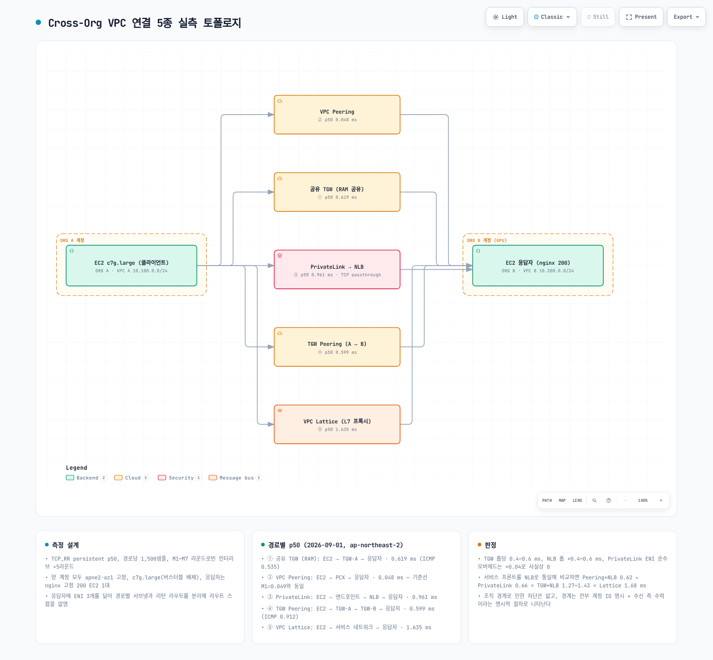

# Cross-Org VPC 연결

> **마지막 업데이트**: 2026년 9월 1일

GPU 워크로드를 기존 MSP Payer와 다른 별도 AWS Organization으로 분리 계약하는 경우처럼, **서로 다른 두 AWS Organization 간 VPC를 연결**하는 5가지 방법을 다룹니다. 이 문서의 모든 수치는 실제 두 Organization의 계정(ap-northeast-2, 양 계정 ZoneId `apne2-az1` 고정)에서 직접 구축·측정한 실측 결과입니다.

## 목차

1. [왜 Cross-Org 연결이 필요한가](#왜-cross-org-연결이-필요한가)
2. [5가지 연결 옵션 비교](#5가지-연결-옵션-비교)
3. [실측 검증 결과](#실측-검증-결과)
4. [Latency 실측 (M1~M7)](#latency-실측-m1m7)
5. [실측에서 드러난 운영 포인트](#실측에서-드러난-운영-포인트)
6. [시나리오별 권장 아키텍처](#시나리오별-권장-아키텍처)
7. [결론](#결론)

## 왜 Cross-Org 연결이 필요한가

GPU 인스턴스(P5/P6 등)는 비용 규모가 커서 기존 MSP Payer가 아닌 **별도 Payer(별도 Organization)** 로 직접 계약하는 사례가 늘고 있습니다. 주요 동기:

- **빌링 분리**: GPU 전용 볼륨 디스카운트/EDP 최적화
- **서비스 쿼터 격리**: GPU vCPU 한도, Capacity Blocks를 기존 ORG와 독립 관리
- **Blast Radius 최소화**: SCP 오설정·보안 사고가 기존 프로덕션에 전파되지 않도록 차단
- **규제 준수**: AI/ML 워크로드의 데이터 경계·감사 추적 분리

이때 기존 환경(ORG A)과 GPU 환경(ORG B) 사이의 네트워크 연결이 핵심 과제가 됩니다. EKS 관점에서는 학습 클러스터(ORG B)가 기존 데이터 파이프라인(ORG A)에 접근하거나, 추론 API를 기존 서비스에 노출하는 경로가 이에 해당합니다.

## 5가지 연결 옵션 비교

| 항목 | ① TGW RAM 공유 | ② VPC Peering | ③ PrivateLink | ④ TGW Peering | ⑤ VPC Lattice |
|---|---|---|---|---|---|
| 연결 방식 | TGW를 RAM으로 타 ORG 계정에 공유 | VPC 1:1 직접 연결 | NLB 기반 엔드포인트 | ORG별 TGW 간 피어링 | L7 서비스 네트워크 |
| IP 중복 허용 | ❌ | ❌ | ✅ (ENI 기반) | ❌ | ✅ (link-local 기반) |
| 방향성 | 양방향 L3 | 양방향 L3 | 단방향 (Consumer→Provider) | 양방향 L3 | 단방향 (Consumer→Provider) |
| 전이적 라우팅 | ✅ TGW RT로 제어 | ❌ | ❌ | ✅ | ❌ (서비스 단위) |
| 라우팅 통제 주체 | **TGW 소유 계정(ORG A)** | 양측 독립 | Provider가 Principal 제어 | **각 ORG 독립** | 서비스 네트워크 소유자 |
| 구성 소요(실측) | TGW ~3분 + 수락 절차 | **1분 미만** | 엔드포인트 ~3분 | **~7분 (최장)** | ~5분 |

## 실측 검증 결과

서로 다른 두 Organization의 계정에 5가지를 전부 구축하고 control plane(연결 수립)과 data plane(실제 트래픽)까지 테스트한 결과 **5가지 모두 구현 가능**했습니다. 조직 경계로 인한 차단은 없으며, 경계는 전부 "**계정 ID 명시 + 수신 측 수락**"이라는 명시적 절차로 나타납니다.

[🔍 인터랙티브 다이어그램 보기](https://www.atomai.click/kubernetes-docs/archmaps/ko-networking-05-cross-org-vpc-connectivity-0.html)

## Latency 실측 (M1~M7)

**측정 설계** — 신호가 sub-ms이므로 측정 오차를 신호보다 작게 만드는 것이 핵심입니다:

- 인스턴스 **c7g.large**(버스터블 배제), 응답자는 **EC2 1대(nginx 고정 200)** — LB는 구조상 필수인 ③⑤(및 NLB 홉 분리용 M7)에만
- 응답자에 ENI 3개(경로별 서브넷·리턴 라우트 분리) → 라우트 스왑 없이 **M1~M7 라운드로빈 인터리브 ×5라운드**
- 주 지표 **TCP_RR persistent ping-pong 1,500샘플/경로** (프로세스 기동·핸드셰이크 비용 제거), 보조 ICMP 100/경로, HTTP keep-alive 275/경로

| ID | 경로 | ICMP p50 | TCP_RR p50 | RR p99 | RR sd | HTTP KA p50 | TTL |
|---|---|---|---|---|---|---|---|
| M1 | 동일 VPC → EC2 (기준선) | 0.121 | **0.049** | 0.062 | 0.007 | 0.087 | 127 |
| M2 | ② VPC Peering → EC2 | 0.125 | **0.048** | 0.057 | 0.011 | 0.080 | 127 |
| M3 | ① 공유 TGW(RAM) → EC2 | 0.535 | **0.619** | 0.695 | 0.141 | 0.686 | 126 |
| M4 | ④ TGW Peering(2홉) → EC2 | 0.912 | **0.599** | 0.855 | 0.133 | 0.488 | 125 |
| M5 | ③ PrivateLink → NLB → EC2 | 미측정 | **0.961** | 1.084 | 0.035 | 0.711 | — |
| M6 | ⑤ VPC Lattice → EC2 타깃 | 미측정 | 미측정(L7 전용) | — | — | **1.635** | — |
| M7 | ② Peering → NLB → EC2 (NLB 홉 분리) | 미측정 | **0.841** | 0.909 | 0.119 | 0.883 | — |

**파생 지표 (p50, ms):**

| 지표 | 정의 | TCP_RR | ICMP |
|---|---|---|---|
| TGW 1홉 비용 | M3 − M2 | **+0.571** | +0.410 |
| TGW 2홉 비용 | M4 − M2 | **+0.551** | +0.787 |
| NLB 홉 비용 | M7 − M2 | **+0.793** | — |
| PrivateLink ENI 순수 오버헤드 | M5 − M7 | **+0.120** | — |
| Lattice 프록시 비용 (HTTP) | M6 − M2 | +1.555 | — |

**판정:**

> **동일 AZ에서 TGW 홉당 추가 지연은 p50 기준 0.4~0.6ms** — "홉당 sub-ms" 통념과 일치합니다.
> **VPC Peering의 지연 비용은 측정 한계 내 0** (M2 0.048 ≈ M1 기준선 0.049).
> **PrivateLink ENI 자체 오버헤드는 +0.12ms로 미미** — PrivateLink 총 지연(0.96ms)의 본체는 구조상 필수인 **NLB 홉(+0.79ms)** 입니다. Lattice는 L7 프록시 비용 +1.6ms.

**추가 측정 — 서비스 프론트(전 경로 NLB) 공정 비교:** 실배포에서는 Peering·TGW 경로도 서비스 앞단에 NLB를 두므로, 모든 L3 경로에 NLB를 얹은 구성을 추가 측정했습니다 (서브넷별 NLB, IP 타깃, 동일 방법론).

| 구성 | TCP_RR p50 | HTTP KA p50 |
|---|---|---|
| ② Peering → NLB → EC2 | **0.622** | 0.648 |
| ③ PrivateLink → NLB → EC2 | **0.658** | 0.845 |
| ① 공유 TGW → NLB → EC2 | **1.273** | 1.257 |
| ④ TGW Peering → NLB → EC2 | **1.425** | 1.279 |
| ⑤ Lattice (자체가 LB 역할, NLB 불필요) | — | **1.680** |

> **서비스 노출 프레임 판정:** PrivateLink ENI 순수 비용은 +0.036ms(N5−N2)로 사실상 0. 응답자 앞 NLB가 공통 전제인 실제 서비스 노출 구성에서는 **③ PrivateLink가 Peering+NLB와 동급이고 TGW 경유+NLB보다 약 2배 빠릅니다.** "TGW 직결이 PrivateLink보다 빠르다"는 LB 없는 직결 프레임에서만 성립합니다. Lattice는 자체가 LB라 별도 NLB가 불필요 — 같은 프레임의 TGW+NLB와 격차는 +0.3~0.4ms로 좁혀집니다.

**측정 방법론 교훈** (2차 측정을 폐기하고 재측정한 이유): 버스터블 인스턴스(t계열) + NLB→ALB 2단 프록시 + 매 요청 신규 커넥션(curl) 조합은 sub-ms 신호를 노이즈(경로 무관 p95 ~7ms)에 묻어버립니다. 신규 TCP 플로우의 첫 RTT에는 TGW/NLB flow-setup 비용 +0.6~1.6ms가 실재하므로, **keep-alive/장수 커넥션(gRPC·NCCL·DB 풀) 워크로드와 단발 커넥션 워크로드를 구분**해서 지연을 평가해야 합니다.

## 실측에서 드러난 운영 포인트

1. **Cross-org RAM 공유는 초대 수락이 명시적 단계** — `--allow-external-principals` 없이는 공유 자체가 거부되고, 수신 측이 `accept-resource-share-invitation`을 실행해야 리소스가 보입니다(TGW·Lattice 동일). 자동화 파이프라인에 수락 스텝이 필요합니다.
2. **공유 TGW에 대한 타 ORG의 attachment는 `pendingAcceptance`로 멈춥니다** — TGW 소유자가 수락해야 활성화. "소유자 중앙 통제"가 API 레벨에서 강제됩니다.
3. **TGW 피어링은 양측 attachment ID가 다릅니다** — 요청자 측 ID로 수락 API를 호출하면 `NotFound`. 수락자 계정에서 목록 조회로 별도 ID를 찾아야 하며, 전파까지 약 2분 지연이 있습니다.
4. **TGW 피어링은 BGP 미지원** — 양쪽 TGW 라우트 테이블에 정적 라우트를 수동 등록해야 합니다.
5. **Lattice data plane은 link-local(169.254.171.0/24)에서 옵니다** — 타깃 SG가 VPC CIDR만 허용하면 헬스체크가 전부 UNHEALTHY. 관리형 프리픽스 리스트 `com.amazonaws.<region>.vpc-lattice`를 SG에 추가해야 합니다.
6. **TGW 정적 라우트가 전파(propagated) 라우트보다 우선합니다** — 두 경로 병행 운영 시 의도치 않은 경로 선택에 주의.
7. **정리(teardown) 시 계정 자동화 개입** — GuardDuty Runtime Monitoring의 관리형 SG가 VPC 삭제를 막고(DependencyViolation), 자동 부착된 IAM 정책이 롤 삭제를 막는 사례를 실제로 겪었습니다. Lattice 타깃그룹 잔존 시에도 VPC 삭제가 차단됩니다.

## 시나리오별 권장 아키텍처

| 시나리오 | 1순위 | 이유 (실측 근거) |
|---|---|---|
| GPU ORG 전면 분리, 양방향 대용량(학습 데이터) | **④ TGW Peering** | 양 ORG 라우팅 독립 + 홉당 0.4~0.6ms로 지연 페널티 미미 |
| GPU 추론 API만 노출 (단방향) | **③ PrivateLink** | 최소 노출, IP 중복 OK, 서비스 프론트 비교에서 Peering+NLB와 동급(TGW 경유+NLB 대비 약 2배 빠름) |
| IP 중복이 불가피 (M&A, MSP 전환) | **③ PrivateLink / ⑤ Lattice** | ENI·link-local 기반이라 CIDR 무관 |
| 기존 TGW에 GPU 계정만 추가 | **① TGW RAM 공유** | 기존 허브 재활용, 단 타 ORG는 라우팅 변경 불가 |
| 소규모 PoC (VPC 1~2개) | **② VPC Peering** | 1분 미만 구성, 지연 비용 ≈ 0, 추가 인프라 없음 |
| L7 인증·거버넌스가 필요한 서비스 노출 | **⑤ VPC Lattice** | IAM Auth·서비스 디스커버리 내장 (L7 프록시 +1.6ms 감수) |

대부분의 GPU 분리 시나리오에서는 **④ TGW Peering(양방향 인프라) + ③ PrivateLink(추론 API 노출)** 하이브리드가 최적이며, 이 권장은 실측으로 뒷받침됩니다.

## 결론

- 5가지 옵션 모두 서로 다른 Organization 간에 API만으로 구성 가능하며, 조직 경계는 "계정 ID 명시 + 수신 측 수락" 절차로만 나타납니다.
- 동일 AZ에서 TGW 홉당 0.4~0.6ms, VPC Peering ≈ 0, NLB 홉 +0.79ms, PrivateLink ENI +0.12ms, Lattice 프록시 +1.6ms — 지연 비용은 홉·프록시 계층에 정직하게 비례합니다.
- EKS 학습 클러스터의 대량 데이터 전송(장수 커넥션)은 TGW 경로로, 추론 API 노출은 PrivateLink로 분리하는 것이 실측 근거상 타당합니다.

**한계(미측정):** Network Firewall 인스펙션 경유, Cross-Region, IP 중복 CIDR 환경(기능 확인만), 처리량/동시성 축.

---

## 참고 자료

- [Building Scalable Multi-VPC Network Infrastructure (AWS Whitepaper)](https://docs.aws.amazon.com/whitepapers/latest/building-scalable-secure-multi-vpc-network-infrastructure/welcome.html)
- [TGW Cross-Org Sharing with RAM (AWS Prescriptive Guidance)](https://docs.aws.amazon.com/prescriptive-guidance/latest/integrate-third-party-services/architecture-3-1.html)
- [Choosing Single vs Multiple Organizations (AWS Architecture Blog)](https://aws.amazon.com/blogs/architecture/choosing-between-single-or-multiple-organizations-in-aws-organizations/)
- [VPC Lattice (본 문서 시리즈)](02-vpc-lattice.md)
