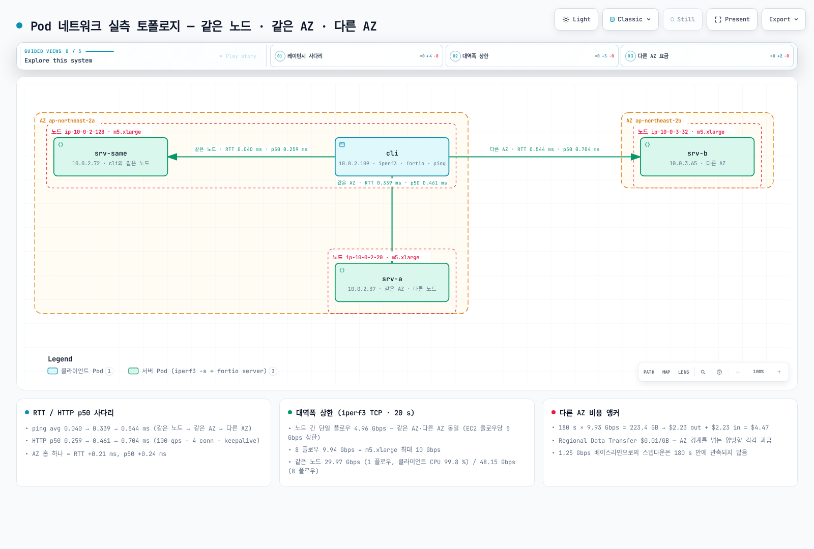
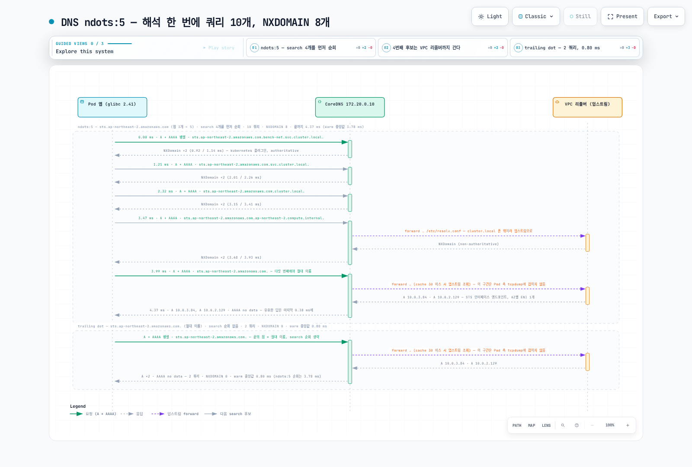

# Pod 네트워크 실측 벤치마크 — 같은 노드·같은 AZ·다른 AZ, 그리고 DNS ndots

> **지원 버전**: Kubernetes 1.36 (Amazon EKS), Amazon VPC CNI v1.21.1, kube-proxy iptables 모드
> **마지막 업데이트**: 2026년 9월 2일

EKS에서 Pod 두 개가 같은 노드에 있을 때, 같은 AZ의 다른 노드에 있을 때, 다른 AZ에 있을 때 실제로 무엇이 달라질까요? 이 질문에는 흔한 오해가 두 가지 붙어 다닙니다. 하나는 "AZ를 넘으면 느려지고 대역폭도 줄어든다"는 것인데, 실측에서 AZ 경계가 바꾼 것은 **지연과 요금**이었고 대역폭은 그대로였습니다. 다른 하나는 DNS입니다 — EKS의 Pod가 받는 `ndots:5`와 search 목록 4개는 점이 5개 미만인 외부 이름 하나를 풀 때마다 DNS 쿼리를 조용히 2개에서 10개로 늘립니다. 이 문서는 서울 리전 `fsi-demo-cluster`에서 **2026년 9월 2일**에 "재현 방법"의 픽스처로 측정한 RTT·HTTP/gRPC 레이턴시·iperf3 처리량·리전 내 데이터 전송 요금·DNS 쿼리 수를 정리한 것입니다. 모든 수치는 Pod IP 직접 통신(ClusterIP 없음)이며, 그 이유는 "해석 시 주의사항"에 있습니다.



[🔍 인터랙티브 다이어그램 보기](https://www.atomai.click/kubernetes-docs/archmaps/ko-networking-06-pod-network-benchmark-0.html)

## TL;DR — 측정 결과 요약

1. **RTT 사다리**: 같은 노드 **0.040 ms** → 같은 AZ **0.339 ms** → 다른 AZ **0.544 ms** (ping 200회 평균). AZ 하나를 넘는 비용은 +0.21 ms, 같은 노드 대비 +0.50 ms입니다.
2. **HTTP p50 / p99** (fortio, 100 qps, 커넥션 4개, keepalive, 60 s): 0.259 / 0.350 ms → 0.461 / 0.667 ms → 0.704 / 0.812 ms. 같은 사다리를 애플리케이션 관점에서 본 값입니다.
3. **대역폭**: TCP 플로우 하나는 같은 AZ든 다른 AZ든 **4.96 Gbps**에서 막힙니다(EC2 단일 플로우 5 Gbps 한도). 플로우 8개는 **9.94 Gbps** = m5.xlarge의 10 Gbps 피크. **AZ를 넘어도 처리량은 줄지 않습니다.**
4. **같은 노드 Pod 간**: 단일 플로우 **29.97 Gbps**(클라이언트 코어 하나가 99.8%로 CPU 한계), 8 플로우 **48.15 Gbps** — veth 쌍만 지나고 NIC를 건드리지 않습니다.
5. **요금**: 다른 AZ로 3분 라인레이트 = **223.4 GB** = 리전 내 데이터 전송(양방향 각 $0.01/GB) **약 $4.47**. 180초 안에서는 1.25 Gbps 베이스라인으로 내려가는 버스트 크레딧 소진이 관측되지 않았습니다.
6. **DNS**: 기본 `ndots:5`에서 glibc Pod가 `sts.ap-northeast-2.amazonaws.com`을 한 번 풀 때 쿼리 **10개**(NXDOMAIN 8개), 웜 중앙값 **3.78 ms**. 끝에 점을 붙이면 **2개**(A+AAAA) / 0.80 ms, `ndots:1`이면 2개 / 0.54 ms.
7. **새 커넥션은 요청마다 RTT를 하나 더 냅니다**: keepalive를 끄면 p50이 0.259 → 0.664, 0.461 → 1.079, 0.704 → **1.517 ms**. 다른 AZ에서는 요청 지연이 두 배가 넘습니다.

## 테스트 환경

| 항목 | 값 |
|------|-----|
| 클러스터 | Amazon EKS `fsi-demo-cluster`, ap-northeast-2 (서울), 컨트롤 플레인 `v1.36.2-eks-bca9cf6`, AZ 2개(2a, 2b) 사용 |
| 노드 | Karpenter `system` NodePool이 이 테스트를 위해 새로 띄운 **m5.xlarge × 3** — 2a 클라이언트 노드, 2a 서버 노드, 2b 서버 노드. 4 vCPU, Intel Xeon Platinum 8175M @ 2.50GHz |
| 노드 OS | Amazon Linux 2023.12.20260817, 커널 `6.18.41-94.142.amzn2023.x86_64`, containerd 2.2.5, kubelet v1.36.3-eks-cb19647 |
| CNI | Amazon VPC CNI `v1.21.1-eksbuild.8` (+ network-policy-agent v1.3.4); `ENABLE_PREFIX_DELEGATION=false`, `ENABLE_POD_ENI=false`, `AWS_VPC_K8S_CNI_EXTERNALSNAT=false`, `NETWORK_POLICY_ENFORCING_MODE=standard`, `WARM_ENI_TARGET=1`, `WARM_IP_TARGET=3` |
| kube-proxy | `v1.35.3-eksbuild.5`, `mode: "iptables"` |
| CoreDNS | `v1.14.2-eksbuild.4`, 2 replicas — AZ마다 1개(`10.0.2.106` / 2a, `10.0.3.14` / 2b); Service `kube-dns` ClusterIP `172.20.0.10`; Corefile `kubernetes cluster.local … { pods insecure }`, `forward . /etc/resolv.conf`, `cache 30`, `loadbalance`; **NodeLocal DNSCache 없음**, `autopath` 플러그인 없음 |
| Pod resolv.conf (기본) | `search bench-net.svc.cluster.local svc.cluster.local cluster.local ap-northeast-2.compute.internal` / `nameserver 172.20.0.10` / `options ndots:5` |
| Pod NIC | eth0 MTU **9001**(점보 프레임), TCP 혼잡 제어 `cubic`, iperf3 `tcp_mss_default: 8949` |
| EC2 네트워크 사양 | m5.xlarge "Up to 10 Gigabit" — 베이스라인 **1.25 Gbps**, 피크 **10 Gbps**, 4 vCPU (비교: m5.large 베이스라인 0.75 Gbps, 피크 10 Gbps, 2 vCPU). `aws ec2 describe-instance-types`로 확인, ENA 필수 |
| 요금 | usagetype `APN2-DataTransfer-Regional-Bytes` "Regional Data Transfer - in/out/between AZs or when using public IP or Elastic IP addresses" **$0.01/GB** (`aws pricing get-products --region us-east-1`, 2026-09 조회) |
| 도구 | `nicolaka/netshoot:v0.14` — iperf **3.19**, fortio **1.69.5**, iputils ping 20250605, tcpdump 4.99.5; DNS 클라이언트 `python:3.12-slim` (Debian 13, **glibc 2.41**, Python 3.12.14) |
| 측정 시각 | 2026-09-02 07:58–08:40 UTC (첫 Pod 07:58:22Z, DNS Pod 08:16:24Z) |

"Up to"는 버스트형 네트워크라는 뜻입니다. 인스턴스는 네트워크 I/O 크레딧이 있는 동안 피크 대역폭을 쓸 수 있고, 크레딧이 떨어지면 베이스라인 쪽으로 제한됩니다(AWS EC2 사용자 가이드 "Amazon EC2 instance network bandwidth"). 측정 2의 지속 테스트는 이 제한이 180초 동안은 발동하지 않았다는 것까지만 보여 줍니다(베이스라인으로의 하락은 관측되지 않았고, 그 이상은 테스트하지 않았습니다).

픽스처 배치는 다음과 같았습니다.

| Pod | IP | 노드 | Zone | 역할 / requests |
|---|---|---|---|---|
| `cli` | 10.0.2.109 | ip-10-0-2-128 (nodeclaim `system-76r87`) | ap-northeast-2a | 클라이언트; 2500m / 1Gi |
| `srv-same` | 10.0.2.72 | ip-10-0-2-128 — `cli`와 같은 노드 (required podAffinity) | ap-northeast-2a | 서버; 200m / 256Mi |
| `srv-a` | 10.0.2.37 | ip-10-0-2-20 (nodeclaim `system-ksrbg`, `cli`에 podAntiAffinity) | ap-northeast-2a | 서버; 2800m / 1Gi |
| `srv-b` | 10.0.3.65 | ip-10-0-3-32 (nodeclaim `system-svdvk`) | ap-northeast-2b | 서버; 2500m / 1Gi |
| `dns-default` | 10.0.2.5 | ip-10-0-2-20 (`srv-a`에 podAffinity) | ap-northeast-2a | glibc 리졸버, 기본 `ndots:5` |
| `dns-ndots1` | 10.0.2.143 | ip-10-0-2-20 | ap-northeast-2a | glibc 리졸버, `dnsConfig.options ndots=1` |

서버 Pod는 `sh -c "iperf3 -s -p 5201 & exec fortio server -http-port 8080 -grpc-port 8079 -tcp-port 8078"`를 실행하고, 모든 벤치 Pod에 `karpenter.sh/do-not-disrupt: "true"`를 붙였습니다. `srv-a`는 처음에 m5.large / 1500m으로 요청했지만 Karpenter가 `no instance type has enough resources`를 보고했습니다 — m5.large의 allocatable 1930m 중 DaemonSet 오버헤드가 821m이어서 — 그래서 m5.xlarge / 2800m으로 바꿨습니다.

### 배포 매니페스트

영문 주석 헤더만 걷어냈고 `nodeSelector`·`affinity`·`requests`·`command`·`annotations`는 측정 때 그대로입니다. Pod IP만 쓰는 구성이라 Service 객체가 없습니다(이유는 "해석 시 주의사항").

```yaml
apiVersion: v1
kind: Namespace
metadata:
  name: bench-net
  labels:
    bench: net
---
# 클라이언트 — ap-northeast-2a의 새 m5.xlarge
apiVersion: v1
kind: Pod
metadata:
  name: cli
  namespace: bench-net
  labels: { app: cli, role: client }
  annotations: { karpenter.sh/do-not-disrupt: "true" }
spec:
  nodeSelector:
    topology.kubernetes.io/zone: ap-northeast-2a
    node.kubernetes.io/instance-type: m5.xlarge
    karpenter.sh/nodepool: system
  terminationGracePeriodSeconds: 5
  containers:
    - name: netshoot
      image: nicolaka/netshoot:v0.14
      command: ["sleep", "infinity"]
      resources:
        requests: { cpu: "2500m", memory: "1Gi" }
---
# same-node — required podAffinity로 cli와 같은 노드에
apiVersion: v1
kind: Pod
metadata:
  name: srv-same
  namespace: bench-net
  labels: { app: srv-same, role: server, zone: a }
  annotations: { karpenter.sh/do-not-disrupt: "true" }
spec:
  affinity:
    podAffinity:
      requiredDuringSchedulingIgnoredDuringExecution:
        - labelSelector: { matchLabels: { app: cli } }
          topologyKey: kubernetes.io/hostname
  terminationGracePeriodSeconds: 5
  containers:
    - name: netshoot
      image: nicolaka/netshoot:v0.14
      command: ["sh", "-c", "iperf3 -s -p 5201 & exec fortio server -http-port 8080 -grpc-port 8079 -tcp-port 8078"]
      ports: [{ containerPort: 8080 }, { containerPort: 5201 }]
      resources:
        requests: { cpu: "200m", memory: "256Mi" }
---
# same-AZ — cli와 같은 AZ, 다른 노드(podAntiAffinity). m5.large는 DaemonSet 오버헤드 때문에 들어가지 않아 m5.xlarge
apiVersion: v1
kind: Pod
metadata:
  name: srv-a
  namespace: bench-net
  labels: { app: srv-a, role: server, zone: a }
  annotations: { karpenter.sh/do-not-disrupt: "true" }
spec:
  nodeSelector:
    topology.kubernetes.io/zone: ap-northeast-2a
    node.kubernetes.io/instance-type: m5.xlarge
    karpenter.sh/nodepool: system
  affinity:
    podAntiAffinity:
      requiredDuringSchedulingIgnoredDuringExecution:
        - labelSelector: { matchLabels: { app: cli } }
          topologyKey: kubernetes.io/hostname
  terminationGracePeriodSeconds: 5
  containers:
    - name: netshoot
      image: nicolaka/netshoot:v0.14
      command: ["sh", "-c", "iperf3 -s -p 5201 & exec fortio server -http-port 8080 -grpc-port 8079 -tcp-port 8078"]
      ports: [{ containerPort: 8080 }, { containerPort: 5201 }]
      resources:
        requests: { cpu: "2800m", memory: "1Gi" }
---
# cross-AZ — ap-northeast-2b의 새 m5.xlarge
apiVersion: v1
kind: Pod
metadata:
  name: srv-b
  namespace: bench-net
  labels: { app: srv-b, role: server, zone: b }
  annotations: { karpenter.sh/do-not-disrupt: "true" }
spec:
  nodeSelector:
    topology.kubernetes.io/zone: ap-northeast-2b
    node.kubernetes.io/instance-type: m5.xlarge
    karpenter.sh/nodepool: system
  terminationGracePeriodSeconds: 5
  containers:
    - name: netshoot
      image: nicolaka/netshoot:v0.14
      command: ["sh", "-c", "iperf3 -s -p 5201 & exec fortio server -http-port 8080 -grpc-port 8079 -tcp-port 8078"]
      ports: [{ containerPort: 8080 }, { containerPort: 5201 }]
      resources:
        requests: { cpu: "2500m", memory: "1Gi" }
```

DNS 측정용 Pod 두 개는 `srv-a`와 같은 노드에 두었습니다. `app` 컨테이너는 glibc(`python:3.12-slim`, Debian 13, glibc 2.41)입니다 — 이 문서가 측정한 것은 glibc 리졸버이고, 다른 리졸버(musl/alpine)의 결과는 측정하지 않았습니다. `sniffer`(netshoot)는 Pod 네트워크 네임스페이스를 공유하므로 `app`이 보내는 모든 쿼리를 tcpdump로 봅니다. 두 Pod의 유일한 차이는 `dnsConfig`입니다.

```yaml
apiVersion: v1
kind: Pod
metadata:
  name: dns-default          # 두 번째 Pod는 name: dns-ndots1 + 아래 dnsConfig 블록만 추가
  namespace: bench-net
  labels: { app: dns-default, role: dns }
  annotations: { karpenter.sh/do-not-disrupt: "true" }
spec:
  affinity:
    podAffinity:
      requiredDuringSchedulingIgnoredDuringExecution:
        - labelSelector: { matchLabels: { app: srv-a } }
          topologyKey: kubernetes.io/hostname
  # dns-ndots1에만 있는 블록:
  # dnsConfig:
  #   options:
  #     - name: ndots
  #       value: "1"
  terminationGracePeriodSeconds: 5
  containers:
    - name: app
      image: python:3.12-slim
      command: ["sleep", "infinity"]
      resources: { requests: { cpu: "50m", memory: "64Mi" } }
    - name: sniffer
      image: nicolaka/netshoot:v0.14
      command: ["sleep", "infinity"]
      resources: { requests: { cpu: "50m", memory: "64Mi" } }
```

## 측정 1 — RTT와 HTTP 레이턴시: 같은 노드 → 같은 AZ → 다른 AZ

먼저 ICMP로 순수 네트워크 경로를 재고(`ping -c 200 -i 0.05 -q`), 같은 세 경로를 fortio로 HTTP/1.1과 gRPC 요청으로 다시 잽니다. 참고용으로 `curl` 콜드 요청 1회의 connect / total도 적었습니다.

| 경로 | RTT min / **avg** / max / mdev (ms) | 손실 | curl 1회 (콜드) connect / total |
|---|---|---|---|
| 같은 노드 → 10.0.2.72 | 0.021 / **0.040** / 0.089 / 0.007 | 0/200 | 0.194 ms / 0.497 ms |
| 같은 AZ → 10.0.2.37 | 0.300 / **0.339** / 0.450 / 0.017 | 0/200 | 0.497 ms / 2.333 ms |
| 다른 AZ → 10.0.3.65 | 0.504 / **0.544** / 0.625 / 0.015 | 0/200 | 0.694 ms / 4.038 ms |

차이: 같은 AZ − 같은 노드 = +0.30 ms, 다른 AZ − 같은 AZ = **+0.21 ms**, 다른 AZ − 같은 노드 = +0.50 ms. 세 경로 모두 mdev가 0.017 ms 이하로 매우 안정적입니다. curl의 "total"은 프로세스 기동을 포함한 1회 값이므로 참고만 하고, 레이턴시는 아래 fortio 표를 봅니다.

### HTTP/1.1 — 100 qps, 커넥션 4개, keepalive, 60 s (요청 6,000개), ms

| 경로 | avg | **p50** | p90 | p99 | p99.9 | max | min |
|---|---|---|---|---|---|---|---|
| 같은 노드 | 0.260 | **0.259** | 0.299 | 0.350 | 1.267 | 2.080 | 0.111 |
| 같은 AZ | 0.468 | **0.461** | 0.560 | 0.667 | 0.783 | 2.823 | 0.336 |
| 다른 AZ | 0.706 | **0.704** | 0.782 | 0.812 | 1.150 | 4.581 | 0.551 |

### gRPC ping — 100 qps, 커넥션 4개, 30 s (요청 3,000개), ms

| 경로 | avg | **p50** | p90 | p99 | p99.9 | max | min |
|---|---|---|---|---|---|---|---|
| 같은 노드 | 0.410 | **0.397** | 0.449 | 0.869 | 1.187 | 1.314 | 0.241 |
| 같은 AZ | 0.601 | **0.592** | 0.687 | 0.889 | 1.052 | 1.105 | 0.448 |
| 다른 AZ | 0.878 | **0.865** | 0.967 | 1.209 | 2.582 | 2.826 | 0.692 |

응답 본문은 약 75바이트(fortio echo, 빈 페이로드)이고 모든 실행에서 오류는 0건(200 / SERVING)이었습니다.

**읽는 법.** HTTP p50은 ping 평균에 0.12–0.22 ms를 더한 값입니다(0.259 − 0.040 ≈ 0.22, 0.461 − 0.339 ≈ 0.12, 0.704 − 0.544 ≈ 0.16) — 이 몫이 클라이언트+서버의 유저 공간 스택입니다. AZ 홉의 비용은 p50에서 **+0.24 ms**(0.461 → 0.704)로 ping의 +0.21 ms와 같은 크기이며, 노드 홉(+0.20 ms, 0.259 → 0.461)과도 비슷합니다. 즉 "같은 노드 → 다른 노드"와 "같은 AZ → 다른 AZ"는 각각 0.2 ms대의 상수를 더하는 계단입니다. gRPC ping p50은 모든 경로에서 HTTP/1.1보다 약 0.13–0.16 ms 높은데(0.397 / 0.592 / 0.865 vs 0.259 / 0.461 / 0.704), HTTP/2 프레이밍과 protobuf 몫입니다. 경로 차이가 가장 크게 벌어지는 곳은 꼬리입니다 — HTTP p99는 0.350 → 0.667 → 0.812 ms, gRPC p99.9는 1.187 → 1.052 → **2.582 ms**로 다른 AZ에서만 2 ms를 넘었습니다.

> **비교 기준 하나.** 이 저장소의 [Istio sidecar vs ambient 실측](../service-mesh/istio/comparison/03-sidecar-vs-ambient.md)에서 sidecar 하나가 더하는 p50 오버헤드는 **+1.29 ms**였습니다. 여기서 AZ 하나를 넘는 비용은 +0.21–0.24 ms — **메시 홉 하나가 AZ 홉 하나보다 비쌉니다.** "다른 AZ라서 느리다"를 의심하기 전에 요청 경로에 프록시가 몇 개 끼어 있는지 먼저 세어 보세요.

### 새 커넥션의 비용 — keepalive=false, 100 qps, 커넥션 4개, 30 s (요청 3,000개), ms

요청마다 TCP 커넥션을 새로 맺으면(fortio `-keepalive=false`) 지연은 어떻게 변할까요?

| 경로 | avg | **p50** | p90 | p99 | p99.9 | max | min | keepalive p50 대비 |
|---|---|---|---|---|---|---|---|---|
| 같은 노드 | 0.672 | **0.664** | 0.782 | 0.957 | 1.253 | 1.306 | 0.364 | **+0.405 ms** |
| 같은 AZ | 1.066 | **1.079** | 1.185 | 1.369 | 1.582 | 1.795 | 0.769 | **+0.618 ms** |
| 다른 AZ | 1.530 | **1.517** | 1.678 | 1.796 | 1.981 | 2.009 | 1.300 | **+0.813 ms** |

새 커넥션 하나는 대략 **RTT 한 번(TCP 핸드셰이크) + 약 0.3 ms의 소켓 생성·정리** 비용입니다. RTT가 큰 경로일수록 추가분이 커져서, 다른 AZ에서는 요청 하나의 p50이 0.704 → 1.517 ms로 **두 배 이상**이 됩니다. 커넥션 풀(HTTP keepalive, gRPC 채널 재사용, DB 커넥션 풀)은 "성능 튠"이 아니라 AZ를 넘는 호출의 기본 전제입니다(요청마다 커넥션을 여는 클라이언트라면 으레 그렇듯 커넥션마다 TIME_WAIT 소켓도 하나씩 남기지만, 이는 여기서 측정하지 않았습니다).

### 고정 커넥션 풀의 최대 qps — 지연이 곧 처리량 (closed-loop, 커넥션 16개, 20 s)

`-qps 0`(무제한, 닫힌 루프)으로 16개 커넥션이 낼 수 있는 최대 요청률을 재면 지연 차이가 처리량 차이로 바뀝니다.

| 경로 | 요청 수 | **달성 qps** | avg ms | p50 | p90 | p99 | p99.9 | max |
|---|---|---|---|---|---|---|---|---|
| 같은 노드 | 899,827 | **44,991** | 0.355 | 0.249 | 0.733 | 1.695 | 3.389 | 13.593 |
| 같은 AZ | 770,156 | **38,507** | 0.415 | 0.396 | 0.537 | 0.728 | 1.147 | 4.502 |
| 다른 AZ | 512,060 | **25,602** | 0.624 | 0.597 | 0.770 | 0.949 | 1.293 | 4.725 |

Little의 법칙(파생: 처리량 = 동시성 ÷ 지연)이 그대로 맞습니다 — 16 ÷ 0.000355 s = 45,070(실측 44,991), 16 ÷ 0.000415 = 38,554(38,507), 16 ÷ 0.000624 = 25,641(25,602). 커넥션 수가 고정된 풀에서 AZ 홉의 +0.2 ms는 달성 가능한 처리량을 **34% 깎습니다**(38.5k → 25.6k qps). 요청/응답형 서비스에서 다른 AZ가 비싼 이유는 대역폭이 아니라 이 지연입니다. 같은 노드의 p99/max가 같은 AZ보다 나쁜 것은 네트워크가 아니라 45k qps에서 클라이언트와 서버가 한 노드의 4 vCPU를 나눠 쓴 CPU 경합입니다.

## 측정 2 — 처리량: 단일 플로우 5 Gbps 상한과 인스턴스 10 Gbps 상한

iperf3 3.19, TCP, 실행당 20초, `-J`, 클라이언트 `cli`. CPU 열은 iperf3가 보고하는 프로세스별 값으로 100% = vCPU 1개입니다.

| 경로 | 플로우 (-P) | 송신 Gbps | 수신 Gbps | 재전송 | 전송 바이트 | 클라이언트 CPU | 서버 CPU | 송신측 TCP 평균 RTT (stream 1) | 최대 snd_cwnd |
|---|---|---|---|---|---|---|---|---|---|
| 같은 노드 (cli→srv-same) | 1 | **29.97** | 29.97 | 13 | 74,921,541,632 | **99.8 %** | 80.9 % | 34 µs | 1,861,392 B |
| 같은 노드 | 8 | **48.15** | 48.08 | 14,567 | 120,375,083,008 | 179.0 % | 186.9 % | 201 µs / 767 µs (stream 1, 2) | 5,888,442 B |
| 같은 AZ (cli→srv-a, 2a→2a) | 1 | **4.96** | 4.96 | 4 | 12,411,731,968 | 19.5 % | 15.4 % | **5,641 µs** | 4,349,214 B |
| 같은 AZ | 8 | **9.94** | 9.93 | 5,874 | 24,846,139,392 | 36.3 % | 159.3 % | 2,720 µs / 1,626 µs | 1,163,370 B |
| 다른 AZ (cli→srv-b, 2a→2b) | 1 | **4.96** | 4.96 | 2 | 12,411,994,112 | 20.0 % | 22.5 % | **5,420 µs** | 4,304,469 B |
| 다른 AZ | 8 | **9.94** | 9.93 | 5,979 | 24,845,090,816 | 36.7 % | 138.2 % | 3,671 µs / 3,237 µs | 1,226,013 B |

네 가지를 읽어야 합니다.

1. **같은 노드는 메모리 복사 속도입니다.** 단일 플로우 29.97 Gbps에서 클라이언트 iperf3가 코어 하나를 99.8% 쓰고 있었고, 8 플로우에서 48.15 Gbps까지 올랐습니다. veth 쌍을 지나는 패킷은 NIC나 ENA 셰이퍼를 거치지 않으므로 이 값은 이 인스턴스의 CPU 수치이며, 다른 인스턴스 패밀리에서는 달라집니다.
2. **노드 사이의 TCP 플로우 하나는 4.96 Gbps에서 멈춥니다 — 같은 AZ와 다른 AZ가 소수점까지 같습니다.** AWS는 클러스터 배치 그룹 밖에서 단일 플로우 대역폭을 5 Gbps로 제한한다고 문서화하고 있고("Amazon EC2 instance network bandwidth"), 그 한도가 그대로 보입니다. 이때 플로우 하나의 CPU는 20% 안팎이라 CPU 병목이 아닙니다.
3. **플로우 8개는 9.94 Gbps = m5.xlarge의 10 Gbps 피크**로, 이것도 두 경로가 같습니다. **AZ 경계를 넘어도 대역폭은 줄지 않습니다.** 재전송은 인스턴스 상한에 닿았을 때만 나타납니다(8 플로우에서 5,874 / 5,979 vs 1 플로우에서 2–13) — ENA 허용량 셰이핑이 상한에서 패킷을 떨어뜨리는 것과 일치하는 **간접 신호**이며, ENA `*_allowance_exceeded` 카운터는 이 실행에서 수집하지 않았습니다(주의사항).
4. **플로우가 포화되면 그 플로우를 타는 모든 요청이 기다립니다.** 단일 플로우가 상한에 붙어 있을 때 송신측 TCP RTT는 유휴 ping 0.34 ms(같은 AZ) / 0.54 ms(다른 AZ)에서 **5.6 ms** / **5.4 ms**로 늘고 혼잡 윈도우는 약 4.3 MB까지 커졌습니다. 셰이퍼 큐에서 생기는 지연이므로, 대용량 전송과 요청/응답을 같은 TCP 커넥션에 섞으면 후자가 약 5 ms를 손해 봅니다.

MSS 8949는 MTU 9001 점보 프레임의 결과이고, 전송 바이트 열은 다음 절의 요금 계산 근거입니다.

> **so what:** gRPC 스트림 하나, Kafka 복제 fetcher 하나, 볼륨 복사 하나 — 노드가 다른 두 Pod 사이의 "커넥션 하나"는 무엇이든 약 5 Gbps를 넘지 못합니다. 인스턴스의 10 Gbps를 쓰려면 커넥션을 병렬로 나눠야 하고(`num.replica.fetchers`, 멀티파트 업로드, 병렬 rsync 등), 반대로 "AZ를 같이 두면 대역폭이 두 배"라는 기대는 이 측정에서 근거가 없습니다.

### 3분 지속 테스트와 버스트 크레딧

"Up to 10 Gigabit"의 베이스라인은 1.25 Gbps입니다. 크레딧이 소진되면 피크에서 베이스라인으로 내려가야 하므로, 다른 AZ로 4 플로우 180초를 10초 간격으로 지켜봤습니다(`iperf3 -c 10.0.3.65 -p 5201 -t 180 -P 4 -i 10 -J`).

| 항목 | 값 |
|---|---|
| 10초 구간별 Gbps (18구간) | 9.94, 9.93 ×12, 9.92, 9.93 ×4 — **최소 9.92, 최대 9.94** |
| 총 전송 | 223,376,179,200 B = **223.4 GB** / 180.0 s (9.93 Gbps) |
| 재전송 | 44,842 (≈ 249/s; 10초 구간당 2,273–2,669) |
| CPU | 클라이언트 30.7 % (system 30.1 %), 서버 54.2 % (system 52.2 %) |

**180초 동안 1.25 Gbps 베이스라인으로의 하락은 관측되지 않았습니다.** 다만 이것은 "버스트 크레딧이 없다"는 뜻이 아닙니다. Karpenter가 막 띄운 인스턴스라 네트워크 I/O 크레딧이 남아 있었을 가능성이 크고, AWS는 더 긴 지속 전송이 베이스라인 쪽으로 제한될 수 있다고 문서화합니다 — 이 실행은 그 지점을 건드릴 만큼 길지 않았습니다. 수 시간짜리 백업·리밸런스·리플레이를 m5.xlarge에서 계획한다면 베이스라인 1.25 Gbps를 예산으로 잡고(다른 크기는 각자의 베이스라인), 10 Gbps는 보너스로 취급하세요.

## 측정 3 — 다른 AZ의 진짜 비용은 요금이다

측정 1·2가 보여 준 것은 AZ 홉이 지연 +0.2 ms를 더하고 대역폭은 건드리지 않는다는 것입니다. 그럼 다른 AZ의 진짜 차이는 어디 있을까요 — 청구서입니다.

AWS는 같은 리전 안에서 AZ를 넘는 데이터 전송에 대해 나가는 쪽("out")과 들어오는 쪽("in")에 각각 $0.01/GB를 부과합니다(EC2 온디맨드 요금 페이지 "Data Transfer within the same AWS Region"). 이 계정의 Pricing API 항목은 `APN2-DataTransfer-Regional-Bytes`, "Regional Data Transfer - in/out/between AZs or when using public IP or Elastic IP addresses", **$0.0100000000 USD/GB**입니다. 한 방향 대용량 전송에서 보내는 AZ는 $0.01/GB "out", 받는 AZ는 $0.01/GB "in"으로 청구되므로 같은 계정 안에서는 **AZ 경계를 넘는 GB당 $0.02**(파생: $0.01 × 2)입니다.

| 시나리오 | AZ 경계를 넘는 양 | 요금 (파생: GB × $0.01 × 2) |
|---|---|---|
| 이 문서의 180 s 지속 테스트 (실측) | 223.4 GB | 223.4 × $0.01 = **$2.23 / 방향, $4.47 합계** |
| 측정 2의 다른 AZ 전송 전체 (실측: 12.41 + 24.85 + 223.38 GB) | 260.6 GB | ≈ $2.61 / 방향, **≈ $5.21 합계** (fortio·ping 트래픽은 0.2 GB 미만으로 무시) |
| 평균 1 Gbps가 30일 내내 AZ를 넘는다면 (**가정**) | 0.125 GB/s × 86,400 s × 30일 = 324,000 GB ≈ **324 TB** | 324,000 × $0.02 ≈ **$6,480 / 월** |
| RF3 StatefulSet를 3개 AZ에 분산, 리더 ingest 100 MiB/s (**가정**, 복제 트래픽만 계산) | 팔로워 2개가 각각 다른 AZ → 2 × 100 MiB/s = 209,715,200 B/s × 2,592,000 s ≈ 543,600 GB ≈ **544 TB / 월** | 543,600 × $0.02 ≈ **$10,870 / 월** |

아래 두 행은 실측이 아니라 이 요금 단가로 계산한 **추정**이며, 프로듀서·컨슈머 트래픽과 AZ 배치는 무시했습니다. 요점은 크기입니다 — 노드 3대짜리 벤치마크가 3분에 $4.47을 썼고, 그 속도가 상시라면 월 수천 달러가 됩니다. 대역폭은 무료로 넘어가지만 바이트마다 요금표가 붙어 있습니다.

**운영자가 할 일.**

- **트래픽을 같은 AZ에 머물게 하기.** Kubernetes 1.33에서 GA된 `Service.spec.trafficDistribution: PreferClose`(1.31 beta; Kubernetes 문서 "Traffic Distribution")는 kube-proxy가 같은 존의 엔드포인트를 우선 고르게 합니다. **이 실행에서는 측정하지 않았습니다** — Service 자체를 만들 수 없었기 때문이며(주의사항), 그 효과에 대한 수치는 이 문서에 없습니다.
- **상태 저장 워크로드는 존 정렬로 배치하기.** 복제 팬아웃이 큰 StatefulSet(Kafka RF3, 분산 DB)은 위 표의 네 번째 행처럼 복제 바이트 대부분이 AZ를 넘습니다. 존 단위 배치와 장애 전환 설계는 [Zonal 클러스터 운영 전략](../ops/15-zonal-operations-guide.md)을 보세요.
- **대용량 전송의 방향과 양을 알기.** 백업·리밸런스·리플레이가 어느 AZ에서 어느 AZ로 얼마나 흐르는지 기록하고, 요금표의 "in"과 "out"이 같은 계정의 서로 다른 라인 아이템으로 둘 다 청구된다는 점을 잊지 마세요.

## 측정 4 — DNS: ndots:5가 만드는 쿼리 증폭



[🔍 인터랙티브 다이어그램 보기](https://www.atomai.click/kubernetes-docs/archmaps/ko-networking-06-pod-network-benchmark-1.html)

EKS Pod의 `/etc/resolv.conf`는 search 도메인 4개(`bench-net.svc.cluster.local svc.cluster.local cluster.local ap-northeast-2.compute.internal`)와 `options ndots:5`를 갖습니다. glibc 리졸버는 점이 `ndots`개 미만인 이름을 **먼저 search 접미사마다 붙여 시도**하고, 후보마다 A와 AAAA를 병렬로 보냅니다(`single-request` 기본 꺼짐). 그래서 점이 3개인 `sts.ap-northeast-2.amazonaws.com`은 절대 이름으로 물어보기 전에 후보 4개를 모두 NXDOMAIN으로 확인해야 합니다. 방법: `dns-default`/`dns-ndots1` Pod의 `app` 컨테이너에서 `socket.getaddrinfo(name, 80, AF_UNSPEC, SOCK_STREAM)`을 콜드 1회 호출하고 `sniffer` 사이드카의 tcpdump(`-i eth0 -nn udp port 53`)로 그 한 번의 DNS 패킷을 세었으며, 이어서 같은 이름을 20회 더 풀어 프로세스 안에서 시간을 잰 값이 웜 지연입니다.

### 한 번의 이름 풀이가 보내는 쿼리 수와 웜 지연 (20회 반복), ms

| Pod / ndots | 이름 (점 개수) | 보낸 쿼리 | NXDOMAIN 응답 | warm min | **median** | p90 | max |
|---|---|---|---|---|---|---|---|
| default / 5 | `kubernetes.default` (1) | 4 | 2 | 0.87 | **1.71** | 1.97 | 2.61 |
| default / 5 | `kubernetes.default.svc.cluster.local` (4) | **10** | 8 | 1.53 | **3.63** | 4.45 | 6.41 |
| default / 5 | `kubernetes.default.svc.cluster.local.` (끝점) | 2 | 0 | 0.33 | **0.46** | 1.09 | 1.58 |
| default / 5 | `sts.ap-northeast-2.amazonaws.com` (3) | **10** | 8 | 3.08 | **3.78** | 4.66 | 4.84 |
| default / 5 | `sts.ap-northeast-2.amazonaws.com.` (끝점) | 2 | 0 | 0.42 | **0.80** | 1.25 | 2.17 |
| default / 5 | `www.amazon.com` (2) | **10** | 8 | 2.51 | **3.46** | 3.74 | 5.86 |
| ndots1 / 1 | `kubernetes.default` (1) | **6** | 4 | 1.16 | **2.04** | 2.80 | 4.54 |
| ndots1 / 1 | `kubernetes.default.svc.cluster.local` (4) | 2 | 0 | 0.35 | **0.97** | 1.08 | 1.35 |
| ndots1 / 1 | `kubernetes.default.svc.cluster.local.` | 2 | 0 | 0.34 | **0.40** | 0.97 | 1.17 |
| ndots1 / 1 | `sts.ap-northeast-2.amazonaws.com` (3) | 2 | 0 | 0.45 | **0.54** | 1.22 | 1.42 |
| ndots1 / 1 | `sts.ap-northeast-2.amazonaws.com.` | 2 | 0 | 0.47 | **0.75** | 1.20 | 1.30 |
| ndots1 / 1 | `www.amazon.com` (2) | 2 | 0 | 0.63 | **0.90** | 1.27 | 2.74 |

콜드 첫 풀이(glibc NSS 초기화 포함, 참고용)는 default/`sts` 6.22 ms, default/`sts.` 2.87 ms, default/`www.amazon.com` 9.58 ms, default/`kubernetes.default.svc.cluster.local` 7.40 ms, ndots1/`kubernetes.default` 10.52 ms, ndots1/`sts` 2.84 ms였습니다.

**읽는 법.** 기본 `ndots:5`에서 외부 이름 둘(`sts.…`, `www.amazon.com`)과 놀랍게도 **끝점 없는 클러스터 FQDN**(`kubernetes.default.svc.cluster.local`, 점 4개로 5개 미만)까지 모두 **쿼리 10개, NXDOMAIN 8개, 중앙값 3.5–3.8 ms**입니다. 같은 이름에 점 하나를 붙이면(`….com.`) 2개 / 0.46–0.80 ms — **쿼리 5분의 1, 웜 중앙값은 `sts`가 3.78 → 0.80 ms, 클러스터 FQDN이 3.63 → 0.46 ms**로 줄어듭니다. 짧은 이름 `kubernetes.default`는 두 번째 후보(`svc.cluster.local`)에서 맞으므로 4개 / 1.71 ms에 그칩니다. CoreDNS는 `cache 30`으로 NXDOMAIN도 30초 캐시하므로 웜 상태에서 비싼 것은 업스트림 조회가 아니라 **Pod↔CoreDNS 왕복 5번을 순서대로 기다리는 것**입니다.

### 실제 순서 — `sts.ap-northeast-2.amazonaws.com` 콜드 풀이 1회 (ndots:5, tcpdump, 첫 패킷 기준 ms)

| t (ms) | 172.20.0.10으로 보낸 후보 (A + AAAA 병렬) | 응답 |
|---|---|---|
| 0.00 | `sts.ap-northeast-2.amazonaws.com.bench-net.svc.cluster.local.` | NXDomain (권한 응답, CoreDNS kubernetes 플러그인) 0.92 / 1.14 |
| 1.21 | `sts.ap-northeast-2.amazonaws.com.svc.cluster.local.` | NXDomain 2.01 / 2.26 |
| 2.32 | `sts.ap-northeast-2.amazonaws.com.cluster.local.` | NXDomain 3.15 / 3.41 |
| 3.47 | `sts.ap-northeast-2.amazonaws.com.ap-northeast-2.compute.internal.` | NXDomain (VPC 리졸버로 forward — 비권한) 3.68 / 3.93 |
| 3.99 | `sts.ap-northeast-2.amazonaws.com.` | **A 10.0.3.84, A 10.0.2.129** 4.37 (AAAA: no data) |

쿼리 10개, NXDOMAIN 8개, 순차 왕복 5번, 끝까지 4.37 ms — 쓸모 있는 답은 마지막 0.38 ms에 옵니다. 후보 하나의 Pod→CoreDNS→Pod 왕복은 0.8–1.1 ms였는데, 이 안에는 CoreDNS 처리 시간과 함께 측정 1의 RTT 사다리가 들어 있습니다. `172.20.0.10`은 iptables random으로 CoreDNS Pod 두 개에 분산되고 그중 하나는 다른 AZ에 있으므로 **DNS 쿼리의 대략 절반은 AZ를 넘어갑니다.** `sts.ap-northeast-2.amazonaws.com`이 사설 IP 두 개(10.0.2.x / 10.0.3.x)로 풀리는 것은 이 VPC에 AZ마다 ENI 하나씩 둔 STS 인터페이스 엔드포인트가 있기 때문입니다. 끝점 없는 `kubernetes.default.svc.cluster.local`도 같은 경로를 걷는데, `.ap-northeast-2.compute.internal` 후보는 CoreDNS가 업스트림으로 forward해서 2.2 ms가 걸렸고 콜드 5.6 ms vs 끝점 0.4–0.5 ms였습니다.

### `ndots:1`이 하는 일과 부작용

- **외부 이름**: 10 → **2 쿼리**, 중앙값 3.5–3.8 → **0.5–0.9 ms** (약 4–7배 빠르고 쿼리는 5분의 1).
- **짧은 클러스터 이름은 더 나빠집니다.** `kubernetes.default`(점 1개 ≥ ndots 1)는 먼저 절대 이름 `kubernetes.default.`로 시도되는데 CoreDNS에 그 존이 없어 **VPC 리졸버로 forward**되고(1.6 ms 뒤 NXDomain), 그다음 `bench-net.svc.cluster.local`(NXDOMAIN), 마지막에 `svc.cluster.local`에서 `172.20.0.1`을 얻습니다 — 6 쿼리, NXDOMAIN 4개, 중앙값 2.04 ms(ndots:5의 1.71 ms보다 느림). 게다가 클러스터 내부 이름이 업스트림 리졸버로 새어 나갑니다. `ndots:1`을 쓴다면 클러스터 서비스는 반드시 FQDN(`서비스.네임스페이스.svc.cluster.local`)으로 부르세요.
- **끝점(trailing dot)은 ndots와 무관하게 통합니다** — 모든 경우 2 쿼리, 0.4–0.8 ms.

### 증폭 산술 (파생)

요청마다 외부 이름 하나를 푸는 애플리케이션은 `ndots:5`에서 쿼리 2개 대신 10개를 보내고 풀이마다 **약 +3 ms**를 씁니다(파생: 3.78 − 0.80 = 2.98 ms for `sts`, 3.63 − 0.46 = 3.17 ms for 끝점 없는 FQDN). 클러스터 전체 초당 풀이 1,000회를 가정하면 CoreDNS에 초당 2,000개가 아니라 **10,000개**의 쿼리가 들어오고 그중 8,000개는 NXDOMAIN 응답입니다. CoreDNS 두 replica가 받는 부하의 5분의 4가 "없다"는 답을 만드는 데 쓰인다는 뜻이고, 그 절반은 AZ를 넘는 요금까지 냅니다(양은 작지만 0이 아닙니다).

> **so what — 네 가지 고치는 법.** (1) 설정 파일의 외부 엔드포인트에 **끝점**을 붙이기(`sts.ap-northeast-2.amazonaws.com.`) — 코드 변경 없이 즉시 2 쿼리. (2) 외부 호출이 많은 Pod에 `dnsConfig: {options: [{name: ndots, value: "1"}]}` — 단, 클러스터 이름은 FQDN으로. (3) **NodeLocal DNSCache** — 이 클러스터에는 없었고, 있었다면 Pod↔CoreDNS 왕복(그중 절반은 AZ 횡단)이 노드 로컬 캐시 히트로 바뀝니다(미측정). (4) CoreDNS `autopath` 플러그인 — 서버 쪽에서 search 경로를 대신 걸어 주지만 이 Corefile에는 없었습니다(미측정).

## 재현 방법

1. 위 매니페스트를 `bench-net.yaml`로 저장해 배포하고, 배치가 의도대로인지 확인합니다. Pod IP는 매번 다르니 `-o wide`에서 읽어 아래 명령의 IP를 바꿔 넣습니다.

   ```bash
   kubectl apply -f bench-net.yaml
   kubectl -n bench-net get pods -o wide   # cli·srv-same 같은 노드(2a), srv-a 2a 다른 노드, srv-b 2b
   kubectl -n bench-net exec -it cli -- bash
   ```

2. **RTT** — 경로마다 200회, 50 ms 간격:

   ```bash
   ping -c 200 -i 0.05 -q 10.0.2.72   # same-node
   ping -c 200 -i 0.05 -q 10.0.2.37   # same-AZ
   ping -c 200 -i 0.05 -q 10.0.3.65   # cross-AZ
   curl -s -o /dev/null -w 'connect=%{time_connect} total=%{time_total}\n' http://10.0.3.65:8080/   # 참고용 콜드 1회
   ```

3. **처리량** — iperf3, 20초, 1 플로우와 8 플로우, JSON 출력. 지속 테스트는 다른 AZ로 180초 / 4 플로우 / 10초 간격:

   ```bash
   for SRV in 10.0.2.72 10.0.2.37 10.0.3.65; do
     iperf3 -c $SRV -p 5201 -t 20 -P 1 -J > t1-$SRV-P1.json
     iperf3 -c $SRV -p 5201 -t 20 -P 8 -J > t1-$SRV-P8.json
   done
   iperf3 -c 10.0.3.65 -p 5201 -t 180 -P 4 -i 10 -J > t1-b-sustained180-P4.json
   ```

   JSON의 `end.sum_sent.bits_per_second`, `retransmits`, `end.cpu_utilization_percent.host_total`/`remote_total`, 스트림별 `sender.mean_rtt`, `max_snd_cwnd`가 표의 열입니다.

4. **요청 레이턴시** — fortio. 모든 실행에 `-quiet -r 0.00001 -json -`를 붙입니다:

   ```bash
   SRV=10.0.3.65   # 경로마다 반복
   fortio load -quiet -r 0.00001 -json - -qps 100 -c 4 -t 60s http://$SRV:8080/                    # HTTP keepalive
   fortio load -quiet -r 0.00001 -json - -qps 100 -c 4 -t 30s -keepalive=false http://$SRV:8080/   # 요청마다 새 커넥션
   fortio load -quiet -r 0.00001 -json - -qps 0 -c 16 -t 20s http://$SRV:8080/                     # qps 0 = 무제한, 닫힌 루프
   fortio load -quiet -r 0.00001 -json - -grpc -ping -qps 100 -c 4 -t 30s $SRV:8079                # gRPC ping
   ```

   **`-r 0.00001`을 빼먹지 마세요.** fortio의 기본 히스토그램 해상도는 `-r 0.001`, 즉 1 ms 버킷입니다. 이 문서의 지연은 전부 1 ms 미만이라 기본값으로는 모든 요청이 첫 버킷 하나에 들어가고, p50·p99는 그 버킷 안의 선형 보간값 — 1 ms 미만이면 무엇이든 p50 = 0.5 ms — 이 됩니다. 실제로 첫 번째 T2 실행이 그렇게 나와서 백분위 값은 버리고(평균은 유효했습니다) 10 µs 해상도로 다시 돌린 것이 위 표입니다. 서브밀리초 지연을 fortio로 재는 사람은 누구나 한 번 걸리는 함정입니다.

5. **DNS** — `bench-dns.yaml`의 두 Pod를 배포하고, 터미널 하나에서 `sniffer` 사이드카로 캡처하면서 다른 터미널에서 `app` 컨테이너로 콜드 1회 + 웜 20회를 풉니다:

   ```bash
   kubectl apply -f bench-dns.yaml
   kubectl -n bench-net exec dns-default -c app -- cat /etc/resolv.conf        # search 4개 + ndots:5 확인
   kubectl -n bench-net exec dns-ndots1  -c app -- grep ndots /etc/resolv.conf  # options ndots:1
   # 터미널 1 — 이 Pod의 모든 DNS 패킷
   kubectl -n bench-net exec dns-default -c sniffer -- tcpdump -i eth0 -nn udp port 53
   # 터미널 2 — 콜드 1회(위 캡처에서 쿼리·NXDOMAIN 수를 셈) + 웜 20회 타이밍
   kubectl -n bench-net exec dns-default -c app -- python3 - <<'EOF'
   import socket, statistics, time
   name = "sts.ap-northeast-2.amazonaws.com"       # 끝점 버전은 name + "."
   def one():
       t = time.perf_counter()
       socket.getaddrinfo(name, 80, socket.AF_UNSPEC, socket.SOCK_STREAM)
       return (time.perf_counter() - t) * 1000
   print("cold ms", round(one(), 2))
   xs = sorted(one() for _ in range(20))
   print("warm min/median/p90/max", round(xs[0], 2), round(statistics.median(xs), 2), round(xs[int(len(xs)*0.9)-1], 2), round(xs[-1], 2))
   EOF
   ```

   `dns-ndots1`에 대해 같은 절차를 반복하면 표의 아래 여섯 줄이 나옵니다. 표는 glibc 리졸버(`python:3.12-slim`)로 측정한 것이고 다른 리졸버(musl/alpine)는 측정하지 않았으므로, 같은 숫자를 재현하려면 glibc 이미지로 재세요.

6. 끝나면 네임스페이스를 삭제합니다 — `kubectl delete ns bench-net`. Karpenter가 빈 노드를 정리합니다.

## 해석 시 주의사항

- **새 노드였지만 완전히 혼자는 아니었습니다.** Karpenter가 이 테스트용으로 띄운 m5.xlarge 3대에 곧 consolidation이 다른 네임스페이스의 작은 Pod 몇 개를 옮겨 왔습니다(`cli` 노드에 1개, `srv-b` 노드에 3개 — 소규모 내부 서비스와 컨트롤러이며, 벤치마크 트래픽과는 무관합니다). 측정 중 유휴·저트래픽이었고 부하는 최대 180초 버스트로 제한했습니다. `cli` 노드의 CPU *요청*은 3901m / 3920m(99%)였지만 실제 사용량이 그렇다는 뜻은 아닙니다.
- **한 번 실행한 값입니다 (셀당 n = 1, 하루).** 반복 측정으로 분산을 잡지 않았습니다. 수치는 SLA가 아니라 자릿수 기준점으로 읽고, 결론은 비율과 패턴(RTT 사다리, 5 Gbps 플로우 캡, 10 Gbps 인스턴스 캡, 10 vs 2 쿼리)에 두세요.
- **ClusterIP(kube-proxy iptables 홉)와 `trafficDistribution: PreferClose`는 측정하지 못했습니다.** 클러스터에서 Service를 `kubectl apply`하면 모두 `Internal error occurred: failed calling webhook "mservice.elbv2.k8s.aws": … no endpoints available for service "aws-load-balancer-webhook-service"`로 거부됐습니다. 읽기 전용으로 확인한 원인은 `aws-load-balancer-controller`가 장기간 CrashLoopBackOff여서 `failurePolicy: Fail`인 웹훅 뒤에 준비된 엔드포인트가 0개였던 것이고, 컨트롤러가 살아나기 전까지는 클러스터 어디에서도 Service를 만들 수 없습니다. 벤치마크를 위해 webhook을 우회하지 않았고 픽스처는 Pod IP만 씁니다. 증상→진단→조치는 [트러블슈팅 플레이북 #11 "어떤 Service도 만들 수 없음: failed calling webhook"](../ops/16-troubleshooting-playbook.md#11-어떤-service도-만들-수-없음-failed-calling-webhook)에 정리했습니다.
- **ENA 허용량 카운터를 수집하지 않았습니다.** `ethtool -S eth0 | grep allowance_exceeded`(`bw_in_allowance_exceeded`, `bw_out_allowance_exceeded`, `pps_allowance_exceeded`, `conntrack_allowance_exceeded`, `linklocal_allowance_exceeded`)는 노드의 hostNetwork Pod가 필요해 이 실행에서는 돌리지 않았습니다. 재전송 수가 간접 신호입니다.
- **버스트 크레딧 소진은 180초 안에서 관측되지 않았을 뿐입니다.** "Up to" 인스턴스에서 더 긴 지속 전송은 베이스라인(1.25 Gbps) 쪽으로 제한될 수 있습니다. 180초 이상은 테스트하지 않았습니다.
- **DNS 지연에는 CoreDNS 캐시 효과가 들어 있습니다.** 콜드 첫 풀이와 20회 웜 반복은 다르고(`cache 30`이 NXDOMAIN까지 캐시), 외부 이름은 VPC 리졸버를 거칩니다. 웜 값의 비교는 유효하지만 절대값은 캐시 상태에 따라 달라집니다.
- **같은 노드 iperf3는 클라이언트 코어 하나(99.8%)에 묶인 값입니다.** 29.97 / 48.15 Gbps는 이 인스턴스 패밀리의 CPU 수치이며 다른 패밀리에서는 달라집니다.
- **다른 CNI 모드는 비교하지 않았습니다.** prefix delegation 꺼짐, Security Groups for Pods 꺼짐, network policy enforcing mode `standard`(eBPF 에이전트는 있지만 네임스페이스에 정책 없음). 이 설정을 바꿨을 때의 차이는 이 문서에 없습니다.

## 함께 읽기

- [Amazon VPC CNI](./01-vpc-cni.md) — 이 측정의 데이터 플레인: Pod가 VPC IP를 직접 받는 구조, prefix delegation, ENI/IP 워밍
- [Zonal 클러스터 운영 전략](../ops/15-zonal-operations-guide.md) — 측정 3의 요금을 줄이는 존 정렬 배치와 AZ 장애 전환 설계
- [트러블슈팅 플레이북 #11 — 어떤 Service도 만들 수 없음: failed calling webhook](../ops/16-troubleshooting-playbook.md#11-어떤-service도-만들-수-없음-failed-calling-webhook) — 이 벤치마크에서 ClusterIP를 측정하지 못하게 한 장애
- [Sidecar vs Ambient Mode 선택 가이드](../service-mesh/istio/comparison/03-sidecar-vs-ambient.md) — sidecar 홉 +1.29 ms p50과 여기서 잰 AZ 홉 +0.21 ms를 나란히 놓고 보세요
- [EBS gp2 vs gp3 실측 벤치마크](../storage/01-ebs-gp2-gp3-benchmark.md) — 같은 클러스터의 스토리지 경로 실측
- [Kafka on EKS 실측 벤치마크](../data-on-eks/kafka/09-kafka-benchmark.md) — RF3 복제 트래픽이 이 문서의 5 Gbps 플로우 캡과 AZ 요금을 어떻게 만나는지
- [가이드북 로드맵 — 실측 벤치마크 시리즈](../roadmap.md)
- [퀴즈: Pod 네트워크 실측 벤치마크](../quizzes/networking/06-pod-network-benchmark-quiz.md)
