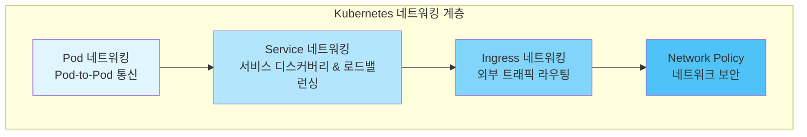
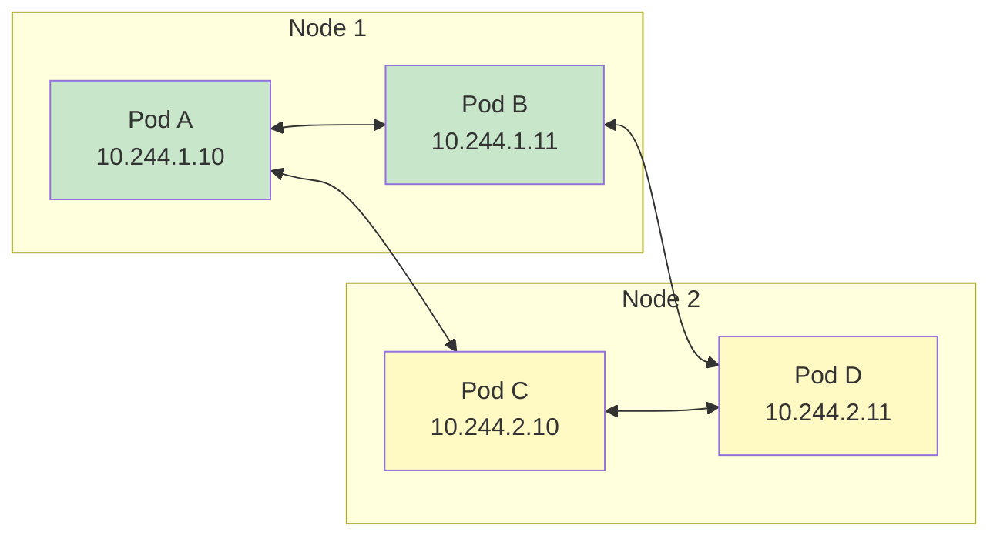
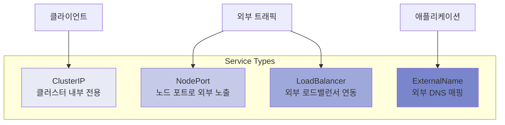
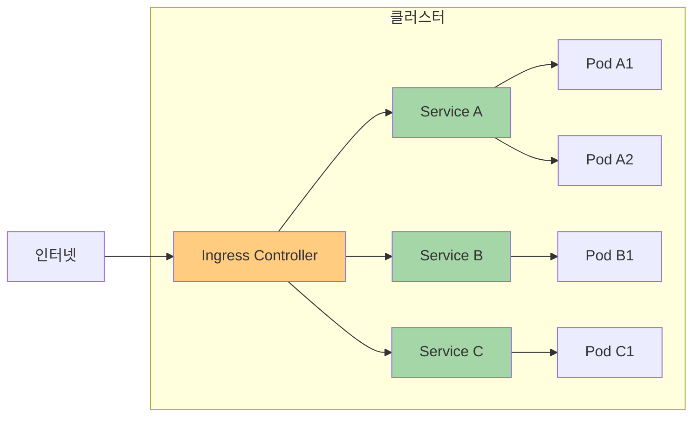
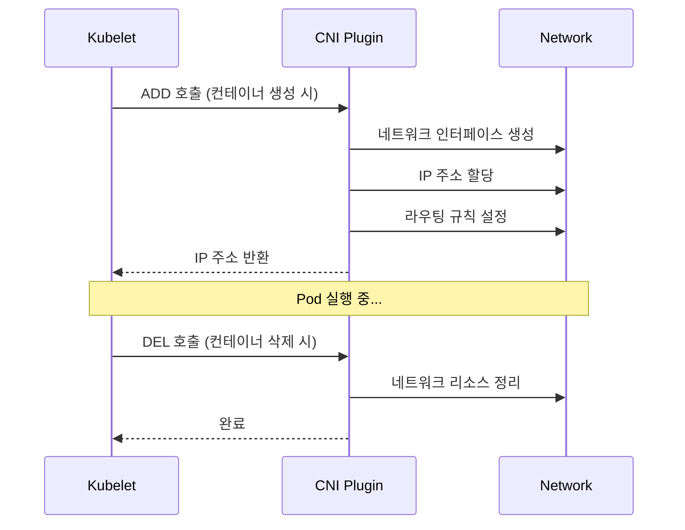
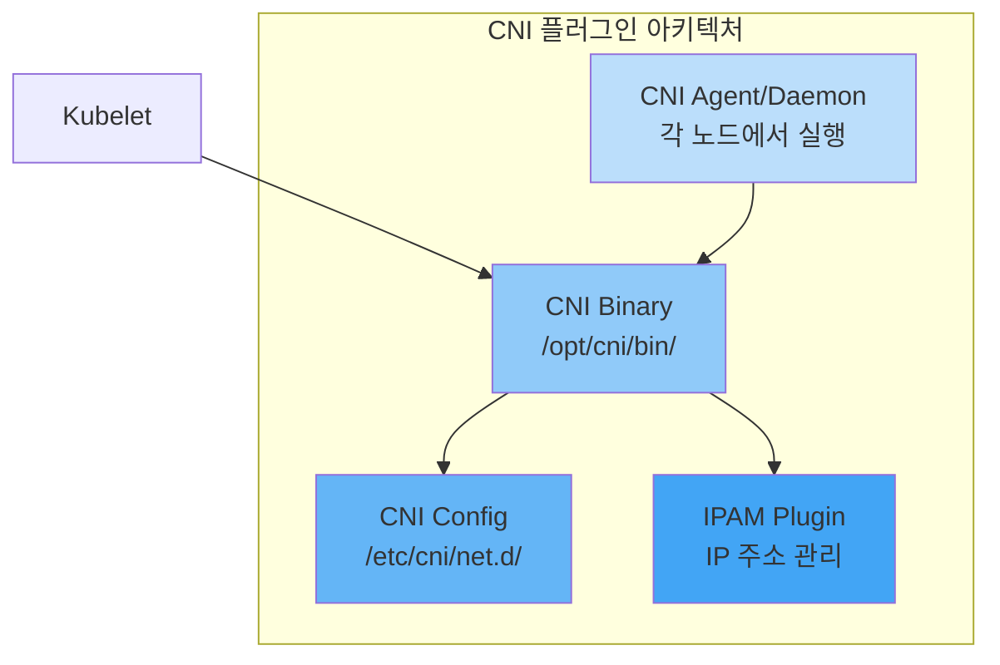
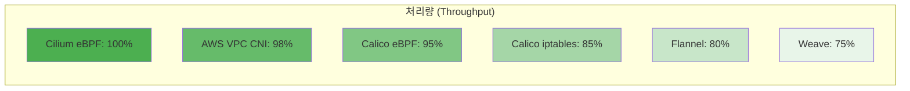
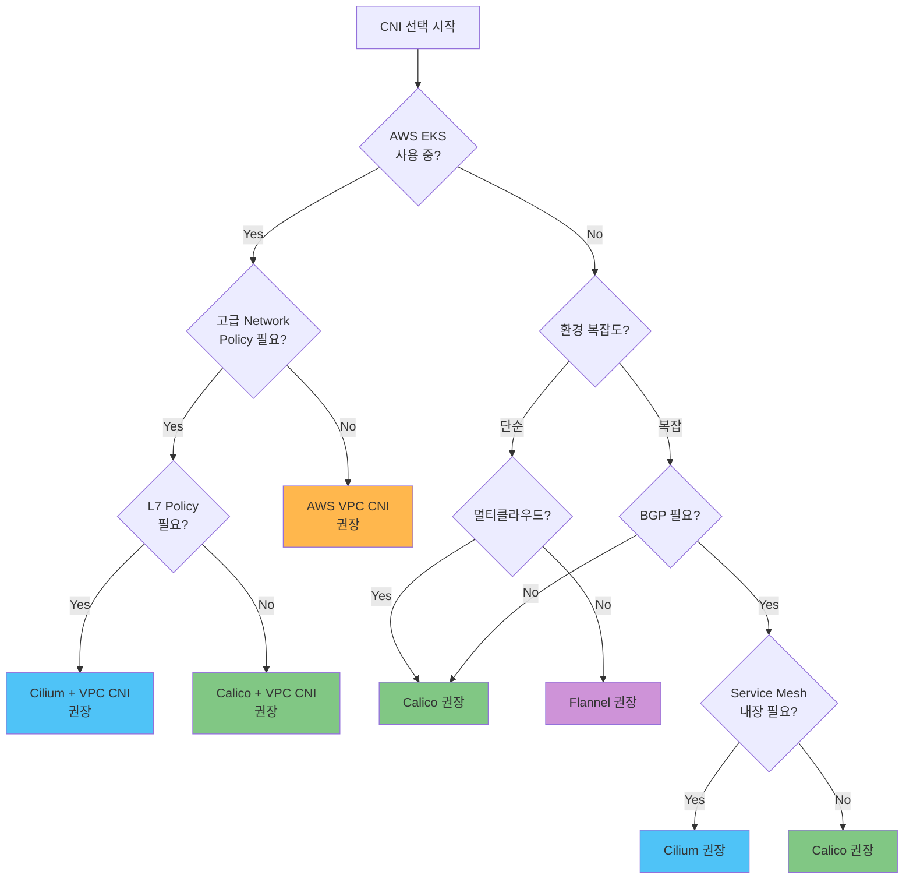
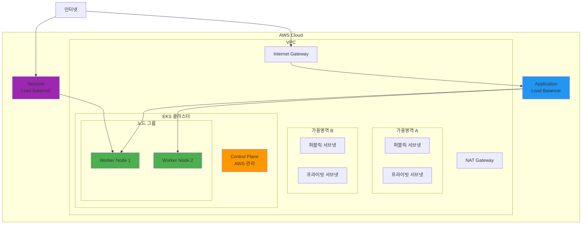
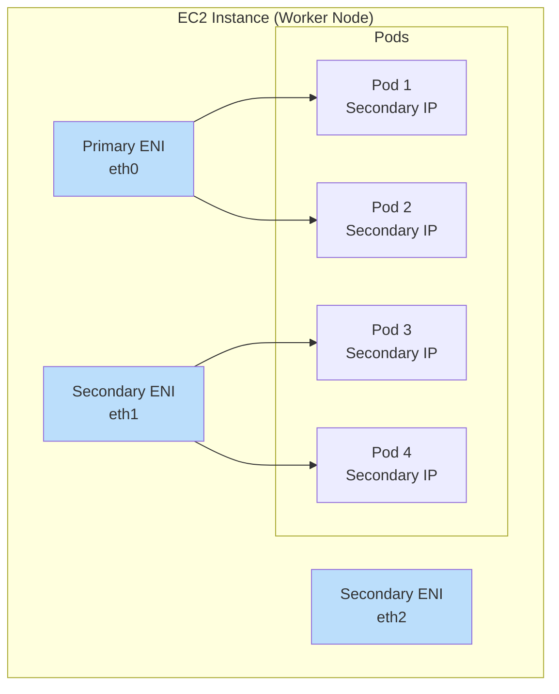

# Kubernetes 네트워킹

> **마지막 업데이트**: 2025년 2월 21일

## 개요

Kubernetes 네트워킹은 컨테이너화된 애플리케이션 간의 통신을 가능하게 하는 핵심 인프라 계층입니다. 이 섹션에서는 Kubernetes 네트워킹의 기본 개념부터 고급 CNI(Container Network Interface) 솔루션, 그리고 AWS EKS 환경에서의 네트워킹 패턴까지 다룹니다.

## Kubernetes 네트워킹 모델

Kubernetes는 다음과 같은 네트워킹 요구사항을 기반으로 설계되었습니다:

1. **모든 Pod는 NAT 없이 다른 모든 Pod와 통신할 수 있어야 함**
2. **모든 노드는 NAT 없이 모든 Pod와 통신할 수 있어야 함**
3. **Pod가 자신을 보는 IP와 다른 Pod가 그 Pod를 보는 IP가 동일해야 함**



### Pod 네트워킹

Pod 네트워킹은 Kubernetes 네트워킹의 가장 기본적인 계층입니다. 각 Pod는 고유한 IP 주소를 가지며, 클러스터 내의 다른 모든 Pod와 직접 통신할 수 있습니다.



#### Pod 네트워킹 구현 방식

| 방식 | 설명 | 예시 CNI |
|------|------|----------|
| **Overlay 네트워크** | 기존 네트워크 위에 가상 네트워크 구성 | Flannel (VXLAN), Calico (IPIP), Weave Net |
| **언더레이 네트워크** | 물리 네트워크에 직접 라우팅 | AWS VPC CNI, Calico (BGP), Cilium (Native Routing) |
| **하이브리드** | 환경에 따라 오버레이/언더레이 선택 | Cilium, Calico |

### Service 네트워킹

Service는 Pod 집합에 대한 안정적인 네트워크 엔드포인트를 제공합니다.



#### Service 유형별 특징

```yaml
# ClusterIP Service 예시
apiVersion: v1
kind: Service
metadata:
  name: my-service
  namespace: default
spec:
  type: ClusterIP
  selector:
    app: my-app
  ports:
    - protocol: TCP
      port: 80
      targetPort: 8080
---
# NodePort Service 예시
apiVersion: v1
kind: Service
metadata:
  name: my-nodeport-service
spec:
  type: NodePort
  selector:
    app: my-app
  ports:
    - protocol: TCP
      port: 80
      targetPort: 8080
      nodePort: 30080  # 30000-32767 범위
---
# LoadBalancer Service 예시
apiVersion: v1
kind: Service
metadata:
  name: my-loadbalancer-service
  annotations:
    service.beta.kubernetes.io/aws-load-balancer-type: "nlb"
spec:
  type: LoadBalancer
  selector:
    app: my-app
  ports:
    - protocol: TCP
      port: 443
      targetPort: 8443
```

### Ingress 네트워킹

Ingress는 HTTP/HTTPS 트래픽을 클러스터 내부 Service로 라우팅하는 규칙을 정의합니다.



```yaml
# Ingress 예시
apiVersion: networking.k8s.io/v1
kind: Ingress
metadata:
  name: my-ingress
  annotations:
    kubernetes.io/ingress.class: "alb"
    alb.ingress.kubernetes.io/scheme: "internet-facing"
spec:
  rules:
    - host: api.example.com
      http:
        paths:
          - path: /v1
            pathType: Prefix
            backend:
              service:
                name: api-v1
                port:
                  number: 80
          - path: /v2
            pathType: Prefix
            backend:
              service:
                name: api-v2
                port:
                  number: 80
    - host: web.example.com
      http:
        paths:
          - path: /
            pathType: Prefix
            backend:
              service:
                name: web-frontend
                port:
                  number: 80
```

## CNI (Container Network Interface)

CNI는 컨테이너 네트워크 연결을 위한 표준 인터페이스입니다. Kubernetes는 CNI 플러그인을 통해 Pod 네트워킹을 구현합니다.

### CNI 동작 방식



### CNI 플러그인 구성 요소



## CNI 비교 매트릭스

### 주요 CNI 솔루션 비교

| 기능 | Cilium | Calico | Flannel | AWS VPC CNI | Weave Net |
|------|--------|--------|---------|-------------|-----------|
| **기반 기술** | eBPF | iptables/eBPF | VXLAN/host-gw | AWS ENI | VXLAN |
| **Network Policy** | ✅ 고급 (L3-L7) | ✅ 고급 (L3-L4) | ❌ | ✅ 기본 (L3-L4) | ✅ 기본 |
| **암호화** | ✅ WireGuard/IPsec | ✅ WireGuard/IPsec | ❌ | ❌ | ✅ 내장 |
| **Service Mesh** | ✅ 내장 | ❌ | ❌ | ❌ | ❌ |
| **Observability** | ✅ Hubble | ⚠️ 제한적 | ❌ | ❌ | ❌ |
| **BGP 지원** | ✅ | ✅ | ❌ | ❌ | ❌ |
| **멀티클러스터** | ✅ ClusterMesh | ✅ Federation | ❌ | ❌ | ✅ |
| **Windows 지원** | ⚠️ 베타 | ✅ | ✅ | ✅ | ✅ |
| **성능** | ⭐⭐⭐⭐⭐ | ⭐⭐⭐⭐ | ⭐⭐⭐ | ⭐⭐⭐⭐⭐ | ⭐⭐⭐ |
| **복잡도** | 중간-높음 | 중간 | 낮음 | 낮음 | 낮음 |
| **커뮤니티** | 활발 | 매우 활발 | 활발 | AWS 지원 | 보통 |

### 상세 기능 비교

#### 네트워킹 모드

| CNI | Overlay | Native Routing | BGP | Direct Routing |
|-----|---------|----------------|-----|----------------|
| **Cilium** | VXLAN, Geneve | ✅ | ✅ | ✅ |
| **Calico** | VXLAN, IPIP | ✅ | ✅ | ✅ |
| **Flannel** | VXLAN | host-gw | ❌ | ❌ |
| **AWS VPC CNI** | ❌ | VPC Native | ❌ | ✅ |
| **Weave Net** | VXLAN | ❌ | ❌ | ❌ |

#### Network Policy 기능

| 기능 | Cilium | Calico | AWS VPC CNI |
|------|--------|--------|-------------|
| **Ingress Policy** | ✅ | ✅ | ✅ |
| **Egress Policy** | ✅ | ✅ | ✅ |
| **L7 Policy (HTTP)** | ✅ | ❌ | ❌ |
| **DNS-based Policy** | ✅ | ✅ | ❌ |
| **FQDN Policy** | ✅ | ✅ | ❌ |
| **Host Policy** | ✅ | ✅ | ❌ |
| **Global Policy** | ✅ | ✅ | ❌ |
| **Policy Tiers** | ✅ | ✅ | ❌ |

#### 성능 벤치마크 (상대적 비교)



## CNI 선택 가이드

### 의사결정 플로우차트



### 사용 사례별 권장 CNI

#### 1. AWS EKS 프로덕션 환경

**권장: AWS VPC CNI + Calico (Network Policy)**

```yaml
# eksctl 클러스터 구성 예시
apiVersion: eksctl.io/v1alpha5
kind: ClusterConfig
metadata:
  name: production-cluster
  region: ap-northeast-2
vpc:
  cidr: "10.0.0.0/16"
addons:
  - name: vpc-cni
    version: latest
    configurationValues: |
      enableNetworkPolicy: "true"
  - name: coredns
  - name: kube-proxy
```

#### 2. 고급 보안 요구사항

**권장: Cilium**

- L7 Network Policy 지원
- DNS 기반 정책
- 프로세스/파일 수준 보안 정책
- 암호화된 통신 (WireGuard)

#### 3. 온프레미스/베어메탈 환경

**권장: Calico (BGP 모드)**

- 기존 네트워크 인프라와 통합
- ToR 스위치와 BGP 피어링
- 높은 성능 (오버레이 없음)

#### 4. 개발/테스트 환경

**권장: Flannel**

- 간단한 설치 및 구성
- 낮은 리소스 사용량
- 충분한 기본 기능

#### 5. Service Mesh 통합 환경

**권장: Cilium (Sidecar-less Service Mesh)**

- Istio/Envoy 대체 가능
- mTLS, 트래픽 관리
- 낮은 오버헤드

## EKS 네트워킹 기본 사항

### EKS 기본 네트워킹 아키텍처



### VPC CNI 동작 방식

AWS VPC CNI는 각 Pod에 VPC의 실제 IP 주소를 할당합니다.



#### ENI 및 IP 제한

| 인스턴스 유형 | 최대 ENI | ENI당 IPv4 | 최대 Pod (권장) |
|--------------|----------|------------|----------------|
| t3.medium | 3 | 6 | 17 |
| t3.large | 3 | 12 | 35 |
| m5.large | 3 | 10 | 29 |
| m5.xlarge | 4 | 15 | 58 |
| m5.2xlarge | 4 | 15 | 58 |
| c5.4xlarge | 8 | 30 | 234 |

### EKS 네트워킹 고려사항

#### IP 주소 관리

```yaml
# VPC CNI 구성 - IP 프리픽스 위임
apiVersion: v1
kind: ConfigMap
metadata:
  name: amazon-vpc-cni
  namespace: kube-system
data:
  enable-prefix-delegation: "true"
  warm-prefix-target: "1"
  minimum-ip-target: "5"
  warm-ip-target: "2"
```

#### 사용자 정의 네트워킹

```yaml
# ENIConfig를 사용한 사용자 정의 서브넷
apiVersion: crd.k8s.amazonaws.com/v1alpha1
kind: ENIConfig
metadata:
  name: ap-northeast-2a
spec:
  securityGroups:
    - sg-0123456789abcdef0
  subnet: subnet-0123456789abcdef0
---
apiVersion: crd.k8s.amazonaws.com/v1alpha1
kind: ENIConfig
metadata:
  name: ap-northeast-2b
spec:
  securityGroups:
    - sg-0123456789abcdef0
  subnet: subnet-fedcba9876543210f
```

## 네트워킹 하위 페이지

이 섹션에서는 다음 주제들을 상세히 다룹니다:

### [VPC CNI](01-vpc-cni.md)
EKS 기본 CNI. 각 Pod에 VPC IP를 할당하여 네이티브 VPC 네트워킹 제공.

### [Cilium 딥다이브](cilium/README.md)
eBPF 기반의 고성능 CNI 솔루션. L7 Network Policy, Service Mesh, 관측성(Hubble) 등 고급 기능 제공.

### [Calico 딥다이브](calico/README.md)
가장 널리 사용되는 CNI 중 하나. 강력한 Network Policy, BGP 지원, 엔터프라이즈 기능. 소개, 아키텍처, 네트워킹 모드, BGP 심화, Network Policy, eBPF, 고급 주제, EKS 통합, 운영 가이드를 다룹니다.

### [VPC Lattice](03-vpc-lattice.md)
AWS의 관리형 애플리케이션 네트워킹 서비스. 크로스 VPC, 크로스 계정 서비스 간 통신.

### [AWS Load Balancer Controller](04-aws-lb-controller.md)
Kubernetes Service와 Ingress를 AWS ELB(ALB/NLB)와 통합.

### [Gateway API](05-gateway-api.md)
차세대 Kubernetes 인그레스 API. 표준화된 리소스 모델과 역할 기반 구성.

## 네트워크 트러블슈팅

### 일반적인 문제와 해결 방법

#### Pod 간 통신 실패

```bash
# 1. Pod IP 확인
kubectl get pods -o wide

# 2. 네트워크 연결 테스트
kubectl exec -it <pod-name> -- ping <target-pod-ip>

# 3. DNS 해석 테스트
kubectl exec -it <pod-name> -- nslookup <service-name>

# 4. CNI 로그 확인
kubectl logs -n kube-system -l k8s-app=aws-node
kubectl logs -n kube-system -l k8s-app=cilium
```

#### Service 접근 불가

```bash
# 1. Service 상태 확인
kubectl get svc <service-name> -o yaml

# 2. Endpoints 확인
kubectl get endpoints <service-name>

# 3. kube-proxy 로그 확인
kubectl logs -n kube-system -l k8s-app=kube-proxy
```

#### Network Policy 디버깅

```bash
# Cilium의 경우
kubectl exec -n kube-system -it <cilium-pod> -- cilium policy get
kubectl exec -n kube-system -it <cilium-pod> -- cilium endpoint list

# Calico의 경우
kubectl get networkpolicy -A
kubectl get globalnetworkpolicy
calicoctl get policy -o yaml
```

### 네트워크 성능 테스트

```yaml
# iperf3를 사용한 네트워크 성능 테스트
apiVersion: v1
kind: Pod
metadata:
  name: iperf-server
  labels:
    app: iperf-server
spec:
  containers:
  - name: iperf
    image: networkstatic/iperf3
    command: ["iperf3", "-s"]
    ports:
    - containerPort: 5201
---
apiVersion: v1
kind: Pod
metadata:
  name: iperf-client
spec:
  containers:
  - name: iperf
    image: networkstatic/iperf3
    command: ["sleep", "infinity"]
```

```bash
# 테스트 실행
kubectl exec -it iperf-client -- iperf3 -c <iperf-server-ip> -t 30
```

## 모범 사례

### 1. IP 주소 계획

- CIDR 블록을 충분히 크게 설계
- Pod 네트워크와 Service 네트워크 분리
- 향후 확장을 고려한 서브넷 설계

### 2. Network Policy 적용

- 기본 거부 정책 적용 (Zero Trust)
- 필요한 트래픽만 명시적으로 허용
- 네임스페이스 간 격리

```yaml
# 기본 거부 정책 예시
apiVersion: networking.k8s.io/v1
kind: NetworkPolicy
metadata:
  name: default-deny-all
  namespace: production
spec:
  podSelector: {}
  policyTypes:
    - Ingress
    - Egress
```

### 3. 성능 최적화

- 적절한 CNI 선택 (워크로드에 맞는)
- MTU 최적화
- 커널 파라미터 튜닝

### 4. 보안 강화

- 암호화된 통신 (WireGuard, IPsec)
- mTLS 적용
- 정기적인 보안 감사

### 5. 관측성 확보

- 네트워크 메트릭 수집
- 플로우 로그 활성화
- 분산 추적 구현

## 다음 단계

1. [VPC CNI](01-vpc-cni.md) - EKS 기본 CNI
2. [Cilium 딥다이브](cilium/README.md) - eBPF 기반 네트워킹
3. [Calico 딥다이브](calico/README.md) - 엔터프라이즈 CNI
4. [VPC Lattice](03-vpc-lattice.md) - AWS 관리형 네트워킹
5. [AWS Load Balancer Controller](04-aws-lb-controller.md) - ELB 통합
6. [Gateway API](05-gateway-api.md) - 차세대 인그레스

---

## 참고 자료

- [Kubernetes 네트워킹 모델](https://kubernetes.io/docs/concepts/cluster-administration/networking/)
- [CNI 명세](https://github.com/containernetworking/cni/blob/master/SPEC.md)
- [AWS VPC CNI 문서](https://docs.aws.amazon.com/eks/latest/userguide/pod-networking.html)
- [Network Policy 가이드](https://kubernetes.io/docs/concepts/services-networking/network-policies/)
