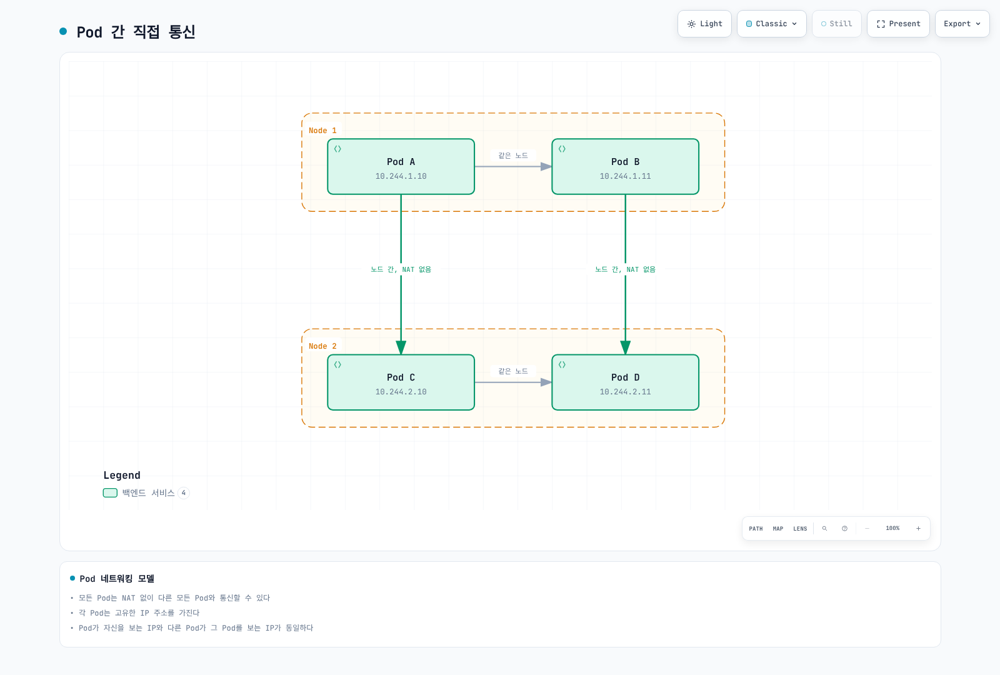
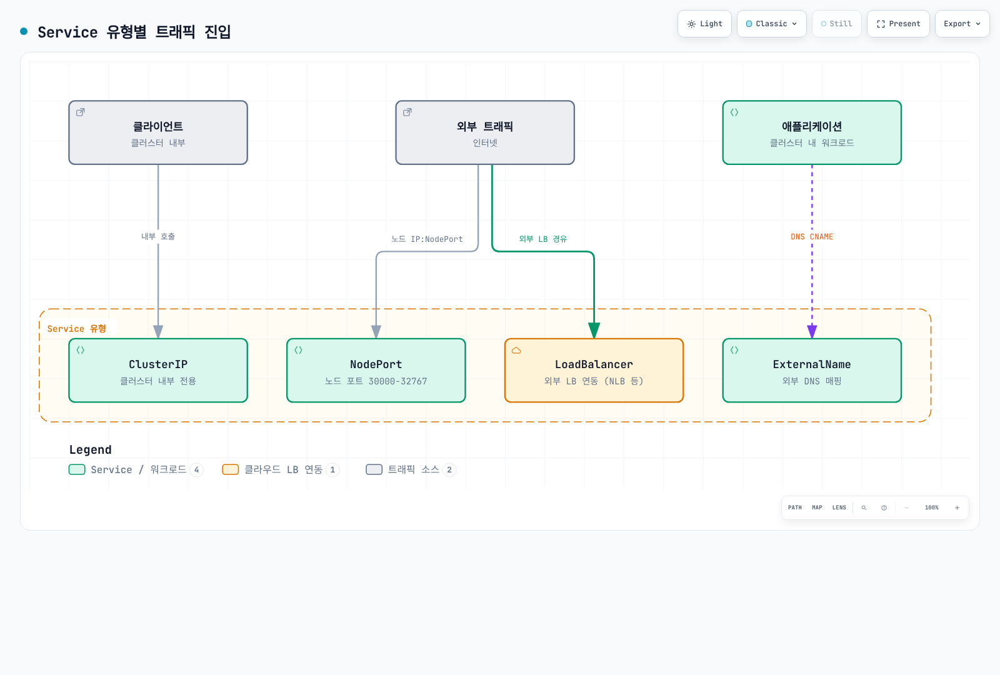
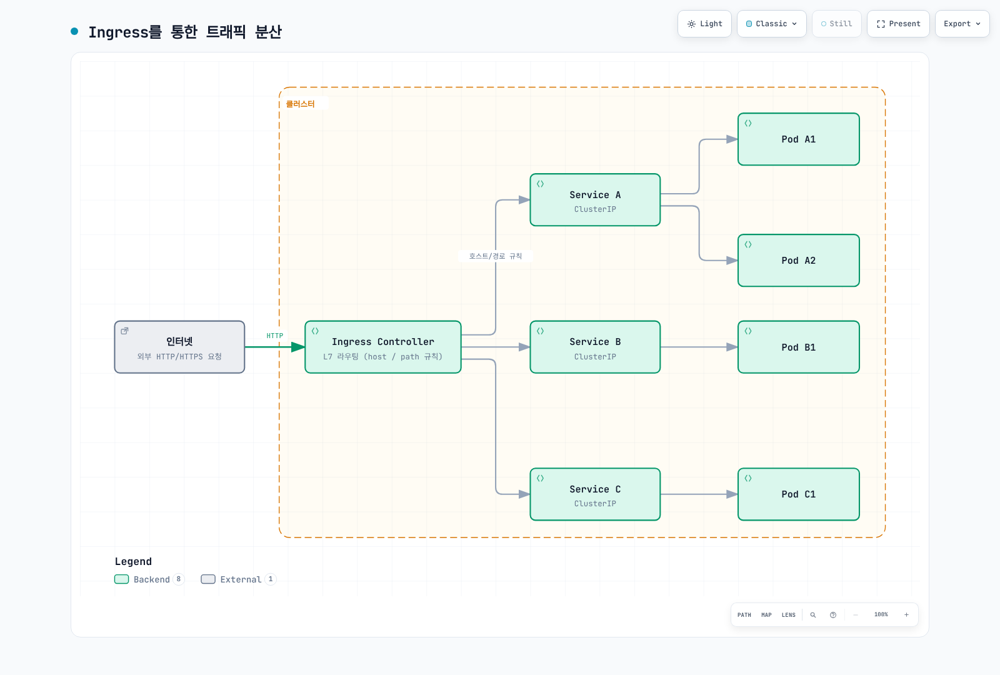
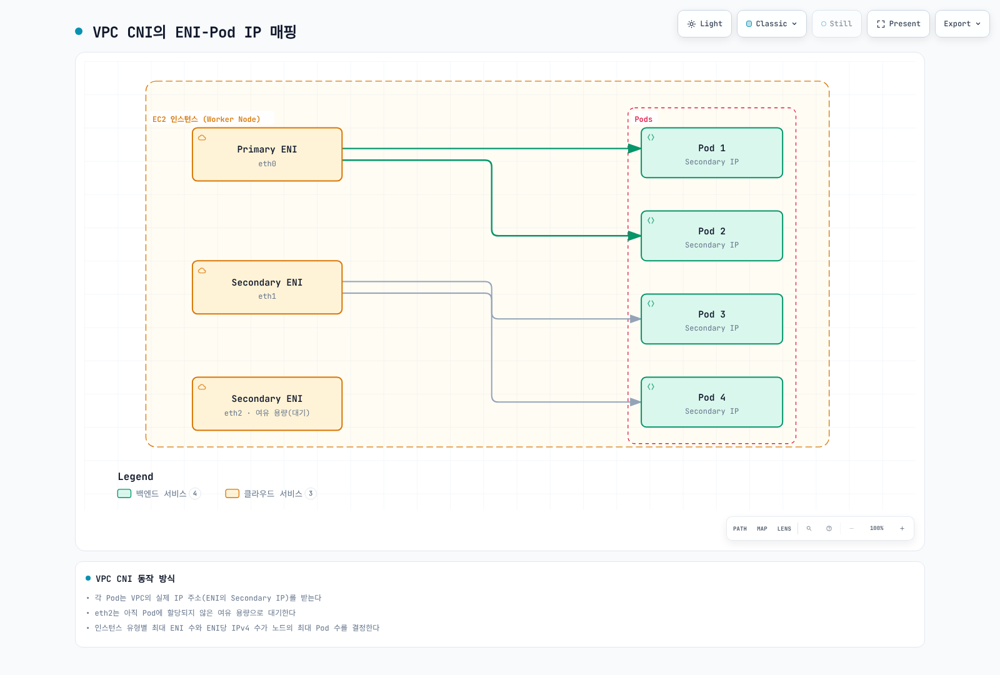

# Kubernetes 네트워킹

> **검토일**: 2026년 9월 12일. 기능 근거는 Cilium 1.20.1, Calico Open Source 3.32, Flannel 0.28.9, AWS VPC CNI 1.23.0을 포함합니다. 설치 전 제품별 Kubernetes·플랫폼 지원 범위를 확인합니다. 이 버전들을 하나의 클러스터에서 함께 검증했다는 의미는 아닙니다.

## 개요

Kubernetes 네트워킹은 컨테이너화된 애플리케이션 간의 통신을 가능하게 하는 핵심 인프라 계층입니다. 이 섹션에서는 Kubernetes 네트워킹의 기본 개념부터 고급 CNI(Container Network Interface) 솔루션, 그리고 AWS EKS 환경에서의 네트워킹 패턴까지 다룹니다.

## Kubernetes 네트워킹 모델

현재 Kubernetes 모델의 Pod 네트워크는 **의도적인 네트워크 분리를 고려하면서**, 노드 경계를 넘어 주소 변환이나 프록시 없이 Pod끼리 직접 통신할 수 있는 기반을 제공합니다. kubelet 같은 노드 에이전트는 자기 노드의 Pod에 접근할 수 있어야 합니다. 개별 연결의 성공 여부는 정책, 라우팅, 애플리케이션 리스너에도 달려 있습니다.

일반 Pod는 자체 네트워크 네임스페이스와 클러스터 범위 주소를 가지며, 같은 Pod의 컨테이너는 그 네임스페이스와 localhost를 공유합니다. host-network Pod는 노드 네트워크를 공유하고 dual-stack·다중 네트워크 구성에서는 주소를 더 세밀하게 구분해야 합니다. Pod를 재생성하면 IP가 달라질 수 있지만 같은 Pod 내부 컨테이너를 재시작한다고 네트워크 sandbox까지 반드시 재생성되지는 않습니다.

| 구성 요소 | 역할 |
|---|---|
| Pod 네트워크 | 워크로드 네트워크 네임스페이스의 주소와 연결 제공 |
| Service·discovery | 바뀌는 엔드포인트에 안정적인 서비스 이름이나 가상 주소 제공 |
| Ingress/Gateway 구현 | 설정한 외부 진입점과 애플리케이션 라우팅 제공 |
| 네트워크 정책 엔진 | 선택한 구현이 지원하는 정책 강제 |

이 역할이 반드시 순서대로 지나는 패킷 경로를 뜻하지는 않습니다. Service 주소 변환, L7 프록시, 워크로드 정책에 따라 실제 요청 경로가 달라집니다.

### Pod 네트워킹

Pod 네트워킹은 통신에 필요한 주소와 라우팅을 제공합니다. 아래 그림은 일반 IPv4 Pod 예제이며 해당 정책과 네트워크 제어가 연결을 허용한다고 가정합니다.



[🔍 인터랙티브 다이어그램 보기](https://www.atomai.click/kubernetes-docs/archmaps/ko-networking-readme-1.html)

주소는 설명용 일반 Pod 주소입니다. 의도적인 격리나 host-network·다중 네트워크 구성에서는 별도의 해석이 필요합니다.

#### Pod 네트워킹 구현 방식

| 방식 | 설명 | 예시 CNI |
|------|------|----------|
| **Overlay 네트워크** | 기존 네트워크 위에서 트래픽 캡슐화 | Flannel VXLAN, Calico VXLAN/IPIP, Cilium VXLAN/Geneve |
| **Native Routing** | 해당 overlay 캡슐화 없이 하부 네트워크의 경로 사용 | AWS VPC CNI, Calico routing/BGP, Cilium native routing |
| **조건부 캡슐화** | 설정한 토폴로지에 따라 직접 경로나 캡슐화 선택 | 제품별 전제가 다른 Calico/Flannel/Cilium 지원 모드 |

### Service 네트워킹

Service는 보통 Pod로 이루어진 논리적 엔드포인트 집합과 접근 방법을 정의합니다. 기본 ClusterIP는 안정적인 가상 IP를 제공하고, headless Service는 가상 IP를 생략하며, ExternalName은 DNS CNAME을 사용합니다. Pod 선택자 없이 관리하는 엔드포인트도 참조할 수 있습니다.



[🔍 인터랙티브 다이어그램 보기](https://www.atomai.click/kubernetes-docs/archmaps/ko-networking-readme-2.html)

일반적인 노출 방식이며 보안 보장이 아닙니다. NodePort 범위와 접근 가능한 노드 주소를 설정할 수 있고 LoadBalancer는 내부용일 수도 있습니다. ExternalName은 DNS 별칭을 반환하며 전달 프록시를 만들지 않습니다.

#### Service 유형별 특징

`default`에 표시된 target port를 수신하는 `app: my-app` Pod를 준비합니다. NodePort의 기본 할당 범위는 30000–32767이며 변경할 수 있습니다. 외부 접근은 주소, 라우팅, 접근 제어에도 달려 있습니다.

LoadBalancer 예제는 **AWS Load Balancer Controller**를 명시적으로 선택하고 EC2 instance 대상과 할당된 NodePort를 사용합니다. 먼저 해당 컨트롤러와 IAM·서브넷 전제를 구성합니다. EKS Auto Mode는 다른 컨트롤러·class를 사용합니다. 여기서 포트 443은 TCP 포트 선택일 뿐이며, 백엔드 8443에서 TLS를 제공하거나 로드 밸런서에 별도로 설정해야 합니다.

포트 변환은 일반 Kubernetes Service API를 설명합니다. 현재 AWS 문서의 EKS 네이티브 네트워크 정책에는 Service 포트와 컨테이너 포트 일치, 안정적인 강제를 위한 `metadata.ownerReferences`가 있는 컨트롤러 관리 Pod라는 추가 전제가 있습니다. 해당 정책 구현을 시험하기 전에 예제를 이 조건에 맞춥니다.

```yaml
apiVersion: v1
kind: Service
metadata:
  name: my-service
  namespace: default
spec:
  type: ClusterIP
  selector:
    app: my-app
  ports:
  - protocol: TCP
    port: 80
    targetPort: 8080
---
apiVersion: v1
kind: Service
metadata:
  name: my-nodeport-service
  namespace: default
spec:
  type: NodePort
  selector:
    app: my-app
  ports:
  - protocol: TCP
    port: 80
    targetPort: 8080
    nodePort: 30080
---
apiVersion: v1
kind: Service
metadata:
  name: my-loadbalancer-service
  annotations:
    service.beta.kubernetes.io/aws-load-balancer-scheme: internet-facing
    service.beta.kubernetes.io/aws-load-balancer-nlb-target-type: instance
  namespace: default
spec:
  type: LoadBalancer
  selector:
    app: my-app
  ports:
  - protocol: TCP
    port: 443
    targetPort: 8443
  loadBalancerClass: service.k8s.aws/nlb
  allocateLoadBalancerNodePorts: true
```

### Ingress 네트워킹

Ingress 리소스에는 컨트롤러와 데이터 플레인이 필요합니다. 이 HTTP 예제는 AWS LBC, `spec.ingressClassName: alb`, IP 대상을 사용합니다. `api-v1`, `api-v2`, `web-frontend` Service가 `default`에 존재하고 포트 80 및 VPC에서 라우팅 가능한 준비된 Pod 엔드포인트를 제공해야 합니다. 필요한 HTTPS·인증서는 별도로 구성합니다. 설치·대상 전제는 [LBC 가이드](03-aws-lb-controller.md)를 확인합니다.

Ingress는 HTTP/HTTPS 트래픽을 클러스터 내부 Service로 라우팅하는 규칙을 정의합니다.



[🔍 인터랙티브 다이어그램 보기](https://www.atomai.click/kubernetes-docs/archmaps/ko-networking-readme-3.html)

상자는 Ingress 데이터 플레인 기능을 나타냅니다. AWS LBC는 ALB를 설정하며 애플리케이션 트래픽이 컨트롤러 조정 프로세스를 통과하지 않습니다. 대상 모드에 따라 Service 가상 IP를 실제 추가 홉으로 거치지 않고 Pod IP나 NodePort에 도달할 수 있습니다.

```yaml
apiVersion: networking.k8s.io/v1
kind: Ingress
metadata:
  name: my-ingress
  annotations:
    alb.ingress.kubernetes.io/scheme: internet-facing
    alb.ingress.kubernetes.io/target-type: ip
  namespace: default
spec:
  rules:
  - host: api.example.com
    http:
      paths:
      - path: /v1
        pathType: Prefix
        backend:
          service:
            name: api-v1
            port:
              number: 80
      - path: /v2
        pathType: Prefix
        backend:
          service:
            name: api-v2
            port:
              number: 80
  - host: web.example.com
    http:
      paths:
      - path: /
        pathType: Prefix
        backend:
          service:
            name: web-frontend
            port:
              number: 80
  ingressClassName: alb
```

## CNI (Container Network Interface)

CNI는 런타임이 컨테이너 네트워크를 설정하는 인터페이스를 표준화합니다. 현재 Kubernetes에서는 kubelet이 CRI로 Pod sandbox 작업을 요청하고 **컨테이너 런타임이 CNI를 관리**합니다. 과거 kubelet의 직접 CNI 관리 플래그는 Kubernetes 1.24에서 제거되었습니다.

### 런타임과 플러그인의 역할

| 주체 | 역할 |
|---|---|
| kubelet | 컨테이너 런타임 인터페이스로 sandbox 생성·제거 요청 |
| 컨테이너 런타임 | 네트워크 설정 선택과 CNI 플러그인 체인 호출 |
| CNI 플러그인 | 설정을 받아 ADD/DEL 등 지원 작업을 수행하고 결과 반환 |
| IPAM 구현 | 주소 할당·반환, 위임한 플러그인이나 공급자별 에이전트로 구현 가능 |
| 선택적 노드 에이전트 | 공급자별 라우팅·정책·IP pool·데이터 플레인 상태 유지 |

런타임이 CNI 인터페이스로 플러그인에 설정을 전달합니다. 모든 플러그인에 별도 장기 실행 에이전트나 IPAM 바이너리가 필수인 것은 아닙니다. veth pair가 흔하지만 다른 인터페이스 구현도 있습니다.

## CNI 비교

| 프로젝트·범위 | 네트워킹과 정책 | 구분할 기능·제약 |
|---|---|---|
| **Cilium 1.20.1** | eBPF 네트워킹, 해당 L7 기능에 Envoy 사용, Cilium 네트워크 정책·Hubble | Linux 워커 데이터 플레인과 AMD64/Arm64 전제. Windows CLI 제공은 Windows CNI 지원이 아님. WireGuard/IPsec과 Beta ztunnel mTLS의 범위가 다름. |
| **Calico Open Source 3.32** | 라우팅·캡슐화 선택, iptables·nftables·eBPF 옵션, 순서 있는 정책 tier와 호스트·워크로드 정책 | Windows에는 Linux eBPF·WireGuard 데이터 플레인 미지원 등 별도 제약이 있음. Whisker/Goldmane 흐름 관측은 Tech Preview. 유료 기능은 제품 edition 표 확인. |
| **Flannel 0.28.9** | 호스트 subnet 할당과 노드 간 전달, VXLAN·host-gw 등 백엔드 | `flanneld` 자체는 NetworkPolicy를 강제하지 않지만 차트의 선택적 `netpol.enabled`가 SIGs 정책 컨트롤러를 배포함. WireGuard 백엔드가 문서화되어 있고 IPsec은 실험 기능. Windows VXLAN은 별도 설정·제약 적용. |
| **AWS VPC CNI 1.23.0 / EKS** | VPC 주소·EC2 ENI/prefix 할당, 지원되는 Linux EC2 노드에서 EKS 표준·Admin 정책 | EKS Auto Mode는 DNS 정책 기능도 가진 관리형 네트워킹 구현. Windows, Fargate, custom networking, prefix delegation, multi-NIC는 각각 조건이 다름. |
| **원래 Weave Net 프로젝트** | 과거 overlay 네트워킹 구현 | 원래 `weaveworks/weave` 저장소가 archived 상태이므로 신규 클러스터의 활성·지원 기본 선택으로 설명하지 않음. |

### 정책·암호화·관측성

- Cilium은 해당 L7 구성 요소를 통해 HTTP/DNS 인식 정책과 클러스터 범위·호스트 정책을 제공합니다. deny/allow 의미는 Calico의 순서 있는 Tier API와 구분합니다.
- Calico Open Source에는 계층적 정책 tier와 호스트 정책이 있습니다. 현재 제품 표의 application-layer 정책, DNS/FQDN 정책, Cluster Mesh는 Cloud/Enterprise 기능이므로 오픈소스 edition 기능으로 혼동하지 않습니다. 문서화된 전송 암호화는 WireGuard입니다.
- Amazon EKS는 Auto Mode와 지원되는 EC2/VPC-CNI 설치에 `ClusterNetworkPolicy` Admin/Baseline 제어를 제공합니다. AWS가 설명하는 DNS/FQDN `ApplicationNetworkPolicy`는 **Auto Mode** 기능입니다. 이름만으로 현재 HTTP 메서드·본문 검사까지 지원한다고 해석하지 않습니다.
- Flannel의 선택적 정책 컨트롤러에는 자체 전제가 있으며 네트워킹 백엔드 선택만으로 정책이 활성화되지는 않습니다.
- 노드 간 암호화, 인증된 워크로드 신원, 애플리케이션 mTLS는 서로 다른 제어입니다. 네트워크 흐름 관측도 애플리케이션 추적이나 프로세스·파일 강제와 다릅니다.

### 라우팅과 성능

Calico와 Cilium은 BGP로 경로를 광고할 수 있지만 이것만으로 멀티클러스터 서비스 검색, 정책 동기화, 암호화가 제공되지는 않습니다. Flannel host-gw는 직접 경로와 적절한 L2 연결이 필요합니다. overlay에는 캡슐화·MTU 고려가 추가되지만 CNI 이름만으로 보편적인 성능 순위를 정할 수 없습니다.

이전 100/98/95/85/80/75% 처리량 그림에는 재현할 워크로드, 버전, 측정 출처가 없었습니다. 비교 가능한 하드웨어·커널·패킷/요청 크기·동시성·암호화/정책 설정·처리량·손실·꼬리 지연을 사용합니다. 별도 [Pod 벤치마크](06-pod-network-benchmark.md)의 실제 과거 환경과 측정은 해당 문서에 유지합니다.

## CNI 선택 가이드

필요한 라우팅, 정책, 운영체제, 지원 모델을 먼저 선택하고 그 조합을 시험합니다.

| 요구 | 검토 경로 |
|---|---|
| 표준 EKS VPC 주소와 지원 네트워크 정책 | 두 번째 정책 엔진을 추가하기 전에 AWS VPC CNI/EKS 기능 검토 |
| 순서 있는 정책 tier, 호스트 정책, 인프라 BGP | 해당 Calico edition·데이터 플레인과 라우팅 전제 검토 |
| Cilium 정책, Hubble, 선택적 메시 기능 | Linux·커널·플랫폼 호환성과 [Cilium 메시 가이드](../service-mesh/cilium-service-mesh/README.md) 확인. 해당 L7 경로에는 Envoy가 계속 포함됨. |
| 제한된 기능이 필요한 작은 네트워크 | 실제 요구에 맞는 Flannel 백엔드·선택적 정책 컨트롤러 검토 |
| 프로세스·시스템 호출·파일 제어 | 네트워크 정책과 별도로 Tetragon 같은 런타임 보안 구성 요소 검토 |

### EKS 관리형 Add-on 설정

다음은 **설정 payload** 예제이며 같은 워크로드에 Calico와 VPC CNI 정책 엔진을 함께 설치하라는 의미가 아닙니다.

```json
{
  "enableNetworkPolicy": "true"
}
```

문자열 `"true"`는 공식 문서의 값 타입과 일치합니다. 기존 Kubernetes 버전에 호환되는 EKS add-on build를 선택하고 해당 build의 설정 스키마를 확인합니다.

```bash
EKS_REGION=ap-northeast-2
KUBERNETES_MINOR=1.35  # Replace with the existing cluster's minor version
aws eks describe-addon-versions --region "$EKS_REGION" --addon-name vpc-cni \
  --kubernetes-version "$KUBERNETES_MINOR"
: "${VPC_CNI_ADDON_VERSION:?Set the compatible eksbuild version selected from metadata}"
aws eks describe-addon-configuration --region "$EKS_REGION" --addon-name vpc-cni \
  --addon-version "$VPC_CNI_ADDON_VERSION"
```

업스트림 1.23.0 릴리스 번호와 EKS `eksbuild` 버전은 다른 식별자입니다. 의도한 기존 add-on 설정과 변경을 합치고, 무조건 `latest`를 선택하거나 다른 값을 덮어쓰지 않습니다. 기존 타사 정책 구현에서 전환한다면 남아 있는 정책 적용 상태 제거와 검증한 노드·워크로드 전환 계획도 필요합니다.

## EKS 네트워킹 기본 사항

### EKS 기본 네트워킹 아키텍처

| 위치·구성 요소 | 역할 |
|---|---|
| EKS 관리 VPC | AWS가 여러 가용 영역에서 관리형 Kubernetes 제어 평면 실행 |
| 고객 클러스터 VPC | 워커 네트워킹, 선택한 서브넷, EKS 관리 cross-account ENI가 설정한 제어 평면 연결 제공 |
| 선택한 고객 VPC 서브넷의 ALB/NLB | 선택한 공개·내부 애플리케이션 진입점 제공. Internet Gateway/NAT Gateway만으로 해당 라우팅이 대체되지는 않음. |
| NAT Gateway·프라이빗 서비스 엔드포인트 | 워크로드 설계에 필요한 특정 아웃바운드 경로 제공 |

이전 그림은 제어 평면을 고객 VPC 안에, 로드 밸런서를 밖에 표시하여 위 소유 경계로 대체했습니다.

### 컴퓨팅 모드별 DNS와 네트워킹

| 컴퓨팅 모드 | DNS·구성 요소 위치 |
|---|---|
| 표준 EC2 노드 | 일반적으로 설정한 CoreDNS Deployment와 설치한 네트워킹 구성 요소를 사용하며 대체 구현은 별도 지원 설정 필요 |
| 순수 EKS Auto Mode | CoreDNS, VPC CNI, kube-proxy 기능이 관리형 노드 systemd 서비스로 실행되므로 이 노드에는 CoreDNS Deployment/add-on 불필요 |
| Auto Mode와 비 Auto 노드 혼합 | 다른 노드의 Auto Mode DNS 서비스를 사용할 수 없는 비 Auto 노드를 위해 CoreDNS Deployment 유지 |

Auto Mode의 첫 DNS resolver는 노드 로컬입니다. 업스트림 전달과 제어 평면 통신에는 여전히 네트워크 접근이 필요할 수 있으므로 모든 DNS 관련 패킷이 노드 안에 머문다는 보장은 아닙니다. AWS는 Auto Mode의 Admin·DNS 정책을 문서화하고 있으며 표준 EC2 VPC-CNI Admin 정책에는 별도 버전·활성화 전제가 있습니다.

### VPC CNI 동작 방식

AWS VPC CNI는 선택한 IPAM 모드로 일반 Pod에 VPC에서 라우팅 가능한 주소를 제공합니다. 보조 IPv4 주소, 위임 prefix, branch ENI, multi-NIC 구성은 서로 다르며 host-network Pod는 노드 네트워크를 공유합니다.



[🔍 인터랙티브 다이어그램 보기](https://www.atomai.click/kubernetes-docs/archmaps/ko-networking-readme-9.html)

secondary-IP 모드만 나타냅니다. warm ENI는 설정 가능한 할당 전략이며 모든 노드가 반드시 하나씩 예약한다는 의미가 아닙니다. prefix delegation, custom networking, branch ENI는 할당 규칙이 다릅니다.

#### ENI 및 IP 제한

| 인스턴스 유형 | 최대 ENI | ENI당 IPv4 슬롯 | 과거 secondary-IP bootstrap 값 |
|--------------|----------|------------|----------------|
| t3.medium | 3 | 6 | 17 |
| t3.large | 3 | 12 | 35 |
| m5.large | 3 | 10 | 29 |
| m5.xlarge | 4 | 15 | 58 |
| m5.2xlarge | 4 | 15 | 58 |
| c5.4xlarge | 8 | 30 | 234 |

VPC CNI 1.23.0의 인스턴스 한계와 과거 max-Pods 표로 확인한 값입니다. 과거 공식은 `ENI 수 × (ENI당 IPv4 슬롯 − 1) + 2`이며 현재 모든 환경의 권장값이 아닙니다. prefix delegation, custom networking, branch ENI, 다중 네트워크 카드는 주소 용량을 바꿉니다. Kubernetes 스케줄링은 kubelet `maxPods`와 리소스에도 제한됩니다. EKS 관리형 노드 그룹은 vCPU 30개 미만에서 `maxPods` 상한 110, 그 외에는 250을 적용하며 사용 가능한 IP 수만으로 상한이 바뀌지 않습니다.

### EKS 네트워킹 고려사항

#### IP 주소 관리

**Linux VPC CNI**에서는 선택한 add-on/Helm/DaemonSet 관리 방식으로 공식 환경 변수를 구성합니다. 아래는 EKS add-on 설정 조각입니다. 이전 `amazon-vpc-cni` ConfigMap의 `enable-prefix-delegation`은 Linux IPAMD를 이렇게 설정하지 않습니다. 변경 시 의도한 다른 add-on 값도 보존합니다.

```json
{
  "env": {
    "ENABLE_PREFIX_DELEGATION": "true",
    "WARM_PREFIX_TARGET": "1"
  }
}
```

대신 전체 할당 하한과 여유 IP 목표를 조정할 수 있습니다. `MINIMUM_IP_TARGET` 또는 `WARM_IP_TARGET`을 설정하면 `WARM_PREFIX_TARGET`보다 우선하므로 네 가지 독립적인 목표를 더하는 방식이 아닙니다. 실제 할당은 prefix 단위로 이루어집니다. Nitro 지원, IPv4의 연속된 `/28` 공간, 적절한 kubelet Pod 상한은 별도 전제입니다.

Windows prefix 할당은 별도 경로입니다. AWS는 `amazon-vpc-cni` ConfigMap의 `enable-windows-prefix-delegation`과 warm-target 키를 문서화합니다. Linux 환경 변수 절차를 Windows에 그대로 복사하지 않습니다.

```json
{
  "env": {
    "ENABLE_PREFIX_DELEGATION": "true",
    "MINIMUM_IP_TARGET": "5",
    "WARM_IP_TARGET": "2"
  }
}
```

#### 사용자 정의 네트워킹

이 IPv4 예제에는 의도한 AZ·VPC의 실제 서브넷·보안 그룹 ID가 필요합니다. custom networking을 켜고 노드의 zone 레이블로 ENIConfig를 선택합니다. 명시적인 ENIConfig 노드 어노테이션이 있으면 레이블보다 우선합니다. 영문·한글 예제는 같은 리전 이름을 사용하며 실제 노드 zone으로 교체합니다. ENIConfig 객체만 설치한다고 custom networking이 활성화되지는 않습니다.

```json
{
  "env": {
    "AWS_VPC_K8S_CNI_CUSTOM_NETWORK_CFG": "true",
    "ENI_CONFIG_LABEL_DEF": "topology.kubernetes.io/zone"
  }
}
```

```yaml
apiVersion: crd.k8s.amazonaws.com/v1alpha1
kind: ENIConfig
metadata:
  name: ap-northeast-2a
spec:
  securityGroups:
  - sg-0123456789abcdef0
  subnet: subnet-0123456789abcdef0
---
apiVersion: crd.k8s.amazonaws.com/v1alpha1
kind: ENIConfig
metadata:
  name: ap-northeast-2b
spec:
  securityGroups:
  - sg-0123456789abcdef0
  subnet: subnet-fedcba9876543210f
```

## 네트워크 심화 개념

아래 항목들은 이 개요 곳곳에서 이름만 스치듯 언급되는 요소입니다. 각 항목의 전체 설치·설정 절차나 실측값은 링크된 심화 문서에 있으며, 이 절은 그 요소들이 서로 어떻게 다르고 어디에 맞는지를 계층별로 정리합니다.

### L2~L7과 라우터·로드밸런서의 차이

"라우터"와 "로드밸런서"는 종종 같은 자리에서 언급되지만 판단 기준이 다릅니다. 라우터는 목적지 하나에 대해 (일반적으로) 경로 하나를 고르는 장비이고, 로드밸런서는 동등한 대상 여러 개 중 하나를 분산 알고리즘으로 고르는 장비입니다.

| 계층 | 장비·기능 | 판단 기준 | Kubernetes·AWS 매핑 |
|---|---|---|---|
| L2 (링크) | 스위치, 브리지 | 목적지 MAC 주소 | CNI가 만드는 veth pair·Linux 브리지, ENI가 노출하는 가상 NIC |
| L3 (네트워크) | 라우터 | 목적지 IP, 라우팅 테이블의 최장 접두사 일치 | VPC의 암묵적 라우터, TGW, GWLB(패킷을 변형하지 않고 어플라이언스로 투과) |
| L4 (전송) | L4 로드밸런서 | 5-tuple(출발지/목적지 IP·포트, 프로토콜) 단위 연결 | NLB, kube-proxy의 Service 분산(iptables·IPVS·eBPF) |
| L7 (애플리케이션) | L7 로드밸런서·리버스 프록시 | 요청 단위 호스트·경로·헤더, 프로토콜 인식 | ALB, Ingress/Gateway API 구현체, 서비스 메시 사이드카(Envoy) |

핵심 차이는 **분산 단위**입니다. L4 로드밸런서는 연결이 열릴 때 대상을 한 번 고르고 그 흐름이 끝날 때까지 유지하며 페이로드를 보지 않습니다. L7 로드밸런서는 요청마다(같은 연결 위에서도) 대상을 다시 고를 수 있지만 그만큼 프로토콜을 해석해야 하는 비용이 있습니다. GWLB는 이름에 "로드밸런서"가 들어가지만 대상 그룹 사이에서 트래픽 성격을 바꾸는 것이 아니라, 원본 패킷을 GENEVE로 캡슐화해 방화벽·IDS/IPS 같은 어플라이언스로 투과시키는 L3 삽입 지점입니다. 흐름의 고정성(같은 연결은 같은 어플라이언스로)을 흐름 해시로 보장하지만, ALB/NLB처럼 백엔드의 응답 콘텐츠를 바꾸지 않습니다.

> 📎 L2/L3 개념의 프로토콜별 정의는 [네트워크 기초 Part 1](../basics/06-network-fundamentals-part1.md), ALB/NLB 대상 유형과 실제 설정은 [AWS Load Balancer Controller](03-aws-lb-controller.md) 참고.

### 계정·VPC 간 연결: TGW·VPC Peering·GWLB·PrivateLink·Lattice

다섯 연결 방식은 계층과 트래픽 모델이 다릅니다. TGW RAM 공유, VPC Peering, PrivateLink, TGW Peering, VPC Lattice의 실측 지연 비교는 [Cross-Org VPC 연결](05-cross-org-vpc-connectivity.md)에 있습니다. 이 절은 그 표에 없는 GWLB를 포함해 계층 관점으로 다시 정리합니다.

| 연결 방식 | 계층·모델 | 특징 |
|---|---|---|
| VPC Peering | L3, 양방향 IP 라우팅 | 전이(transitive)되지 않음, CIDR 중복 시 구성 불가 |
| Transit Gateway (TGW) | L3, 허브-스포크 IP 라우팅 | 여러 VPC/Peering을 하나의 라우팅 테이블로 중앙화, RAM으로 계정 간 공유 |
| Gateway Load Balancer (GWLB) | L3, 투과형 어플라이언스 삽입 | GENEVE(UDP 6081)로 원본 패킷 캡슐화, VPC 엔드포인트 서비스 모델로 소비자 트래픽을 공급자의 어플라이언스 fleet에 연결 |
| PrivateLink | L4 서비스 엔드포인트 | 소비자 인터페이스 엔드포인트 → 공급자 NLB/서비스, CIDR 중복 허용 |
| VPC Lattice | L7 애플리케이션 네트워킹 | 서비스 DNS 이름·IAM 인가·가중치 라우팅을 갖춘 관리형 HTTP/gRPC 서비스망 |

GWLB는 트래픽을 검사·차단하는 어플라이언스(방화벽, IDS/IPS)를 애플리케이션 라우팅에 개입시키지 않고 네트워크 경로에 투과적으로 끼워 넣는 데 특화되어 있습니다. 소비자 측 서브넷의 라우트를 GWLB 엔드포인트로 향하게 하면, 해당 트래픽이 공급자의 어플라이언스를 거쳐 되돌아옵니다. 같은 흐름이 항상 같은 어플라이언스 인스턴스로 가도록 5-tuple 기반 흐름 해시를 사용하지만, 이는 상태 있는 검사를 위한 고정성이며 애플리케이션 가중치 분배가 아닙니다. TGW·Peering·PrivateLink·Lattice와 마찬가지로 GWLB도 보안 그룹, NACL, 라우팅 전제가 충족되어야 실제로 트래픽이 흐릅니다.

> 📎 EKS와 VPC Lattice의 전체 연동(Gateway API Controller, IAM 인가, 라우팅)은 [VPC Lattice](02-vpc-lattice.md) 참고.

### DNS resolver와 Route Table의 실제 동작

**DNS resolver:** VPC를 만들면 AWS가 VPC 네트워크 범위의 두 번째 주소(예: `10.0.0.0/16`이면 `10.0.0.2`)에 예약된 Amazon-provided DNS resolver를 둡니다. 이 resolver는 VPC 내부 이름(예: private hosted zone, ENI의 내부 DNS 이름)을 해석하고, 그 외 요청은 Route 53 Resolver로 전달합니다. 클러스터 안에서는 CoreDNS가 `kube-dns` 이름 공간을 해석하고, `cluster.local`이 아닌 조회는 노드의 `/etc/resolv.conf`가 가리키는 업스트림(보통 이 VPC resolver)으로 전달합니다. 온프레미스와 VPC 간 이름을 서로 풀어야 하면 Route 53 Resolver의 인바운드/아웃바운드 엔드포인트와 Resolver 규칙이 필요합니다. Auto Mode의 노드 로컬 DNS는 이 전달 경로를 완전히 대체하지 않으며, 업스트림 해석에는 여전히 네트워크 접근이 필요할 수 있습니다.

**Route Table:** VPC 라우팅 테이블 평가는 일반적인 최장 접두사 일치를 따르되 몇 가지 VPC 고유 규칙이 있습니다. VPC CIDR을 위한 `local` 라우트는 항상 가장 구체적으로 취급되며 삭제·재정의할 수 없습니다. 같은 목적지 접두사에 정적 라우트와 (TGW·VPN 등에서) 전파된 라우트가 동시에 존재하면 정적 라우트가 우선합니다. 대상(예: 삭제된 NAT Gateway, 분리된 attachment)이 더 이상 유효하지 않은 라우트는 자동으로 `blackhole` 상태가 되어 트래픽을 조용히 폐기합니다. 서브넷에 명시적으로 연결된 라우팅 테이블이 없으면 VPC의 메인 라우팅 테이블이 적용되므로, "라우트를 추가했는데도 안 된다"의 흔한 원인은 의도한 서브넷이 다른 테이블에 연결되어 있는 경우입니다.

> 📎 TGW/Peering 라우트 우선순위와 정적 라우트 구성 예시는 [Cross-Org VPC 연결의 운영 시 확인할 사항](05-cross-org-vpc-connectivity.md#운영-시-확인할-사항) 참고.

### 커널 데이터 플레인: iptables·IPVS·eBPF·packet filter

Kubernetes Service의 가상 IP를 실제 Pod로 바꾸는 작업(그리고 네트워크 정책 강제)은 Linux의 패킷 필터링 하위 시스템 위에서 이루어집니다. Netfilter는 커널이 패킷 경로에 두는 후크(hook) 집합이고, iptables·nftables는 그 후크에 규칙을 설치하는 사용자 공간 도구입니다. eBPF는 다른 접근입니다. netfilter 후크를 거치지 않고 XDP(드라이버 초입)나 tc(트래픽 컨트롤) 계층, 소켓 후크에 프로그램을 직접 붙입니다.

| 구현 | 위치 | 특징 |
|---|---|---|
| iptables | Netfilter 후크의 순차 규칙 체인 | 규칙 수에 비례해 평가 시간 증가(O(n)), kube-proxy의 오랜 기본 모드 |
| IPVS | 커널 네이티브 L4 로드밸런서, netfilter 확장 | 해시 기반 조회(O(1) 근사), Kubernetes 1.35부터 kube-proxy 모드로는 deprecated |
| nftables | iptables의 후속 netfilter 프레임워크 | 1.33부터 kube-proxy의 stable 모드, 커널·CNI 호환성 확인 필요 |
| eBPF (예: Cilium) | XDP·tc·소켓 계층, netfilter 우회 | kube-proxy를 완전히 대체할 수 있으나 이는 kube-proxy의 "모드"가 아니라 별도 구현 |

이 표의 모드 전환에는 실제 위험이 있습니다. kube-proxy를 IPVS에서 iptables로 되돌릴 때는 공식 절차와 계획된 노드 재시작이 필요합니다. eBPF 기반 CNI로 kube-proxy를 대체할 때도 두 구현이 동시에 같은 Service를 처리하지 않도록 전환 순서를 지켜야 합니다.

> 📎 IPVS deprecation 일정과 nftables stable 전환은 [Kubernetes 소개](../basics/04-kubernetes-introduction.md), Cilium의 eBPF kube-proxy 대체 구현은 [Cilium eBPF](cilium/02-ebpf.md), Calico eBPF 데이터 플레인과 전환 절차는 [Calico eBPF](calico/06-ebpf-dataplane.md) 참고.

### 컴퓨팅 집약 네트워킹: ENI·EFA·NVLink·광 트랜시버

ENI·EFA·NVLink 세 상호연결은 서로 다른 거리와 목적을 갖습니다. **ENI**는 EC2 인스턴스에 붙는 가상 NIC로, 일반 IP 트래픽을 VPC에서 라우팅합니다(구성은 [VPC CNI](01-vpc-cni.md) 참고). **EFA**는 ENA 기반 ENI 위에 OS-bypass 경로(libfabric)를 추가해 MPI/NCCL 같은 집단 통신의 지연을 낮추지만, 일반 ENI와 마찬가지로 **VPC나 가용 영역을 넘어서는 경로에는 쓸 수 없습니다**. **NVLink**는 EFA와 계층이 다릅니다. EFA는 노드 사이(inter-node) 네트워크 패브릭이고, NVLink는 한 노드 안(그리고 NVSwitch를 갖춘 최신 랙 스케일 시스템에서는 랙 안) GPU 간 직접 상호연결입니다. 두 GPU가 NVLink로 묶여 있는지, 서로 다른 노드에 있어 EFA를 거쳐야 하는지는 집단 통신 성능에 수십 배 차이를 만들 수 있으므로 Kubernetes 스케줄링에서 이 토폴로지를 인식하는 것이 중요합니다.

**광 트랜시버(광학 카드)**는 일반적인 데이터센터 네트워킹 개념입니다. 구리 DAC(Direct Attach Copper) 케이블은 짧은 거리·저비용에 적합하고, QSFP/OSFP 같은 광 트랜시버와 광케이블은 더 먼 거리(랙 간·스위치 간)와 더 높은 대역폭이 필요할 때 사용됩니다. AWS는 리전 안의 실제 물리 배선이나 트랜시버 사양을 공개하지 않으므로, 이 내용은 데이터센터 네트워킹의 일반 배경 지식이며 AWS 특정 인프라를 설명하는 것이 아닙니다.

> 📎 NVLink/IMEX 토폴로지 인식 스케줄링과 GPU 파드 배치 예시는 [AI/ML 인프라](../ai-ml/06-ai-infrastructure.md), EFA의 VPC/AZ 경계 제약과 실측은 [Cross-Org VPC 연결](05-cross-org-vpc-connectivity.md) 참고.

### 차세대 프로토콜의 Kubernetes 함의: HTTP/3·gRPC·QUIC

HTTP/3(RFC 9114)와 그 전송 기반인 QUIC(RFC 9000)의 프로토콜 동작 자체는 [네트워크 기초 Part 2](../basics/06-network-fundamentals-part2.md)·[Part 3](../basics/06-network-fundamentals-part3.md)에서 다룹니다. 여기서는 Kubernetes 트래픽 분산에 실제로 영향을 주는 지점만 짚습니다.

- **gRPC와 L4 로드밸런서:** gRPC는 하나의 장기 유지 HTTP/2 연결 위에서 여러 요청을 다중화합니다. L4 로드밸런서(NLB, kube-proxy의 Service 분산)는 연결 단위로 대상을 고르므로, 연결이 한 번 맺어지면 그 안의 모든 요청이 같은 Pod로만 갑니다. Pod 수를 늘려도 이미 열린 연결의 트래픽은 재분배되지 않습니다. 실제로 요청 단위 분산이 필요하면 gRPC를 인식하는 L7 프록시(Envoy, 지원되는 ALB gRPC 설정)나 클라이언트 측 로드밸런싱, 또는 서비스 메시가 필요합니다.
- **Gateway API의 GRPCRoute:** Ingress에는 gRPC 전용 리소스가 없지만 Gateway API는 `GRPCRoute`로 서비스·메서드 단위 라우팅을 표준화합니다. 구현체별 지원 범위(헤더 매칭 개수, 재시도 정책 등)는 컨트롤러 문서를 확인해야 합니다.
- **HTTP/3/QUIC의 클러스터 도달 범위:** 클라이언트와 엣지(예: CDN·로드밸런서) 사이의 HTTP/3 지원과, 클러스터 내부·Ingress 백엔드까지의 HTTP/3 지원은 별개입니다. 다수의 Ingress/Gateway 구현체는 여전히 백엔드 연결에 HTTP/1.1 또는 HTTP/2를 사용하며, 엔드투엔드 HTTP/3 지원 여부는 구현체와 버전마다 다르므로 일반화하지 말고 실제 사용 중인 컨트롤러의 문서를 확인해야 합니다.

## 네트워킹 하위 페이지

이 섹션에서는 다음 주제들을 상세히 다룹니다:

### [VPC CNI](01-vpc-cni.md)
일반 Pod의 VPC 주소와 모드별 IPAM·정책 전제를 다루는 EKS 네트워킹.

### [Cilium 딥다이브](cilium/README.md)
eBPF 기반의 고성능 CNI 솔루션. L7 Network Policy, Service Mesh, 관측성(Hubble) 등 고급 기능 제공.

### [Calico 딥다이브](calico/README.md)
가장 널리 사용되는 CNI 중 하나. 강력한 Network Policy, BGP 지원, 엔터프라이즈 기능. 소개, 아키텍처, 네트워킹 모드, BGP 심화, Network Policy, eBPF, 고급 주제, EKS 통합, 운영 가이드를 다룹니다.

### [VPC Lattice](02-vpc-lattice.md)
AWS의 관리형 애플리케이션 네트워킹 서비스. 크로스 VPC, 크로스 계정 서비스 간 통신.

### [AWS Load Balancer Controller](03-aws-lb-controller.md)
Kubernetes Service와 Ingress를 AWS ELB(ALB/NLB)와 통합.

### [Gateway API](04-gateway-api.md)
차세대 Kubernetes 인그레스 API. 표준화된 리소스 모델과 역할 기반 구성.

### [Pod 네트워크 실측 벤치마크](06-pod-network-benchmark.md)
같은 노드·같은 AZ·다른 AZ의 Pod 간 RTT·HTTP 레이턴시·처리량과 DNS `ndots:5` 쿼리 증폭을 EKS에서 직접 측정한 숫자.

## 네트워크 트러블슈팅

### 일반적인 문제와 해결 방법

#### Pod 간 통신 실패

```bash
NAMESPACE=default
POD_NAME=iperf-client  # An existing diagnostic Pod with nslookup/curl
SERVICE_NAME=my-service
kubectl -n "$NAMESPACE" get pods -o wide
kubectl -n "$NAMESPACE" exec "$POD_NAME" -- nslookup "$SERVICE_NAME"
kubectl -n "$NAMESPACE" exec "$POD_NAME" -- \
  curl --connect-timeout 3 --max-time 5 -v "http://$SERVICE_NAME:80/"
kubectl -n kube-system logs -l k8s-app=aws-node -c aws-node --tail=100
kubectl -n kube-system logs -l k8s-app=cilium -c cilium-agent --tail=100
```

표시한 도구가 있는 기존 Pod에서 진단합니다. 설치된 CNI의 로그만 조회하며 Auto Mode 시스템 서비스는 해당 DaemonSet이 아닙니다. DNS 성공, TCP 도달성, 애플리케이션 HTTP 응답은 서로 다른 검사입니다. ICMP가 차단되거나 추가 권한이 필요할 수 있으므로 ping 실패만으로 TCP Service에 접근할 수 없다고 단정하지 않습니다.

#### Service 접근 불가

```bash
NAMESPACE=default
SERVICE_NAME=my-service
kubectl -n "$NAMESPACE" get service "$SERVICE_NAME" -o yaml
kubectl -n "$NAMESPACE" get endpointslices \
  -l "kubernetes.io/service-name=$SERVICE_NAME" -o yaml
kubectl -n kube-system logs -l k8s-app=kube-proxy --tail=100
```

현재 엔드포인트 진단에는 EndpointSlice를 사용합니다. Service 선택자, target port, 엔드포인트 준비 상태, 주소 계열, 적용 정책을 확인합니다. kube-proxy가 실제 Service 전달을 담당할 때만 해당 로그를 확인하고, eBPF 대체 구현이나 Auto Mode는 자체 진단을 사용합니다.

#### Network Policy 디버깅

```bash
kubectl get networkpolicies.networking.k8s.io -A
kubectl -n kube-system exec ds/cilium -c cilium-agent -- cilium-dbg policy get
kubectl -n kube-system exec ds/cilium -c cilium-agent -- cilium-dbg endpoint list
# For a Calico installation using its standard CRD datastore:
kubectl get networkpolicies.crd.projectcalico.org -A
kubectl get globalnetworkpolicies.crd.projectcalico.org
```

Cilium 명령은 DaemonSet 참조로 선택한 Agent 하나를 조사하므로 장애 시 해당 노드의 Agent를 지정합니다. Calico native API 설치는 다른 API group을 노출할 수 있으니 실제 제공되는 리소스를 확인합니다. Kubernetes, Calico, AWS 확장 정책은 별도 리소스이며 우선순위가 다를 수 있습니다.

### 네트워크 성능 테스트

이 제한된 TCP 실습은 게시자의 고정 Netshoot v0.16 이미지 index를 사용합니다. Linux AMD64·Arm64 이미지를 포함하고 Dockerfile에 `iperf3`가 명시되어 있습니다. TCP 5201이 허용된 테스트 환경에서 Pod를 생성합니다. 설명용 워크로드이며 측정된 CNI 비교 결과가 아닙니다.

```yaml
apiVersion: v1
kind: Pod
metadata:
  name: iperf-server
  namespace: default
  labels:
    app: iperf-server
spec:
  restartPolicy: Never
  automountServiceAccountToken: false
  nodeSelector:
    kubernetes.io/os: linux
  containers:
  - name: netshoot
    image: nicolaka/netshoot:v0.16@sha256:b09d9b21381f47a79b3cbcb30da25266dc17186ea00ae65e99fdc51396f48e70
    command:
    - iperf3
    - -s
    workingDir: /tmp
    resources:
      requests:
        cpu: 100m
        memory: 64Mi
      limits:
        cpu: 500m
        memory: 256Mi
    securityContext:
      runAsNonRoot: true
      runAsUser: 1000
      allowPrivilegeEscalation: false
      capabilities:
        drop:
        - ALL
      seccompProfile:
        type: RuntimeDefault
    ports:
    - containerPort: 5201
      protocol: TCP
---
apiVersion: v1
kind: Pod
metadata:
  name: iperf-client
  namespace: default
  labels:
    app: iperf-client
spec:
  restartPolicy: Never
  automountServiceAccountToken: false
  nodeSelector:
    kubernetes.io/os: linux
  containers:
  - name: netshoot
    image: nicolaka/netshoot:v0.16@sha256:b09d9b21381f47a79b3cbcb30da25266dc17186ea00ae65e99fdc51396f48e70
    command:
    - sleep
    - '3600'
    workingDir: /tmp
    resources:
      requests:
        cpu: 100m
        memory: 64Mi
      limits:
        cpu: 500m
        memory: 256Mi
    securityContext:
      runAsNonRoot: true
      runAsUser: 1000
      allowPrivilegeEscalation: false
      capabilities:
        drop:
        - ALL
      seccompProfile:
        type: RuntimeDefault
```

```bash
kubectl -n default wait --for=condition=Ready pod/iperf-server pod/iperf-client --timeout=120s
IPERF_SERVER_IP="$(kubectl -n default get pod iperf-server -o jsonpath='{.status.podIP}')"
test -n "$IPERF_SERVER_IP"
kubectl -n default exec iperf-client -- iperf3 -c "$IPERF_SERVER_IP" -t 10 -b 10M
```

클라이언트는 1시간 대기하고 명령은 10초 동안 송신 부하를 10 Mbit/s로 제한합니다. 최대 처리량이 아닌 선택한 경로를 검사합니다. 해석 전에 실제 Pod·노드·AZ 위치, 리소스 제한, 정책을 기록합니다. Windows 노드에는 해당 플랫폼의 도구를 선택합니다. 완료 후 직접 만든 테스트 리소스만 정리합니다.

이 독립 진단 Pod는 연결 검사 용도입니다. EKS 네이티브 네트워크 정책을 시험할 때는 Deployment/Job 관리 Pod와 문서화된 Service·컨테이너 포트 조건을 사용합니다.

## 모범 사례

### 1. IP 주소 계획

- CIDR 블록을 충분히 크게 설계
- Pod 네트워크와 Service 네트워크 분리
- 향후 확장을 고려한 서브넷 설계

### 2. Network Policy 적용

먼저 격리된 `networking-demo` 네임스페이스를 생성합니다. 예제는 표준 Kubernetes NetworkPolicy 의미에 따라 그 안의 모든 Pod의 ingress·egress를 격리하므로 필요한 DNS·애플리케이션 흐름에는 명시적 allow가 필요합니다. 지원하는 정책 엔진이 있어야 강제되며, 추가 cluster/admin 정책 API는 우선순위를 바꿀 수 있습니다. 이 매니페스트 하나가 전체 zero-trust 아키텍처는 아닙니다.

- 기본 거부 정책 적용 (Zero Trust)
- 필요한 트래픽만 명시적으로 허용
- 네임스페이스 간 격리

```yaml
apiVersion: networking.k8s.io/v1
kind: NetworkPolicy
metadata:
  name: default-deny-all
  namespace: networking-demo
spec:
  podSelector: {}
  policyTypes:
  - Ingress
  - Egress
```

### 3. 성능 최적화

- 적절한 CNI 선택 (워크로드에 맞는)
- MTU 최적화
- 커널 파라미터 튜닝

### 4. 보안 강화

- 지원되는 전송 암호화를 선택하고 실제 보호 트래픽 범위를 검증합니다.
- 필요한 워크로드·애플리케이션 신원과 mTLS를 구성하고 DNS/IP allowlist와 구분합니다.
- 정책, 인증서, 접근 제어 변경을 정기적으로 검토합니다.

### 5. 관측성 확보

- 네트워크 메트릭 수집
- 플로우 로그 활성화
- 분산 추적 구현

## 다음 단계

1. [VPC CNI](01-vpc-cni.md) - EKS 기본 CNI
2. [Cilium 딥다이브](cilium/README.md) - eBPF 기반 네트워킹
3. [Calico 딥다이브](calico/README.md) - 라우팅·정책·데이터 플레인
4. [VPC Lattice](02-vpc-lattice.md) - AWS 관리형 네트워킹
5. [AWS Load Balancer Controller](03-aws-lb-controller.md) - ELB 통합
6. [Gateway API](04-gateway-api.md) - 차세대 인그레스
7. [Cross-Org VPC 연결](05-cross-org-vpc-connectivity.md) - 서로 다른 AWS Organization 간 VPC 연결 (실측 기반)
8. [Pod 네트워크 실측 벤치마크](06-pod-network-benchmark.md) - 노드·AZ 경계별 실측 레이턴시와 처리량

---

## 참고 자료

- [Kubernetes network model](https://kubernetes.io/docs/concepts/services-networking/)
- [Kubernetes Services](https://kubernetes.io/docs/concepts/services-networking/service/)
- [Container runtime and CNI](https://kubernetes.io/docs/concepts/extend-kubernetes/compute-storage-net/network-plugins/)
- [Kubernetes NetworkPolicy](https://kubernetes.io/docs/concepts/services-networking/network-policies/)
- [CNI specification](https://raw.githubusercontent.com/containernetworking/cni/main/SPEC.md)
- [Calico product editions](https://docs.tigera.io/calico/latest/about)
- [Calico policy tiers](https://docs.tigera.io/calico/latest/network-policy/policy-tiers/tiered-policy)
- [Calico Whisker flow logs](https://docs.tigera.io/calico/latest/observability/view-flow-logs)
- [Calico Windows limitations](https://docs.tigera.io/calico/latest/getting-started/kubernetes/windows-calico/limitations)
- [Flannel 0.28.9 networking and policy](https://raw.githubusercontent.com/flannel-io/flannel/v0.28.9/README.md)
- [Flannel backends](https://raw.githubusercontent.com/flannel-io/flannel/v0.28.9/Documentation/backends.md)
- [Original Weave repository status](https://api.github.com/repos/weaveworks/weave)
- [AWS VPC CNI 1.23.0](https://raw.githubusercontent.com/aws/amazon-vpc-cni-k8s/v1.23.0/README.md)
- [EKS network policy configuration](https://docs.aws.amazon.com/eks/latest/userguide/cni-network-policy-configure.html)
- [EKS standard and Admin network policies](https://docs.aws.amazon.com/eks/latest/userguide/cni-network-policy.html)
- [EKS prefix delegation and maxPods](https://docs.aws.amazon.com/eks/latest/userguide/cni-increase-ip-addresses-procedure.html)
- [EKS Admin and DNS policy deployment models](https://aws.amazon.com/blogs/containers/enhance-amazon-eks-network-security-posture-with-dns-and-admin-network-policies/)
- [EKS Auto Mode networking](https://docs.aws.amazon.com/eks/latest/userguide/auto-networking.html)
- [EKS add-on requirements](https://docs.aws.amazon.com/eks/latest/userguide/workloads-add-ons-available-eks.html)
- [EKS control plane architecture](https://docs.aws.amazon.com/eks/latest/best-practices/control-plane.html)
- [Netshoot v0.16 image metadata](https://hub.docker.com/v2/repositories/nicolaka/netshoot/tags/v0.16)
- [Netshoot v0.16 Dockerfile](https://raw.githubusercontent.com/nicolaka/netshoot/v0.16/Dockerfile)
- [Tetragon runtime security](https://tetragon.io/docs/overview/)
- [AWS LBC 3.5 NLB configuration](https://github.com/kubernetes-sigs/aws-load-balancer-controller/blob/v3.5.0/docs/guide/service/nlb.md)
- [AWS LBC 3.5 Ingress configuration](https://github.com/kubernetes-sigs/aws-load-balancer-controller/blob/v3.5.0/docs/guide/ingress/annotations.md)
- [Gateway Load Balancer concepts](https://docs.aws.amazon.com/vpc/latest/privatelink/gateway-load-balancers.html)
- [GENEVE encapsulation (RFC 8926)](https://www.rfc-editor.org/rfc/rfc8926)
- [VPC DNS resolver](https://docs.aws.amazon.com/vpc/latest/userguide/vpc-dns.html)
- [Route 53 Resolver endpoints and rules](https://docs.aws.amazon.com/Route53/latest/DeveloperGuide/resolver.html)
- [VPC route table evaluation order](https://docs.aws.amazon.com/vpc/latest/userguide/VPC_Route_Tables.html)
- [Kubernetes Service virtual IPs and kube-proxy modes](https://kubernetes.io/docs/reference/networking/virtual-ips/)
- [Netfilter/iptables project documentation](https://www.netfilter.org/documentation/index.html)
- [EC2 Elastic Fabric Adapter](https://docs.aws.amazon.com/AWSEC2/latest/UserGuide/efa.html)
- [QUIC transport protocol (RFC 9000)](https://www.rfc-editor.org/rfc/rfc9000)
- [HTTP/3 (RFC 9114)](https://www.rfc-editor.org/rfc/rfc9114)
- [gRPC over HTTP/2 and load balancing](https://grpc.io/blog/grpc-load-balancing/)
- [Gateway API GRPCRoute](https://gateway-api.sigs.k8s.io/api-types/grpcroute/)
