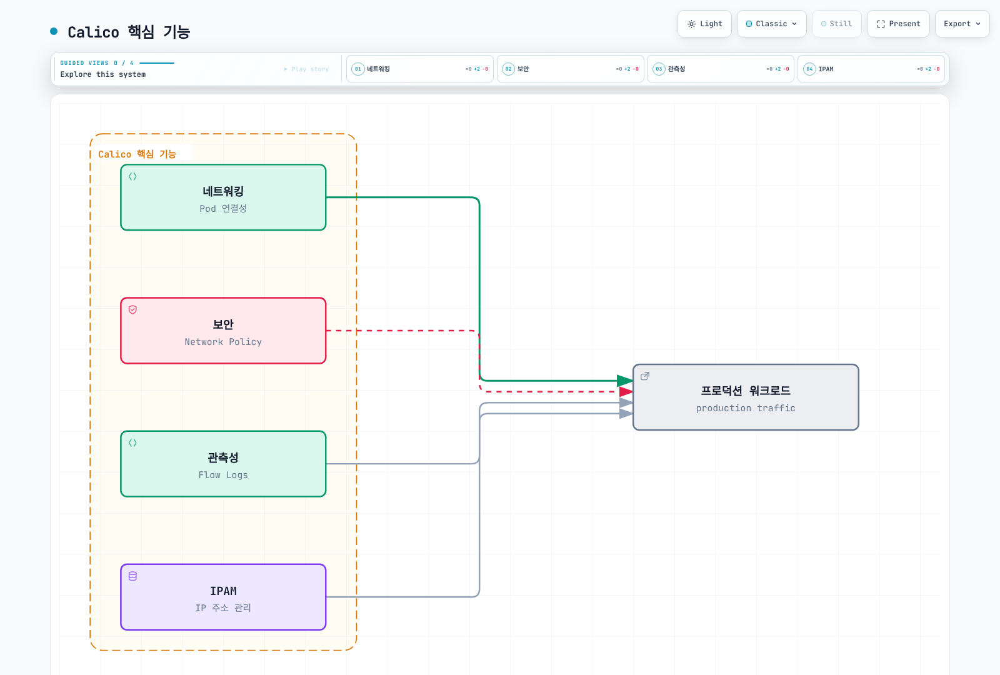
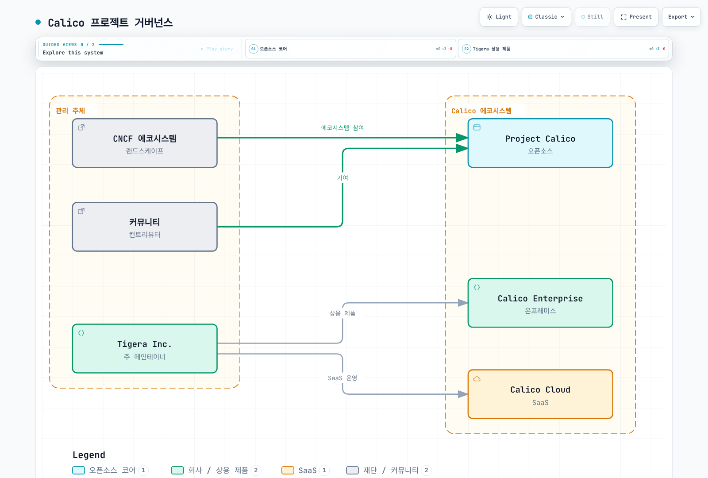
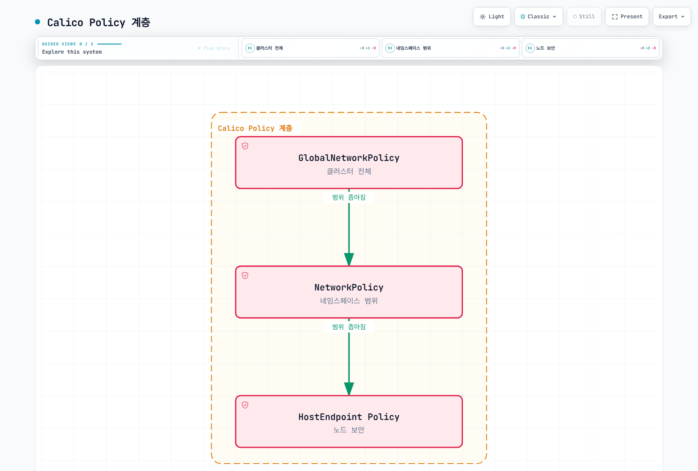
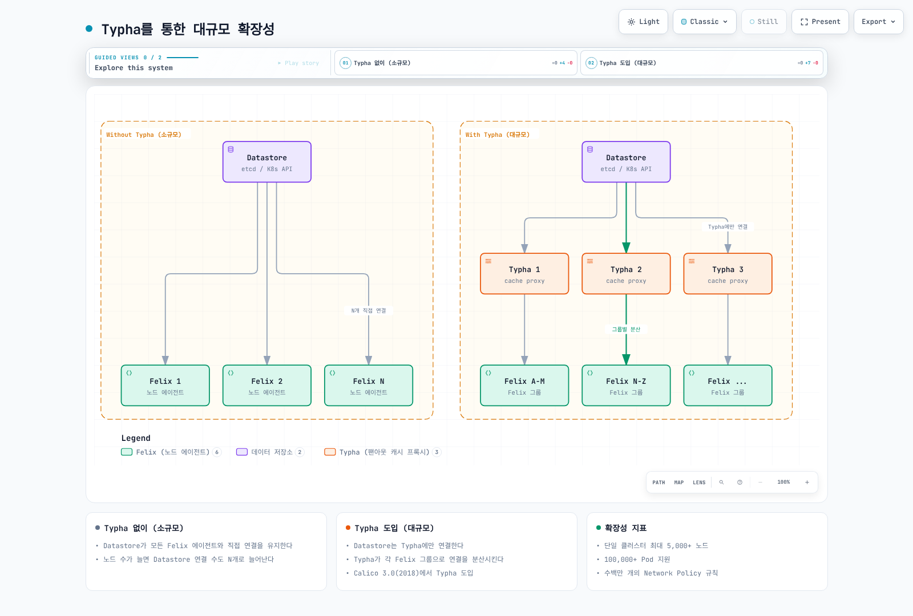
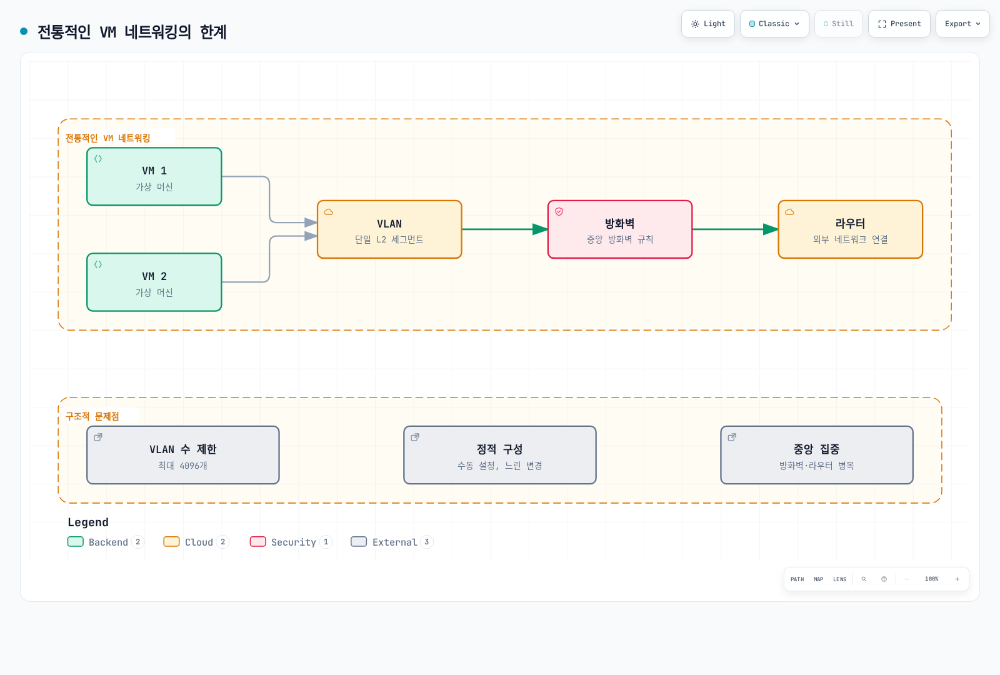
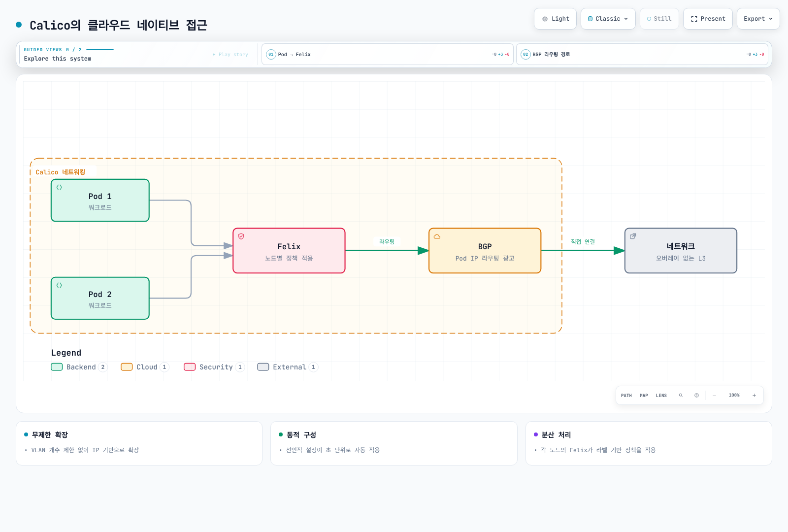

# Part 1: Calico 소개 및 기본 개념

> **지원 버전**: Calico v3.29+ / Kubernetes 1.28+
> **마지막 업데이트**: 2026년 2월 22일

## 실습 환경 설정

이 문서의 예제를 따라하기 위해서는 다음과 같은 도구와 환경이 필요합니다.

### 필수 도구

| 도구 | 버전 | 용도 |
|------|------|------|
| kubectl | v1.28+ | Kubernetes 클러스터 관리 |
| calicoctl | v3.29+ | Calico 리소스 관리 |
| helm | v3.12+ | Calico 설치 (선택) |
| kind/minikube | 최신 | 로컬 테스트 클러스터 |

### kubectl 설치 확인

```bash
# kubectl 버전 확인
kubectl version --client

# 클러스터 연결 확인
kubectl cluster-info
```

### calicoctl 설치

```bash
# Linux (amd64)
curl -L https://github.com/projectcalico/calico/releases/download/v3.29.0/calicoctl-linux-amd64 -o calicoctl
chmod +x calicoctl
sudo mv calicoctl /usr/local/bin/

# Linux (arm64)
curl -L https://github.com/projectcalico/calico/releases/download/v3.29.0/calicoctl-linux-arm64 -o calicoctl
chmod +x calicoctl
sudo mv calicoctl /usr/local/bin/

# macOS (Intel)
curl -L https://github.com/projectcalico/calico/releases/download/v3.29.0/calicoctl-darwin-amd64 -o calicoctl
chmod +x calicoctl
sudo mv calicoctl /usr/local/bin/

# macOS (Apple Silicon)
curl -L https://github.com/projectcalico/calico/releases/download/v3.29.0/calicoctl-darwin-arm64 -o calicoctl
chmod +x calicoctl
sudo mv calicoctl /usr/local/bin/
```

### calicoctl 구성

```bash
# Kubernetes API를 데이터스토어로 사용 (권장)
export DATASTORE_TYPE=kubernetes
export KUBECONFIG=~/.kube/config

# 또는 설정 파일 생성
mkdir -p ~/.calico
cat > ~/.calico/calicoctl.cfg <<EOF
apiVersion: projectcalico.org/v3
kind: CalicoAPIConfig
metadata:
spec:
  datastoreType: "kubernetes"
  kubeconfig: "$HOME/.kube/config"
EOF

# 연결 테스트
calicoctl get nodes
```

### 테스트 클러스터 설정 (kind)

```bash
# kind 클러스터 생성 (Calico용 설정)
cat > kind-calico-config.yaml <<EOF
kind: Cluster
apiVersion: kind.x-k8s.io/v1alpha4
networking:
  # 기본 CNI 비활성화
  disableDefaultCNI: true
  # Pod 서브넷
  podSubnet: "10.244.0.0/16"
nodes:
  - role: control-plane
  - role: worker
  - role: worker
EOF

kind create cluster --name calico-test --config kind-calico-config.yaml

# Calico 설치
kubectl create -f https://raw.githubusercontent.com/projectcalico/calico/v3.29.0/manifests/tigera-operator.yaml

# Installation 리소스 적용
kubectl create -f - <<EOF
apiVersion: operator.tigera.io/v1
kind: Installation
metadata:
  name: default
spec:
  calicoNetwork:
    ipPools:
      - cidr: 10.244.0.0/16
        encapsulation: VXLANCrossSubnet
        natOutgoing: Enabled
        nodeSelector: all()
EOF

# 설치 완료 대기
kubectl wait --for=condition=Available --timeout=300s deployment/calico-kube-controllers -n calico-system
```

## Calico란 무엇인가?

Calico는 컨테이너, 가상 머신, 네이티브 호스트 기반 워크로드를 위한 오픈소스 네트워킹 및 네트워크 보안 솔루션입니다. Kubernetes, OpenShift, Docker EE, OpenStack 등 다양한 플랫폼을 지원합니다.

### 핵심 정의

> **Calico**는 클라우드 네이티브 애플리케이션을 위한 **확장 가능한 네트워킹**과 **네트워크 보안** 솔루션으로, 표준 Linux 네트워킹 도구를 활용하여 고성능의 유연한 네트워크 패브릭을 제공합니다.



[🔍 인터랙티브 다이어그램 보기](https://www.atomai.click/kubernetes-docs/archmaps/ko-networking-calico-01-introduction-0.html)

## Project Calico의 역사

### 타임라인

| 연도 | 이벤트 | 상세 |
|------|--------|------|
| **2014** | Project Calico 시작 | Metaswitch Networks에서 오픈소스 프로젝트로 시작 |
| **2016** | Tigera 설립 | Calico 상업화를 위한 회사 설립 |
| **2017** | Calico 2.0 | Kubernetes 네이티브 지원, CNI 표준 준수 |
| **2018** | Calico 3.0 | Typha 도입으로 대규모 클러스터 지원 |
| **2019** | Calico Enterprise | 엔터프라이즈 기능 (L7 정책, 암호화 등) 출시 |
| **2020** | eBPF 데이터플레인 | eBPF 기반 데이터플레인 베타 도입 |
| **2021** | Calico Cloud | SaaS 형태의 Calico 서비스 출시 |
| **2023** | eBPF GA | eBPF 데이터플레인 정식 출시 |
| **2024** | Calico 3.28 | Windows eBPF 지원, 향상된 관측성 |
| **2025** | Calico 3.29 | Kubernetes 1.32 지원, ARM64 최적화 |

### 프로젝트 거버넌스



[🔍 인터랙티브 다이어그램 보기](https://www.atomai.click/kubernetes-docs/archmaps/ko-networking-calico-01-introduction-1.html)

## 5가지 핵심 기능 상세

### 1. 고성능 네트워킹

Calico는 순수 Layer 3 접근 방식을 사용하여 네트워크 오버헤드를 최소화합니다.

**특징:**
- BGP 기반 라우팅으로 오버레이 없는 네트워킹 가능
- 필요시 IPIP/VXLAN 캡슐화 지원
- eBPF 데이터플레인으로 kube-proxy 대체 가능

```yaml
# 고성능 Direct Routing 설정
apiVersion: projectcalico.org/v3
kind: IPPool
metadata:
  name: high-performance-pool
spec:
  cidr: 10.244.0.0/16
  ipipMode: Never
  vxlanMode: Never
  natOutgoing: true
  nodeSelector: all()
```

### 2. 강력한 Network Policy

Kubernetes 표준 NetworkPolicy를 완전히 지원하며, Calico 확장 정책으로 더 강력한 보안을 제공합니다.

**정책 계층:**



[🔍 인터랙티브 다이어그램 보기](https://www.atomai.click/kubernetes-docs/archmaps/ko-networking-calico-01-introduction-2.html)

**지원 기능:**
- Ingress/Egress 규칙
- CIDR, 포트, 프로토콜 기반 필터링
- Label selector 기반 타겟팅
- FQDN 기반 egress 제어 (Enterprise)
- HTTP 메서드/경로 기반 L7 정책 (Enterprise)

### 3. 유연한 네트워킹 모드

다양한 환경에 맞는 네트워킹 모드를 제공합니다.

| 모드 | 캡슐화 | 장점 | 적합 환경 |
|------|--------|------|-----------|
| **Direct/BGP** | 없음 | 최고 성능, 투명성 | BGP 지원 네트워크 |
| **IPIP** | IP-in-IP | 효율적, AWS/GCP 호환 | 클라우드 환경 |
| **VXLAN** | UDP/VXLAN | 광범위 호환성 | Azure, 방화벽 환경 |
| **CrossSubnet** | 조건부 | 최적 성능 + 호환성 | 하이브리드 환경 |

### 4. 대규모 확장성

Typha 컴포넌트를 통해 수천 노드 클러스터를 지원합니다.

**확장성 지표:**
- 단일 클러스터 최대 5,000+ 노드
- 100,000+ Pod 지원
- 수백만 개의 Network Policy 규칙



[🔍 인터랙티브 다이어그램 보기](https://www.atomai.click/kubernetes-docs/archmaps/ko-networking-calico-01-introduction-3.html)

### 5. 멀티 환경 지원

온프레미스, 클라우드, 하이브리드 환경을 모두 지원합니다.

**지원 플랫폼:**
- **퍼블릭 클라우드**: AWS EKS, Azure AKS, GCP GKE
- **온프레미스**: OpenShift, Rancher, VMware Tanzu
- **로컬 개발**: kind, minikube, k3s
- **OS**: Linux (RHEL, Ubuntu, Amazon Linux), Windows Server

## Calico vs 전통적인 네트워킹

### 전통적인 VM 네트워킹의 한계



[🔍 인터랙티브 다이어그램 보기](https://www.atomai.click/kubernetes-docs/archmaps/ko-networking-calico-01-introduction-4.html)

### Calico의 클라우드 네이티브 접근



[🔍 인터랙티브 다이어그램 보기](https://www.atomai.click/kubernetes-docs/archmaps/ko-networking-calico-01-introduction-5.html)

### 주요 차이점

| 특성 | 전통적인 네트워킹 | Calico |
|------|------------------|--------|
| **구성** | 정적, 수동 | 동적, 선언적 |
| **확장성** | VLAN 제한 | IP 기반 무제한 |
| **정책** | 방화벽 규칙 | 라벨 기반 정책 |
| **변경 속도** | 분~시간 | 초 단위 |
| **자동화** | 제한적 | Kubernetes 네이티브 |

## 사용 사례 시나리오

### 시나리오 1: 온프레미스 데이터센터

**요구사항:**
- 기존 BGP 인프라와 통합
- 물리 서버와 Kubernetes Pod 간 직접 통신
- 엄격한 보안 정책 적용

```yaml
# BGP 피어링 설정
apiVersion: projectcalico.org/v3
kind: BGPPeer
metadata:
  name: datacenter-tor
spec:
  peerIP: 192.168.1.1
  asNumber: 64513
  nodeSelector: "rack == 'rack1'"
---
# BGP 구성
apiVersion: projectcalico.org/v3
kind: BGPConfiguration
metadata:
  name: default
spec:
  asNumber: 64512
  nodeToNodeMeshEnabled: false
  serviceClusterIPs:
    - cidr: 10.96.0.0/12
```

### 시나리오 2: 퍼블릭 클라우드 (AWS EKS)

**요구사항:**
- VPC CNI 네트워킹 활용
- Calico Network Policy로 보안 강화
- 멀티 AZ 배포

```bash
# VPC CNI + Calico 조합 설치
helm install calico projectcalico/tigera-operator \
  --namespace tigera-operator \
  --create-namespace \
  --set installation.kubernetesProvider=EKS \
  --set installation.cni.type=AmazonVPC
```

### 시나리오 3: 하이브리드 환경

**요구사항:**
- 온프레미스와 클라우드 워크로드 연결
- 일관된 Network Policy 적용
- 통합 관측성

```yaml
# CrossSubnet 모드로 하이브리드 최적화
apiVersion: projectcalico.org/v3
kind: IPPool
metadata:
  name: hybrid-pool
spec:
  cidr: 10.244.0.0/16
  ipipMode: CrossSubnet
  vxlanMode: Never
  natOutgoing: true
```

## 커뮤니티 및 지원

### 커뮤니티 리소스

- **GitHub**: [github.com/projectcalico/calico](https://github.com/projectcalico/calico)
- **Slack**: [calicousers.slack.com](https://calicousers.slack.com)
- **Forum**: [discuss.projectcalico.org](https://discuss.projectcalico.org)
- **Twitter/X**: [@projectcalico](https://twitter.com/projectcalico)

### 기여 가이드

```bash
# 소스 코드 클론
git clone https://github.com/projectcalico/calico.git
cd calico

# 개발 환경 설정
make dev-environment

# 테스트 실행
make test
```

### 엔터프라이즈 지원

| 제품 | 특징 | 대상 |
|------|------|------|
| **Calico Open Source** | 무료, 커뮤니티 지원 | 개발/테스트, 소규모 프로덕션 |
| **Calico Enterprise** | 상용 지원, L7 정책, 암호화 | 대규모 엔터프라이즈 |
| **Calico Cloud** | SaaS, 관리형 서비스 | 빠른 도입이 필요한 조직 |

---

## 요약

이 장에서 학습한 내용:

1. **Calico의 정의**: 클라우드 네이티브 네트워킹 및 보안 솔루션
2. **역사와 발전**: 2014년 시작, CNCF 에코시스템(랜드스케이프)에 속한 오픈소스 프로젝트
3. **5가지 핵심 기능**: 고성능 네트워킹, Network Policy, 유연한 모드, 확장성, 멀티 환경
4. **사용 사례**: 온프레미스, 클라우드, 하이브리드 환경
5. **커뮤니티**: 활발한 오픈소스 커뮤니티와 엔터프라이즈 지원

다음 장에서는 [Calico 아키텍처](02-architecture.md)를 심층적으로 분석합니다.

---

[메인 페이지로 돌아가기](README.md) | [다음: 아키텍처 심층 분석 →](02-architecture.md)

## 퀴즈

이 장에서 배운 내용을 테스트하려면 [Part 1 퀴즈](../../quizzes/networking/calico/01-introduction-quiz.md)를 풀어보세요.
