# Part 2: 아키텍처

> **지원 버전**: Calico v3.29+ / Kubernetes 1.28+ **마지막 업데이트**: 2026년 2월 23일

## 개요

Calico의 아키텍처는 확장성, 성능, 유연성을 중심으로 설계되었습니다. 이 장에서는 각 컴포넌트의 역할, 내부 동작 방식, 그리고 컴포넌트 간 상호작용을 심층적으로 분석합니다.

## 전체 아키텍처 다이어그램


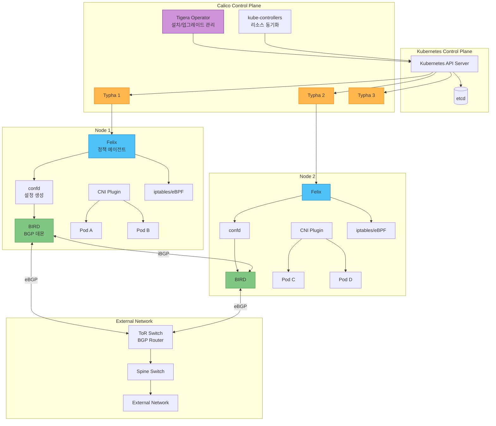

## Felix 심층 분석

Felix는 Calico의 핵심 데이터플레인 에이전트로, 각 노드에서 DaemonSet으로 실행됩니다.

### Felix의 주요 책임

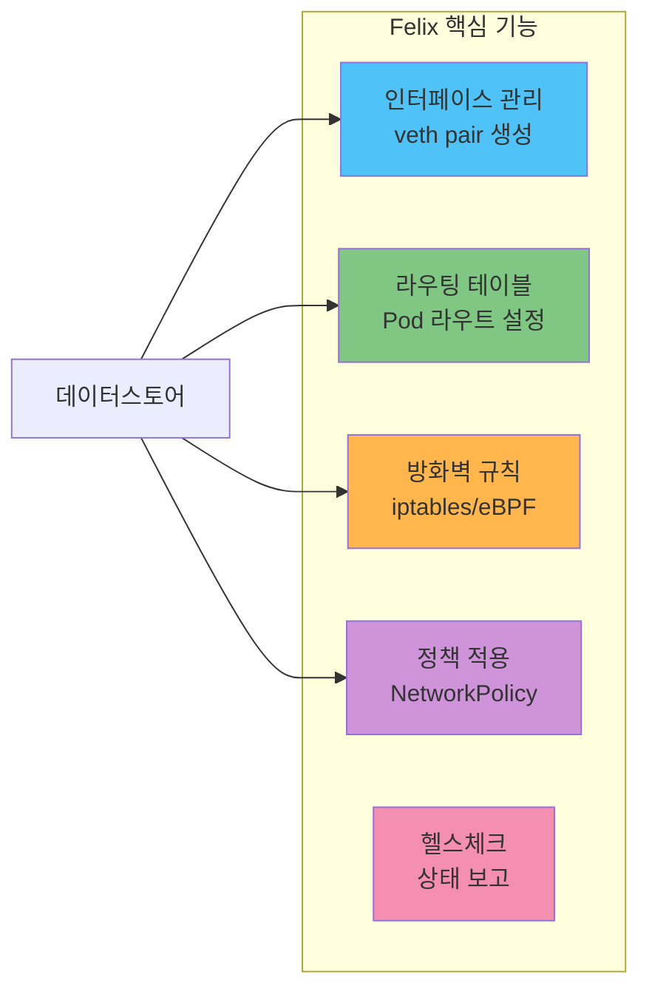

### Felix 내부 워크플로우

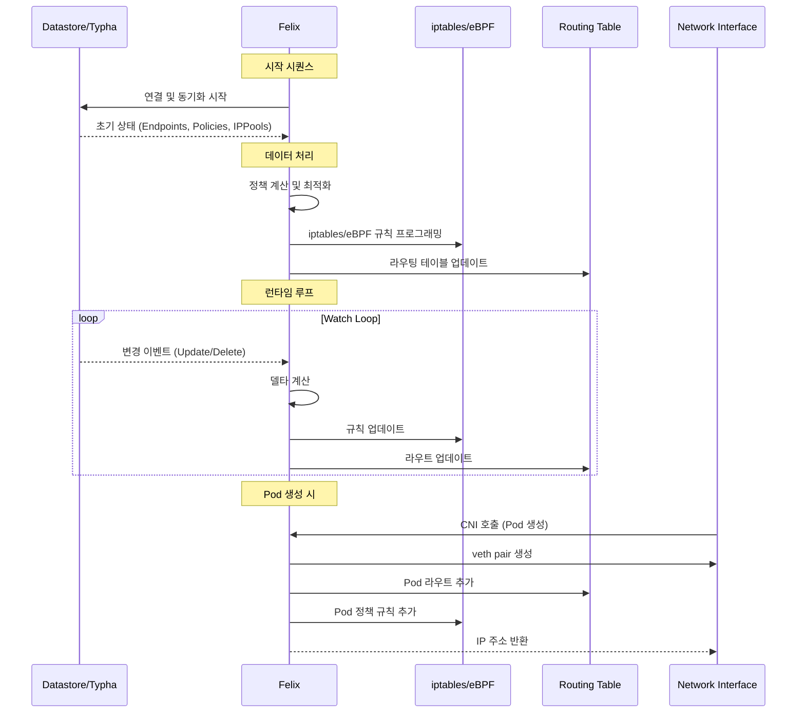

### Felix 설정 상세

```yaml
apiVersion: projectcalico.org/v3
kind: FelixConfiguration
metadata:
  name: default
spec:
  # ========== 데이터플레인 설정 ==========
  # eBPF 모드 활성화 (false = iptables 모드)
  bpfEnabled: false

  # eBPF 설정 (bpfEnabled: true 시)
  bpfDataIfacePattern: "^(en.*|eth.*|ens.*)"
  bpfExternalServiceMode: "DSR"  # DSR 또는 Tunnel
  bpfKubeProxyIptablesCleanupEnabled: true
  bpfLogLevel: "Info"

  # ========== 로깅 설정 ==========
  logSeverityScreen: Info        # 화면 출력 레벨
  logSeverityFile: Warning       # 파일 출력 레벨
  logFilePath: /var/log/calico/felix.log
  logDebugFilenameRegex: ""

  # ========== IP 자동 감지 ==========
  # 노드 IP 자동 감지 방법
  ipAutoDetectionMethod: "kubernetes-internal-ip"
  # 대안: "first-found", "can-reach=8.8.8.8", "interface=eth.*"

  # IPv6 감지 (옵션)
  ipv6AutoDetectionMethod: "kubernetes-internal-ip"

  # ========== Flow Logs (관측성) ==========
  flowLogsFlushInterval: "15s"
  flowLogsFileEnabled: true
  flowLogsFileDirectory: "/var/log/calico/flowlogs"
  flowLogsFileMaxFiles: 5
  flowLogsFileMaxFileSizeMb: 100
  flowLogsEnableHostEndpoint: false

  # ========== 헬스체크 ==========
  healthEnabled: true
  healthPort: 9099
  healthHost: "0.0.0.0"

  # ========== Prometheus 메트릭 ==========
  prometheusMetricsEnabled: true
  prometheusMetricsPort: 9091
  prometheusGoMetricsEnabled: true
  prometheusProcessMetricsEnabled: true

  # ========== 성능 튜닝 ==========
  # iptables 규칙 새로고침 간격
  iptablesRefreshInterval: "90s"
  # 라우팅 테이블 새로고침 간격
  routeRefreshInterval: "90s"
  # 인터페이스 새로고침 간격
  interfaceRefreshInterval: "90s"

  # iptables 잠금 타임아웃
  iptablesLockTimeoutSecs: 0
  iptablesLockFilePath: "/run/xtables.lock"
  iptablesLockProbeIntervalMillis: 50

  # ========== 기타 설정 ==========
  # IPIP 캡슐화 활성화
  ipipEnabled: true
  # VXLAN 캡슐화 활성화
  vxlanEnabled: true
  # VXLAN 포트 (기본: 4789)
  vxlanPort: 4789
  vxlanVNI: 4096

  # Wireguard 암호화
  wireguardEnabled: false
  wireguardInterfaceName: "wireguard.cali"

  # 기본 엔드포인트-호스트 정책
  defaultEndpointToHostAction: "Drop"  # Drop, Accept, Return

  # 외부 노드로의 기본 동작
  iptablesFilterAllowAction: "Accept"
  iptablesMangleAllowAction: "Accept"

  # 실패 시 동작
  failsafeInboundHostPorts:
    - protocol: tcp
      port: 22      # SSH
    - protocol: udp
      port: 68      # DHCP client
  failsafeOutboundHostPorts:
    - protocol: tcp
      port: 443     # HTTPS
    - protocol: udp
      port: 53      # DNS
    - protocol: udp
      port: 67      # DHCP server
```

### Felix iptables 규칙 구조

Felix가 생성하는 iptables 규칙 체인 구조:

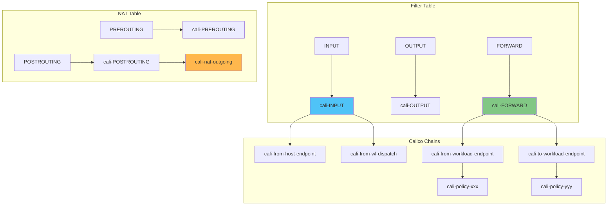

## BIRD 심층 분석

BIRD (BIRD Internet Routing Daemon)는 BGP 라우팅을 담당하는 컴포넌트입니다.

### BIRD의 역할

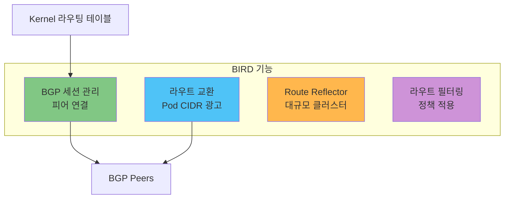

### BGP 클러스터 토폴로지

#### Full Mesh (소규모 클러스터)

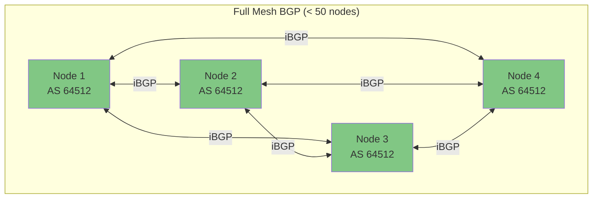

#### Route Reflector (대규모 클러스터)

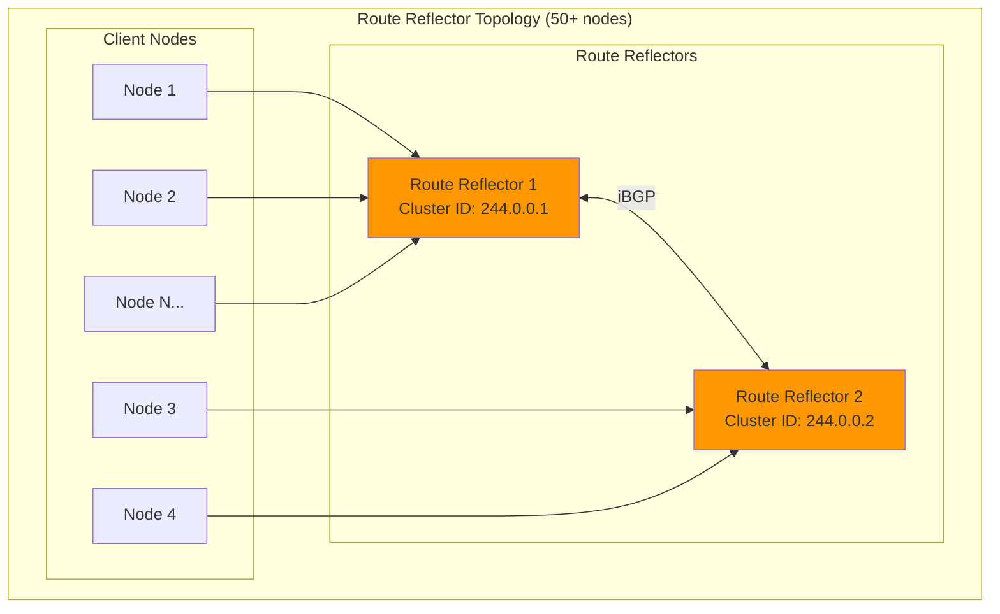

### 외부 네트워크 연동

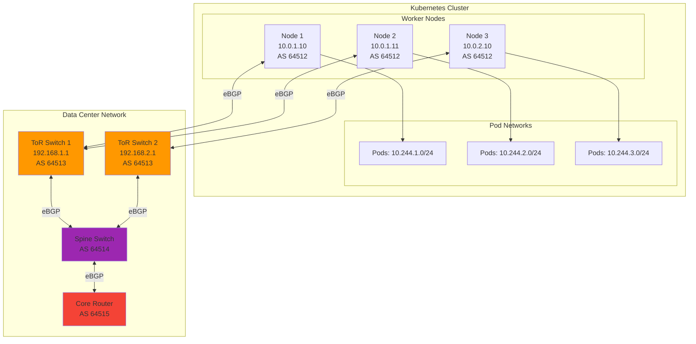

## confd 심층 분석

confd는 BIRD 설정 파일을 동적으로 생성하는 템플릿 엔진입니다.

### confd 동작 방식

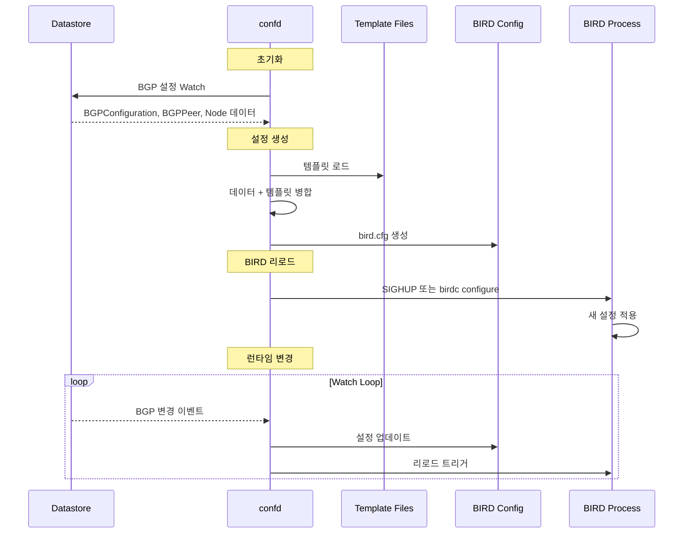

### 생성되는 BIRD 설정 예시

```
# /etc/calico/confd/config/bird.cfg (자동 생성)

router id 10.0.1.10;

# 로깅 설정
log syslog all;
log "/var/log/calico/bird/current" { debug, trace, info, remote, warning, error, auth, fatal, bug };

# 디바이스 프로토콜
protocol device {
    scan time 2;
}

# 직접 연결 프로토콜
protocol direct {
    interface -"cali*", -"tunl*", "*";
}

# 커널 라우팅 테이블
protocol kernel {
    learn;
    persist;
    scan time 2;
    import all;
    export filter {
        if proto = "direct" then reject;
        accept;
    };
    graceful restart;
}

# BGP 템플릿
template bgp bgp_template {
    debug { states };
    description "Calico BGP";
    local as 64512;
    multihop;
    gateway recursive;
    import all;
    export filter {
        if net = 10.244.1.0/24 then accept;
        reject;
    };
    graceful restart;
}

# Node-to-Node Mesh BGP 세션
protocol bgp Node_10_0_1_11 from bgp_template {
    neighbor 10.0.1.11 as 64512;
}

# 외부 BGP 피어
protocol bgp Global_Peer_192_168_1_1 from bgp_template {
    neighbor 192.168.1.1 as 64513;
}
```

## Typha 심층 분석

Typha는 대규모 클러스터(50+ 노드)에서 필수적인 팬아웃 프록시입니다.

### Typha의 필요성

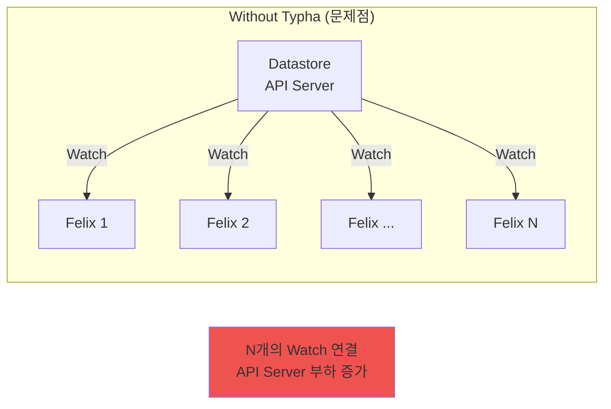

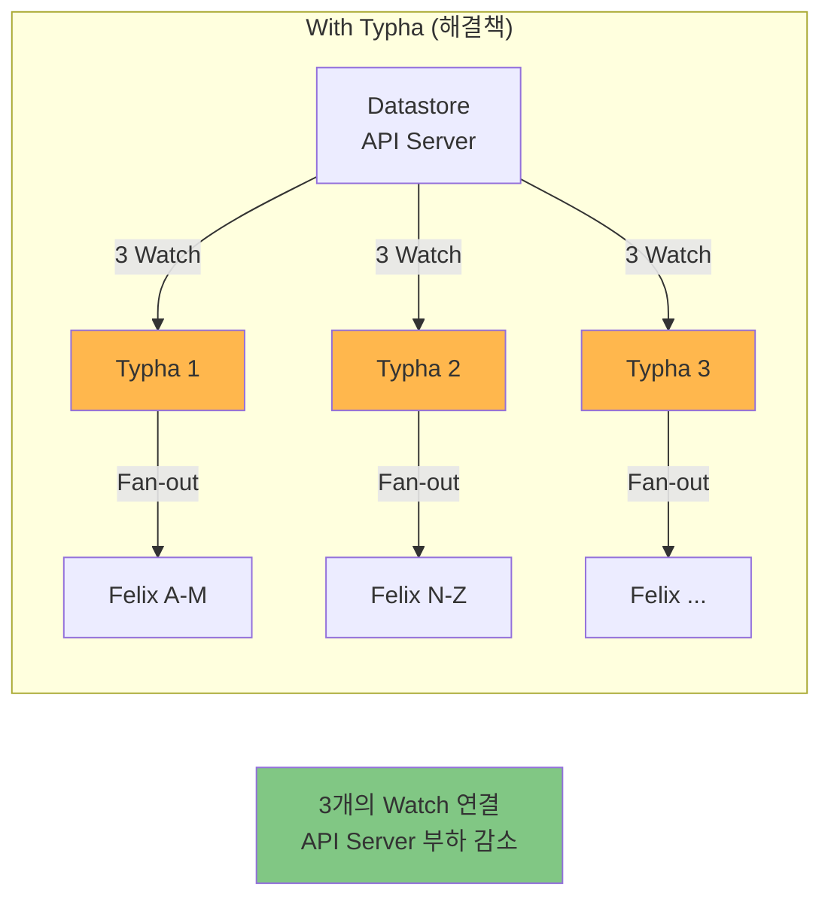

### Typha 스케일링 계산

| 노드 수    | 권장 Typha 복제본 | 계산 공식            |
| ------- | ------------ | ---------------- |
| 1-49    | 0 (불필요)      | -                |
| 50-199  | 3            | 최소 3             |
| 200-499 | 3-5          | nodes / 100      |
| 500-999 | 5-10         | nodes / 100      |
| 1000+   | 10+          | nodes / 200 (최대) |

**권장 공식**: `max(3, ceil(nodes / 200))`

### Typha 배포 설정

```yaml
apiVersion: apps/v1
kind: Deployment
metadata:
  name: calico-typha
  namespace: calico-system
  labels:
    k8s-app: calico-typha
spec:
  replicas: 3  # 노드 수에 따라 조정
  revisionHistoryLimit: 2
  selector:
    matchLabels:
      k8s-app: calico-typha
  strategy:
    type: RollingUpdate
    rollingUpdate:
      maxUnavailable: 1
      maxSurge: 1
  template:
    metadata:
      labels:
        k8s-app: calico-typha
      annotations:
        cluster-autoscaler.kubernetes.io/safe-to-evict: "true"
    spec:
      # 고가용성을 위한 Pod Anti-Affinity
      affinity:
        podAntiAffinity:
          requiredDuringSchedulingIgnoredDuringExecution:
            - labelSelector:
                matchLabels:
                  k8s-app: calico-typha
              topologyKey: kubernetes.io/hostname

      # Critical 워크로드 톨러레이션
      tolerations:
        - key: CriticalAddonsOnly
          operator: Exists
        - key: node-role.kubernetes.io/master
          effect: NoSchedule
        - key: node-role.kubernetes.io/control-plane
          effect: NoSchedule

      # 서비스 계정
      serviceAccountName: calico-typha

      # 호스트 네트워크 사용
      hostNetwork: true

      containers:
        - name: calico-typha
          image: calico/typha:v3.29.0

          ports:
            - containerPort: 5473
              name: calico-typha
              protocol: TCP

          env:
            # 로깅 설정
            - name: TYPHA_LOGSEVERITYSCREEN
              value: "info"
            - name: TYPHA_LOGFILEPATH
              value: "/var/log/calico/typha.log"

            # 데이터스토어 설정
            - name: TYPHA_DATASTORETYPE
              value: "kubernetes"

            # 연결 제한
            - name: TYPHA_MAXCONNECTIONSLOWERLIMIT
              value: "100"
            - name: TYPHA_MAXCONNECTIONSUPPERLIMIT
              value: "200"

            # 연결 재분배
            - name: TYPHA_CONNECTIONREBALANCINGMODE
              value: "kubernetes"

            # Prometheus 메트릭
            - name: TYPHA_PROMETHEUSMETRICSENABLED
              value: "true"
            - name: TYPHA_PROMETHEUSMETRICSPORT
              value: "9093"

            # 헬스체크
            - name: TYPHA_HEALTHENABLED
              value: "true"
            - name: TYPHA_HEALTHPORT
              value: "9098"

          # 리소스 제한
          resources:
            requests:
              cpu: 200m
              memory: 256Mi
            limits:
              cpu: 1000m
              memory: 512Mi

          # Liveness Probe
          livenessProbe:
            httpGet:
              path: /liveness
              port: 9098
              host: localhost
            initialDelaySeconds: 30
            periodSeconds: 30
            timeoutSeconds: 10
            failureThreshold: 3

          # Readiness Probe
          readinessProbe:
            httpGet:
              path: /readiness
              port: 9098
              host: localhost
            initialDelaySeconds: 10
            periodSeconds: 10
            timeoutSeconds: 10
            failureThreshold: 3

          # 볼륨 마운트
          volumeMounts:
            - name: typha-log
              mountPath: /var/log/calico

      volumes:
        - name: typha-log
          hostPath:
            path: /var/log/calico
            type: DirectoryOrCreate
---
apiVersion: v1
kind: Service
metadata:
  name: calico-typha
  namespace: calico-system
  labels:
    k8s-app: calico-typha
spec:
  ports:
    - port: 5473
      protocol: TCP
      targetPort: calico-typha
      name: calico-typha
  selector:
    k8s-app: calico-typha
  clusterIP: None  # Headless service for DNS discovery
```

## kube-controllers 심층 분석

kube-controllers는 Kubernetes와 Calico 데이터스토어 간의 동기화를 담당합니다.

### 포함된 컨트롤러

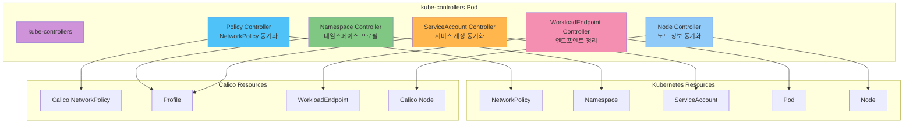

### 컨트롤러별 역할

| 컨트롤러                 | 역할                                   | Watch 대상              |
| -------------------- | ------------------------------------ | --------------------- |
| **Policy**           | K8s NetworkPolicy → Calico Policy 변환 | NetworkPolicy         |
| **Namespace**        | 네임스페이스 라벨 기반 프로필 관리                  | Namespace             |
| **ServiceAccount**   | SA 라벨을 프로필에 반영                       | ServiceAccount        |
| **WorkloadEndpoint** | 삭제된 Pod의 엔드포인트 정리                    | Pod, WorkloadEndpoint |
| **Node**             | 노드 정보 동기화, 제거된 노드 정리                 | Node                  |

### kube-controllers 설정

```yaml
apiVersion: apps/v1
kind: Deployment
metadata:
  name: calico-kube-controllers
  namespace: calico-system
spec:
  replicas: 1  # 단일 인스턴스 (Leader Election 사용)
  selector:
    matchLabels:
      k8s-app: calico-kube-controllers
  template:
    metadata:
      labels:
        k8s-app: calico-kube-controllers
    spec:
      serviceAccountName: calico-kube-controllers
      tolerations:
        - key: CriticalAddonsOnly
          operator: Exists
        - key: node-role.kubernetes.io/master
          effect: NoSchedule
        - key: node-role.kubernetes.io/control-plane
          effect: NoSchedule
      containers:
        - name: calico-kube-controllers
          image: calico/kube-controllers:v3.29.0
          env:
            # 활성화할 컨트롤러
            - name: ENABLED_CONTROLLERS
              value: "policy,namespace,serviceaccount,workloadendpoint,node"

            # 데이터스토어 타입
            - name: DATASTORE_TYPE
              value: "kubernetes"

            # 로깅
            - name: LOG_LEVEL
              value: "info"

          resources:
            requests:
              cpu: 100m
              memory: 128Mi
            limits:
              cpu: 500m
              memory: 256Mi

          livenessProbe:
            exec:
              command:
                - /usr/bin/check-status
                - -l
            initialDelaySeconds: 10
            periodSeconds: 10

          readinessProbe:
            exec:
              command:
                - /usr/bin/check-status
                - -r
            initialDelaySeconds: 10
            periodSeconds: 10
```

## 데이터스토어 옵션

Calico는 두 가지 데이터스토어 백엔드를 지원합니다.

### etcd vs Kubernetes API 비교

| 특성          | Kubernetes API (권장) | etcd 직접 연결        |
| ----------- | ------------------- | ----------------- |
| **설정 복잡도**  | 낮음 (기본 연동)          | 높음 (별도 etcd 클러스터) |
| **운영 오버헤드** | 낮음                  | 높음 (etcd 관리 필요)   |
| **확장성**     | 좋음 (Typha와 함께)      | 매우 좋음             |
| **일관성**     | K8s와 자연스러운 통합       | 독립적 관리            |
| **백업/복원**   | K8s 백업에 포함          | 별도 백업 필요          |
| **권장 환경**   | 대부분의 환경             | 초대규모 (5000+ 노드)   |

### Kubernetes API 데이터스토어 (권장)

```yaml
# calicoctl 설정
apiVersion: projectcalico.org/v3
kind: CalicoAPIConfig
metadata:
spec:
  datastoreType: "kubernetes"
  kubeconfig: "/path/to/.kube/config"
```

### etcd 데이터스토어

```yaml
# calicoctl 설정
apiVersion: projectcalico.org/v3
kind: CalicoAPIConfig
metadata:
spec:
  datastoreType: "etcdv3"
  etcdEndpoints: "https://etcd1:2379,https://etcd2:2379,https://etcd3:2379"
  etcdKeyFile: "/path/to/etcd-key.pem"
  etcdCertFile: "/path/to/etcd-cert.pem"
  etcdCACertFile: "/path/to/etcd-ca.pem"
```

## 컴포넌트 상호작용 시퀀스

### Pod 생성 시 전체 흐름

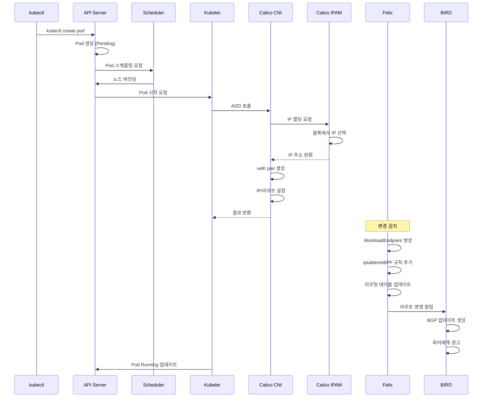

### 패킷 흐름 (Pod-to-Pod, 다른 노드)

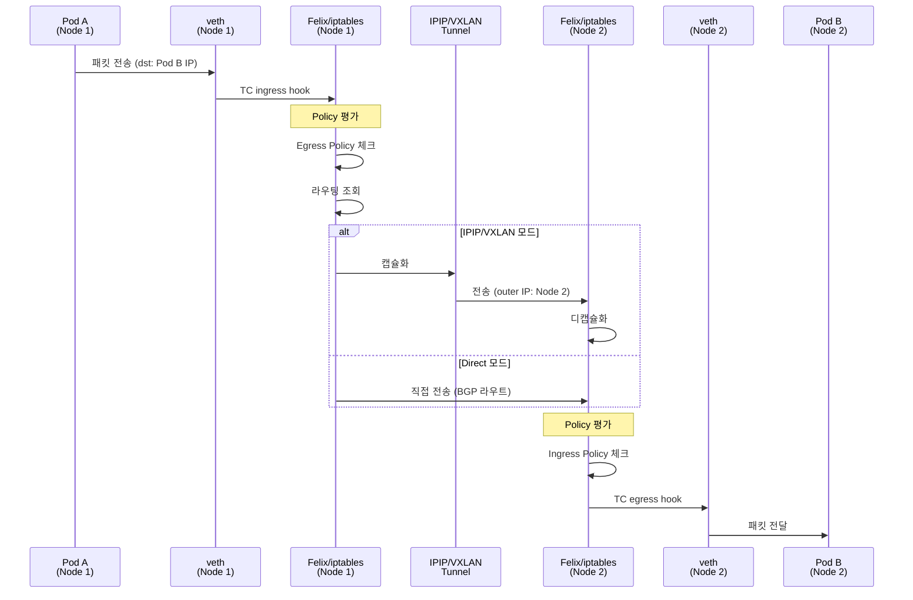

***

## 요약

이 장에서 학습한 내용:

1. **Felix**: 각 노드의 핵심 에이전트, iptables/eBPF 규칙 및 라우팅 관리
2. **BIRD**: BGP 라우팅 데몬, 노드 간 및 외부 네트워크 라우트 교환
3. **confd**: BIRD 설정 동적 생성, 데이터스토어 변경 감지
4. **Typha**: 대규모 클러스터를 위한 팬아웃 프록시, API 서버 부하 감소
5. **kube-controllers**: Kubernetes ↔ Calico 리소스 동기화
6. **데이터스토어**: Kubernetes API (권장) 또는 etcd 선택

다음 장에서는 [네트워킹 모드](03-networking-modes.md)를 심층적으로 분석합니다.

***

[← 이전: 소개 및 기본 개념](01-introduction.md) | [메인 페이지](./README.md) | [다음: 네트워킹 모드 →](03-networking-modes.md)

## 퀴즈

이 장에서 배운 내용을 테스트하려면 [Part 2 퀴즈](../../quizzes/networking/calico/02-architecture-quiz.md)를 풀어보세요.
