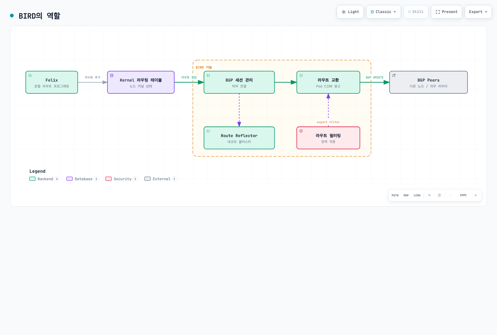
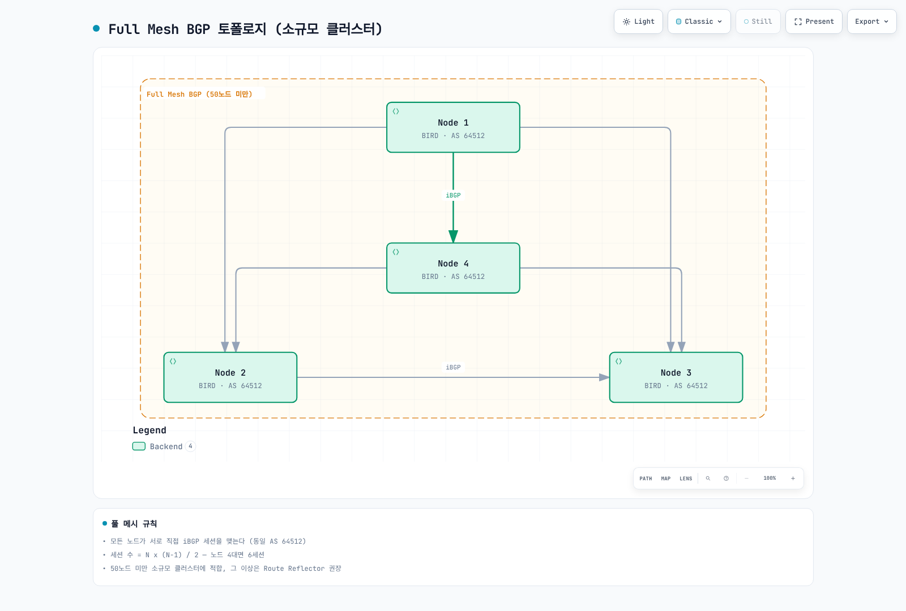
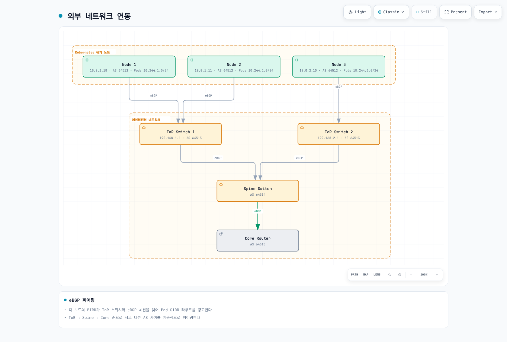
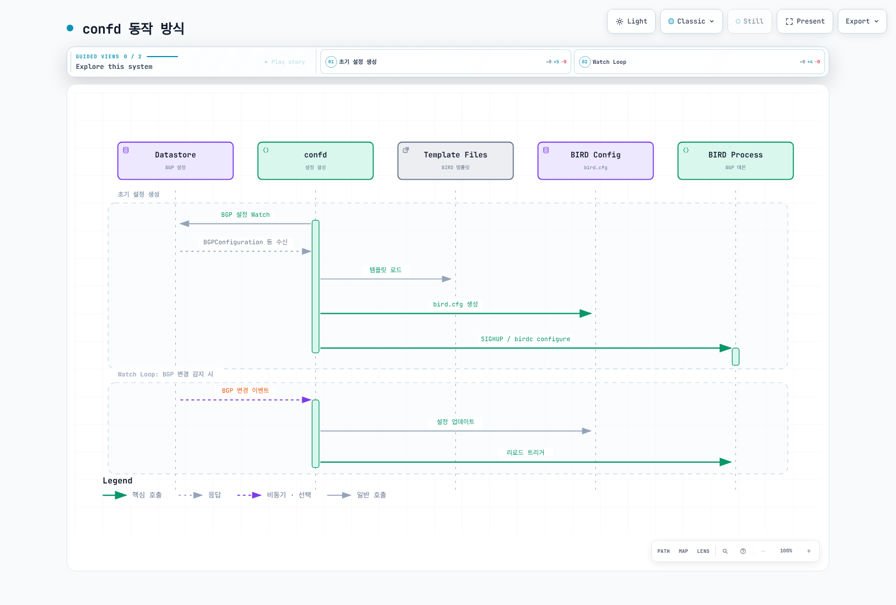
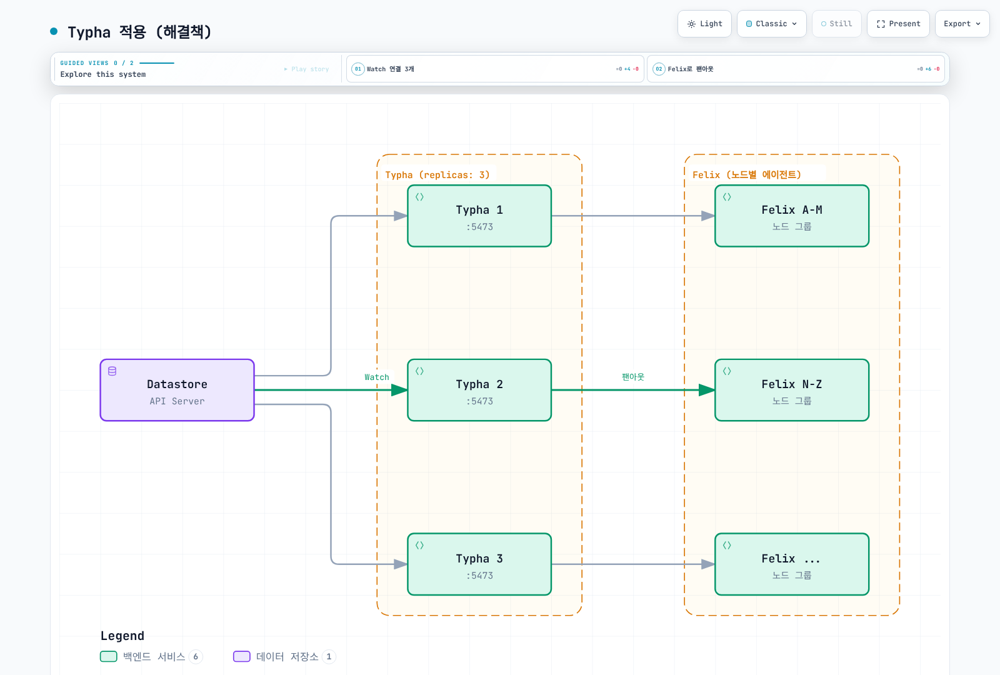
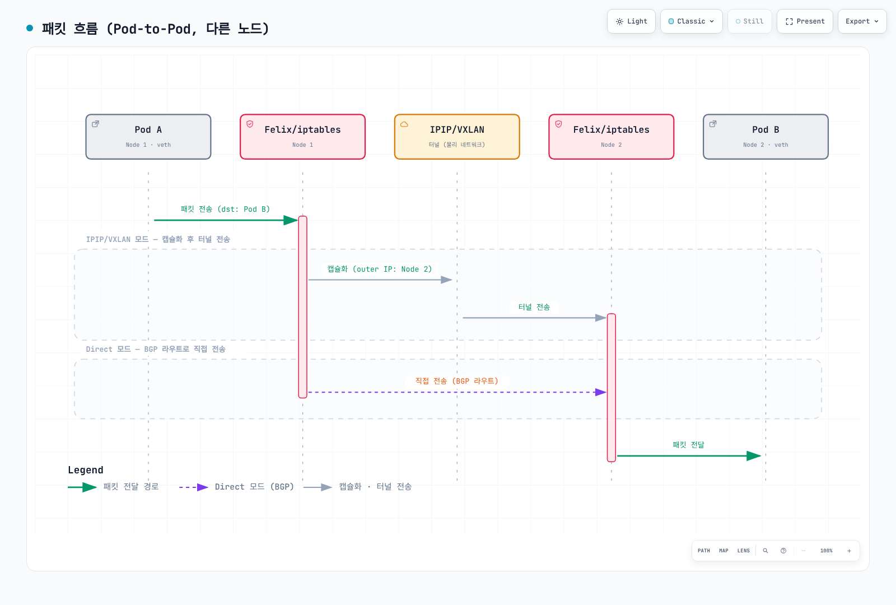

# Part 2: 아키텍처

> **검토 기준**: Calico Open Source 3.32.2 / operator 1.42.6, Calico 3.32의 Kubernetes 시험 대상은 1.34–1.36입니다.
> **검토일**: 2026년 9월 12일. 예제는 설정 참고이며 실제 클러스터 검증 결과가 아닙니다.

## 개요

Calico의 아키텍처는 확장성, 성능, 유연성을 중심으로 설계되었습니다. 이 장에서는 각 컴포넌트의 역할, 내부 동작 방식, 그리고 컴포넌트 간 상호작용을 심층적으로 분석합니다.

## 전체 아키텍처 다이어그램


[🔍 인터랙티브 다이어그램 보기](https://www.atomai.click/kubernetes-docs/archmaps/ko-networking-calico-02-architecture-0.html)

제어 상태의 단순화된 그림입니다. BIRD 쪽 화살표에는 설정을 렌더링하는 confd가 생략되어 있으며 Typha가 BIRD의 직접 설정 API는 아닙니다. BIRD/confd·Typha의 사용은 설치 모드에 따라 다르고 모든 컨트롤 플레인 컴포넌트가 표시된 것은 아닙니다.

## Felix 심층 분석

Felix는 선택된 워크로드 노드의 Calico 노드 에이전트 안에서 해당 라우트·인터페이스 설정·커널 정책을 관리합니다. Linux 전체 네트워킹 경로에서는 컨테이너 런타임이 CNI 체인을 호출하고 CNI/IPAM 플러그인이 인터페이스 생성과 주소 할당을 수행합니다. Felix는 엔드포인트 변경을 비동기로 관찰하며 직접 CNI ADD 호출을 처리하는 주체가 아닙니다. 정확한 컴포넌트는 operator·플랫폼·네트워킹 모드에 따라 다릅니다.

### Felix의 주요 책임

Linux Pod 인터페이스·주소는 CNI/IPAM이 생성합니다. Felix는 엔드포인트 상태와 커널 정책을 조정합니다. HTTP 상태 서버와 데이터스토어 상태 보고는 별개의 기능입니다.

### Felix 내부 워크플로우

Pod 생성 시 런타임이 CNI/IPAM 체인을 호출해 네트워크를 설정하고 엔드포인트 상태를 기록합니다. Felix는 관련 변경을 관찰해 정책·라우트를 반영하며 BGP 모드에는 별도의 confd/BIRD 경로가 있습니다. Pod Running은 라우팅·정책 수렴의 증거가 아닙니다.

### Felix 설정 상세

```yaml
apiVersion: projectcalico.org/v3
kind: FelixConfiguration
metadata:
  name: default
spec:
  logSeverityScreen: Info
  healthEnabled: true
  healthPort: 9099
  prometheusMetricsEnabled: true
  prometheusMetricsPort: 9091
  reportingInterval: 30s
  reportingTTL: 90s
```

Calico 3.32.2가 받아들이는 필드만 사용한 최소 예제입니다. 설정 소유자를 통해 변경해야 하며 데이터플레인 전환이나 성능 튜닝 절차는 아닙니다. Felix 상태 서버의 기본 호스트는 localhost입니다. 메트릭 활성화가 Prometheus scrape 설정이나 공개 노출의 적절성을 보장하지는 않습니다.

| 설정 대상 | 올바른 소유자·해석 |
|---|---|
| Linux 데이터플레인 | 지원되는 구성에서 operator의 `Installation.spec.calicoNetwork.linuxDataplane`으로 `Iptables`·`Nftables`·`BPF` 선택 |
| `bpfEnabled` | Felix의 하위 설정, 이것만 바꾸지 말고 operator 전환·kube-proxy·API 연결성을 함께 조정 |
| `iptablesBackend: NFT` | iptables-nft 도구 백엔드이며 Calico의 native nftables 데이터플레인과 다름 |
| 연결 시점 로드밸런싱 | 현재 필드는 `bpfConnectTimeLoadBalancing: TCP`·`Enabled`·`Disabled`, 기존 boolean `bpfConnectTimeLoadBalancingEnabled`는 여전히 허용되지만 deprecated |
| 노드 주소 감지 | operator의 `calicoNetwork.nodeAddressAutodetectionV4`·`V6` 또는 매니페스트 설치의 노드 시작 환경 변수, Felix의 `ipAutoDetectionMethod`·`ipv6AutoDetectionMethod` 필드가 아님 |
| 플로우 가시성 | 지원되는 Goldmane/Whisker 설정 사용, 기존 예제의 Enterprise 파일 로그 필드는 Open Source에서 허용되지 않음 |
| MTU·터널 모드 | 언더레이·캡슐화·암호화로 산정하고 Installation/IPPool과 조정, 1440/1410/1420을 임의 적용하거나 모든 터널을 켜지 않음 |
| 호스트 failsafe 포트 | 기본 목록을 대체하기 전에 실제 API·BGP·etcd·관리 경로 확인, 기존의 짧은 목록은 필요한 예외를 없앨 수 있음 |
| 기간 필드 | `reportingInterval`·`reportingTTL`·`iptablesPostWriteCheckInterval`·`iptablesLockProbeInterval` 등 현재 이름 사용, 기계적으로 `Secs`·`Millis`를 붙이지 않음 |

공개 스키마에는 기존 `iptablesLockFilePath`, `iptablesLockTimeoutSecs`, `iptablesLockProbeIntervalMillis`와 `flowLogsFileEnabled`, `flowLogsFileDirectory`, `flowLogsFileMaxFiles`, `flowLogsFileMaxFileSizeMb`, `flowLogsEnableHostEndpoint`가 없습니다. [Felix 레퍼런스](https://docs.tigera.io/calico/latest/reference/resources/felixconfig)와 [operator API](https://docs.tigera.io/calico/latest/reference/installation/api)를 확인하세요. 주소·데이터플레인 변경에는 별도의 rollout 검증이 필요합니다.

### Felix iptables 규칙 구조

Felix가 생성하는 iptables 규칙 체인 구조:

아래는 [릴리스 규칙 정의](https://github.com/projectcalico/calico/blob/v3.32.2/felix/rules/rule_defs.go)의 일부 접두사이며 전체 체인 그래프가 아닙니다. iptables 데이터플레인에 해당하며 실제 모드·설정의 규칙을 확인해야 합니다.

| 체인·접두사 | 역할 |
|---|---|
| `cali-FORWARD` | Calico 포워딩 hook |
| `cali-from-wl-dispatch` | 워크로드 인터페이스에서 오는 트래픽 분기 |
| `cali-to-wl-dispatch` | 워크로드 인터페이스로 가는 트래픽 분기 |
| `cali-fw-…` / `cali-tw-…` | 워크로드별 방향 체인 |
| `cali-pi-…` / `cali-po-…` | 인바운드·아웃바운드 정책 체인 |


## BIRD 심층 분석

BIRD는 Calico BGP 백엔드가 활성일 때 라우트를 교환합니다. policy-only나 BGP 비활성 VXLAN 설치에 BIRD/confd가 항상 필요한 것은 아닙니다. 아래 토폴로지는 적절하게 설계한 BGP 클러스터용이며 소개 장의 BGP 비활성 kind 실습에 그대로 추가하는 설정이 아닙니다.

### BIRD의 역할



[🔍 인터랙티브 다이어그램 보기](https://www.atomai.click/kubernetes-docs/archmaps/ko-networking-calico-02-architecture-4.html)

라우트 정보 경로의 일부입니다. BIRD의 커널 프로토콜도 학습 경로를 설치할 수 있으며 confd/IPAM 데이터도 생성 설정에 관여합니다. BGP 라우트 필터는 라우팅 정책이며 Kubernetes NetworkPolicy 강제가 아닙니다.

### BGP 클러스터 토폴로지

#### Full Mesh (소규모 클러스터)



[🔍 인터랙티브 다이어그램 보기](https://www.atomai.click/kubernetes-docs/archmaps/ko-networking-calico-02-architecture-5.html)

4노드 full mesh의 세션 6개는 N(N−1)/2로 계산합니다. 50노드는 프로토콜 한계가 아니며 라우트 수·수렴·장애 설계와 제어 부하를 기준으로 토폴로지를 선택해야 합니다.

#### Route Reflector (대규모 클러스터)

RR 수와 피어링은 장애 설계에 따라 결정합니다. 클라이언트가 RR 하나에만 연결된 그림은 두 RR에 연결된 구성의 이중화를 제공하지 않습니다. 아래 selector와 전환 절차에서는 양쪽 RR 및 RR 간 세션을 검증합니다.

### Route Reflector 전환 순서

[공식 BGP 전환 절차](https://docs.tigera.io/calico/latest/networking/configuring/bgp)를 따릅니다. RR cluster ID를 지정하면 해당 노드가 기존 node mesh에서 즉시 빠져 워크로드에 영향을 줄 수 있습니다. 애플리케이션 워크로드가 없는 전용 노드를 준비하거나 명시적인 유지보수 전환을 계획하세요. 기존 Calico Node를 다른 필드가 빠진 부분 객체로 대체하면 안 됩니다.

Kubernetes API 데이터스토어에서는 문서화된 노드 annotation을 사용해 다른 Node 필드를 보존합니다. 이름을 준비한 노드로 바꿉니다.

```bash
# Existing, prepared RR nodes with no application workloads.
kubectl get nodes rr-1 rr-2 -o yaml > rr-nodes-before.yaml
kubectl get bgpconfiguration.projectcalico.org default -o yaml > bgp-before.yaml
kubectl annotate node rr-1 projectcalico.org/RouteReflectorClusterID=244.0.0.1 --overwrite
kubectl annotate node rr-2 projectcalico.org/RouteReflectorClusterID=244.0.0.2 --overwrite
kubectl label nodes rr-1 rr-2 route-reflector=true --overwrite
kubectl apply -f - <<'YAML'
apiVersion: projectcalico.org/v3
kind: BGPPeer
metadata:
  name: nodes-to-route-reflectors
spec:
  nodeSelector: all()
  peerSelector: route-reflector == 'true'
YAML
```

`all()`에서 RR selector로의 피어링은 클라이언트와 RR 간 피어링을 포함합니다. 양쪽 RR과 클라이언트의 세션·라우트·실제 도달성을 확인한 뒤 기존 mesh를 끕니다. Established 세션만으로 필요한 경로가 수락되었다고 보장할 수는 없습니다.

```bash
# Only after replacement sessions, routes and test traffic have been verified.
kubectl patch bgpconfiguration.projectcalico.org default --type merge \
  -p '{"spec":{"nodeToNodeMeshEnabled":false}}'
```

블록을 한 번에 모두 적용하거나 무중단을 보장하는 절차가 아닙니다. 이전 설정과 검증한 복구 경로를 보관하세요. 외부 패브릭의 주소·ASN·AS 재사용에는 경로 정책과 AS-loop 처리가 필요합니다.

### 외부 네트워크 연동



[🔍 인터랙티브 다이어그램 보기](https://www.atomai.click/kubernetes-docs/archmaps/ko-networking-calico-02-architecture-7.html)

주소·ASN은 구조 설명용이며 완성된 패브릭 설정이 아닙니다. 여러 랙에서 같은 ASN을 재사용하면 경로 수락과 AS-loop 처리를 명시적으로 설계해야 합니다. BGP 선은 제어 세션이며 패킷의 userspace 경유를 뜻하지 않습니다.

## confd 심층 분석

confd는 BIRD 설정 파일을 동적으로 생성하는 템플릿 엔진입니다.

### confd 동작 방식



[🔍 인터랙티브 다이어그램 보기](https://www.atomai.click/kubernetes-docs/archmaps/ko-networking-calico-02-architecture-8.html)

Watch·템플릿 생성·검사·reload의 개념 흐름입니다. 실제 3.32.2 confd 정의의 reload 동작은 `sv hup bird || true`이며 생성 파일은 API 설정에서 다시 만들어집니다.

### BIRD 상태와 생성 설정

IPv4 BIRD가 실행 중인 노드를 선택합니다. [릴리스 시작 스크립트](https://github.com/projectcalico/calico/blob/v3.32.2/node/filesystem/etc/service/available/bird/run)는 아래 제어 소켓을 사용합니다. 매니페스트 설치라면 네임스페이스가 다를 수 있습니다.

```bash
CALICO_NODE=worker-node-name
CALICO_POD=$(kubectl -n calico-system get pods -l k8s-app=calico-node \
  --field-selector "spec.nodeName=$CALICO_NODE" -o jsonpath='{.items[0].metadata.name}')
: "${CALICO_POD:?No Calico Pod on the selected node}"
kubectl -n calico-system exec "$CALICO_POD" -c calico-node -- \
  birdcl -s /var/run/calico/bird.ctl show protocols
kubectl -n calico-system exec "$CALICO_POD" -c calico-node -- \
  birdcl -s /var/run/calico/bird.ctl show route
```

자세한 조회에는 실제 출력의 프로토콜 이름과 prefix를 사용합니다. 다음은 [릴리스 템플릿](https://github.com/projectcalico/calico/blob/v3.32.2/confd/etc/calico/confd/templates/bird.cfg.template)의 커널 동기화 부분입니다. 필터 정의와 주변 설정이 생략되어 있으므로 완전한 `bird.cfg`가 아닙니다.

```text
protocol kernel {
  learn;
  persist;
  scan time 2;
  import all;
  export filter calico_kernel_programming;
  graceful restart;
  merge paths on;
}
```

[confd 정의](https://github.com/projectcalico/calico/blob/v3.32.2/confd/etc/calico/confd/conf.d/bird.toml)는 `/etc/calico/confd/config/bird.cfg`를 생성하고 `bird -p -c {{.src}}`로 후보 설정을 검사한 뒤 `sv hup bird || true`를 reload 동작으로 사용합니다. BIRD도 선택된 학습 경로를 커널에 설치할 수 있으며 모든 경로를 Felix에서 받기만 하는 것은 아닙니다. Reload·graceful restart 후에도 상태와 트래픽 확인이 필요합니다. 생성 파일 직접 수정 대신 BGP API 설정을 원본으로 관리하세요.

## Typha 심층 분석

Typha는 데이터스토어 업데이트를 Felix 클라이언트에 분배하는 프록시입니다. Operator는 50노드 미만에서도 Typha를 배포·확장할 수 있으므로 고정된 50노드 필수 기준으로 해석하면 안 됩니다.

### Typha의 필요성

각 Felix의 직접 데이터스토어 watch는 변경량에 따른 부하를 늘릴 수 있습니다. 50노드는 필수 기준이 아니며 실제 설치의 operator 계산과 데이터스토어 부하를 확인해야 합니다.



[🔍 인터랙티브 다이어그램 보기](https://www.atomai.click/kubernetes-docs/archmaps/ko-networking-calico-02-architecture-10.html)

복제 3개와 클라이언트 그룹은 예시입니다. 선은 논리적 데이터 흐름이지 정확히 API watch 세 개만 열린다는 뜻은 아닙니다. 현재 목표 복제 수는 아래의 버전별 operator 계산을 따릅니다.

### Operator 1.42.6의 Typha 스케일링

Operator가 Typha를 배포·확장합니다. 고정된 “50노드 이상에서만 필요” 규칙은 아닙니다. 이 버전의 [autoscaler](https://github.com/tigera/operator/blob/v1.42.6/pkg/controller/installation/typha_autoscaler.go)는 unschedulable로 표시되지 않은 노드를 세고 AKS virtual node를 제외한 뒤, 목표 복제 수를 배치할 Linux 노드가 충분한지 따로 확인합니다. Taint 등 다른 배치 제약도 고려해야 합니다.

축약 주석이 아닌 실제 [계산 함수](https://github.com/tigera/operator/blob/v1.42.6/pkg/common/autoscale.go)의 결과는 다음과 같습니다.

- 집계 노드 1–2개: 복제 1개.
- 집계 노드 3–4개: 복제 2개.
- 집계 노드 5개 이상: `max(3, floor(N / 200) + 2)`.

| 집계 노드 수 | 이 버전의 목표 복제 수 |
|---|---|
| 50 | 3 |
| 200 | 3 |
| 500 | 4 |
| 1,000 | 7 |
| 2,000 | 12 |

버전별 목표값이며 복제본당 용량 보장이나 모든 설치의 권장값은 아닙니다. 비클러스터 호스트 모드는 별도의 대상 HostEndpoint 수를 사용합니다. 기존 표와 `max(3, ceil(N / 200))` 공식은 이 operator를 설명하지 못했습니다.

### Operator가 관리하는 Typha 설정

Operator의 Deployment·ServiceAccount/RBAC·Service·중단 예산·TLS 설정을 함께 유지하세요. 기존 수동 Deployment는 필요한 의존성을 빠뜨렸고 operator 관리 설정을 덮어쓸 수 있었습니다. Felix–Typha TLS에는 신뢰 CA, Typha 서버 인증서·키, 예상 Felix 클라이언트 신원이 필요합니다. 기본 5473 포트는 동기화용이며 사용자 트래픽 프록시가 아닙니다.

```bash
# Change the operator's supported setting through its API.
kubectl patch installation.operator.tigera.io default --type merge \
  -p '{"spec":{"typhaMetricsPort":9093}}'
kubectl -n calico-system get deployment calico-typha -o yaml
kubectl -n calico-system get service calico-typha -o yaml
kubectl -n calico-system get pdb
```

Typha 상태 엔드포인트 기본값은 localhost:9098입니다. 이 operator는 설정된 Felix 상태 포트보다 1 작은 포트를 계산하고 probe를 맞춥니다. Pod 네트워크 Deployment에서 probe가 Pod IP로 접속하면 localhost에만 바인딩된 리스너에 닿지 않습니다. 네트워크·바인딩 설정 없이 probe만 복사하면 안 됩니다. Operator 소스는 기존 단독 예제에 없던 TLS mount와 클라이언트 신원 설정도 제공합니다.

## kube-controllers 심층 분석

kube-controllers는 선택된 조정 작업을 실행합니다. 활성 컨트롤러는 데이터스토어·에디션·설치 구성에 따라 달라집니다. Kubernetes 정책·네임스페이스·ServiceAccount를 etcd에 투영하는 경로와 Kubernetes API 데이터스토어의 처리를 구분해야 합니다.

### 포함된 컨트롤러

다음은 가능한 역할 목록입니다. 기본 Open Source operator 배포의 활성 목록인 node·loadbalancer와 etcd 투영 경로의 다른 컨트롤러를 구분하세요.

### 컨트롤러별 역할

| 컨트롤러                 | 역할                                   | Watch 대상              |
| -------------------- | ------------------------------------ | --------------------- |
| **Policy**           | K8s NetworkPolicy → Calico Policy 변환 | NetworkPolicy         |
| **Namespace**        | 네임스페이스 라벨 기반 프로필 관리                  | Namespace             |
| **ServiceAccount**   | SA 라벨을 프로필에 반영                       | ServiceAccount        |
| **WorkloadEndpoint** | 해당 데이터스토어 경로에서 Pod 라벨 등 엔드포인트 메타데이터 갱신                    | Pod, WorkloadEndpoint |
| **Node**             | 노드 정보 동기화, 제거된 노드 정리                 | Node                  |

### kube-controllers 설정

Operator 설치에서는 실제 [KubeControllersConfiguration API](https://docs.tigera.io/calico/latest/reference/resources/kubecontrollersconfig)를 사용합니다. 임의의 JSON ConfigMap을 만들거나 operator의 Deployment를 수동 예제로 대체하는 방식이 아닙니다.

```bash
kubectl get kubecontrollersconfiguration.projectcalico.org default -o yaml
kubectl patch kubecontrollersconfiguration.projectcalico.org default --type merge \
  -p '{"spec":{"logSeverityScreen":"Info","healthChecks":"Enabled","prometheusMetricsPort":9094}}'
```

이 merge patch는 기존 `controllers` 설정을 보존합니다. GitOps가 관리한다면 원하는 상태의 원본에 같은 변경을 반영하세요. 빈 controller 객체를 넣은 대체 매니페스트는 기존 조정·주소 할당 설정을 바꿀 수 있습니다.

Operator 1.42.6의 기본 Open Source 배포는 `ENABLED_CONTROLLERS=node,loadbalancer`를 선택합니다. 위 표는 가능한 컨트롤러 역할이며 모든 데이터스토어에서 다섯 개가 항상 실행됨을 뜻하지 않습니다. [렌더러](https://github.com/tigera/operator/blob/v1.42.6/pkg/render/kubecontrollers/kube-controllers.go)는 복제 1개와 `Recreate` 전략을 지정합니다. 기존의 leader election 설명은 이 구성의 근거가 없었습니다. 설치 소유자를 유지하고 Deployment를 임의 교체·확장하지 마세요.

## 데이터스토어 옵션

이 operator 예제는 Kubernetes API 데이터스토어를 사용합니다. Calico 상태에는 Calico CRD와 기본 Kubernetes 객체가 관여하며 모든 논리적 리소스가 별도 CRD인 것은 아닙니다. 일반적인 집계 API 서버는 내부 표현 위에 `projectcalico.org/v3`를 제공합니다. Native v3 CRD는 Calico 3.32의 별도 tech preview이며 전용 마이그레이션 절차가 있습니다.

Typha는 읽기·watch 업데이트를 분배하며 Felix의 일반적인 쓰기 프록시가 아닙니다. 상태나 리소스를 갱신하는 컴포넌트는 각자의 데이터스토어 접근을 사용합니다. Kubernetes API 상태는 그 저장소에 보존되지만 이 모드에 별도 Calico etcd 클러스터는 필요하지 않습니다.

직접 etcdv3 접근은 지원·기능 조건을 확인할 별도 설치 선택입니다. 더 빠르거나 무제한이거나 5,000노드 이상에서 필수라고 추론하면 안 됩니다. eBPF 데이터플레인은 Kubernetes 데이터스토어를 요구합니다. 직접 etcd에는 자체 TLS 신뢰·자격 증명·가용성·일관된 백업/복원 설계도 필요합니다.

| 관심사 | Kubernetes API 데이터스토어 | 직접 etcdv3 |
|---|---|---|
| 접근 통제 | Kubernetes 인증·RBAC와 해당 Calico API 경로 | etcd 인증·TLS·접근 통제 |
| 운영 | 클러스터 API 재사용, 제공자별 백업 절차 | 선택한 etcd 배포를 직접 운영·백업 |
| 호스트·VM | 설치 방식과 에디션별 확인 | 설치 방식과 에디션별 확인 |
| 선택 | 이 operator 가이드의 경로 | 노드 수의 지름길이 아닌 별도 검증 설계 |

관리형 Kubernetes의 “Kubernetes 백업”이 사용자의 직접 컨트롤 플레인 etcd snapshot 접근을 뜻하지는 않습니다. 플랫폼이 지원하는 리소스 백업 절차를 사용합니다.

`CalicoAPIConfig`는 calicoctl 클라이언트의 연결 설정 파일이며 `kubectl apply`할 Kubernetes 리소스가 아닙니다. 별도 파일을 사용할 때는 `calicoctl get nodes --config ./calicoctl-config.yaml`처럼 명시하고, 실제 kubeconfig 또는 etcd TLS 파일 경로를 준비하세요.


### 클라이언트 설정 파일 예

경로와 인증서를 실제 환경에 맞춘 뒤 명시적인 `--config` 파일로 사용합니다. 이 객체들은 클러스터에 적용하지 않습니다.

```yaml
# calicoctl 설정
apiVersion: projectcalico.org/v3
kind: CalicoAPIConfig
metadata:
spec:
  datastoreType: "kubernetes"
  kubeconfig: "/path/to/.kube/config"
```

```yaml
# calicoctl 설정
apiVersion: projectcalico.org/v3
kind: CalicoAPIConfig
metadata:
spec:
  datastoreType: "etcdv3"
  etcdEndpoints: "https://etcd1:2379,https://etcd2:2379,https://etcd3:2379"
  etcdKeyFile: "/path/to/etcd-key.pem"
  etcdCertFile: "/path/to/etcd-cert.pem"
  etcdCACertFile: "/path/to/etcd-ca.pem"
```

## 컴포넌트 상호작용 시퀀스

### Pod 생성 시 전체 흐름

Kubelet은 컨테이너 런타임에 sandbox 생성을 요청하고 런타임이 CNI/IPAM을 호출합니다. 엔드포인트·정책 데이터는 선택한 데이터스토어/watch 경로로 Felix에 전달됩니다. BGP 모드에서는 confd/BIRD가 별도로 라우팅 설정을 처리합니다. 비동기 수렴이므로 실제 연결성과 정책 강제를 확인해야 합니다.

### 패킷 흐름 (Pod-to-Pod, 다른 노드)



[🔍 인터랙티브 다이어그램 보기](https://www.atomai.click/kubernetes-docs/archmaps/ko-networking-calico-02-architecture-13.html)

캡슐화와 직접 전달은 대안 경로입니다. “Felix/iptables”는 Felix가 프로그래밍한 커널 규칙이며 데몬이 패킷을 중계한다는 뜻은 아닙니다. BIRD는 BGP 모드의 제어 정보를 제공할 뿐 애플리케이션 패킷을 운반하지 않습니다.

***

## 요약

이 장에서 학습한 내용:

1. **Felix**: 각 노드의 핵심 에이전트, iptables/eBPF 규칙 및 라우팅 관리
2. **BIRD**: BGP 라우팅 데몬, 노드 간 및 외부 네트워크 라우트 교환
3. **confd**: BIRD 설정 동적 생성, 데이터스토어 변경 감지
4. **Typha**: 대규모 클러스터를 위한 팬아웃 프록시, API 서버 부하 감소
5. **kube-controllers**: Kubernetes ↔ Calico 리소스 동기화
6. **데이터스토어**: Kubernetes API (권장) 또는 etcd 선택

다음 장에서는 [네트워킹 모드](03-networking-modes.md)를 심층적으로 분석합니다.

***

[← 이전: 소개 및 기본 개념](01-introduction.md) | [메인 페이지](./README.md) | [다음: 네트워킹 모드 →](03-networking-modes.md)

## 퀴즈

이 장에서 배운 내용을 테스트하려면 [Part 2 퀴즈](../../quizzes/networking/calico/02-architecture-quiz.md)를 풀어보세요.
