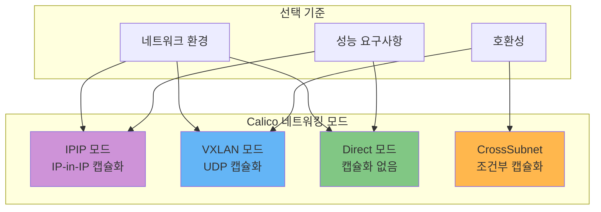
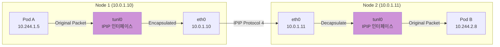
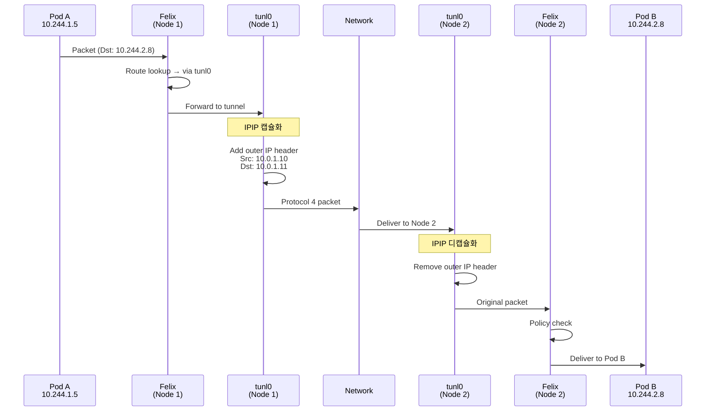
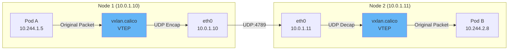
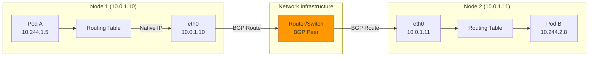
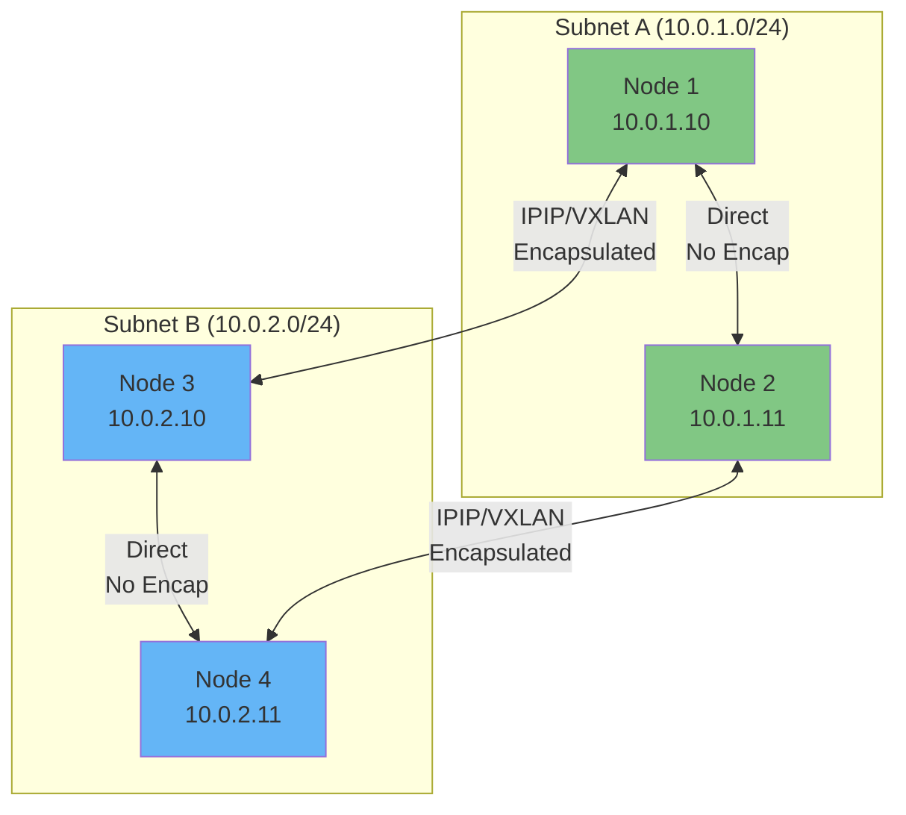
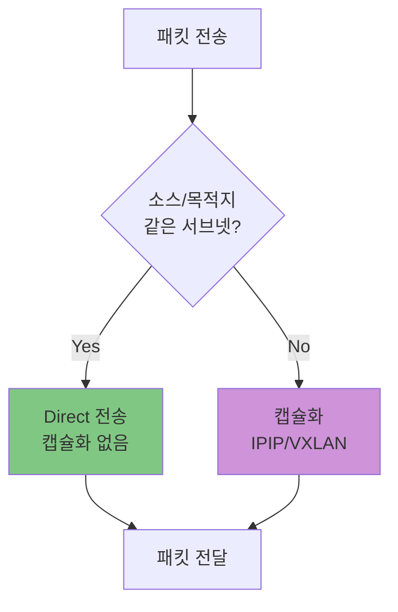

# Part 3: Calico 네트워킹 모드

> **지원 버전**: Calico v3.29+ / Kubernetes 1.28+
> **마지막 업데이트**: 2026년 2월 23일

## 개요

Calico는 다양한 네트워킹 환경에 맞는 여러 모드를 제공합니다. 각 모드는 캡슐화 방식, 성능 특성, 호환성 측면에서 다른 트레이드오프를 가집니다. 이 장에서는 각 모드의 내부 동작, 패킷 구조, 설정 방법을 심층적으로 분석합니다.

## 네트워킹 모드 개요




### 모드별 특성 비교표

| 특성 | IPIP | VXLAN | Direct | CrossSubnet |
|------|------|-------|--------|-------------|
| **캡슐화** | IP-in-IP | UDP/VXLAN | 없음 | 조건부 |
| **오버헤드** | 20 bytes | 50 bytes | 0 bytes | 가변 |
| **권장 MTU** | 1480 | 1450 | 1500 | 가변 |
| **프로토콜** | IP Protocol 4 | UDP 4789 | Native IP | 혼합 |
| **AWS 지원** | 지원 | 지원 | VPC 설정 필요 | 권장 |
| **Azure 지원** | 제한적 | 권장 | 어려움 | VXLAN과 함께 |
| **GCP 지원** | 지원 | 지원 | VPC 설정 필요 | 권장 |
| **온프레미스** | 지원 | 지원 | BGP 필요 | BGP와 함께 |
| **성능** | 좋음 | 보통 | 최고 | 최적화됨 |

## IPIP (IP-in-IP) 모드

### IPIP 동작 원리

IPIP 모드는 원본 IP 패킷을 새로운 IP 헤더로 캡슐화합니다. Linux 커널의 `tunl0` 인터페이스를 사용합니다.



### IPIP 패킷 구조

```
+--------------------------------------------+
|          Outer IP Header (20 bytes)        |
| Src: 10.0.1.10 (Node 1)                   |
| Dst: 10.0.1.11 (Node 2)                   |
| Protocol: 4 (IP-in-IP)                    |
+--------------------------------------------+
|          Inner IP Header (20 bytes)        |
| Src: 10.244.1.5 (Pod A)                   |
| Dst: 10.244.2.8 (Pod B)                   |
| Protocol: TCP/UDP                          |
+--------------------------------------------+
|          TCP/UDP Header                    |
+--------------------------------------------+
|          Payload                           |
+--------------------------------------------+

MTU 계산:
- 기본 MTU: 1500 bytes
- IPIP 오버헤드: 20 bytes (외부 IP 헤더)
- 권장 Pod MTU: 1480 bytes
```

### IPIP 모드 옵션

| 옵션 | 설명 | 트래픽 패턴 |
|------|------|-------------|
| `Always` | 모든 Pod 간 트래픽 캡슐화 | Node → IPIP → Node |
| `CrossSubnet` | 다른 서브넷만 캡슐화 | 같은 서브넷: Direct, 다른 서브넷: IPIP |
| `Never` | IPIP 비활성화 | Direct 또는 VXLAN 사용 |

### IPIP IPPool 설정

```yaml
# IPIP Always 모드
apiVersion: projectcalico.org/v3
kind: IPPool
metadata:
  name: ipip-always-pool
spec:
  cidr: 10.244.0.0/16
  ipipMode: Always
  vxlanMode: Never
  natOutgoing: true
  nodeSelector: all()
---
# IPIP CrossSubnet 모드 (권장)
apiVersion: projectcalico.org/v3
kind: IPPool
metadata:
  name: ipip-crosssubnet-pool
spec:
  cidr: 10.244.0.0/16
  ipipMode: CrossSubnet
  vxlanMode: Never
  natOutgoing: true
  nodeSelector: all()
```

### IPIP 패킷 흐름 상세



## VXLAN 모드

### VXLAN 동작 원리

VXLAN (Virtual Extensible LAN)은 Layer 2 프레임을 UDP 패킷으로 캡슐화합니다. 기본 포트는 UDP 4789입니다.



### VXLAN 패킷 구조

```
+--------------------------------------------+
|          Outer Ethernet Header (14 bytes)  |
+--------------------------------------------+
|          Outer IP Header (20 bytes)        |
| Src: 10.0.1.10 (Node 1 VTEP)              |
| Dst: 10.0.1.11 (Node 2 VTEP)              |
| Protocol: UDP                              |
+--------------------------------------------+
|          Outer UDP Header (8 bytes)        |
| Src Port: Random (hash-based)              |
| Dst Port: 4789 (VXLAN)                    |
+--------------------------------------------+
|          VXLAN Header (8 bytes)            |
| VNI: 4096 (Calico default)                |
+--------------------------------------------+
|          Inner Ethernet Header (14 bytes)  |
+--------------------------------------------+
|          Inner IP Header (20 bytes)        |
| Src: 10.244.1.5 (Pod A)                   |
| Dst: 10.244.2.8 (Pod B)                   |
+--------------------------------------------+
|          TCP/UDP Header + Payload          |
+--------------------------------------------+

MTU 계산:
- 기본 MTU: 1500 bytes
- VXLAN 오버헤드: 50 bytes
  - Outer IP: 20 bytes
  - UDP: 8 bytes
  - VXLAN: 8 bytes
  - Inner Ethernet: 14 bytes
- 권장 Pod MTU: 1450 bytes
```

### VXLAN IPPool 설정

```yaml
# VXLAN Always 모드
apiVersion: projectcalico.org/v3
kind: IPPool
metadata:
  name: vxlan-always-pool
spec:
  cidr: 10.244.0.0/16
  ipipMode: Never
  vxlanMode: Always
  natOutgoing: true
  nodeSelector: all()
---
# VXLAN CrossSubnet 모드
apiVersion: projectcalico.org/v3
kind: IPPool
metadata:
  name: vxlan-crosssubnet-pool
spec:
  cidr: 10.244.0.0/16
  ipipMode: Never
  vxlanMode: CrossSubnet
  natOutgoing: true
  nodeSelector: all()
```

### VXLAN 고급 설정

```yaml
# FelixConfiguration에서 VXLAN 튜닝
apiVersion: projectcalico.org/v3
kind: FelixConfiguration
metadata:
  name: default
spec:
  # VXLAN 활성화
  vxlanEnabled: true

  # VXLAN 포트 (기본: 4789)
  vxlanPort: 4789

  # VXLAN VNI (Virtual Network Identifier)
  vxlanVNI: 4096

  # VXLAN MTU 자동 감지
  # 비활성화 시 수동 설정 필요
  mtuIfacePattern: "^(en.*|eth.*)"
```

### IPIP vs VXLAN 상세 비교

| 특성 | IPIP | VXLAN |
|------|------|-------|
| **캡슐화 계층** | L3 (IP-in-IP) | L2 over L4 (UDP) |
| **오버헤드** | 20 bytes | 50 bytes |
| **성능** | 더 좋음 (낮은 오버헤드) | 약간 낮음 |
| **방화벽 통과** | Protocol 4 허용 필요 | UDP 4789 허용 (쉬움) |
| **Azure 지원** | 제한적 (UDR 필요) | 완전 지원 |
| **하드웨어 오프로드** | 제한적 | 광범위 (NIC 지원) |
| **멀티캐스트 필요** | 아니오 | 아니오 (Calico는 유니캐스트) |
| **ECMP 지원** | 제한적 | 좋음 (UDP 해시) |

## Direct / Unencapsulated 모드

### Direct 모드 동작 원리

Direct 모드는 캡슐화 없이 순수 IP 라우팅을 사용합니다. BGP로 Pod CIDR을 광고하여 외부 라우터가 패킷을 올바른 노드로 전달합니다.



### Direct 모드 패킷 구조

```
+--------------------------------------------+
|          IP Header (20 bytes)              |
| Src: 10.244.1.5 (Pod A)                   |
| Dst: 10.244.2.8 (Pod B)                   |
| Protocol: TCP/UDP                          |
+--------------------------------------------+
|          TCP/UDP Header                    |
+--------------------------------------------+
|          Payload                           |
+--------------------------------------------+

MTU: 1500 bytes (오버헤드 없음)
```

### Direct 모드 요구사항

1. **BGP 피어링**: 외부 라우터와 BGP 세션 설정 필요
2. **L3 라우팅**: 노드 간 L3 라우팅 가능해야 함
3. **Pod CIDR 광고**: BGP로 Pod 네트워크 광고

```yaml
# Direct 모드 IPPool
apiVersion: projectcalico.org/v3
kind: IPPool
metadata:
  name: direct-pool
spec:
  cidr: 10.244.0.0/16
  ipipMode: Never
  vxlanMode: Never
  natOutgoing: false  # BGP 환경에서는 NAT 불필요할 수 있음
  nodeSelector: all()
---
# BGP Configuration
apiVersion: projectcalico.org/v3
kind: BGPConfiguration
metadata:
  name: default
spec:
  asNumber: 64512
  nodeToNodeMeshEnabled: true  # 또는 false + Route Reflector
  serviceClusterIPs:
    - cidr: 10.96.0.0/12
  serviceExternalIPs:
    - cidr: 203.0.113.0/24
---
# 외부 BGP 피어
apiVersion: projectcalico.org/v3
kind: BGPPeer
metadata:
  name: tor-switch
spec:
  peerIP: 192.168.1.1
  asNumber: 64513
```

### Direct 모드 라우팅 테이블 예시

```bash
# Node 1에서의 라우팅 테이블
$ ip route show

# 로컬 Pod 네트워크
10.244.1.0/24 dev cali123abc scope link

# 다른 노드의 Pod 네트워크 (BGP로 학습)
10.244.2.0/24 via 10.0.1.11 dev eth0 proto bird
10.244.3.0/24 via 10.0.1.12 dev eth0 proto bird

# 기본 게이트웨이
default via 10.0.1.1 dev eth0
```

## CrossSubnet 모드

### CrossSubnet 동작 원리

CrossSubnet은 IPIP 또는 VXLAN의 "스마트" 모드입니다. 같은 서브넷의 노드 간에는 Direct 라우팅을, 다른 서브넷 간에는 캡슐화를 사용합니다.



### CrossSubnet 설정

```yaml
# CrossSubnet IPIP
apiVersion: projectcalico.org/v3
kind: IPPool
metadata:
  name: crosssubnet-ipip-pool
spec:
  cidr: 10.244.0.0/16
  ipipMode: CrossSubnet
  vxlanMode: Never
  natOutgoing: true
  nodeSelector: all()
---
# CrossSubnet VXLAN
apiVersion: projectcalico.org/v3
kind: IPPool
metadata:
  name: crosssubnet-vxlan-pool
spec:
  cidr: 10.244.0.0/16
  ipipMode: Never
  vxlanMode: CrossSubnet
  natOutgoing: true
  nodeSelector: all()
```

### CrossSubnet 서브넷 판단 로직



## 성능 벤치마크

### 모드별 성능 비교

| 측정 항목 | Direct | IPIP | VXLAN | 측정 환경 |
|-----------|--------|------|-------|-----------|
| **처리량 (Gbps)** | 9.8 | 9.2 | 8.5 | iperf3, MTU 1500 |
| **지연 시간 (us)** | 35 | 42 | 55 | netperf, TCP_RR |
| **CPU 사용률** | 낮음 | 중간 | 중간-높음 | 10Gbps 전송 시 |
| **PPS (백만)** | 1.8 | 1.5 | 1.2 | 64byte 패킷 |

### 벤치마크 테스트 방법

```bash
# iperf3 처리량 테스트
# Server (Pod B)
kubectl exec -it pod-b -- iperf3 -s

# Client (Pod A)
kubectl exec -it pod-a -- iperf3 -c <pod-b-ip> -t 30 -P 4

# netperf 지연 시간 테스트
# Server
kubectl exec -it pod-b -- netserver

# Client
kubectl exec -it pod-a -- netperf -H <pod-b-ip> -t TCP_RR -l 60
```

## 클라우드 제공자별 호환성

### AWS (EKS)

| 모드 | 지원 | 권장 | 비고 |
|------|------|------|------|
| IPIP | 지원 | CrossSubnet | Security Group에서 Protocol 4 허용 필요 |
| VXLAN | 지원 | CrossSubnet | UDP 4789 허용 필요 |
| Direct | 조건부 | BGP 환경만 | VPC 라우팅 테이블 수동 설정 또는 BGP |
| CrossSubnet | 권장 | 예 | AZ 간 트래픽만 캡슐화 |

```yaml
# AWS EKS용 CrossSubnet 설정
apiVersion: projectcalico.org/v3
kind: IPPool
metadata:
  name: eks-crosssubnet-pool
spec:
  cidr: 10.244.0.0/16
  ipipMode: CrossSubnet
  vxlanMode: Never
  natOutgoing: true
```

### Azure (AKS)

| 모드 | 지원 | 권장 | 비고 |
|------|------|------|------|
| IPIP | 제한적 | 아니오 | UDR 필요, 복잡함 |
| VXLAN | 완전 지원 | 예 | Azure 네이티브 지원 |
| Direct | 어려움 | 아니오 | Azure는 BGP 제한적 |
| CrossSubnet | VXLAN과 함께 | 예 | VXLAN CrossSubnet 권장 |

```yaml
# Azure AKS용 VXLAN 설정
apiVersion: projectcalico.org/v3
kind: IPPool
metadata:
  name: aks-vxlan-pool
spec:
  cidr: 10.244.0.0/16
  ipipMode: Never
  vxlanMode: Always  # Azure에서는 Always 권장
  natOutgoing: true
```

### GCP (GKE)

| 모드 | 지원 | 권장 | 비고 |
|------|------|------|------|
| IPIP | 지원 | CrossSubnet | Firewall에서 Protocol 4 허용 |
| VXLAN | 지원 | 대안 | UDP 4789 허용 필요 |
| Direct | 조건부 | VPC Native | GCP VPC 라우팅 활용 |
| CrossSubnet | 권장 | 예 | 리전 간 트래픽 캡슐화 |

### 온프레미스

| 모드 | 지원 | 권장 | 비고 |
|------|------|------|------|
| IPIP | 지원 | L3 네트워크 | 방화벽 Protocol 4 허용 |
| VXLAN | 지원 | 방화벽 환경 | UDP 통과 용이 |
| Direct | 완전 지원 | BGP 환경 | 최고 성능 |
| CrossSubnet | 지원 | 하이브리드 | L2/L3 혼합 환경 |

## MTU 최적화 가이드

### MTU 오버헤드 계산

| 모드 | 오버헤드 | 계산 | 권장 MTU |
|------|----------|------|----------|
| Direct | 0 bytes | 1500 - 0 | 1500 |
| IPIP | 20 bytes | 1500 - 20 | 1480 |
| VXLAN | 50 bytes | 1500 - 50 | 1450 |
| WireGuard | 60 bytes | 1500 - 60 | 1440 |
| IPIP + WireGuard | 80 bytes | 1500 - 80 | 1420 |

### MTU 자동 감지 설정

```yaml
apiVersion: projectcalico.org/v3
kind: FelixConfiguration
metadata:
  name: default
spec:
  # MTU 자동 감지 활성화
  mtuIfacePattern: "^(en.*|eth.*|ens.*)"

  # 또는 수동 설정
  # ipipMTU: 1480
  # vxlanMTU: 1450
  # wireguardMTU: 1440
```

### MTU 문제 진단

```bash
# 현재 인터페이스 MTU 확인
ip link show | grep mtu

# Pod 내부 MTU 확인
kubectl exec -it <pod> -- ip link show eth0

# MTU 경로 탐색
tracepath -n <destination-ip>

# PMTUD (Path MTU Discovery) 테스트
ping -M do -s 1472 <destination-ip>  # 1472 + 28 = 1500
```

## 모드 마이그레이션 가이드

### IPIP에서 VXLAN으로 전환

```bash
# 1. 현재 IPPool 확인
calicoctl get ippool default-ipv4-ippool -o yaml

# 2. 새 VXLAN IPPool 생성
cat <<EOF | calicoctl apply -f -
apiVersion: projectcalico.org/v3
kind: IPPool
metadata:
  name: vxlan-pool
spec:
  cidr: 10.245.0.0/16  # 새 CIDR
  ipipMode: Never
  vxlanMode: Always
  natOutgoing: true
EOF

# 3. 기존 IPPool 비활성화
calicoctl patch ippool default-ipv4-ippool -p '{"spec": {"disabled": true}}'

# 4. 워크로드 롤링 재시작 (새 IP 할당)
kubectl rollout restart deployment -n <namespace>

# 5. 기존 IPPool 삭제 (모든 Pod 마이그레이션 후)
calicoctl delete ippool default-ipv4-ippool
```

### Direct에서 IPIP CrossSubnet으로 전환

```yaml
# IPPool 수정
apiVersion: projectcalico.org/v3
kind: IPPool
metadata:
  name: default-ipv4-ippool
spec:
  cidr: 10.244.0.0/16
  ipipMode: CrossSubnet  # Never → CrossSubnet
  vxlanMode: Never
  natOutgoing: true
```

```bash
# Felix 재시작으로 즉시 적용
kubectl rollout restart daemonset calico-node -n calico-system
```

## IPPool 고급 설정

### 노드별 IPPool 할당

```yaml
# 특정 노드 그룹에 IPPool 할당
apiVersion: projectcalico.org/v3
kind: IPPool
metadata:
  name: zone-a-pool
spec:
  cidr: 10.244.0.0/18
  ipipMode: CrossSubnet
  vxlanMode: Never
  natOutgoing: true
  nodeSelector: "topology.kubernetes.io/zone == 'ap-northeast-2a'"
---
apiVersion: projectcalico.org/v3
kind: IPPool
metadata:
  name: zone-b-pool
spec:
  cidr: 10.244.64.0/18
  ipipMode: CrossSubnet
  vxlanMode: Never
  natOutgoing: true
  nodeSelector: "topology.kubernetes.io/zone == 'ap-northeast-2b'"
```

### 네임스페이스별 IPPool 할당

```yaml
# 네임스페이스 어노테이션으로 IPPool 선택
apiVersion: v1
kind: Namespace
metadata:
  name: production
  annotations:
    cni.projectcalico.org/ipv4pools: '["production-pool"]'
---
apiVersion: projectcalico.org/v3
kind: IPPool
metadata:
  name: production-pool
spec:
  cidr: 10.245.0.0/16
  ipipMode: CrossSubnet
  vxlanMode: Never
  natOutgoing: true
```

---

## 요약

이 장에서 학습한 내용:

1. **IPIP 모드**: IP-in-IP 캡슐화, 20 bytes 오버헤드, AWS/GCP 권장
2. **VXLAN 모드**: UDP 캡슐화, 50 bytes 오버헤드, Azure 필수
3. **Direct 모드**: 캡슐화 없음, BGP 필수, 최고 성능
4. **CrossSubnet 모드**: 조건부 캡슐화, 하이브리드 환경 최적
5. **클라우드 호환성**: 각 클라우드별 권장 모드
6. **MTU 최적화**: 모드별 MTU 계산 및 설정

다음 장에서는 **BGP 심층 분석**을 다룹니다.

---

[← 이전: 아키텍처 심층 분석](02-architecture.md) | [메인 페이지](README.md) | [다음: BGP 심층 분석 →](04-bgp-deep-dive.md)

## 퀴즈

이 장에서 배운 내용을 테스트하려면 [Part 3 퀴즈](../../quizzes/networking/calico/03-networking-modes-quiz.md)를 풀어보세요.
