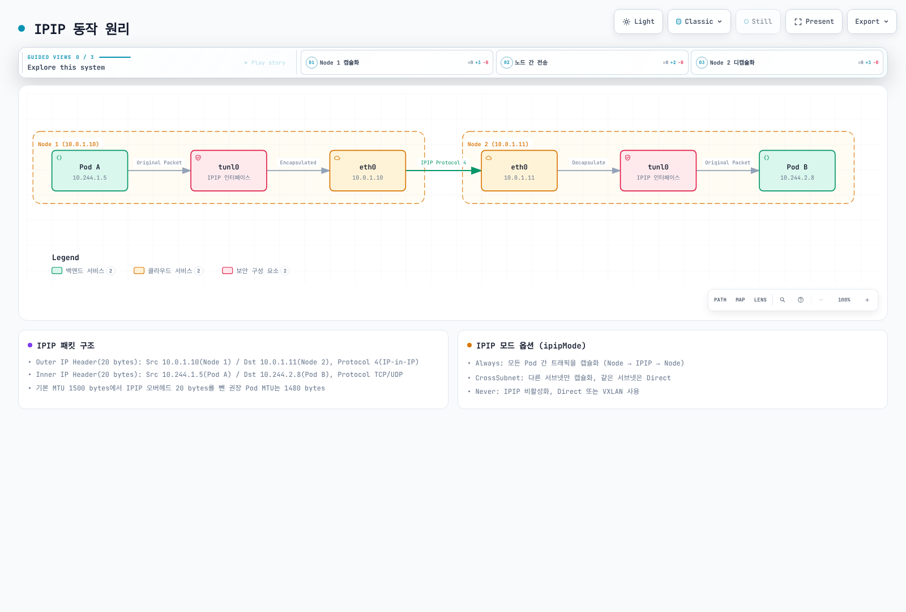
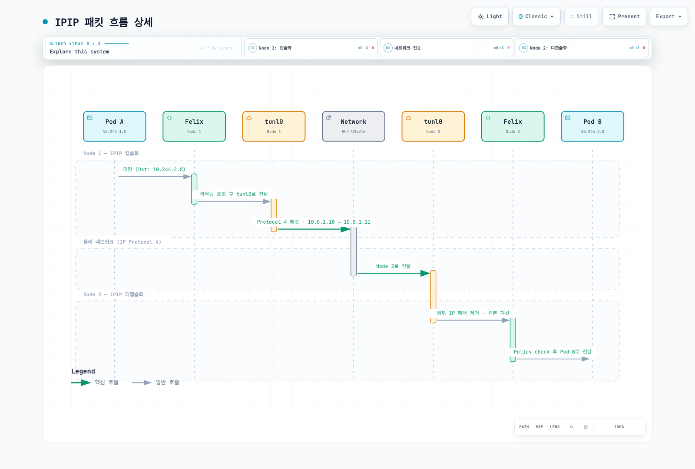
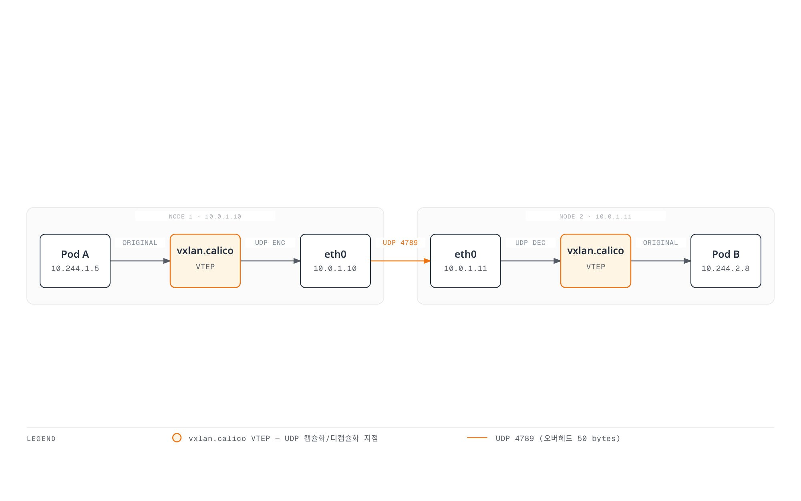
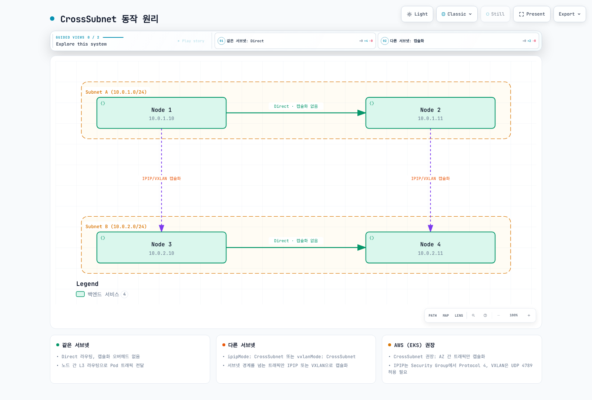
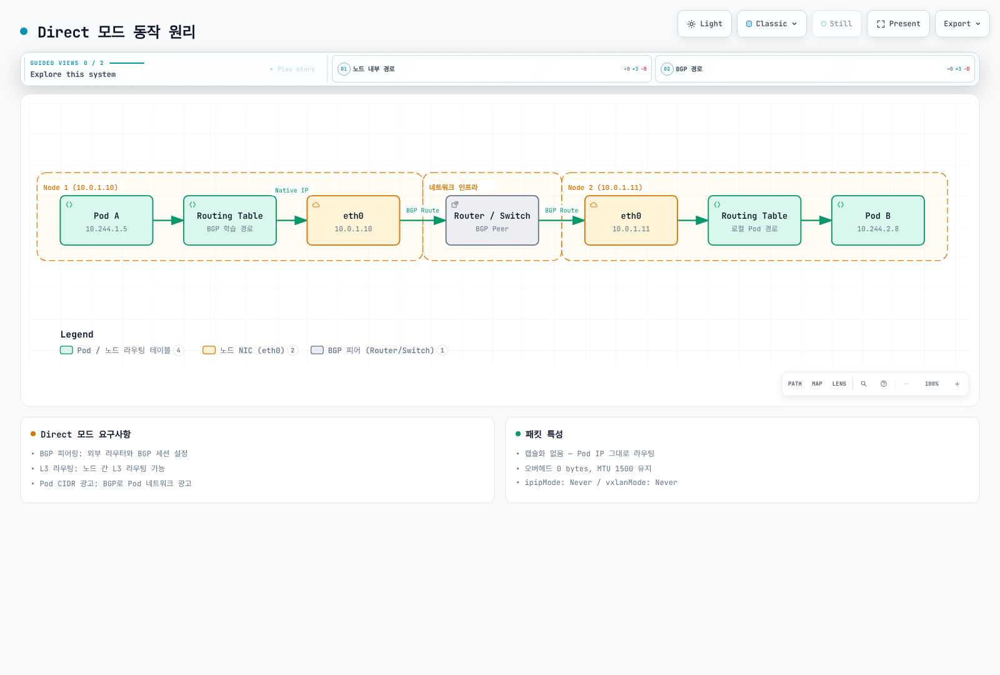

# Part 3: 네트워킹 모드

> **검토 기준**: Calico Open Source 3.32.2 / operator 1.42.6, Calico 3.32의 Kubernetes 시험 범위는 1.34–1.36입니다.
> **검토일**: 2026년 9월 12일. 아래 기존 벤치마크 수치는 검증되지 않은 보고값으로 보존하며 새 측정값이 아닙니다.

## 범위와 모드 선택

이 장은 Calico가 담당하는 Linux Pod 네트워킹·IPAM을 다룹니다. EKS policy-only에서는 Amazon VPC CNI가 Pod 네트워킹을 유지하며 Calico IPPool 생성만으로 오버레이로 바뀌지 않습니다. 예제는 대안 설계이며 함께 적용하거나 소개 실습의 기존 pool 위에 겹쳐 생성하는 매니페스트가 아닙니다. 감사에서는 클러스터 마이그레이션이나 네트워크 벤치마크를 실행하지 않았습니다.

| 선택 | 의미 | 주요 조건 |
|---|---|---|
| IPIP | IPv4-in-IPv4, IP protocol 4 | Calico IPIP는 IPv4 전용, 언더레이의 프로토콜 허용 필요 |
| VXLAN | 내부 Ethernet을 UDP로 운반, Calico 기본 포트 4789 | 외부 IPv4·IPv6 오버헤드가 다르며 포트·VNI는 설정 가능 |
| Direct / 비캡슐화 | Pod 네트워크 오버레이 없이 Pod IP 패킷 라우팅 | 언더레이와 반환 경로가 Pod 주소를 라우팅해야 함 |
| CrossSubnet | IPIP 또는 VXLAN의 설정 | 관련 노드 주소가 서로 다른 설정 서브넷일 때만 노드 간 트래픽 캡슐화 |

`Always`는 해당 pool 주소로 가는 대상 노드 간 트래픽에 적용하며 같은 노드 통신에는 물리 터널이 필요하지 않습니다. `Never`는 해당 캡슐화를 끄는 값이지 모든 네트워킹을 끄는 값이 아닙니다. CrossSubnet은 AZ·리전·WAN 링크 감지기가 아니며 한 AZ의 다른 서브넷 사이도 캡슐화될 수 있습니다. Calico가 사용하는 노드 주소·서브넷 마스크를 확인해야 합니다.

기본값은 설치 방식·제공자·데이터플레인에 따라 다릅니다. “모든 클라우드에서 IPIP 기본”이나 “Direct 항상 최고 성능”으로 일반화할 수 없습니다. [오버레이 가이드](https://docs.tigera.io/calico/latest/networking/configuring/vxlan-ipip)에서 지원 경로를 확인하세요.

### 라우팅과 캡슐화는 별개의 선택

기본적으로 VXLAN pool 경로는 Felix가, IPIP·비캡슐화 pool의 클러스터 경로는 confd/BIRD가 프로그래밍합니다. Calico 3.32에서는 후자의 경로에도 `Installation.spec.calicoNetwork.clusterRoutingMode: Felix`를 선택할 수 있습니다. 하위 설정은 Felix의 `programClusterRoutes: Enabled`와 BGP의 `programClusterRoutes: Disabled`이며 operator 설치에는 operator 설정을 사용합니다. 외부 BGP 광고에는 여전히 BGP가 필요합니다. 정적 경로나 적합한 라우팅 패브릭도 언더레이 연결성을 제공하므로 모든 비캡슐화 설계에 BGP나 동일 L2 인접성이 필수인 것은 아닙니다.

## 패킷 구조와 오버헤드

아래는 **언더레이 IP MTU** 기준입니다. 외부 Ethernet 헤더는 그 IP MTU에 포함되지 않습니다. IPv4 옵션과 추가 내부 VLAN 태그가 없다고 가정하며 TCP 옵션·다른 캡슐화는 페이로드를 더 줄일 수 있습니다.

```text
Direct: outer Ethernet | Pod IP | TCP or UDP | payload
IPIP:   outer Ethernet | outer IPv4 | Pod IPv4 | TCP or UDP | payload
VXLAN:  outer Ethernet | outer IP | UDP | VXLAN | inner Ethernet | Pod IP | TCP or UDP | payload
```

| 전송 방식 | Pod IP 패킷에 추가되는 오버헤드 | 언더레이 IP MTU 1500의 Pod IP MTU |
|---|---|---|
| 다른 터널 없는 Direct | 0 | 1500 |
| 외부 IPv4 IPIP | 20 | 1480 |
| 외부 IPv4 VXLAN | 20 + 8 + 8 + 14 = 50 | 1450 |
| 외부 IPv6 VXLAN | 40 + 8 + 8 + 14 = 70 | 1430 |
| 외부 IPv4 WireGuard | 60 | 1440 |
| 외부 IPv6 WireGuard | 80 | 1420 |

VXLAN MTU 오버헤드의 14바이트는 외부가 아닌 **내부 Ethernet 헤더**입니다. 기본 TCP 헤더는 최소 20바이트, UDP 헤더는 8바이트입니다. 이 가정에서 IPv4 IP 패킷 1500바이트에는 최대 TCP 페이로드 1460바이트 또는 UDP 페이로드 1472바이트가 들어갑니다. 기존의 공통 “TCP/UDP = 20바이트” 표기는 잘못되었습니다.

IPIP의 4는 TCP·UDP 포트가 아닌 IP 프로토콜 번호입니다. 일반적인 Calico VXLAN VNI는 4096, 기본 UDP 포트는 4789이며 둘 다 설정 가능합니다. 다른 현재 VXLAN 구현도 8472를 사용할 수 있으므로 오래된 소프트웨어에만 한정된 값은 아닙니다. [IP-in-IP](https://www.rfc-editor.org/rfc/rfc2003)와 [VXLAN](https://www.rfc-editor.org/rfc/rfc7348)을 참고하세요.

### 패킷 경로 개념도



[🔍 인터랙티브 다이어그램 보기](https://www.atomai.click/kubernetes-docs/archmaps/ko-networking-calico-03-networking-modes-1.html)

그림의 Always는 대상 노드 간 트래픽을 뜻하며 같은 노드 트래픽까지 터널을 통과한다는 뜻이 아닙니다. 1480은 옵션 없는 IPv4 헤더와 1500바이트 언더레이의 예입니다. tunl0는 캡슐화 장치이며 암호화·보안 경계가 아닙니다.



[🔍 인터랙티브 다이어그램 보기](https://www.atomai.click/kubernetes-docs/archmaps/ko-networking-calico-03-networking-modes-2.html)

“Felix” 열은 Felix가 프로그래밍한 커널 라우팅·정책을 나타내며 패킷이 Felix 데몬을 경유하지는 않습니다. IPv4 노드 간 경로의 개념도입니다.



[🔍 인터랙티브 다이어그램 보기](https://www.atomai.click/kubernetes-docs/archmaps/ko-networking-calico-03-networking-modes-3.html)

4789와 VNI 4096은 그림의 기본값 예입니다. 50바이트 오버헤드·1450 MTU는 외부 IPv4, 언더레이 1500과 명시한 헤더 가정에 한정됩니다.

### CrossSubnet 예

노드 주소가 10.0.1.10/24와 10.0.1.11/24이면 같은 서브넷 경로를 비캡슐화할 수 있습니다. 10.0.2.20/24의 peer에는 CrossSubnet 설계상 캡슐화가 필요합니다. 클라우드 서브넷 이름이 맞아 보여도 잘못된 노드 마스크는 결과를 바꿀 수 있습니다. CrossSubnet은 VPC·리전 간 연결을 만들거나 암호화를 제공하지 않습니다.



[🔍 인터랙티브 다이어그램 보기](https://www.atomai.click/kubernetes-docs/archmaps/ko-networking-calico-03-networking-modes-5.html)

서브넷 판단은 노드 주소·마스크 기준이며 AZ 이름 기준이 아닙니다. 그림의 EKS 문구는 Calico가 네트워킹을 맡는 별도 구성에만 해당하고 기본 VPC CNI를 의미하지 않습니다.

### 노드 진단

일반 애플리케이션 Pod가 아니라 승인된 **Linux 노드 네트워크 네임스페이스**에서 읽기 전용 명령을 실행합니다. 해당 모드가 켜져 있어야 인터페이스가 존재하며 출력값은 실제 설치에 따라 달라집니다.

```bash
ip link show tunl0
ip link show vxlan.calico
bridge fdb show dev vxlan.calico
ip route show
```

일반적인 로컬 Pod 경로는 `10.244.1.5/32 dev cali…` 같은 host route입니다. /24나 /26 전체를 Pod 하나의 veth로 보내는 예시로 이해하면 안 됩니다. 집계 block에는 blackhole 경로와 더 구체적인 Pod 경로가 함께 있을 수 있습니다. 원격 block은 터널이나 다음 노드·라우터를 사용하며 프로토콜 표시는 BIRD·Felix 중 경로 프로그래밍 주체에 따라 달라집니다.

## 소유자를 통해 pool 설정

`kubectl …projectcalico.org` 예제는 소개 장의 Calico 집계 API 또는 적절한 native-v3 구성을 전제로 합니다. 없다면 일치하는 calicoctl로 논리적 Calico 리소스를 관리합니다. Operator 명령은 operator 설치에만 적용합니다. Pool 범위가 Service·노드/언더레이 범위와 충돌하지 않는지도 확인하세요.

설정 소유자를 하나로 유지합니다. `Installation.spec.calicoNetwork.ipPools`에 있는 pool은 operator가 조정하므로 경쟁하는 IPPool 객체를 적용하지 말고 원본 목록을 소유자를 통해 수정합니다. 독립 pool에는 Calico IPPool API를 사용합니다. 두 경우 모두 실제 클러스터 Pod CIDR·비중첩·IPAM 종류·기존 할당을 먼저 확인하세요.

```bash
kubectl get installation.operator.tigera.io default -o yaml
kubectl get ippools.projectcalico.org -o yaml
calicoctl ipam show --show-blocks
```

operator 관리 pool에서는 아래를 기존 `ipPools` 목록의 **항목 조각**으로 사용합니다. 다른 항목과 Installation 필드를 보존하세요. 소개 실습에서 이미 할당한 /16 pool 위에 추가 생성하면 안 됩니다.

```yaml
- name: mode-demo-pool
  cidr: 10.244.0.0/16
  blockSize: 26
  encapsulation: VXLAN
  natOutgoing: Enabled
  nodeSelector: all()
```

독립적으로 새 pool을 설계하는 경우의 동등한 IPv4 리소스는 아래와 같습니다. Operator 항목과 함께 만드는 중첩 pool이 아니라 대안입니다. CIDR은 실제 클러스터 범위 안에서 기존 pool과 겹치지 않게 선택해야 합니다.

```yaml
apiVersion: projectcalico.org/v3
kind: IPPool
metadata:
  name: mode-demo-pool
spec:
  cidr: 10.244.0.0/16
  blockSize: 26
  ipipMode: Never
  vxlanMode: Always
  natOutgoing: true
  nodeSelector: all()
```

같은 CIDR의 리소스를 여러 개 만들지 말고 한 행을 선택합니다.

| IPv4 설계 | IPPool `ipipMode` | IPPool `vxlanMode` | Operator `encapsulation` |
|---|---|---|---|
| IPIP Always | Always | Never | IPIP |
| IPIP CrossSubnet | CrossSubnet | Never | IPIPCrossSubnet |
| VXLAN Always | Never | Always | VXLAN |
| VXLAN CrossSubnet | Never | CrossSubnet | VXLANCrossSubnet |
| Direct | Never | Never | None |

한 pool에서 IPIP와 VXLAN을 동시에 켤 수는 없습니다. `encapsulation`은 operator pool의 필드이며 독립 IPPool의 필드명이 아닙니다. 일반적인 집계 API 설치에서는 중첩 pool 생성이 거부됩니다. Native v3 CRD(tech preview)는 중첩 검증이 비동기이므로 생성된 pool에 Disabled 조건이 생길 수 있습니다. 생성 성공만으로 할당 가능함을 입증할 수는 없습니다.

Calico 3.32의 Installation 스키마는 최대 25개 항목의 pool 목록을 허용하며 컨트롤러 검증·플랫폼 제약이 적용됩니다. 예전의 IPv4 pool 한 개 제한 예제를 현재 모든 설치의 제한으로 일반화하면 안 됩니다.

### 외부 BGP와 직접 라우팅

외부 BGP 설계라면 오버레이 제거 전에 실제 peer와 반환 경로를 구성합니다. Peer 선언만으로 물리 라우터가 설정되거나 경로 수락이 입증되지는 않습니다. 아래는 BGP 비활성 VXLAN 실습에 추가하는 설정이 아닌 별도 토폴로지 예입니다.

```yaml
apiVersion: projectcalico.org/v3
kind: BGPPeer
metadata:
  name: example-rack-tor
spec:
  peerIP: 192.0.2.1
  asNumber: 65001
  nodeSelector: rack == 'rack1'
```

문서용 주소·ASN을 바꾸고 대상 노드 라벨과 랙별 라우트 필터·AS-loop 처리를 검증합니다. `natOutgoing: false`는 반환 라우팅과 필요한 외부 NAT가 설계된 경우에만 적절합니다. BGP만으로 사설 Pod 주소가 인터넷에서 라우팅되지는 않습니다. Mesh·RR 변경은 [BGP 전환 설명](02-architecture.md)과 [BGP 심층 분석](04-bgp-deep-dive.md)을 참고하세요.



[🔍 인터랙티브 다이어그램 보기](https://www.atomai.click/kubernetes-docs/archmaps/ko-networking-calico-03-networking-modes-4.html)

BGP를 사용한 설계 예이며 모든 Direct 설계에 BGP가 필수라는 뜻이 아닙니다. 1500은 해당 경로와 다른 터널이 없다는 가정입니다. eBPF Service 전달이나 암호화로 워크로드 MTU가 더 작아질 수 있습니다.

## NAT와 pool 선택

`natOutgoing: true`의 일반적인 Calico 동작은 해당 pool의 출발지에서 **모든 Calico IPPool 밖**의 목적지로 갈 때 SNAT하는 것입니다. 단순한 “클러스터 밖으로 나감” 조건이 아닙니다. 비활성 pool도 NAT를 하지 않을 목적지 범위를 나타낼 수 있으므로 삭제하면 NAT 동작이 바뀔 수 있습니다. Felix의 추가 설정으로 호스트 IP도 제외할 수 있습니다. NAT가 NetworkPolicy 허용을 부여하지는 않습니다. [아웃바운드 NAT](https://docs.tigera.io/calico/latest/networking/configuring/workloads-outside-cluster)를 참고하세요.

### 토폴로지 기반 자동 할당

클러스터 /16 범위 안에서 겹치지 않는 /18 pool 두 개를 계획하는 별도 예입니다. 할당 중인 상위 /16 pool과 공존하면 안 됩니다. 예제에 맞추려고 사용 중인 상위 pool을 삭제하지 마세요.

```yaml
apiVersion: projectcalico.org/v3
kind: IPPool
metadata:
  name: zone-a-pool
spec:
  cidr: 10.244.0.0/18
  ipipMode: Never
  vxlanMode: CrossSubnet
  natOutgoing: true
  nodeSelector: topology.kubernetes.io/zone == 'ap-northeast-2a'
---
apiVersion: projectcalico.org/v3
kind: IPPool
metadata:
  name: zone-b-pool
spec:
  cidr: 10.244.64.0/18
  ipipMode: Never
  vxlanMode: CrossSubnet
  natOutgoing: true
  nodeSelector: topology.kubernetes.io/zone == 'ap-northeast-2b'
```

자동 할당에서는 모든 대상 노드가 사용 가능한 pool과 매칭되는지 확인합니다. Selector는 Pod를 스케줄링하지 않습니다. 위 zone 라벨은 할당 pool을 선택하고 CrossSubnet의 캡슐화 판단은 여전히 노드 주소·마스크를 사용합니다.

### 네임스페이스·Pod의 명시적 pool 요청

Pool을 먼저 생성·확인한 뒤 요청해야 합니다. 아래는 네임스페이스의 기존 소유자를 통해 추가할 annotation 조각이며 전체 네임스페이스 대체 객체가 아닙니다. Pod annotation이 네임스페이스 annotation보다 우선하고 CNI pool 설정보다도 우선합니다.

```yaml
metadata:
  annotations:
    cni.projectcalico.org/ipv4pools: '["production-pool"]'
```

`production-pool`은 충분한 주소를 가진 기존 활성 pool이어야 합니다. `assignmentMode: Manual`은 자동 선택에서 제외하면서 명시적 요청을 허용하는 데 사용할 수 있습니다. **Pool selector나 annotation은 보안 경계가 아닙니다.** [릴리스 IPAM 구현](https://github.com/projectcalico/calico/blob/v3.32.2/libcalico-go/lib/ipam/ipam.go)은 활성 pool을 명시적으로 요청하면 호환성을 위해 노드·네임스페이스 pool selector를 무시합니다. 주소 대역을 신뢰 기준으로 삼는다면 pool 요청 권한을 통제해야 합니다. 기존 Pod의 주소는 유지되며 annotation 변경만으로 다시 할당되지 않습니다.

## 클라우드·플랫폼 범위

| 환경 | 기준 |
|---|---|
| 자체 관리 AWS EC2 | 선택한 모드의 IP protocol 4·VXLAN UDP 허용, 라우트, source/destination check와 반환 경로 확인 |
| Amazon VPC CNI를 쓰는 EKS | 기본 Pod 네트워킹은 Calico VXLAN이 아닌 VPC CNI, policy-only Calico가 이 pool들을 소유하지 않음 |
| 전체 Calico 네트워킹 EKS | Calico CNI·IPAM의 별도 계획된 설치, [공식 EKS 절차](https://docs.tigera.io/calico/latest/getting-started/kubernetes/managed-public-cloud/eks) 사용 |
| Calico가 네트워킹을 맡는 Azure | Calico 오버레이 가이드는 IPIP가 지원되지 않는 환경에 VXLAN을 지원, UDR 설정이 미지원 IPIP 캡슐화를 해결하지는 않음 |
| AKS | 특정 Azure CNI·정책 통합의 지원 절차 사용, 일반 Calico 오버레이로 가정하지 않음 |
| GCE / GKE | 자체 관리 GCE 라우팅과 관리형 GKE를 구분, [GKE Dataplane V2는 Cilium](https://cloud.google.com/kubernetes-engine/docs/concepts/dataplane-v2) |
| 온프레미스 | 언더레이 연결성에 따라 Direct·정적/BGP 라우팅·오버레이 선택, 항상 가장 빠른 한 가지 모드는 없음 |
| OpenStack Neutron 통합 | 인용한 Calico 오버레이 가이드가 제외하는 통합, 플랫폼 절차 없이 Kubernetes 오버레이 예제를 복사하지 않음 |

이 장은 EKS Auto Mode·Fargate용 커스텀 CNI 설치 절차를 제공하지 않습니다. VXLAN 예제에서 BGP를 끈다는 것은 그 구성에 필요하지 않다는 뜻이지 AWS에 BGP를 사용하는 서비스가 없다는 뜻은 아닙니다. Windows에는 Calico IPIP·VXLAN CrossSubnet 미지원 등 별도의 제약도 있습니다.

## MTU 설정과 확인

암호화·Service 경로를 포함해 워크로드가 사용할 수 있는 경로 중 가장 작은 유효 MTU를 사용합니다. [Calico MTU 가이드](https://docs.tigera.io/calico/latest/networking/configuring/mtu)는 자동 감지와 operator·매니페스트 관리 방식을 설명합니다. `mtuIfacePattern`은 감지에 사용할 인터페이스 선택식이며 활성화 스위치나 종단 간 경로 MTU의 증거가 아닙니다.

**IPIP와 WireGuard 오버헤드를 무조건 합산하지 마세요.** 일반적인 Calico 혼합 배포에서는 활성 peer 간 WireGuard를 사용하고 다른 경로에 IPIP·VXLAN을 사용합니다. 적용되는 MTU 중 최솟값을 선택합니다. 실제 경로 MTU가 1500일 때 IPv4 WireGuard와 IPIP의 조합은 `min(1440, 1480) = 1440`이며 `1500 − 60 − 20 = 1420`이 아닙니다. 외부 IPv6 WireGuard는 별도로 80바이트 오버헤드입니다.

AKS에는 문서화된 WireGuard 예외가 있습니다. 인터페이스가 1500이어도 하부 경로는 1400일 수 있어 IPv4 WireGuard는 1340, IPv6는 1320이 됩니다. eBPF NodePort 경로도 VXLAN을 사용하므로 비캡슐화 Pod pool만으로 워크로드 MTU 1500을 보장할 수는 없습니다.

Operator 설치에서 **해당 IPv4 VXLAN 경로에 1450이 적절함을 확인한 뒤** 기존 원하는 상태에 병합합니다.


```bash
kubectl patch installation.operator.tigera.io default --type merge   -p '{"spec":{"calicoNetwork":{"mtu":1450}}}'
```

매니페스트 관리 설치의 문서화된 설정은 `calico-config.data.veth_mtu`입니다. 해당 ConfigMap 변경 후 절차에 따라 Calico 노드 DaemonSet을 롤링합니다. Operator 관리 배포에 매니페스트 절차를 섞지 마세요. **변경된 워크로드 MTU는 새 워크로드에 적용됩니다.** calico-node 재시작만으로 애플리케이션 Pod가 재생성되거나 MTU 변경이 입증되지는 않습니다.

| 언더레이 IP MTU 예 | IPv4 IPIP | IPv4 VXLAN | IPv6 VXLAN | IPv4 WireGuard | IPv6 WireGuard |
|---|---|---|---|---|---|
| 9000 | 8980 | 8950 | 8930 | 8940 | 8920 |
| 실제 AWS 경로가 지원하는 9001 | 8981 | 8951 | 8931 | 8941 | 8921 |

전체 경로가 점보를 지원해야 하며 인터페이스 설정만으로는 부족합니다. 워크로드 경로는 노드뿐 아니라 진단 워크로드에서 확인하세요.

다음 제한된 시험은 iputils와 필요한 권한이 있는 승인된 Linux 진단 Pod를 가정합니다. 실제 Pod 이름·주소를 사용하세요. 아래는 **IPv4 ICMP** 페이로드 크기이며 IPv4 20바이트와 ICMP 8바이트를 더합니다. IPv6 계산은 다르고 성공한 probe가 모든 ECMP 경로의 안전성을 증명하지는 않습니다.

```bash
CHECK_NS=calico-demo
CHECK_POD=diagnostic-client
CHECK_TARGET=diagnostic-server
DEST_IPV4=$(kubectl -n "$CHECK_NS" get pod "$CHECK_TARGET" -o jsonpath='{.status.podIP}')
case "$DEST_IPV4" in
  ""|*:*) echo "Select a ready target Pod with an IPv4 address" >&2; exit 1 ;;
esac
kubectl -n "$CHECK_NS" exec "$CHECK_POD" -- ip link show eth0
kubectl -n "$CHECK_NS" exec "$CHECK_POD" -- ping -4 -c 3 -W 2 -M do -s 1472 "$DEST_IPV4"
kubectl -n "$CHECK_NS" exec "$CHECK_POD" -- ping -4 -c 3 -W 2 -M do -s 1452 "$DEST_IPV4"
kubectl -n "$CHECK_NS" exec "$CHECK_POD" -- ping -4 -c 3 -W 2 -M do -s 1422 "$DEST_IPV4"
```

세 페이로드는 IP 패킷 크기 1500·1480·1450을 시험합니다. 실패 원인은 MTU 외에 정책·ICMP 필터링일 수도 있습니다. 패킷 캡처에는 적절한 권한으로 IPv4 fragmentation-needed와 IPv6 Packet Too Big을 확인해야 하며 기존 IPv4 전용 필터는 IPv6를 포함하지 않았습니다.

## 모드 변경과 주소 이전 구분

캡슐화 변경과 Pod CIDR·block size 변경은 다릅니다. Calico는 캡슐화 설정 변경을 지원하지만 진행 중인 연결이 중단될 수 있습니다. 유지보수 변경 전에 언더레이 허용·경로·실제 MTU·데이터플레인 지원·복구를 검증하세요. 일반적인 마이그레이션 단계로 모든 노드나 네임스페이스 전체 Deployment를 재시작하지 마세요.

operator 관리 pool은 다른 pool·설정을 보존하며 기존 Installation 목록의 `encapsulation`을 변경합니다. **독립 관리 IPv4 IPPool에 한해** 아래 모드 변경 예제는 CIDR·할당 설정을 보존하고 두 캡슐화 필드를 함께 바꿉니다.

```bash
POOL_NAME=mode-demo-pool
kubectl get ippool.projectcalico.org "$POOL_NAME" -o yaml > pool-before.yaml
kubectl patch ippool.projectcalico.org "$POOL_NAME" --type merge   -p '{"spec":{"ipipMode":"Never","vxlanMode":"Always"}}'
```

무중단 보장은 아닙니다. 계획한 Direct→IPIP CrossSubnet 전환이 적절하다면 필드 조합은 `ipipMode: CrossSubnet` / `vxlanMode: Never`이며 pool CIDR을 대체할 필요는 없습니다. 검증한 MTU·주소 계획에 필요한 경우에만 선택한 애플리케이션을 자체 rollout·readiness 전략으로 재생성합니다. [PodDisruptionBudget](https://kubernetes.io/docs/concepts/workloads/pods/disruptions/)은 Deployment 컨트롤러의 롤링 업데이트를 제한하지 않습니다.

### 별도의 IPPool·CIDR 이전

Calico가 IPAM을 맡고 오케스트레이터·네트워크 설계가 지원하는 경우에만 [pool 이전 절차](https://docs.tigera.io/calico/latest/networking/ipam/migrate-pools)를 사용합니다.

1. 기존 pool·Kubernetes/kube-proxy cluster CIDR·명시적 pool 요청·모든 할당을 조사합니다. Cluster CIDR 밖의 새 pool은 NAT를 바꾸거나 트래픽을 끊을 수 있습니다. 기존 예제의 10.245/16이 소개 실습의 10.244/16 클러스터와 자동 호환되지는 않습니다.
2. 소유자를 통해 검증한 비중첩 pool을 추가하고 기존 pool을 철수하기 전에 새 할당을 시험합니다. 기존 워크로드를 위해 기존 pool은 유지합니다.
3. 소유자에 맞는 방법으로 기존 pool의 새 할당을 막습니다. 독립 pool의 `spec.disabled: true`는 IPAM에서 제외합니다. Operator의 `nodeSelector: "!all()"`은 **자동 선택**을 막지만 명시적 기존 pool 요청은 selector를 우회하므로 그 요청도 제거해야 합니다.
4. 선택한 워크로드를 제한된 단위로 옮기며 주소·MTU·라우트·정책·애플리케이션 준비 상태를 확인합니다. Pod 재생성은 중단과 IP 변경을 일으킬 수 있으며 새 pool이 원활한 롤백을 보장하지 않습니다.
5. 터널·LoadBalancer 용도 등을 포함한 남은 할당·의존성을 모두 확인한 뒤에만 기존 pool을 폐기합니다. Pod 목록만으로는 부족합니다. 소유자에서 제거할 때 NAT·라우팅 영향도 고려해야 합니다.

읽기 전용 확인 명령:


```bash
kubectl get ippools.projectcalico.org -o yaml
calicoctl ipam show --show-blocks
calicoctl ipam show --show-borrowed
kubectl get pods --all-namespaces -o wide
```

Block size는 별도의 이전 대상입니다. 튜토리얼 매니페스트를 대체 적용해 기존 pool의 변경 불가능한 할당 구조를 바꾸면 안 됩니다. 기존의 “즉시 적용을 위한 calico-node 재시작” 예제는 워크로드 MTU나 애플리케이션 복구를 입증하지 못했습니다.

## 이전 벤치마크 기록 — 출처·조건 미검증

기존 영문·한글 페이지에는 서로 다른 수치가 있었고 원시 결과·전체 소프트웨어 버전·배치·재현 가능한 하네스가 제공되지 않았습니다. 두 기록을 아래에 보존하지만 하나의 실험이나 검증된 성능 보장으로 볼 수 없습니다. 이번 감사에서 다시 실행하지 않았습니다.

### 기록 A: 기존 영문 페이지

보고된 환경은 **AWS c5.xlarge 3대**, 표기상 10 Gbps 네트워크, iperf3 TCP **단일 스트림 60초**입니다. Placement group·Calico/커널 버전·지연 수집 방법은 제공되지 않았습니다.

| 보고된 지표 | Direct | IPIP | VXLAN |
|---|---|---|---|
| 처리량, Gbps | 9.41 | 9.12 | 8.89 |
| p99 지연, µs | 45 | 52 | 61 |
| CPU, % per Gbps | 2.1 | 2.8 | 3.4 |

AWS는 클러스터 placement group 밖의 일반적인 단일 플로우 한도 5 Gbps와 별도 예외 조건을 문서화합니다. 이 기록의 9 Gbps 이상 값을 새 배포 예측에 사용하려면 빠진 배치·경로 조건을 확인해야 합니다. “최대 10 Gbps”가 지속 베이스라인 대역폭을 뜻하지도 않습니다. [EC2 대역폭](https://docs.aws.amazon.com/AWSEC2/latest/UserGuide/ec2-instance-network-bandwidth.html)을 참고하세요.

### 기록 B: 기존 한글 페이지

| 보고된 지표 | Direct | IPIP | VXLAN | 표기된 방법 |
|---|---|---|---|---|
| 처리량, Gbps | 9.8 | 9.2 | 8.5 | iperf3, MTU 1500 |
| 지연, µs (통계량 미지정) | 35 | 42 | 55 | netperf TCP_RR |
| CPU 사용률 | 낮음 | 중간 | 중간-높음 | 10 Gbps 전송 시 |
| PPS, 백만/초 | 1.8 | 1.5 | 1.2 | 64바이트 패킷 |

하드웨어·표본 수·“64바이트”의 정확한 의미는 제공되지 않았습니다. netperf TCP_RR의 기본 출력은 **초당 트랜잭션 수**입니다. 근거를 명시한 역수로 평균 요청·응답 주기를 추정할 수 있지만 p99나 순수한 단방향 네트워크 지연은 아닙니다. 보고된 마이크로초 값의 원시 출력·환산 과정이 없습니다.

헤더 크기만으로 빠른 모드를 결정할 수는 없습니다. NIC offload·커널/데이터플레인·패킷 크기·CPU·경로·연결 재사용·부하가 결과를 바꿀 수 있습니다. 이 수치는 검증되지 않은 기록으로 보존하고 모드 순위의 근거로 쓰기보다 대상 환경을 측정해야 합니다.

### 새 실험용 제한된 클라이언트 시험

동일 버전의 iperf3·netperf, 실행 중인 서버 리스너, 필요한 정책 허용을 가진 전용 테스트 Pod를 준비합니다. 아래는 클라이언트 시험일 뿐 어느 기록의 완전한 재현 절차도 아닙니다. 버전·노드/AZ 배치·MTU·요청/응답 크기·원시 출력·반복 실행을 기록하세요. 이 예제에는 서버의 IPv4 주소를 사용합니다.

```bash
set -euo pipefail
BENCH_NS=calico-demo
CLIENT_POD=benchmark-client
SERVER_POD=benchmark-server
SERVER_IP=$(kubectl -n "$BENCH_NS" get pod "$SERVER_POD" -o jsonpath='{.status.podIP}')
: "${SERVER_IP:?Server Pod has no address}"
case "$SERVER_IP" in
  *:*) echo "This example requires an IPv4 server Pod" >&2; exit 1 ;;
esac
kubectl -n "$BENCH_NS" get pods "$CLIENT_POD" "$SERVER_POD" -o wide
kubectl -n "$BENCH_NS" exec "$CLIENT_POD" --   iperf3 -c "$SERVER_IP" -t 30 -P 4 -J > iperf3-result.json
kubectl -n "$BENCH_NS" exec "$CLIENT_POD" --   netperf -H "$SERVER_IP" -t TCP_RR -l 60 > netperf-result.txt
```

iperf3 예제는 4개 스트림이므로 단일 스트림 기록 A의 방법과 다릅니다. [netperf 매뉴얼](https://github.com/HewlettPackard/netperf/blob/master/doc/netperf.txt)에서 출력 단위와 선택적 지연 출력을 확인하세요. 부하를 격리하고 이후에는 소유한 테스트 서버·리소스만 정리합니다. 출처 없는 그래프를 재현하려고 운영 네트워크 모드를 바꾸지 마세요.

[Calico 개요](README.md) · [아키텍처](02-architecture.md) · [다음: BGP 심층 분석](04-bgp-deep-dive.md) · [네트워킹 모드 퀴즈](../../quizzes/networking/calico/03-networking-modes-quiz.md)
