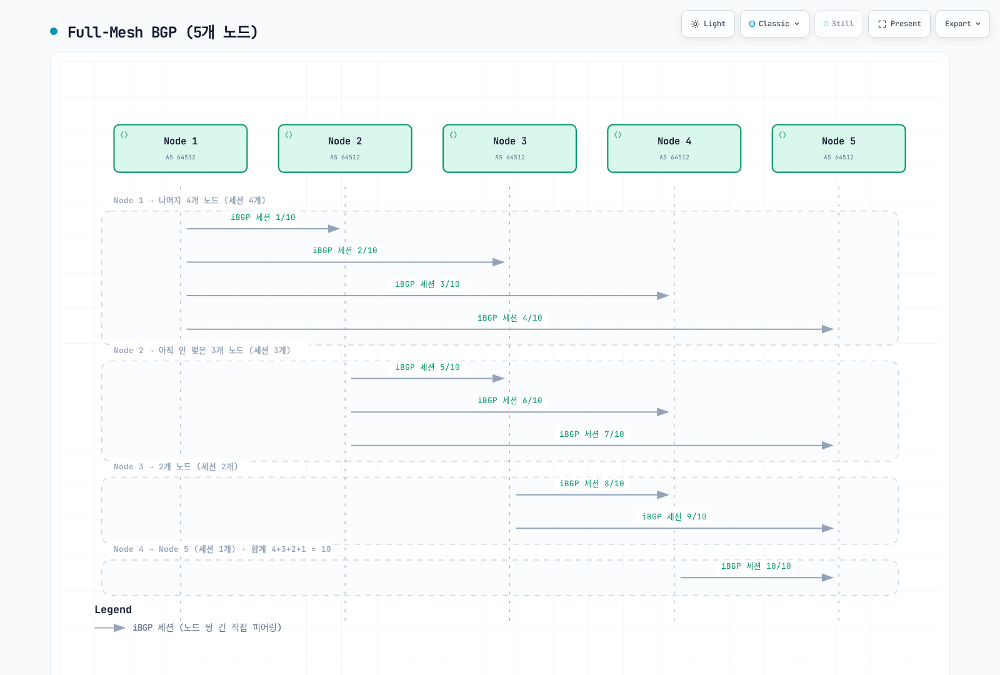
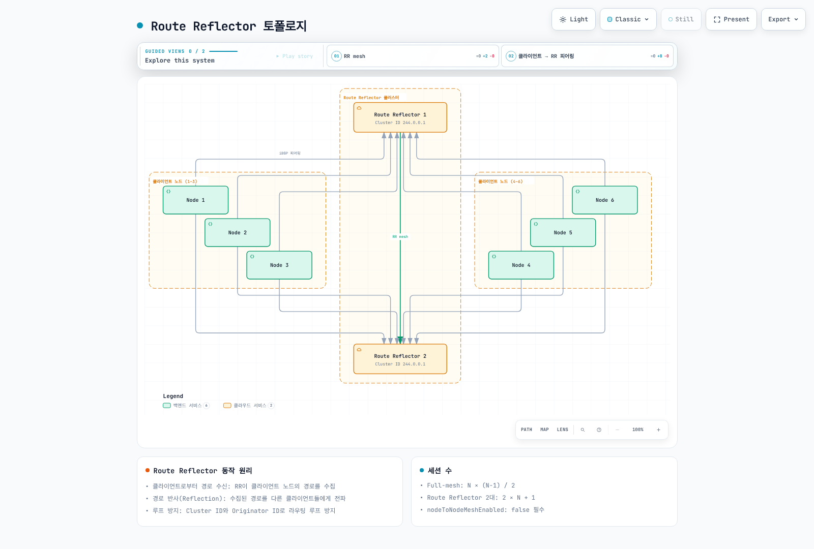
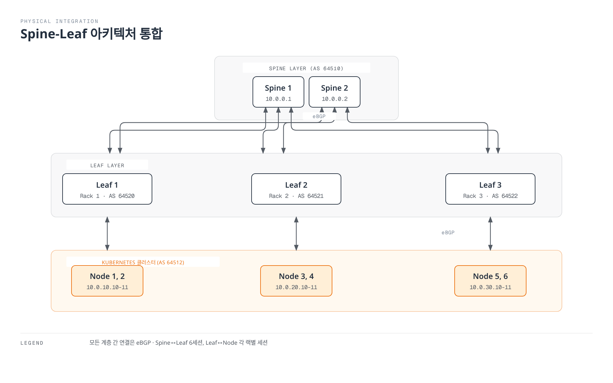
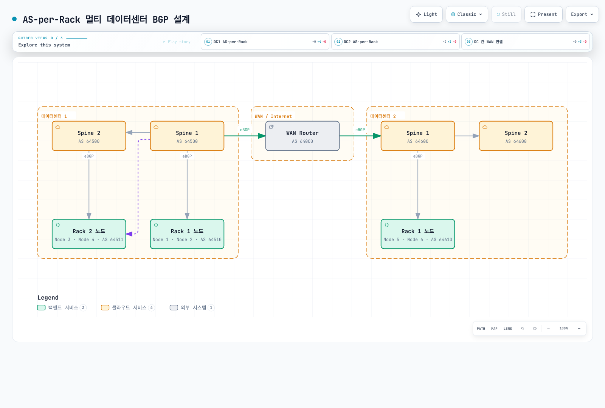

# Part 4: BGP 심화

> **검토 기준**: Calico 3.32.2; Calico 3.32의 Kubernetes 테스트 범위는 1.34–1.36입니다. **마지막 업데이트**: 2026년 9월 12일.
>
> 설정 예시는 BGP가 활성화되고 표준 Calico API 서버(`projectcalico.org/v3`)가 설치된 Linux 클러스터를 전제로 합니다. 각 예시는 서로 다른 토폴로지 대안이며 순서대로 모두 적용하는 매니페스트가 아닙니다. 기존 operator/GitOps 소유권을 유지하고 의도한 필드만 기존 설정에 병합하세요. API 설치 전제는 [설치 가이드](01-introduction.md), BGP 없는 라우팅 대안은 [네트워킹 모드](03-networking-modes.md)를 참고하세요. 주소·ASN·CIDR은 관리 권한이 있는 실제 네트워크에 맞춰야 합니다. 이번 검토에서는 실제 fabric이나 클러스터 장애 전환을 실행하지 않았습니다.

> 📎 BGP 자체가 생소하다면 [네트워크 기초 Part 1](../../basics/06-network-fundamentals-part1.md)의 BGP 절을 먼저 읽어보세요.

## 개요

BGP(Border Gateway Protocol)는 경로 도달성 정보를 교환하는 제어 평면 프로토콜입니다. Calico는 BGP로 워크로드 경로를 배포하고 기존 routed fabric에 통합할 수 있습니다. BGP는 비캡슐화 라우팅이나 IP-in-IP와 함께 사용할 수 있으며 성능 우위를 자체 보장하지 않습니다. Calico 3.32에는 BGP 없이 Felix가 클러스터 경로를 관리하는 방식도 있지만 외부 BGP 광고에는 BGP speaker가 필요합니다. Cilium도 BGP 제어 평면을 제공하므로 BGP를 Calico만의 기능으로 구분하지 않습니다.

이 문서에서는 BGP의 기본 개념부터 Calico에서의 고급 BGP 구성까지 심층적으로 다룹니다.

## BGP 기본 개념

### BGP란?

BGP(Border Gateway Protocol)는 인터넷의 핵심 라우팅 프로토콜로, 자율 시스템(Autonomous System, AS) 간에 라우팅 정보를 교환합니다. 현재 BGP-4가 표준이며, RFC 4271에 정의되어 있습니다.

### AS 번호 (Autonomous System Number)

AS 번호는 BGP에서 네트워크를 식별하는 고유 번호입니다.

| 구분 | ASN |
| --- | --- |
| 16비트 프라이빗 | 64512–65534 |
| 32비트 프라이빗 | 4200000000–4294967294 |
| 문서·예시용 | 64496–64511, 65536–65551 |
| AS_TRANS | 23456 |

그 밖의 값에도 예약·미할당 범위가 있으므로 [IANA 레지스트리](https://www.iana.org/assignments/as-numbers/as-numbers.xhtml)를 확인하세요. Calico의 기본 ASN은 64512입니다. 프라이빗 ASN은 IP 주소처럼 “라우팅 불가능”한 값이 아닙니다. 해당 ASN이 포함된 AS_PATH를 글로벌 인터넷에 유출하지 않도록 경계에서 처리해야 합니다.

**Calico에서의 AS 번호 사용 권장사항:**

```yaml
# 권장: 프라이빗 AS 범위 사용
apiVersion: projectcalico.org/v3
kind: BGPConfiguration
metadata:
  name: default
spec:
  asNumber: 64512  # 프라이빗 AS 범위 (64512-65534)
```

### iBGP vs eBGP

| 특성 | iBGP | eBGP |
| --- | --- | --- |
| AS 관계 | 동일 AS | 서로 다른 AS |
| AS_PATH | 일반적으로 유지 | 일반적으로 로컬 AS 추가 |
| 경로 전파 | iBGP로 배운 경로는 다른 iBGP 피어에 보통 재광고하지 않음. RR은 예외 | export 정책과 루프 방지 규칙에 따름 |
| Next hop | 대체로 유지하며 도달 가능해야 함 | 대체로 변경하며 `nextHopMode`와 토폴로지에 영향받음 |
| TTL·Administrative Distance | 구현·설정에 따라 다름 | 구현·설정에 따라 다름 |

로컬 생성 경로나 eBGP로 배운 경로는 iBGP 피어에 광고할 수 있습니다. Cisco의 Weight나 Administrative Distance 20/200을 Calico BIRD의 속성·기본값으로 적용하지 마세요. Calico가 생성하는 외부 피어 설정에는 BIRD multihop이 포함되므로 “eBGP TTL은 항상 1”이라고 판단할 수 없습니다.

### BGP 경로 선택 알고리즘

Calico 3.32.2는 BIRD fork `v0.3.3-211-g9111ec3c`를 사용합니다. 비교 가능한 유효 BGP 경로에서는 높은 LOCAL_PREF, 짧은 AS_PATH(비교 활성화 시), 낮은 ORIGIN, 적용 가능한 인접 AS 정책에 따른 낮은 MED, eBGP 우선, 낮은 IGP metric 순으로 비교합니다. 남은 동률에는 Router/ORIGINATOR_ID, CLUSTER_LIST 길이, 피어 IP를 사용하며 older-route 옵션이 동률 처리를 바꿀 수 있습니다. 경로 억제·next-hop 도달성·stale 상태·BIRD route preference도 판단에 관여합니다.

이는 Cisco Weight부터 시작하는 보편적인 11단계 알고리즘이 아닙니다. Calico 3.32는 자체 route priority를 LOCAL_PREF 및 커널 metric에 반영하므로 로컬 광고 경로의 LOCAL_PREF를 모두 upstream 기본값 100으로 가정하지 마세요.

## Calico BGP 아키텍처

### Full-Mesh 토폴로지

BGP와 기본 node mesh가 활성화되면 참여하는 일반 노드끼리 full-mesh를 구성합니다. Route Reflector로 지정된 노드는 자동 mesh에서 제외됩니다. BGP 비활성화 설치에는 이 설명이 적용되지 않습니다.



[🔍 인터랙티브 다이어그램 보기](https://www.atomai.click/kubernetes-docs/archmaps/ko-networking-calico-04-bgp-deep-dive-3.html)

> 화살표는 단방향 트래픽이 아닌 양방향 세션을 열거합니다. 해당 주소 패밀리의 노드 쌍당 세션 하나를 계산합니다.

**Full-Mesh BGP 세션 계산:**

세션 수 = N × (N-1) / 2

| 전체 노드 수 | 전체 mesh 세션 수 | 노드별 피어 수 |
| --- | --- | --- |
| 5 | 10 | 4 |
| 10 | 45 | 9 |
| 50 | 1,225 | 49 |
| 100 | 4,950 | 99 |
| 200 | 19,900 | 199 |

주소 패밀리별 노드 쌍당 세션 하나를 가정한 계산입니다. 실제 CPU·메모리와 수렴 시간은 경로 수, 변경 빈도, 정책, 하드웨어에 좌우됩니다. 50개 이상은 불가하다는 고정 제한이나 노드당 메모리 수치를 이 계산에서 도출할 수 없습니다.

### Route Reflector 토폴로지

Route Reflector(RR)는 iBGP의 full-mesh 요구사항을 해결합니다.



[🔍 인터랙티브 다이어그램 보기](https://www.atomai.click/kubernetes-docs/archmaps/ko-networking-calico-04-bgp-deep-dive-4.html)

> 그림은 클라이언트 6개와 RR 2개, 총 8노드의 13세션입니다. 그림의 2N+1은 N을 클라이언트 수로, full-mesh 공식은 전체 노드 수로 사용하므로 구분하세요. 자동 mesh는 명시적 대체 토폴로지 검증 후에 끕니다.

**Route Reflector 동작 원리:**

1. **클라이언트로부터 경로 수신**: RR은 클라이언트 노드의 경로를 수집
2. **경로 반사 (Reflection)**: 수집된 경로를 다른 클라이언트들에게 전파
3. **루프 방지**: Cluster ID와 Originator ID로 라우팅 루프 방지

**세션 수 계산과 설계:**

전체 노드를 `T`, RR 수를 `R`, 클라이언트 수를 `C=T−R`로 정의합니다. 모든 클라이언트가 모든 RR과 피어링하고 RR끼리 mesh를 맺으면:

```text
RR 세션 수 = C×R + R×(R−1)/2
T=100, R=2: 98×2+1 = 197 (동일한 전체 100노드 full-mesh: 4,950)
T=500, R=2: 498×2+1 = 997 (동일한 전체 500노드 full-mesh: 124,750)
```

100개가 클라이언트 수이고 RR 두 대가 추가되는 경우에만 201세션이며, 그때 전체 노드는 102개입니다. RR 수·계층은 고정 노드 수 표보다 경로 변경량, 장애 영역, 장애 후 용량 및 수렴 목표로 정하세요.

### Route Reflector 구성

전환에는 준비된 워크로드 없는 RR 노드를 사용합니다. Cluster ID를 설정하면 해당 노드는 즉시 자동 mesh에서 제외되므로 사용 중인 노드를 그대로 바꾸면 연결이 끊길 수 있습니다. 아래 Kubernetes datastore 방식은 기존 노드 IP와 다른 필드를 보존합니다.

#### 1. 준비된 RR 노드에 레이블·annotation 설정

```bash
kubectl label node rr-node-1 rr-node-2 route-reflector=true
kubectl annotate node rr-node-1 rr-node-2   projectcalico.org/RouteReflectorClusterID=244.0.0.1
```

공유 ID는 동일 클라이언트를 담당하는 중복 RR 그룹을 식별합니다. Kubernetes 클러스터 ID가 아니며 다른 RR 그룹·계층에는 별도 ID 설계가 필요합니다.

#### 2. 명시적 피어링 생성

```yaml
apiVersion: projectcalico.org/v3
kind: BGPPeer
metadata:
  name: peer-to-rr
spec:
  nodeSelector: "!has(route-reflector)"
  peerSelector: "has(route-reflector)"
---
apiVersion: projectcalico.org/v3
kind: BGPPeer
metadata:
  name: rr-mesh
spec:
  nodeSelector: "has(route-reflector)"
  peerSelector: "has(route-reflector)"
```

`peerSelector`는 Calico 노드를 선택하며 `reversePeering: Manual`을 지정하지 않으면 역방향 피어링도 자동 생성합니다. 임의의 외부 라우터를 검색하는 기능이 아닙니다.

#### 3. 기존 경로를 제거하기 전에 검증

두 RR과 클라이언트에서 Established 세션, 예상 워크로드 경로의 송수신, next-hop 도달성, 대표 노드 간 트래픽을 확인합니다. RR 하나가 중단되는 시나리오에서도 전달 경로와 용량이 유지되는지 검증하세요. 전환 중에는 일반 클라이언트 간 mesh를 유지할 수 있습니다.

#### 4. 검증 후 자동 mesh 비활성화

ASN·커뮤니티 등 다른 설정을 유지하며 관리 중인 `BGPConfiguration/default` 매니페스트를 갱신하세요. 이미 존재하는 리소스에 대한 동등한 merge patch는 다음과 같습니다.

```bash
kubectl patch bgpconfiguration.projectcalico.org default --type=merge   -p '{"spec":{"nodeToNodeMeshEnabled":false}}'
```

`default`가 없다면 동일한 사전 검증 후 기존 설정 소유자를 통해 생성합니다. 변경 후 경로와 트래픽을 다시 확인하고 원래 토폴로지로 돌아갈 계획을 유지하세요.

## BGPPeer 리소스 상세

### Global BGP Peer

`node`와 `nodeSelector`를 생략한 피어는 모든 노드에 적용됩니다. 아래는 옵션을 설명하기 위해 특정 노드로 제한한 예시입니다. 먼저 보안 절의 `tor-policy` BGPFilter와 참조하는 Secret을 만들고 직접 연결된 상대 피어에도 동일한 GTSM·인증 설정을 적용해야 합니다.

```yaml
apiVersion: projectcalico.org/v3
kind: BGPPeer
metadata:
  name: advanced-peer
spec:
  node: specific-node-name
  peerIP: 192.168.1.1
  asNumber: 65100
  password:
    secretKeyRef:
      name: bgp-secrets
      key: datacenter-password
  keepaliveTime: 30s
  maxRestartTime: 120s
  sourceAddress: UseNodeIP
  nextHopMode: Auto
  ttlSecurity: 1
  filters:
    - tor-policy
```

| 필드 | Calico 3.32.2에서의 의미 |
| --- | --- |
| `keepaliveTime` | 기간 문자열. 소문자 `a`를 사용하며 릴리스 CRD·renderer에서 확인한 필드입니다. |
| `maxRestartTime` | 피어에 알리는 Graceful Restart 시간. 연결 재시도 간격이 아닙니다. |
| `sourceAddress` | `UseNodeIP` 또는 `None`. 임의의 IP 문자열은 허용하지 않습니다. |
| `filters` | 기존 `BGPFilter` 이름 목록이며 규칙 객체를 직접 넣지 않습니다. |
| `ttlSecurity` | GTSM 경로의 edge 수. `1`은 직접 연결된 피어입니다. |
| `numAllowedLocalASNumbers` | 수신 AS_PATH에 허용할 로컬 ASN의 출현 수. 루프 방지를 완화하며 multihop 설정이 아닙니다. 명시적 설계가 없으면 생략합니다. |

현재 `BGPPeer` API에는 `holdTime`, `keepAliveTime`, `restartTime` 필드가 없습니다. `nextHopMode`는 `Auto`, `Self`, `Keep`을 지원하며 이전 `keepOriginalNextHop`은 deprecated이지만 제거되지는 않았습니다.

### Node-specific BGP Peer

특정 노드에만 적용되는 BGP 피어 설정입니다.

```yaml
apiVersion: projectcalico.org/v3
kind: BGPPeer
metadata:
  name: rack1-tor-peer
spec:
  # 특정 노드에만 적용
  nodeSelector: "rack == 'rack1'"

  # 피어의 IP 주소
  peerIP: 192.168.10.1

  # 피어의 AS 번호
  asNumber: 64520

  # keepAlive 시간
  keepaliveTime: 10s

  # MD5 인증
  password:
    secretKeyRef:
      name: bgp-secrets
      key: rack1-password
---
apiVersion: projectcalico.org/v3
kind: BGPPeer
metadata:
  name: rack2-tor-peer
spec:
  nodeSelector: "rack == 'rack2'"
  peerIP: 192.168.20.1
  asNumber: 64521
  keepaliveTime: 10s
  password:
    secretKeyRef:
      name: bgp-secrets
      key: rack2-password
```

### peerSelector를 사용한 동적 피어링

대상은 Calico Node 레이블입니다. `bgp-peer=external`이라는 레이블 이름도 실제 외부 라우터를 자동 검색하지 않습니다. 외부 라우터는 `peerIP`와 `asNumber`로 정의하세요.

```yaml
# 특정 레이블을 가진 노드들과 동적으로 피어링
apiVersion: projectcalico.org/v3
kind: BGPPeer
metadata:
  name: dynamic-peer
spec:
  # 소스 노드 선택 (어떤 노드에서 피어링할지)
  nodeSelector: "zone == 'zone-a'"

  # 대상 노드 선택 (누구와 피어링할지)
  peerSelector: "bgp-peer == 'external'"

  # AS 번호는 대상 노드의 spec.bgp.asNumber 사용
```

## BGPConfiguration 리소스 상세

### 기본 설정

```yaml
apiVersion: projectcalico.org/v3
kind: BGPConfiguration
metadata:
  name: default
spec:
  # 로컬 AS 번호 (전체 클러스터)
  asNumber: 64512

  # Node-to-Node mesh 활성화 여부
  nodeToNodeMeshEnabled: true

  # 로그 수준
  logSeverityScreen: Info
```

### Service IP 광고 설정

광고는 주소 할당, 클라우드 로드 밸런서 생성, 왕복 경로 확보와 별개입니다. 아래 CIDR은 예시이며 필요한 범위만 기존 설정에 병합하세요. 배열을 교체하여 기존 광고 범위를 잃지 않도록 확인해야 합니다.

```yaml
apiVersion: projectcalico.org/v3
kind: BGPConfiguration
metadata:
  name: default
spec:
  asNumber: 64512

  # Service External IP 광고
  serviceExternalIPs:
    - cidr: 203.0.113.0/24

  # Service LoadBalancer IP 광고
  serviceLoadBalancerIPs:
    - cidr: 198.51.100.0/24

  # Service ClusterIP 광고 (선택적, 일반적으로 비권장)
  serviceClusterIPs:
    - cidr: 10.96.0.0/12
```

### Service 주소 할당과 광고의 구분

기본 집계 동작에서 Cluster 모드 Service는 설정된 집계 경로를 사용하며 Local 모드 Service는 준비된 로컬 endpoint가 있는 노드의 host route(`/32` 또는 `/128`)를 사용합니다. 명시적 host-prefix 범위나 Calico 3.32의 `serviceLoadBalancerAggregation` 설정에 따라 광고 경로가 달라질 수 있으므로 Service 유형만으로 판단하지 말고 실제 RIB/export를 확인하세요. 정상 endpoint, Service 데이터 평면, upstream ECMP, 반환 경로도 함께 검증합니다. Pod IPAM 블록 광고와는 별개입니다.

Kubernetes가 ClusterIP를 할당합니다. `spec.externalIPs`는 운영자가 소유하고 라우팅하는 주소를 지정하는 기능이며 Kubernetes 1.36부터 deprecated입니다. 제거되었다는 뜻은 아닙니다. LoadBalancer 주소는 호환되는 컨트롤러가 할당해야 하며 클라우드 LB의 hostname을 BGP IP 접두사로 광고할 수 없습니다.

### Calico 자체 LoadBalancer IPAM

Calico 3.32의 `calico-kube-controllers`에는 LoadBalancer 컨트롤러가 있습니다. `allowedUses: [LoadBalancer]`인 IPPool이 필요하며 일반 Pod 풀에서 자동으로 주소를 가져오는 것은 아닙니다. 해당 컨트롤러가 활성화되어 있는지 확인하세요. 아래 독립적인 bare-metal 예시는 `calico-demo` namespace와 지정 포트에서 준비된 `app=my-app` endpoint를 전제로 합니다. 문서용 CIDR을 소유한 실제 라우팅 가능 범위로 바꾸고 기존 BGPConfiguration 필드를 유지하며 병합하세요.

```yaml
apiVersion: projectcalico.org/v3
kind: IPPool
metadata:
  name: service-lb-pool
spec:
  cidr: 198.51.100.0/24
  allowedUses:
    - LoadBalancer
  assignmentMode: Automatic
---
apiVersion: projectcalico.org/v3
kind: BGPConfiguration
metadata:
  name: default
spec:
  serviceLoadBalancerIPs:
    - cidr: 198.51.100.0/24
---
apiVersion: v1
kind: Service
metadata:
  name: my-lb-service
  namespace: calico-demo
  annotations:
    projectcalico.org/loadBalancerIPs: '["198.51.100.50"]'
spec:
  type: LoadBalancer
  loadBalancerClass: calico
  externalTrafficPolicy: Local
  selector:
    app: my-app
  ports:
    - port: 443
      targetPort: 8443
```

명시한 `projectcalico.org/loadBalancerIPs` 주소가 적합한 풀에 속하고 사용 가능해야 합니다. 요청 주소를 할당할 수 없어도 다른 주소로 자동 fallback하지 않습니다. 주소 할당과 BGP 광고는 별도 단계입니다. `assignIPs: RequestedServicesOnly`로 변경하면 기존 annotation 없는 Service의 주소가 해제될 수 있으므로 기존 컨트롤러·풀 소유권과 할당 상태를 먼저 확인하세요.

MetalLB를 할당자로 선택할 수도 있으며 현재 IP 요청 annotation은 `metallb.io/loadBalancerIPs`입니다. 같은 VIP에 대한 할당자·BGP speaker 소유권이 경쟁하지 않도록 설계하세요. AWS가 관리하는 로드 밸런서 IP를 로컬 소유 풀처럼 광고하지 않습니다.

### 특정 Service 광고 제한

`projectcalico.org/bgp-advertise`라는 Calico Service 광고 제외 annotation은 문서화된 기능이 아닙니다. `BGPConfiguration`의 범위와 피어별 BGPFilter를 사용합니다. 지원되는 `node.kubernetes.io/exclude-from-external-load-balancers=true` 레이블은 노드 전체 제외이며 Service별 opt-out이 아닙니다.

특정 `/32`만 거부해도 이를 포함하는 Service 집계 경로가 남으면 그 주소에 도달할 수 있습니다. 내부 전용 Service에는 광고 범위가 겹치지 않는지 확인하고 접근 정책도 별도로 적용하세요. 경로 필터는 권한 검사의 경계가 아닙니다.

### 접두사 광고 및 커뮤니티 태깅

현재 renderer의 `prefixAdvertisements`는 Pod 경로를 포함해 CIDR에 일치하는 기존 경로에 커뮤니티를 추가합니다. 지정한 접두사를 새로 생성하거나 모든 Pod 블록을 하나로 집계하지 않습니다. 이름만 정의한 커뮤니티는 적용되지 않으며, `internal-only`·`high-priority`라는 이름이나 임의의 숫자 자체가 차단·우선순위 정책을 만들지는 않습니다. 해당 태그를 처리하는 라우터 정책을 별도로 구성해야 합니다.

```yaml
apiVersion: projectcalico.org/v3
kind: BGPConfiguration
metadata:
  name: default
spec:
  asNumber: 64512

  # BGP 커뮤니티 정의
  communities:
    - name: internal-only
      value: "64512:100"
    - name: advertise-to-upstream
      value: "64512:200"
    - name: low-priority
      value: "64512:50"
    - name: high-priority
      value: "64512:500"

  # 접두사별 광고 설정
  prefixAdvertisements:
    # Pod CIDR - 내부용 정책으로 해석할 태그 (수신 라우터 정책 필요)
    - cidr: 10.244.0.0/16
      communities:
        - internal-only

    # 기존 LoadBalancer 경로에 태그 추가
    - cidr: 198.51.100.0/24
      communities:
        - advertise-to-upstream
        - high-priority

    # 기존 External IP 경로에 태그 추가 (낮은 우선순위는 별도 정책)
    - cidr: 203.0.113.0/24
      communities:
        - advertise-to-upstream
        - low-priority
```

### BGP 리스너 설정

```yaml
apiVersion: projectcalico.org/v3
kind: BGPConfiguration
metadata:
  name: default
spec:
  asNumber: 64512

  # BGP 리스닝 포트 (기본값: 179)
  listenPort: 179

  # 바인드 모드
  # - None: 특정 주소로 제한하지 않고 listen
  # - NodeIP: 노드 IP에 바인드 (변경 후 calico-node 재시작 필요)
  bindMode: NodeIP

  # 자동 node mesh 피어링의 MD5 인증 (IPv4 활성화 스위치가 아님)
  nodeMeshPassword:
    secretKeyRef:
      name: bgp-secrets
      key: mesh-password
```

## 물리 네트워크 통합

### ToR (Top of Rack) 스위치 연동

라우터의 ASN, 노드 피어, 주소 패밀리, 인증, import/export 정책, next-hop 도달성을 함께 설계합니다. 노드가 기존 underlay 기본 경로를 사용하는지 BGP로 기본 경로를 받는지 먼저 정하세요. `network`는 일치하는 기존 경로를 생성·광고하기 위한 설정이지 수신 허용 명령이 아닙니다. 광범위한 `redistribute connected`는 관계없는 네트워크를 유출할 수 있습니다.

| 플랫폼 | 적용 시 확인할 점 |
| --- | --- |
| Cisco IOS XE / NX-OS | 정확한 플랫폼·릴리스 구문을 사용합니다. IOS XE 동적 피어는 peer group과 `bgp listen range`를 사용하며 IOS와 NX-OS 명령 계층을 혼합하지 않습니다. 참조하는 route map·prefix list를 모두 정의해야 합니다. |
| Arista EOS | 배포한 릴리스의 peer group, 주소 패밀리, 비밀 설정, import/export 정책을 사용합니다. 이전의 검증되지 않은 EOS 명령 블록을 실행 가능한 절차로 사용하지 않습니다. |
| Junos | 단순 prefix-list는 정확한 접두사 매칭입니다. more-specific 경로가 필요하면 route-filter의 매칭 형식을 명시합니다. |

다음은 ToR의 해당 노드 방향 BGP 그룹에 import 정책으로 연결할 **Junos 정책 조각**입니다. 계획된 Pod `/26`–`/32`, LoadBalancer `/32` 경로를 허용하고 나머지를 거부합니다.

```text
policy-options {
    policy-statement K8S-IMPORT {
        term approved {
            from {
                route-filter 10.244.0.0/16 prefix-length-range /26-/32;
                route-filter 198.51.100.0/24 prefix-length-range /32-/32;
            }
            then accept;
        }
        term reject-rest {
            then reject;
        }
    }
}
```

Pod 최소 길이는 IPAM 블록이 `/26`이라는 가정이며 실제 풀·경로 목록에 맞게 조정해야 합니다. borrowed 주소나 일부 이동 경로에는 `/32`가 필요하므로 `le 26`을 보편적 필터로 사용하지 마세요. 이 조각만으로 피어나 기본 경로를 만들지는 않습니다. 실제 라우터 실행·장애 전환은 검증하지 않았으므로 해당 릴리스에서 export 정책, 경로 수 제한, next-hop 처리를 완성하고 검증해야 합니다.

### Spine-Leaf 아키텍처 통합



[🔍 인터랙티브 다이어그램 보기](https://www.atomai.click/kubernetes-docs/archmaps/ko-networking-calico-04-bgp-deep-dive-5.html)

> 묶인 상자는 여러 세션을 요약합니다. 공통 노드 ASN에는 명시적인 AS-loop·override 설계가 필요하며 spine 중복만으로 leaf나 노드 uplink까지 중복되지 않습니다. 실제 Secret·주소·ASN·반환 경로도 별도로 준비해야 합니다.

#### Calico 설정 (Spine-Leaf 통합)

노드 레이블, next-hop·반환 경로, 양방향 정책과 각 Secret 키를 먼저 준비하세요. 여러 랙의 노드에 같은 ASN을 재사용하면 수신 AS_PATH에 자신의 ASN이 포함되어 경로가 거부될 수 있습니다. 고유 ASN이나 검증한 fabric AS-override·루프 정책을 설계해야 하며 `numAllowedLocalASNumbers`를 무조건 올려 우회하지 않습니다.

```yaml
# 랙별 BGP 피어 설정
apiVersion: projectcalico.org/v3
kind: BGPPeer
metadata:
  name: rack1-leaf-peer
spec:
  nodeSelector: "rack == 'rack1'"
  peerIP: 10.0.10.1
  asNumber: 64520
  keepaliveTime: 10s
  password:
    secretKeyRef:
      name: bgp-secrets
      key: rack1-leaf-password
---
apiVersion: projectcalico.org/v3
kind: BGPPeer
metadata:
  name: rack2-leaf-peer
spec:
  nodeSelector: "rack == 'rack2'"
  peerIP: 10.0.20.1
  asNumber: 64521
  keepaliveTime: 10s
  password:
    secretKeyRef:
      name: bgp-secrets
      key: rack2-leaf-password
---
apiVersion: projectcalico.org/v3
kind: BGPPeer
metadata:
  name: rack3-leaf-peer
spec:
  nodeSelector: "rack == 'rack3'"
  peerIP: 10.0.30.1
  asNumber: 64522
  keepaliveTime: 10s
  password:
    secretKeyRef:
      name: bgp-secrets
      key: rack3-leaf-password
```

## BGP 보안

### MD5 인증

Calico는 BGP에 TCP MD5 signature를 지원합니다. 공유 비밀을 가진 피어의 트래픽을 인증하지만 암호화나 인증된 피어가 보낸 경로의 정당성을 보장하지 않습니다.

`calico-node`가 실행되는 namespace에 비밀 관리 절차로 `bgp-secrets`를 준비하세요. 여기의 operator 설치는 `calico-system`이며 manifest 설치는 `kube-system`일 수 있습니다. 아래 예시는 `datacenter-password` 키가 필요합니다. 다른 예시가 참조하는 `mesh-password` 및 랙·leaf별 키도 별도로 준비하고 상대 라우터에 일치하는 비밀을 설정해야 합니다. Calico 서비스 계정의 Secret 읽기 권한도 확인하세요.

```yaml
apiVersion: projectcalico.org/v3
kind: BGPPeer
metadata:
  name: secure-peer
spec:
  peerIP: 192.168.1.1
  asNumber: 65100
  password:
    secretKeyRef:
      name: bgp-secrets
      key: datacenter-password
```

### 접두사 필터링

규칙은 순서대로 평가하고 첫 일치 시 즉시 동작합니다. 어떤 규칙에도 일치하지 않으면 기본 **Accept**이므로 허용 목록에는 무조건 거부하는 마지막 규칙이 필요합니다. `Equal 0.0.0.0/0`은 기본 경로만, `In 0.0.0.0/0`은 모든 IPv4 경로를 매칭합니다. `NotIn 0.0.0.0/0`에는 어떤 IPv4 경로도 일치하지 않습니다.

다음 외부 피어 예시는 기본 경로와 계획된 underlay `10.0.0.0/16`만 수신합니다. 송신에는 실제 Pod `/26`–`/32`, LoadBalancer `/32` 경로만 허용합니다. 실제 경로 목록에 맞게 CIDR·길이를 조정하고 RR/클라이언트 세션에 이 외부 정책을 무차별 적용하지 마세요.

```yaml
apiVersion: projectcalico.org/v3
kind: BGPFilter
metadata:
  name: tor-policy
spec:
  importV4:
    - action: Accept
      matchOperator: Equal
      cidr: 0.0.0.0/0
    - action: Accept
      matchOperator: In
      cidr: 10.0.0.0/16
    - action: Reject
  exportV4:
    - action: Accept
      matchOperator: In
      cidr: 10.244.0.0/16
      prefixLength:
        min: 26
        max: 32
      operations:
        - addCommunity:
            value: "64512:100"
    - action: Accept
      matchOperator: In
      cidr: 198.51.100.0/24
      prefixLength:
        min: 32
        max: 32
    - action: Reject
---
apiVersion: projectcalico.org/v3
kind: BGPPeer
metadata:
  name: filtered-peer
spec:
  peerIP: 192.168.1.1
  asNumber: 65100
  filters:
    - tor-policy
```

`prefixLength`는 범위 문자열이 아니라 `min`·`max` 객체입니다. Calico 3.32에는 허용 경로의 `addCommunity` 같은 operation도 있습니다. 명시적 export Accept는 기본 Calico export·집계·`prefixAdvertisements` 처리 전에 반환하므로 RIB에 있는 more-specific 경로도 광고할 수 있습니다. 따라서 예시는 규칙 안에서 Pod 태그를 추가합니다. fabric 적용 전에 `show route export`로 실제 광고를 확인하세요. BGPFilter가 없는 경로를 생성하지는 않습니다.

### GTSM (TTL Security)

GTSM은 경로 길이에 비해 TTL이 작은 패킷을 거부하여 off-path 스푸핑 노출을 줄입니다. 피어 인증이나 동일 링크 공격 방어를 대체하지 않습니다. 양쪽 피어를 일치하게 설정해야 합니다.

```yaml
apiVersion: projectcalico.org/v3
kind: BGPPeer
metadata:
  name: gtsm-enabled-peer
spec:
  peerIP: 192.168.1.1
  asNumber: 65100
  ttlSecurity: 1
```

해당 BIRD 구현은 GTSM 송신 TTL 255, 최소 수신 TTL `256−hops`를 사용합니다. 따라서 `ttlSecurity: 1`은 254가 아닌 255를 요구하고, 두 edge는 최소 254입니다. 활성화 전에 실제 경로 길이를 확인하세요. 이 값은 AS_PATH에 허용할 로컬 ASN 출현 수와 무관합니다.

## 성능 튜닝

### BGP 타이머 설정

```yaml
apiVersion: projectcalico.org/v3
kind: BGPPeer
metadata:
  name: tuned-peer
spec:
  peerIP: 192.168.1.1
  asNumber: 65100
  keepaliveTime: 20s
  maxRestartTime: 120s
```

해당 BIRD fork의 기본 제안 Hold Time은 240초이며 상대가 제안한 값과 작은 쪽으로 협상합니다. keepalive 간격을 지정하지 않으면 협상된 Hold Time의 1/3을 사용합니다. 명시적 `keepaliveTime`은 전송 간격만 바꾸며 Hold Time을 자동으로 그 3배로 바꾸지 않습니다. 실제 협상 타이머를 확인하고 그 안에 맞는 간격을 선택하세요.

`BGPPeer`에는 `holdTime` 필드가 없습니다. 기존 60/180·10/30·3/9 표는 검증된 Calico 기본값이나 장애 감지 보장이 아닙니다. BIRD 자체의 BFD 지원이 Calico의 BFD CRD·설정 필드 지원을 뜻하지 않으므로 임의의 필드를 추가하지 말고 별도 통합의 지원·실행 조건을 확인해야 합니다.

### Graceful Restart

Calico BIRD 템플릿은 Graceful Restart를 활성화합니다. 피어와 기능을 협상하고 실제 전달 경로가 계속 동작해야 효과가 있으며 stale 경로 유지로 blackhole이 생길 수도 있습니다. 무중단 업데이트를 보장하지 않습니다.

명시적 피어에는 `BGPPeer.maxRestartTime`으로 광고할 재시작 시간을 지정합니다. 다음 필드는 모든 명시적 피어가 아닌 **자동 node mesh** 세션에 적용합니다.

```yaml
apiVersion: projectcalico.org/v3
kind: BGPConfiguration
metadata:
  name: default
spec:
  nodeMeshMaxRestartTime: 120s
```

정수가 아닌 기간 문자열이며 활성화 스위치도 아닙니다. 기존 설정 소유자를 통해 변경하고 실제 피어 capability와 복구 동작을 검증하세요.

### 경로 집계

Calico는 일반적으로 로컬 IPAM 주소를 할당 블록으로 집계하며 현재 BIRD 집계 템플릿은 우선순위가 높은 more-specific 경로도 허용합니다. borrowed 주소·이동 경로에는 host route가 필요할 수 있습니다. `prefixAdvertisements`는 기존 경로에 태그를 붙일 뿐 `/26`들을 새 `/16` 경로로 만들지 않습니다.

큰 블록은 블록 경로 수와 주소 활용도·할당 세분성의 교환 관계입니다. 기존 IPPool의 `blockSize`는 변경할 수 없으므로 새 풀이 필요하면 [네트워킹 모드](03-networking-modes.md)의 마이그레이션 절차를 따르세요. 기존 기본 풀에 새 blockSize를 덮어쓰거나 포함한 모든 목적지에 도달하지 못하는 라우터에서 집계 경로를 광고하면 안 됩니다.

## BGP 디버깅

### 올바른 노드의 BIRD 조회

실제 노드 이름과 설치 namespace를 선택하세요. 다음 읽기 전용 명령은 운영자 셸에서 IPv4 BIRD control socket에 접속합니다. IPv6에는 `birdcl6`와 `/var/run/calico/bird6.ctl`을 사용합니다. BGP 비활성화 설치에는 데몬이 없을 수 있습니다.

```bash
CALICO_NAMESPACE=calico-system
CALICO_NODE=worker-1
CALICO_POD="$(kubectl -n "$CALICO_NAMESPACE" get pods -l k8s-app=calico-node \
  --field-selector "spec.nodeName=$CALICO_NODE" -o jsonpath='{.items[0].metadata.name}')"
test -n "$CALICO_POD"
kubectl -n "$CALICO_NAMESPACE" exec "$CALICO_POD" -c calico-node -- \
  birdcl -s /var/run/calico/bird.ctl show protocols all
kubectl -n "$CALICO_NAMESPACE" exec "$CALICO_POD" -c calico-node -- \
  birdcl -s /var/run/calico/bird.ctl show route
```

```bash
CALICO_BGP_PROTOCOL=Global_192_168_1_1
kubectl -n "$CALICO_NAMESPACE" exec "$CALICO_POD" -c calico-node -- \
  birdcl -s /var/run/calico/bird.ctl show protocols all "$CALICO_BGP_PROTOCOL"
kubectl -n "$CALICO_NAMESPACE" exec "$CALICO_POD" -c calico-node -- \
  birdcl -s /var/run/calico/bird.ctl show route export "$CALICO_BGP_PROTOCOL"
kubectl -n "$CALICO_NAMESPACE" exec "$CALICO_POD" -c calico-node -- \
  birdcl -s /var/run/calico/bird.ctl show route protocol "$CALICO_BGP_PROTOCOL"
kubectl -n "$CALICO_NAMESPACE" exec "$CALICO_POD" -c calico-node -- \
  birdcl -s /var/run/calico/bird.ctl 'show route where net ~ [10.244.0.0/16+]'
```

```bash
kubectl get bgpconfiguration.projectcalico.org default -o yaml
kubectl get bgppeers.projectcalico.org -o wide
kubectl get bgpfilters.projectcalico.org -o yaml
kubectl -n "$CALICO_NAMESPACE" logs "$CALICO_POD" -c calico-node --tail=200
```

`CALICO_BGP_PROTOCOL`을 첫 `show protocols` 결과의 실제 이름으로 바꾸세요. `Mesh_…`, `Global_…`, `Node_…` 등이 사용되며 모두 `bgp*`로 시작하지 않습니다. 경로 표현식은 로컬 셸이 확장하지 않도록 따옴표로 감싸고 `show protocols all`에는 BGP 이외 프로토콜도 나온다는 점을 구분하세요.

컨테이너 로그는 시작·confd 오류 확인에 도움이 되지만 특정 stdout 문자열이 없다는 사실이 BIRD 정상 동작을 증명하지 않습니다. 설치의 BIRD 로그 위치와 실제 세션을 확인하세요. `calicoctl node status`는 노드 환경이 필요한 로컬 진단이며 워크스테이션 kubeconfig만으로 원격 노드 상태를 보여주는 명령이 아닙니다. `ip route`도 대상 노드·네트워크 namespace에서 확인해야 합니다.

| 증상 | 확인 항목 |
| --- | --- |
| Active 상태 유지 | 피어 IP·ASN, TCP listener·방화벽, 소스 주소, MD5·GTSM 일치, 전달망 도달성 |
| Established지만 필요한 경로 없음 | import/export 필터, RR 역할, endpoint·IPAM 상태, next hop, AS-loop 거부 |
| flapping·reset | 전달망 손실, MTU, 인증, 협상 타이머, 컨트롤러 설정 변경 |
| 경로는 있지만 통신 실패 | 실제 커널/FIB, 반환 경로, Service 전달, 접근 정책, covering aggregate |

BGP Established만으로 워크로드 연결을 검증할 수는 없습니다.

## 멀티 데이터센터 BGP 설계

### AS-per-Rack 설계 패턴

각 랙에 별도의 AS 번호를 할당하여 확장성을 높입니다.



[🔍 인터랙티브 다이어그램 보기](https://www.atomai.click/kubernetes-docs/archmaps/ko-networking-calico-04-bgp-deep-dive-6.html)

> 그림의 64510·64511·64500은 문서용 ASN이며 64000은 프라이빗 범위가 아닙니다. 배치 시 소유 ASN 또는 아래 설정의 프라이빗 ASN 계획을 사용하세요. 도식만으로 모든 WAN 세션·반환 경로가 구성되지는 않습니다.

#### AS-per-Rack Calico 설정

다음은 Kubernetes datastore의 기존 노드에 대한 설정 조각입니다. 바뀔 ASN과 상대 라우터 설정을 함께 준비하고 AS 변경으로 인한 세션 재설정을 계획하세요. 임의 IP가 담긴 부분 Node 객체로 기존 노드 전체를 대체하지 않습니다.

```bash
kubectl label node node-1 node-2 rack=dc1-rack1 datacenter=dc1
kubectl label node node-3 rack=dc1-rack2 datacenter=dc1
kubectl label node node-5 rack=dc2-rack1 datacenter=dc2
kubectl annotate node node-1 node-2 projectcalico.org/ASNumber=64512
kubectl annotate node node-3 projectcalico.org/ASNumber=64513
kubectl annotate node node-5 projectcalico.org/ASNumber=64610
```

```yaml
apiVersion: projectcalico.org/v3
kind: BGPPeer
metadata:
  name: dc1-rack1-ibgp
spec:
  nodeSelector: "rack == 'dc1-rack1'"
  peerSelector: "rack == 'dc1-rack1'"
---
apiVersion: projectcalico.org/v3
kind: BGPPeer
metadata:
  name: dc1-rack1-tor
spec:
  nodeSelector: "rack == 'dc1-rack1'"
  peerIP: 10.1.10.1
  asNumber: 65001
```

다른 랙·DC의 피어와 반환 경로는 각각 별도로 완성해야 합니다. 기존 자동 mesh를 제거하기 전에 대체 fabric 세션·경로·대표 트래픽을 먼저 검증하세요. 위 조각만으로 모든 랙의 연결이 완성되지는 않습니다.

### eBGP Between Racks 패턴

원격 랙의 ToR에 eBGP 피어링하는 대안입니다. 기존 node mesh나 로컬 ToR 설계와 자동으로 호환되는 것은 아닙니다. 해당 Calico renderer는 외부 피어에 multihop을 생성하지만 실제 왕복 경로와 상대 설정은 별도 전제입니다. `numAllowedLocalASNumbers`를 TTL 설정으로 사용하면 루프 방지만 약화됩니다.

```yaml
# Rack1 노드가 Rack2의 ToR과 피어링
apiVersion: projectcalico.org/v3
kind: BGPPeer
metadata:
  name: rack1-to-rack2
spec:
  nodeSelector: "rack == 'rack1'"
  peerIP: 10.0.20.1   # Rack2 ToR IP
  asNumber: 64521     # Rack2 AS
  sourceAddress: UseNodeIP
  # 상대 라우터의 multihop·반환 경로도 별도 구성
```

## 모범 사례 요약

### BGP 설계 체크리스트

* [ ] **ASN·CIDR**: 소유 범위와 프라이빗 ASN, 경계 AS_PATH 처리 및 반환 경로 문서화
* [ ] **토폴로지**: 경로 수·변경 빈도·수렴 목표를 측정해 mesh/RR/계층 선택
* [ ] **중복성**: RR을 장애 영역에 분산하고 한쪽 장애 후 용량·전달망 검증
* [ ] **보안**: MD5·GTSM 전제 확인, 명시적 import/export 허용 목록 적용
* [ ] **타이머**: 실제 협상된 Hold·Keepalive 확인
* [ ] **Graceful Restart**: capability·전달 경로·stale 경로 위험 검증
* [ ] **모니터링**: 세션 상태뿐 아니라 광고·수신 경로와 실제 트래픽 확인
* [ ] **전환**: 대체 경로 검증 후 기존 mesh 제거, 원복 계획 유지

***

## 참고 자료

* [Calico BGP 공식 문서](https://docs.tigera.io/calico/latest/networking/configuring/bgp)
* [BGP Route Reflector 설정](https://docs.tigera.io/calico/latest/networking/configuring/bgp)
* [BIRD Routing Daemon](https://bird.network.cz/)
* [RFC 4271 - BGP-4](https://www.rfc-editor.org/rfc/rfc4271)
* [RFC 4456 - BGP Route Reflection](https://www.rfc-editor.org/rfc/rfc4456)

* [Calico BGPPeer API](https://docs.tigera.io/calico/latest/reference/resources/bgppeer)
* [Calico BGPConfiguration API](https://docs.tigera.io/calico/latest/reference/resources/bgpconfig)
* [Calico BGPFilter API](https://docs.tigera.io/calico/latest/reference/resources/bgpfilter)
* [Service IP advertisement](https://docs.tigera.io/calico/latest/networking/configuring/advertise-service-ips)
* [Calico LoadBalancer IPAM](https://docs.tigera.io/calico/latest/networking/ipam/service-loadbalancer)
* [Calico 3.32.2 BIRD configuration processing](https://github.com/projectcalico/calico/blob/v3.32.2/confd/pkg/backends/calico/bgp_processor.go)
* [Calico 3.32.2 BIRD template](https://github.com/projectcalico/calico/blob/v3.32.2/confd/etc/calico/confd/templates/bird.cfg.template)
* [Pinned BIRD best-path implementation](https://github.com/projectcalico/bird/blob/9111ec3c3ff3e769727a5940d3d829a0be8b5201/proto/bgp/attrs.c)
* [Pinned BIRD timers and GTSM](https://github.com/projectcalico/bird/blob/9111ec3c3ff3e769727a5940d3d829a0be8b5201/proto/bgp/bgp.c)
* [Cisco IOS XE dynamic neighbors](https://www.cisco.com/c/en/us/td/docs/routers/ios/config/17-x/ip-routing/b-ip-routing/m_irg-bgp-dynamic-neighbors.html)
* [Junos route-filter match types](https://www.juniper.net/documentation/en_US/junos/topics/usage-guidelines/policy-configuring-route-lists-for-use-in-routing-policy-match-conditions.html)
* [Kubernetes Service API and externalIPs deprecation](https://kubernetes.io/docs/concepts/services-networking/service/)
* [Calico 3.32.2 Service route generation](https://github.com/projectcalico/calico/blob/v3.32.2/confd/pkg/backends/calico/routes.go)

[이전: Part 3 - 네트워킹 모드](03-networking-modes.md) | [다음: Part 5 - Network Policy 심화](05-network-policy.md) | [메인 페이지로 돌아가기](./README.md)
