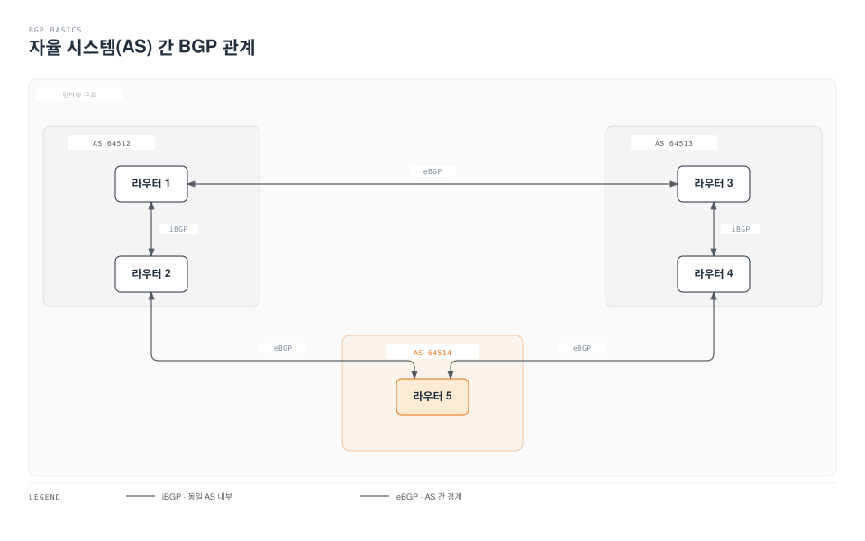
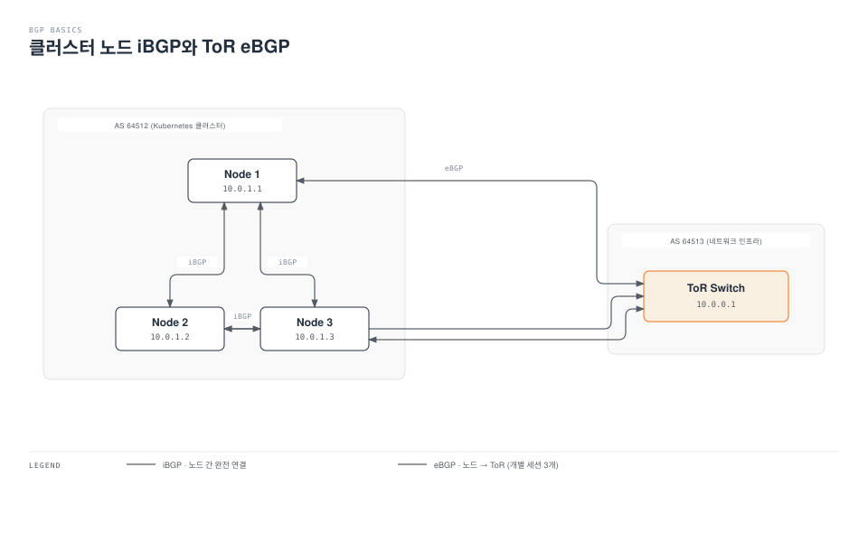
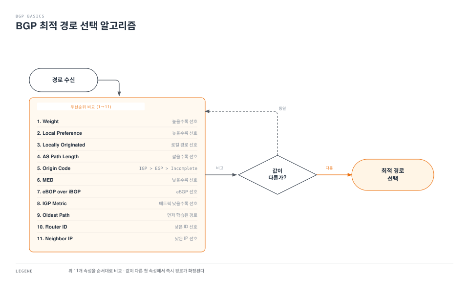
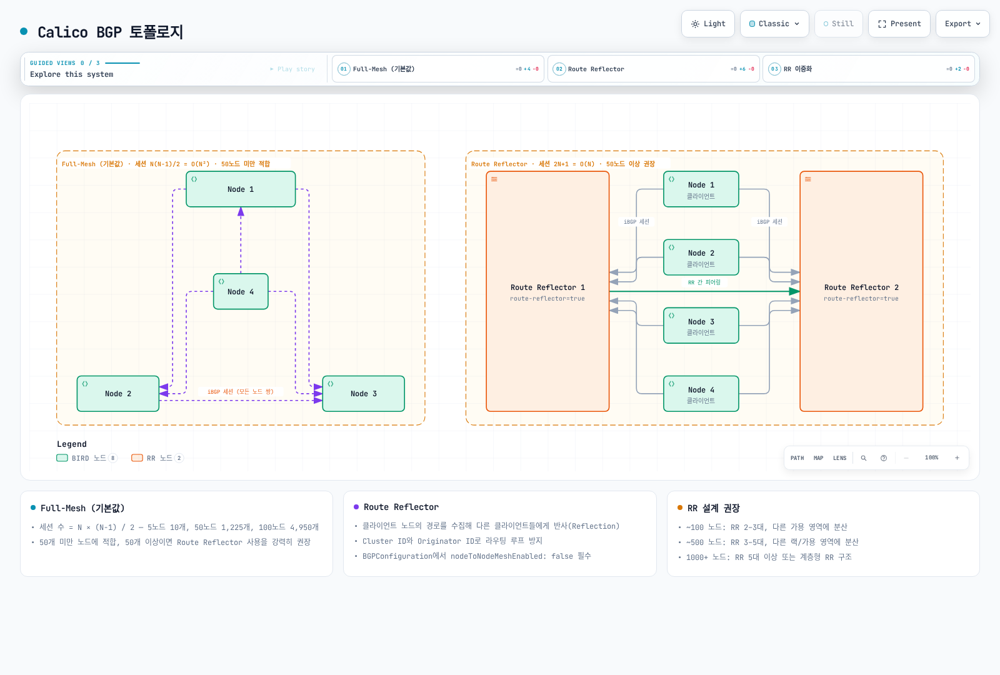
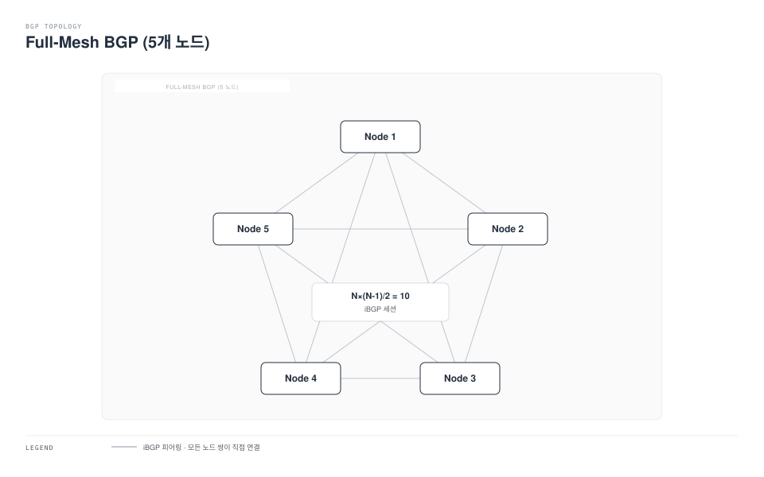
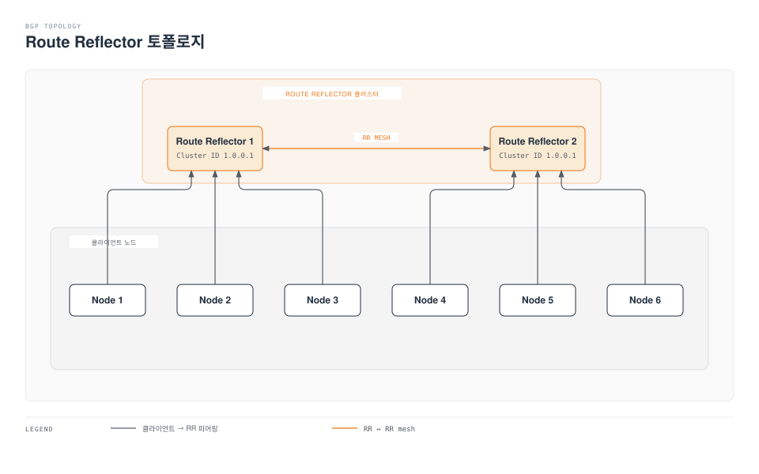
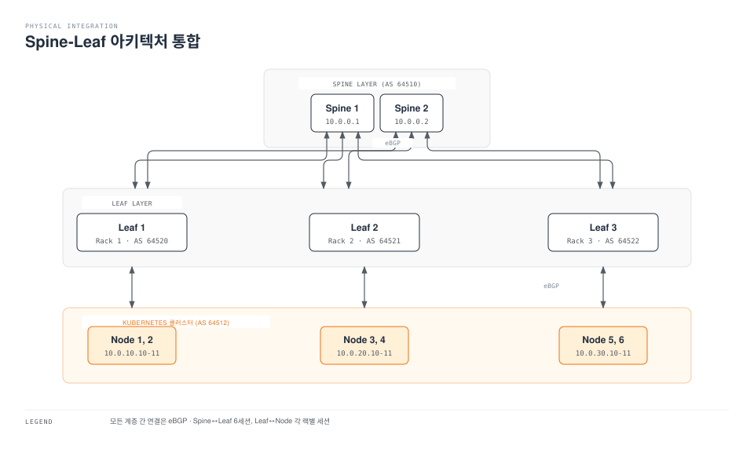
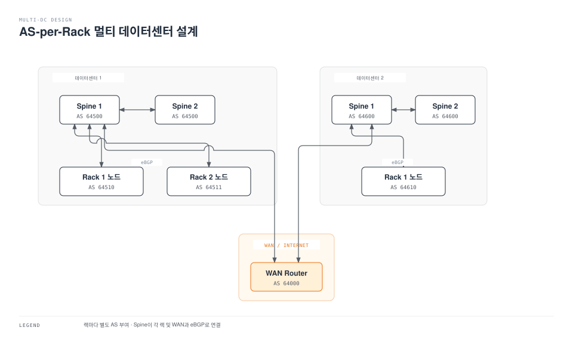

# Part 4: BGP 심화

> **지원 버전**: Calico v3.29+ / Kubernetes 1.28+ **마지막 업데이트**: 2026년 2월 23일

> 📎 BGP 자체가 생소하다면 [네트워크 기초 Part 1](../../basics/06-network-fundamentals-part1.md)의 BGP 절을 먼저 읽어보세요.

## 개요

BGP(Border Gateway Protocol)는 Calico의 핵심 차별화 요소입니다. Cilium과 같은 다른 CNI가 주로 eBPF와 오버레이 네트워크에 집중하는 반면, Calico는 BGP를 통한 네이티브 라우팅을 완벽하게 지원합니다. 이를 통해 온프레미스 데이터센터, 하이브리드 클라우드, 물리적 네트워크 인프라와의 깊은 통합이 가능합니다.

이 문서에서는 BGP의 기본 개념부터 Calico에서의 고급 BGP 구성까지 심층적으로 다룹니다.

## BGP 기본 개념

### BGP란?

BGP(Border Gateway Protocol)는 인터넷의 핵심 라우팅 프로토콜로, 자율 시스템(Autonomous System, AS) 간에 라우팅 정보를 교환합니다. 현재 BGP-4가 표준이며, RFC 4271에 정의되어 있습니다.



### AS 번호 (Autonomous System Number)

AS 번호는 BGP에서 네트워크를 식별하는 고유 번호입니다.

| 범위                    | 용도           | 설명                       |
| --------------------- | ------------ | ------------------------ |
| 1-64495               | 공용 AS        | IANA에서 할당, 인터넷 라우팅용      |
| 64496-64511           | 문서/예시용       | RFC 5398에 예약             |
| **64512-65534**       | **프라이빗 AS**  | **내부 네트워크용 (Calico 권장)** |
| 65535                 | 예약됨          | 사용 불가                    |
| 65536-4199999999      | 4바이트 공용 AS   | 확장된 AS 번호 공간             |
| 4200000000-4294967294 | 4바이트 프라이빗 AS | 대규모 내부 네트워크용             |

**Calico에서의 AS 번호 사용 권장사항:**

```yaml
# 권장: 프라이빗 AS 범위 사용
apiVersion: projectcalico.org/v3
kind: BGPConfiguration
metadata:
  name: default
spec:
  asNumber: 64512  # 프라이빗 AS 범위 (64512-65534)
```

### iBGP vs eBGP

BGP는 두 가지 모드로 운영됩니다:

| 특성                      | iBGP (Internal BGP) | eBGP (External BGP) |
| ----------------------- | ------------------- | ------------------- |
| AS 관계                   | 동일 AS 내             | 서로 다른 AS 간          |
| TTL 기본값                 | 255                 | 1 (멀티홉 필요)          |
| 경로 전파                   | Full-mesh 또는 RR 필요  | 자동 전파               |
| Next-hop                | 변경하지 않음             | 자신으로 변경             |
| Administrative Distance | 200                 | 20                  |
| 사용 사례                   | 클러스터 내부             | 외부 라우터 연결           |



### BGP 경로 선택 알고리즘

BGP는 여러 경로 중 최적의 경로를 선택하기 위해 다음 순서로 속성을 비교합니다:



**주요 경로 속성 상세:**

| 순서 | 속성                 | 범위           | 설명                              |
| -- | ------------------ | ------------ | ------------------------------- |
| 1  | Weight             | 0-65535      | Cisco 전용, 로컬 라우터만 적용            |
| 2  | Local Preference   | 0-4294967295 | AS 내 경로 선호도 (기본값: 100)          |
| 3  | Locally Originated | -            | 로컬에서 생성된 경로 우선                  |
| 4  | AS Path Length     | -            | 경유하는 AS 수                       |
| 5  | Origin             | i/e/?        | IGP(i) > EGP(e) > Incomplete(?) |
| 6  | MED                | 0-4294967295 | Multi-Exit Discriminator        |
| 7  | Path Type          | eBGP/iBGP    | 외부 경로 우선                        |
| 8  | IGP Metric         | -            | 내부 라우팅 메트릭                      |

## Calico BGP 아키텍처



[🔍 인터랙티브 다이어그램 보기](https://www.atomai.click/kubernetes-docs/archmaps/ko-networking-calico-04-bgp-deep-dive-9.html)

### Full-Mesh 토폴로지

기본적으로 Calico는 모든 노드 간에 iBGP full-mesh를 구성합니다.



**Full-Mesh BGP 세션 계산:**

세션 수 = N × (N-1) / 2

| 노드 수 | BGP 세션 수 | 확장성 평가 |
| ---- | -------- | ------ |
| 5    | 10       | 적합     |
| 10   | 45       | 적합     |
| 20   | 190      | 주의 필요  |
| 50   | 1,225    | 비권장    |
| 100  | 4,950    | 불가     |
| 200  | 19,900   | 불가     |

**50개 이상의 노드에서는 Route Reflector 사용을 강력히 권장합니다.**

### Route Reflector 토폴로지

Route Reflector(RR)는 iBGP의 full-mesh 요구사항을 해결합니다.



**Route Reflector 동작 원리:**

1. **클라이언트로부터 경로 수신**: RR은 클라이언트 노드의 경로를 수집
2. **경로 반사 (Reflection)**: 수집된 경로를 다른 클라이언트들에게 전파
3. **루프 방지**: Cluster ID와 Originator ID로 라우팅 루프 방지

**Route Reflector 설계 권장사항:**

| 클러스터 크기    | RR 수      | 배치 전략          |
| ---------- | --------- | -------------- |
| \~100 노드   | 2-3       | 다른 가용 영역에 분산   |
| \~500 노드   | 3-5       | 다른 랙/가용 영역에 분산 |
| \~1000+ 노드 | 5+ 또는 계층형 | 계층형 RR 구조 고려   |

### Route Reflector 구성

#### 1. 노드 레이블 지정

```bash
# Route Reflector 노드 레이블 지정
kubectl label node rr-node-1 route-reflector=true
kubectl label node rr-node-2 route-reflector=true
kubectl label node rr-node-3 route-reflector=true
```

#### 2. BGPConfiguration 설정

```yaml
# Full-mesh 비활성화
apiVersion: projectcalico.org/v3
kind: BGPConfiguration
metadata:
  name: default
spec:
  # 로컬 AS 번호
  asNumber: 64512

  # Node-to-Node mesh 비활성화 (Route Reflector 사용 시 필수)
  nodeToNodeMeshEnabled: false

  # 로그 레벨
  logSeverityScreen: Info
```

#### 3. Route Reflector 노드 설정

```yaml
# Route Reflector 노드에 Cluster ID 설정
apiVersion: projectcalico.org/v3
kind: Node
metadata:
  name: rr-node-1
  labels:
    route-reflector: "true"
spec:
  bgp:
    ipv4Address: 10.0.1.10/24
    routeReflectorClusterID: 244.0.0.1
---
apiVersion: projectcalico.org/v3
kind: Node
metadata:
  name: rr-node-2
  labels:
    route-reflector: "true"
spec:
  bgp:
    ipv4Address: 10.0.1.11/24
    routeReflectorClusterID: 244.0.0.1
---
apiVersion: projectcalico.org/v3
kind: Node
metadata:
  name: rr-node-3
  labels:
    route-reflector: "true"
spec:
  bgp:
    ipv4Address: 10.0.1.12/24
    routeReflectorClusterID: 244.0.0.1
```

#### 4. BGPPeer 설정

```yaml
# 일반 노드 -> Route Reflector 연결
apiVersion: projectcalico.org/v3
kind: BGPPeer
metadata:
  name: peer-to-rr
spec:
  # Route Reflector가 아닌 노드에서
  nodeSelector: "!has(route-reflector)"
  # Route Reflector 노드로 피어링
  peerSelector: "has(route-reflector)"
---
# Route Reflector 간 mesh 연결
apiVersion: projectcalico.org/v3
kind: BGPPeer
metadata:
  name: rr-mesh
spec:
  # Route Reflector 노드에서
  nodeSelector: "has(route-reflector)"
  # 다른 Route Reflector 노드로 피어링
  peerSelector: "has(route-reflector)"
```

## BGPPeer 리소스 상세

### Global BGP Peer

모든 노드에 적용되는 BGP 피어 설정입니다.

```yaml
apiVersion: projectcalico.org/v3
kind: BGPPeer
metadata:
  name: global-datacenter-peer
spec:
  # 피어의 IP 주소
  peerIP: 192.168.1.1

  # 피어의 AS 번호
  asNumber: 64513

  # BGP 비밀번호 (MD5 인증)
  password:
    secretKeyRef:
      name: bgp-secrets
      key: datacenter-password

  # Keepalive 시간 (초)
  keepAliveTime: 30s

  # Hold 시간 (기본값: keepalive의 3배)
  holdTime: 90s

  # 소스 주소 지정 (선택)
  sourceAddress: 10.0.1.100

  # 연결 재시도 시간
  restartTime: 120s

  # 최대 재시작 시간
  maxRestartTime: 120s
```

### Node-specific BGP Peer

특정 노드에만 적용되는 BGP 피어 설정입니다.

```yaml
apiVersion: projectcalico.org/v3
kind: BGPPeer
metadata:
  name: rack1-tor-peer
spec:
  # 특정 노드에만 적용
  nodeSelector: "rack == 'rack1'"

  # 피어의 IP 주소
  peerIP: 192.168.10.1

  # 피어의 AS 번호
  asNumber: 64520

  # keepAlive 시간
  keepAliveTime: 10s

  # MD5 인증
  password:
    secretKeyRef:
      name: bgp-secrets
      key: rack1-password
---
apiVersion: projectcalico.org/v3
kind: BGPPeer
metadata:
  name: rack2-tor-peer
spec:
  nodeSelector: "rack == 'rack2'"
  peerIP: 192.168.20.1
  asNumber: 64521
  keepAliveTime: 10s
  password:
    secretKeyRef:
      name: bgp-secrets
      key: rack2-password
```

### peerSelector를 사용한 동적 피어링

```yaml
# 특정 레이블을 가진 노드들과 동적으로 피어링
apiVersion: projectcalico.org/v3
kind: BGPPeer
metadata:
  name: dynamic-peer
spec:
  # 소스 노드 선택 (어떤 노드에서 피어링할지)
  nodeSelector: "zone == 'zone-a'"

  # 대상 노드 선택 (누구와 피어링할지)
  peerSelector: "bgp-peer == 'external'"

  # AS 번호는 대상 노드의 spec.bgp.asNumber 사용
```

## BGPConfiguration 리소스 상세

### 기본 설정

```yaml
apiVersion: projectcalico.org/v3
kind: BGPConfiguration
metadata:
  name: default
spec:
  # 로컬 AS 번호 (전체 클러스터)
  asNumber: 64512

  # Node-to-Node mesh 활성화 여부
  nodeToNodeMeshEnabled: true

  # 로그 수준
  logSeverityScreen: Info
```

### Service IP 광고 설정

```yaml
apiVersion: projectcalico.org/v3
kind: BGPConfiguration
metadata:
  name: default
spec:
  asNumber: 64512
  nodeToNodeMeshEnabled: false

  # Service External IP 광고
  serviceExternalIPs:
    - cidr: 203.0.113.0/24

  # Service LoadBalancer IP 광고
  serviceLoadBalancerIPs:
    - cidr: 198.51.100.0/24

  # Service ClusterIP 광고 (선택적, 일반적으로 비권장)
  serviceClusterIPs:
    - cidr: 10.96.0.0/12
```

**Service IP 광고 사용 사례:**

| IP 유형          | 광고 권장 | 사용 사례                    |
| -------------- | ----- | ------------------------ |
| ExternalIP     | 필요 시  | 고정 외부 IP가 필요한 서비스        |
| LoadBalancerIP | 권장    | MetalLB 대체, 온프레미스 LB     |
| ClusterIP      | 비권장   | 외부에서 직접 클러스터 IP 접근 필요 시만 |

### 접두사 광고 및 커뮤니티 태깅

```yaml
apiVersion: projectcalico.org/v3
kind: BGPConfiguration
metadata:
  name: default
spec:
  asNumber: 64512
  nodeToNodeMeshEnabled: false

  # BGP 커뮤니티 정의
  communities:
    - name: internal-only
      value: "64512:100"
    - name: advertise-to-upstream
      value: "64512:200"
    - name: low-priority
      value: "64512:50"
    - name: high-priority
      value: "64512:500"

  # 접두사별 광고 설정
  prefixAdvertisements:
    # Pod CIDR - 내부 전용
    - cidr: 10.244.0.0/16
      communities:
        - internal-only

    # Service LoadBalancer - 업스트림 광고
    - cidr: 198.51.100.0/24
      communities:
        - advertise-to-upstream
        - high-priority

    # External IPs - 우선순위 낮게
    - cidr: 203.0.113.0/24
      communities:
        - advertise-to-upstream
        - low-priority
```

### BGP 리스너 설정

```yaml
apiVersion: projectcalico.org/v3
kind: BGPConfiguration
metadata:
  name: default
spec:
  asNumber: 64512

  # BGP 리스닝 포트 (기본값: 179)
  listenPort: 179

  # 바인드 모드
  # - None: BGP 비활성화
  # - NodeIP: 노드 IP에만 바인드
  # - All: 모든 인터페이스에 바인드
  bindMode: NodeIP

  # IPv4 BGP 활성화
  nodeMeshPassword:
    secretKeyRef:
      name: bgp-secrets
      key: mesh-password
```

## 물리 네트워크 통합

### ToR (Top of Rack) 스위치 연동

#### Cisco IOS/NX-OS 설정 예시

```
! Cisco ToR Switch 설정
router bgp 64513
  bgp router-id 192.168.1.1
  bgp log-neighbor-changes

  ! Kubernetes 노드와 피어링
  neighbor 10.0.1.10 remote-as 64512
  neighbor 10.0.1.10 description k8s-node-1
  neighbor 10.0.1.10 password bgp-secret-123
  neighbor 10.0.1.10 timers 10 30

  neighbor 10.0.1.11 remote-as 64512
  neighbor 10.0.1.11 description k8s-node-2
  neighbor 10.0.1.11 password bgp-secret-123
  neighbor 10.0.1.11 timers 10 30

  neighbor 10.0.1.12 remote-as 64512
  neighbor 10.0.1.12 description k8s-node-3
  neighbor 10.0.1.12 password bgp-secret-123
  neighbor 10.0.1.12 timers 10 30

  ! 주소 패밀리 설정
  address-family ipv4 unicast
    ! Pod CIDR 수신 허용
    neighbor 10.0.1.10 prefix-list KUBERNETES-PODS in
    neighbor 10.0.1.11 prefix-list KUBERNETES-PODS in
    neighbor 10.0.1.12 prefix-list KUBERNETES-PODS in

    ! 기본 경로 광고 (선택)
    network 0.0.0.0/0
  exit-address-family

! Prefix List 정의
ip prefix-list KUBERNETES-PODS seq 10 permit 10.244.0.0/16 le 26
ip prefix-list KUBERNETES-PODS seq 20 permit 198.51.100.0/24 le 32
ip prefix-list KUBERNETES-PODS seq 100 deny 0.0.0.0/0 le 32
```

#### Arista EOS 설정 예시

```
! Arista ToR Switch 설정
router bgp 64513
   router-id 192.168.1.1

   ! Kubernetes 노드와 피어링
   neighbor KUBERNETES-NODES peer group
   neighbor KUBERNETES-NODES remote-as 64512
   neighbor KUBERNETES-NODES password 7 bgp-secret-123
   neighbor KUBERNETES-NODES timers 10 30
   neighbor KUBERNETES-NODES maximum-routes 10000

   neighbor 10.0.1.10 peer group KUBERNETES-NODES
   neighbor 10.0.1.10 description k8s-node-1
   neighbor 10.0.1.11 peer group KUBERNETES-NODES
   neighbor 10.0.1.11 description k8s-node-2
   neighbor 10.0.1.12 peer group KUBERNETES-NODES
   neighbor 10.0.1.12 description k8s-node-3

   ! 주소 패밀리 설정
   address-family ipv4
      neighbor KUBERNETES-NODES activate
      neighbor KUBERNETES-NODES prefix-list KUBERNETES-PODS in
      redistribute connected

! Prefix List 정의
ip prefix-list KUBERNETES-PODS
   seq 10 permit 10.244.0.0/16 le 26
   seq 20 permit 198.51.100.0/24 le 32
   seq 100 deny 0.0.0.0/0 le 32
```

### Spine-Leaf 아키텍처 통합



#### Calico 설정 (Spine-Leaf 통합)

```yaml
# 랙별 BGP 피어 설정
apiVersion: projectcalico.org/v3
kind: BGPPeer
metadata:
  name: rack1-leaf-peer
spec:
  nodeSelector: "rack == 'rack1'"
  peerIP: 10.0.10.1
  asNumber: 64520
  keepAliveTime: 10s
  password:
    secretKeyRef:
      name: bgp-secrets
      key: rack1-leaf-password
---
apiVersion: projectcalico.org/v3
kind: BGPPeer
metadata:
  name: rack2-leaf-peer
spec:
  nodeSelector: "rack == 'rack2'"
  peerIP: 10.0.20.1
  asNumber: 64521
  keepAliveTime: 10s
  password:
    secretKeyRef:
      name: bgp-secrets
      key: rack2-leaf-password
---
apiVersion: projectcalico.org/v3
kind: BGPPeer
metadata:
  name: rack3-leaf-peer
spec:
  nodeSelector: "rack == 'rack3'"
  peerIP: 10.0.30.1
  asNumber: 64522
  keepAliveTime: 10s
  password:
    secretKeyRef:
      name: bgp-secrets
      key: rack3-leaf-password
```

## BGP 보안

### MD5 인증

BGP 세션에 MD5 인증을 적용하여 스푸핑 공격을 방지합니다.

```yaml
# BGP 비밀번호 Secret 생성
apiVersion: v1
kind: Secret
metadata:
  name: bgp-secrets
  namespace: calico-system
type: Opaque
stringData:
  datacenter-password: "StrongPassword123!"
  rack1-password: "Rack1SecurePass!"
  rack2-password: "Rack2SecurePass!"
  mesh-password: "MeshPassword456!"
---
# BGPPeer에서 비밀번호 참조
apiVersion: projectcalico.org/v3
kind: BGPPeer
metadata:
  name: secure-peer
spec:
  peerIP: 192.168.1.1
  asNumber: 64513
  password:
    secretKeyRef:
      name: bgp-secrets
      key: datacenter-password
```

### 접두사 필터링

외부 피어로부터 수신하는 경로를 제한합니다.

```yaml
# BGPFilter 리소스 (Calico 3.20+)
apiVersion: projectcalico.org/v3
kind: BGPFilter
metadata:
  name: import-filter
spec:
  # Import 필터 (수신 경로)
  importV4:
    - action: Accept
      matchOperator: In
      cidr: 0.0.0.0/0
      # 기본 경로만 수신
    - action: Accept
      matchOperator: In
      cidr: 10.0.0.0/8
      # 내부 네트워크 수신
    - action: Reject
      matchOperator: NotIn
      cidr: 0.0.0.0/0
      # 나머지 모두 거부

  # Export 필터 (광고 경로)
  exportV4:
    - action: Accept
      matchOperator: In
      cidr: 10.244.0.0/16
      # Pod CIDR만 광고
    - action: Accept
      matchOperator: In
      cidr: 198.51.100.0/24
      # LoadBalancer IP 광고
    - action: Reject
      matchOperator: NotIn
      cidr: 0.0.0.0/0
      # 나머지 모두 거부
---
# BGPPeer에 필터 적용
apiVersion: projectcalico.org/v3
kind: BGPPeer
metadata:
  name: filtered-peer
spec:
  peerIP: 192.168.1.1
  asNumber: 64513
  filters:
    - import-filter
```

## 성능 튜닝

### BGP 타이머 최적화

```yaml
apiVersion: projectcalico.org/v3
kind: BGPPeer
metadata:
  name: optimized-peer
spec:
  peerIP: 192.168.1.1
  asNumber: 64513

  # Keepalive 타이머 (기본: 60초)
  # 더 작은 값 = 더 빠른 장애 감지, 더 많은 트래픽
  keepAliveTime: 10s

  # Hold 타이머 (기본: keepalive × 3)
  # keepalive의 3배 이상 권장
  holdTime: 30s
```

**타이머 권장 값:**

| 환경        | Keepalive | Hold | 사용 사례         |
| --------- | --------- | ---- | ------------- |
| 안정적 네트워크  | 60s       | 180s | 기본값, 대부분의 환경  |
| 빠른 장애 감지  | 10s       | 30s  | 고가용성 요구 환경    |
| 초고속 장애 감지 | 3s        | 9s   | 금융, 실시간 시스템   |
| BFD 사용 시  | 60s       | 180s | BFD가 빠른 감지 담당 |

### Graceful Restart

BGP 세션 재시작 시 트래픽 중단을 최소화합니다.

```yaml
apiVersion: projectcalico.org/v3
kind: BGPPeer
metadata:
  name: graceful-peer
spec:
  peerIP: 192.168.1.1
  asNumber: 64513

  # Graceful Restart 활성화
  restartTime: 120s

  # 최대 재시작 시간
  maxRestartTime: 120s
```

### 경로 집계 (Route Aggregation)

여러 개의 작은 경로를 하나의 큰 경로로 집계하여 라우팅 테이블 크기를 줄입니다.

```yaml
# IPPool에서 블록 크기 조정
apiVersion: projectcalico.org/v3
kind: IPPool
metadata:
  name: default-ipv4-ippool
spec:
  cidr: 10.244.0.0/16
  # 더 큰 블록 = 더 적은 경로
  blockSize: 24  # 기본값: 26
  ipipMode: Never
  vxlanMode: Never
  natOutgoing: true
```

## BGP 디버깅

### BIRD 상태 확인

Calico는 BIRD 라우팅 데몬을 사용합니다. `birdcl` 명령으로 상태를 확인할 수 있습니다.

```bash
# calico-node Pod에서 BIRD 상태 확인
kubectl exec -n calico-system <calico-node-pod> -c calico-node -- birdcl show protocols

# 출력 예시:
# BIRD 2.0.8 ready.
# Name       Proto      Table      State  Since       Info
# kernel1    Kernel     master4    up     2024-01-15
# device1    Device     ---        up     2024-01-15
# direct1    Direct     ---        up     2024-01-15
# Mesh_10_0_1_11 BGP     ---       up     2024-01-15  Established
# Mesh_10_0_1_12 BGP     ---       up     2024-01-15  Established
# Global_192_168_1_1 BGP ---       up     2024-01-15  Established
```

### 라우팅 테이블 확인

```bash
# 전체 라우팅 테이블 확인
kubectl exec -n calico-system <calico-node-pod> -c calico-node -- birdcl show route

# 특정 대역 라우팅 확인
kubectl exec -n calico-system <calico-node-pod> -c calico-node -- \
  birdcl show route where net ~ [10.244.0.0/16+]

# 특정 피어로 export되는 경로 확인
kubectl exec -n calico-system <calico-node-pod> -c calico-node -- \
  birdcl show route export Global_192_168_1_1

# 특정 피어로부터 import된 경로 확인
kubectl exec -n calico-system <calico-node-pod> -c calico-node -- \
  birdcl show route protocol Global_192_168_1_1
```

### BGP 피어 상세 정보

```bash
# 특정 BGP 피어 상세 정보
kubectl exec -n calico-system <calico-node-pod> -c calico-node -- \
  birdcl show protocols all Global_192_168_1_1

# 출력 예시:
# Name:       Global_192_168_1_1
# Type:       BGP
# State:      up
# Neighbor address: 192.168.1.1
# Neighbor AS:      64513
# Local AS:         64512
# Neighbor ID:      192.168.1.1
# ...
# BGP state:          Established
#   Neighbor address: 192.168.1.1
#   Neighbor AS:      64513
#   Local address:    10.0.1.10
#   Local AS:         64512
#   Hold timer:       30.456/90
#   Keepalive timer:  8.234/30
#   Routes:          imported 5, exported 12
```

### calicoctl을 통한 확인

```bash
# 노드 BGP 상태 확인
calicoctl node status

# 출력 예시:
# Calico process is running.
#
# IPv4 BGP status
# +-----------------+-------------------+-------+----------+-------------+
# |  PEER ADDRESS   |     PEER TYPE     | STATE |  SINCE   |    INFO     |
# +-----------------+-------------------+-------+----------+-------------+
# | 10.0.1.11       | node-to-node mesh | up    | 12:00:00 | Established |
# | 10.0.1.12       | node-to-node mesh | up    | 12:00:00 | Established |
# | 192.168.1.1     | global            | up    | 12:00:00 | Established |
# +-----------------+-------------------+-------+----------+-------------+

# BGP 설정 확인
calicoctl get bgpconfig default -o yaml

# BGP 피어 확인
calicoctl get bgppeer -o wide

# 노드 상세 정보
calicoctl get node -o wide
```

## 멀티 데이터센터 BGP 설계

### AS-per-Rack 설계 패턴

각 랙에 별도의 AS 번호를 할당하여 확장성을 높입니다.



#### AS-per-Rack Calico 설정

```yaml
# 노드에 랙 레이블 적용
# kubectl label node node-1 rack=dc1-rack1 datacenter=dc1
# kubectl label node node-2 rack=dc1-rack1 datacenter=dc1
# kubectl label node node-3 rack=dc1-rack2 datacenter=dc1
# kubectl label node node-5 rack=dc2-rack1 datacenter=dc2

---
# DC1 Rack1 노드 AS 설정
apiVersion: projectcalico.org/v3
kind: Node
metadata:
  name: node-1
  labels:
    rack: dc1-rack1
    datacenter: dc1
spec:
  bgp:
    ipv4Address: 10.1.10.10/24
    asNumber: 64510
---
apiVersion: projectcalico.org/v3
kind: Node
metadata:
  name: node-2
  labels:
    rack: dc1-rack1
    datacenter: dc1
spec:
  bgp:
    ipv4Address: 10.1.10.11/24
    asNumber: 64510
---
# DC1 Rack2 노드 AS 설정
apiVersion: projectcalico.org/v3
kind: Node
metadata:
  name: node-3
  labels:
    rack: dc1-rack2
    datacenter: dc1
spec:
  bgp:
    ipv4Address: 10.1.20.10/24
    asNumber: 64511
---
# DC2 Rack1 노드 AS 설정
apiVersion: projectcalico.org/v3
kind: Node
metadata:
  name: node-5
  labels:
    rack: dc2-rack1
    datacenter: dc2
spec:
  bgp:
    ipv4Address: 10.2.10.10/24
    asNumber: 64610
---
# BGPConfiguration - Node mesh 비활성화
apiVersion: projectcalico.org/v3
kind: BGPConfiguration
metadata:
  name: default
spec:
  # 개별 AS이므로 node mesh 비활성화
  nodeToNodeMeshEnabled: false
---
# 같은 랙 내 iBGP Peer
apiVersion: projectcalico.org/v3
kind: BGPPeer
metadata:
  name: dc1-rack1-ibgp
spec:
  nodeSelector: "rack == 'dc1-rack1'"
  peerSelector: "rack == 'dc1-rack1'"
---
# ToR 스위치와 eBGP Peer (각 랙별)
apiVersion: projectcalico.org/v3
kind: BGPPeer
metadata:
  name: dc1-rack1-tor
spec:
  nodeSelector: "rack == 'dc1-rack1'"
  peerIP: 10.1.10.1  # ToR switch IP
  asNumber: 64500    # Spine AS
```

### eBGP Between Racks 패턴

랙 간에 직접 eBGP 피어링을 설정하는 패턴입니다.

```yaml
# Rack1 노드가 Rack2의 ToR과 피어링
apiVersion: projectcalico.org/v3
kind: BGPPeer
metadata:
  name: rack1-to-rack2
spec:
  nodeSelector: "rack == 'rack1'"
  peerIP: 10.0.20.1   # Rack2 ToR IP
  asNumber: 64521     # Rack2 AS
  # Multi-hop 설정 (필요한 경우)
  numAllowedLocalASNumbers: 1
```

## 모범 사례 요약

### BGP 설계 체크리스트

* [ ] **AS 번호**: 프라이빗 AS 범위(64512-65534) 사용
* [ ] **토폴로지**: 50+ 노드 시 Route Reflector 사용
* [ ] **보안**: MD5 인증 및 접두사 필터링 적용
* [ ] **타이머**: 환경에 맞는 Keepalive/Hold 타이머 설정
* [ ] **Graceful Restart**: 유지보수 시 트래픽 중단 최소화
* [ ] **모니터링**: BGP 세션 상태 및 경로 수 모니터링
* [ ] **문서화**: AS 번호, IP 할당, 피어링 관계 문서화

### 권장 아키텍처

| 클러스터 규모     | 권장 토폴로지                  | BGP 모드        |
| ----------- | ------------------------ | ------------- |
| < 50 노드     | Full-mesh                | iBGP          |
| 50-200 노드   | Route Reflector (2-3개)   | iBGP + RR     |
| 200-1000 노드 | 계층형 Route Reflector      | iBGP + 계층형 RR |
| Multi-DC    | AS-per-Rack 또는 AS-per-DC | eBGP + iBGP   |

***

## 참고 자료

* [Calico BGP 공식 문서](https://docs.tigera.io/calico/latest/networking/configuring/bgp)
* [BGP Route Reflector 설정](https://docs.tigera.io/calico/latest/networking/configuring/bgp#route-reflectors)
* [BIRD Routing Daemon](https://bird.network.cz/)
* [RFC 4271 - BGP-4](https://tools.ietf.org/html/rfc4271)
* [RFC 4456 - BGP Route Reflection](https://tools.ietf.org/html/rfc4456)

[이전: Part 3 - IPAM 및 IP Pool](https://github.com/Atom-oh/kubernetes-docs/blob/main/ko/networking/calico/03-ipam-ip-pools.md) | [다음: Part 5 - Network Policy 심화](05-network-policy.md) | [메인 페이지로 돌아가기](./README.md)
