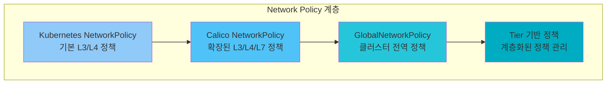
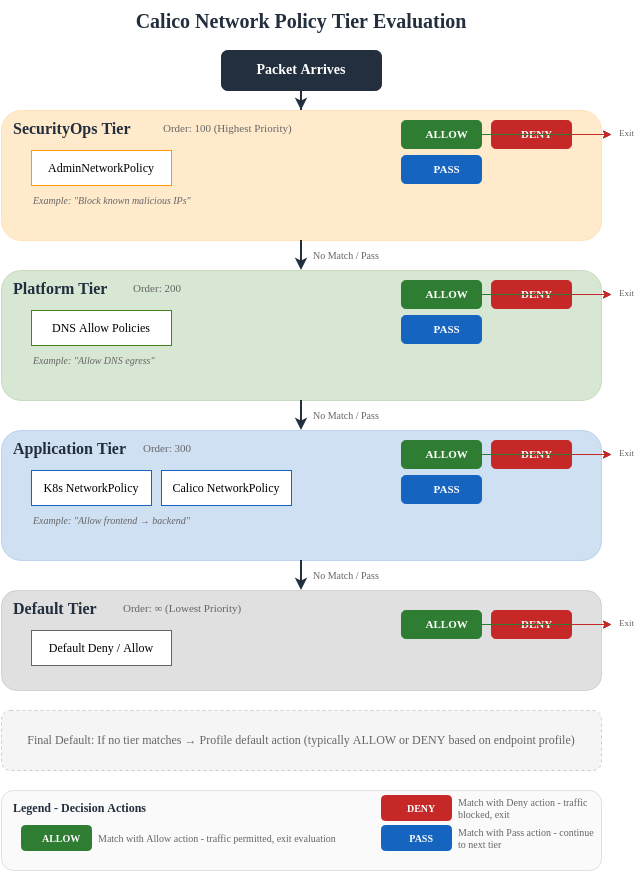
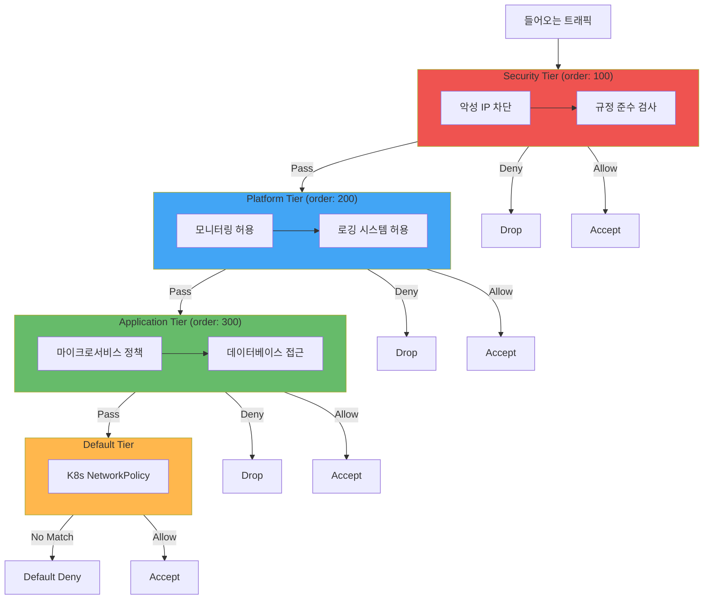

# Part 5: Network Policy

> **지원 버전**: Calico v3.29+ / Kubernetes 1.28+ **마지막 업데이트**: 2026년 2월 23일

## 개요

Network Policy는 Calico의 두 번째 핵심 차별화 요소입니다. Calico는 Kubernetes 표준 NetworkPolicy를 완벽히 지원하면서, 더 강력한 확장 기능을 제공합니다. 이 문서에서는 Kubernetes 표준 정책의 한계를 이해하고, Calico가 제공하는 고급 정책 기능을 심층적으로 다룹니다.



## Kubernetes NetworkPolicy 기본

### 표준 NetworkPolicy 구조

Kubernetes NetworkPolicy는 Pod 간 트래픽을 제어하는 기본 메커니즘입니다.

```yaml
# 기본 Kubernetes NetworkPolicy 예시
apiVersion: networking.k8s.io/v1
kind: NetworkPolicy
metadata:
  name: allow-frontend-to-backend
  namespace: production
spec:
  # 정책이 적용될 Pod 선택
  podSelector:
    matchLabels:
      app: backend
      tier: api

  # 정책 유형 (Ingress, Egress, 또는 둘 다)
  policyTypes:
    - Ingress
    - Egress

  # Ingress 규칙 (들어오는 트래픽)
  ingress:
    # 규칙 1: frontend에서 8080 포트로 접근 허용
    - from:
        - podSelector:
            matchLabels:
              app: frontend
        - namespaceSelector:
            matchLabels:
              env: production
      ports:
        - protocol: TCP
          port: 8080

    # 규칙 2: monitoring 네임스페이스에서 메트릭 수집 허용
    - from:
        - namespaceSelector:
            matchLabels:
              name: monitoring
      ports:
        - protocol: TCP
          port: 9090

  # Egress 규칙 (나가는 트래픽)
  egress:
    # DNS 허용
    - to:
        - namespaceSelector: {}
          podSelector:
            matchLabels:
              k8s-app: kube-dns
      ports:
        - protocol: UDP
          port: 53

    # 데이터베이스 접근 허용
    - to:
        - podSelector:
            matchLabels:
              app: database
      ports:
        - protocol: TCP
          port: 5432
```

### Kubernetes NetworkPolicy의 한계

| 한계                  | 설명                       | Calico 해결책          |
| ------------------- | ------------------------ | ------------------- |
| **명시적 Deny 없음**     | Allow 규칙만 가능, Deny 규칙 불가 | `action: Deny` 지원   |
| **L7 정책 없음**        | HTTP 메서드, 경로 기반 필터링 불가   | HTTP/gRPC 프로토콜 인식   |
| **클러스터 전역 정책 없음**   | 네임스페이스 범위로 제한            | GlobalNetworkPolicy |
| **FQDN 기반 정책 없음**   | IP 주소만 사용 가능             | `domains` 필드 지원     |
| **정책 순서 없음**        | 순서 지정 불가                 | `order` 필드로 우선순위    |
| **로깅 없음**           | 정책 매치 로깅 불가              | `action: Log` 지원    |
| **ICMP 제어 제한**      | ICMP 유형별 제어 불가           | ICMP 유형/코드 지정       |
| **호스트 엔드포인트 보호 없음** | 노드 자체 보호 불가              | HostEndpoint 지원     |

## Calico NetworkPolicy

### 기본 구조

Calico NetworkPolicy는 Kubernetes NetworkPolicy를 확장합니다.

```yaml
apiVersion: projectcalico.org/v3
kind: NetworkPolicy
metadata:
  name: advanced-backend-policy
  namespace: production
spec:
  # Calico 셀렉터 문법 (표현식 기반)
  selector: app == 'backend' && tier == 'api'

  # 정책 순서 (낮을수록 먼저 평가, 기본값: 무한대)
  order: 100

  # Ingress 규칙
  ingress:
    - action: Allow
      protocol: TCP
      source:
        selector: app == 'frontend'
      destination:
        ports:
          - 8080

  # Egress 규칙
  egress:
    - action: Allow
      protocol: TCP
      destination:
        selector: app == 'database'
        ports:
          - 5432
```

### 셀렉터 문법

Calico는 강력한 표현식 기반 셀렉터를 제공합니다.

```yaml
# 셀렉터 예시들
spec:
  # 단일 레이블 매칭
  selector: app == 'frontend'

  # AND 조건
  selector: app == 'backend' && env == 'production'

  # OR 조건
  selector: app == 'frontend' || app == 'backend'

  # NOT 조건
  selector: app != 'legacy'

  # 레이블 존재 확인
  selector: has(app)

  # 레이블 부재 확인
  selector: "!has(internal)"

  # IN 연산자
  selector: app in {'frontend', 'backend', 'database'}

  # NOT IN 연산자
  selector: env not in {'dev', 'staging'}

  # 모든 엔드포인트 선택
  selector: all()

  # 복합 조건
  selector: (app == 'frontend' || app == 'backend') && env == 'production' && has(secure)
```

### Action 유형

Calico는 네 가지 액션을 지원합니다.

```yaml
# Allow - 트래픽 허용
- action: Allow
  protocol: TCP
  destination:
    ports:
      - 8080

# Deny - 트래픽 명시적 거부
- action: Deny
  source:
    selector: "has(untrusted)"

# Log - 트래픽 로깅 (처리는 다음 규칙으로)
- action: Log
  protocol: TCP
  destination:
    ports:
      - 22

# Pass - 다음 Tier로 전달 (Tier 사용 시)
- action: Pass
```

### 프로토콜 및 포트 지정

```yaml
apiVersion: projectcalico.org/v3
kind: NetworkPolicy
metadata:
  name: protocol-examples
  namespace: production
spec:
  selector: app == 'backend'

  ingress:
    # TCP 특정 포트
    - action: Allow
      protocol: TCP
      destination:
        ports:
          - 80
          - 443
          - 8080:8090  # 포트 범위

    # UDP
    - action: Allow
      protocol: UDP
      destination:
        ports:
          - 53

    # ICMP (IPv4)
    - action: Allow
      protocol: ICMP
      icmp:
        type: 8  # Echo Request
        code: 0

    # ICMPv6
    - action: Allow
      protocol: ICMPv6
      icmp:
        type: 128  # Echo Request
        code: 0

    # SCTP
    - action: Allow
      protocol: SCTP
      destination:
        ports:
          - 36412  # S1AP

    # 모든 프로토콜
    - action: Allow
      protocol: TCP
      destination:
        ports:
          - 1:65535  # 모든 포트
```

### Source/Destination 지정

```yaml
apiVersion: projectcalico.org/v3
kind: NetworkPolicy
metadata:
  name: source-dest-examples
  namespace: production
spec:
  selector: app == 'backend'

  ingress:
    # Pod 셀렉터
    - action: Allow
      source:
        selector: app == 'frontend'
      destination:
        ports:
          - 8080

    # 네임스페이스 셀렉터
    - action: Allow
      source:
        namespaceSelector: env == 'production'
      destination:
        ports:
          - 8080

    # 네임스페이스 + Pod 셀렉터 조합
    - action: Allow
      source:
        selector: app == 'api-gateway'
        namespaceSelector: name == 'ingress'
      destination:
        ports:
          - 8080

    # CIDR 블록
    - action: Allow
      source:
        nets:
          - 10.0.0.0/8
          - 172.16.0.0/12
        notNets:
          - 10.0.100.0/24  # 제외할 서브넷
      destination:
        ports:
          - 8080

    # 서비스 계정 기반
    - action: Allow
      source:
        serviceAccounts:
          names:
            - frontend-sa
            - api-gateway-sa
          selector: role == 'frontend'
```

## GlobalNetworkPolicy

GlobalNetworkPolicy는 클러스터 전체에 적용되는 정책입니다.

### Default Deny 정책

```yaml
# 기본 거부 정책 (모든 트래픽 차단)
apiVersion: projectcalico.org/v3
kind: GlobalNetworkPolicy
metadata:
  name: default-deny
spec:
  # 모든 Pod에 적용
  selector: all()

  # 높은 order 값 (다른 정책보다 나중에 평가)
  order: 10000

  # Ingress와 Egress 모두 적용
  types:
    - Ingress
    - Egress

  # 빈 규칙 = 모두 거부
  # ingress: []
  # egress: []
```

### DNS 허용 정책

```yaml
apiVersion: projectcalico.org/v3
kind: GlobalNetworkPolicy
metadata:
  name: allow-dns
spec:
  selector: all()
  order: 100

  egress:
    # CoreDNS/kube-dns로 DNS 쿼리 허용
    - action: Allow
      protocol: UDP
      destination:
        selector: k8s-app == 'kube-dns'
        ports:
          - 53

    - action: Allow
      protocol: TCP
      destination:
        selector: k8s-app == 'kube-dns'
        ports:
          - 53

    # 외부 DNS 서버 허용 (선택적)
    - action: Allow
      protocol: UDP
      destination:
        nets:
          - 8.8.8.8/32
          - 8.8.4.4/32
        ports:
          - 53
```

### 외부 Egress 차단

```yaml
apiVersion: projectcalico.org/v3
kind: GlobalNetworkPolicy
metadata:
  name: deny-external-egress
spec:
  # internet-access 레이블이 없는 Pod에 적용
  selector: "!has(internet-access)"
  order: 200

  egress:
    # 내부 네트워크만 허용
    - action: Allow
      destination:
        nets:
          - 10.0.0.0/8
          - 172.16.0.0/12
          - 192.168.0.0/16

    # 외부 모두 거부
    - action: Deny
      destination:
        notNets:
          - 10.0.0.0/8
          - 172.16.0.0/12
          - 192.168.0.0/16
```

### Kubernetes API 서버 접근 제어

```yaml
apiVersion: projectcalico.org/v3
kind: GlobalNetworkPolicy
metadata:
  name: allow-kube-api
spec:
  selector: all()
  order: 150

  egress:
    # Kubernetes API 서버 접근 허용
    - action: Allow
      protocol: TCP
      destination:
        nets:
          - 10.96.0.1/32  # kubernetes.default ClusterIP
        ports:
          - 443

    # API 서버의 실제 IP (노드 IP 또는 로드밸런서)
    - action: Allow
      protocol: TCP
      destination:
        nets:
          - 10.0.1.0/24  # Control plane 서브넷
        ports:
          - 6443
```

## NetworkSet / GlobalNetworkSet

NetworkSet은 IP 주소 집합을 정의하여 정책에서 재사용합니다.

### NetworkSet (네임스페이스 범위)

```yaml
# 외부 데이터베이스 IP 집합
apiVersion: projectcalico.org/v3
kind: NetworkSet
metadata:
  name: external-databases
  namespace: production
  labels:
    service-type: database
    environment: production
spec:
  nets:
    - 10.100.10.10/32  # Primary PostgreSQL
    - 10.100.10.11/32  # Secondary PostgreSQL
    - 10.100.20.10/32  # MongoDB Primary
    - 10.100.20.11/32  # MongoDB Secondary
    - 10.100.30.0/24   # Redis Cluster
---
# NetworkSet 참조 정책
apiVersion: projectcalico.org/v3
kind: NetworkPolicy
metadata:
  name: allow-database-access
  namespace: production
spec:
  selector: app == 'backend'

  egress:
    - action: Allow
      protocol: TCP
      destination:
        # NetworkSet 참조 (레이블 셀렉터 사용)
        selector: service-type == 'database'
        namespaceSelector: projectcalico.org/name == 'production'
        ports:
          - 5432  # PostgreSQL
          - 27017 # MongoDB
          - 6379  # Redis
```

### GlobalNetworkSet (클러스터 전역)

```yaml
# 신뢰할 수 있는 파트너 IP
apiVersion: projectcalico.org/v3
kind: GlobalNetworkSet
metadata:
  name: trusted-partners
  labels:
    partner: trusted
    access-level: external
spec:
  nets:
    - 203.0.113.0/24    # Partner A 네트워크
    - 198.51.100.0/24   # Partner B 네트워크
    - 192.0.2.10/32     # Partner C 단일 IP
---
# 차단해야 할 악성 IP
apiVersion: projectcalico.org/v3
kind: GlobalNetworkSet
metadata:
  name: blocked-ips
  labels:
    threat: malicious
spec:
  nets:
    - 198.18.0.0/15     # 알려진 악성 대역
    - 192.0.2.100/32    # 특정 악성 IP
---
# GlobalNetworkSet 참조 정책
apiVersion: projectcalico.org/v3
kind: GlobalNetworkPolicy
metadata:
  name: block-malicious-traffic
spec:
  selector: all()
  order: 10  # 가장 먼저 평가

  ingress:
    # 악성 IP 차단
    - action: Deny
      source:
        selector: "global(threat == 'malicious')"

    # 신뢰할 수 있는 파트너 허용
    - action: Allow
      source:
        selector: "global(partner == 'trusted')"
      destination:
        ports:
          - 443
```

## Tier 기반 정책



Tier는 정책을 계층화하여 관리합니다. 보안팀, 플랫폼팀, 애플리케이션팀이 각자의 영역에서 정책을 관리할 수 있습니다.

### Tier 정의

```yaml
# Security Tier - 보안팀 관리
apiVersion: projectcalico.org/v3
kind: Tier
metadata:
  name: security
spec:
  order: 100
---
# Platform Tier - 플랫폼팀 관리
apiVersion: projectcalico.org/v3
kind: Tier
metadata:
  name: platform
spec:
  order: 200
---
# Application Tier - 개발팀 관리
apiVersion: projectcalico.org/v3
kind: Tier
metadata:
  name: application
spec:
  order: 300
---
# Default Tier (기본 제공)
# 모든 Kubernetes NetworkPolicy는 이 Tier에 속함
# order: 무한대 (가장 마지막)
```

### Tier 평가 흐름



### Tier 정책 예시

```yaml
# Security Tier: 악성 트래픽 차단
apiVersion: projectcalico.org/v3
kind: GlobalNetworkPolicy
metadata:
  name: security.block-malicious
spec:
  tier: security
  order: 10
  selector: all()

  ingress:
    # 악성 IP 차단
    - action: Deny
      source:
        selector: "global(threat == 'malicious')"

    # 나머지는 다음 Tier로
    - action: Pass

  egress:
    - action: Pass
---
# Security Tier: PCI DSS 규정 준수
apiVersion: projectcalico.org/v3
kind: GlobalNetworkPolicy
metadata:
  name: security.pci-compliance
spec:
  tier: security
  order: 20
  # PCI 범위 워크로드에만 적용
  selector: has(pci-scope)

  ingress:
    # PCI 범위 내에서만 통신 허용
    - action: Allow
      source:
        selector: has(pci-scope)

    # PCI 범위 외부로부터 거부
    - action: Deny
      source:
        selector: "!has(pci-scope)"
---
# Platform Tier: 모니터링 허용
apiVersion: projectcalico.org/v3
kind: GlobalNetworkPolicy
metadata:
  name: platform.allow-monitoring
spec:
  tier: platform
  order: 10
  selector: all()

  ingress:
    # Prometheus 스크래핑 허용
    - action: Allow
      protocol: TCP
      source:
        namespaceSelector: name == 'monitoring'
        selector: app == 'prometheus'
      destination:
        ports:
          - 9090
          - 9091
          - 9100

    # 나머지는 다음 Tier로
    - action: Pass
---
# Platform Tier: 로깅 Egress 허용
apiVersion: projectcalico.org/v3
kind: GlobalNetworkPolicy
metadata:
  name: platform.allow-logging
spec:
  tier: platform
  order: 20
  selector: all()

  egress:
    # Fluentd/Fluent Bit으로 로그 전송 허용
    - action: Allow
      protocol: TCP
      destination:
        namespaceSelector: name == 'logging'
        selector: app in {'fluentd', 'fluent-bit'}
        ports:
          - 24224

    - action: Pass
---
# Application Tier: 마이크로서비스 정책
apiVersion: projectcalico.org/v3
kind: NetworkPolicy
metadata:
  name: application.frontend-policy
  namespace: production
spec:
  tier: application
  order: 10
  selector: app == 'frontend'

  ingress:
    # 인그레스 컨트롤러에서만 허용
    - action: Allow
      protocol: TCP
      source:
        namespaceSelector: name == 'ingress-nginx'
        selector: app.kubernetes.io/name == 'ingress-nginx'
      destination:
        ports:
          - 8080

  egress:
    # Backend API 접근 허용
    - action: Allow
      protocol: TCP
      destination:
        selector: app == 'backend'
        ports:
          - 8080
```

### Tier + RBAC 통합

각 팀에게 자신의 Tier에서만 정책을 관리할 수 있는 권한을 부여합니다.

```yaml
# Security Team - security tier 관리 권한
apiVersion: rbac.authorization.k8s.io/v1
kind: ClusterRole
metadata:
  name: calico-security-tier-admin
rules:
  - apiGroups: ["projectcalico.org"]
    resources: ["globalnetworkpolicies"]
    resourceNames: ["security.*"]
    verbs: ["get", "list", "watch", "create", "update", "patch", "delete"]
  - apiGroups: ["projectcalico.org"]
    resources: ["tiers"]
    resourceNames: ["security"]
    verbs: ["get", "list", "watch"]
---
# Platform Team - platform tier 관리 권한
apiVersion: rbac.authorization.k8s.io/v1
kind: ClusterRole
metadata:
  name: calico-platform-tier-admin
rules:
  - apiGroups: ["projectcalico.org"]
    resources: ["globalnetworkpolicies"]
    resourceNames: ["platform.*"]
    verbs: ["get", "list", "watch", "create", "update", "patch", "delete"]
  - apiGroups: ["projectcalico.org"]
    resources: ["tiers"]
    resourceNames: ["platform"]
    verbs: ["get", "list", "watch"]
---
# Application Team - 네임스페이스별 application tier 정책 관리
apiVersion: rbac.authorization.k8s.io/v1
kind: Role
metadata:
  name: calico-app-policy-admin
  namespace: production
rules:
  - apiGroups: ["projectcalico.org"]
    resources: ["networkpolicies"]
    verbs: ["get", "list", "watch", "create", "update", "patch", "delete"]
```

## FQDN 기반 Egress 정책

도메인 이름을 기반으로 Egress 트래픽을 제어합니다.

```yaml
apiVersion: projectcalico.org/v3
kind: GlobalNetworkPolicy
metadata:
  name: allow-specific-domains
spec:
  selector: app == 'backend'
  order: 300

  egress:
    # AWS 서비스 접근 허용
    - action: Allow
      protocol: TCP
      destination:
        domains:
          - "*.amazonaws.com"
          - "*.aws.amazon.com"
        ports:
          - 443

    # GitHub API 접근 허용
    - action: Allow
      protocol: TCP
      destination:
        domains:
          - "api.github.com"
          - "github.com"
        ports:
          - 443

    # 특정 외부 API 허용
    - action: Allow
      protocol: TCP
      destination:
        domains:
          - "api.stripe.com"
          - "api.sendgrid.com"
        ports:
          - 443

    # 다른 외부 도메인 차단
    - action: Deny
      destination:
        notNets:
          - 10.0.0.0/8
          - 172.16.0.0/12
          - 192.168.0.0/16
```

**FQDN 정책 동작 원리:**

1. DNS 쿼리 모니터링: Calico가 DNS 응답을 모니터링
2. IP 매핑 유지: 도메인과 IP 매핑을 동적으로 관리
3. 정책 적용: 해당 IP로의 트래픽에 정책 적용

## L7 (HTTP) 정책

Calico Enterprise 또는 Envoy 프록시 통합 시 L7 정책을 사용할 수 있습니다.

```yaml
apiVersion: projectcalico.org/v3
kind: NetworkPolicy
metadata:
  name: l7-api-policy
  namespace: production
spec:
  selector: app == 'api-server'

  ingress:
    # GET 요청만 허용 (읽기 전용)
    - action: Allow
      protocol: TCP
      source:
        selector: role == 'reader'
      destination:
        ports:
          - 8080
      http:
        methods:
          - GET
          - HEAD
        paths:
          - prefix: "/api/v1/read"

    # 관리자는 모든 메서드 허용
    - action: Allow
      protocol: TCP
      source:
        selector: role == 'admin'
      destination:
        ports:
          - 8080
      http:
        methods:
          - GET
          - POST
          - PUT
          - DELETE
          - PATCH
        paths:
          - prefix: "/api/"

    # /health 엔드포인트는 모두 허용
    - action: Allow
      protocol: TCP
      destination:
        ports:
          - 8080
      http:
        methods:
          - GET
        paths:
          - exact: "/health"
          - exact: "/ready"
```

## HostEndpoint 보호

HostEndpoint는 노드 자체의 네트워크 인터페이스를 보호합니다.

### HostEndpoint 정의

```yaml
# 노드의 eth0 인터페이스 보호
apiVersion: projectcalico.org/v3
kind: HostEndpoint
metadata:
  name: node-1-eth0
  labels:
    host: node-1
    interface: eth0
    role: worker
spec:
  node: node-1
  interfaceName: eth0
  expectedIPs:
    - 10.0.1.10
---
# Control plane 노드 보호
apiVersion: projectcalico.org/v3
kind: HostEndpoint
metadata:
  name: control-plane-1-eth0
  labels:
    host: control-plane-1
    interface: eth0
    role: control-plane
spec:
  node: control-plane-1
  interfaceName: eth0
  expectedIPs:
    - 10.0.1.5
```

### HostEndpoint 정책

```yaml
# 노드 레벨 방화벽 정책
apiVersion: projectcalico.org/v3
kind: GlobalNetworkPolicy
metadata:
  name: host-default-deny
spec:
  selector: has(host)
  order: 10000

  # HostEndpoint에 적용
  applyOnForward: true

  types:
    - Ingress
    - Egress

  # 기본 거부 (빈 규칙)
---
apiVersion: projectcalico.org/v3
kind: GlobalNetworkPolicy
metadata:
  name: host-allow-ssh
spec:
  selector: has(host)
  order: 100
  applyOnForward: true

  ingress:
    # Bastion에서만 SSH 허용
    - action: Allow
      protocol: TCP
      source:
        nets:
          - 10.0.0.0/24  # Bastion 서브넷
      destination:
        ports:
          - 22
---
apiVersion: projectcalico.org/v3
kind: GlobalNetworkPolicy
metadata:
  name: host-allow-kubelet
spec:
  selector: role == 'control-plane'
  order: 200
  applyOnForward: true

  ingress:
    # API 서버에서 kubelet 접근 허용
    - action: Allow
      protocol: TCP
      source:
        selector: role == 'control-plane'
      destination:
        ports:
          - 10250  # kubelet
          - 10255  # kubelet read-only
```

## DoNotTrack / PreDNAT 정책

### DoNotTrack 정책

연결 추적을 우회하는 고성능 정책입니다.

```yaml
apiVersion: projectcalico.org/v3
kind: GlobalNetworkPolicy
metadata:
  name: high-perf-dns
spec:
  selector: app == 'dns-server'
  order: 10

  # 연결 추적 비활성화
  doNotTrack: true

  ingress:
    - action: Allow
      protocol: UDP
      destination:
        ports:
          - 53
    - action: Allow
      protocol: TCP
      destination:
        ports:
          - 53
```

**DoNotTrack 사용 사례:**

* 고성능 DNS 서버
* 대량 UDP 트래픽 처리
* 상태 비저장 서비스

### PreDNAT 정책

DNAT 변환 전에 원본 목적지 IP를 기준으로 정책을 적용합니다.

```yaml
apiVersion: projectcalico.org/v3
kind: GlobalNetworkPolicy
metadata:
  name: protect-nodeport
spec:
  selector: all()
  order: 50

  # DNAT 이전에 평가
  preDNAT: true
  applyOnForward: true

  ingress:
    # NodePort 범위에 대한 접근 제어
    - action: Allow
      protocol: TCP
      source:
        nets:
          - 10.0.0.0/8  # 내부 네트워크
      destination:
        ports:
          - 30000:32767  # NodePort 범위

    # 외부에서 NodePort 접근 차단
    - action: Deny
      protocol: TCP
      destination:
        ports:
          - 30000:32767
```

## 정책 디버깅

### calicoctl을 통한 정책 확인

```bash
# 모든 정책 목록
calicoctl get networkpolicy -A
calicoctl get globalnetworkpolicy

# 특정 정책 상세 확인
calicoctl get networkpolicy allow-frontend -n production -o yaml

# 특정 엔드포인트에 적용된 정책 확인
calicoctl get workloadendpoint -n production
calicoctl get workloadendpoint <endpoint-name> -n production -o yaml
```

### 정책 추적

```bash
# 특정 트래픽 경로 추적
calicoctl policy-trace \
  --source-namespace production \
  --source-selector app==frontend \
  --dest-namespace production \
  --dest-selector app==backend \
  --protocol TCP \
  --dest-port 8080

# Felix 로그에서 정책 매치 확인
kubectl logs -n calico-system -l k8s-app=calico-node -c calico-node | grep -i policy
```

### iptables 규칙 확인 (iptables 모드)

```bash
# calico-node Pod에서 iptables 규칙 확인
kubectl exec -n calico-system <calico-node-pod> -c calico-node -- iptables -L -n -v

# 특정 체인 확인
kubectl exec -n calico-system <calico-node-pod> -c calico-node -- \
  iptables -L cali-pi-<policy-hash> -n -v

# 드롭된 패킷 확인
kubectl exec -n calico-system <calico-node-pod> -c calico-node -- \
  iptables -L -n -v | grep -i drop
```

### Felix 로그 분석

```bash
# Felix 로그 확인
kubectl logs -n calico-system -l k8s-app=calico-node -c calico-node

# 정책 관련 로그만 필터링
kubectl logs -n calico-system -l k8s-app=calico-node -c calico-node | grep -E "(policy|Policy)"

# 드롭된 패킷 로그 (Log 액션 사용 시)
kubectl logs -n calico-system -l k8s-app=calico-node -c calico-node | grep -i "drop\|deny"
```

## 일반적인 정책 패턴

### 1. 마이크로서비스 패턴

```yaml
# Frontend -> Backend -> Database 패턴
---
# Frontend 정책
apiVersion: projectcalico.org/v3
kind: NetworkPolicy
metadata:
  name: frontend-policy
  namespace: production
spec:
  selector: app == 'frontend'

  ingress:
    - action: Allow
      protocol: TCP
      source:
        namespaceSelector: name == 'ingress-nginx'
      destination:
        ports:
          - 8080

  egress:
    - action: Allow
      protocol: TCP
      destination:
        selector: app == 'backend'
        ports:
          - 8080
---
# Backend 정책
apiVersion: projectcalico.org/v3
kind: NetworkPolicy
metadata:
  name: backend-policy
  namespace: production
spec:
  selector: app == 'backend'

  ingress:
    - action: Allow
      protocol: TCP
      source:
        selector: app == 'frontend'
      destination:
        ports:
          - 8080

  egress:
    - action: Allow
      protocol: TCP
      destination:
        selector: app == 'database'
        ports:
          - 5432
---
# Database 정책
apiVersion: projectcalico.org/v3
kind: NetworkPolicy
metadata:
  name: database-policy
  namespace: production
spec:
  selector: app == 'database'

  ingress:
    - action: Allow
      protocol: TCP
      source:
        selector: app == 'backend'
      destination:
        ports:
          - 5432

  egress:
    # 데이터베이스는 외부 Egress 불필요
    - action: Deny
```

### 2. 멀티 테넌트 격리

```yaml
# 테넌트별 네임스페이스 격리
apiVersion: projectcalico.org/v3
kind: GlobalNetworkPolicy
metadata:
  name: tenant-isolation
spec:
  # 테넌트 레이블이 있는 네임스페이스에만 적용
  namespaceSelector: has(tenant)
  selector: all()
  order: 500

  ingress:
    # 같은 테넌트 네임스페이스에서만 허용
    - action: Allow
      source:
        namespaceSelector: tenant == '${namespace.labels.tenant}'

  egress:
    # 같은 테넌트 네임스페이스로만 허용
    - action: Allow
      destination:
        namespaceSelector: tenant == '${namespace.labels.tenant}'
```

### 3. Zero Trust with Default Deny

```yaml
# Step 1: 기본 거부
apiVersion: projectcalico.org/v3
kind: GlobalNetworkPolicy
metadata:
  name: default-deny-all
spec:
  selector: all()
  order: 10000
  types:
    - Ingress
    - Egress
---
# Step 2: DNS 허용
apiVersion: projectcalico.org/v3
kind: GlobalNetworkPolicy
metadata:
  name: allow-dns
spec:
  selector: all()
  order: 100
  egress:
    - action: Allow
      protocol: UDP
      destination:
        selector: k8s-app == 'kube-dns'
        ports:
          - 53
---
# Step 3: 필요한 서비스만 명시적 허용
# (각 서비스별 NetworkPolicy 작성)
```

### 4. Egress 제어 (특정 외부 서비스만 허용)

```yaml
apiVersion: projectcalico.org/v3
kind: GlobalNetworkPolicy
metadata:
  name: controlled-egress
spec:
  selector: egress-controlled == 'true'
  order: 300

  egress:
    # 내부 네트워크 허용
    - action: Allow
      destination:
        nets:
          - 10.0.0.0/8

    # 특정 외부 서비스만 허용
    - action: Allow
      protocol: TCP
      destination:
        domains:
          - "*.amazonaws.com"
        ports:
          - 443

    # 나머지 외부 차단
    - action: Deny
      destination:
        notNets:
          - 10.0.0.0/8
          - 172.16.0.0/12
          - 192.168.0.0/16
```

### 5. 공유 서비스 허용 (네임스페이스 격리 + 공유 서비스)

```yaml
# 기본 네임스페이스 격리
apiVersion: projectcalico.org/v3
kind: GlobalNetworkPolicy
metadata:
  name: namespace-isolation
spec:
  selector: all()
  order: 1000

  ingress:
    - action: Allow
      source:
        namespaceSelector: projectcalico.org/name == '${namespace.name}'

  egress:
    - action: Allow
      destination:
        namespaceSelector: projectcalico.org/name == '${namespace.name}'
---
# 공유 서비스 예외 허용
apiVersion: projectcalico.org/v3
kind: GlobalNetworkPolicy
metadata:
  name: allow-shared-services
spec:
  selector: all()
  order: 500

  egress:
    # Logging 서비스
    - action: Allow
      protocol: TCP
      destination:
        namespaceSelector: name == 'logging'
        ports:
          - 24224

    # Monitoring 서비스
    - action: Allow
      protocol: TCP
      destination:
        namespaceSelector: name == 'monitoring'
        ports:
          - 9090

    # 인증 서비스
    - action: Allow
      protocol: TCP
      destination:
        namespaceSelector: name == 'auth'
        selector: app == 'keycloak'
        ports:
          - 8080
```

## 정책 성능 최적화

### 정책 수와 성능

| 정책 수     | Felix 처리 시간 | 권장 사항    |
| -------- | ----------- | -------- |
| < 100    | 빠름          | 문제 없음    |
| 100-500  | 보통          | 모니터링 권장  |
| 500-1000 | 느림          | 최적화 필요   |
| > 1000   | 매우 느림       | 정책 통합 필수 |

### 최적화 전략

```yaml
# 비효율적: 많은 개별 정책
# (각 서비스마다 별도 정책)

# 효율적: 셀렉터를 활용한 통합 정책
apiVersion: projectcalico.org/v3
kind: NetworkPolicy
metadata:
  name: common-backend-policy
  namespace: production
spec:
  # 여러 백엔드 서비스를 하나의 정책으로
  selector: tier == 'backend'

  ingress:
    - action: Allow
      source:
        selector: tier == 'frontend'
```

```bash
# Felix 성능 메트릭 확인
kubectl exec -n calico-system <calico-node-pod> -c calico-node -- \
  curl -s http://localhost:9091/metrics | grep felix_calc
```

***

## 참고 자료

* [Calico Network Policy 레퍼런스](https://docs.tigera.io/calico/latest/reference/resources/networkpolicy)
* [GlobalNetworkPolicy 레퍼런스](https://docs.tigera.io/calico/latest/reference/resources/globalnetworkpolicy)
* [Policy Tiers](https://docs.tigera.io/calico/latest/reference/resources/tier)
* [NetworkSet 레퍼런스](https://docs.tigera.io/calico/latest/reference/resources/networkset)

[이전: Part 4 - BGP 아키텍처 심화](04-bgp-deep-dive.md) | [다음: Part 6 - eBPF 데이터플레인](06-ebpf-dataplane.md) | [메인 페이지로 돌아가기](./README.md)
