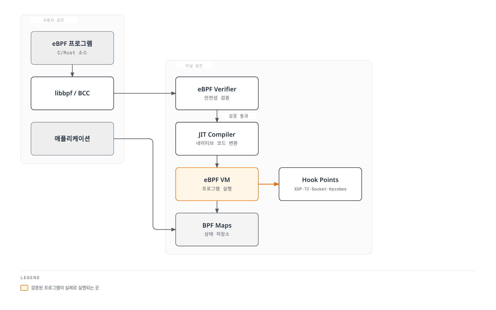
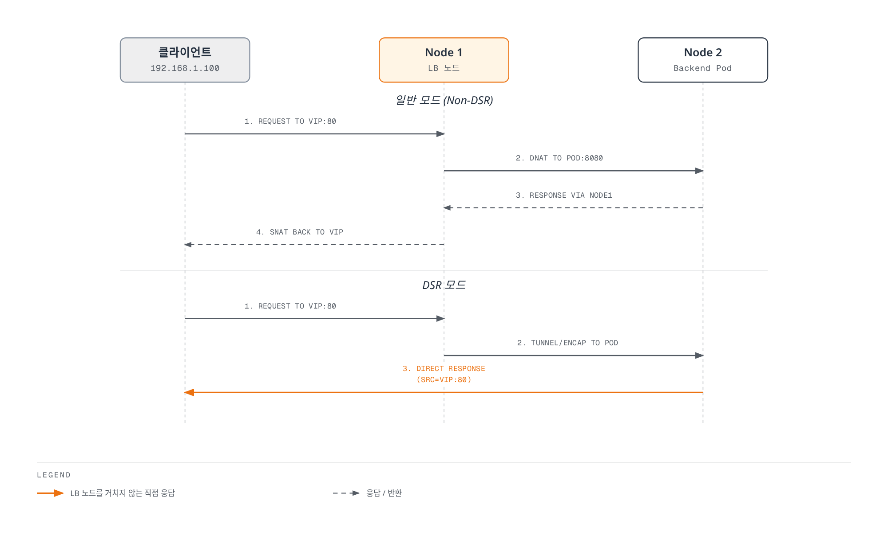
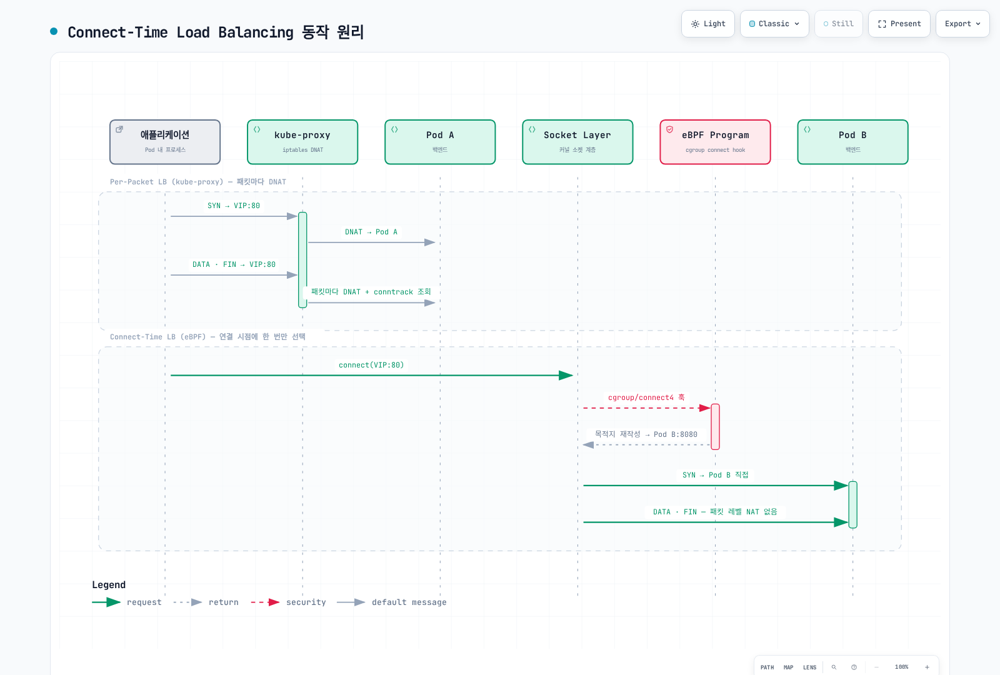
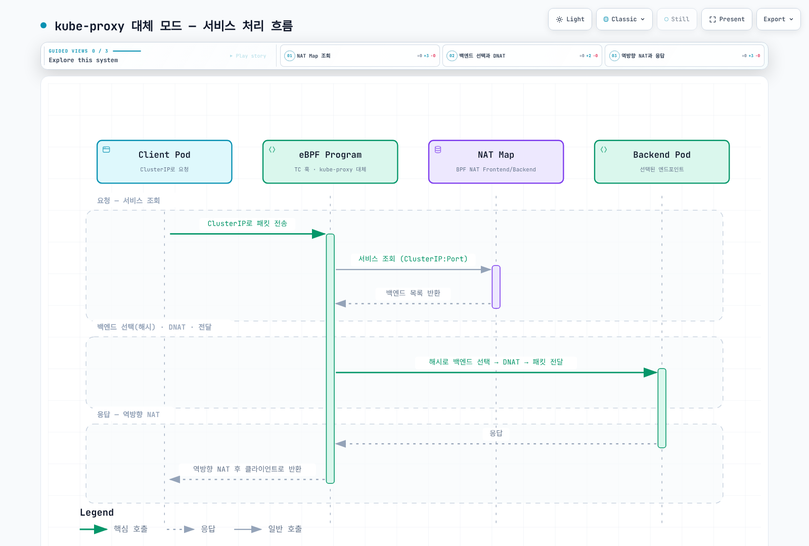

# Part 6: eBPF 데이터플레인

> **검토 기준**: Calico 3.32.2; Calico 3.32의 Kubernetes 테스트 범위는 1.34–1.36입니다. **마지막 업데이트**: 2026년 9월 12일.
>
> 호환되는 기존 Linux Calico 클러스터와 표준 Calico API 서버를 전제로 합니다. 설치 소유자의 절차를 선택하며 각 설정 조각을 모든 클러스터에 순서대로 적용하지 않습니다. 이번 검토에서는 BPF 프로그램 로드·클러스터 전환·기존 벤치마크 재현을 실행하지 않았습니다.

## 개요

Calico eBPF 데이터 평면은 BPF 프로그램·맵으로 워크로드 네트워크, 정책, Kubernetes Service를 처리합니다. 적합한 경로에서 오버헤드를 줄일 수 있지만 성능은 부하와 설정에 따라 다릅니다. Calico는 기존 Linux 데이터 평면과 Windows HNS도 제공하므로 eBPF가 모든 플랫폼에 맞는 업그레이드는 아닙니다.

이 문서에서는 eBPF의 기본 개념부터 Calico에서의 활용, 마이그레이션 방법, 그리고 성능 최적화까지 심층적으로 다룹니다.

## eBPF 기본 개념

### eBPF란?

eBPF(extended Berkeley Packet Filter)는 Linux 커널 내에서 샌드박스된 프로그램을 실행할 수 있게 해주는 기술입니다. 커널을 수정하거나 모듈을 로드하지 않고도 커널의 동작을 확장할 수 있습니다.



[🔍 인터랙티브 다이어그램 보기](https://www.atomai.click/kubernetes-docs/archmaps/ko-networking-calico-06-ebpf-dataplane-1.html)

> VM은 추상적인 명령어 모델입니다. JIT를 사용하면 hook에서 네이티브 코드를 실행하며 JIT 뒤에 별도 guest VM이 추가되는 것은 아닙니다. Calico hook 전체의 정확한 목록도 아닙니다.

### eBPF 핵심 구성 요소

| 구성 요소                | 역할       | 설명                 |
| -------------------- | -------- | ------------------ |
| **Verifier**         | 안전성 검증   | 무한 루프, 메모리 위반 방지   |
| **JIT Compiler**     | 성능 최적화   | 바이트코드를 네이티브 코드로 변환 |
| **BPF Maps**         | 데이터 저장   | 커널-사용자 공간 데이터 공유   |
| **Helper Functions** | 커널 기능 접근 | 안전한 커널 API 호출      |
| **Hook Points**      | 실행 지점    | XDP, TC, Socket 등  |

### 실행 지점과 커널 경로

iptables와 eBPF 패킷 처리는 모두 커널에서 수행합니다. iptables 규칙 하나를 검사할 때마다 사용자 공간으로 전환하는 것은 아닙니다. iptables 모드의 kube-proxy는 Service 규칙을 만드는 제어 평면 프로세스이며 패킷이 그 프로세스를 통과하지 않습니다.

| 구성 | 역할·범위 |
| --- | --- |
| TC packet hook | 정책·라우팅·연결 상태·패킷 기반 Service 처리. 인터페이스 ingress/egress와 워크로드 방향은 구분 |
| Cgroup socket-address hook | connect-time 목적지 변환. 현재 loader는 connect 및 UDP 활성화 시 sendmsg/recvmsg hook 연결 |
| XDP | 지원·설정된 조기 패킷 처리. classic 데이터 평면 가속과 전체 eBPF 데이터 평면 내부 동작을 구분 |
| 프로그램·IP-set·counter map | 컴파일한 프로그램과 상태 지원. 모든 정책이 tuple→action 맵 하나에 담기는 것은 아님 |

서로 다른 실행 문맥이며 XDP → TC → sockops → sk_msg → TC를 모든 패킷이 통과하는 파이프라인이 아닙니다. Calico CTLB가 sk_msg로 HTTP 메서드를 검사하지는 않으며 L7에는 별도의 [Istio/Dikastes 통합](05-network-policy.md)이 필요합니다.

해시 조회, longest-prefix match, 정책 명령어, tail call, conntrack의 비용은 서로 다릅니다. “모든 eBPF 정책은 O(1)”이나 “규칙·연결 수와 무관하게 메모리가 일정”하다는 결론은 틀립니다. iptables도 IP set을 활용할 수 있고 NAT 규칙 선택은 보통 연결 첫 패킷에서 수행하며 이후 변환은 conntrack 상태를 사용합니다.

## Calico eBPF와 iptables의 비교

지연·처리량·CPU 차이는 데이터 경로와 부하에서 측정해야 합니다. 단일 eBPF 프로그램이 모든 계층을 한 번에 처리한다고 가정하지 마세요. 아래의 기존 수치는 별도 검증되지 않은 보고 기록이며 현재 성능 보장이 아닙니다.

### 기존 성능 보고 기록

이전 영문·한글 문서는 **서로 다른 검증되지 않은 기록**을 담고 있었습니다. 원래 숫자를 아래에 보존하지만 이번 감사에서 측정한 결과나 Calico 3.32.2의 성능 보장은 아닙니다. 두 기록 모두 원자료, 측정일, 정확한 Calico/Kubernetes/kernel 버전, 토폴로지, NIC/CPU, 연결 상태와 전체 측정 방법을 제시하지 않습니다.

#### 기록 A: 이전 영문 문서

| 보고된 지연 | iptables | eBPF | 기존 반올림 감소율 |
| --- | --- | --- | --- |
| 같은 노드 Pod | 45 μs | 25 μs | 44% |
| 다른 노드 Pod | 120 μs | 80 μs | 33% |
| ClusterIP | 150 μs | 60 μs | 60% |
| NodePort | 180 μs | 70 μs | 61% |

| 보고된 처리량 | iptables | eBPF | 기존 반올림 증가율 |
| --- | --- | --- | --- |
| TCP 단일 스트림 | 15 Gbps | 23 Gbps | 53% |
| TCP 다중 스트림 | 35 Gbps | 48 Gbps | 37% |
| UDP 단일 스트림 | 8 Gbps | 18 Gbps | 125% |
| 64바이트 패킷 | 2M pps | 5M pps | 150% |

| 보고된 규칙 수 | iptables 연결/초 | eBPF 연결/초 |
| --- | --- | --- |
| 1,000 | 50,000 | 120,000 |
| 5,000 | 35,000 | 115,000 |
| 10,000 | 20,000 | 110,000 |


지연의 percentile은 지정되어 있지 않습니다. 연결/초는 직접적인 CPU 사용량 측정이 아니며 세 점만으로 모든 규모에서 정책 비용이 일정하다고 증명할 수 없습니다.

#### 기록 B: 이전 한글 문서

| 보고된 지표 | iptables | eBPF | 기존 반올림 변화율 |
| --- | --- | --- | --- |
| 처리량 | 1.2M pps | 2.0M pps | +67% |
| 지연 | 120 μs | 75 μs | −38% |
| Service 1,000개에서 CPU | 70% | 30% | −57% |
| 연결 설정 | 절대값 없음 | 절대값 없음 | 기존 주장 −50% |


기록 B와 A를 같은 실험으로 합치지 마세요. 메모리·복잡도 설명은 측정 데이터가 아니었으며 연결 설정 감소율에는 기준 시간이 없습니다. 고정된 “20–40% 향상”을 기대값으로 사용하지 않습니다.

#### 재현 가능한 비교

같은 client/server 테스트 이미지, 노드, 트래픽 경로, CPU/NIC 할당, MTU, 부하로 비교하세요. 데이터 평면·커널·소프트웨어 버전, 시간, 표본 수, warm-up, 동시성, conntrack 상태, 로깅 설정을 기록합니다. 직접 Pod IP와 애플리케이션 Service는 별도로 검사합니다.

```bash
# Requires ready test Pods with netperf/netserver and an appropriate test policy.
CLIENT_POD=netperf-client
SERVER_POD=netperf-server
SERVER_IP="$(kubectl -n calico-demo get pod "$SERVER_POD" -o jsonpath='{.status.podIP}')"
test -n "$SERVER_IP"
kubectl -n calico-demo exec "$CLIENT_POD" -- \
  netperf -H "$SERVER_IP" -t TCP_RR -l 30
kubectl -n calico-demo exec "$CLIENT_POD" -- \
  netperf -H "$SERVER_IP" -t TCP_STREAM -l 30
```

`TCP_RR` 기본 출력은 지연 percentile이 아닌 **초당 트랜잭션 수**입니다. 조건에 맞는 역수는 평균 트랜잭션 시간으로 해석할 수 있지만 p99 네트워크 지연이 아닙니다. netperf의 제어·데이터 연결을 격리 테스트 환경에서 허용해야 합니다. 워크스테이션에 설치해도 client Pod에 netperf가 설치되지는 않습니다. 이번 감사에서는 Calico 클러스터에서 이 절차를 실행하지 않았습니다.

## BPF Map 구조

다음은 **Calico 3.32.2의 IPv4 버전별 내부 형식**입니다. 안정적인 공개 ABI나 커널 map 쓰기 절차가 아닙니다.

| Map | 유형 | key / value 바이트 | 용도 |
| --- | --- | --- | --- |
| Route | LPM trie | 8 / 8 | 목적지 접두사, flags, next-hop/interface union |
| NAT frontend | LPM trie | 16 / 20 | Service·소스 접두사 매칭, backend group/count, affinity, flags |
| NAT backend | Hash | 8 / 8 | backend group/ordinal → 주소·포트 |
| Conntrack v4 형식 | LRU hash | 16 / 88 | 프로토콜·주소 쌍·포트·상태·NAT 정보 |
| Affinity | LRU hash | 버전별 상이 | 클라이언트의 backend 선택 캐시 |

IPv4 route key의 앞 4바이트는 little-endian 접두사 길이이고 뒤에는 IPv4 주소가 옵니다. value는 flags와 4바이트 next-hop/interface-index union이며 MAC 필드는 없습니다. conntrack은 32비트 프로토콜 필드 뒤에 주소·포트를 저장합니다. IPv6 형식은 다르므로 예전의 단순화된 struct를 실제 ABI로 사용하지 마세요.

정책은 BPF 명령어로 컴파일되고 map이 이를 지원합니다. rule-counter map이 정책 자체는 아닙니다. 해당 릴리스의 Calico 진단 도구로 type·용량·버전을 확인한 뒤 원시 바이트를 해석하세요.

## Direct Server Return (DSR)



[🔍 인터랙티브 다이어그램 보기](https://www.atomai.click/kubernetes-docs/archmaps/ko-networking-calico-06-ebpf-dataplane-6.html)

> frontend는 NodePort나 다른 Service 주소일 수 있습니다. 반환 소스 변환은 Calico가 처리하며 외부 클라우드 로드 밸런서는 그림에 없으므로 해당 반환 경로 제약도 별도로 적용됩니다.

그림의 “LB 노드”는 Kubernetes Service를 전달하는 노드입니다. DSR 응답이 그 노드를 우회할 수 있지만 외부 클라우드 로드 밸런서까지 자동으로 우회하지는 않습니다. 반환 소스 변환은 Calico가 처리하며 애플리케이션 Pod에 VIP 바인딩을 요구하는 것은 아닙니다.

| `bpfExternalServiceMode` | 원격 backend 경로 |
| --- | --- |
| `Tunnel` (기본) | 요청·응답이 ingress 노드/터널 경로 사용 |
| `DSR` | 요청을 원격 노드로 터널링하고 응답은 클라이언트 방향으로 직접 반환 |

이 필드에 `Disabled`나 `IPIP` 값은 없습니다. Calico의 해당 Service 전달은 VXLAN을 사용하므로 양쪽 모드 모두 MTU·underlay를 고려해야 합니다. DSR에는 원래 frontend/ingress 노드 주소를 소스로 보내는 트래픽을 fabric이 허용해야 합니다. Calico의 AWS 가이드는 노드가 같은 서브넷에 있고 source/destination check가 비활성화되어야 한다고 명시하므로 임의의 서브넷 간 배치로 일반화하지 마세요.

현재 Calico 문제 해결 가이드는 원래 target을 통한 반환이 필요한 AWS/GCP 외부 로드 밸런서 경로를 제외합니다. 같은 서브넷·source-check 조건만으로 그 트래픽에 DSR을 활성화하지 마세요.

이미 정상 동작하는 호환 eBPF 경로에서 설정할 필드는 다음과 같습니다.

```yaml
apiVersion: projectcalico.org/v3
kind: FelixConfiguration
metadata:
  name: default
spec:
  bpfExternalServiceMode: DSR
```

설정 소유자를 통해 병합하고 반환 경로·소스 검사·기존 연결을 검증하세요. 모드 변경은 연결을 끊을 수 있습니다. DSR과 CTLB는 서로 다른 최적화입니다.

## Connect-Time Load Balancing



[🔍 인터랙티브 다이어그램 보기](https://www.atomai.click/kubernetes-docs/archmaps/ko-networking-calico-06-ebpf-dataplane-7.html)

> kube-proxy는 커널 규칙을 구성하며 패킷을 직접 운반하지 않습니다. iptables의 기존 연결은 최초 규칙 선택 이후 conntrack을 사용합니다. CTLB는 해당 Service DNAT 경로를 줄일 뿐 모든 패킷 처리를 제거하지 않습니다.

그림은 개념도입니다. kube-proxy는 커널 상태를 구성하고 이후 패킷은 Service 규칙 전체에서 backend를 다시 고르지 않고 conntrack을 사용합니다. CTLB는 지원되는 소켓의 Service 목적지를 패킷 처리 전에 바꾸며 모든 라우팅·정책·conntrack·다른 NAT까지 제거하지는 않습니다.

현재 필드는 `bpfConnectTimeLoadBalancing: TCP`(기본), `Enabled`, `Disabled`입니다. 이전 boolean `bpfConnectTimeLoadBalancingEnabled`는 deprecated이지만 아직 허용됩니다. 양쪽을 무조건 함께 설정하지 말고 기존 override를 소유자와 확인·정리하세요.

```yaml
apiVersion: projectcalico.org/v3
kind: FelixConfiguration
metadata:
  name: default
spec:
  bpfConnectTimeLoadBalancing: TCP
  bpfHostNetworkedNATWithoutCTLB: Enabled
```

`Enabled`는 UDP 소켓 처리도 포함할 수 있고 `TCP`는 TCP만 처리합니다. `bpfHostNetworkedNATWithoutCTLB`는 보완적인 host-network NAT 경로이며 ClusterIP 자체의 지원 스위치가 아닙니다. 원래 Service 주소를 봐야 하는 서비스 메시에서는 CTLB를 꺼야 할 수 있으므로 검증한 통합 절차를 따르세요.

## XDP 가속

Native driver XDP는 skb 할당 전에 처리할 수 있지만 Generic XDP는 skb가 있는 더 뒤의 경로에서 동작합니다. 하드웨어 offload는 NIC·driver·프로그램에 따라 지원이 다르며 모드 이름만으로 성능 순위를 보장하지 않습니다.

Felix의 `xdpEnabled`는 classic iptables 데이터 평면에서 적합한 untracked ingress Deny를 가속하는 **boolean**입니다. `genericXDPEnabled`의 기본값은 false이므로 자동 Generic fallback을 보장하지 않습니다. 전체 eBPF 데이터 평면 내부 XDP 프로그램과는 별도 설정입니다.

```yaml
# 별도의 classic iptables 데이터 평면 가속 예시
apiVersion: projectcalico.org/v3
kind: FelixConfiguration
metadata:
  name: default
spec:
  xdpEnabled: true
  genericXDPEnabled: false
```

해당 인터페이스의 driver와 실제 attachment를 확인하세요. `Enabled`, `Offload`, `BestEffort`를 xdpEnabled enum 값으로 사용하지 않습니다.

## eBPF 모드 요구사항

과거 최소 버전이 아닌 선택한 릴리스의 현재 조건을 확인하세요.

| 항목 | Calico 3.32 eBPF 범위 |
| --- | --- |
| 기본 Linux 커널 | 5.10 이상. 문서화된 RHEL 예외는 RHEL 8.4의 4.18.0-305 이상 |
| 아키텍처 | x86-64 또는 little-endian arm64 |
| Datastore | Kubernetes. 이 모드는 etcd datastore를 지원하지 않음 |
| 추가 기능 | eBPF Log 규칙은 커널 5.16, 문서화된 QoS 대역폭 제어는 6.6/TCX 필요 |
| Underlay | 설정된 VXLAN 노드 간 통신 허용. Pod 풀이 비캡슐화여도 NodePort 전달에 사용 가능 |
| 실행 환경 | 필요한 BPF/cgroup 기능·권한·쓰기 가능한 mount. 불변 OS에는 적합한 `CgroupV2Path` 필요 |

BTF는 CO-RE와 도구의 타입 정보이며 verifier 자체나 모든 커널 호환성 보장이 아닙니다. 릴리스 loader에는 지원되는 경로에서 CO-RE/non-CO-RE 객체를 선택하는 코드가 있으므로 `/sys/kernel/btf/vmlinux`만으로 준비 상태를 판정하지 마세요. 실제 요구 사항·노드 설정·로드 진단을 확인합니다. bpffs에 pin한 객체는 생성 프로세스 이후에도 유지될 수 있지만 재부팅을 넘어 보존하는 영구 디스크 데이터는 아닙니다.

### 플랫폼 경계

현재 Calico 가이드는 자체 관리/kubeadm, kOps, OpenShift, EKS, MKE와 조건이 있는 AKS/RKE 경로를 설명합니다. GKE, eBPF와 표준 데이터 평면/Windows를 계속 혼용하는 클러스터, SCTP 정책·Service는 지원하지 않습니다. IPv6와 IPv6-only 경로가 문서화되어 있으므로 “IPv6 미지원은 dual-stack으로 해결”하는 설명은 맞지 않습니다.

AKS Azure CNI는 관리되는 kube-proxy를 끌 수 없으며 Calico networking을 사용하는 AKS 경로는 별도로 테스트 중이라고 명시합니다. OS 이름·Ubuntu 이미지·커널 버전만으로 플랫폼 지원을 보장할 수 없습니다. EKS 노드 모드, CNI 조합, OS variant는 해당 Calico/EKS 절차를 따라야 하며 필요한 privileged 노드 컴포넌트를 실행할 수 없는 환경이나 관리형 네트워킹 모드까지 지원된다고 확대하지 마세요.

Windows는 Linux iptables가 아닌 HNS 데이터 평면을 사용합니다. Windows/표준 노드와 eBPF canary 노드를 지속적으로 혼합하지 마세요. 별도 대표 테스트 클러스터에서 검증한 뒤 문서화된 전체 전환을 따릅니다.

### 읽기 전용 현황 확인

```bash
kubectl get nodes -o wide
kubectl -n kube-system get daemonset kube-proxy -o yaml
kubectl get installation.operator.tigera.io default -o yaml
kubectl get felixconfiguration.projectcalico.org default -o yaml
```

실제 설치 namespace에서 Calico/operator 이미지 버전을 확인하세요. 각 노드의 호스트 mount namespace에서 `uname -r`, BTF, bpffs, cgroup을 확인합니다. debug 컨테이너의 파일시스템이 자동으로 호스트와 같은 것은 아닙니다. 모드 변경을 위해 추측한 Helm release 이름으로 업그레이드하거나 기존 values를 버리지 마세요.

## iptables → eBPF 마이그레이션

### Operator 자동 bootstrap의 조건

Tigera Operator로 설치한 자체 관리 kubeadm 기반 클러스터이고, `kube-system`의 kube-proxy를 **Helm·Argo CD 등 다른 reconciler가 관리하지 않으며**, operator가 Kubernetes Service/endpoint를 읽을 수 있어야 합니다.

```bash
kubectl get installation.operator.tigera.io default -o yaml
# Only when every automatic-bootstrap prerequisite above is met:
kubectl patch installation.operator.tigera.io default --type=merge \
  -p '{"spec":{"calicoNetwork":{"linuxDataplane":"BPF","bpfNetworkBootstrap":"Enabled","kubeProxyManagement":"Enabled"}}}'
```

operator가 직접 API 연결과 kube-proxy 전환을 관리합니다. rolling update 동안 일시적으로 노드 모드가 달라지며 공식 가이드는 NodePort 트래픽 중단 가능성을 명시합니다. 무중단을 보장하는 전환으로 설명하지 마세요.

### 수동 준비와 소유권

다른 지원 설치에서는 바꾸려는 Service 구현에 의존하지 않는 안정적인 **직접 API 서버 연결**을 먼저 준비합니다. 실제 API 로드 밸런서 hostname/주소와 포트를 사용하세요. EKS는 클러스터 API endpoint hostname과 보통 443을 사용하며 아래는 자체 관리 API 주소의 placeholder입니다.

```yaml
apiVersion: v1
kind: ConfigMap
metadata:
  name: kubernetes-services-endpoint
  namespace: tigera-operator
data:
  KUBERNETES_SERVICE_HOST: api.internal.example.com
  KUBERNETES_SERVICE_PORT: "6443"
```

operator 설치는 `tigera-operator`, 독립 manifest 설치는 `kube-system`에 둡니다. 이름은 복수형 **`kubernetes-services-endpoint`**입니다. Calico가 변경을 받아 주소를 해석·연결하는지 확인한 뒤 Service 데이터 평면을 바꾸세요. DNS bootstrap·보안 규칙·도달성은 플랫폼별 전제입니다.

kube-proxy가 IPVS라면 공식 절차에 따라 iptables로 전환하고 계획된 노드 재시작을 먼저 수행해야 합니다. 별도의 통제된 변경으로 다루세요.

kube-proxy를 실제 소유자와 조정합니다. AKS Azure CNI처럼 계속 실행해야 하는 경우 다음 필드를 기존 Felix 설정에 병합합니다.

```yaml
apiVersion: projectcalico.org/v3
kind: FelixConfiguration
metadata:
  name: default
spec:
  bpfKubeProxyIptablesCleanupEnabled: false
  bpfKubeProxyHealthzPort: 0
```

cleanup 필드는 Service 처리 활성화 스위치가 아닙니다. kube-proxy가 실행 중인데 cleanup을 켜면 iptables 규칙을 서로 생성·삭제하고, 양쪽 health server가 10256을 사용하면 충돌합니다. 다른 Felix 설정은 보존하세요.

데이터 평면은 소유권에 맞는 **한 가지** 경로로 전환합니다.

```bash
# Operator installation:
kubectl patch installation.operator.tigera.io default --type=merge \
  -p '{"spec":{"calicoNetwork":{"linuxDataplane":"BPF"}}}'
```

```bash
# Alternative: standalone manifest installation, without operator ownership:
kubectl patch felixconfiguration.projectcalico.org default --type=merge \
  -p '{"spec":{"bpfEnabled":true}}'
```

kube-proxy를 수동으로 끄는 설치는 계획된 전환 시간에 해당 플랫폼 절차를 따릅니다. 먼저 원하는 기존 설정을 보존하세요. 임시 nodeSelector를 사용한다면 기존에 없는 키를 선택하고 어느 노드에도 일치하지 않는지 확인한 뒤 복구 시 추가한 키만 제거합니다. 원래 selector map 전체를 null로 덮어쓰지 마세요. DaemonSet 삭제나 존재하지 않는 kube-proxy Deployment를 0으로 scale하는 것은 일반적인 전환 절차가 아닙니다.

### 로드된 프로그램뿐 아니라 트래픽 검증

대상 노드의 rollout과 실제 BPF 프로그램·맵을 확인합니다. 새 Pod 간 연결, DNS, ClusterIP, NodePort/외부 연결, 정책 거부, 필요한 host-network 경로를 노드 간에 검증하세요. 프로그램 목록이나 iptables 출력 줄 수만으로 정상 연결을 증명하지 못합니다.

Kubernetes API는 보통 `http://kubernetes.default.svc`가 아닌 HTTPS를 사용합니다. 올바른 TLS 신뢰와 적절한 identity로 검사하고 인증 실패와 네트워크 실패를 구분하세요. 인증 없는 API 요청보다 통제한 애플리케이션 Service를 연결 검사 대상으로 사용하는 편이 명확합니다.

### 롤백

동일한 소유자로 모드 변경을 되돌립니다.

```bash
# Operator installation: use its owner/GitOps source for the same change.
kubectl patch installation.operator.tigera.io default --type=merge \
  -p '{"spec":{"calicoNetwork":{"linuxDataplane":"Iptables"}}}'
```

```bash
# Alternative for standalone manifest installations:
kubectl patch felixconfiguration.projectcalico.org default --type=merge \
  -p '{"spec":{"bpfEnabled":false}}'
```

자동 bootstrap은 operator가 kube-proxy를 복원합니다. 수동으로 비활성화했다면 원래 selector와 다른 설정을 유지하며 임시 변경만 소유자를 통해 복원합니다. Service 규칙과 트래픽을 다시 확인하세요. eBPF 비활성화나 외부 Service 모드 변경은 기존 연결을 끊을 수 있으며 노드 재시작이 모든 애플리케이션 상태를 정리한다고 보장하지 않습니다.

## eBPF 디버깅

Calico node 이미지에는 **`calico-node -bpf`**로 실행하는 진단 도구가 포함됩니다. 별도 `calico-bpf` 소스 entry point도 있지만 node 이미지에 독립 바이너리가 설치되었다고 가정하지 마세요. 내장 도구에는 `help`를 사용합니다. wrapper가 BPF 하위 명령보다 먼저 `--help`를 처리할 수 있습니다.

```bash
CALICO_NAMESPACE=calico-system
CALICO_NODE=demo-worker
CALICO_POD="$(kubectl -n "$CALICO_NAMESPACE" get pods -l k8s-app=calico-node \
  --field-selector "spec.nodeName=$CALICO_NODE" -o jsonpath='{.items[0].metadata.name}')"
test -n "$CALICO_POD"
kubectl -n "$CALICO_NAMESPACE" exec "$CALICO_POD" -c calico-node -- \
  calico-node -bpf help
kubectl -n "$CALICO_NAMESPACE" exec "$CALICO_POD" -c calico-node -- \
  calico-node -bpf routes dump
kubectl -n "$CALICO_NAMESPACE" exec "$CALICO_POD" -c calico-node -- \
  calico-node -bpf conntrack dump
kubectl -n "$CALICO_NAMESPACE" exec "$CALICO_POD" -c calico-node -- \
  calico-node -bpf nat dump
kubectl -n "$CALICO_NAMESPACE" exec "$CALICO_POD" -c calico-node -- \
  calico-node -bpf counters dump
```

```bash
# Choose an interface actually attached on this node.
BPF_INTERFACE=eth0
kubectl -n "$CALICO_NAMESPACE" exec "$CALICO_POD" -c calico-node -- \
  calico-node -bpf policy dump "$BPF_INTERFACE" all
# IPv6, when enabled: put the debug-tool flag after its subcommand.
kubectl -n "$CALICO_NAMESPACE" exec "$CALICO_POD" -c calico-node -- \
  calico-node -bpf routes dump --ipv6
```

```bash
kubectl -n "$CALICO_NAMESPACE" exec "$CALICO_POD" -c calico-node -- bpftool prog show
kubectl -n "$CALICO_NAMESPACE" exec "$CALICO_POD" -c calico-node -- bpftool map show
kubectl -n "$CALICO_NAMESPACE" exec "$CALICO_POD" -c calico-node -- bpftool net show
kubectl -n "$CALICO_NAMESPACE" exec "$CALICO_POD" -c calico-node -- \
  tc filter show dev "$BPF_INTERFACE" ingress
kubectl -n "$CALICO_NAMESPACE" exec "$CALICO_POD" -c calico-node -- \
  tc filter show dev "$BPF_INTERFACE" egress
```

`policy dump`에는 인터페이스와 hook(`ingress`, `egress`, `xdp`, `all`)을 모두 지정해야 합니다. 정책 debug 정보가 있어야 하며 `bpfPolicyDebugEnabled` 기본값은 true입니다. 워크로드 ingress는 host-side veth의 TC/TCX **egress** hook에, host ingress는 호스트 인터페이스 ingress에 적용되므로 hook 단어만으로 워크로드 방향을 판단하지 마세요.

`nat dump`는 인수 없이 또는 IP/port/protocol 세 개로 실행합니다. 검토한 CLI에는 `nat frontend list`가 없습니다. bpftool의 ID별 명령은 실제 program/map ID를 확인한 뒤 사용하세요. raw key는 버전별 전체 map 형식에 맞아야 하며 IPv4 주소 4바이트만으로 route map을 조회할 수는 없습니다.

bpftool의 실제 `max_entries`와 크기 정보를 사용하세요. `/proc/sys/kernel/bpf_map_max_entries`는 일반적인 Linux map 용량 제어 항목이 아닙니다. `run_cnt`·`run_time_ns`는 런타임 통계 활성화가 필요하고 전체 요청 지연을 의미하지 않습니다. TCX 연결은 기존 `tc filter show` 외에 bpftool link/attachment 조회도 필요할 수 있습니다.

### 로그와 패킷 캡처

`bpfLogLevel`은 **Off·Info·Debug**를 허용하며 Warn/Warning은 잘못된 값입니다. BPF 프로그램 로그는 trace pipe로, Felix 컴포넌트 로그는 컨테이너 stdout으로 출력됩니다. 알맞은 노드와 trace 도구를 사용하고 Pod rollout 성공만으로 패킷이 허용된다고 판단하지 마세요.

Calico가 workload peer로 직접 redirect하면 host-side veth의 hook을 거치지 않아 해당 위치의 캡처에서 트래픽이 보이지 않을 수 있습니다. 실제 경로에서 캡처하고 정책·route·conntrack·Service backend를 함께 확인하세요.

## Kubernetes Service 대체와 제한



[🔍 인터랙티브 다이어그램 보기](https://www.atomai.click/kubernetes-docs/archmaps/ko-networking-calico-06-ebpf-dataplane-8.html)

> 초기 backend 선택과 이후 conntrack 변환을 구분하세요. NAT frontend는 단순 해시가 아닌 LPM trie이며 backend 선택 방식도 설정에 따라 달라집니다. 그림은 모든 Service 경로의 보편적인 알고리즘이 아닙니다.

Calico eBPF는 Service 전달을 구현하며 외부 클라우드 로드 밸런서를 생성하지 않습니다. AWS/클라우드 controller의 책임과 구분하세요. 현재 구현에는 IPv4/IPv6 NAT map, local-traffic flag, affinity 처리가 있습니다. 이전의 “IPv6/Local 미지원” 표를 그대로 적용하거나 모든 kube-proxy 옵션이 동일하다고 가정하지 않습니다.

릴리스된 WireGuard 기능 테스트에는 BPF 모드와 IPv4/IPv6 설정이 포함되므로 WireGuard가 eBPF와 **무조건 호환되지 않는 것은 아닙니다**. 실제 CNI·트래픽 종류·커널·MTU·암호화 경로를 검증하세요. 일반 암호화 가이드에는 오래된 제약·설치 예시도 있어 현재 OS에 그대로 적용하면 안 됩니다.

hostNetwork 워크로드는 CTLB/host-NAT와 HostEndpoint 정책을 각각 확인합니다. 현재 eBPF 가이드에서는 SCTP와 eBPF/표준/Windows를 지속 혼합하는 클러스터를 제외합니다. Windows는 지원되는 HNS 구성이 필요합니다.

현재 Calico 문제 해결 가이드는 AWS/GCP 외부 로드 밸런서가 원래 target을 통한 응답 경로를 요구하는 경우 DSR이 정상 동작하지 않는다고 명시합니다. 같은 서브넷·source-check 조건만으로 클라우드 LB 호환성을 보장하지 말고 지원된 모드와 전체 경로를 확인하세요.

## 설정과 관측성

측정 근거가 없으면 릴리스 기본값을 우선 사용하세요. 아래는 이미 활성화된 eBPF 설치에서 현재 필드·값을 설명하는 조각이며 설정 소유자를 통해 병합합니다.

```yaml
apiVersion: projectcalico.org/v3
kind: FelixConfiguration
metadata:
  name: default
spec:
  bpfLogLevel: "Off"
  bpfExternalServiceMode: Tunnel
  bpfConnectTimeLoadBalancing: TCP
  bpfHostNetworkedNATWithoutCTLB: Enabled
```

`bpfDataIfacePattern`을 임의의 `eth*`나 좁은 표현식으로 덮어쓰지 마세요. 정규식으로 실제 underlay/Service 인터페이스를 포함하고 workload·Calico 전용 장치는 제외해야 합니다. 인터페이스 이름만으로 XDP offload 지원을 증명하지는 못합니다.

`bpfKubeProxyEndpointSlicesEnabled`는 현재 Felix 필드가 아닙니다. 이전 CTLB boolean은 deprecated이지만 제거되지는 않았습니다. conntrack timeout을 조정한다면 현재 키는 `tcpEstablished`, `tcpFinsSeen`, `tcpResetSeen`, `udpTimeout`, `genericTimeout`, `icmpTimeout` 등이며 `tcpClosing`, `udp`, `icmp`가 아닙니다. 모든 배포에 일괄적으로 백만 엔트리를 지정하기보다 실제 점유율·메모리를 측정하세요.

릴리스 endpoint manager가 등록하는 실제 gauge는 다음과 같습니다.

| 메트릭 | 의미 |
| --- | --- |
| `felix_bpf_dataplane_endpoints` | 관리하는 BPF endpoint 수 |
| `felix_bpf_dirty_dataplane_endpoints` | 실패 후 아직 dirty인 endpoint 수 |
| `felix_bpf_happy_dataplane_endpoints` | 정상 프로그래밍된 endpoint 수 |

설정 소유자를 통해 Felix metrics endpoint를 활성화하고 실제 scrape의 HELP/TYPE을 확인하세요. 이전 `calico_bpf_*` 목록은 실제 export 메트릭으로 검증되지 않았습니다. endpoint gauge가 map 점유율·패킷 거부 수·애플리케이션 지연을 대신 측정하지는 않습니다.

현재 플랫폼 호환성, 필요한 Service·정책·암호화 기능, 실제 부하 측정으로 데이터 평면을 선택하세요. 전환과 롤백을 모두 연습해야 하며 모든 클러스터에 eBPF나 iptables 중 하나가 항상 옳은 것은 아닙니다.

***

## 참고 자료

* [Calico 3.32 eBPF installation requirements](https://docs.tigera.io/calico/latest/operations/ebpf/install)
* [Calico eBPF migration and rollback](https://docs.tigera.io/calico/latest/operations/ebpf/enabling-ebpf)
* [Calico eBPF troubleshooting and CLI](https://docs.tigera.io/calico/latest/operations/ebpf/troubleshoot-ebpf)
* [Felix configuration](https://docs.tigera.io/calico/latest/reference/resources/felixconfig)
* [Operator installation API](https://docs.tigera.io/calico/latest/reference/installation/api)
* [Kernel BTF](https://docs.kernel.org/bpf/btf.html)
* [libbpf and CO-RE](https://docs.kernel.org/bpf/libbpf/libbpf_overview.html)
* [Calico 3.32.2 route map layout](https://raw.githubusercontent.com/projectcalico/calico/v3.32.2/felix/bpf/routes/map.go)
* [Calico 3.32.2 NAT maps](https://raw.githubusercontent.com/projectcalico/calico/v3.32.2/felix/bpf/nat/maps.go)
* [Calico 3.32.2 conntrack v4 layout](https://raw.githubusercontent.com/projectcalico/calico/v3.32.2/felix/bpf/conntrack/v4/map.go)
* [Calico 3.32.2 connect-time loader](https://raw.githubusercontent.com/projectcalico/calico/v3.32.2/felix/bpf/nat/connecttime.go)
* [Calico 3.32.2 WireGuard functional tests](https://raw.githubusercontent.com/projectcalico/calico/v3.32.2/felix/fv/wireguard_test.go)
* [bpftool program reference](https://raw.githubusercontent.com/libbpf/bpftool/main/docs/bpftool-prog.rst)
* [bpftool map reference](https://raw.githubusercontent.com/libbpf/bpftool/main/docs/bpftool-map.rst)

[이전: Part 5 - Network Policy 심화](05-network-policy.md) | [다음: Part 7 - Calico 고급 주제](07-advanced-topics.md) | [메인 페이지로 돌아가기](./README.md)
