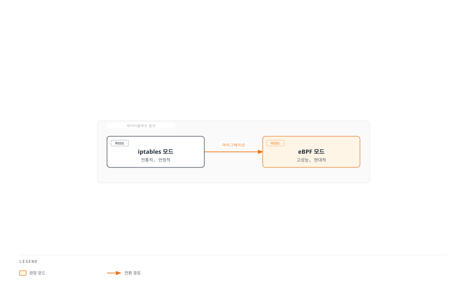
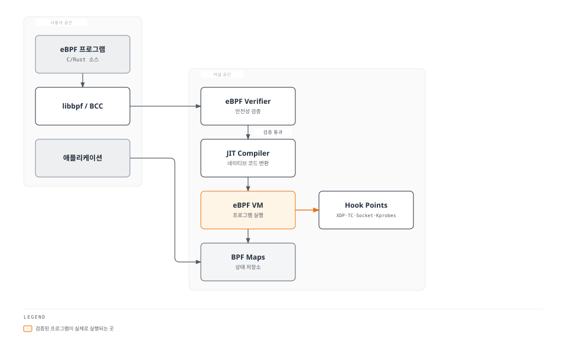
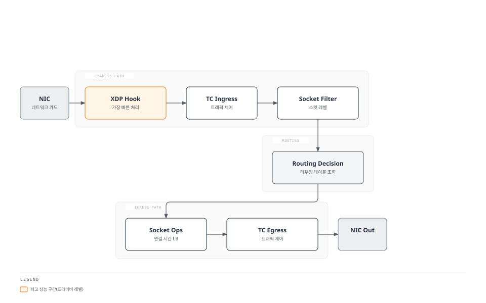
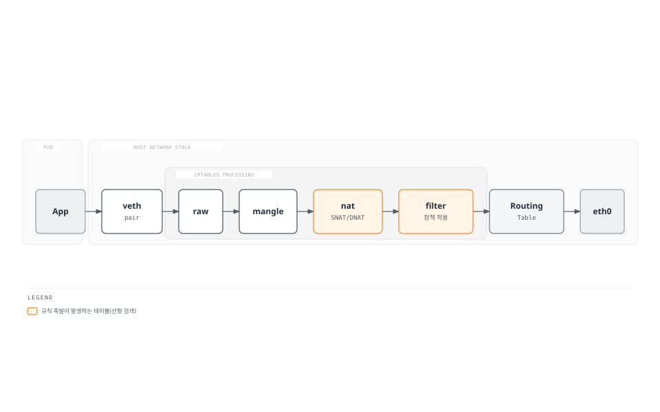
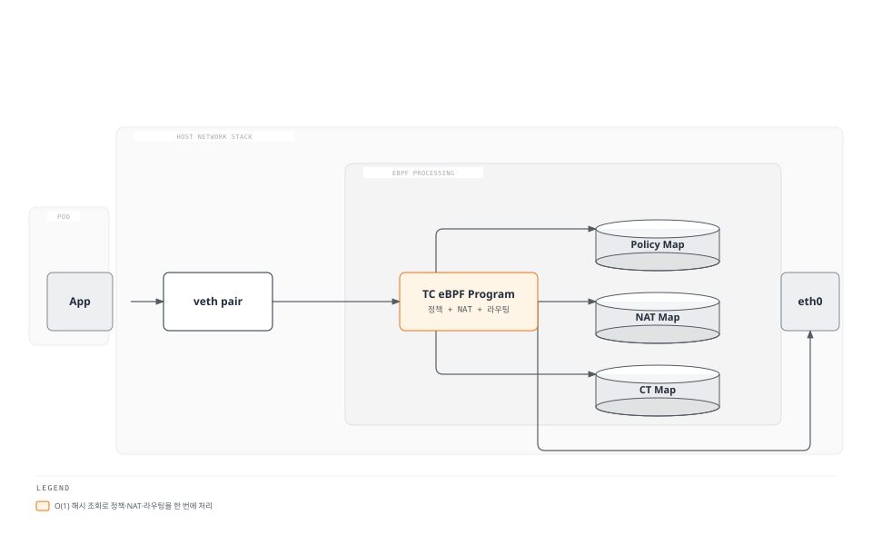
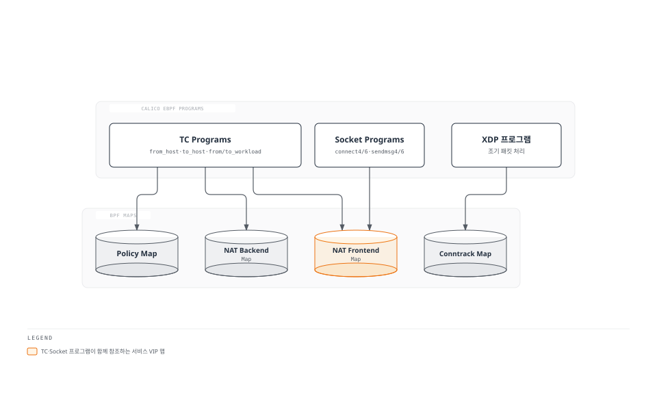
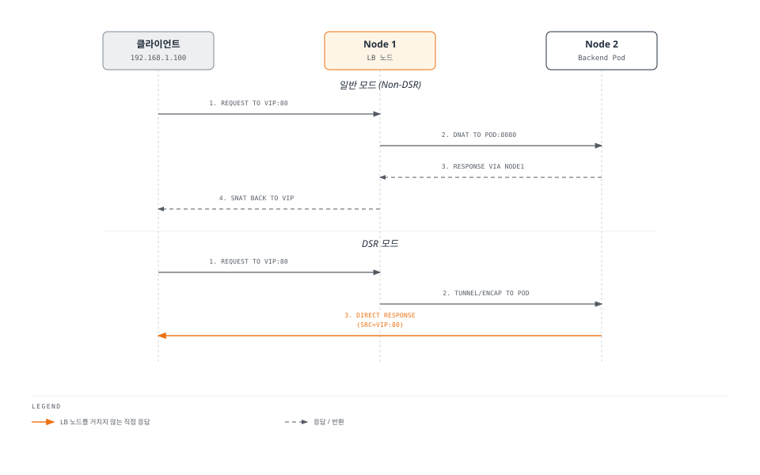
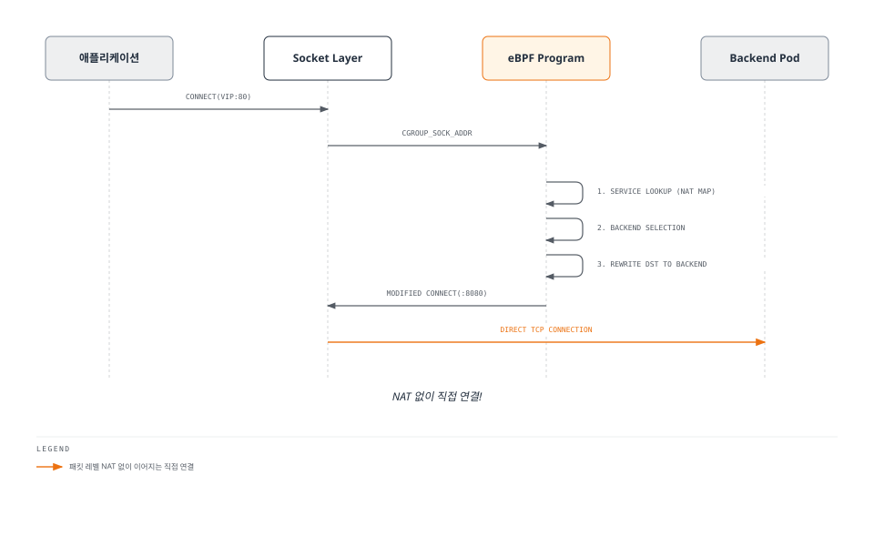
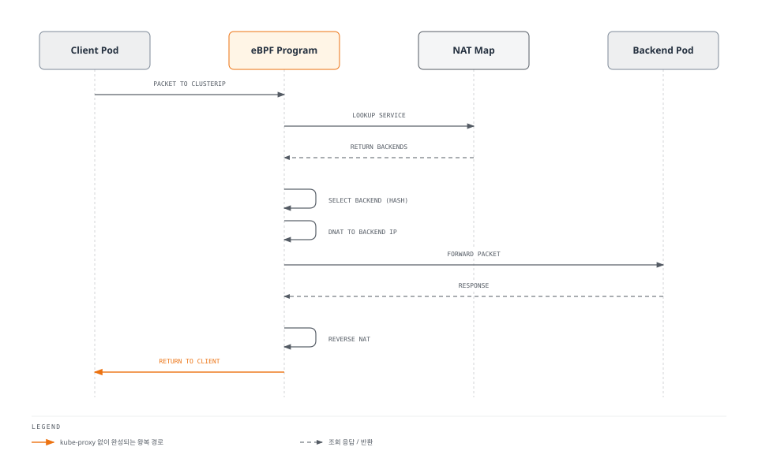

# Part 6: eBPF 데이터플레인

> **지원 버전**: Calico v3.29+ / Kubernetes 1.28+ / Linux Kernel 5.3+ **마지막 업데이트**: 2026년 2월 23일

## 개요

Calico는 전통적인 iptables 기반 데이터플레인과 함께 현대적인 eBPF 기반 데이터플레인을 제공합니다. eBPF 모드는 더 높은 성능, 더 낮은 지연 시간, 그리고 kube-proxy 없이도 Kubernetes 서비스를 처리할 수 있는 능력을 제공합니다.

이 문서에서는 eBPF의 기본 개념부터 Calico에서의 활용, 마이그레이션 방법, 그리고 성능 최적화까지 심층적으로 다룹니다.



## eBPF 기본 개념

### eBPF란?

eBPF(extended Berkeley Packet Filter)는 Linux 커널 내에서 샌드박스된 프로그램을 실행할 수 있게 해주는 기술입니다. 커널을 수정하거나 모듈을 로드하지 않고도 커널의 동작을 확장할 수 있습니다.



### eBPF 핵심 구성 요소

| 구성 요소                | 역할       | 설명                 |
| -------------------- | -------- | ------------------ |
| **Verifier**         | 안전성 검증   | 무한 루프, 메모리 위반 방지   |
| **JIT Compiler**     | 성능 최적화   | 바이트코드를 네이티브 코드로 변환 |
| **BPF Maps**         | 데이터 저장   | 커널-사용자 공간 데이터 공유   |
| **Helper Functions** | 커널 기능 접근 | 안전한 커널 API 호출      |
| **Hook Points**      | 실행 지점    | XDP, TC, Socket 등  |

### eBPF Hook Points



**Hook Point별 특징:**

| Hook Point     | 위치         | 성능 | 컨텍스트    | 사용 사례          |
| -------------- | ---------- | -- | ------- | -------------- |
| **XDP**        | 드라이버 레벨    | 최고 | 제한적     | DDoS 방어, 패킷 드롭 |
| **TC Ingress** | 네트워크 스택 진입 | 높음 | 풍부함     | NAT, 정책, 라우팅   |
| **TC Egress**  | 네트워크 스택 출구 | 높음 | 풍부함     | NAT, 정책, 터널링   |
| **Socket Ops** | 소켓 레벨      | 보통 | 소켓 정보   | 연결 시간 LB       |
| **Cgroup**     | cgroup 레벨  | 보통 | 컨테이너 정보 | 컨테이너별 정책       |

## Calico eBPF vs iptables 아키텍처


### iptables 모드 아키텍처



**iptables 모드의 문제점:**

1. **선형 검색**: 규칙이 많아질수록 성능 저하
2. **규칙 증가**: 서비스/엔드포인트 수에 비례하여 규칙 폭발
3. **높은 지연**: 체인 순회에 따른 오버헤드
4. **복잡한 NAT**: kube-proxy의 NAT 규칙 복잡성

### eBPF 모드 아키텍처



**eBPF 모드의 장점:**

1. **O(1) 검색**: BPF Map을 통한 해시 기반 검색
2. **단일 처리 경로**: 정책, NAT, 라우팅을 한 번에 처리
3. **낮은 지연**: 커널 내 최적화된 실행
4. **kube-proxy 대체**: 내장 서비스 처리

### 성능 비교

```
┌─────────────────────────────────────────────────────────────────┐
│                    처리량 비교 (패킷/초)                          │
├─────────────────────────────────────────────────────────────────┤
│                                                                 │
│  iptables  ████████████████████░░░░░░░░░░░░░░░░░  1.2M pps     │
│                                                                 │
│  eBPF      ████████████████████████████████████░  2.0M pps     │
│                                                                 │
│            0        0.5M      1.0M      1.5M      2.0M          │
└─────────────────────────────────────────────────────────────────┘

┌─────────────────────────────────────────────────────────────────┐
│                    지연 시간 비교 (마이크로초)                     │
├─────────────────────────────────────────────────────────────────┤
│                                                                 │
│  iptables  ████████████████████████████████████░  120 µs       │
│                                                                 │
│  eBPF      ████████████████████░░░░░░░░░░░░░░░░░   75 µs       │
│                                                                 │
│            0        30        60        90       120            │
└─────────────────────────────────────────────────────────────────┘

┌─────────────────────────────────────────────────────────────────┐
│                    CPU 사용량 비교 (%)                           │
├─────────────────────────────────────────────────────────────────┤
│                                                                 │
│  iptables  ████████████████████████████░░░░░░░░░  70%          │
│  (1000 svc)                                                     │
│                                                                 │
│  eBPF      ████████████░░░░░░░░░░░░░░░░░░░░░░░░░  30%          │
│  (1000 svc)                                                     │
│                                                                 │
│            0%       25%       50%       75%      100%           │
└─────────────────────────────────────────────────────────────────┘
```

**상세 성능 비교표:**

| 항목                     | iptables     | eBPF     | 개선율   |
| ---------------------- | ------------ | -------- | ----- |
| **처리량**                | 1.2M pps     | 2.0M pps | +67%  |
| **지연 시간**              | 120µs        | 75µs     | -38%  |
| **CPU 사용량 (1000 서비스)** | 70%          | 30%      | -57%  |
| **메모리 사용량**            | 높음 (규칙 수 비례) | 낮음 (일정)  | 가변    |
| **규칙 확장성**             | O(n) 검색      | O(1) 검색  | 크게 향상 |
| **연결 설정 시간**           | 느림           | 빠름       | -50%  |

## Calico eBPF 프로그램 구조

### 주요 eBPF 프로그램

Calico는 다양한 eBPF 프로그램을 사용하여 네트워킹 기능을 구현합니다:



### BPF Map 구조

```yaml
# Calico가 사용하는 주요 BPF Maps

# 1. Policy Map - 네트워크 정책 규칙 저장
# Key: (src_ip, dst_ip, protocol, port)
# Value: (action, log, tier_data)

# 2. NAT Frontend Map - 서비스 VIP 매핑
# Key: (vip, port, protocol)
# Value: (backend_count, affinity_timeout, flags)

# 3. NAT Backend Map - 백엔드 엔드포인트
# Key: (service_id, backend_id)
# Value: (pod_ip, port, node_ip)

# 4. Conntrack Map - 연결 추적
# Key: (5-tuple: src_ip, dst_ip, src_port, dst_port, protocol)
# Value: (state, nat_info, timestamp, counters)

# 5. Affinity Map - 세션 어피니티
# Key: (client_ip, service_id)
# Value: (backend_id, timestamp)

# 6. Route Map - 라우팅 정보
# Key: (destination_cidr)
# Value: (next_hop, interface, flags)
```

## Direct Server Return (DSR)

DSR은 로드밸런서 응답 트래픽이 로드밸런서를 거치지 않고 직접 클라이언트로 전송되는 방식입니다.

### DSR 동작 원리



### DSR 모드 비교

| 항목           | Non-DSR    | DSR         |
| ------------ | ---------- | ----------- |
| **응답 경로**    | LB 노드 경유   | 직접 클라이언트로   |
| **LB 노드 부하** | 양방향 트래픽 처리 | 요청만 처리      |
| **지연 시간**    | 높음 (추가 홉)  | 낮음          |
| **비대칭 라우팅**  | 없음         | 있음          |
| **MTU 고려**   | 불필요        | 터널링 오버헤드 고려 |

### DSR 설정

```yaml
apiVersion: projectcalico.org/v3
kind: FelixConfiguration
metadata:
  name: default
spec:
  bpfEnabled: true

  # DSR 모드 활성화
  # - Tunnel: IP-in-IP 터널 사용
  # - DSR: 직접 반환 (소스 IP를 VIP로 설정)
  bpfExternalServiceMode: "DSR"

  # 또는 Tunnel 모드 (호환성 더 좋음)
  # bpfExternalServiceMode: "Tunnel"
```

## Connect-Time Load Balancing

연결 시점에 로드밸런싱을 수행하여 성능을 최적화합니다.

### 동작 원리



**Connect-Time LB의 장점:**

1. **NAT 우회**: 패킷 레벨 NAT 불필요
2. **conntrack 감소**: 연결 추적 엔트리 감소
3. **성능 향상**: 패킷당 처리 오버헤드 제거
4. **지연 감소**: 직접 연결로 홉 감소

### 설정

```yaml
apiVersion: projectcalico.org/v3
kind: FelixConfiguration
metadata:
  name: default
spec:
  bpfEnabled: true

  # Connect-Time Load Balancing 활성화
  bpfConnectTimeLoadBalancingEnabled: true

  # ClusterIP 서비스에 대해서도 적용
  bpfHostNetworkedNATWithoutCTLB: Enabled
```

## XDP 가속

XDP(eXpress Data Path)는 네트워크 드라이버 레벨에서 패킷을 처리하여 최고의 성능을 제공합니다.

### XDP 모드

| 모드          | 설명          | 성능    | 호환성        |
| ----------- | ----------- | ----- | ---------- |
| **Native**  | 드라이버 내장 XDP | 최고    | 드라이버 지원 필요 |
| **Generic** | 커널 네트워크 스택  | 낮음    | 모든 드라이버    |
| **Offload** | NIC 하드웨어    | 매우 높음 | 특정 NIC만    |

### XDP 설정

```yaml
apiVersion: projectcalico.org/v3
kind: FelixConfiguration
metadata:
  name: default
spec:
  bpfEnabled: true

  # XDP 가속 활성화
  # - Disabled: XDP 비활성화
  # - Enabled: Native XDP 시도, 실패 시 Generic
  # - BestEffort: Native 지원 인터페이스에만 적용
  xdpEnabled: true

  # XDP 프로그램 새로고침 간격
  xdpRefreshInterval: 90s
```

### XDP 지원 확인

```bash
# 드라이버 XDP 지원 확인
ethtool -i eth0 | grep driver

# XDP 프로그램 로드 상태 확인
ip link show eth0 | grep xdp

# bpftool로 XDP 프로그램 확인
bpftool net show
```

## eBPF 모드 요구사항

### 시스템 요구사항

| 요구사항          | 최소              | 권장      | 비고                         |
| ------------- | --------------- | ------- | -------------------------- |
| **Linux 커널**  | 5.3             | 5.8+    | 5.10+ LTS 권장               |
| **아키텍처**      | x86\_64 / ARM64 | x86\_64 | ARM64 완전 지원                |
| **BTF 지원**    | 필수              | 필수      | CONFIG\_DEBUG\_INFO\_BTF=y |
| **BPF 파일시스템** | 필수              | 필수      | /sys/fs/bpf 마운트            |
| **cgroup v2** | 권장              | 권장      | Connect-time LB용           |

### 커널 설정 확인

```bash
# 커널 버전 확인
uname -r

# BTF 지원 확인
ls /sys/kernel/btf/vmlinux

# BPF 파일시스템 마운트 확인
mount | grep bpf

# cgroup v2 확인
mount | grep cgroup2

# 커널 설정 확인 (일부 배포판)
cat /boot/config-$(uname -r) | grep -E "(BPF|BTF)"

# 필요한 커널 옵션들
# CONFIG_BPF=y
# CONFIG_BPF_SYSCALL=y
# CONFIG_BPF_JIT=y
# CONFIG_BPF_JIT_ALWAYS_ON=y
# CONFIG_DEBUG_INFO_BTF=y
# CONFIG_CGROUPS=y
# CONFIG_CGROUP_BPF=y
```

### 지원 환경

```yaml
# 지원되는 Kubernetes 환경
지원됨:
  - 자체 관리형 Kubernetes (kubeadm, kubespray)
  - Amazon EKS (커널 5.4+)
  - Google GKE (Ubuntu 노드)
  - Azure AKS (Ubuntu 노드)
  - Red Hat OpenShift 4.8+

제한적 지원:
  - 이전 커널 버전의 관리형 서비스
  - Windows 노드 (eBPF 미지원)
  - 특정 클라우드 CNI 조합
```

## iptables → eBPF 마이그레이션

### 마이그레이션 전 체크리스트

* [ ] 커널 버전 5.3+ 확인
* [ ] BTF 지원 확인
* [ ] /sys/fs/bpf 마운트 확인
* [ ] 모든 노드 동일 커널 버전
* [ ] 백업 및 롤백 계획 수립
* [ ] 테스트 환경에서 검증

### 단계별 마이그레이션

#### Step 1: 환경 검증

```bash
# 모든 노드에서 커널 버전 확인
kubectl get nodes -o wide

# BTF 지원 확인 (각 노드에서)
kubectl debug node/<node-name> -it --image=busybox -- ls /sys/kernel/btf/vmlinux

# BPF 파일시스템 마운트 확인
kubectl debug node/<node-name> -it --image=busybox -- mount | grep bpf
```

#### Step 2: Calico 업그레이드 (필요시)

```bash
# Calico 버전 확인
kubectl get deployment -n calico-system calico-kube-controllers -o jsonpath='{.spec.template.spec.containers[0].image}'

# 최신 버전으로 업그레이드 (Helm 사용 시)
helm upgrade calico projectcalico/tigera-operator \
  --namespace tigera-operator \
  --version v3.29.0
```

#### Step 3: eBPF 모드 활성화

```yaml
# FelixConfiguration 업데이트
apiVersion: projectcalico.org/v3
kind: FelixConfiguration
metadata:
  name: default
spec:
  # eBPF 데이터플레인 활성화
  bpfEnabled: true

  # 데이터 인터페이스 패턴
  bpfDataIfacePattern: "^(en.*|eth.*|ens.*|eno.*|enp.*)"

  # kube-proxy iptables 규칙 정리
  bpfKubeProxyIptablesCleanupEnabled: true

  # 외부 서비스 모드 (DSR 또는 Tunnel)
  bpfExternalServiceMode: "Tunnel"

  # Connect-time Load Balancing
  bpfConnectTimeLoadBalancingEnabled: true

  # 로그 레벨
  bpfLogLevel: "Info"
```

```bash
# FelixConfiguration 적용
calicoctl apply -f felix-ebpf.yaml

# 또는 kubectl patch 사용
kubectl patch felixconfiguration default --type=merge \
  -p '{"spec":{"bpfEnabled":true}}'
```

#### Step 4: kube-proxy 비활성화

```bash
# 옵션 1: DaemonSet nodeSelector 변경 (권장 - 롤백 용이)
kubectl patch ds -n kube-system kube-proxy \
  -p '{"spec": {"template": {"spec": {"nodeSelector": {"non-existing-label": "true"}}}}}'

# 옵션 2: DaemonSet 삭제 (주의 필요)
kubectl delete ds kube-proxy -n kube-system

# 옵션 3: replicas를 0으로 (Deployment인 경우)
kubectl scale deployment -n kube-system kube-proxy --replicas=0
```

#### Step 5: 검증

```bash
# Calico 노드 상태 확인
kubectl get pods -n calico-system -l k8s-app=calico-node

# eBPF 프로그램 로드 확인
kubectl exec -n calico-system <calico-node-pod> -c calico-node -- \
  bpftool prog list

# BPF Map 확인
kubectl exec -n calico-system <calico-node-pod> -c calico-node -- \
  bpftool map list

# 서비스 연결 테스트
kubectl run test --rm -it --image=busybox -- wget -qO- http://kubernetes.default.svc/healthz

# Felix 로그 확인
kubectl logs -n calico-system -l k8s-app=calico-node -c calico-node | grep -i bpf
```

### 롤백 절차

```bash
# Step 1: eBPF 비활성화
kubectl patch felixconfiguration default --type=merge \
  -p '{"spec":{"bpfEnabled":false}}'

# Step 2: kube-proxy 복구
kubectl patch ds -n kube-system kube-proxy \
  -p '{"spec": {"template": {"spec": {"nodeSelector": null}}}}'

# Step 3: 노드 재시작 (깨끗한 상태 보장)
# 프로덕션에서는 롤링 방식으로 진행
```

## eBPF 디버깅

### bpftool 사용

```bash
# eBPF 프로그램 목록
bpftool prog list

# 특정 프로그램 상세 정보
bpftool prog show id <prog_id>

# 프로그램 바이트코드 덤프
bpftool prog dump xlated id <prog_id>

# JIT 컴파일된 코드 덤프
bpftool prog dump jited id <prog_id>

# BPF Map 목록
bpftool map list

# Map 내용 덤프
bpftool map dump id <map_id>

# 특정 키 조회
bpftool map lookup id <map_id> key <hex_key>

# 네트워크 인터페이스에 연결된 프로그램
bpftool net show

# perf 이벤트 프로그램
bpftool perf list
```

### TC 필터 확인

```bash
# TC 필터 목록 (ingress)
tc filter show dev eth0 ingress

# TC 필터 목록 (egress)
tc filter show dev eth0 egress

# qdisc 정보
tc qdisc show dev eth0

# 상세 통계
tc -s filter show dev eth0 ingress
```

### Felix 로그 분석

```bash
# BPF 관련 로그만 필터링
kubectl logs -n calico-system -l k8s-app=calico-node -c calico-node | grep -i bpf

# 에러 로그 확인
kubectl logs -n calico-system -l k8s-app=calico-node -c calico-node | grep -i error

# 정책 적용 로그
kubectl logs -n calico-system -l k8s-app=calico-node -c calico-node | grep -i policy

# 실시간 로그 모니터링
kubectl logs -n calico-system -l k8s-app=calico-node -c calico-node -f
```

### Conntrack 확인

```bash
# eBPF conntrack 테이블 덤프
kubectl exec -n calico-system <calico-node-pod> -c calico-node -- \
  calico-node -bpf conntrack dump

# conntrack 통계
kubectl exec -n calico-system <calico-node-pod> -c calico-node -- \
  calico-node -bpf counters dump
```

### 일반적인 문제 해결

```bash
# 문제: Pod 간 통신 실패
# 해결: 라우팅 및 정책 확인
kubectl exec -n calico-system <calico-node-pod> -c calico-node -- \
  calico-node -bpf routes dump

# 문제: 서비스 접근 불가
# 해결: NAT map 확인
kubectl exec -n calico-system <calico-node-pod> -c calico-node -- \
  calico-node -bpf nat dump

# 문제: 높은 지연 시간
# 해결: BPF 프로그램 통계 확인
bpftool prog show id <prog_id> --json | jq '.run_cnt, .run_time_ns'
```

## kube-proxy 대체 모드

### 완전한 kube-proxy 대체

Calico eBPF는 kube-proxy의 모든 기능을 대체할 수 있습니다:

| kube-proxy 기능    | Calico eBPF 구현   |
| ---------------- | ---------------- |
| ClusterIP 서비스    | BPF NAT Map      |
| NodePort 서비스     | BPF + XDP        |
| LoadBalancer 서비스 | BPF + DSR        |
| ExternalIP       | BPF NAT          |
| Session Affinity | BPF Affinity Map |
| IPVS 모드 기능       | BPF Hash LB      |

### 서비스 처리 흐름



### 설정 예시

```yaml
apiVersion: projectcalico.org/v3
kind: FelixConfiguration
metadata:
  name: default
spec:
  bpfEnabled: true

  # kube-proxy 대체 기능
  bpfKubeProxyIptablesCleanupEnabled: true
  bpfKubeProxyEndpointSlicesEnabled: true

  # 서비스 처리 옵션
  bpfExternalServiceMode: "Tunnel"  # 또는 "DSR"
  bpfConnectTimeLoadBalancingEnabled: true

  # 성능 튜닝
  bpfMapSizeNATFrontend: 65536
  bpfMapSizeNATBackend: 262144
  bpfMapSizeNATAffinity: 65536
  bpfMapSizeConntrack: 512000
```

## 제한사항 및 주의사항

### 알려진 제한사항

| 제한사항                             | 설명                | 대안            |
| -------------------------------- | ----------------- | ------------- |
| **externalTrafficPolicy: Local** | NodePort에서 제한적 지원 | Tunnel 모드 사용  |
| **Host-networked Pods**          | 일부 시나리오 제한        | 별도 정책 적용      |
| **IPv6 전용 클러스터**                 | 완전 지원 아님          | Dual-stack 사용 |
| **특정 커널 버전**                     | 5.3 이전 버전 미지원     | 커널 업그레이드      |
| **Windows 노드**                   | eBPF 미지원          | iptables 모드   |

### 주의사항

```yaml
# 1. externalTrafficPolicy: Local 서비스
# DSR 모드에서 주의 필요
apiVersion: v1
kind: Service
metadata:
  name: my-service
spec:
  type: LoadBalancer
  externalTrafficPolicy: Local  # eBPF DSR과 호환성 확인 필요

# 권장: Tunnel 모드 사용 또는 Cluster 정책 사용
# bpfExternalServiceMode: "Tunnel"

---
# 2. Host-networked Pod
# hostNetwork: true Pod는 별도 처리 필요
apiVersion: v1
kind: Pod
spec:
  hostNetwork: true
  # eBPF CTLB가 적용되지 않을 수 있음
```

### 성능 튜닝

```yaml
apiVersion: projectcalico.org/v3
kind: FelixConfiguration
metadata:
  name: default
spec:
  bpfEnabled: true

  # Map 크기 튜닝 (대규모 클러스터용)
  bpfMapSizeConntrack: 1000000     # 연결 수에 따라 조정
  bpfMapSizeNATFrontend: 65536    # 서비스 수에 따라 조정
  bpfMapSizeNATBackend: 262144    # 엔드포인트 수에 따라 조정
  bpfMapSizeNATAffinity: 65536    # 어피니티 사용량에 따라
  bpfMapSizeRoute: 65536          # 라우트 수에 따라

  # 로깅 최적화
  bpfLogLevel: "Warning"  # 프로덕션에서는 Warning 이상

  # Conntrack 타임아웃
  bpfConntrackTimeouts:
    tcpEstablished: 7200s
    tcpClosing: 300s
    udp: 60s
    icmp: 30s
```

***

## 참고 자료

* [Calico eBPF 공식 문서](https://docs.tigera.io/calico/latest/operations/ebpf/)
* [eBPF 소개](https://ebpf.io/)
* [Linux Kernel BPF 문서](https://www.kernel.org/doc/html/latest/bpf/)
* [Calico eBPF 성능 벤치마크](https://www.tigera.io/blog/calico-ebpf-dataplane/)

[이전: Part 5 - Network Policy 심화](05-network-policy.md) | [다음: Part 7 - 운영 및 트러블슈팅](https://github.com/Atom-oh/kubernetes-docs/blob/main/ko/networking/calico/07-operations.md) | [메인 페이지로 돌아가기](./README.md)
