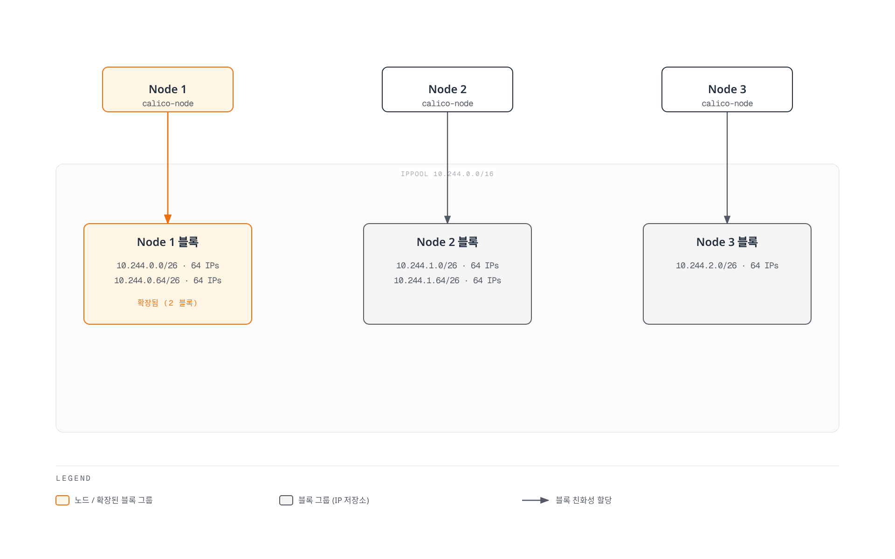
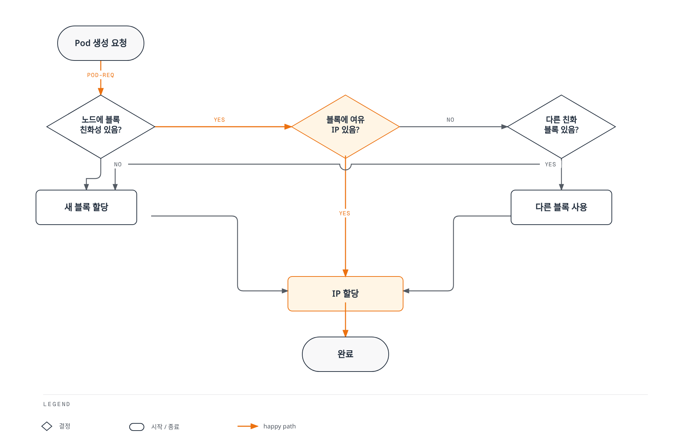
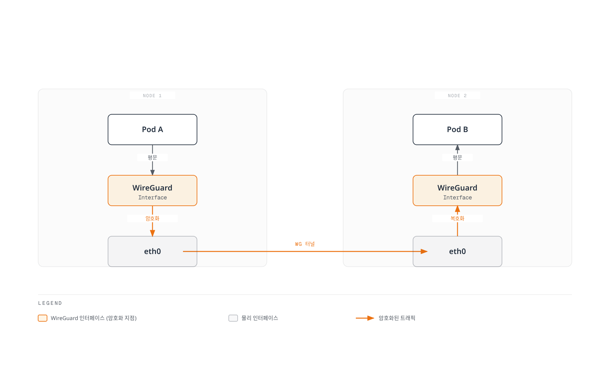
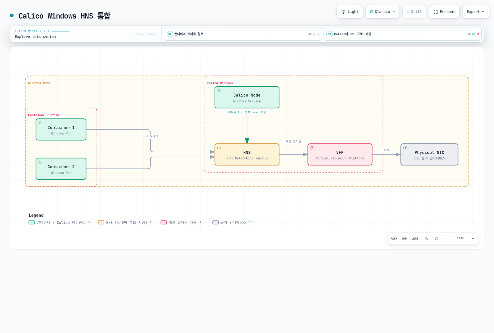
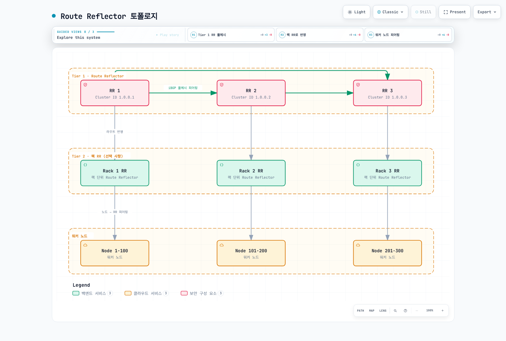

# Part 7: Calico 고급 주제

> **지원 버전**: Calico 3.32.2 / Kubernetes 1.34–1.36 (공식 테스트 범위)
> **마지막 업데이트**: 2026년 9월 12일

## 개요

이 문서에서는 Calico의 고급 기능과 대규모 프로덕션 환경에서의 활용 방법을 다룹니다. IPAM 심화, WireGuard 암호화, Egress Gateway, 멀티 클러스터 페더레이션, Windows 지원, 그리고 대규모 클러스터 설계에 대해 상세히 알아봅니다.

## IPAM 심화

이 절은 **Calico IPAM**을 설명합니다. Host-local과 클라우드 제공자 IPAM은 다른 할당자이며 IPPool 객체를 만드는 것만으로 다른 CNI가 Calico IPAM으로 바뀌지 않습니다.

### 블록·어피니티·할당 제한

Calico는 노드와 연결된 블록에서 주소를 할당합니다. IPv4 `/26`과 IPv6 `/122`는 각각 주소 64개를 포함하지만 모든 플랫폼에서 Pod 64개가 사용 가능하다는 뜻은 아닙니다. Windows는 Calico 소유 블록당 주소 네 개를 예약합니다.



[🔍 인터랙티브 다이어그램 보기](https://www.atomai.click/kubernetes-docs/archmaps/ko-networking-calico-07-advanced-topics-0.html)

> 그림은 할당 모델이며 모든 데이터스토어 쓰기를 없애는 노드 로컬 캐시를 의미하지 않습니다. 마지막 Pod가 없어져도 터널·VM 할당과 조정/lifecycle 상태 때문에 블록 어피니티가 즉시 해제되는 것은 아닙니다.

일반적인 자동 할당은 기존 어피니티 블록, 새 적합 블록, 허용된 차용을 사용합니다. `strictAffinity`, `autoAllocateBlocks`, 전역/요청별 블록 제한, 풀 선택, 플랫폼 제약 때문에 다른 풀에 여유 IP가 있어도 실패할 수 있습니다.



[🔍 인터랙티브 다이어그램 보기](https://www.atomai.click/kubernetes-docs/archmaps/ko-networking-calico-07-advanced-topics-1.html)

> 단순화한 흐름은 적합한 풀·자동 블록 할당·허용된 차용·제한에 걸리지 않는 상황을 가정합니다. Windows는 차용을 지원하지 않으며 전체 주소가 고갈되어야만 실패한다는 보장이 아닙니다.

전역 설정은 `IPAMConfiguration/default`를 확인하세요. 웹 참고 문서에는 기본 제한 20이 적혀 있지만 **3.32.2 릴리스 구현과 공개 CRD는 설정이 없을 때 `maxBlocksPerHost: 0`을 생성**합니다. 0은 전역 블록 제한이 없다는 뜻이며 요청별·플랫폼 제한은 남습니다. 기존 클러스터의 설정값도 유지됩니다. 검토한 IPAM 설정 경로에서는 양수 전역 제한에 `strictAffinity: true`가 필요합니다.

### 풀 생성 전에 blockSize 선택

기본값은 IPv4 `/26`, IPv6 `/122`이며 범위는 IPv4 `/20`–`/32`, IPv6 `/116`–`/128`입니다. GPU 대역폭이나 “200노드 이상이면 /28” 같은 공식이 아니라 예상 주소 수, 노드 수, 경로 집계, 할당 오버헤드로 선택하세요.

```yaml
# Fresh-pool example; do not apply over an existing pool or overlapping pools.
apiVersion: projectcalico.org/v3
kind: IPPool
metadata:
  name: demo-ipv4-pool
spec:
  cidr: 10.244.0.0/16
  blockSize: 26
  ipipMode: Never
  vxlanMode: Always
  natOutgoing: true
  nodeSelector: all()
```

기존 풀의 `blockSize`와 CIDR은 변경할 수 없습니다. 새 풀과 마이그레이션은 실제 라우팅, Service/노드 CIDR 경계, 워크로드 할당 계획을 보존해야 합니다. [네트워킹 모드](03-networking-modes.md)를 참고하고 위 집계 풀과 아래 하위 풀을 겹치게 생성하지 마세요.

### Host-Local IPAM

Host-local은 노드 로컬 할당 상태와 Kubernetes가 제공하는 노드별 PodCIDR 구성을 사용합니다. operator의 선택 필드는 **`spec.cni.ipam.type: HostLocal`**입니다.

```yaml
# Installation fragment: preserve other settings through the configuration owner.
apiVersion: operator.tigera.io/v1
kind: Installation
metadata:
  name: default
spec:
  cni:
    type: Calico
    ipam:
      type: HostLocal
```

`calicoNetwork.hostLocalIPAMEnabled`라는 스위치는 없습니다. Kubernetes controller/네트워크 설정이 유효하고 서로 다른 노드 PodCIDR을 제공해야 합니다. 기존 Node를 수동 patch하는 것은 IPAM 마이그레이션 절차가 아닙니다. 두 할당자의 IP 해제 속도·확장성에 보편적인 순위를 매기지 마세요.

### 여러 풀과 명시적 요청

목적을 정한 서로 겹치지 않는 풀을 사용합니다. 세 번째 풀은 manual-only로 설정하여 일반 워크로드가 자동으로 비-SNAT 범위를 소비하지 않게 합니다.

```yaml
# Alternative to demo-ipv4-pool; these sub-pools must not overlap another pool.
apiVersion: projectcalico.org/v3
kind: IPPool
metadata:
  name: production-pool
spec:
  cidr: 10.244.0.0/18
  blockSize: 26
  vxlanMode: Always
  natOutgoing: true
  nodeSelector: node-type == 'production'
---
apiVersion: projectcalico.org/v3
kind: IPPool
metadata:
  name: development-pool
spec:
  cidr: 10.244.64.0/18
  blockSize: 28
  vxlanMode: Always
  natOutgoing: true
  nodeSelector: node-type == 'development'
---
apiVersion: projectcalico.org/v3
kind: IPPool
metadata:
  name: routed-workloads-pool
spec:
  cidr: 10.244.128.0/18
  blockSize: 26
  ipipMode: Never
  vxlanMode: Never
  natOutgoing: false
  assignmentMode: Manual
  allowedUses: [Workload]
```

`natOutgoing: false`에는 외부 반환 경로가 필요하고 이후의 upstream NAT가 적용될 수도 있습니다. Egress Gateway나 namespace별 고정 SNAT를 생성하지는 않습니다. LoadBalancer 주소 할당은 [BGP 가이드](04-bgp-deep-dive.md)의 별도 `allowedUses: [LoadBalancer]` 절차를 사용하세요.

아래 Pod에는 준비한 namespace·노드 레이블과 placeholder를 대체할 검토된 워크로드 이미지가 필요합니다.

```yaml
apiVersion: v1
kind: Pod
metadata:
  name: production-app
  namespace: calico-demo
  annotations:
    cni.projectcalico.org/ipv4pools: '["production-pool"]'
spec:
  nodeSelector:
    node-type: production
  containers:
    - name: app
      image: registry.example.com/team/app:approved
```

annotation은 IPPool을 요청하고 Pod의 `nodeSelector`는 스케줄링을 제어합니다. 검토한 Calico IPAM 코드에서 명시적 풀 요청은 호환성을 위해 풀의 node/namespace selector를 건너뛰므로 **권한 경계가 아닙니다**. 비활성화되었거나 없는 풀은 실패합니다. namespace annotation으로 기본 풀을 지정할 수 있지만 네트워크 정책을 대체하지 않습니다.

### IPv6와 Dual Stack

Kubernetes, CNI/IPAM, 노드 주소, underlay가 선택한 IP family를 이미 지원해야 합니다. 풀이나 Felix flag만 추가해 클러스터 IP-family 구성을 전환하지 못합니다.

```yaml
# A separate fresh dual-stack example.
apiVersion: projectcalico.org/v3
kind: IPPool
metadata:
  name: dual-ipv4-pool
spec:
  cidr: 10.244.0.0/16
  blockSize: 26
  vxlanMode: Always
  natOutgoing: true
---
apiVersion: projectcalico.org/v3
kind: IPPool
metadata:
  name: dual-ipv6-pool
spec:
  cidr: fd00:10:244::/48
  blockSize: 122
  ipipMode: Never
  vxlanMode: Always
  natOutgoing: false
```

호환되는 Linux 데이터 평면은 IPv6 VXLAN을 지원하지만 IPv6 IP-in-IP는 지원하지 않습니다. 위 ULA 주소는 IPv6라는 이유로 인터넷에서 라우팅되지 않습니다. `natOutgoing: false`에는 적절한 반환 경로나 별도 egress 설계가 필요합니다.

노드 주소 자동 감지는 operator 설정 또는 해당 설치 환경에 속하며 임의의 Felix 필드가 아닙니다.

```yaml
# Operator configuration fragment, not a replacement for the existing Installation.
apiVersion: operator.tigera.io/v1
kind: Installation
metadata:
  name: default
spec:
  calicoNetwork:
    nodeAddressAutodetectionV4:
      kubernetes: NodeInternalIP
    nodeAddressAutodetectionV6:
      kubernetes: NodeInternalIP
```

Felix의 `ipv6Support`는 `Enabled`가 아닌 boolean입니다. Felix 처리를 제어할 뿐 전체 dual-stack 전제를 대신하지 않습니다.

### 주소 해제 전 고갈 원인 확인

```bash
kubectl get ipamconfigurations.projectcalico.org default -o yaml
calicoctl ipam show
calicoctl ipam show --show-blocks
calicoctl ipam check --show-problem-ips -o ipam-report.json
```

풀 자격, 예약, 어피니티, 노드별 제한, 실제 워크로드·터널·VM 소유 상태를 확인하세요. 예시가 orphaned라고 부른다는 이유만으로 주소를 해제하지 않습니다. 검토한 CLI에는 `calicoctl ipam release --block` 옵션이 없습니다.

release 도구는 `--from-report`와 여러 보고서의 교집합을 지원합니다. 하나 이상은 새 보고서여야 하며 보고서 기반 처리는 allocation sequence 정보도 사용합니다. 보고된 할당을 확인한 뒤 해당 버전의 복구 절차를 따르세요. `--force`, IPAMBlock/BlockAffinity 직접 삭제, 임의 단일 IP 해제를 일반적인 고갈 해결책으로 사용하지 않습니다.

## 노드와 연결된 CIDR 블록 조회

`BlockAffinity`는 Calico IPAM이 관리하며 상태·노드·CIDR·삭제 여부·어피니티 유형을 표시합니다. `Node.spec.podCIDR`과 동일하지 않으며 차용·이동 주소가 있을 때 모든 호스트 경로를 표현하지도 않습니다.

```bash
kubectl get blockaffinities.projectcalico.org \
  -o custom-columns='NAME:.metadata.name,CIDR:.spec.cidr,NODE:.spec.node,STATE:.spec.state,DELETED:.spec.deleted,TYPE:.spec.type'
kubectl get ippools.projectcalico.org \
  -o custom-columns='NAME:.metadata.name,CIDR:.spec.cidr,BLOCK_SIZE:.spec.blockSize'

# Review active host affinities; exclude deletion states and virtual affinities.
kubectl get blockaffinities.projectcalico.org -o json | jq -r \
  '.items[] | select(.spec.state == "confirmed" and .spec.deleted != true and ((.spec.type // "") == "" or .spec.type == "host")) | [.spec.cidr, .spec.node] | @tsv'
```

이 출력은 현황이며 즉시 실행할 `ip route add` 목록이 아닙니다. 실제 node next hop, 할당 상태, 풀 export/encapsulation 규칙, more-specific 경로가 필요합니다. placeholder 노드 IP나 모든 affinity 레코드만으로 유효한 정적 라우팅 계획을 만들 수 없습니다.

**EKS Hybrid Nodes**의 [전용 CNI 가이드](https://docs.aws.amazon.com/eks/latest/userguide/hybrid-nodes-cni.html)는 AWS 유지 Cilium 빌드를 문서화하고 Calico 예시를 Hybrid Examples 저장소로 안내합니다. 한편 AWS [일반 대체 CNI 문서](https://docs.aws.amazon.com/eks/latest/userguide/alternate-cni-plugins.html)는 여전히 Hybrid Nodes에서 Cilium/Calico 핵심 기능 지원을 설명합니다. 두 문서에서 일관된 Calico 버전별 지원 매트릭스를 확인할 수 없으므로 예시 이동만으로 지원 종료를 추론하지 마세요. 계획한 배포판·기능·지원 주체를 확인해야 하며, 이 절은 Hybrid 설치 레시피가 아닌 Calico IPAM 현황 확인입니다.

## WireGuard 암호화

WireGuard는 **기능을 지원하고 설정한 노드 사이**의 지원 트래픽을 보호합니다. 애플리케이션 간 TLS가 아니며 같은 노드의 Pod 트래픽은 이 노드 간 터널을 지나지 않습니다. WireGuard를 지원하지 않는 노드와의 트래픽은 암호화되지 않을 수 있으므로 실제 CNI, IP family, 워크로드/호스트 경로를 검증해야 합니다.



[🔍 인터랙티브 다이어그램 보기](https://www.atomai.click/kubernetes-docs/archmaps/ko-networking-calico-07-advanced-topics-2.html)

> 그림의 “평문”은 로컬 구간에 WireGuard 터널 보호가 적용되지 않는다는 의미이며 애플리케이션은 별도로 TLS를 사용할 수 있습니다. 예시는 IPv4 기본 포트 51820이며 IPv6에는 별도 인터페이스·포트 설정이 있습니다.

### 필요한 IP Family만 활성화

```yaml
# Example for an already compatible dual-stack Linux deployment.
apiVersion: projectcalico.org/v3
kind: FelixConfiguration
metadata:
  name: default
spec:
  wireguardEnabled: true
  wireguardEnabledV6: true
```

IPv4에는 `wireguardEnabled`, 실제 활성화된 IPv6 경로에는 `wireguardEnabledV6`를 사용합니다. 필드가 있다는 이유만으로 IPv6를 켜지 마세요. 설정 소유자를 통해 다른 Felix 값을 보존하고 양쪽 peer의 커널 지원을 확인합니다. operator IPPool encapsulation에 `WireguardCrossSubnet`이라는 값은 없습니다.

실제 underlay/캡슐화 경로에 별도 값이 필요한 경우가 아니면 MTU 자동 감지를 유지하세요. IPv4 underlay 1500과 WireGuard 오버헤드 60이면 1440이지만 IPv6·플랫폼 경로는 다릅니다. [MTU 설명](03-networking-modes.md)에서 서로 대체하는 캡슐화 경로의 오버헤드를 무조건 합산하면 안 되는 이유를 확인하세요.

`wireguardHostEncryptionEnabled`는 지원되는 **노드 간 host-originated/hostNetwork 트래픽**을 다루며 로컬 host-to-Pod 구간 암호화 스위치가 아닙니다. 플랫폼의 지원 트래픽 범위를 확인해야 합니다.

### 키·Keepalive·상태 확인

Calico는 노드 키를 관리하고 peer에게 공개 키 정보를 제공합니다. WireGuard handshake에서 세션 키를 새로 유도하는 동작과 관리자가 정한 노드 identity 키 교체 정책은 별개입니다.

Persistent keepalive는 유휴 중 NAT/방화벽 상태를 유지합니다. 알려진 25 **초** 예시는 키 로테이션 간격이 아닙니다. 검토한 Open Source Felix 스키마에는 `wireguardPersistentKeepAlive`와 `wireguardPersistentKeepalive` 필드가 모두 없습니다.

```bash
# On the intended node with wireguard-tools available:
WIREGUARD_INTERFACE=wireguard.cali
wg show "$WIREGUARD_INTERFACE" public-key
wg show "$WIREGUARD_INTERFACE" latest-handshakes
wg show "$WIREGUARD_INTERFACE" endpoints
wg show "$WIREGUARD_INTERFACE" transfer
```

```bash
# Kubernetes datastore: public identity information only.
kubectl get nodes -o json | jq -r \
  '.items[] | [.metadata.name, (.metadata.annotations["projectcalico.org/WireguardPublicKey"] // "-"), (.metadata.annotations["projectcalico.org/WireguardPublicKeyV6"] // "-")] | @tsv'
```

IP family에 맞는 실제 인터페이스를 선택하세요. 공개 키·handshake·바이트 카운터는 진단 자료이지만 모든 애플리케이션 흐름의 암호화를 증명하지 않습니다. 의도한 트래픽 경로와 암호화된 전송을 확인하세요. `calicoctl node status`는 WireGuard 상태 표가 아니며 이 확인을 위해 개인 키를 출력할 필요도 없습니다.

### 보존한 성능 보고 기록

이전 두 언어 문서는 서로 다른 검증되지 않은 수치를 제시했습니다. 측정일, 하드웨어, 가속 설정, 소프트웨어 버전, 원자료가 없으므로 현재 성능 보장이 아닌 기존 보고값으로 보존합니다.

**기록 A — 이전 영문 문서:**

| 지표 | WireGuard | IPsec (AES-GCM) |
| --- | --- | --- |
| 기준 대비 처리량 변화 | −5 to −10% | −15 to −25% |
| 추가 지연 | 0.1–0.3 ms | 0.5–1.0 ms |
| CPU 사용량 변화 | +10–15% | +30–50% |


**기록 B — 이전 한글 문서:**

| 지표 | WireGuard | IPsec (AES-GCM) |
| --- | --- | --- |
| 기준 대비 처리량 비율 | 95–98% | 85–90% |
| 기준 대비 지연 변화 | +5–10% | +15–25% |
| 정성적인 CPU 설명 | 중간 | 높음 |


기록 B는 비암호화 상태를 100% 기준으로 두고 비암호화 CPU를 낮음으로 표현했습니다. CPU 변화율이 percentage point인지 상대 변화인지도 지정하지 않았습니다. 두 기록을 같은 실험으로 합치지 마세요.

### WireGuard와 IPsec의 선택 조건

WireGuard는 제한된 암호 설계를 사용하고 IPsec은 여러 구현·알고리즘·키 관리 방식을 갖춘 프레임워크입니다. CPU, 패킷 오버헤드, 하드웨어 가속, roaming, 설정 복잡도는 구현과 실제 경로에 따라 다릅니다. 버전 없는 코드 줄 수는 보안 지표가 아니며 검토한 Open Source Felix 스키마에는 `ipsecEnabled` 필드가 없습니다.

FIPS 요구 사항은 채택할 제품의 현행 인증 기록·버전·운영 조건과 대조하세요.

## Egress Gateway

Calico Enterprise Egress Gateway는 선택한 클라이언트 트래픽을 SNAT하는 **transit Pod**입니다. 별도의 제품·플랫폼 요구 사항이 있으며 이 장 상단의 Open Source 검토 버전을 Enterprise 호환성 표로 사용하지 마세요.

경로는 클라이언트 egress 정책 → gateway Pod로 터널링 → gateway SNAT → gateway egress 정책 → 외부 네트워크입니다. 일반 NetworkPolicy Allow는 패킷을 우회시키거나 SNAT하지 않습니다. `BGPConfiguration.serviceExternalIPs`도 Service 경로 광고이지 워크로드의 egress identity 할당이 아닙니다.

### 현재 상용 설정 구조

문서화된 on-premises Calico CNI 경로에는 지원되는 Enterprise 설치, 준비된 namespace·Pod-security 권한, 라우팅되는 egress 주소, UDP 4790 연결이 필요합니다. GKE·Windows는 제외하며 AWS·Azure에는 별도 절차가 있습니다. 클라우드 CNI 구성에 아래 풀을 그대로 적용하지 마세요.

기존 default Felix 설정 소유자를 통해 `egressIPSupport`를 모든 노드에 일관되게 `EnabledPerNamespace` 또는 권한이 있는 `EnabledPerNamespaceOrPerPod`로 설정합니다. 리소스는 **`operator.tigera.io/v1` EgressGateway**이며 이미지·설정은 operator가 관리합니다. 임의의 `calico/egress-gateway` Deployment를 만들지 않습니다.

```yaml
# Calico Enterprise example, not an Open Source gateway installation.
apiVersion: projectcalico.org/v3
kind: IPPool
metadata:
  name: egress-demo-pool
spec:
  cidr: 203.0.113.0/28
  blockSize: 32
  nodeSelector: "!all()"
  natOutgoing: false
---
apiVersion: operator.tigera.io/v1
kind: EgressGateway
metadata:
  name: approved-egress
  namespace: calico-egress
spec:
  replicas: 2
  ipPools:
    - cidr: 203.0.113.0/28
  template:
    metadata:
      labels:
        egress-code: approved
    spec:
      nodeSelector:
        kubernetes.io/os: linux
---
apiVersion: v1
kind: Namespace
metadata:
  name: calico-demo
  annotations:
    egress.projectcalico.org/selector: egress-code == 'approved'
    egress.projectcalico.org/namespaceSelector: projectcalico.org/name == 'calico-egress'
```

문서용 CIDR을 소유한 실제 주소로 바꾸고 해당 네트워크의 캡슐화·라우팅을 구성하세요. `/32` 블록은 gateway마다 큰 블록을 예약하는 낭비를 줄입니다. `!all()`은 일반 자동 할당을 막지만 명시적 풀 요청은 사용할 수 있으므로 annotation 권한도 통제해야 합니다.

복제본 두 개에는 사용 가능한 IP 두 개와 적절한 노드·장애 영역 배치가 필요합니다. 복제본 수만으로 가용성을 보장하지 않습니다. Gateway 선택은 기본적으로 클라이언트 namespace 안에서 이루어지므로 다른 namespace에는 namespace selector가 필요합니다.

`natOutgoing: false`는 해당 Calico NAT 단계에서 gateway Pod IP를 유지하지만 upstream NAT가 변경할 수 있습니다. Gateway 풀의 NAT를 켜면 gateway 노드 IP가 보일 수도 있습니다. 외부 수신자가 관찰한 주소와 의도한 허용 목록을 확인하세요. Gateway 교체·업그레이드는 기존 연결을 끊을 수 있습니다.

### 정책과 Identity 경계

클라이언트 egress 정책은 **원래 외부 목적지**를 봅니다. Gateway Pod IP로의 연결만 허용해도 원래 외부 흐름이 라우팅·허가되는 것은 아닙니다. Gateway egress에서는 원래 클라이언트 identity와 source port 정보가 이미 변환되었습니다. 목적지 CIDR·port 정책은 유용하지만 해당 hook의 도메인 기반 정책은 지원하지 않습니다.

고급 `EgressGatewayPolicy`에는 목적지·gateway 선택과 `maxNextHops` 필드가 있습니다. 이전 예시의 `projectcalico.org/v3 EgressGateway`에 `maxGatewaysPerClient`를 넣는 방식이 아닙니다.

Open Source에서는 필요에 맞는 애플리케이션 proxy나 underlay/클라우드 NAT를 별도로 구성하고 허용 트래픽을 제어합니다. Bootstrap·listener·upstream 설정 없는 Envoy Pod는 작동하는 egress proxy가 아닙니다. 고정 소스 주소는 외부 허용 목록을 돕지만 자체적으로 PCI DSS/HIPAA 준수나 애플리케이션 권한 검사를 완성하지 않습니다.

## 멀티 클러스터 연결과 Federation

라우팅, endpoint identity, Service 검색을 구분하세요. BGP는 경로를 교환하지만 Kubernetes 정책·DNS 레코드를 배포하지 않습니다. Typha는 자체 배포 안의 상태를 배포하며 이전 그림처럼 대표 인스턴스가 공유 Federation Controller에 보고하는 구조가 아닙니다.

### Open Source 라우팅 연결

겹치지 않는 주소, 양방향 라우팅, 도달 가능한 next hop, 각 클러스터 정책이 필요합니다. 로컬 Calico 풀 밖의 원격 Pod CIDR로 보내면 `natOutgoing`이 SNAT하여 수신자가 보는 소스를 바꿀 수 있습니다. 적절한 NAT 제외와 라우팅을 계획하고 Pod identity가 그대로 유지된다고 가정하지 마세요.

```yaml
# Receiving cluster only, after routing/source preservation is verified.
apiVersion: projectcalico.org/v3
kind: GlobalNetworkPolicy
metadata:
  name: default.remote-client-access
spec:
  order: 100
  namespaceSelector: kubernetes.io/metadata.name == 'calico-demo'
  selector: app == 'shared-service'
  types: [Ingress]
  ingress:
    - action: Allow
      protocol: TCP
      source:
        nets: [10.245.0.0/16]
      destination:
        ports: [8080]
```

이 정책은 로컬 수신 endpoint에만 적용합니다. `GlobalNetworkPolicy`는 해당 클러스터/데이터스토어 전역 범위이지 원격 클러스터에 자동 적용되는 정책이 아닙니다. 송신 egress·수신 ingress·실제 소스 주소를 확인하세요. 정책 배포에는 명시적인 관리 절차가 필요하며 BGP·Typha가 대신하지 않습니다.

### Enterprise Federation

현재 Enterprise 가이드는 다음 기능을 구분합니다.

| 기능 | 동작 |
| --- | --- |
| Federated endpoint identity | 원격 workload/host endpoint 정보를 로컬 정책 계산의 입력으로 사용 |
| Federated Services Controller | 원격 Kubernetes API에서 Service/endpoint 정보를 읽고 선택한 로컬 federated Service 유지 |
| Multi-cluster networking | 지원되는 overlay 또는 별도로 구성한 Pod IP 라우팅 사용 |

Federated endpoint identity는 **네트워크 정책을 복제하지 않습니다**. 원격 정책이 로컬에 자동 적용되는 것이 아니며 각 클러스터의 정책은 로컬에서 적용됩니다. Pod IP 도달성과 소스 보존은 identity 및 실제 사용 가능한 원격 Service endpoint의 전제입니다.

상용 federated Service의 annotation은 Pod가 아닌 **backing Service의 레이블**을 선택합니다.

```yaml
# Commercial controller integration; backing Services already exist.
apiVersion: v1
kind: Service
metadata:
  name: catalog-federated
  namespace: calico-demo
  annotations:
    federation.tigera.io/serviceSelector: app == 'catalog'
spec:
  type: ClusterIP
  ports:
    - name: http
      protocol: TCP
      port: 8080
```

Backing Service는 선택한 클러스터에서 같은 namespace 이름에 있고 포트 **이름·프로토콜**이 일치해야 합니다. Federated Service에는 `spec.selector`를 생략하며 `targetPort`로 backing port를 선택하지 않습니다. Endpoint 레코드를 수동 관리하지 마세요.

원격 API 자격 증명, controller 설치, Kubernetes 버전·EndpointSlice 호환성, 네트워크 도달성은 별도 전제입니다. 위 예시가 이를 구성하거나 장애 전환을 검증한 것은 아닙니다. 현재 제품 절차와 실제 경로를 확인하고 문서의 2018년 Endpoints 출력 예시를 현재 배포 매니페스트로 복사하지 마세요.

## Windows 컨테이너 지원

Calico는 **HNS**로 Windows를 지원하지만 기능·플랫폼 제약이 있습니다. 제어 컴포넌트와 Typha에는 Linux 노드가 필요하며 혼합 클러스터가 Calico eBPF와 Windows를 함께 사용하는 방법은 아닙니다.

### 버전·플랫폼 교집합

Calico 3.32 테스트 범위의 Kubernetes 1.36 예시에는 양쪽이 명시한 Windows Server 2022를 사용할 수 있습니다. Kubernetes 1.36은 Server 2025도 명시하지만 Calico 요구 사항에는 이전 Server 1809와 Server 2022 항목이 남아 있습니다. 오래된 OS나 새 Kubernetes 지원 OS가 선택한 Calico·제공자 조합에서 모두 검증되었다고 가정하지 마세요. 호스트·컨테이너 base image의 OS/build와 유지보수 중인 호환 runtime/kubelet/kube-proxy 버전을 맞춰야 합니다.

Kubernetes Windows Pod는 Hyper-V 컨테이너 격리가 아닌 process isolation을 사용합니다. 현재 Calico 문서의 설치 방식은 operator가 관리하는 HostProcess 컨테이너입니다. 이전 3.29 ZIP/manual-service 예시나 오래된 runtime/kubelet 버전을 현재 설치 절차로 사용하지 마세요.

| 항목 | 현재 Calico Windows 제약 |
| --- | --- |
| 네트워크 | CrossSubnet 없는 IPv4 VXLAN 또는 지원되는 비캡슐화 BGP. IPIP 미지원 |
| VXLAN | UDP 4789. 문서 범위에서 Windows CrossSubnet·사용자 지정 VXLAN MTU 미지원 |
| IPAM | 차용 불가. Calico 소유 블록당 주소 4개 예약으로 `/26`은 Pod 주소 60개. Windows kube-proxy의 단일 블록 제약 고려 |
| 라우팅 | 지원되는 BGP 피어링은 가능하지만 Windows는 RR이나 Service IP 광고 역할을 하지 않음 |
| 여기서 미지원 | IPv6/dual stack, eBPF, WireGuard, HostEndpoint 정책, Istio ALP |
| 관리형 플랫폼 | EKS Windows는 VPC CNI, AKS는 Azure CNI. GKE와 자체 관리 GCE는 구분 |

### Operator 설정

호환 Windows 노드를 먼저 준비하고 제어 컴포넌트/Typha HA에 필요한 Linux 용량을 확보하세요. Windows 가이드는 해당 HA 구성에 Linux worker 3개를 요구합니다. operator namespace의 `kubernetes-services-endpoint`에 안정적인 직접 API 주소를 준비하고 실제 Service CIDR을 사용합니다.

다음은 **자체 관리 Calico CNI VXLAN 대안**의 설정 구조입니다. 기존 설치의 풀 목록을 예시로 덮어쓰거나 EKS/Azure CNI 구성에 그대로 적용하지 마세요.

```yaml
# Self-managed Calico-CNI IPv4 VXLAN target configuration; preserve existing pools/settings.
apiVersion: operator.tigera.io/v1
kind: Installation
metadata:
  name: default
spec:
  serviceCIDRs:
    - 10.96.0.0/12
  cni:
    type: Calico
  calicoNetwork:
    linuxDataplane: Iptables
    windowsDataplane: HNS
    bgp: Disabled
    ipPools:
      - cidr: 10.244.0.0/16
        blockSize: 26
        encapsulation: VXLAN
        natOutgoing: Enabled
```

올바른 필드는 `spec.calicoNetwork.windowsDataplane`이며 root의 `spec.windowsDataplane`이나 `windowsIPAM`이 아닙니다. 이 VXLAN 구성은 BGP를 비활성화하고 `VXLANCrossSubnet` 대신 `VXLAN`을 사용합니다. 비캡슐화 BGP는 별도 설정 대안이며 Linux IPIP 풀을 Windows peer와 혼용하지 마세요.

```bash
kubectl get ipamconfigurations.projectcalico.org default -o yaml
# Required for the documented mixed Windows/Calico-IPAM installation:
kubectl patch ipamconfigurations.projectcalico.org default --type=merge \
  -p '{"spec":{"strictAffinity":true}}'
```

문서화된 Calico-IPAM Windows 구성에는 strict affinity가 필요합니다. Pod 네트워킹 전에 블록 크기를 계획해야 하며 나중에 기존 blockSize를 변경할 수 없습니다. Windows kube-proxy의 버전·소유권도 확인하세요. Legacy manual 설치를 HostProcess로 옮기면 이전 서비스가 제거되고 파일이 교체될 수 있으므로 기존 설정을 먼저 보존해야 합니다.

```bash
kubectl get nodes -l kubernetes.io/os=windows -o wide
kubectl get pods -n calico-system -l k8s-app=calico-node-windows -o wide
kubectl logs -n calico-system -l k8s-app=calico-node-windows -c felix --tail=100
```

위 내용은 설정 검토이며 실제 Windows 노드 구축·장애 전환을 검증한 것이 아닙니다. 양쪽 OS에서 Pod/Service 트래픽과 정책을 검사하세요. Windows NAT 변경은 새로 네트워킹한 Pod에만 적용될 수 있고 일부 HNS 정책 갱신은 연결을 재설정할 수 있습니다.

### HNS와 패킷 경로



[🔍 인터랙티브 다이어그램 보기](https://www.atomai.click/kubernetes-docs/archmaps/ko-networking-calico-07-advanced-topics-5.html)

> HNS/HCS는 네트워크·endpoint를 관리하고 virtual switch/VFP가 데이터 경로를 적용합니다. 패킷이 Calico 사용자 공간 서비스를 forwarding proxy처럼 통과하지는 않습니다. 그림의 “Windows Service”는 논리적 agent이며 현재 operator 설치는 HostProcess 컨테이너에서 실행합니다.

## Calico 제품 구분

관측성·고급 정책을 모두 Enterprise 전용으로 분류하지 말고 현재 제품별 조건을 확인하세요.

| 기능 | Open Source 3.32 | 상용 제품 구분 |
| --- | --- | --- |
| 네트워킹·정책 | Calico 네트워킹, 전역/namespaced 정책, 지원되는 여러 데이터 평면 | 추가 제품·플랫폼 통합 |
| Tier·RBAC | Calico Tier 권한 제어 포함 지원 | 제품 관리 workflow와 추가 제어 |
| HTTP 정책 | 설정된 Istio/Dikastes 통합으로 지원 | 해당 제품의 적용 경로 확인 |
| Flow/UI | Goldmane/Whisker와 staged-policy workflow 제공 | 추가 분석·보고·관리 기능 |
| DNS 도메인 정책 | 검토한 OSS CRD에는 `domains` 없음 | 문서화된 상용 DNS 정책 |
| Egress·Federation | 별도 라우팅/proxy 설계 가능. 임의의 OSS gateway/federation CR은 아님 | 지원되는 gateway·원격 identity·federated Service |
| 지원 | 커뮤니티·프로젝트 지원 | 계약한 지원 상품에 따름 |

Calico Cloud는 관리형 SaaS, Calico Enterprise는 자체 관리 제품입니다. Cloud 문서에는 단일 클러스터의 관측성·정책 관리를 위한 Free Tier도 있습니다. 현재 기능·보존 기간·지원 조건을 확인하고 근거 없는 표에서 보편적인 24/7 SLA, 노드별 가격, 동일한 데이터 평면 기능이나 SaaS 내부 데이터 흐름을 추론하지 마세요.

## 대규모 클러스터 설계

endpoint 수, 정책 복잡도, 변경 빈도, 클라이언트 연결, CPU/RSS, 수렴 목표를 측정하세요. 노드 수 표만으로 운영 용량을 보장할 수 없습니다.

### Operator의 Typha 자동 조정

검토한 Tigera Operator **1.42.6**은 집계한 노드 수에 다음 계산을 사용합니다.

```text
N <= 2: 복제본 1개
N <= 4: 복제본 2개
그 외: max(3, floor(N / 200) + 2)

100노드 -> 3
500노드 -> 4
1,000노드 -> 7
2,000노드 -> 12
5,000노드 -> 27
```

구현의 자동 목표값이지 “Typha 하나당 200노드”를 검증한 벤치마크가 아닙니다. 명시적으로 unschedulable인 노드와 해당 AKS virtual-node 조건을 집계에서 제외하며, 실제 Linux 배치·용량도 목표값을 수용해야 합니다.

Typha는 datastore 업데이트를 Felix에 배포합니다. 쓰기를 집계하거나 클러스터 간 federation controller가 되지는 않습니다. operator의 서비스 계정·RBAC·TLS mount·배치·lifecycle을 유지하세요.

### 지원되는 Override

현재 `typhaDeployment` override에는 `spec.replicas`나 임의의 컨테이너 `env`가 없습니다. 복제본 수를 바꾸기 위해 소유된 Deployment를 불완전한 수동 예시로 덮어쓰지 마세요. 설정 소유자를 통해 허용된 필드를 사용합니다.

```yaml
# Override shape only: these illustrative requests are not a capacity recommendation.
apiVersion: operator.tigera.io/v1
kind: Installation
metadata:
  name: default
spec:
  typhaDeployment:
    spec:
      template:
        spec:
          containers:
            - name: calico-typha
              resources:
                requests:
                  cpu: 500m
                  memory: 512Mi
```

실제 requests는 관찰한 사용량과 장애 영역 용량으로 정해야 합니다. 위 값은 필드 구조만 설명합니다. limits·anti-affinity·topology 조건도 함께 확인하세요. 불가능한 배치 조건은 Pod를 Pending 상태로 남길 수 있습니다.

```bash
kubectl get installation.operator.tigera.io default -o yaml
kubectl -n calico-system get deployment calico-typha -o yaml
# Requires a working resource-metrics API:
kubectl -n calico-system top pods -l k8s-app=calico-typha
```

### Route Reflector



[🔍 인터랙티브 다이어그램 보기](https://www.atomai.click/kubernetes-docs/archmaps/ko-networking-calico-07-advanced-topics-6.html)

> 그림은 계층의 예시이며 완성된 장애 대응 구성이 아닙니다. 각 랙에는 RR/uplink 하나만 표시되어 있고 숫자도 용량 보장이 아닙니다. Cluster ID와 reflection 관계를 실제 계층에 맞게 설계해야 합니다.

현재 [BGP 전환 절차](04-bgp-deep-dive.md)를 따르세요. 준비한 RR 노드, 기존 필드를 보존하는 annotation, 명시적 세션·경로·실제 트래픽 검증 후 기존 mesh를 제거합니다. 그림만으로 중복성·next hop·정책이 구성되지는 않습니다.

### Felix 설정별 실제 영향

| 설정 영역 | 의미 |
| --- | --- |
| Route/iptables refresh | 로컬 데이터 평면 재확인. 일반적인 Kubernetes API polling 주기가 아님 |
| `iptablesBackend: NFT` | iptables-nft frontend 선택. Calico native `Nftables` 데이터 평면과 다름 |
| Logging/flow logs | 지원되는 로그 경로·비용 확인. 상용 전용 file aggregation 필드를 OSS에 추가하지 않음 |
| Health timeout | 장애·readiness 판단 시간. 늘려도 프로그래밍이 빨라지지 않음 |
| Mark·route-table range·failsafe | 공유 호스트 네트워크와 제어 연결에 영향. 일반적인 CPU/메모리 최적화 옵션이 아님 |
| eBPF/DSR | 플랫폼 조건이 필요한 별도 데이터 평면·경로 변경이며 단순 용량 preset이 아님 |

검토한 FelixConfiguration API에는 `datastoreType`, `typhaAddr`, `typhaK8sServiceName` 필드가 없습니다. 이전 예시의 일부 `...Secs`/`...Millis` 이름도 현재 API 필드가 아니었습니다. 실제 리소스·현재 참고 문서를 확인하고 소유자를 통해 변경하세요.

### Datastore 선택

Kubernetes datastore는 별도 Calico etcd 운영을 피하며 현재 eBPF 데이터 평면에 필요합니다. 직접 etcd는 지원되는 비-Kubernetes 환경이나 별도 설계에 적합할 수 있지만 “5,000노드 이상이면 필수” 또는 “항상 더 빠름”이라는 결론은 근거가 없습니다.

`etcd-config`라는 ConfigMap만 만들어도 etcd 프로세스가 설정을 읽는 것은 아닙니다. 관리형 클라우드 제어 평면 datastore도 이 방식으로 조정하지 못합니다. 직접 etcd에는 자체 토폴로지·TLS/인증·백업·복구·용량 계획이 필요합니다.

etcd 가이드는 heartbeat/election 값을 네트워크·디스크 지연과 연결합니다. 실제 측정 없이 quota/snapshot/timeout preset을 이식하지 마세요. 제어 평면 설정과 Calico 로컬 데이터 평면 refresh를 구분해야 합니다.

## 확장 변경 전 검증

1. 현재 할당·경로·정책·클라이언트 연결의 기준을 확인합니다.
2. 소유자를 통해 의도한 필드만 변경하고 나머지 설정은 보존합니다.
3. 자원 사용·조정 지연·readiness·실제 허용/거부 경로를 관찰합니다.
4. 계획한 컴포넌트·노드·장애 영역 손실과 원복을 검증합니다.

이전 CPU/메모리/노드 수 범위는 측정 결과가 아닌 검증되지 않은 계획값이었습니다. 이번 검토에서는 대규모 클러스터·Windows·Gateway·datastore를 배포하지 않았습니다.

## 다음 단계

- [Part 8: Amazon EKS 환경에서의 Calico](08-eks-integration.md)에서 EKS 통합을 학습합니다
- [Part 9: 운영 가이드](09-operations.md)에서 운영 방법을 익힙니다
- [용어집](glossary.md)에서 용어를 확인합니다

## 참고 자료

- [Calico IPPool API](https://docs.tigera.io/calico/latest/reference/resources/ippool)
- [IPAMConfiguration API](https://docs.tigera.io/calico/latest/reference/resources/ipamconfig)
- [BlockAffinity API](https://docs.tigera.io/calico/latest/reference/resources/blockaffinity)
- [Released IPAM defaults and allocation logic](https://raw.githubusercontent.com/projectcalico/calico/v3.32.2/libcalico-go/lib/ipam/ipam.go)
- [Current AWS Hybrid Nodes CNI support](https://docs.aws.amazon.com/eks/latest/userguide/hybrid-nodes-cni.html)
- [WireGuard protocol](https://www.wireguard.com/protocol/)
- [WireGuard keepalive semantics](https://www.wireguard.com/quickstart/)
- [Calico encryption](https://docs.tigera.io/calico/latest/network-policy/encrypt-cluster-pod-traffic)
- [Enterprise Egress Gateway on premises](https://docs.tigera.io/calico-enterprise/latest/networking/egress/egress-gateway-on-prem)
- [Enterprise Egress Gateway on AWS](https://docs.tigera.io/calico-enterprise/latest/networking/egress/egress-gateway-aws)
- [Enterprise federation scope](https://docs.tigera.io/calico-enterprise/latest/multicluster/federation/overview)
- [Federated Services Controller](https://docs.tigera.io/calico-enterprise/latest/multicluster/federation/services-controller)
- [Calico Windows requirements](https://docs.tigera.io/calico/latest/getting-started/kubernetes/windows-calico/requirements)
- [Calico Windows operator workflow](https://docs.tigera.io/calico/latest/getting-started/kubernetes/windows-calico/operator)
- [Calico Windows limitations](https://docs.tigera.io/calico/latest/getting-started/kubernetes/windows-calico/limitations)
- [Windows networking architecture](https://learn.microsoft.com/en-us/virtualization/windowscontainers/container-networking/architecture)
- [Kubernetes 1.36 Windows documentation source](https://raw.githubusercontent.com/kubernetes/website/release-1.36/content/en/docs/concepts/windows/intro.md)
- [Current Calico product overview](https://docs.tigera.io/calico-cloud/about)
- [Operator 1.42.6 scaling function](https://raw.githubusercontent.com/tigera/operator/v1.42.6/pkg/common/autoscale.go)
- [Operator 1.42.6 Typha autoscaler](https://raw.githubusercontent.com/tigera/operator/v1.42.6/pkg/controller/installation/typha_autoscaler.go)
- [Operator API](https://docs.tigera.io/calico/latest/reference/installation/api)
- [Felix API](https://docs.tigera.io/calico/latest/reference/resources/felixconfig)
- [Component metrics](https://docs.tigera.io/calico/latest/operations/monitor/monitor-component-metrics)
- [etcd tuning](https://etcd.io/docs/v3.6/tuning/)
- [etcd configuration](https://etcd.io/docs/v3.6/op-guide/configuration/)

## 퀴즈

[고급 주제 퀴즈](../../quizzes/networking/calico/07-advanced-topics-quiz.md)
