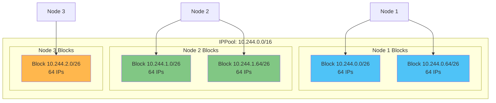
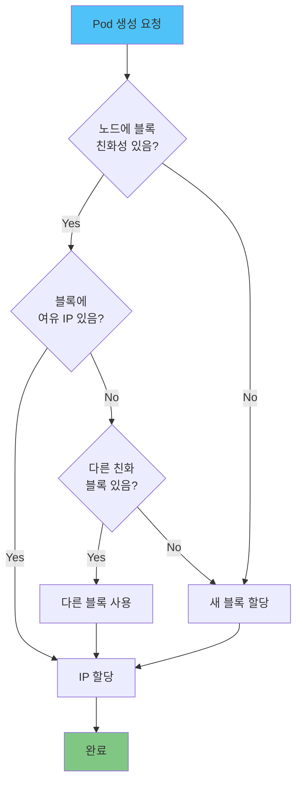
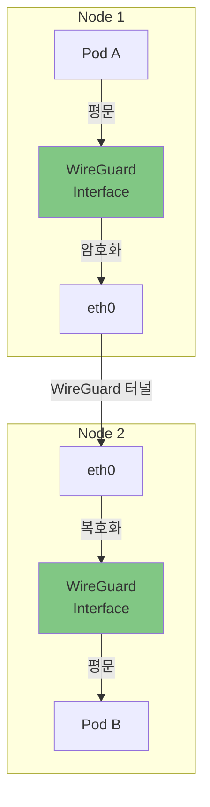
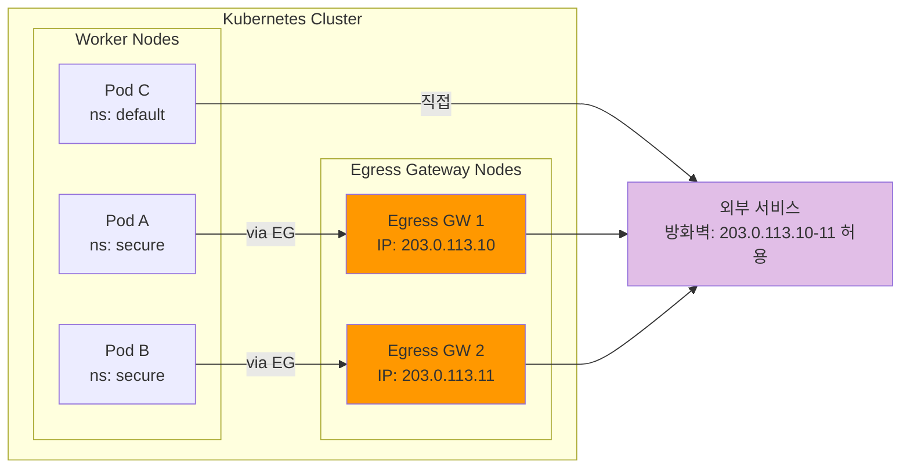
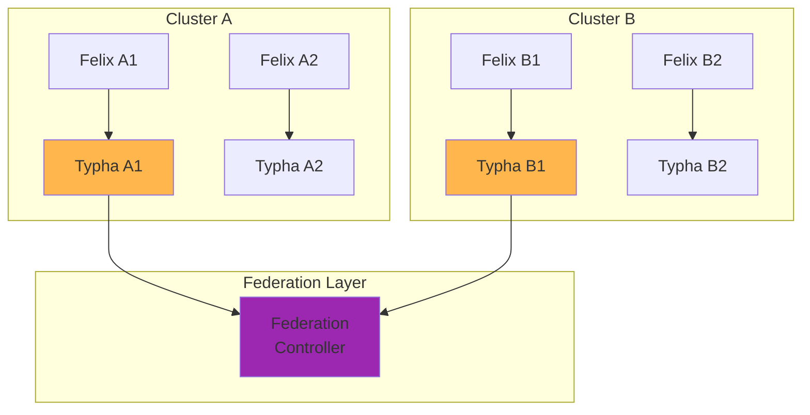
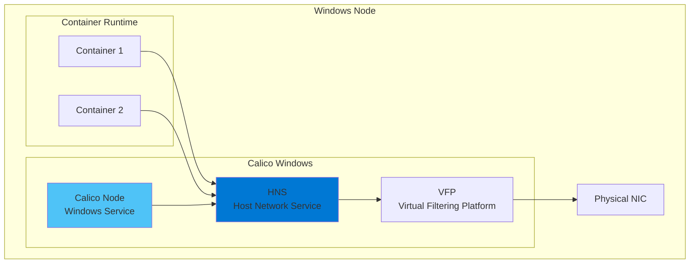
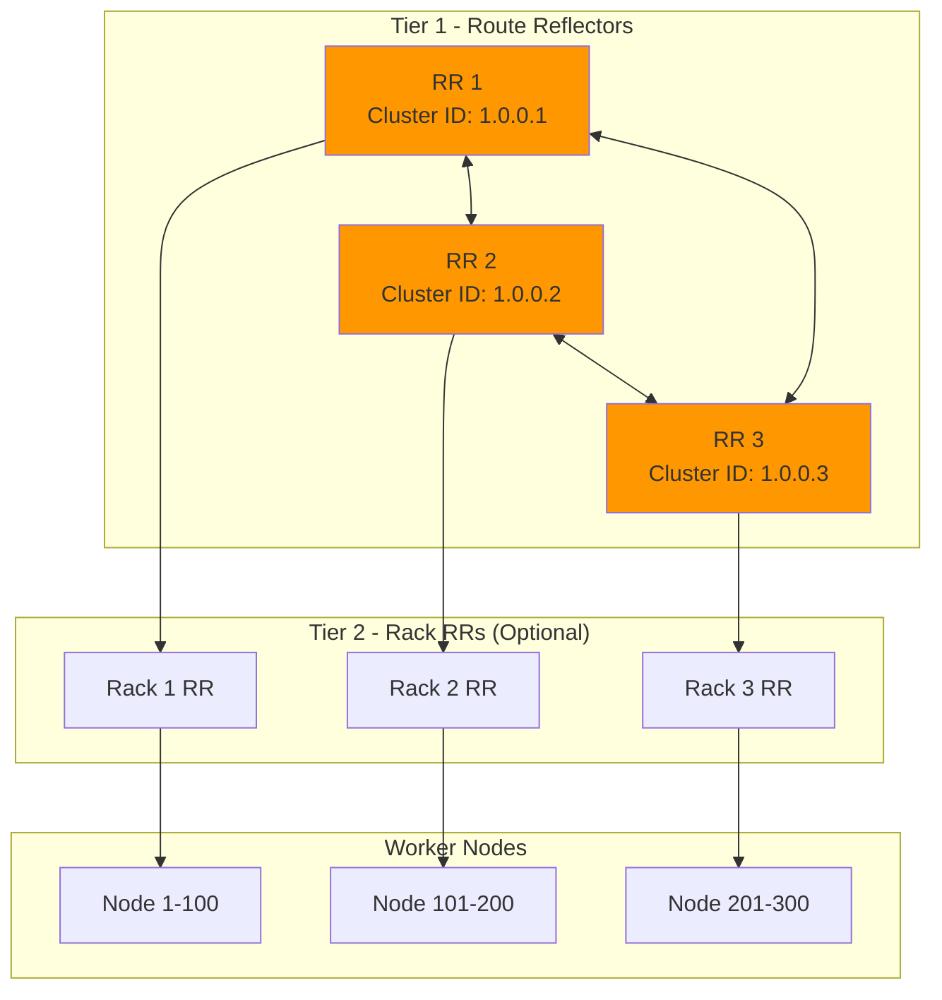

# Part 7: Calico 고급 주제

> **지원 버전**: Calico v3.29+ / Kubernetes 1.28+
> **마지막 업데이트**: 2025년 2월 22일

## 개요

이 문서에서는 Calico의 고급 기능과 대규모 프로덕션 환경에서의 활용 방법을 다룹니다. IPAM 심화, WireGuard 암호화, Egress Gateway, 멀티 클러스터 페더레이션, Windows 지원, 그리고 대규모 클러스터 설계에 대해 상세히 알아봅니다.

## IPAM 심화

### Block 기반 IPAM 아키텍처

Calico의 IPAM(IP Address Management)은 블록 기반 할당 방식을 사용하여 효율적인 IP 주소 관리를 제공합니다.



### IP Block Affinity

각 노드는 하나 이상의 IP 블록에 대한 친화성(affinity)을 가집니다. 이 메커니즘은 다음과 같이 작동합니다:

1. **블록 할당**: Pod가 노드에 스케줄링되면 해당 노드에 친화성이 있는 블록에서 IP 할당
2. **블록 확장**: 기존 블록이 소진되면 새로운 블록을 노드에 할당
3. **블록 해제**: 노드의 모든 Pod가 삭제되면 블록 친화성 해제

```yaml
# IPPool 설정 - blockSize 조정
apiVersion: projectcalico.org/v3
kind: IPPool
metadata:
  name: default-ipv4-pool
spec:
  cidr: 10.244.0.0/16
  # 블록 크기: /26 = 64 IPs (기본값)
  # 더 작은 블록: /28 = 16 IPs (노드가 많은 경우)
  # 더 큰 블록: /24 = 256 IPs (Pod 밀도가 높은 경우)
  blockSize: 26
  ipipMode: Never
  vxlanMode: CrossSubnet
  natOutgoing: true
  nodeSelector: all()
```

### 할당 알고리즘

Calico IPAM의 IP 할당 알고리즘:



**blockSize 권장 사항:**

| 클러스터 규모 | 권장 blockSize | IP 수/블록 | 설명 |
|--------------|---------------|-----------|------|
| 소규모 (<50 노드) | /26 | 64 | 기본값, 대부분 환경에 적합 |
| 중규모 (50-200 노드) | /27 | 32 | IP 효율성 향상 |
| 대규모 (200+ 노드) | /28 | 16 | 최대 IP 효율성 |
| 고밀도 Pod | /24 | 256 | 노드당 Pod 수가 많은 경우 |

### Host-local IPAM 모드

Kubernetes CNI의 host-local IPAM과 함께 사용할 수 있습니다:

```yaml
# CNI 설정에서 host-local 사용
apiVersion: projectcalico.org/v3
kind: IPPool
metadata:
  name: host-local-pool
spec:
  cidr: 10.244.0.0/16
  # Calico IPAM 대신 host-local 사용
  # 각 노드에 고정 CIDR 할당
  nodeSelector: all()
---
# Node별 podCIDR 설정 (kubeadm 방식)
# kubectl patch node <node-name> -p '{"spec":{"podCIDR":"10.244.X.0/24"}}'
```

### Multi-Pool 전략

워크로드 유형에 따라 다른 IP Pool을 사용할 수 있습니다:

```yaml
# 일반 워크로드용 Pool
apiVersion: projectcalico.org/v3
kind: IPPool
metadata:
  name: general-workloads
spec:
  cidr: 10.244.0.0/17  # 10.244.0.0 - 10.244.127.255
  blockSize: 26
  vxlanMode: CrossSubnet
  natOutgoing: true
  nodeSelector: "!has(gpu)"
---
# GPU 워크로드용 Pool (더 큰 블록)
apiVersion: projectcalico.org/v3
kind: IPPool
metadata:
  name: gpu-workloads
spec:
  cidr: 10.244.128.0/18  # 10.244.128.0 - 10.244.191.255
  blockSize: 24  # GPU Pod는 적지만 네트워크 집약적
  vxlanMode: Never  # 직접 라우팅으로 성능 최적화
  natOutgoing: true
  nodeSelector: "has(gpu)"
---
# 외부 서비스용 Pool (NAT 없음)
apiVersion: projectcalico.org/v3
kind: IPPool
metadata:
  name: external-services
spec:
  cidr: 10.244.192.0/18  # 10.244.192.0 - 10.244.255.255
  blockSize: 28
  vxlanMode: Never
  natOutgoing: false  # 실제 Pod IP로 외부 통신
  nodeSelector: all()
```

```yaml
# Pod에서 특정 Pool 선택
apiVersion: v1
kind: Pod
metadata:
  name: gpu-workload
  annotations:
    cni.projectcalico.org/ipv4pools: '["gpu-workloads"]'
spec:
  nodeSelector:
    gpu: "true"
  containers:
    - name: ml-training
      image: tensorflow/tensorflow:latest-gpu
```

### IPv6 / Dual-stack 지원

Calico는 IPv6 전용 및 Dual-stack 환경을 지원합니다:

```yaml
# IPv6 IPPool 설정
apiVersion: projectcalico.org/v3
kind: IPPool
metadata:
  name: ipv6-pool
spec:
  cidr: fd00:10:244::/48
  blockSize: 122  # /122 = 64 IPv6 주소
  vxlanMode: Never  # IPv6는 VXLAN 미지원, BGP 사용
  ipipMode: Never
  natOutgoing: false  # IPv6는 NAT 불필요
  nodeSelector: all()
---
# Dual-stack 환경: IPv4 + IPv6
apiVersion: projectcalico.org/v3
kind: IPPool
metadata:
  name: dual-stack-ipv4
spec:
  cidr: 10.244.0.0/16
  blockSize: 26
  vxlanMode: CrossSubnet
  natOutgoing: true
  nodeSelector: all()
---
apiVersion: projectcalico.org/v3
kind: IPPool
metadata:
  name: dual-stack-ipv6
spec:
  cidr: fd00:10:244::/48
  blockSize: 122
  natOutgoing: false
  nodeSelector: all()
```

```yaml
# FelixConfiguration에서 IPv6 활성화
apiVersion: projectcalico.org/v3
kind: FelixConfiguration
metadata:
  name: default
spec:
  ipv6Support: true
  # Dual-stack 라우팅
  routeSource: "CalicoIPAM"
```

### IP 고갈 감지 및 대응

IP 고갈 상황을 감지하고 대응하는 방법:

```bash
# IPAM 상태 확인
calicoctl ipam show

# 샘플 출력:
# +----------+-----------------+-----------+------------+------------+
# | GROUPING |      CIDR       | IPS TOTAL | IPS IN USE | IPS FREE   |
# +----------+-----------------+-----------+------------+------------+
# | IP Pool  | 10.244.0.0/16   | 65536     | 45230      | 20306      |
# +----------+-----------------+-----------+------------+------------+

# 블록별 상세 정보
calicoctl ipam show --show-blocks

# 특정 노드의 할당 상태
calicoctl ipam show --show-blocks | grep node-1

# 사용되지 않는 IP 해제 (orphaned IPs)
calicoctl ipam release --ip=10.244.1.15

# 블록 해제 (빈 블록)
calicoctl ipam release --block=10.244.5.0/26
```

**IP 고갈 대응 전략:**

| 상황 | 해결 방법 | 명령어/설정 |
|------|----------|------------|
| 전체 Pool 소진 | CIDR 확장 또는 새 Pool 추가 | 새 IPPool 생성 |
| 특정 노드 블록 소진 | 추가 블록 할당 허용 | `maxBlocksPerHost` 조정 |
| Orphaned IP | 수동 해제 | `calicoctl ipam release` |
| 비효율적 블록 사용 | 블록 크기 조정 | `blockSize` 변경 |

```yaml
# IP 고갈 방지를 위한 FelixConfiguration
apiVersion: projectcalico.org/v3
kind: FelixConfiguration
metadata:
  name: default
spec:
  # 노드당 최대 블록 수 (기본: 무제한)
  # 대규모 클러스터에서 IP 고갈 방지
  # 설정하지 않으면 필요에 따라 무제한 할당
```

## WireGuard 암호화

### WireGuard 개요

WireGuard는 현대적이고 고성능인 VPN 프로토콜로, Calico에서 노드 간 트래픽을 암호화하는 데 사용됩니다.



### WireGuard 설정

```yaml
# FelixConfiguration에서 WireGuard 활성화
apiVersion: projectcalico.org/v3
kind: FelixConfiguration
metadata:
  name: default
spec:
  # WireGuard 활성화
  wireguardEnabled: true

  # WireGuard 인터페이스 MTU (기본: 자동)
  wireguardMTU: 1400

  # WireGuard 리스닝 포트 (기본: 51820)
  wireguardListeningPort: 51820

  # 호스트-워크로드 간 WireGuard (기본: false)
  wireguardHostEncryptionEnabled: false

  # IPv6 WireGuard 활성화
  wireguardEnabledV6: true

  # 키 로테이션 간격 (시간)
  wireguardPersistentKeepalive: 25
```

```bash
# WireGuard 상태 확인
calicoctl node status

# 샘플 출력:
# Calico process is running.
#
# IPv4 BGP status
# +--------------+-------------------+-------+----------+-------------+
# | PEER ADDRESS |     PEER TYPE     | STATE |  SINCE   |    INFO     |
# +--------------+-------------------+-------+----------+-------------+
# | 10.0.1.2     | node-to-node mesh | up    | 12:00:00 | Established |
# +--------------+-------------------+-------+----------+-------------+
#
# WireGuard status
# +-------------+---------------+--------+
# | PUBLIC KEY  | PEER ADDRESS  | STATUS |
# +-------------+---------------+--------+
# | abc123...   | 10.0.1.2      | up     |
# | def456...   | 10.0.1.3      | up     |
# +-------------+---------------+--------+

# WireGuard 인터페이스 확인 (노드에서)
wg show wireguard.cali
```

### 성능 영향

WireGuard 암호화가 네트워크 성능에 미치는 영향:

| 메트릭 | 암호화 없음 | WireGuard | IPsec (AES-GCM) |
|--------|-----------|-----------|-----------------|
| 처리량 | 100% (기준) | 95-98% | 85-90% |
| 지연 시간 | 100% (기준) | +5-10% | +15-25% |
| CPU 사용량 | 낮음 | 중간 | 높음 |
| 설정 복잡도 | 없음 | 낮음 | 높음 |

### WireGuard vs IPsec 비교

| 특성 | WireGuard | IPsec |
|------|-----------|-------|
| **암호화 알고리즘** | ChaCha20-Poly1305, Curve25519 | 다양 (AES-GCM, etc.) |
| **코드 복잡도** | ~4,000줄 | ~400,000줄 |
| **성능** | 매우 높음 | 중간 |
| **설정 복잡도** | 간단 | 복잡 |
| **키 관리** | 자동 (Calico 관리) | 복잡 (IKE 필요) |
| **FIPS 준수** | 미인증 | 인증 가능 |
| **커널 요구사항** | Linux 5.6+ (또는 모듈) | 모든 Linux |

### 키 로테이션

Calico는 WireGuard 키를 자동으로 관리합니다:

```yaml
# 키 로테이션 주기 설정
apiVersion: projectcalico.org/v3
kind: FelixConfiguration
metadata:
  name: default
spec:
  wireguardEnabled: true
  # 연결 유지 간격 (초)
  # 이 값은 NAT 타임아웃보다 작아야 함
  wireguardPersistentKeepalive: 25
```

```bash
# 수동 키 확인 (디버깅용)
kubectl exec -n calico-system -it <calico-node-pod> -- \
  cat /var/lib/calico/wireguard/privatekey

# 공개 키 확인
kubectl exec -n calico-system -it <calico-node-pod> -- \
  wg show wireguard.cali
```

## Egress Gateway

### Egress Gateway 개요

Egress Gateway는 특정 워크로드의 외부 트래픽이 지정된 게이트웨이 노드를 통해 나가도록 하여, 고정된 소스 IP를 제공합니다.



### Egress Gateway 설정

```yaml
# Egress Gateway용 IPPool
apiVersion: projectcalico.org/v3
kind: IPPool
metadata:
  name: egress-gateway-pool
spec:
  cidr: 203.0.113.0/28
  # Egress Gateway 전용
  natOutgoing: false
  # Egress IP 풀로 사용
  nodeSelector: "egress-gateway == 'true'"
---
# EgressGateway 리소스 (Calico Enterprise)
apiVersion: projectcalico.org/v3
kind: EgressGateway
metadata:
  name: secure-egress
  namespace: secure
spec:
  # 사용할 Egress IP Pool
  egressGatewayPolicy:
    selector: "projectcalico.org/namespace == 'secure'"
  ipPools:
    - cidr: 203.0.113.0/28
---
# OSS에서 SNAT를 사용한 유사 기능 구현
apiVersion: projectcalico.org/v3
kind: BGPConfiguration
metadata:
  name: default
spec:
  # 특정 IP를 BGP로 광고
  serviceExternalIPs:
    - cidr: 203.0.113.0/28
```

### 네임스페이스별 SNAT 정책

```yaml
# 특정 네임스페이스의 트래픽을 SNAT
apiVersion: projectcalico.org/v3
kind: GlobalNetworkPolicy
metadata:
  name: egress-snat-policy
spec:
  selector: "projectcalico.org/namespace == 'secure'"
  order: 100
  egress:
    - action: Allow
      destination:
        notNets:
          - 10.0.0.0/8
          - 172.16.0.0/12
          - 192.168.0.0/16
      # 외부 트래픽에 대한 SNAT 적용
      # 실제 SNAT IP는 노드 설정에서 지정
```

### 컴플라이언스 요구사항 대응

외부 서비스가 특정 소스 IP만 허용하는 경우의 설정:

```yaml
# 컴플라이언스 시나리오: 파트너 API는 등록된 IP만 허용
# 1. Egress Gateway 노드 지정
# kubectl label node egress-node-1 egress-gateway=true

# 2. Egress Gateway Pod 배포
apiVersion: apps/v1
kind: Deployment
metadata:
  name: egress-gateway
  namespace: calico-system
spec:
  replicas: 2
  selector:
    matchLabels:
      app: egress-gateway
  template:
    metadata:
      labels:
        app: egress-gateway
    spec:
      nodeSelector:
        egress-gateway: "true"
      hostNetwork: true  # 호스트 네트워크 사용
      containers:
        - name: egress-proxy
          image: envoyproxy/envoy:v1.28.0
          ports:
            - containerPort: 8080
```

## 멀티 클러스터 페더레이션

### Typha 기반 페더레이션

대규모 멀티 클러스터 환경에서 Typha를 활용한 페더레이션:



### 크로스 클러스터 정책

```yaml
# Cluster A에서 정의
apiVersion: projectcalico.org/v3
kind: GlobalNetworkPolicy
metadata:
  name: allow-from-cluster-b
spec:
  selector: app == 'shared-service'
  ingress:
    - action: Allow
      source:
        # Cluster B의 Pod CIDR
        nets:
          - 10.245.0.0/16
      protocol: TCP
      destination:
        ports:
          - 8080
---
# 클러스터 간 연결을 위한 BGP 설정
apiVersion: projectcalico.org/v3
kind: BGPPeer
metadata:
  name: cluster-b-peer
spec:
  peerIP: 192.168.2.1  # Cluster B의 라우터
  asNumber: 64513
  nodeSelector: has(cluster-gateway)
```

## Windows 컨테이너 지원

### 지원 기능 및 제한사항

| 기능 | Windows 지원 | 제한사항 |
|------|-------------|----------|
| Pod 네트워킹 | 완전 지원 | - |
| Network Policy (L3-L4) | 완전 지원 | - |
| VXLAN 오버레이 | 지원 | 성능 오버헤드 있음 |
| BGP | 지원 | Windows Server 2019+ |
| eBPF | 미지원 | Linux 전용 |
| WireGuard | 미지원 | Linux 전용 |
| Host Endpoint | 제한적 | 일부 기능만 |
| IPv6 | 미지원 | Windows 제한 |

### Windows 노드 설치

```powershell
# Windows 노드에서 Calico 설치
# 1. 사전 요구사항 확인
Get-WindowsFeature -Name containers
Get-WindowsFeature -Name Hyper-V

# 2. Calico for Windows 다운로드
Invoke-WebRequest -Uri "https://github.com/projectcalico/calico/releases/download/v3.29.0/calico-windows-v3.29.0.zip" -OutFile "calico-windows.zip"
Expand-Archive -Path "calico-windows.zip" -DestinationPath "C:\CalicoWindows"

# 3. 설정 파일 편집
# C:\CalicoWindows\config.ps1
$env:CALICO_NETWORKING_BACKEND = "vxlan"
$env:CALICO_DATASTORE_TYPE = "kubernetes"
$env:KUBECONFIG = "C:\k\config"
$env:K8S_SERVICE_CIDR = "10.96.0.0/12"
$env:DNS_NAME_SERVERS = "10.96.0.10"

# 4. 설치 실행
C:\CalicoWindows\install-calico.ps1
```

```yaml
# Windows 노드 허용을 위한 Installation CR 수정
apiVersion: operator.tigera.io/v1
kind: Installation
metadata:
  name: default
spec:
  # Windows 지원 활성화
  calicoNetwork:
    windowsDataplane: HNS
    bgp: Enabled
    ipPools:
      - cidr: 10.244.0.0/16
        encapsulation: VXLAN  # Windows는 VXLAN 권장
        natOutgoing: Enabled
```

### HNS (Host Networking Service) 통합



## Calico Enterprise / Tigera 개요

### 오픈소스 vs Enterprise 비교

| 기능 | Calico OSS | Calico Enterprise |
|------|-----------|-------------------|
| **Network Policy** | L3-L4 | L3-L7 + DNS |
| **정책 Tier** | 제한적 | 무제한 Tier |
| **관측성** | 기본 메트릭 | Flow Visualization, Service Graph |
| **위협 방어** | 없음 | IDS/IPS, DPI, 위협 피드 |
| **컴플라이언스** | 없음 | 감사 보고서, PCI-DSS 지원 |
| **Egress Gateway** | 수동 설정 | 네이티브 지원 |
| **멀티 클러스터** | BGP 수동 설정 | Federation Controller |
| **UI** | 없음 | Tigera Manager UI |
| **지원** | 커뮤니티 | 24/7 엔터프라이즈 |
| **가격** | 무료 | 유료 (노드 기반) |

### Enterprise 전용 기능

```yaml
# L7 Application Policy (Enterprise)
apiVersion: projectcalico.org/v3
kind: GlobalNetworkPolicy
metadata:
  name: l7-api-policy
spec:
  tier: application
  selector: app == 'api-server'
  ingress:
    - action: Allow
      http:
        methods: ["GET", "POST"]
        paths:
          - exact: "/api/v1/health"
          - prefix: "/api/v1/users"
      source:
        selector: app == 'frontend'
---
# DNS 기반 정책 (Enterprise)
apiVersion: projectcalico.org/v3
kind: GlobalNetworkPolicy
metadata:
  name: dns-egress-policy
spec:
  selector: app == 'backend'
  egress:
    - action: Allow
      destination:
        domains:
          - "*.googleapis.com"
          - "api.stripe.com"
      protocol: TCP
      destination:
        ports: [443]
```

## 대규모 클러스터 설계 (1000+ 노드)

### Typha 복제본 사이징

```
권장 공식: Typha 복제본 수 = max(3, ceil(노드 수 / 200))

예시:
- 100 노드: max(3, ceil(100/200)) = max(3, 1) = 3 복제본
- 500 노드: max(3, ceil(500/200)) = max(3, 3) = 3 복제본
- 1000 노드: max(3, ceil(1000/200)) = max(3, 5) = 5 복제본
- 2000 노드: max(3, ceil(2000/200)) = max(3, 10) = 10 복제본
```

```yaml
# 대규모 클러스터 Typha 설정
apiVersion: operator.tigera.io/v1
kind: Installation
metadata:
  name: default
spec:
  typhaDeployment:
    spec:
      replicas: 10  # 2000 노드 클러스터
      template:
        spec:
          affinity:
            podAntiAffinity:
              requiredDuringSchedulingIgnoredDuringExecution:
                - labelSelector:
                    matchLabels:
                      k8s-app: calico-typha
                  topologyKey: kubernetes.io/hostname
          containers:
            - name: calico-typha
              resources:
                requests:
                  cpu: 500m
                  memory: 512Mi
                limits:
                  cpu: 2000m
                  memory: 2Gi
              env:
                - name: TYPHA_MAXCONNECTIONSLOWERLIMIT
                  value: "300"
                - name: TYPHA_HEALTHENABLED
                  value: "true"
```

### Route Reflector 토폴로지

1000+ 노드에서는 full-mesh BGP 대신 Route Reflector 토폴로지를 사용합니다:



```yaml
# Route Reflector 노드 설정
# kubectl label node rr-node-1 route-reflector=true
# kubectl label node rr-node-2 route-reflector=true
# kubectl label node rr-node-3 route-reflector=true

# BGPConfiguration - Node-to-Node mesh 비활성화
apiVersion: projectcalico.org/v3
kind: BGPConfiguration
metadata:
  name: default
spec:
  nodeToNodeMeshEnabled: false
  asNumber: 64512
---
# Route Reflector 노드 설정
apiVersion: projectcalico.org/v3
kind: Node
metadata:
  name: rr-node-1
  labels:
    route-reflector: "true"
spec:
  bgp:
    routeReflectorClusterID: 1.0.0.1
---
# 일반 노드 -> Route Reflector 피어링
apiVersion: projectcalico.org/v3
kind: BGPPeer
metadata:
  name: peer-to-rr
spec:
  nodeSelector: "!has(route-reflector)"
  peerSelector: "has(route-reflector)"
---
# Route Reflector 간 피어링
apiVersion: projectcalico.org/v3
kind: BGPPeer
metadata:
  name: rr-to-rr
spec:
  nodeSelector: "has(route-reflector)"
  peerSelector: "has(route-reflector)"
```

### Felix 성능 튜닝

```yaml
# 대규모 클러스터용 Felix 설정
apiVersion: projectcalico.org/v3
kind: FelixConfiguration
metadata:
  name: default
spec:
  # iptables 최적화
  iptablesRefreshInterval: "300s"  # 기본 90s -> 300s
  routeRefreshInterval: "300s"     # 기본 90s -> 300s

  # iptables 마크 비트 설정
  iptablesMarkMask: 0xffff0000

  # 연결 추적 최적화
  netlinkTimeoutSecs: 60

  # 로깅 최적화
  logSeverityScreen: Warning  # 프로덕션에서는 Warning 이상만
  logSeverityFile: Warning

  # 메트릭 활성화
  prometheusMetricsEnabled: true
  prometheusMetricsPort: 9091

  # 헬스체크
  healthEnabled: true
  healthPort: 9099

  # 대규모 클러스터 최적화
  removeExternalRoutes: true

  # Typha 연결
  typhaAddr: calico-typha:5473
  typhaK8sServiceName: calico-typha
```

### etcd vs Kubernetes 데이터스토어

| 특성 | etcd 데이터스토어 | Kubernetes 데이터스토어 |
|------|------------------|------------------------|
| **설정 복잡도** | 높음 (별도 etcd 필요) | 낮음 (기존 API 서버 사용) |
| **확장성** | 매우 높음 | 높음 |
| **성능** | 최고 | 우수 |
| **운영 오버헤드** | 높음 | 낮음 |
| **권장 규모** | 5000+ 노드 | 5000 노드 이하 |
| **백업** | 별도 etcd 백업 필요 | K8s 백업에 포함 |

```yaml
# Kubernetes 데이터스토어 사용 (권장)
apiVersion: operator.tigera.io/v1
kind: Installation
metadata:
  name: default
spec:
  calicoNetwork:
    bgp: Enabled
    ipPools:
      - cidr: 10.244.0.0/16
        encapsulation: VXLANCrossSubnet
  # 데이터스토어는 자동으로 Kubernetes API 사용
```

## 성능 튜닝 종합

### 환경별 권장 설정

```yaml
# 소규모 클러스터 (<100 노드)
apiVersion: projectcalico.org/v3
kind: FelixConfiguration
metadata:
  name: default
spec:
  iptablesRefreshInterval: "90s"
  routeRefreshInterval: "90s"
  logSeverityScreen: Info
  prometheusMetricsEnabled: true
---
# 중규모 클러스터 (100-500 노드)
apiVersion: projectcalico.org/v3
kind: FelixConfiguration
metadata:
  name: default
spec:
  iptablesRefreshInterval: "180s"
  routeRefreshInterval: "180s"
  logSeverityScreen: Warning
  prometheusMetricsEnabled: true
  # Typha 활성화 필수
---
# 대규모 클러스터 (500+ 노드)
apiVersion: projectcalico.org/v3
kind: FelixConfiguration
metadata:
  name: default
spec:
  iptablesRefreshInterval: "300s"
  routeRefreshInterval: "300s"
  logSeverityScreen: Warning
  logSeverityFile: Warning
  prometheusMetricsEnabled: true
  # Route Reflector 필수
  # Typha 복제본 수 증가
```

### 리소스 할당 가이드라인

| 컴포넌트 | 소규모 | 중규모 | 대규모 |
|---------|-------|-------|-------|
| **calico-node CPU** | 200m-500m | 500m-1000m | 1000m-2000m |
| **calico-node Memory** | 256Mi-512Mi | 512Mi-1Gi | 1Gi-2Gi |
| **Typha CPU** | 100m-200m | 200m-500m | 500m-2000m |
| **Typha Memory** | 128Mi-256Mi | 256Mi-512Mi | 512Mi-2Gi |
| **Typha Replicas** | 3 | 3-5 | 5-15 |

---

## 다음 단계

- [Part 8: Amazon EKS 환경에서의 Calico](08-eks-integration.md)에서 EKS 통합을 학습합니다
- [Part 9: 운영 가이드](09-operations.md)에서 운영 방법을 익힙니다
- [용어집](glossary.md)에서 용어를 확인합니다

## 참고 자료

- [Calico IPAM 공식 문서](https://docs.tigera.io/calico/latest/networking/ipam/)
- [WireGuard 암호화 가이드](https://docs.tigera.io/calico/latest/network-policy/encrypt-cluster-pod-traffic)
- [Calico Enterprise 기능](https://docs.tigera.io/calico-enterprise/latest/)

## 퀴즈

이 장에서 배운 내용을 테스트하려면 [고급 주제 퀴즈](../../quizzes/networking/calico/07-advanced-topics-quiz.md)를 풀어보세요.
