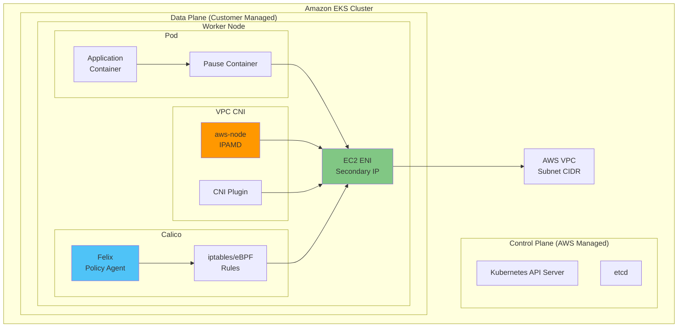
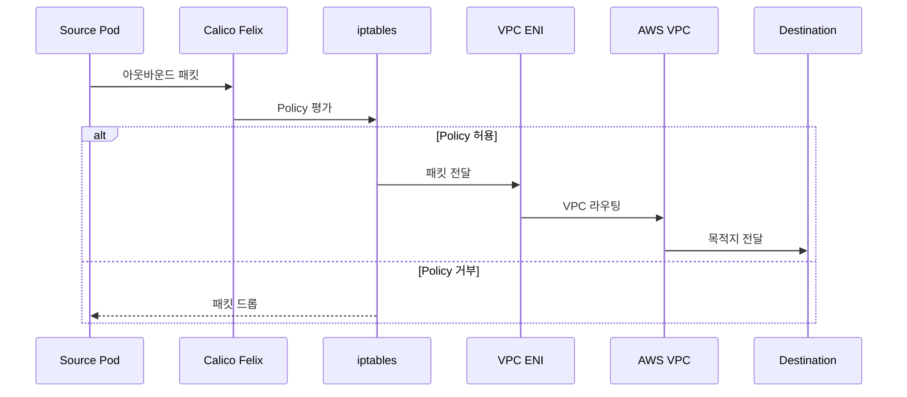
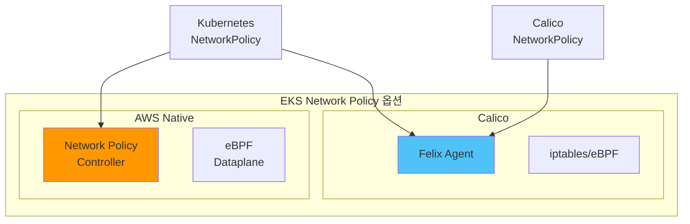
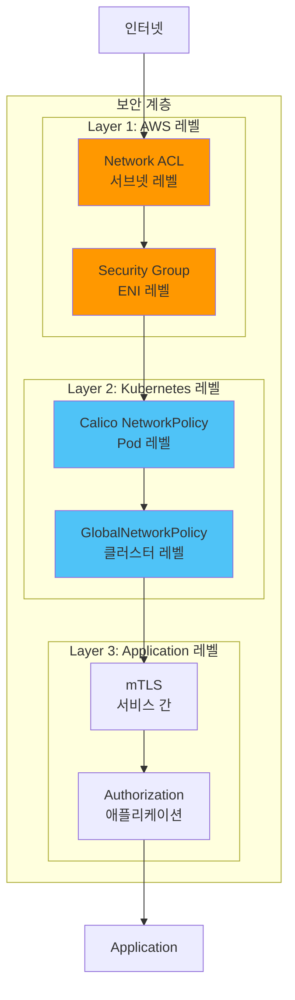

# Part 8: Amazon EKS 환경에서의 Calico

> **지원 버전**: Calico v3.29+ / Kubernetes 1.28+ / EKS 1.28+
> **마지막 업데이트**: 2025년 2월 22일

## 개요

이 문서에서는 Amazon EKS 환경에서 Calico를 효과적으로 활용하는 방법을 다룹니다. VPC CNI와의 통합, 다양한 설치 방법, EKS 네이티브 Network Policy Controller, 그리고 EKS 최적화 전략에 대해 상세히 알아봅니다.

## VPC CNI + Calico 아키텍처


### 통합 아키텍처 상세

EKS에서는 AWS VPC CNI가 Pod 네트워킹을 담당하고, Calico는 Network Policy 적용을 담당하는 하이브리드 구성이 일반적입니다.



### 트래픽 흐름



## 설치 방법 비교

### 설치 옵션 개요

| 방법 | 복잡도 | 기능 범위 | 업그레이드 | 권장 사용 사례 |
|------|--------|----------|-----------|---------------|
| **EKS 애드온** | 낮음 | 기본 | AWS 관리 | 간단한 Policy 요구 |
| **Tigera Operator** | 중간 | 전체 | 수동 | 프로덕션, 전체 기능 |
| **Helm** | 중간 | 전체 | 수동 | GitOps, 커스터마이징 |
| **Manifest** | 높음 | 전체 | 수동 | 고급 커스터마이징 |

### 방법 1: EKS 애드온 (AWS 관리)

```bash
# EKS 애드온으로 Network Policy 활성화
# 참고: 이것은 Calico가 아닌 AWS의 네이티브 구현

# 기존 클러스터에 추가
aws eks create-addon \
  --cluster-name my-cluster \
  --addon-name vpc-cni \
  --addon-version v1.16.0-eksbuild.1 \
  --configuration-values '{"enableNetworkPolicy": "true"}' \
  --resolve-conflicts OVERWRITE

# 또는 eksctl로 생성
eksctl create addon \
  --cluster my-cluster \
  --name vpc-cni \
  --version latest \
  --service-account-role-arn arn:aws:iam::ACCOUNT:role/vpc-cni-role \
  --configuration-values '{"enableNetworkPolicy": "true"}'
```

```yaml
# eksctl ClusterConfig로 새 클러스터 생성
apiVersion: eksctl.io/v1alpha5
kind: ClusterConfig
metadata:
  name: eks-with-network-policy
  region: ap-northeast-2
  version: "1.29"

vpc:
  cidr: 10.0.0.0/16

managedNodeGroups:
  - name: standard-workers
    instanceType: m5.large
    desiredCapacity: 3
    minSize: 1
    maxSize: 5
    volumeSize: 100

addons:
  - name: vpc-cni
    version: latest
    attachPolicyARNs:
      - arn:aws:iam::aws:policy/AmazonEKS_CNI_Policy
    configurationValues: |
      enableNetworkPolicy: "true"
      env:
        ENABLE_PREFIX_DELEGATION: "true"
        WARM_PREFIX_TARGET: "1"

  - name: coredns
    version: latest

  - name: kube-proxy
    version: latest
```

### 방법 2: Tigera Operator (권장)

```bash
# 1. Tigera Operator 설치
kubectl create -f https://raw.githubusercontent.com/projectcalico/calico/v3.29.0/manifests/tigera-operator.yaml

# 2. EKS용 Installation CR 적용
kubectl apply -f - <<EOF
apiVersion: operator.tigera.io/v1
kind: Installation
metadata:
  name: default
spec:
  # EKS 환경 지정
  kubernetesProvider: EKS

  # VPC CNI 사용 (Calico는 Policy only)
  cni:
    type: AmazonVPC

  calicoNetwork:
    # VPC CNI 사용 시 BGP/IPAM 비활성화
    bgp: Disabled

    # eBPF 데이터플레인 (선택사항)
    # linuxDataplane: BPF

  # 컴포넌트 리소스 설정
  componentResources:
    - componentName: Node
      resourceRequirements:
        requests:
          cpu: 200m
          memory: 256Mi
        limits:
          cpu: 1000m
          memory: 512Mi

    - componentName: Typha
      resourceRequirements:
        requests:
          cpu: 100m
          memory: 128Mi
        limits:
          cpu: 500m
          memory: 256Mi

  # Typha 배포 (50+ 노드 시 필수)
  typhaDeployment:
    spec:
      minReadySeconds: 10
EOF

# 3. 설치 확인
kubectl get pods -n calico-system
kubectl get installation default -o yaml
```

### 방법 3: Helm 설치

```bash
# Helm repo 추가
helm repo add projectcalico https://docs.tigera.io/calico/charts
helm repo update

# EKS용 values 파일 생성
cat > calico-eks-values.yaml <<EOF
installation:
  kubernetesProvider: EKS
  cni:
    type: AmazonVPC
  calicoNetwork:
    bgp: Disabled

# Typha 설정
typhaDeployment:
  replicas: 3

# 이미지 레지스트리 (선택: ECR 미러링)
# registry: 123456789.dkr.ecr.ap-northeast-2.amazonaws.com

# 노드 선택자 (선택: 특정 노드에만 배포)
# nodeSelector:
#   eks.amazonaws.com/nodegroup: calico-nodes

# 톨러레이션
# tolerations:
#   - key: CriticalAddonsOnly
#     operator: Exists
EOF

# 설치
helm install calico projectcalico/tigera-operator \
  --namespace tigera-operator \
  --create-namespace \
  --version v3.29.0 \
  -f calico-eks-values.yaml

# 업그레이드
helm upgrade calico projectcalico/tigera-operator \
  --namespace tigera-operator \
  -f calico-eks-values.yaml
```

## EKS Network Policy Controller (v1.25+)

### AWS 네이티브 구현

EKS v1.25+에서는 AWS가 자체 Network Policy Controller를 제공합니다. 이것은 Calico와 별개의 구현입니다.



### 기능 비교

| 기능 | EKS Native Policy | Calico |
|------|-------------------|--------|
| **Kubernetes NetworkPolicy** | 완전 지원 | 완전 지원 |
| **GlobalNetworkPolicy** | 미지원 | 지원 |
| **NetworkSet** | 미지원 | 지원 |
| **Tier 기반 정책** | 미지원 | 지원 |
| **L7 정책** | 미지원 | Enterprise |
| **DNS 기반 정책** | 미지원 | Enterprise |
| **Host Endpoint** | 미지원 | 지원 |
| **eBPF 데이터플레인** | 지원 | 지원 |
| **관측성** | CloudWatch | Prometheus |
| **비용** | 무료 | 무료 (OSS) |

### 마이그레이션 고려사항

기존 Calico에서 EKS 네이티브로 마이그레이션:

```yaml
# 호환되는 정책 (양쪽 모두 작동)
apiVersion: networking.k8s.io/v1
kind: NetworkPolicy
metadata:
  name: allow-frontend
  namespace: production
spec:
  podSelector:
    matchLabels:
      app: backend
  policyTypes:
    - Ingress
  ingress:
    - from:
        - podSelector:
            matchLabels:
              app: frontend
      ports:
        - protocol: TCP
          port: 8080
```

```yaml
# Calico 전용 기능 (EKS 네이티브 미지원)
apiVersion: projectcalico.org/v3
kind: GlobalNetworkPolicy
metadata:
  name: default-deny
spec:
  selector: all()  # 이 기능은 Calico 전용
  types:
    - Ingress
    - Egress
```

## 노드 그룹별 고려사항

### Managed Node Group vs Self-managed vs Fargate

| 특성 | Managed Node Group | Self-managed | Fargate |
|------|-------------------|--------------|---------|
| **Calico 전체 기능** | 지원 | 지원 | 미지원 |
| **eBPF 모드** | 지원 | 지원 | 미지원 |
| **GlobalNetworkPolicy** | 지원 | 지원 | 미지원 |
| **Host Endpoint** | 지원 | 지원 | 미지원 |
| **K8s NetworkPolicy** | 지원 | 지원 | 지원 (VPC CNI) |
| **WireGuard** | 지원 | 지원 | 미지원 |
| **커스텀 AMI** | 제한적 | 완전 | 불가 |

```yaml
# 혼합 노드 그룹 ClusterConfig
apiVersion: eksctl.io/v1alpha5
kind: ClusterConfig
metadata:
  name: hybrid-cluster
  region: ap-northeast-2

managedNodeGroups:
  # 일반 워크로드 (Calico 전체 기능)
  - name: general
    instanceType: m5.large
    desiredCapacity: 3
    labels:
      workload-type: general

  # GPU 워크로드 (Calico 전체 기능)
  - name: gpu-workers
    instanceType: p3.2xlarge
    desiredCapacity: 2
    labels:
      workload-type: gpu
      nvidia.com/gpu: "true"

fargateProfiles:
  # Fargate 워크로드 (K8s NetworkPolicy만 지원)
  - name: fargate-workloads
    selectors:
      - namespace: fargate-apps
        labels:
          compute: fargate
```

## IRSA (IAM Roles for Service Accounts) 설정

### Calico가 AWS API 접근이 필요한 경우

특정 기능에서 Calico가 AWS API에 접근해야 할 수 있습니다:

```bash
# 1. OIDC Provider 확인
aws eks describe-cluster \
  --name my-cluster \
  --query "cluster.identity.oidc.issuer" \
  --output text

# 2. IAM 정책 생성
cat > calico-aws-policy.json <<EOF
{
  "Version": "2012-10-17",
  "Statement": [
    {
      "Effect": "Allow",
      "Action": [
        "ec2:DescribeInstances",
        "ec2:DescribeNetworkInterfaces",
        "ec2:DescribeSecurityGroups",
        "ec2:DescribeSubnets",
        "ec2:DescribeVpcs"
      ],
      "Resource": "*"
    }
  ]
}
EOF

aws iam create-policy \
  --policy-name CalicoAWSReadOnly \
  --policy-document file://calico-aws-policy.json

# 3. Service Account에 역할 연결
eksctl create iamserviceaccount \
  --cluster my-cluster \
  --namespace calico-system \
  --name calico-node \
  --attach-policy-arn arn:aws:iam::ACCOUNT:policy/CalicoAWSReadOnly \
  --approve
```

## Security Group vs Calico Policy

### 계층형 보안 모델



### 사용 가이드

| 보안 요구사항 | Security Group | Calico Policy |
|--------------|----------------|---------------|
| **VPC 외부 트래픽 제어** | 권장 | 보조 |
| **서브넷 간 통신** | 권장 | 보조 |
| **Pod-to-Pod 통신** | 제한적 | 권장 |
| **네임스페이스 격리** | 불가 | 권장 |
| **레이블 기반 정책** | 불가 | 권장 |
| **동적 정책** | 느림 | 빠름 |
| **감사/로깅** | CloudTrail | Flow Logs |

```yaml
# 권장: 계층형 보안 구성

# Layer 1: Security Group (Terraform 예시)
# resource "aws_security_group" "eks_workers" {
#   ingress {
#     from_port   = 443
#     to_port     = 443
#     protocol    = "tcp"
#     cidr_blocks = ["10.0.0.0/16"]  # VPC 내부만
#   }
# }

# Layer 2: Calico GlobalNetworkPolicy
apiVersion: projectcalico.org/v3
kind: GlobalNetworkPolicy
metadata:
  name: security-baseline
spec:
  order: 100
  selector: all()
  types:
    - Ingress
    - Egress
  ingress:
    # 클러스터 내부 통신만 허용
    - action: Allow
      source:
        nets:
          - 10.0.0.0/16  # VPC CIDR
  egress:
    # DNS 허용
    - action: Allow
      protocol: UDP
      destination:
        ports: [53]
    # 클러스터 내부 통신
    - action: Allow
      destination:
        nets:
          - 10.0.0.0/16
---
# Layer 2: 애플리케이션별 NetworkPolicy
apiVersion: projectcalico.org/v3
kind: NetworkPolicy
metadata:
  name: frontend-policy
  namespace: production
spec:
  selector: app == 'frontend'
  ingress:
    - action: Allow
      source:
        selector: app == 'load-balancer'
      destination:
        ports:
          - 8080
```

## EKS 업그레이드 고려사항

### 버전 호환성 매트릭스

| EKS 버전 | Calico 최소 | Calico 권장 | 참고 |
|---------|------------|------------|------|
| 1.29 | 3.27+ | 3.29 | 최신 |
| 1.28 | 3.26+ | 3.28+ | LTS |
| 1.27 | 3.25+ | 3.27+ | - |
| 1.26 | 3.24+ | 3.26+ | - |

### 업그레이드 절차

```bash
# 1. 사전 점검
# Calico 현재 버전 확인
kubectl get deployment -n calico-system calico-kube-controllers -o jsonpath='{.spec.template.spec.containers[0].image}'

# calico-node 상태 확인
kubectl get ds -n calico-system calico-node -o wide

# 2. EKS 컨트롤 플레인 업그레이드
aws eks update-cluster-version \
  --name my-cluster \
  --kubernetes-version 1.29

# 업그레이드 완료 대기
aws eks wait cluster-active --name my-cluster

# 3. Calico 업그레이드 (Operator 사용 시)
kubectl apply -f https://raw.githubusercontent.com/projectcalico/calico/v3.29.0/manifests/tigera-operator.yaml

# 4. 노드 그룹 업그레이드
eksctl upgrade nodegroup \
  --cluster my-cluster \
  --name standard-workers \
  --kubernetes-version 1.29

# 5. 검증
kubectl get nodes
kubectl get pods -n calico-system
calicoctl node status
```

### 롤백 절차

```bash
# Calico 롤백 (이전 버전 Operator 적용)
kubectl apply -f https://raw.githubusercontent.com/projectcalico/calico/v3.28.0/manifests/tigera-operator.yaml

# Installation CR은 유지됨 (데이터 손실 없음)

# 노드 롤백은 새 노드 그룹으로
eksctl create nodegroup \
  --cluster my-cluster \
  --name rollback-workers \
  --kubernetes-version 1.28

# 기존 노드 그룹 드레인 및 삭제
kubectl drain --ignore-daemonsets --delete-emptydir-data <old-node>
eksctl delete nodegroup --cluster my-cluster --name standard-workers
```

## 비용 고려사항

### 리소스 오버헤드

| 컴포넌트 | CPU (요청/제한) | Memory (요청/제한) | 노드당 비용 영향 |
|---------|----------------|-------------------|-----------------|
| calico-node | 200m/1000m | 256Mi/512Mi | ~$3-5/월 |
| Typha (3개) | 100m/500m | 128Mi/256Mi | ~$2-4/월 (클러스터) |
| kube-controllers | 100m/500m | 128Mi/256Mi | ~$1-2/월 |

### 비용 최적화 전략

```yaml
# 리소스 최적화된 설정
apiVersion: operator.tigera.io/v1
kind: Installation
metadata:
  name: default
spec:
  kubernetesProvider: EKS
  cni:
    type: AmazonVPC

  # 최소 리소스 설정
  componentResources:
    - componentName: Node
      resourceRequirements:
        requests:
          cpu: 100m      # 최소화
          memory: 128Mi  # 최소화
        limits:
          cpu: 500m
          memory: 256Mi

    - componentName: Typha
      resourceRequirements:
        requests:
          cpu: 50m
          memory: 64Mi
        limits:
          cpu: 200m
          memory: 128Mi

  # Typha 복제본 최적화 (소규모 클러스터)
  typhaDeployment:
    spec:
      replicas: 2  # 소규모에서는 2개로 충분
```

## EKS 성능 최적화

### Prefix Delegation과 Calico

```yaml
# VPC CNI Prefix Delegation 활성화
apiVersion: eksctl.io/v1alpha5
kind: ClusterConfig
metadata:
  name: high-performance-cluster
  region: ap-northeast-2

vpc:
  cidr: 10.0.0.0/16

managedNodeGroups:
  - name: high-density
    instanceType: m5.xlarge
    desiredCapacity: 3

addons:
  - name: vpc-cni
    version: latest
    configurationValues: |
      env:
        ENABLE_PREFIX_DELEGATION: "true"
        WARM_PREFIX_TARGET: "1"
        MINIMUM_IP_TARGET: "5"
        WARM_IP_TARGET: "2"
```

### eBPF 모드 on EKS

```yaml
# EKS에서 eBPF 모드 활성화
apiVersion: operator.tigera.io/v1
kind: Installation
metadata:
  name: default
spec:
  kubernetesProvider: EKS
  cni:
    type: AmazonVPC
  calicoNetwork:
    bgp: Disabled
    # eBPF 데이터플레인 활성화
    linuxDataplane: BPF
---
# FelixConfiguration 추가 설정
apiVersion: projectcalico.org/v3
kind: FelixConfiguration
metadata:
  name: default
spec:
  bpfEnabled: true
  bpfExternalServiceMode: "DSR"  # Direct Server Return
  bpfKubeProxyIptablesCleanupEnabled: true
  bpfDataIfacePattern: "^(eth.*|eni.*)"
```

```bash
# eBPF 활성화 후 kube-proxy 비활성화
kubectl patch ds -n kube-system kube-proxy \
  -p '{"spec": {"template": {"spec": {"nodeSelector": {"non-existing": "true"}}}}}'
```

### 노드 레벨 튜닝

```yaml
# 고성능 노드 그룹
apiVersion: eksctl.io/v1alpha5
kind: ClusterConfig
metadata:
  name: performance-cluster
  region: ap-northeast-2

managedNodeGroups:
  - name: performance-workers
    instanceType: m5.2xlarge
    desiredCapacity: 5

    # 커널 파라미터 튜닝
    preBootstrapCommands:
      - |
        # 네트워크 튜닝
        sysctl -w net.core.somaxconn=65535
        sysctl -w net.ipv4.tcp_max_syn_backlog=65535
        sysctl -w net.core.netdev_max_backlog=65535
        sysctl -w net.ipv4.ip_local_port_range="1024 65535"

        # conntrack 튜닝
        sysctl -w net.netfilter.nf_conntrack_max=1000000
        sysctl -w net.netfilter.nf_conntrack_tcp_timeout_established=86400
```

## eksctl 전체 클러스터 구성 예시

```yaml
# complete-eks-calico-cluster.yaml
apiVersion: eksctl.io/v1alpha5
kind: ClusterConfig

metadata:
  name: production-cluster
  region: ap-northeast-2
  version: "1.29"
  tags:
    Environment: production
    ManagedBy: eksctl

# IAM OIDC Provider
iam:
  withOIDC: true

# VPC 설정
vpc:
  cidr: 10.0.0.0/16
  nat:
    gateway: HighlyAvailable
  clusterEndpoints:
    publicAccess: true
    privateAccess: true

# 노드 그룹
managedNodeGroups:
  - name: system-workers
    instanceType: m5.large
    desiredCapacity: 3
    minSize: 3
    maxSize: 6
    volumeSize: 100
    volumeType: gp3
    labels:
      node-type: system
    taints:
      - key: CriticalAddonsOnly
        value: "true"
        effect: NoSchedule
    iam:
      withAddonPolicies:
        ebs: true
        cloudWatch: true

  - name: app-workers
    instanceType: m5.xlarge
    desiredCapacity: 5
    minSize: 2
    maxSize: 20
    volumeSize: 100
    volumeType: gp3
    labels:
      node-type: application
    iam:
      withAddonPolicies:
        ebs: true
        cloudWatch: true

# EKS 애드온
addons:
  - name: vpc-cni
    version: latest
    attachPolicyARNs:
      - arn:aws:iam::aws:policy/AmazonEKS_CNI_Policy
    configurationValues: |
      env:
        ENABLE_PREFIX_DELEGATION: "true"
        WARM_PREFIX_TARGET: "1"

  - name: coredns
    version: latest

  - name: kube-proxy
    version: latest

# CloudWatch 로깅
cloudWatch:
  clusterLogging:
    enableTypes:
      - api
      - audit
      - authenticator
      - controllerManager
      - scheduler
```

```bash
# 클러스터 생성
eksctl create cluster -f complete-eks-calico-cluster.yaml

# Calico 설치
kubectl create -f https://raw.githubusercontent.com/projectcalico/calico/v3.29.0/manifests/tigera-operator.yaml

kubectl apply -f - <<EOF
apiVersion: operator.tigera.io/v1
kind: Installation
metadata:
  name: default
spec:
  kubernetesProvider: EKS
  cni:
    type: AmazonVPC
  calicoNetwork:
    bgp: Disabled
  typhaDeployment:
    spec:
      replicas: 3
EOF

# 검증
kubectl get pods -n calico-system
calicoctl node status
```

---

## 다음 단계

- [Part 9: 운영 가이드](09-operations.md)에서 Calico 운영 방법을 학습합니다
- [용어집](glossary.md)에서 용어를 확인합니다
- [Part 7: 고급 주제](07-advanced-topics.md)로 돌아가 고급 기능을 복습합니다

## 참고 자료

- [Calico on EKS 공식 가이드](https://docs.tigera.io/calico/latest/getting-started/kubernetes/managed-public-cloud/eks)
- [EKS VPC CNI 문서](https://docs.aws.amazon.com/eks/latest/userguide/pod-networking.html)
- [EKS Network Policy 문서](https://docs.aws.amazon.com/eks/latest/userguide/network-policy.html)

## 퀴즈

이 장에서 배운 내용을 테스트하려면 [EKS 통합 퀴즈](../../quizzes/networking/calico/08-eks-integration-quiz.md)를 풀어보세요.
