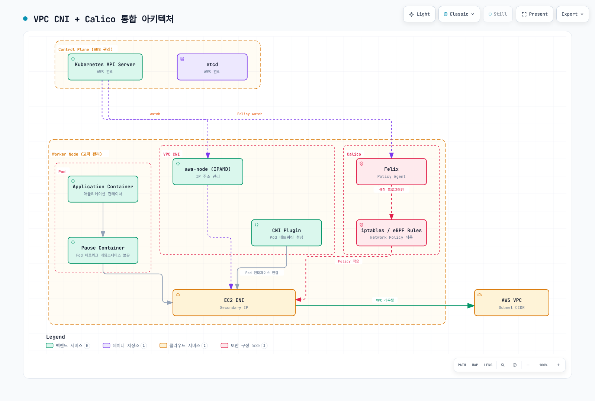
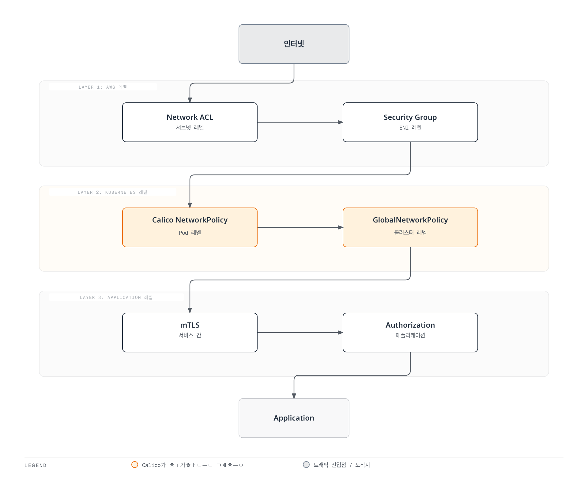

# Part 8: EKS 통합

> **검토 기준**: Calico 3.32.2 / Tigera Operator 1.42.6 / Calico의 Kubernetes 공식 테스트 범위 1.34–1.36. **마지막 업데이트**: 2026년 9월 12일

## 개요

이 문서는 **Amazon VPC CNI를 사용하는 일반 Linux EC2 워커 노드**에 Calico 정책을 적용하는 구성을 다룹니다. VPC CNI가 Pod IP 할당과 VPC 네트워킹을 담당하고, Calico는 노드 데이터플레인에 정책을 설정합니다. 아래 설치 예제는 Iptables 데이터플레인과 kube-proxy를 유지합니다. Calico CNI와 eBPF는 추가 전제가 필요한 별도 배포 선택입니다.

검토일 기준 EKS의 표준 지원 버전은 1.34–1.36, 연장 지원 버전은 1.31–1.33입니다. Calico 3.32가 공개한 Kubernetes 테스트 범위는 1.34–1.36입니다. EKS 제공 여부, 업스트림 Kubernetes 릴리스, Calico 호환성은 각각 확인해야 합니다. 업스트림 1.37 출시만으로 이 호환 범위가 늘어나지는 않습니다. 설치 전 대상 리전의 EKS 및 애드온 버전을 확인하세요.

## VPC CNI + Calico 아키텍처



[🔍 인터랙티브 다이어그램 보기](https://www.atomai.click/kubernetes-docs/archmaps/ko-networking-calico-08-eks-integration-0.html)

그림은 컴포넌트의 책임을 요약합니다. 패킷이 pause 컨테이너나 Felix 프로세스를 전달 프록시처럼 통과하지는 않습니다. Felix가 규칙을 설정하면 Linux 커널이 이를 평가합니다. `iptables / eBPF` 표기는 데이터플레인 대안을 뜻하며, 이 문서에서는 Iptables를 설치합니다. Typha와 kube-controllers는 고객 워커 자원에서 실행되고 AWS 관리 EKS 컨트롤 플레인 내부에 배포되지 않습니다.

| 컴포넌트 | 이 구성에서의 책임 |
| --- | --- |
| `aws-node` / IPAMD 및 VPC CNI 플러그인 | ENI/IP 할당 관리, Pod 연결 설정 |
| `calico-node`의 Felix | 로컬 엔드포인트의 정책 규칙 설정 |
| Typha | 데이터스토어 변경을 Felix에 배포, operator가 규모 조절 |
| kube-controllers | Calico 데이터와 Kubernetes 리소스 조정 |
| kube-proxy | 기본 구성의 Kubernetes Service 전달 처리 |

노드 간 트래픽은 커널에서 적용 대상 정책을 평가한 후 VPC 경로를 이용합니다. 같은 노드의 트래픽은 호스트 내부에 머물 수 있습니다. 정책이 패킷을 드롭하면 버려지는 것이며 발신자에게 패킷이 되돌아가는 것은 아닙니다. 적용 대상 출발지 egress와 목적지 ingress 제어가 모두 연결을 허용해야 합니다.

## 정책 엔진과 설치 방법 선택

| 선택 | 설치 대상 | 수명주기와 적용 범위 |
| --- | --- | --- |
| Amazon VPC CNI 네트워크 정책 | AWS의 정책 구현 | 호환되는 `vpc-cni` 애드온 설정으로 활성화하며 Calico를 설치하지 않음 |
| Tigera Operator 매니페스트 | Operator와 Calico 사용자 정의 리소스 | 릴리스 고정, CRD 관리, Installation 조정 |
| Tigera Operator Helm 차트 | 같은 operator와 Helm으로 관리하는 설정 | values를 렌더링·검토하고 기존 release를 업그레이드 |
| 직접 Calico 매니페스트 | Operator 없이 Calico 컴포넌트 | 플랫폼별 수정 사항과 업그레이드 절차를 직접 관리 |

EKS 애드온은 새 버전 출시나 클러스터 마이너 버전 변경 시 자동 업그레이드되지 않습니다. AWS·Marketplace·커뮤니티 애드온의 지원 주체도 다릅니다. `calico`라는 애드온 이름이 존재한다고 가정하거나 Marketplace 제품을 이 OSS 설치와 동일하게 취급하지 마세요. 실제 카탈로그, 게시자, 버전, 라이선스, 컴퓨팅 호환성을 확인해야 합니다.

**같은 엔드포인트에는 하나의 네트워크 정책 엔진을 사용하세요.** Calico EKS 가이드는 AWS VPC CNI 네트워크 정책을 비활성화하도록 요구합니다. 마이그레이션에는 정책, 노드 상태, 가용성을 고려한 전환 계획이 필요합니다. 두 엔진을 함께 실행하며 플래그만 바꾸는 것은 전환 절차가 아닙니다. AWS는 정책 에이전트를 제거해도 규칙이 남을 수 있다고 경고하며 타사 엔진에서 전환할 때 영향받은 노드 교체를 권고합니다. [AWS 정책 고려사항](https://docs.aws.amazon.com/eks/latest/userguide/cni-network-policy.html)과 [비활성화 절차](https://docs.aws.amazon.com/eks/latest/userguide/network-policy-disable.html)를 함께 확인하세요.

## 기존 VPC CNI 설치 준비

다음 명령은 기존 관리형 `vpc-cni` 애드온을 조회합니다. 실제 리전과 클러스터 이름을 사용하세요. 자체 관리 VPC CNI는 해당 매니페스트 또는 Helm 소유 경로에서 변경해야 합니다.

```bash
EKS_CLUSTER=my-cluster
EKS_REGION=ap-northeast-2
EKS_VERSION=$(aws eks describe-cluster --name "$EKS_CLUSTER" \
  --region "$EKS_REGION" --query cluster.version --output text)

aws eks describe-addon-versions --addon-name vpc-cni \
  --kubernetes-version "$EKS_VERSION" --region "$EKS_REGION" \
  --query 'addons[0].addonVersions[].{version:addonVersion,compatibility:compatibilities,compute:computeTypes}'

aws eks describe-addon --cluster-name "$EKS_CLUSTER" \
  --addon-name vpc-cni --region "$EKS_REGION" > vpc-cni-current.json

VPC_CNI_VERSION=$(jq -r '.addon.addonVersion' vpc-cni-current.json)
aws eks describe-addon-configuration --addon-name vpc-cni \
  --addon-version "$VPC_CNI_VERSION" --region "$EKS_REGION" \
  --query configurationSchema --output text > vpc-cni-schema.json
```

Calico에는 VPC CNI가 `vpc.amazonaws.com/pod-ips`를 신속하게 게시하도록 `ANNOTATE_POD_IP=true`가 필요합니다. `aws-node` ServiceAccount에는 Pod patch 권한이 있어야 합니다. 현재 VPC CNI 문서는 EKS 애드온이 이 권한을 자동 갱신한다고 설명합니다. 기존 ClusterRole을 덮어쓰지 말고 실제 권한을 확인하세요.

```bash
kubectl auth can-i patch pods --all-namespaces \
  --as=system:serviceaccount:kube-system:aws-node
```

이 검사는 해당 ServiceAccount를 impersonate할 권한이 필요합니다. 권한이 없다면 별도 바인딩으로 기존 규칙을 교체하지 않고 필요한 권한만 추가할 수 있습니다. 표준 설치가 아니라면 실제 ServiceAccount 이름으로 변경하세요.

```yaml
apiVersion: rbac.authorization.k8s.io/v1
kind: ClusterRole
metadata:
  name: calico-vpc-pod-annotations
rules:
  - apiGroups: [""]
    resources: ["pods"]
    verbs: ["patch"]
---
apiVersion: rbac.authorization.k8s.io/v1
kind: ClusterRoleBinding
metadata:
  name: calico-vpc-pod-annotations
roleRef:
  apiGroup: rbac.authorization.k8s.io
  kind: ClusterRole
  name: calico-vpc-pod-annotations
subjects:
  - kind: ServiceAccount
    name: aws-node
    namespace: kube-system
```

검토된 **새 구성 또는 이미 policy-only인 구성**에서는 기존 애드온 설정을 보존하면서 다음 변경 후보를 준비합니다.

```bash
jq '(.addon.configurationValues // "") as $current
  | (if $current == "" then {} else ($current | fromjson) end)
  | .enableNetworkPolicy = "false"
  | .env.ANNOTATE_POD_IP = "true"
  | del(.env.NETWORK_POLICY_ENFORCING_MODE)' \
  vpc-cni-current.json > vpc-cni-calico.json
```

이 명령은 JSON 형식의 설정을 전제로 합니다. 기존 값이 YAML이라면 필드를 잃지 않도록 파싱·변환한 뒤 후보를 준비하세요. 파싱 오류가 나면 진행하지 마세요. 조회한 EKS 빌드 스키마로 후보 설정을 검증하고 diff를 검토하세요. `NETWORK_POLICY_ENFORCING_MODE`는 AWS 정책 에이전트용 설정입니다. 에이전트가 없는데 이 변수가 남아 있으면 Pod 생성에 실패할 수 있습니다. AWS 정책이 현재 활성 상태라면 후보를 적용하기 전에 전환 계획부터 수행해야 합니다. 승인된 설정을 애드온 소유 경로로 적용합니다.

```bash
aws eks update-addon --cluster-name "$EKS_CLUSTER" \
  --addon-name vpc-cni --region "$EKS_REGION" \
  --configuration-values file://vpc-cni-calico.json \
  --resolve-conflicts PRESERVE
```

반환된 업데이트 상태와 실제 DaemonSet을 확인하세요. 보존된 충돌 때문에 원하는 필드가 적용되지 않을 수 있습니다. JSON 파싱 성공이나 업데이트 요청 접수만으로 정책 적용이 검증되지는 않습니다.

## Operator로 Calico 설치

새 설치에는 아래 매니페스트 또는 Helm 경로 중 **하나**를 선택합니다. 기존 release 위에 두 번째 operator를 설치하지 마세요. 예제는 일반 EC2 Linux 워커, 접근 가능한 Kubernetes API/DNS, 호환 VPC CNI, 경쟁 정책 엔진이 없는 환경을 전제로 합니다.

### Operator 매니페스트 경로

Calico 3.32는 Calico CRD와 operator 매니페스트가 분리되어 있습니다.

```bash
kubectl create -f https://raw.githubusercontent.com/projectcalico/calico/v3.32.2/manifests/v1_crd_projectcalico_org.yaml
kubectl create -f https://raw.githubusercontent.com/projectcalico/calico/v3.32.2/manifests/tigera-operator.yaml
```

다음을 `calico-eks-installation.yaml`로 저장합니다.

```yaml
apiVersion: operator.tigera.io/v1
kind: Installation
metadata:
  name: default
spec:
  kubernetesProvider: EKS
  cni:
    type: AmazonVPC
  calicoNetwork:
    bgp: Disabled
    linuxDataplane: Iptables
  nodeUpdateStrategy:
    type: RollingUpdate
    rollingUpdate:
      maxUnavailable: 1
---
apiVersion: operator.tigera.io/v1
kind: APIServer
metadata:
  name: default
spec: {}
---
apiVersion: operator.tigera.io/v1
kind: Goldmane
metadata:
  name: default
spec: {}
---
apiVersion: operator.tigera.io/v1
kind: Whisker
metadata:
  name: default
spec: {}
```

```bash
kubectl apply -f calico-eks-installation.yaml
kubectl get tigerastatus
kubectl get pods -n calico-system
```

API 서버, Goldmane flow aggregator, Whisker UI는 OSS에서도 제공됩니다. 환경에 맞게 접근 제어와 자원 용량을 설정하세요. `cni.type: AmazonVPC`가 IPAM/네트워킹을 VPC CNI에 위임하며 `bgp: Disabled`만으로 CNI가 선택되지는 않습니다. Typha 복제본은 operator가 관리하도록 두세요. `typhaDeployment.spec.replicas`는 지원되는 Installation override가 아닙니다. [확장 세부사항](07-advanced-topics.md)을 참고하세요.

### Helm 경로

다음을 `calico-eks-values.yaml`로 저장합니다. `installation`은 Installation API에 대응합니다. 최상위 `nodeSelector`는 operator Pod를 제어하며 모든 Calico 컴포넌트를 선택하는 설정이 아닙니다. 지원되지 않는 values가 Helm에서 조용히 무시될 수 있으므로 렌더링 결과를 확인하세요.

```yaml
installation:
  enabled: true
  kubernetesProvider: EKS
  cni:
    type: AmazonVPC
  calicoNetwork:
    bgp: Disabled
    linuxDataplane: Iptables
  nodeUpdateStrategy:
    type: RollingUpdate
    rollingUpdate:
      maxUnavailable: 1
apiServer:
  enabled: true
goldmane:
  enabled: true
whisker:
  enabled: true
manageCRDs: true
```

```bash
helm repo add projectcalico https://docs.tigera.io/calico/charts
helm repo update projectcalico
helm template calico projectcalico/tigera-operator \
  --version v3.32.2 --namespace tigera-operator \
  -f calico-eks-values.yaml > calico-rendered.yaml

# 준비된 클러스터에 맞게 렌더링 결과를 검토한 후:
helm install calico projectcalico/tigera-operator \
  --version v3.32.2 --namespace tigera-operator --create-namespace \
  -f calico-eks-values.yaml
```

`manageCRDs: true`에서는 operator가 시작 후 필요한 CRD를 관리합니다. 업그레이드와 동시에 새 필드를 사용하려면 [Calico 업그레이드 절차](https://docs.tigera.io/calico/latest/operations/upgrading/kubernetes-upgrade)에 따라 일치하는 CRD를 기존 소유 경로에서 먼저 적용하세요. Helm rollback만으로 CRD나 저장 데이터 마이그레이션이 되돌아간다고 보장할 수 없습니다.

## 대안: AWS 네이티브 네트워크 정책

AWS VPC CNI의 표준 NetworkPolicy 지원은 **VPC CNI 1.14**에서 시작되었으며 EKS 1.14를 뜻하지 않습니다. 현재 AWS 가이드는 **표준·관리자 정책을 함께 사용하려면 VPC CNI 1.21 이상**, 호환 EKS/platform 버전, Linux 커널 5.10 이상을 요구합니다. 과거 출시 시점 예제 대신 현재 호환성 안내를 따르세요.

현재 AWS는 네임스페이스 범위 `networking.k8s.io/v1` NetworkPolicy와 함께 Admin/Baseline tier가 있는 `networking.k8s.aws/v1alpha1` **ClusterNetworkPolicy**를 문서화합니다. Calico GlobalNetworkPolicy 및 사용자 정의 Tier와는 별도 API입니다. 네이티브 정책을 영구적으로 네임스페이스 규칙만 지원하는 기능으로 설명하면 안 됩니다.

| 기능 | AWS 네이티브 구현 | 이 문서의 Calico OSS |
| --- | --- | --- |
| Kubernetes NetworkPolicy | 조건을 충족하는 EC2 Linux 노드에서 지원 | 관리 대상 엔드포인트에서 지원 |
| 클러스터 정책 | 자체 규칙과 전제가 있는 AWS ClusterNetworkPolicy | Calico GlobalNetworkPolicy와 Tier |
| 정책 관측성 | 에이전트 메트릭/이벤트 로그, CloudWatch 전송은 별도 설정 | Felix/Typha 메트릭, Goldmane·Whisker flow 관측성 |
| 애플리케이션 계층 정책 | L3/L4 정책에서 지원을 추론하지 않음 | 별도 Dikastes/Istio 통합이 필요하며 이 설치로 활성화되지 않음 |
| Calico의 DNS/FQDN 정책 | Calico API 구현이 아님 | 문서화된 도메인 기반 정책 기능은 상용 Calico 에디션 필요 |

네이티브 대안은 호환 VPC CNI 애드온/Helm 설정으로 `enableNetworkPolicy`를 활성화합니다. `aws-node`에 존재하지 않는 `ENABLE_NETWORK_POLICY` 환경변수를 설정하는 것으로는 활성화되지 않습니다. 네이티브 `standard` 시작 모드는 정책 구성 전 트래픽을 허용하며, `strict`는 deny로 시작하고 DNS를 포함한 필수 경로 정책이 필요합니다. 이 AWS 설정이 Calico의 시작 동작을 설정하지는 않습니다.

네이티브 적용에는 EC2 Linux 한정, Pod 기본 인터페이스 한정, IP family 제한, controller 소유 Pod에서의 안정적 적용 등 문서화된 제약이 있습니다. 포트/프로토콜 개수 및 Service 포트 조건도 확인하세요. AWS가 관리하는 PolicyEndpoint는 컨트롤러가 소유하도록 유지합니다. 전체 설정과 전환 세부사항은 [VPC CNI 가이드](../01-vpc-cni.md)를 참고하세요.

## 노드 유형과 네트워킹 구성

| 구성 | 적용 범위 |
| --- | --- |
| 일반 관리형 또는 자체 관리 EC2 Linux 노드 + VPC CNI | 위 policy-only 설치 적용, 노드 관리 방식만으로 Calico 기능이 결정되지는 않음 |
| EC2 노드 + 전체 Calico CNI | Tigera가 문서화한 별도 설계, Pod 주소·컨트롤 플레인 접근·CNI 소유권·지원 경계 변경 |
| EKS Fargate | 해당 Pod에서 Calico 노드 에이전트 및 VPC CNI 네이티브 네트워크 정책 사용 불가, Security Groups for Pods는 별도 지원 제어 |
| EKS Auto Mode | AWS 내장 네트워킹/정책 사용, 대체 CNI와 정책 플러그인 미지원 |
| EKS Hybrid Nodes | VPC CNI 사용 불가, 전용 CNI 가이드에는 AWS 유지 Cilium 1.17/1.18 빌드가 나열되며 아래 지원 조건 참고 |
| Windows 노드 | 별도 Windows/VPC CNI 및 Calico HNS 절차 필요, Calico eBPF 데이터플레인 미지원, [Windows 제약](07-advanced-topics.md) 참고 |

Hybrid 전용 CNI 가이드는 AWS 유지 Cilium 빌드를 나열하고 Calico 예시를 별도 저장소로 안내하지만 [일반 대체 CNI 문서](https://docs.aws.amazon.com/eks/latest/userguide/alternate-cni-plugins.html)는 여전히 Hybrid Nodes의 Cilium/Calico 핵심 기능 지원을 설명합니다. 예시 이동만으로 Calico 지원 종료를 추론하거나 임의의 업스트림 버전을 AWS 지원으로 취급하지 마세요. 배포판·기능별 지원 범위를 확인해야 합니다.

EC2 엔드포인트에 적용한 Calico 정책이 Fargate 상대와의 트래픽을 제한할 수는 있습니다. 이것이 Fargate 내부에서 정책을 적용한다는 뜻은 아닙니다. 혼합 컴퓨팅 클러스터에서는 모든 워커를 “Calico 전체 지원”으로 표시하는 대신 스케줄링과 정책 적용 경계를 정의해야 합니다.

VPC CNI의 `enableNetworkPolicy`를 false로 바꿔도 전체 Calico CNI가 활성화되지 않습니다. Tigera의 새 클러스터 절차는 워커 추가 전에 경쟁 CNI를 제거합니다. 기존 프로덕션 클러스터에서 `aws-node`를 삭제하는 것을 간단한 전환 방법으로 사용하지 마세요. 문서화된 overlay 구성은 admission webhook 같은 API 서버→Pod 경로도 별도 고려해야 합니다. 신뢰할 수 있는 컴포넌트의 `hostNetwork` 사용은 문서화된 우회 방법 중 하나입니다. Pod CIDR, 반환 경로, MTU, 필요한 경우 노드 IAM과 source/destination check, AWS/Tigera 지원 경계를 검토한 후 선택하세요.

Auto Mode의 관리형 네트워킹은 VPC CNI 환경변수나 ENIConfig로 설정되지 않습니다. NodeClass를 사용합니다. Auto Mode는 CoreDNS를 노드 시스템 서비스로 실행하므로 순수 Auto Mode 클러스터에는 기존 CoreDNS Deployment가 필요하지 않지만, non-Auto 노드가 섞인 클러스터에서는 유지해야 합니다. 최초 DNS 질의가 로컬이어도 업스트림 전달은 노드 밖으로 나갈 수 있습니다.

## IAM, IRSA와 Pod Identity

기본 Calico policy-only 설치는 Kubernetes RBAC를 사용하며 `calico-node`에 광범위한 EC2 조회 또는 CloudWatch IAM 역할이 필요하지 않습니다. VPC CNI에는 해당 컴포넌트가 요구하는 AWS 권한이 필요합니다. 별도 로그 exporter나 상용 클라우드 통합이 AWS 권한을 요구하면 **실제로 호출하는 컴포넌트**의 ServiceAccount에 부여하세요.

IRSA는 클러스터 OIDC provider와 적절히 제한된 trust policy를 사용하여 ServiceAccount의 AWS 자격증명을 발급합니다. EKS Pod Identity도 컴포넌트·SDK·컴퓨팅 유형이 지원할 때 선택할 수 있습니다. IAM 정책만 만들거나 존재하지 않는 `Installation.spec.nodeMetadata`를 설정한다고 워크로드에 자격증명이 연결되지는 않습니다. 컴포넌트 소유 설정을 따르고 operator가 관리하는 ServiceAccount와 소유권이 충돌하지 않도록 하세요. [VPC CNI IAM 설정](https://docs.aws.amazon.com/eks/latest/userguide/cni-iam-role.html)을 참고하세요.

## Security Group과 Calico 정책



[🔍 인터랙티브 다이어그램 보기](https://www.atomai.click/kubernetes-docs/archmaps/ko-networking-calico-08-eks-integration-3.html)

이 그림은 계층의 개념도이며 고정 평가 순서를 뜻하지 않습니다. Calico는 tier/order와 규칙 의미에 따라 평가하므로 NetworkPolicy가 항상 GlobalNetworkPolicy보다 먼저 실행되지는 않습니다. CloudTrail은 AWS API 활동을 기록하며 패킷 허용·거부 로그가 아닙니다. VPC Flow Logs와 정책 로깅 도구는 서로 다른 트래픽 근거를 제공합니다. 애플리케이션 mTLS/인가도 별도로 배포해야 합니다.

Security Group은 ENI에 연결됩니다. **Security Groups for Pods**는 SecurityGroupPolicy로 워크로드를 선택할 수 있으므로 “Security Group은 인스턴스만 선택한다”는 설명은 틀립니다. SG-for-Pods와 Calico 정책을 조합하려면 AWS는 VPC CNI 1.11 이상과 `POD_SECURITY_GROUP_ENFORCING_MODE=standard`를 요구합니다. strict 모드에서는 해당 Pod 트래픽에 Calico 정책이 적용되지 않습니다. branch ENI/인스턴스 지원을 확인하고 모드 변경 후 해당 Pod를 재생성해야 합니다. Windows와 Auto Mode에서는 SG-for-Pods를 지원하지 않습니다.

standard 모드에서 VPC CNI의 일반적인 외부 SNAT가 활성화되어 있으면(`AWS_VPC_K8S_CNI_EXTERNALSNAT=false`) VPC 외부 트래픽은 노드 기본 ENI IP와 Security Group을 사용합니다. Pod Security Group egress 규칙이 모든 경로에 적용된다고 가정하지 마세요. [AWS의 정확한 조건](https://docs.aws.amazon.com/eks/latest/userguide/security-groups-for-pods.html)을 확인하세요.

### 네임스페이스 범위 애플리케이션 정책

다음 예제는 준비된 `calico-eks-demo` 네임스페이스의 `app=frontend` Pod만 선택합니다. 같은 네임스페이스의 **클러스터 내부 gateway Pod**가 TCP 8080으로 접근하도록 허용하고 frontend가 같은 네임스페이스의 backend Pod TCP 8080에 연결하도록 허용합니다. DNS는 `k8s-app=kube-dns`인 일반 CoreDNS Pod를 전제로 하므로 NodeLocal DNS나 다른 resolver에는 목적지 조정이 필요합니다. 다른 정책/tier가 결과를 바꿀 수 있으므로 전체 유효 정책 집합을 확인하세요.

```yaml
apiVersion: projectcalico.org/v3
kind: NetworkPolicy
metadata:
  name: frontend-policy
  namespace: calico-eks-demo
spec:
  selector: app == 'frontend'
  types: [Ingress, Egress]
  ingress:
    - action: Allow
      protocol: TCP
      source:
        selector: app == 'gateway'
      destination:
        ports: [8080]
  egress:
    - action: Allow
      protocol: TCP
      destination:
        selector: app == 'backend'
        ports: [8080]
    - action: Allow
      protocol: UDP
      destination:
        namespaceSelector: projectcalico.org/name == 'kube-system'
        selector: k8s-app == 'kube-dns'
        ports: [53]
    - action: Allow
      protocol: TCP
      destination:
        namespaceSelector: projectcalico.org/name == 'kube-system'
        selector: k8s-app == 'kube-dns'
        ports: [53]
```

목적지 selector와 포트는 **동일한 `destination` 매핑**에 두어야 합니다. YAML 키가 중복되면 selector가 조용히 사라져 의도하지 않은 엔드포인트 TCP 8080까지 허용될 수 있습니다. ALB/NLB는 `app=load-balancer` 레이블이 있는 Kubernetes Pod가 아닙니다. [로드 밸런서 가이드](../03-aws-lb-controller.md)에 따라 target mode, 상태 검사, 실제 관측 출발지 주소를 별도로 고려하세요.

`all()`을 선택하는 빈 클러스터 전체 GlobalNetworkPolicy는 DNS, API, 모니터링, 애플리케이션 트래픽을 끊을 수 있습니다. 선택한 테스트 네임스페이스에서 의존성 허용을 명시한 default-deny 동작부터 구성하세요. [네트워크 정책](05-network-policy.md)을 참고하세요.

## 업그레이드와 복구

1. EKS 컨트롤 플레인, 노드 OS/kubelet, VPC CNI, kube-proxy, Calico/operator/CRD, calicoctl 버전을 조사하고 소유 설정과 정책을 내보냅니다.
2. **전환 전후 양쪽 버전**과 호환되는 Calico 버전을 선택합니다. “항상 Calico 먼저/나중”이라는 공통 순서는 없습니다. 설치 방식별 절차와 CRD 마이그레이션 안내를 따릅니다.
3. EKS upgrade insights, 제거 API, 모든 애드온 호환성을 확인합니다. EKS 컨트롤 플레인을 한 번에 한 마이너 버전씩 업그레이드한 뒤 노드와 해당 애드온을 호환 버전으로 맞춥니다.
4. 롤링 전환 중 새 Pod와 거부되어야 할 연결을 포함하여 정책·Service 동작을 확인합니다. 설정 소유권과 복구 전제를 명확히 유지합니다.

```bash
aws eks describe-cluster --name "$EKS_CLUSTER" --region "$EKS_REGION" \
  --query 'cluster.{version:version,platform:platformVersion,status:status}'
kubectl get nodes -o wide
kubectl get daemonset calico-node -n calico-system -o wide
kubectl get tigerastatus
helm get values calico -n tigera-operator -o yaml
```

현재 EKS는 **인플레이스 업그레이드 완료 후 7일 이내, 직전 마이너 버전으로 조건부 롤백**을 지원합니다. 문서화된 자격과 준비 상태 요건을 만족해야 하며 일반적인 임의 다운그레이드 기능은 아닙니다. 일반 관리형/자체 관리/Hybrid 노드와 비호환 애드온은 컨트롤 플레인보다 먼저 준비해야 합니다. Auto Mode는 자체 노드 롤백을 처리하고 Fargate는 별도 워크로드 처리가 필요합니다. Calico와 EKS 애드온은 자동 복구되지 않으며 etcd 데이터를 보존한다고 비호환 리소스가 안전해지지는 않습니다. 해결하지 않은 호환성 문제를 `--force`로 숨기지 말고 [현재 롤백 절차](https://docs.aws.amazon.com/eks/latest/userguide/rollback-cluster.html)를 따르세요. 자격이 없는 경우 다른 지원 클러스터로의 이전을 계획합니다.

이전 operator 매니페스트 적용이나 `helm rollback`만으로 안전한 Calico 다운그레이드가 입증되지는 않습니다. 복구 방법을 선택하기 전에 해당 릴리스 지원과 스키마/데이터 변경을 확인하세요. `calicoctl node status`는 노드 로컬 BGP 상태를 보여주며 policy-only EKS의 인수 검사가 아닙니다.

## 비용과 성능

| 요소 | 평가할 사항 |
| --- | --- |
| 워커 자원 | 실제 정책/엔드포인트 변경량으로 Felix·Typha·컨트롤러·flow 집계 자원 측정, CPU request는 별도 AWS 요금 항목이 아님 |
| VPC IP 용량 | Prefix delegation은 주소 할당과 밀도를 바꾸며 ENI 연결 요금이 자동 할인되는 기능이 아님 |
| 로그/메트릭 | 보관·수집·조회·exporter 전달 비용을 구분하며 메트릭을 flow log로 취급하지 않음 |
| Cross-AZ 트래픽 | 실제 출발지/목적지 경로와 서비스 요금 확인, locality와 가용성 함께 평가 |
| EKS 수명주기 | 연장 지원에 추가 클러스터 요금이 발생할 수 있으므로 현재 지원 일정 확인 |

기존 컴포넌트별 달러 추정에는 리전, 인스턴스 요금, 비용 배분 전제가 없었습니다. 사용할 수 있는 비용 모델이 아니므로 임의 자원 제한으로 고정 월 절감액을 주장하지 말고 관측한 자원 수요와 해당 AWS 요금을 사용하세요.

### Prefix Delegation

일반 VPC CNI 노드에서는 애드온의 **`env`** 또는 해당 DaemonSet/Helm 소유 설정에 `ENABLE_PREFIX_DELEGATION`, `WARM_PREFIX_TARGET`, `MINIMUM_IP_TARGET`, `WARM_IP_TARGET`을 구성합니다. ConfigMap에 소문자 `enable-prefix-delegation`을 넣는 것으로 IPAMD가 설정되지는 않습니다.

하나의 문서화된 할당 전략으로 시작하세요. `WARM_IP_TARGET`과 `MINIMUM_IP_TARGET`은 `WARM_PREFIX_TARGET`보다 우선하며 모두 설정한다고 효과가 누적되지 않습니다. IPv4 prefix에는 연속된 `/28` 서브넷 공간과 적합한 인스턴스가 필요합니다. 서브넷 단편화, 예약, max-Pods/kubelet 설정, 전환 계획을 확인하세요. [AWS prefix 절차](https://docs.aws.amazon.com/eks/latest/userguide/cni-increase-ip-addresses-procedure.html)를 참고하세요.

### EKS의 Calico eBPF

Calico는 eBPF 데이터플레인에서 EKS와 호환 VPC CNI 네트워킹을 문서화하지만 Service 처리가 변경되므로 별도 전환이 필요합니다. [Part 6](06-ebpf-dataplane.md)의 커널/플랫폼 확인, API 서버 FQDN 직접 접근과 bootstrap DNS, kube-proxy 소유권, 상태 검사 포트, 복구 상태를 검토하세요.

VPC CNI가 kube-proxy의 상시 실행을 보편적으로 요구하는 것은 **아닙니다**. kube-proxy를 함께 유지해야 한다면 문서화된 충돌을 피하도록 `bpfKubeProxyIptablesCleanupEnabled: false`와 `bpfKubeProxyHealthzPort: 0`이 모두 필요합니다. 일반적인 DaemonSet selector patch는 소유 컨트롤러가 되돌릴 수 있고 기존의 다른 selector를 덮어써서는 안 됩니다. DSR은 기본 EKS 최적화가 아닙니다. AWS 서브넷/출발지 주소 검사와 외부 로드 밸런서 제약을 별도로 검증해야 합니다. 이 문서의 기본 구성은 Iptables와 kube-proxy를 유지합니다.

일반 sysctl 프리셋, 임의의 최소 메모리, conntrack 수명 단축만으로 성능 향상이 입증되지는 않습니다. 실제 워크로드를 측정하면서 반환 경로, 기존 연결, 장애 복구를 보존하세요.

## eksctl 클러스터 계획 예제

다음은 **일반 관리형 Linux 노드의 계획 예제**이며 프로덕션 검증 레시피나 Auto Mode 전환 절차가 아닙니다. `describe-addon-versions`로 지원 빌드를 확인하고 프로비저닝 전 승인한 애드온 빌드를 설정에 고정하세요. 애드온 버전을 생략하면 호환 기본값을 선택하며 향후 모든 릴리스를 승인한다는 뜻은 아닙니다. Private API에는 VPC로 들어가는 관리 경로가 필요합니다. NAT, 로그, 워커 용량, 주소 범위는 환경별 설계가 필요합니다.

```yaml
apiVersion: eksctl.io/v1alpha5
kind: ClusterConfig
metadata:
  name: calico-eks-demo
  region: ap-northeast-2
  version: "1.36"
iam:
  withOIDC: true
vpc:
  cidr: 10.0.0.0/16
  clusterEndpoints:
    publicAccess: false
    privateAccess: true
managedNodeGroups:
  - name: linux-workers
    instanceType: m5.large
    amiFamily: AmazonLinux2023
    desiredCapacity: 3
    minSize: 3
    maxSize: 6
    privateNetworking: true
    volumeType: gp3
    volumeSize: 100
addons:
  - name: vpc-cni
    attachPolicyARNs:
      - arn:aws:iam::aws:policy/AmazonEKS_CNI_Policy
    configurationValues: |
      enableNetworkPolicy: "false"
      env:
        ANNOTATE_POD_IP: "true"
  - name: coredns
  - name: kube-proxy
cloudWatch:
  clusterLogging:
    enableTypes: [api, audit, authenticator, controllerManager, scheduler]
```

IPv4 CNI 정책은 Calico가 아닌 VPC CNI identity에 속합니다. 다른 IP family와 identity 방식에서는 IAM 구성을 다시 검토하세요. 승인된 클러스터를 준비한 후 위의 annotation/RBAC 확인과 **하나의** Calico 설치 경로를 수행합니다.

## 결과 검증

```bash
kubectl get tigerastatus
kubectl rollout status daemonset/calico-node -n calico-system --timeout=300s
kubectl get pods -n calico-system -o wide
kubectl get pods -n calico-eks-demo -o json \
  | jq '.items[] | {name: .metadata.name, ip: .status.podIP,
      annotatedIPs: .metadata.annotations["vpc.amazonaws.com/pod-ips"]}'
kubectl get networkpolicies.projectcalico.org -n calico-eks-demo
```

Controller가 관리하는 테스트 워크로드로 같은 노드, 노드/AZ 간, Pod 재생성 후, 업데이트 중 허용·거부 연결을 모두 확인하세요. DNS, 애플리케이션에 필요한 API/identity 엔드포인트, Service 트래픽, 로드 밸런서 상태 검사를 포함합니다. Pod Running이나 노드 Ready만으로 원하는 차단 또는 시작 시 정책 공백 부재가 검증되지는 않습니다. IPv6는 따로 검증해야 합니다. 현재 Calico EKS 가이드는 `ENABLE_V4_EGRESS=true`인 IPv6 Pod에 대한 정책 적용을 지원하지 않는다고 명시합니다.

이 문서의 예제는 릴리스 스키마와 렌더링한 차트를 검증한 것이며, 검증을 위해 EKS 클러스터·IAM 리소스·프로덕션 트래픽을 생성하지 않았습니다.

## 참고 자료

- [Calico on EKS](https://docs.tigera.io/calico/latest/getting-started/kubernetes/managed-public-cloud/eks)
- [Calico 요구사항](https://docs.tigera.io/calico/latest/getting-started/kubernetes/requirements)
- [Calico Helm 설치](https://docs.tigera.io/calico/latest/getting-started/kubernetes/helm)
- [Calico 업그레이드](https://docs.tigera.io/calico/latest/operations/upgrading/kubernetes-upgrade)
- [VPC CNI 1.23 설정 참조](https://github.com/aws/amazon-vpc-cni-k8s/blob/v1.23.0/README.md)
- [EKS 네이티브 네트워크 정책](https://docs.aws.amazon.com/eks/latest/userguide/cni-network-policy.html)
- [EKS 애드온 업데이트](https://docs.aws.amazon.com/eks/latest/userguide/updating-an-add-on.html)
- [EKS 버전 수명주기](https://docs.aws.amazon.com/eks/latest/userguide/kubernetes-versions.html)
- [EKS Auto Mode 네트워킹](https://docs.aws.amazon.com/eks/latest/userguide/auto-networking.html)
- [EKS Hybrid Nodes CNI](https://docs.aws.amazon.com/eks/latest/userguide/hybrid-nodes-cni.html)

## 다음 단계와 퀴즈

[운영 가이드](09-operations.md)로 진행하거나 [고급 주제](07-advanced-topics.md)·[용어집](glossary.md)을 복습하고 [EKS 통합 퀴즈](../../quizzes/networking/calico/08-eks-integration-quiz.md)를 풀어보세요.
