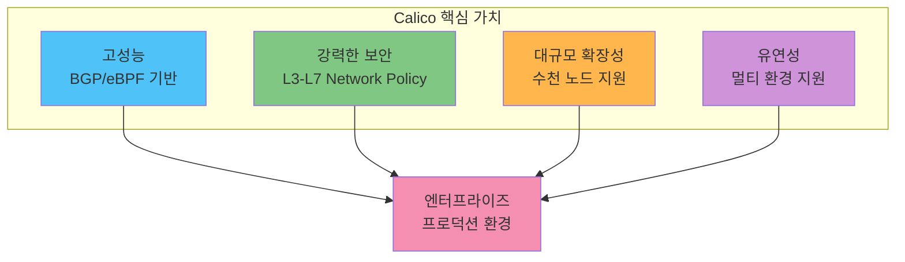
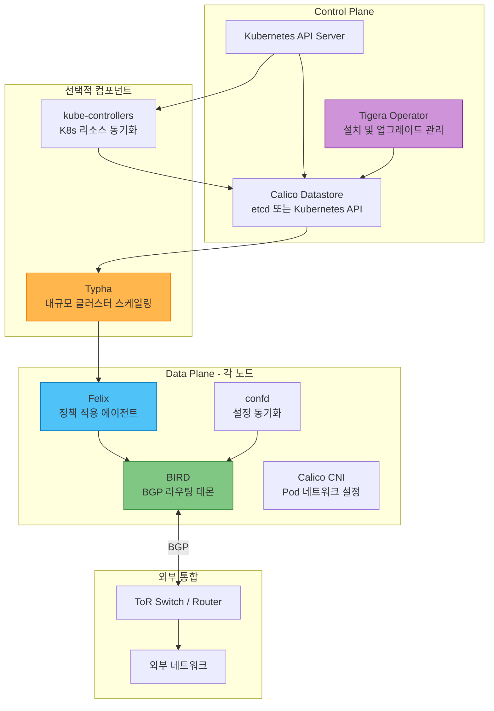
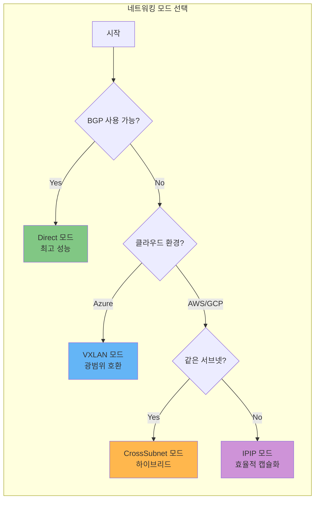
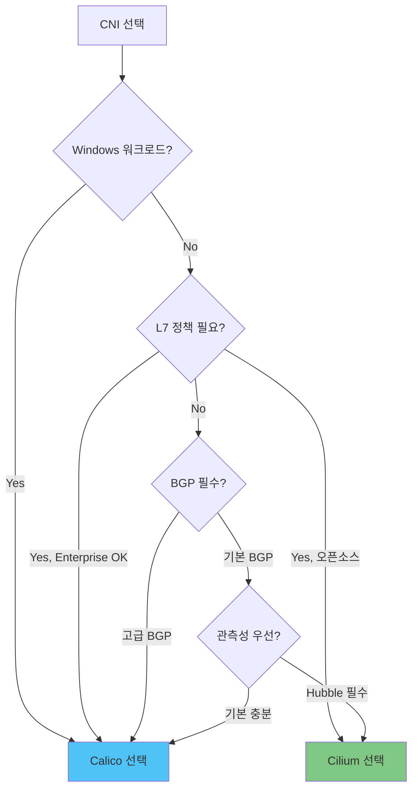

# Calico 딥다이브: 엔터프라이즈급 Kubernetes 네트워킹

> **지원 버전**: Calico v3.29+ / Kubernetes 1.28+
> **마지막 업데이트**: 2026년 2월 23일

## 개요

Calico는 Kubernetes, 가상 머신, 베어메탈 워크로드를 위한 업계 표준 오픈소스 네트워킹 및 네트워크 보안 솔루션입니다. Project Calico에서 시작하여 현재 Tigera에서 관리하며, 전 세계적으로 가장 널리 배포된 Kubernetes CNI 중 하나로 **Fortune 100대 기업의 80% 이상**이 프로덕션 환경에서 사용하고 있습니다.

### Calico를 선택해야 하는 이유



**핵심 장점:**

| 특성 | 설명 |
|------|------|
| **검증된 안정성** | 10년 이상의 프로덕션 검증, 대규모 엔터프라이즈 환경에서 입증 |
| **유연한 데이터플레인** | iptables와 eBPF 모드 선택 가능 |
| **강력한 BGP 지원** | 온프레미스 네트워크와의 완벽한 통합 |
| **포괄적인 정책** | Kubernetes 표준 + Calico 확장 Network Policy |
| **Windows 완전 지원** | 하이브리드 Windows/Linux 워크로드 지원 |
| **활발한 커뮤니티** | CNCF 생태계에서 가장 활발한 네트워킹 프로젝트 |

## Calico v3.29 주요 기능

### 새로운 기능 및 개선사항

- **eBPF 데이터플레인 GA**: 완전한 프로덕션 준비 상태의 eBPF 모드
- **향상된 WireGuard 암호화**: 성능 최적화 및 안정성 개선
- **개선된 BGP 컨트롤러**: 더 빠른 수렴 및 확장성
- **Kubernetes 1.32 지원**: 최신 Kubernetes API와 완벽 호환
- **ARM64 네이티브 지원**: Apple Silicon 및 AWS Graviton 최적화
- **향상된 Prometheus 메트릭**: 더 세분화된 모니터링 지표

### 버전 호환성 매트릭스

| Calico 버전 | Kubernetes 버전 | Linux 커널 | eBPF 지원 |
|-------------|-----------------|------------|-----------|
| v3.29 | 1.28 - 1.32 | 4.18+ (eBPF: 5.3+) | GA |
| v3.28 | 1.27 - 1.31 | 4.18+ (eBPF: 5.3+) | GA |
| v3.27 | 1.26 - 1.30 | 4.18+ (eBPF: 5.3+) | Beta |

## CNI 비교: Calico vs Cilium

| 기능 | Calico | Cilium |
|------|--------|--------|
| **핵심 기술** | iptables/eBPF 선택 가능 | eBPF 전용 |
| **성숙도** | 매우 높음 (10년+) | 높음 (6년+) |
| **Network Policy** | L3-L4 (L7은 Enterprise) | L3-L7 (오픈소스) |
| **Service Mesh** | 별도 (Enterprise) | 내장 |
| **BGP 지원** | 강력함 (BIRD 기반) | 지원 (기본) |
| **관측성** | 기본 (Flow Logs) | Hubble (강력함) |
| **Windows 지원** | 완전 지원 | 베타 |
| **커뮤니티 규모** | 매우 큼 | 빠르게 성장 |
| **학습 곡선** | 중간 | 높음 |
| **엔터프라이즈** | Calico Enterprise/Cloud | Cilium Enterprise |
| **문서화 품질** | 우수 | 우수 |
| **EKS 통합** | 공식 지원 | 공식 지원 |

## 아키텍처 개요



### 컴포넌트 역할 요약

| 컴포넌트 | 배포 위치 | 주요 역할 |
|----------|-----------|-----------|
| **Felix** | 모든 노드 | 라우팅, iptables/eBPF 규칙, 정책 적용 |
| **BIRD** | 모든 노드 | BGP 피어링, 라우트 교환 |
| **confd** | 모든 노드 | BIRD 설정 동적 생성 |
| **Typha** | 전용 Pod (3+) | 데이터스토어 연결 집계, 캐싱 |
| **kube-controllers** | 단일 Pod | K8s ↔ Calico 리소스 동기화 |
| **CNI Plugin** | 모든 노드 | Pod 네트워크 인터페이스 설정 |

## 네트워킹 모드 개요

Calico는 다양한 환경에 맞는 여러 네트워킹 모드를 지원합니다.

### 모드별 특성 비교

| 모드 | 캡슐화 | 오버헤드 | MTU | 사용 환경 |
|------|--------|----------|-----|-----------|
| **IPIP** | IP-in-IP | 20 bytes | 1480 | 클라우드, L3 네트워크 |
| **VXLAN** | UDP/VXLAN | 50 bytes | 1450 | Azure, 방화벽 환경 |
| **Direct** | 없음 | 0 bytes | 1500 | BGP 가능 환경, 온프레미스 |
| **CrossSubnet** | 조건부 | 가변 | 가변 | 하이브리드 환경 |



## EKS 통합 빠른 시작

### VPC CNI + Calico (Network Policy Only)

EKS에서 가장 일반적인 구성으로, AWS VPC CNI로 Pod 네트워킹을, Calico로 Network Policy를 처리합니다.

```bash
# 1. EKS 클러스터 확인
kubectl get nodes

# 2. Calico 설치 (Policy only 모드)
kubectl create -f https://raw.githubusercontent.com/projectcalico/calico/v3.29.0/manifests/calico-policy-only.yaml

# 3. 설치 확인
kubectl get pods -n calico-system -w

# 4. calicoctl 설치
curl -L https://github.com/projectcalico/calico/releases/download/v3.29.0/calicoctl-linux-amd64 -o calicoctl
chmod +x calicoctl && sudo mv calicoctl /usr/local/bin/

# 5. 상태 확인
calicoctl node status
```

### Helm을 통한 설치

```bash
# Helm repo 추가
helm repo add projectcalico https://docs.tigera.io/calico/charts
helm repo update

# EKS용 설치
helm install calico projectcalico/tigera-operator \
  --namespace tigera-operator \
  --create-namespace \
  --set installation.kubernetesProvider=EKS \
  --set installation.cni.type=AmazonVPC
```

### 설치 확인

```bash
# Pod 상태 확인
kubectl get pods -n calico-system

# 노드별 상태 확인
calicoctl node status

# IPPool 확인
calicoctl get ippool -o wide
```

## Network Policy 기본 예시

### 기본 거부 정책 (Zero Trust)

```yaml
apiVersion: projectcalico.org/v3
kind: GlobalNetworkPolicy
metadata:
  name: default-deny
spec:
  selector: all()
  types:
    - Ingress
    - Egress
```

### 네임스페이스 내 통신 허용

```yaml
apiVersion: networking.k8s.io/v1
kind: NetworkPolicy
metadata:
  name: allow-same-namespace
  namespace: production
spec:
  podSelector: {}
  policyTypes:
    - Ingress
  ingress:
    - from:
        - podSelector: {}
```

### DNS 트래픽 허용

```yaml
apiVersion: projectcalico.org/v3
kind: GlobalNetworkPolicy
metadata:
  name: allow-dns
spec:
  selector: all()
  order: 100
  egress:
    - action: Allow
      protocol: UDP
      destination:
        ports: [53]
    - action: Allow
      protocol: TCP
      destination:
        ports: [53]
```

## 모니터링 및 관측성

### Prometheus 메트릭 활성화

```yaml
apiVersion: projectcalico.org/v3
kind: FelixConfiguration
metadata:
  name: default
spec:
  prometheusMetricsEnabled: true
  prometheusMetricsPort: 9091

  # Flow Logs 활성화
  flowLogsFlushInterval: "15s"
  flowLogsFileEnabled: true
```

### 핵심 메트릭

| 메트릭 | 설명 |
|--------|------|
| `felix_active_local_endpoints` | 활성 로컬 엔드포인트 수 |
| `felix_iptables_rules` | 활성 iptables 규칙 수 |
| `felix_policies_applied` | 적용된 정책 수 |
| `felix_datastore_syncer_*` | 데이터스토어 동기화 상태 |
| `typha_connections_accepted` | Typha 연결 수 |

## 트러블슈팅 빠른 참조

### 일반적인 문제 해결

```bash
# 1. Calico 컴포넌트 상태 확인
kubectl get pods -n calico-system -o wide

# 2. Felix 로그 확인
kubectl logs -n calico-system -l k8s-app=calico-node -c calico-node --tail=100

# 3. 노드 BGP 상태 확인
calicoctl node status

# 4. IPAM 상태 확인
calicoctl ipam show --show-blocks

# 5. 특정 Pod의 엔드포인트 확인
calicoctl get workloadendpoint -n <namespace>

# 6. Network Policy 목록 확인
calicoctl get networkpolicy -A
calicoctl get globalnetworkpolicy
```

### 문제 유형별 체크리스트

| 증상 | 확인 사항 | 명령어 |
|------|-----------|--------|
| Pod IP 미할당 | IPAM 블록, IPPool | `calicoctl ipam show` |
| Pod 간 통신 실패 | 라우팅, BGP 상태 | `calicoctl node status` |
| 정책 미적용 | Felix 로그, 정책 순서 | `calicoctl get gnp -o yaml` |
| 외부 통신 실패 | NAT, BGP 광고 | `calicoctl get bgpconfig` |

## 딥다이브 목차

이 섹션에서는 Calico의 모든 측면을 심층적으로 다룹니다:

| 파트 | 제목 | 설명 |
|------|------|------|
| **[Part 1](01-introduction.md)** | Calico 소개 및 기본 개념 | 역사, 핵심 기능, 사용 사례 |
| **[Part 2](02-architecture.md)** | 아키텍처 심층 분석 | 컴포넌트 상세, 패킷 흐름, 데이터스토어 |
| **[Part 3](03-networking-modes.md)** | 네트워킹 모드 | IPIP, VXLAN, Direct, 모드 선택 가이드 |
| **Part 4** | BGP 심층 분석 | BGP 피어링, Route Reflector, 외부 연동 |
| **Part 5** | Network Policy 마스터 | 정책 설계, Tier, GlobalNetworkPolicy |
| **Part 6** | eBPF 데이터플레인 | eBPF 모드 구성, 성능 튜닝 |
| **Part 7** | EKS 통합 가이드 | VPC CNI 연동, 고급 구성 |
| **Part 8** | 운영 및 트러블슈팅 | 모니터링, 디버깅, 모범 사례 |

## Calico vs Cilium: 선택 가이드

### Calico를 선택해야 하는 경우

- BGP 기반 온프레미스/데이터센터 환경
- Windows 워크로드가 있는 하이브리드 환경
- 검증된 성숙한 솔루션이 필요한 엔터프라이즈
- 기존 iptables 기반 인프라와의 호환성
- Tigera Enterprise/Cloud 지원이 필요한 경우

### Cilium을 선택해야 하는 경우

- L7 Network Policy가 오픈소스로 필요한 경우
- 내장 Service Mesh 기능이 필요한 경우
- Hubble 기반 고급 관측성이 필수인 경우
- 최신 eBPF 기능을 적극 활용하려는 경우



## 참고 자료

### 공식 문서

- [Calico 공식 문서](https://docs.tigera.io/calico/latest/about/)
- [Calico GitHub](https://github.com/projectcalico/calico)
- [Tigera 블로그](https://www.tigera.io/blog/)

### 레퍼런스

- [Network Policy 레퍼런스](https://docs.tigera.io/calico/latest/reference/resources/networkpolicy)
- [Felix Configuration](https://docs.tigera.io/calico/latest/reference/resources/felixconfig)
- [BGP Configuration Guide](https://docs.tigera.io/calico/latest/networking/configuring/bgp)
- [eBPF Dataplane](https://docs.tigera.io/calico/latest/operations/ebpf/)

### 학습 자료

- [Calico 기초 교육 (Tigera Academy)](https://academy.tigera.io/)
- [EKS Workshop - Calico](https://www.eksworkshop.com/)
- [CNCF Calico Webinars](https://www.cncf.io/online-programs/)

---

## 퀴즈

이 섹션에서 배운 내용을 테스트하려면 [Calico 소개 퀴즈](../../quizzes/networking/calico/01-introduction-quiz.md)를 풀어보세요.
