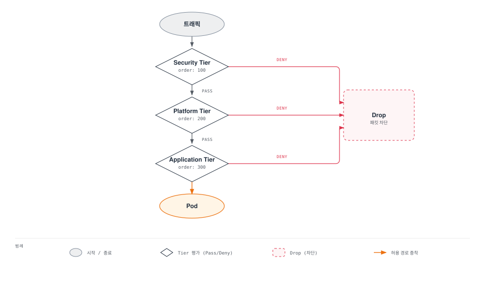

# Calico 용어집

> **마지막 업데이트**: 2026년 2월 22일

이 문서는 Calico와 관련된 주요 용어 및 약어에 대한 설명을 제공합니다. 용어는 카테고리별로 분류되어 있으며, 각 카테고리 내에서 알파벳/가나다 순으로 정렬되어 있습니다.

## 네트워킹 용어

### AS (Autonomous System)
BGP에서 단일 라우팅 정책을 가진 네트워크 그룹입니다. 각 AS는 고유한 AS 번호(ASN)를 가지며, Calico 클러스터는 일반적으로 하나의 AS로 구성됩니다.

```yaml
# 예시: BGPConfiguration에서 AS 번호 설정
apiVersion: projectcalico.org/v3
kind: BGPConfiguration
metadata:
  name: default
spec:
  asNumber: 64512  # Private AS 범위: 64512-65534
```

### BGP (Border Gateway Protocol)
자율 시스템 간 라우팅 정보를 교환하는 표준 프로토콜입니다. Calico는 BGP를 사용하여 Pod 네트워크 경로를 클러스터 전체에 전파합니다. 인터넷의 핵심 라우팅 프로토콜이기도 합니다.

### BIRD (BIRD Internet Routing Daemon)
Calico에서 사용하는 오픈소스 BGP 라우팅 데몬입니다. 각 노드에서 실행되며 다른 노드 및 외부 라우터와 BGP 피어링을 담당합니다.

### CIDR (Classless Inter-Domain Routing)
IP 주소 블록을 표기하는 방법입니다. 예: `10.244.0.0/16`은 10.244.0.0부터 10.244.255.255까지 65,536개의 IP 주소를 나타냅니다.

| CIDR | IP 수 | 용도 예시 |
|------|-------|----------|
| /16 | 65,536 | 전체 클러스터 Pod CIDR |
| /24 | 256 | 노드당 할당 (kubeadm) |
| /26 | 64 | Calico 기본 블록 크기 |
| /28 | 16 | 소규모 블록 |

### eBPF (extended Berkeley Packet Filter)
Linux 커널 내에서 안전하게 프로그램을 실행할 수 있는 기술입니다. Calico는 eBPF를 사용하여 고성능 네트워크 정책 적용 및 패킷 처리를 수행합니다. 기존 iptables보다 더 효율적입니다.

### IPIP (IP-in-IP)
IP 패킷을 다른 IP 패킷 내에 캡슐화하는 터널링 프로토콜입니다. Calico에서 오버레이 네트워킹 모드로 사용되며, 20바이트의 오버헤드가 있습니다.

### MTU (Maximum Transmission Unit)
네트워크에서 전송할 수 있는 최대 패킷 크기입니다. Calico 오버레이 네트워킹 사용 시 캡슐화 오버헤드를 고려하여 MTU를 조정해야 합니다.

| 모드 | 권장 MTU | 오버헤드 |
|------|---------|---------|
| Direct | 1500 | 0 |
| IPIP | 1480 | 20 bytes |
| VXLAN | 1450 | 50 bytes |
| WireGuard | 1400 | 60+ bytes |

### NAT (Network Address Translation)
IP 패킷의 소스 또는 목적지 IP 주소를 수정하는 프로세스입니다. Calico는 Pod에서 외부로 나가는 트래픽에 SNAT(Source NAT)를 적용할 수 있습니다.

### VXLAN (Virtual Extensible LAN)
Layer 2 네트워크를 Layer 3 네트워크 위에 오버레이하는 네트워크 가상화 기술입니다. UDP 포트 4789를 사용하며, IPIP보다 더 넓은 환경(특히 클라우드)에서 호환성이 좋습니다.

### VTEP (VXLAN Tunnel End Point)
VXLAN 패킷의 캡슐화 및 디캡슐화를 담당하는 엔드포인트입니다. Calico에서 각 노드는 VTEP 역할을 합니다.

---

## Calico 컴포넌트

### Felix
각 노드에서 실행되는 Calico의 핵심 정책 적용 에이전트입니다. 주요 역할:
- 인터페이스 관리 (Pod veth pair 생성)
- 라우팅 테이블 프로그래밍
- iptables/eBPF 규칙 관리
- Network Policy 적용

### BIRD
BGP 라우팅 데몬입니다. 주요 역할:
- BGP 피어 연결 관리
- 라우트 교환 및 전파
- Route Reflector 기능 (설정 시)

### Typha
대규모 클러스터(50+ 노드)를 위한 데이터스토어 프록시입니다. 주요 역할:
- 데이터스토어(API 서버) 연결 집계
- Felix에게 캐시된 데이터 제공
- API 서버 부하 감소

```
권장 복제본 수: max(3, ceil(노드 수 / 200))
```

### confd
BIRD 설정 파일을 동적으로 생성하는 구성 관리 도구입니다. BGP 설정 변경 시 BIRD 설정을 자동 업데이트합니다.

### kube-controllers
Kubernetes와 Calico 데이터스토어 간 동기화를 담당하는 컨트롤러 집합입니다. 포함된 컨트롤러:
- Policy Controller: NetworkPolicy 동기화
- Namespace Controller: 네임스페이스 프로필 관리
- ServiceAccount Controller: 서비스 계정 동기화
- WorkloadEndpoint Controller: 엔드포인트 정리
- Node Controller: 노드 정보 동기화

### calicoctl
Calico 리소스를 관리하는 CLI 도구입니다. kubectl과 유사하지만 Calico 전용 리소스에 특화되어 있습니다.

```bash
# 주요 명령어
calicoctl get <resource>        # 리소스 조회
calicoctl create -f <file>      # 리소스 생성
calicoctl apply -f <file>       # 리소스 적용
calicoctl delete <resource>     # 리소스 삭제
calicoctl node status           # 노드 상태 확인
calicoctl ipam show             # IPAM 상태 확인
```

---

## 정책 관련 용어

### GlobalNetworkPolicy
클러스터 전역에 적용되는 Calico 전용 네트워크 정책입니다. 네임스페이스에 관계없이 모든 Pod에 적용될 수 있으며, `selector: all()`로 전체 워크로드를 대상으로 할 수 있습니다.

```yaml
apiVersion: projectcalico.org/v3
kind: GlobalNetworkPolicy
metadata:
  name: default-deny
spec:
  selector: all()  # 모든 Pod에 적용
  types:
    - Ingress
    - Egress
```

### NetworkPolicy (Calico)
네임스페이스 범위의 Calico 확장 네트워크 정책입니다. Kubernetes 표준 NetworkPolicy를 확장하여 다음 기능을 추가합니다:
- `action` 필드 (Allow, Deny, Log, Pass)
- `order` 필드 (정책 평가 순서)
- FQDN/도메인 기반 규칙
- HTTP 메서드/경로 기반 규칙 (L7)

### NetworkSet / GlobalNetworkSet
IP 주소 집합을 정의하여 재사용할 수 있는 리소스입니다. NetworkSet은 네임스페이스 범위, GlobalNetworkSet은 클러스터 범위입니다.

```yaml
apiVersion: projectcalico.org/v3
kind: GlobalNetworkSet
metadata:
  name: trusted-partners
  labels:
    partner: trusted
spec:
  nets:
    - 203.0.113.0/24
    - 198.51.100.0/24
```

### Tier
정책 평가 계층입니다. 여러 Tier를 정의하여 정책을 계층화할 수 있으며, 낮은 order의 Tier가 먼저 평가됩니다.



### HostEndpoint
호스트(노드) 네트워크 인터페이스를 보호하기 위한 Calico 리소스입니다. Pod가 아닌 호스트 레벨의 트래픽에 정책을 적용합니다.

```yaml
apiVersion: projectcalico.org/v3
kind: HostEndpoint
metadata:
  name: node1-eth0
  labels:
    host: node1
spec:
  interfaceName: eth0
  node: node1
  expectedIPs: ["10.0.1.10"]
```

---

## 운영 용어

### IPPool
Pod에 할당할 IP 주소 범위를 정의하는 리소스입니다. CIDR, 캡슐화 모드, NAT 설정 등을 포함합니다.

```yaml
apiVersion: projectcalico.org/v3
kind: IPPool
metadata:
  name: default-ipv4-pool
spec:
  cidr: 10.244.0.0/16
  blockSize: 26        # /26 = 64 IPs per block
  ipipMode: Never
  vxlanMode: CrossSubnet
  natOutgoing: true
  nodeSelector: all()
```

### IPAM (IP Address Management)
IP 주소의 계획, 할당, 추적 및 관리를 담당하는 시스템입니다. Calico IPAM은 블록 기반 할당 방식을 사용합니다.

### WorkloadEndpoint
Pod 네트워크 엔드포인트를 나타내는 Calico 리소스입니다. 각 Pod에 대해 자동으로 생성되며, 적용된 정책, IP 주소, 인터페이스 정보를 포함합니다.

### BGPPeer
BGP 피어링 구성을 정의하는 리소스입니다. 외부 라우터 또는 다른 노드와의 BGP 연결을 설정합니다.

```yaml
apiVersion: projectcalico.org/v3
kind: BGPPeer
metadata:
  name: tor-router
spec:
  peerIP: 192.168.1.1
  asNumber: 64513
  nodeSelector: rack == 'rack1'
```

### BGPConfiguration
BGP 전역 설정을 정의하는 리소스입니다. AS 번호, node-to-node mesh, 서비스 IP 광고 등을 설정합니다.

### FelixConfiguration
Felix 에이전트의 동작을 구성하는 리소스입니다. iptables 설정, 로깅, 메트릭, eBPF 모드 등을 설정합니다.

### Route Reflector
대규모 BGP 네트워크에서 full-mesh 연결 대신 사용되는 경로 반사기입니다. 각 노드가 모든 노드와 피어링하는 대신 Route Reflector를 통해 경로를 전파합니다.

```
Full Mesh: n*(n-1)/2 연결 필요 (100노드 = 4,950 연결)
Route Reflector: n 연결 필요 (100노드 = 100 연결)
```

---

## Calico vs Kubernetes 용어 대조

| Calico 용어 | Kubernetes 대응 | 설명 |
|------------|----------------|------|
| NetworkPolicy | NetworkPolicy | Calico는 확장된 selector 문법과 action 지원 |
| GlobalNetworkPolicy | (해당 없음) | 클러스터 전역 정책, K8s에는 없음 |
| NetworkSet | (해당 없음) | IP 그룹 정의, K8s에는 없음 |
| GlobalNetworkSet | (해당 없음) | 클러스터 전역 IP 그룹, K8s에는 없음 |
| Tier | (해당 없음) | 정책 평가 계층, K8s에는 없음 |
| HostEndpoint | (해당 없음) | 호스트 인터페이스 보호, K8s에는 없음 |
| IPPool | (해당 없음) | IP 범위 정의, K8s에는 없음 |
| WorkloadEndpoint | Pod | Pod의 네트워크 엔드포인트 표현 |
| Profile | (해당 없음) | 레이블 기반 자동 정책, K8s에는 없음 |

---

## Calico vs Cilium 용어 대조

| 개념 | Calico | Cilium |
|------|--------|--------|
| **에이전트** | Felix | Cilium Agent |
| **네임스페이스 정책** | NetworkPolicy | CiliumNetworkPolicy |
| **클러스터 정책** | GlobalNetworkPolicy | CiliumClusterwideNetworkPolicy |
| **IP 관리** | IPPool + IPAM | CiliumNode + IPAM |
| **BGP 라우팅** | BIRD (네이티브 지원) | MetalLB 통합 또는 내장 BGP |
| **관측성** | Flow Logs, Prometheus | Hubble |
| **데이터플레인** | iptables / eBPF | eBPF (전용) |
| **서비스 메시** | 별도 (Enterprise) | 내장 지원 |
| **L7 정책** | Enterprise 전용 | 기본 지원 |
| **DNS 정책** | Enterprise 전용 | 기본 지원 |
| **암호화** | WireGuard, IPsec | WireGuard, IPsec |
| **CLI** | calicoctl | cilium CLI |
| **엔터프라이즈** | Calico Enterprise | Cilium Enterprise |

### 기능 비교 상세

| 기능 | Calico OSS | Cilium OSS | 비고 |
|------|-----------|-----------|------|
| **L3-L4 정책** | 완전 지원 | 완전 지원 | 동등 |
| **L7 정책** | 미지원 | 지원 | Cilium 우위 |
| **BGP** | 강력함 | 지원 | Calico 우위 |
| **Windows** | 완전 지원 | 베타 | Calico 우위 |
| **성숙도** | 매우 높음 | 높음 | Calico 우위 |
| **학습 곡선** | 중간 | 높음 | Calico 유리 |
| **커뮤니티** | 크고 활발 | 빠르게 성장 | 동등 |

---

## 약어 정리

| 약어 | 전체 명칭 | 설명 |
|------|----------|------|
| ASN | Autonomous System Number | BGP에서 네트워크 식별 번호 |
| BGP | Border Gateway Protocol | 경로 교환 프로토콜 |
| BIRD | BIRD Internet Routing Daemon | BGP 라우팅 데몬 |
| CIDR | Classless Inter-Domain Routing | IP 주소 표기법 |
| CNI | Container Network Interface | 컨테이너 네트워크 인터페이스 |
| DSR | Direct Server Return | 응답 패킷 직접 반환 |
| eBPF | extended Berkeley Packet Filter | 커널 내 프로그래밍 |
| ENI | Elastic Network Interface | AWS 가상 NIC |
| FQDN | Fully Qualified Domain Name | 전체 도메인 이름 |
| GNP | GlobalNetworkPolicy | 전역 네트워크 정책 |
| HNS | Host Networking Service | Windows 네트워크 서비스 |
| IPAM | IP Address Management | IP 주소 관리 |
| IPIP | IP-in-IP | IP 캡슐화 터널링 |
| MTU | Maximum Transmission Unit | 최대 전송 단위 |
| NAT | Network Address Translation | 주소 변환 |
| NP | NetworkPolicy | 네트워크 정책 |
| RR | Route Reflector | BGP 경로 반사기 |
| SNAT | Source NAT | 소스 주소 변환 |
| VXLAN | Virtual Extensible LAN | 가상 확장 LAN |
| VTEP | VXLAN Tunnel End Point | VXLAN 터널 엔드포인트 |

---

## 관련 문서

더 자세한 내용은 다음 문서를 참조하세요:

- [Part 7: 고급 주제](07-advanced-topics.md) - IPAM, WireGuard, 대규모 클러스터 설계
- [Part 8: EKS 통합](08-eks-integration.md) - Amazon EKS 환경에서의 Calico
- [Part 9: 운영 가이드](09-operations.md) - 설치, 모니터링, 트러블슈팅

## 참고 자료

- [Calico 공식 문서](https://docs.tigera.io/calico/latest/about/)
- [Calico API 레퍼런스](https://docs.tigera.io/calico/latest/reference/resources/)
- [calicoctl 레퍼런스](https://docs.tigera.io/calico/latest/reference/calicoctl/)

## 퀴즈

이 용어집의 내용을 테스트하려면 [용어집 퀴즈](../../quizzes/networking/calico/glossary-quiz.md)를 풀어보세요.
