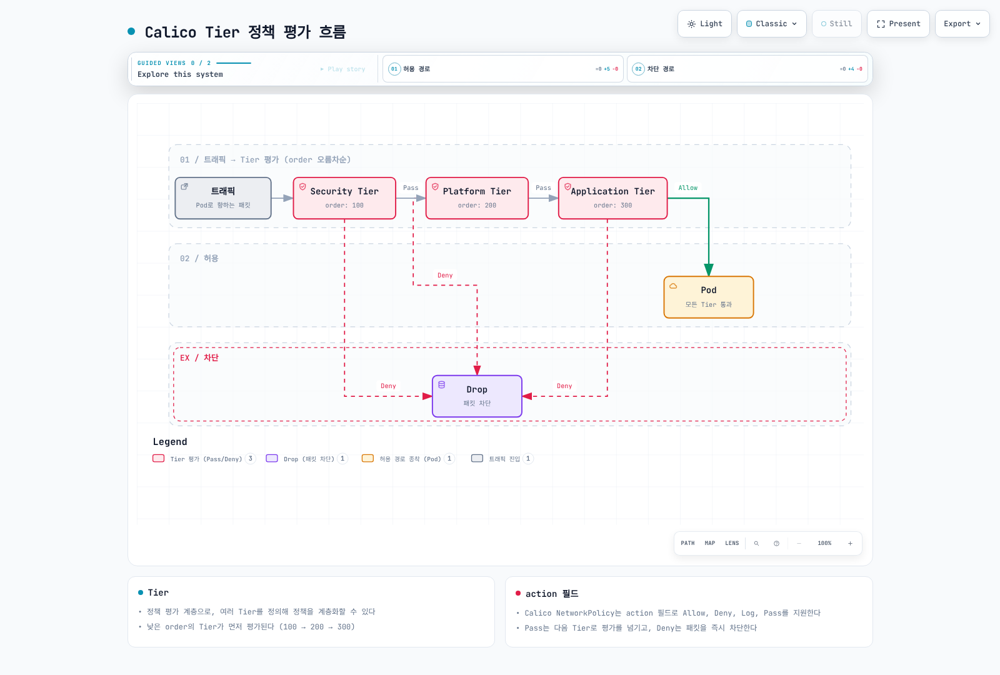

# Calico 용어집

> **검토 기준**: Calico 3.32.2, 비교 용어는 Cilium 1.20.1 확인.
> **마지막 업데이트**: 2026년 9월 12일

이 문서는 Calico와 관련된 주요 용어 및 약어에 대한 설명을 제공합니다. 용어는 카테고리별로 분류되어 있으며, 각 카테고리 내에서 알파벳/가나다 순으로 정렬되어 있습니다.

## 네트워킹 용어

### AS (Autonomous System)
BGP에서 단일 라우팅 정책을 가진 네트워크 그룹입니다. BGP는 AS 사이의 eBGP와 같은 AS 내부의 iBGP에서 사용합니다. RFC 6996의 private ASN 범위는 **64512–65534**와 **4200000000–4294967294**입니다. Private ASN은 관리 영역 안에서 재사용하며 인터넷 전체에서 고유한 공인 번호로 취급하지 않습니다.

```yaml
# 예시: BGPConfiguration에서 AS 번호 설정
apiVersion: projectcalico.org/v3
kind: BGPConfiguration
metadata:
  name: default
spec:
  asNumber: 64512  # 예시 private ASN; 실제 피어링 설계에 맞춰 선택
```

### BGP (Border Gateway Protocol)
자율 시스템 간 라우팅 정보를 교환하는 표준 프로토콜입니다. Calico는 BGP를 사용하는 구성에서 Pod/Service 경로를 배포합니다. 모든 Calico 데이터플레인이나 overlay 구성에 BGP가 필요한 것은 아닙니다. 인터넷의 핵심 라우팅 프로토콜이기도 합니다.

### BIRD (BIRD Internet Routing Daemon)
Calico에서 사용하는 오픈소스 BGP 라우팅 데몬입니다. BGP가 활성화된 구성에서 다른 노드 및 외부 라우터와 피어링합니다. Calico 3.32.2는 패치된 BIRD 1.6.8 계열을 사용하므로 임의의 BIRD 2 설정과 동일하게 취급하지 않습니다.

### CIDR (Classless Inter-Domain Routing)
IP 주소 블록을 표기하는 방법입니다. 예: `10.244.0.0/16`은 10.244.0.0부터 10.244.255.255까지 65,536개의 IP 주소를 나타냅니다.

| CIDR | IP 수 | 용도 예시 |
|------|-------|----------|
| /16 | 65,536 | 전체 클러스터 Pod CIDR |
| /24 | 256 | 노드당 할당 (kubeadm) |
| /26 | 64 | Calico 기본 블록 크기 |
| /28 | 16 | 소규모 블록 |

### eBPF (extended Berkeley Packet Filter)
Linux 커널 프로그래밍 기술입니다. Calico의 BPF 데이터플레인은 네트워킹, 정책, Service 처리에 이를 사용합니다. 커널·플랫폼·워크로드에 따라 호환성과 성능이 달라지므로 항상 iptables보다 효율적이라고 보장할 수 없습니다.

### IPIP (IP-in-IP)
IP 패킷을 다른 IP 패킷 내에 캡슐화하는 터널링 프로토콜입니다. Calico의 IPv4 IPIP 모드는 20바이트 outer IPv4 헤더를 추가합니다. Underlay에서 IP protocol 4를 허용해야 하며 UDP 포트를 뜻하지 않습니다.

### MTU (Maximum Transmission Unit)
네트워크에서 전송할 수 있는 최대 패킷 크기입니다. Calico 오버레이 네트워킹 사용 시 캡슐화 오버헤드를 고려하여 MTU를 조정해야 합니다.

다음은 **유효 underlay MTU가 1500인 독립적인 모드 예시**이며 보편적인 권장값이나 성능 측정값이 아닙니다.

| 모드 | 예시 Calico MTU | 헤더 오버헤드 |
| --- | --- | --- |
| Direct | 1500 | 0 |
| IPIP IPv4 | 1480 | 20 bytes |
| VXLAN IPv4 | 1450 | 50 bytes |
| VXLAN IPv6 | 1430 | 70 bytes |
| WireGuard IPv4 | 1440 | 60 bytes |
| WireGuard IPv6 | 1420 | 80 bytes |

실제 최소 경로 MTU와 플랫폼 제약을 확인하세요. Calico의 WireGuard/overlay 혼합은 피어별 경로가 달라질 수 있으므로 헤더를 무조건 더하지 않고 선택 가능한 경로 중 가장 작은 MTU를 적용합니다. [MTU 안내](03-networking-modes.md)를 참고하세요.

### NAT (Network Address Translation)
IP 패킷의 소스 또는 목적지 IP 주소를 수정하는 프로세스입니다. Calico는 Pod에서 외부로 나가는 트래픽에 SNAT(Source NAT)를 적용할 수 있습니다.

### VXLAN (Virtual Extensible LAN)
Layer 2 네트워크를 Layer 3 네트워크 위에 오버레이하는 네트워크 가상화 기술입니다. UDP 포트 4789를 사용하며, IPIP보다 더 넓은 환경(특히 클라우드)에서 호환성이 좋습니다.

### VTEP (VXLAN Tunnel End Point)
VXLAN 패킷의 캡슐화 및 디캡슐화를 담당하는 엔드포인트입니다. Calico에서는 VXLAN이 활성화된 해당 노드가 VTEP 역할을 합니다.

---

### CNI / veth
CNI는 컨테이너 네트워크 연결 설정 규격과 플러그인 체계입니다. 일반 Linux Calico CNI는 Pod와 호스트를 연결할 veth, IPAM, 경로 설정을 담당합니다. Felix가 모든 Pod의 veth를 생성하는 것이 아니며 hostNetwork Pod, Windows HNS, 다른 인터페이스 유형은 다릅니다.

### Conntrack / iptables / nftables
Conntrack은 상태 기반 정책과 NAT에 사용하는 연결 추적입니다. Linux 기본 conntrack과 BPF conntrack map은 같은 튜닝 대상이 아닙니다. iptables는 Netfilter를 다루는 userspace 인터페이스이며, iptables의 NFT backend와 Calico의 별도 native Nftables 데이터플레인도 구분해야 합니다.

### DSR (Direct Server Return)
Service를 처음 전달한 노드를 거치지 않고 backend가 응답하는 방식입니다. Calico BPF에서 지원하지만 네트워크와 출발지 주소 조건이 필요하며 모든 클라우드 로드 밸런서와 호환된다는 뜻은 아닙니다.

## Calico 컴포넌트

### Felix
각 노드에서 실행되는 Calico의 핵심 정책 적용 에이전트입니다. 주요 역할:
- CNI가 생성한 인터페이스 상태 추적과 필요한 데이터플레인 설정
- 라우팅 테이블 프로그래밍
- iptables/eBPF 규칙 관리
- Network Policy 규칙 설정, 커널 데이터플레인이 패킷 평가

### BIRD
BGP 라우팅 데몬입니다. 주요 역할:
- BGP 피어 연결 관리
- 라우트 교환 및 전파
- Route Reflector 기능 (설정 시)

### Typha
데이터스토어 변경을 캐시하여 여러 Felix에 배포하는 fan-out 서비스입니다. Felix별 watch 부하를 줄이지만 클러스터 전체가 단일 watch를 공유한다는 뜻은 아닙니다. 여러 syncer 종류와 복제본이 있고 정책을 다른 클러스터에 자동 복제하는 서비스도 아닙니다.

Operator 1.42.6의 노드 수 N에 대한 계산은 다음과 같습니다. “50개 이상에서만 필요” 또는 `ceil(N/200)`을 일반 규칙으로 사용하지 마세요.

| 조건 | 기대 Typha 복제본 |
| --- | --- |
| N ≤ 2 | 1 |
| 3 ≤ N ≤ 4 | 2 |
| N ≥ 5 | max(3, floor(N/200) + 2) |

실제 노드 집계, 배치 조건과 자원 용량은 [고급 주제](07-advanced-topics.md)에서 확인합니다.

### confd
BIRD 설정 파일을 동적으로 생성하는 구성 관리 도구입니다. BGP 설정 변경 시 BIRD 설정을 자동 업데이트합니다.

### kube-controllers
Kubernetes/Calico 상태 조정을 담당하는 컨트롤러 집합입니다. 아래는 역할 예시이며 데이터스토어·설치에 따라 활성 집합이 다릅니다. Kubernetes 데이터스토어 구성에서 모두 독립 컨트롤러로 실행된다고 가정하지 마세요:
- Policy Controller: NetworkPolicy 동기화
- Namespace Controller: 네임스페이스 프로필 관리
- ServiceAccount Controller: 서비스 계정 동기화
- WorkloadEndpoint Controller: 엔드포인트 정리
- Node Controller: 노드 정보 동기화

### calicoctl
Calico 리소스를 관리하는 CLI 도구입니다. kubectl과 유사하지만 Calico 전용 리소스에 특화되어 있습니다.

```bash
calicoctl get networkpolicy -A
calicoctl get ippool -o yaml
calicoctl ipam show
```

`calicoctl node status`는 필요한 접근 조건을 갖춘 로컬 노드의 BGP 진단입니다. Kubeconfig만 있다고 전체 노드 readiness 검사가 되지는 않습니다. 변경 명령과 IPAM 정리는 [운영 가이드](09-operations.md)를 따르세요.

### Calico API Server / Dikastes / Goldmane / Whisker
Calico API Server는 OSS에서도 제공하는 API 통합 컴포넌트이며 Kubernetes API 서버와 다릅니다. User-facing `projectcalico.org/v3`와 backing CRD/native API 경로는 실제 설치에 따라 구분합니다. Dikastes는 Istio/Envoy가 호출하는 L7 정책 결정 컴포넌트이며 자체 전달 프록시가 아닙니다. Goldmane는 flow 집계 API, Whisker는 웹 UI로, 현재 OSS flow 관측성 가이드는 tech preview로 표시합니다.


---

## 정책 관련 용어

### GlobalNetworkPolicy
클러스터 범위 Calico API 리소스입니다. Selector에 따라 여러 네임스페이스의 워크로드 또는 host endpoint를 선택하며 모든 Pod에 자동 적용된다는 뜻은 아닙니다. 다음은 **준비된 테스트 네임스페이스만** 선택하는 형태 예시입니다. 실제 적용 전 DNS·애플리케이션 등 허용 의존성을 구성해야 합니다.

```yaml
apiVersion: projectcalico.org/v3
kind: GlobalNetworkPolicy
metadata:
  name: glossary-demo-default-deny
spec:
  namespaceSelector: projectcalico.org/name == 'calico-glossary-demo'
  selector: all()  # 선택한 네임스페이스의 워크로드만
  types:
    - Ingress
    - Egress
```

### NetworkPolicy (Calico)
`projectcalico.org/v3`의 네임스페이스 범위 API이며 Kubernetes `networking.k8s.io/v1` NetworkPolicy와 별도 리소스입니다. Calico에는 다음과 같은 규칙이 있습니다:
- `action` 필드 (Allow, Deny, Log, Pass)
- `order` 필드 (정책 평가 순서)
- FQDN/도메인 기반 규칙은 문서화된 상용 에디션 기능
- HTTP 메서드/경로 규칙은 별도 지원 Istio/Envoy/Dikastes 통합 필요, OSS에도 문서화되어 있으며 기본 설치만으로 활성화되지 않음

### NetworkSet / GlobalNetworkSet
IP 주소 집합을 정의하여 재사용할 수 있는 리소스입니다. NetworkSet은 네임스페이스 범위, GlobalNetworkSet은 클러스터 범위의 레이블/CIDR 집합입니다. Policy selector로 선택하며 적절한 global namespace 선택을 사용하면 네임스페이스 정책에서도 GlobalNetworkSet을 참조할 수 있습니다. OSS CIDR 집합은 DNS/도메인 규칙이 아닙니다. 아래 CIDR은 형태 예시이지 실제 신뢰할 상대 목록이 아닙니다.

```yaml
apiVersion: projectcalico.org/v3
kind: GlobalNetworkSet
metadata:
  name: trusted-partners
  labels:
    partner: trusted
spec:
  nets:
    - 203.0.113.0/24
    - 198.51.100.0/24
```

### Tier
정책 평가 계층입니다. 낮은 숫자의 tier order, 이어서 해당 tier 내부 policy order 순으로 평가합니다. Allow/Deny는 최종 결정, Log는 계속 진행, Pass는 현재 tier의 나머지 정책을 건너뛰고 다음 적용 tier로 위임합니다. 마지막 tier의 Pass 이후에는 endpoint profile을 평가합니다. 선택된 tier에서 일치하는 규칙이 없으면 defaultAction(기본 Deny)을 적용합니다.



[🔍 인터랙티브 다이어그램 보기](https://www.atomai.click/kubernetes-docs/archmaps/ko-networking-calico-glossary-0.html)

그림은 사용자 정의 tier에서 Pass→Pass→Allow가 일어나는 한 경로입니다. 앞선 tier에서 Allow가 나면 뒤의 tier를 모두 방문하지 않으며, 세 tier 이름이나 이 순서가 필수 기본 구성은 아닙니다.

### HostEndpoint
호스트 인터페이스를 표현하여 호스트 정책을 적용하는 리소스입니다. 설정에 따라 노드를 통과하는 forwarded 트래픽에도 적용합니다. 아래는 형태 예시이며 실제 노드/인터페이스/IP로 생성하기 전에 host 정책, profile, failsafe와 관리 접근을 검토해야 합니다. 생성만으로 관리 연결이 제한될 수 있습니다.

```yaml
apiVersion: projectcalico.org/v3
kind: HostEndpoint
metadata:
  name: node1-eth0
  labels:
    host: node1
spec:
  interfaceName: eth0
  node: node1
  expectedIPs: ["10.0.1.10"]
```

---

## 운영 용어

### IPPool
Calico IPAM 등이 사용할 주소 pool을 정의합니다. CIDR, 캡슐화, NAT, node selector, 허용 용도(예: Workload/Tunnel, 지원되는 LoadBalancer IPAM)를 포함합니다. Kubernetes Node PodCIDR과 같은 오브젝트가 아니며 CIDR/blockSize는 변경할 수 없습니다. VPC CNI policy-only는 이 pool로 Pod IP를 할당하지 않습니다.

```yaml
apiVersion: projectcalico.org/v3
kind: IPPool
metadata:
  name: default-ipv4-pool
spec:
  cidr: 10.244.0.0/16
  blockSize: 26        # /26 = 64 IPs per block
  ipipMode: Never
  vxlanMode: CrossSubnet
  natOutgoing: true
  nodeSelector: all()
```

### IPAM (IP Address Management)
IP 주소의 계획, 할당, 추적 및 관리를 담당하는 시스템입니다. Calico IPAM은 블록 기반 할당을 사용합니다. 기본 IPv4 /26과 IPv6 /122는 각각 64개 주소이며 Windows 예약 등으로 워크로드 사용 가능 수가 줄 수 있습니다. BlockAffinity는 보통 노드와 블록의 연결입니다. strictAffinity가 아니면 다른 노드 블록에서 빌릴 수 있어 모든 Pod가 자기 노드 소유 블록의 주소를 받는 것은 아닙니다.

### WorkloadEndpoint
Pod/VM 등 워크로드 인터페이스의 네임스페이스 범위 표현입니다. 일반적으로 orchestrator/plugin이 수명주기를 관리하며 주소, 레이블, profile 참조가 정책 계산에 사용됩니다. 모든 유효 정책 결정이 저장된 목록이 아니므로 보통 읽기 전용으로 조사합니다.

### BGPPeer
BGP 피어링 구성을 정의하는 리소스입니다. 외부 라우터 또는 다른 노드와의 BGP 연결을 설정합니다.

```yaml
apiVersion: projectcalico.org/v3
kind: BGPPeer
metadata:
  name: tor-router
spec:
  peerIP: 192.168.1.1
  asNumber: 64513
  nodeSelector: rack == 'rack1'
```

### BGPConfiguration
`default`의 클러스터 BGP 기본값 등을 정의하며 AS 번호, node-to-node mesh, 서비스 IP 광고를 설정합니다. 노드 AS 및 지원되는 노드별 override도 별도로 확인해야 합니다.

### FelixConfiguration
Felix 기본값과 지원되는 노드별 override를 구성합니다. 로깅·메트릭·데이터플레인 설정을 다루지만 operator의 Installation API를 대체하지는 않습니다.

### Route Reflector
대규모 BGP 네트워크에서 full-mesh 연결 대신 사용되는 경로 반사기입니다. 각 노드가 모든 노드와 피어링하는 대신 Route Reflector를 통해 경로를 전파합니다.

노드 **총수 N에 reflector r개를 포함**하고, 각 client가 모든 reflector에 연결하며 reflector끼리 full mesh인 경우:

```text
Full mesh: N(N-1)/2
Reflectors: r(N-r) + r(r-1)/2
N=100, r=2: 197 sessions (full mesh: 4950)
N=100, r=1: 99 sessions, reflector redundancy 없음
```

### Profile / Staged Policy / Host Policy 옵션
Profile은 endpoint가 레이블을 공유하는 방식입니다. 과거 ingress/egress 규칙도 포함할 수 있지만 새 정책에는 NetworkPolicy/GlobalNetworkPolicy를 사용하도록 해당 기능이 deprecated되어 있습니다. Staged Policy는 비강제 정책 평가 리소스로 OSS에서도 제공되며 관측성 전제가 필요합니다.

Host GlobalNetworkPolicy의 `applyOnForward`는 forwarded 트래픽 적용을 제어합니다. `preDNAT`은 ingress에서 NAT 전에, `doNotTrack`은 conntrack 전에 적용하며 둘 다 `applyOnForward`가 필요합니다. `preDNAT`과 `doNotTrack`은 함께 사용할 수 없고 stateless 반환 경로는 별도 허용이 필요합니다. [정책 가이드](05-network-policy.md)를 참고하세요.

### Dataplane / Metrics / Health
Calico는 Linux Iptables/Nftables/BPF와 지원되는 Windows HNS 구성을 제공합니다. 데이터스토어는 Kubernetes API 또는 지원 직접 etcdv3 방식이며 기능별 제약이 다릅니다. 메트릭 포트는 Felix 기본 9091, Typha 바이너리 기본 9091(흔히 9093으로 명시), kube-controllers 기본 9094입니다. Felix health 기본 포트는 9099지만 컴포넌트 상태만으로 애플리케이션 연결과 정책 정확성이 증명되지는 않습니다.


---

## Calico vs Kubernetes 용어 대조

| Calico 용어 | Kubernetes 대응 | 설명 |
|------------|----------------|------|
| NetworkPolicy | NetworkPolicy | Calico는 확장된 selector 문법과 action 지원 |
| GlobalNetworkPolicy | 같은 API 없음 | 표준 Kubernetes NetworkPolicy와 다른 클러스터 범위 API |
| NetworkSet | (해당 없음) | IP 그룹 정의, K8s에는 없음 |
| GlobalNetworkSet | (해당 없음) | 클러스터 전역 IP 그룹, K8s에는 없음 |
| Tier | 같은 API 없음 | Calico의 정책 계층, 다른 확장 정책 API와 의미가 다를 수 있음 |
| HostEndpoint | (해당 없음) | 호스트 인터페이스 보호, K8s에는 없음 |
| IPPool | (해당 없음) | IP 범위 정의, K8s에는 없음 |
| WorkloadEndpoint | Pod 네트워크 인터페이스 | Service Endpoint/EndpointSlice나 전체 적용 정책 목록과 다름 |
| Profile | 직접 대응 없음 | 공유 레이블, 과거 규칙 기능은 새 정책에 권장되지 않음 |

---

## Calico vs Cilium 용어 대조

기능상 비교이며 리소스의 상호 교환이나 모든 구성의 지원을 보장하지 않습니다. 비교 기준은 Calico 3.32.2와 Cilium 1.20.1입니다.

| 개념 | Calico | Cilium 비교 |
| --- | --- | --- |
| 노드 에이전트 | Felix | Cilium Agent |
| BGP | BGP 구성의 BIRD | 내장 BGP Control Plane의 경로 광고, datapath 프로그래밍이나 내부 라우팅 설정 기능이 아님 |
| 데이터스토어 fan-out | Typha | 동일한 Typha 컴포넌트/API 없음 |
| Pod IP 할당 | IPPool + 선택한 IPAM | Cilium IPAM 모드에 따라 다르며 단일 pool API로 환산하지 않음 |
| 네임스페이스 정책 | Calico NetworkPolicy | CiliumNetworkPolicy, 둘 다 표준 Kubernetes NetworkPolicy와 별개 |
| 클러스터 정책 | GlobalNetworkPolicy | CiliumClusterwideNetworkPolicy, 규칙/우선순위 의미 차이 |
| 재사용 외부 CIDR | NetworkSet / GlobalNetworkSet | 클러스터 범위 CiliumCIDRGroup과 CIDR 규칙의 cidrGroupRef/cidrGroupSelector, CiliumIPSet이 아님 |
| 정책 tier | Calico Tier | 동일한 Calico Tier API 없음, 다른 정책 API의 우선순위 별도 확인 |
| 워크로드 인터페이스 | WorkloadEndpoint | CiliumEndpoint, 수명주기/status 의미 차이 |
| 호스트 보호 | HostEndpoint와 설정된 forwarding 정책 | Linux host firewall/nodeSelector 정책, forwarding 범위는 동일하지 않음 |
| 데이터플레인 | Linux Iptables/Nftables/BPF, Windows HNS | Linux eBPF 요구사항, 이 비교에서 Windows 지원 beta로 설명할 근거 없음 |
| 암호화 | OSS WireGuard의 지원 peer 경로 | WireGuard 또는 IPsec, 모드/플랫폼 제약 확인 |
| L7 정책 | OSS에도 문서화된 별도 Istio/Envoy/Dikastes 통합 | Envoy 기반 정책 기능, 별도 전제 필요 |
| Flow 관측성 | Goldmane/Whisker와 메트릭 | Hubble과 메트릭 |
| 컨트롤러 | kube-controllers / Tigera Operator | Cilium Operator, 역할이 일대일 대응하지 않음 |
| CLI | calicoctl | cilium과 에이전트 내부 cilium-dbg의 역할 구분 |

Calico의 Windows 지원은 Linux 전체 기능과 같지 않습니다. IPv4 HNS와 문서화된 VXLAN/BGP 제한을 따르며 WireGuard/eBPF/host endpoint가 동일하게 제공되지 않습니다. 서비스 메시·L7 기능도 각 통합과 구성을 검토해야 합니다. 성능, 성숙도, 학습 난이도, 커뮤니티 규모를 근거 없이 등급화하기보다 구체적인 워크로드와 운영 요구를 비교하세요.

---

## 약어 정리

| 약어 | 전체 명칭 | 설명 |
|------|----------|------|
| ASN | Autonomous System Number | BGP에서 네트워크 식별 번호 |
| BGP | Border Gateway Protocol | 경로 교환 프로토콜 |
| BIRD | BIRD Internet Routing Daemon | BGP 라우팅 데몬 |
| CIDR | Classless Inter-Domain Routing | IP 주소 표기법 |
| CNI | Container Network Interface | 컨테이너 네트워크 인터페이스 |
| DSR | Direct Server Return | 응답 패킷 직접 반환 |
| eBPF | extended Berkeley Packet Filter | 커널 내 프로그래밍 |
| ENI | Elastic Network Interface | AWS 가상 NIC |
| FQDN | Fully Qualified Domain Name | 전체 도메인 이름 |
| GNP | GlobalNetworkPolicy | 전역 네트워크 정책 |
| HNS | Host Networking Service | Windows 네트워크 서비스 |
| IPAM | IP Address Management | IP 주소 관리 |
| IPIP | IP-in-IP | IP 캡슐화 터널링 |
| MTU | Maximum Transmission Unit | 최대 전송 단위 |
| NAT | Network Address Translation | 주소 변환 |
| NP | NetworkPolicy | 네트워크 정책 |
| RR | Route Reflector | BGP 경로 반사기 |
| SNAT | Source NAT | 소스 주소 변환 |
| VXLAN | Virtual Extensible LAN | 가상 확장 LAN |
| VTEP | VXLAN Tunnel End Point | VXLAN 터널 엔드포인트 |

---

## 관련 문서

더 자세한 내용은 다음 문서를 참조하세요:

- [Part 7: 고급 주제](07-advanced-topics.md) - IPAM, WireGuard, 대규모 클러스터 설계
- [Part 8: EKS 통합](08-eks-integration.md) - Amazon EKS 환경에서의 Calico
- [Part 9: 운영 가이드](09-operations.md) - 설치, 모니터링, 트러블슈팅

## 참고 자료

- [Calico 리소스 참조](https://docs.tigera.io/calico/latest/reference/resources/)
- [Calico Tier](https://docs.tigera.io/calico/latest/reference/resources/tier)
- [Calico MTU](https://docs.tigera.io/calico/latest/networking/configuring/mtu)
- [RFC 6996 private ASN](https://www.rfc-editor.org/rfc/rfc6996.txt)
- [Cilium CIDR group API](https://github.com/cilium/cilium/blob/v1.20.1/pkg/k8s/apis/cilium.io/v2/cidrgroups_types.go)
- [Cilium BGP Control Plane](https://github.com/cilium/cilium/blob/v1.20.1/Documentation/network/bgp-control-plane/bgp-control-plane.rst)
- [Cilium host firewall](https://github.com/cilium/cilium/blob/v1.20.1/Documentation/security/host-firewall.rst)

## 퀴즈

이 용어집의 내용을 테스트하려면 [용어집 퀴즈](../../quizzes/networking/calico/glossary-quiz.md)를 풀어보세요.
