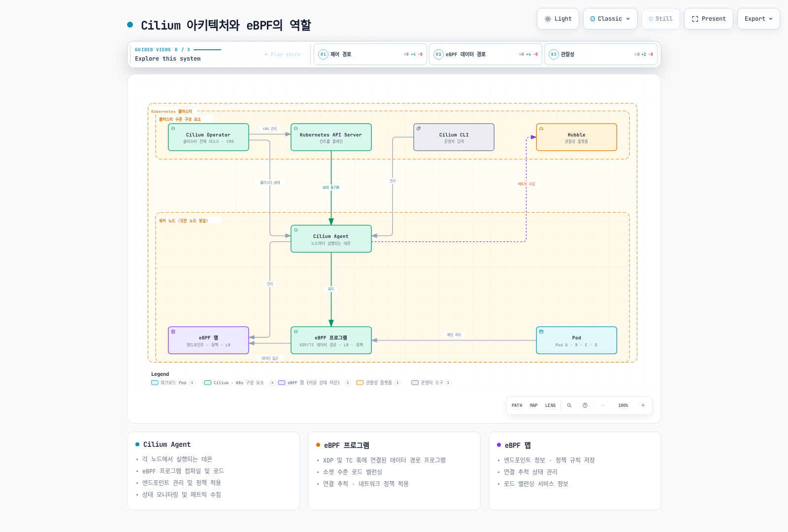

# eBPF 기술 심층 분석

> **검토 기준**: Cilium 1.20.1, Linux 5.10+ 또는 문서화된 동등 백포트(예: RHEL 8.10의 4.18 커널), 테스트된 Kubernetes 1.33–1.36. 개별 BPF 기능에는 별도 조건이 있습니다.
> **최종 검토**: 2026년 9월 12일

## 실습 환경 설정

유지보수되는 배포판, 아래 tracepoint, 추적 프로그램을 로드할 권한이 있는 일회용 Linux 개발 VM을 사용합니다. Cilium 설치와 별개 실습이므로 실험용 프로그램을 클러스터 노드에 로드하지 않습니다. 검증기 설명의 소스 기준은 Linux 6.12이며 모든 6.12 배포판에서 모든 기능이 활성화되어 있다는 뜻은 아닙니다.

BPF 백엔드가 있는 Clang, 대상 아키텍처의 UAPI 헤더, libbpf 1.x 개발 헤더·라이브러리, libelf, zlib, C 컴파일러와 bpftool이 필요합니다. BCC와 bpftrace는 선택 가능한 다른 도구입니다. Debian/Ubuntu에서는 보통 `clang`, `libbpf-dev`, `libelf-dev`, `zlib1g-dev`, `build-essential`, `pkg-config`를 사용하지만 bpftool 패키징은 배포판·커널에 따라 다릅니다. 모든 Debian 시스템에 `linux-tools-generic`이 맞는다고 가정하지 않습니다. Cilium은 AMD64/AArch64 호스트를 문서화하며 컨테이너 이미지 밖에서 Cilium을 네이티브 실행할 때는 Clang/LLVM 18.1+가 추가로 필요합니다. 이는 작은 추적 실습의 요구사항과 별개입니다.

```bash
uname -r
clang --version
clang --print-targets
pkg-config --modversion libbpf
bpftool version
test -r /sys/kernel/tracing/events/syscalls/sys_enter_execve/format
test -r /sys/kernel/tracing/events/sched/sched_process_exec/format
# 준비된 실습 VM에서만 BPF 기능을 능동적으로 탐색합니다.
sudo bpftool feature probe kernel
```

Tracefs가 마운트되어 있고 접근 가능해야 합니다. 일부 시스템에서는 `/sys/kernel/debug/tracing`에 노출됩니다. 커널 설정, capability, lockdown/LSM 정책, 컨테이너 제약 때문에 컨테이너 root도 로드·연결하지 못할 수 있습니다. `CAP_BPF` 하나가 모든 추적 권한을 뜻하지 않으며 필요한 권한은 커널, 프로그램 타입, BPF token 위임에 따라 다릅니다.

**검증 범위:** 예제는 libbpf 1.7 헤더를 사용한 호스트 C 문법 검사, 사용자 공간 링크, 결정적인 헬퍼 시뮬레이션을 통과했습니다. Clang BPF 대상 컴파일, 실행 커널 검증기와 실제 tracepoint 연결은 준비된 VM에서 추가 검증해야 합니다. 운영 환경 검증이나 무손실 추적을 보장하는 예제가 아닙니다.

## eBPF 기술 소개 및 역사적 배경

eBPF는 허용된 프로그램을 Linux의 지원 훅에서 실행하여 커널 동작을 관찰하거나 제어합니다. 검증기는 메모리 접근과 실행을 제한하지만 커널, 검증기, JIT, 헬퍼의 버그 가능성은 남습니다. 검증 통과가 호스트 장애 불가능이나 의도한 정책의 정확성을 보장하지는 않습니다.

### BPF에서 eBPF로: 발전 역사

McCanne과 Jacobson의 *The BSD Packet Filter: A New Architecture for User-level Packet Capture*에는 1992년 12월 19일 사전 원고 날짜와 1993년 1월 25–29일 Winter USENIX 발표가 함께 명시되어 있습니다. 연도를 인용할 때 이 차이를 보존합니다. Classic BPF는 32비트 A/X 레지스터와 scratch 메모리로 필터링하여 불필요한 사용자 공간 패킷 복사를 줄였습니다. 제한된 명령어 집합이 현대 CPU에서 실행할 수 없다는 뜻은 아닙니다.

확장 BPF는 64비트 명령어 집합, R0–R10의 레지스터 11개(R10은 읽기 전용 프레임 포인터), 일반적으로 512바이트로 제한되는 스택, 맵과 다양한 프로그램 타입을 추가했습니다. 범용 레지스터가 역사적으로 10개에서 11개로 늘어났다는 뜻은 아닙니다. 함수·tail call 조합에는 추가 스택 제약이 있습니다.

### eBPF의 기술적 진화: 커널 버전별 주요 기능

버전이 고정된 업스트림 소스에서 확인한 주요 변화입니다. 배포판 지원표는 아니며 백포트, 빌드 옵션, 아키텍처와 헬퍼 지원은 다를 수 있습니다.

| Kernel | 주요 변화 |
|---|---|
| [3.15](https://github.com/torvalds/linux/blob/v3.15/include/linux/filter.h) | 확장 명령어 집합과 내부 classic BPF 변환 |
| [3.16](https://github.com/torvalds/linux/blob/v3.16/arch/x86/net/bpf_jit_comp.c) | x86 확장 BPF JIT |
| [3.18](https://github.com/torvalds/linux/blob/v3.18/include/uapi/linux/bpf.h) | BPF 시스템 호출·검증 기반; 아직 사용 가능한 HASH/ARRAY 타입 없음 |
| [3.19](https://github.com/torvalds/linux/blob/v3.19/include/uapi/linux/bpf.h) | HASH/ARRAY 맵과 socket-filter 프로그램 타입 |
| [4.1](https://github.com/torvalds/linux/blob/v4.1/include/uapi/linux/bpf.h) | KPROBE와 TC SCHED_CLS/SCHED_ACT |
| [4.2](https://github.com/torvalds/linux/blob/v4.2/include/uapi/linux/bpf.h) | PROG_ARRAY와 tail call |
| [4.8](https://github.com/torvalds/linux/blob/v4.8/include/uapi/linux/bpf.h) | XDP 프로그램 타입 |
| [4.10](https://github.com/torvalds/linux/blob/v4.10/include/uapi/linux/bpf.h) | LRU 해시 맵 |
| [4.16](https://github.com/torvalds/linux/blob/v4.16/include/uapi/linux/bpf.h) | BPF-to-BPF 함수 호출 |
| [4.17](https://github.com/torvalds/linux/blob/v4.17/include/uapi/linux/bpf.h) | Raw tracepoint |
| [4.18](https://github.com/torvalds/linux/blob/v4.18/include/uapi/linux/bpf.h) | BTF 로드 API |
| [5.2](https://github.com/torvalds/linux/blob/v5.2/include/uapi/linux/bpf.h) | 전역 데이터에 사용하는 맵 값 직접 접근 |
| [5.7](https://github.com/torvalds/linux/blob/v5.7/include/uapi/linux/bpf.h) | BPF link API와 BPF LSM |
| [5.8](https://github.com/torvalds/linux/blob/v5.8/include/uapi/linux/bpf.h) | BPF 링 버퍼 |
| [5.10](https://github.com/torvalds/linux/blob/v5.10/include/uapi/linux/bpf.h) | 지원되는 연결 타입의 sleepable 프로그램 |
| [5.15](https://github.com/torvalds/linux/blob/v5.15/include/uapi/linux/bpf.h) | BPF 타이머 헬퍼 |
| [5.19](https://github.com/torvalds/linux/blob/v5.19/include/uapi/linux/bpf.h) | 동적 포인터 헬퍼 |
| [6.2](https://github.com/torvalds/linux/blob/v6.2/kernel/bpf/helpers.c) | 타입이 있는 객체 할당 kfunc; 임의 malloc과는 다름 |

Bounded loop는 Linux 5.3에 도입되었습니다. [업스트림 검증기 변경](https://github.com/torvalds/linux/commit/2589726d12a1b12eaaa93c7f1ea64287e383c7a5)은 루프 분석과 상태 가지치기를 설명합니다. 설계 FAQ에 남아 있는 “루프 미구현” 문단을 현재 기능 안내로 사용하면 안 됩니다. 제한된 루프도 검증 복잡도 한도를 초과할 수 있습니다.

### 생태계 성장과 활용 분야

Cilium 공개 저장소는 2015년 12월 생성되었으므로 프로젝트가 2017년에 처음 시작되었다는 설명은 부정확합니다. 저장소 생성일이 정확한 제품 출시일이나 “최초의 주요 프로젝트”라는 순위의 근거는 아닙니다.

| 분야 | 예와 경계 |
|---|---|
| 네트워킹 | Cilium/Calico 데이터플레인, Katran 로드밸런싱, XDP 필터링 |
| 런타임 보안 | Falco, Tracee, Tetragon의 커널 이벤트 활용; 차단 기능은 제품·훅에 따라 다름 |
| 추적 | Python/Lua 프런트엔드를 포함한 BCC, bpftrace, 스토리지·블록 I/O 추적 |
| 네트워크 관측 | Hubble의 플로우·프록시 이벤트; 플로우 그래프가 분산 애플리케이션 span 추적은 아님 |
| 서비스 메시 | Cilium이 커널 전달과 사용자 공간 프록시를 조합하여 지원되는 L7 기능 제공 |
| 커뮤니티 | eBPF Foundation이 생태계를 지원하며 투자·성숙도가 호환성 기준은 아님 |

`seccomp-bpf`는 시스템 호출 판단에 classic BPF 필터 인터페이스를 사용합니다. Linux가 내부에서 classic 필터를 변환할 수 있지만 일반 eBPF 프로그램·맵·헬퍼 API와 같지는 않습니다.

### eBPF와 전통적 커널 모듈 비교

| 특성 | eBPF | 커널 모듈 |
|---|---|---|
| 안전성 | 검증기로 실행 제한; 구현 버그와 운영 위험은 남음 | 더 넓은 네이티브 커널 접근; 버그로 호스트 장애 가능 |
| 배포 | 지원 프로그램은 재부팅 없이 로드·연결 가능 | 의존성·사용 상태가 허용하면 많은 모듈도 재부팅 없이 로드·해제 가능 |
| 호환성 | 명령어·헬퍼 ABI와 기능 조건; CO-RE는 지원되는 타입 접근 재배치 | 커널·모듈 ABI, 설정, 배포판 지원에 의존 |
| 성능 | 흔히 JIT 사용; 훅·프로그램·워크로드에 따른 오버헤드 | 네이티브 실행도 워크로드에 따른 비용 발생 |
| 개발 | 제한된 context, 헬퍼·kfunc, 검증기 한도 | 커널 API와 일반적인 커널 개발 제약 |
| 권한 | 로드·연결을 위한 적절한 권한 또는 위임 필요 | 특권 로드; 서명·lockdown 제약 가능 |

두 방식 모두 운영 검증이 필요합니다. 모듈이 벤더 구현으로만 제한되지 않으며 eBPF라는 이유만으로 운영 배포가 안전해지지 않습니다.

## 커널 내부 eBPF 아키텍처 심층 분석

### eBPF 아키텍처 구성 요소 상세 설명

사용자 공간에서 Clang은 C를 BPF ELF로 컴파일하고 Rust는 자체 컴파일러·도구 생태계를 사용합니다. libbpf는 ELF section, 맵, 재배치, 로드와 지원되는 연결 API를 처리합니다. BCC는 상위 API, bpftrace는 추적 언어를 제공합니다.

CO-RE는 BTF와 재배치로 지원되는 타입·필드 접근을 조정합니다. 없는 헬퍼, 프로그램 타입, 커널 설정을 제공하거나 임의의 아키텍처·커널 간 호환성을 보장하지 않습니다. BTF를 쓴다고 커널 내부 구조, tracepoint 형식, kfunc가 안정적인 ABI가 되지는 않습니다.

커널 검증기는 프로그램 타입, context, 헬퍼와 권한을 검사합니다. JIT는 허용된 BPF를 네이티브 명령어로 변환할 수 있으며 인터프리터는 지원 환경의 다른 실행 방식입니다. JIT 출력이 반드시 별도 VM 단계를 다시 통과하는 구조는 아닙니다. 연결 단계가 로드된 프로그램과 훅을 연결하며 로드만으로 tracepoint를 구독하지 않습니다.

### eBPF 프로그램 생명주기 상세 분석

1. **개발:** 훅/context와 맵·라이선스 메타데이터를 정의합니다. 모든 프로그램에 GPL 호환성이 필요한 것은 아니지만 GPL 전용 헬퍼와 일부 타입·kfunc에는 제한이 있습니다. 이 추적 예제는 헬퍼에 맞춰 GPL 메타데이터를 사용합니다.
2. **컴파일:** 대상 도구·헤더로 BPF ELF와 필요한 debug/BTF 정보를 만듭니다.
3. **열기·로드:** ELF를 읽고 맵을 생성하거나 명시적으로 재사용하며 재배치와 BPF 로드 API를 수행합니다. 검증과 선택적 JIT는 로드 중 발생합니다.
4. **연결:** 적절한 API를 사용합니다. libbpf는 아래 `SEC("tracepoint/...")`에서 훅을 추론할 수 있으며 link/연결의 수명을 유지해야 합니다.
5. **실행·관찰:** 이벤트가 프로그램을 호출하고 사용자 공간이 맵·버퍼를 읽습니다. 샘플링·용량 제한 때문에 관측이 누락될 수 있습니다.
6. **갱신·해제:** 필요한 경우에만 호환 맵·link·pin을 의도적으로 유지합니다. 이 실습에서는 link와 object를 닫아 자원을 해제합니다.

Linux 6.12에서 BPF 권한이 있는 로드 경로의 프로그램 길이는 최대 1,000,000개 명령어, 비특권 경로는 4,096개로 제한됩니다. 검증기에는 별도로 1,000,000개 명령어의 **분석 복잡도** 한도가 있습니다. 더 작은 프로그램도 검증에 실패할 수 있습니다. 비특권 BPF는 비활성화된 경우가 많으며 token/capability와 프로그램 타입 검사도 적용됩니다.

### eBPF 프로그램 유형과 특성

| 훅 / 프로그램 타입 | 용도와 반환값의 경계 |
|---|---|
| XDP / `BPF_PROG_TYPE_XDP` | Native driver XDP는 skb 할당 전에 실행하며 generic/offload 모드는 다름. `XDP_DROP`, `PASS`, `TX`, `REDIRECT`는 동작이지 처리량 보장이 아님 |
| TC / `SCHED_CLS`, `SCHED_ACT` | Ingress/egress 패킷 분류·동작. Classifier의 `TC_ACT_*` 의미에는 적절한 direct-action 설정 필요 |
| Socket filter / `SOCKET_FILTER` | 소켓 패킷 전달: 0은 폐기, 양수 캡처 길이는 절단 가능. 생성·connect 정책은 다른 훅 사용 |
| kprobe/uprobe / `KPROBE` | 커널·사용자 공간 probe. 별도 `BPF_PROG_TYPE_UPROBE` 없음. 인라이닝·금지 목록·심볼 존재가 연결 제한 |
| Tracepoint / `TRACEPOINT` | 정적 이벤트 context. 대상 format 확인 필요; 안정적인 커널 ABI 보장 아님 |
| Perf event / `PERF_EVENT` | 성능 샘플링; 반환 동작은 perf-event 통합에 따름 |
| cgroup / `CGROUP_SKB`, `CGROUP_SOCK`, `CGROUP_SOCK_ADDR` 등 | 네트워크·소켓 제어; context와 허용·거부 규칙이 다름 |
| LSM / `LSM` | MAC 방식은 보통 이전 오류를 유지하고 0/오류 반환; cgroup-LSM 허용 의미는 다름 |
| Socket operations / `SOCK_OPS` | TCP 콜백; 동작·reply 필드·헬퍼 지원 확인 필요 |
| fentry/fexit / `TRACING` | 지원 대상의 BTF 기반 함수 추적; 대상·연결 제약은 남음 |

필요한 가시성·제어로 훅을 선택합니다. XDP에는 후단 스택 context 일부가 없고 TC는 skb 기반 트래픽을 처리합니다. Tracepoint/probe 관측이 자동으로 정책을 집행하는 것은 아닙니다. 타입 간 context 구조나 반환 코드를 그대로 복사하지 않습니다.

### eBPF 맵: 데이터 공유와 상태 저장의 핵심

맵은 FD, 로드된 프로그램, 명시적인 bpffs pin 등의 참조가 남아 있는 동안 존재합니다. Pin은 디스크 영속 저장이 아니며 재부팅 후 내용도 보존하지 않습니다. 재로드 시 이전 맵을 자동 재사용하지 않습니다.

| 타입 | 용도와 제약 |
|---|---|
| `HASH` | 용량 제한 키·값 테이블. 가득 차면 삽입 실패 가능. 평균 상수 시간 조회가 지연 보장은 아님 |
| `ARRAY` | 유효 인덱스의 값은 미리 할당되고 0으로 초기화됨. 0이 없는 해시 엔트리를 뜻하지 않음 |
| `LRU_HASH` | LRU 방식 축출 캐시; 무손실 누적 카운터가 아님 |
| `RINGBUF` | CPU 간 다중 생산자·단일 소비자; key/value 크기 0, 2의 거듭제곱 바이트 용량; 예약 실패 시 블로킹하지 않음 |
| `PERF_EVENT_ARRAY` | CPU별 perf 채널; 사용자 공간 설정·소비와 유실 레코드 집계 필요 |
| `PROG_ARRAY` | Tail call 프로그램 참조; 대상 호환성과 호출 한도 적용 |
| `PERCPU_HASH` / `PERCPU_ARRAY` | CPU 간 경합 감소; 모든 race 제거는 아님. 사용자 공간은 모든 possible CPU 슬롯·패딩 고려 |
| `SOCKMAP` / `SOCKHASH` | 지원되는 리다이렉션·프로그램의 소켓 참조; 임의 소켓 동작 훅이 아님 |

libbpf 1.x에서 `struct bpf_map_def SEC("maps")`가 제거되었습니다. 다음 BTF 선언은 실제 타입으로 여덟 맵 범주를 보여줍니다. 필요한 맵을 적절한 프로그램과 조합해야 하며 선언만으로 이벤트 파이프라인이 완성되지 않습니다.

**`map_types.bpf.c`**

```c
#include <linux/bpf.h>
#include <bpf/bpf_helpers.h>

/* Definitions only; combine the needed maps with a suitable program. */
struct {
    __uint(type, BPF_MAP_TYPE_HASH);
    __uint(max_entries, 1024);
    __type(key, __u32);
    __type(value, __u64);
} hash_counts SEC(".maps");

struct {
    __uint(type, BPF_MAP_TYPE_ARRAY);
    __uint(max_entries, 1);
    __type(key, __u32);
    __type(value, __u64);
} total SEC(".maps");

struct {
    __uint(type, BPF_MAP_TYPE_LRU_HASH);
    __uint(max_entries, 1024);
    __type(key, __u32);
    __type(value, __u64);
} cache SEC(".maps");

struct {
    __uint(type, BPF_MAP_TYPE_RINGBUF);
    __uint(max_entries, 256 * 1024);
} events SEC(".maps");

struct {
    __uint(type, BPF_MAP_TYPE_PERF_EVENT_ARRAY);
    __type(key, __u32);
    __type(value, __u32);
    /* libbpf determines max_entries from the number of possible CPUs. */
} perf_events SEC(".maps");

struct {
    __uint(type, BPF_MAP_TYPE_PROG_ARRAY);
    __uint(max_entries, 10);
    __type(key, __u32);
    __type(value, __u32);
} jump_table SEC(".maps");

struct {
    __uint(type, BPF_MAP_TYPE_PERCPU_ARRAY);
    __uint(max_entries, 1);
    __type(key, __u32);
    __type(value, __u64);
} cpu_counts SEC(".maps");

struct {
    __uint(type, BPF_MAP_TYPE_SOCKMAP);
    __uint(max_entries, 1024);
    __type(key, __u32);
    __type(value, __u32);
} sockets SEC(".maps");
```

공유 카운터는 원자적 증가가 필요합니다. 새 해시 키에는 `BPF_NOEXIST` 삽입 후 실제로 만들어진 엔트리를 조회·증가시켜야 합니다. `BPF_ANY` 초기화는 다른 CPU의 카운트를 덮어쓸 수 있습니다. 배열의 유효 인덱스에는 엔트리가 이미 존재합니다.

## Cilium에서의 eBPF 활용: 컨테이너 네트워킹의 혁신

### Cilium 아키텍처와 eBPF의 역할



[🔍 인터랙티브 다이어그램 보기](https://www.atomai.click/kubernetes-docs/archmaps/ko-networking-cilium-02-ebpf-1.html)

그림은 논리적 역할이며 필수 위치나 단일 컴파일 파이프라인이 아닙니다. CLI는 클러스터 밖에서 실행할 수 있고 에이전트는 적격 관리 노드에서 실행합니다. 프로그램 빌드·로드는 버전·기능에 따라 다릅니다. Hubble Relay는 플로우를 집계하며 Prometheus 메트릭은 별도 엔드포인트입니다.

에이전트는 endpoint, identity, 정책, 데이터플레인 상태를 조정합니다. Operator는 설정된 identity/IPAM 생명주기 같은 클러스터 작업을 담당하며 패킷 전달 경로가 아닙니다. Hubble은 BPF 플로우 정보와 사용자 공간 프록시 이벤트를 조합합니다.

### Cilium eBPF 데이터플레인 상세 분석

다음은 협력하는 기능이며 모든 패킷의 고정 처리 순서가 아닙니다.

1. **진입:** 소켓 훅은 패킷 생성 전 Service 백엔드를 결정할 수 있고 TC는 패킷 경로를 처리합니다. 선택적 XDP 가속은 지원되는 외부 트래픽에 적용합니다.
2. **Identity·정책:** IP/identity와 endpoint 정책으로 L3/L4 접근을 제어합니다. 지원되는 HTTP/gRPC 정책은 Envoy, DNS는 DNS 프록시를 사용하며 L7 파싱·집행 전체가 BPF는 아닙니다.
3. **상태·변환:** conntrack, service/backend, reverse-NAT, affinity 맵은 역할이 다르며 모든 패킷에서 백엔드를 다시 선택하지 않습니다.
4. **전달:** native routing 또는 설정된 overlay를 사용합니다. DSR dispatch·반환 경로에는 모드에 맞는 네트워크 조건이 필요합니다.
5. **관찰:** 데이터플레인 카운터·이벤트와 프록시 이벤트에는 설정·수집 유실의 한계가 있습니다.

백엔드 readiness는 제어플레인 상태와 해당 health 메커니즘에서 얻으며 모든 애플리케이션을 BPF가 probe한다는 뜻은 아닙니다. Maglev, affinity, DSR, 가속은 선택 기능이지 항상 적용되는 기본값이 아닙니다.

### Cilium 주요 eBPF 프로그램 상세 설명

| Cilium 1.20.1 소스 | 역할 |
|---|---|
| `bpf/bpf_lxc.c` | Endpoint 패킷 경로, 정책, conntrack과 전달 |
| `bpf/bpf_overlay.c` | Overlay 패킷 경로 |
| `bpf/bpf_host.c` | 호스트·장치 경로와 지원되는 host firewall 처리 |
| `bpf/bpf_xdp.c` | 설정된 로드밸런서 가속 등을 포함한 XDP 경로 |
| `bpf/bpf_sock.c` | connect/sendmsg/recvmsg 서비스 변환 등의 socket-address 훅 |
| `bpf/lib/lb.h` | 공통 로드밸런싱 헬퍼 |
| `bpf/lib/policy.h` | 공통 정책 헬퍼 |

이 릴리스에는 최상위 `bpf_lb.c`, `bpf_network.c` 파일이 없습니다. 함수명·기능 조건은 변하므로 개념적인 이름을 소스 파일로 가정하지 말고 정확한 버전을 확인합니다.

### Cilium의 eBPF 맵 활용

다음 예는 안정적인 맵 레이아웃 API가 아닙니다.

| 이름 / 계열 | 키와 역할 |
|---|---|
| `cilium_lxc` | 주소·주소 계열 → endpoint 전달 메타데이터. 단순 endpoint ID가 아님 |
| `cilium_ipcache_v2` | Prefix, 주소 계열, 클러스터 context → identity·터널 메타데이터 |
| `cilium_policy_v3_<endpoint>` | Identity, 방향, 프로토콜, 목적지 포트와 prefix → 정책 엔트리 |
| `cilium_ct4_global`, `cilium_ct6_global`, `cilium_ct_any4_global` 등 | 연결 tuple 상태. 실제 맵은 프로토콜·주소 계열·설정에 따름 |
| `cilium_lb4_services_v2` / `cilium_lb6_services_v2` | 주소·포트, 프로토콜, scope, backend slot → 서비스 메타데이터·백엔드 참조. 백엔드 레코드는 별도 맵 |
| `cilium_metrics` | 사유, 방향, 소스 위치 키 → 패킷·바이트 카운터 |

`cilium-dbg map get`은 사용자 공간 캐시이며 항상 최신 커널 덤프가 아닙니다. 버전에 맞는 `cilium-dbg bpf ...` 디코더나 bpftool의 지원 커널 뷰를 사용합니다. 문제 해결 편의상 Cilium 맵에 원시 바이트를 쓰지 않습니다.

### eBPF 기반 기능과 경계

- **정책:** Kubernetes NetworkPolicy는 L3/L4 의미를 제공하고 Cilium 리소스가 지원 기능을 확장합니다. 무제한 L4 허용이 겹치는 L7 제한을 우회할 수 있으므로 합쳐진 정책을 확인합니다.
- **암호화:** WireGuard/IPsec 모드에서는 BPF가 해당 커널 시설로 트래픽을 유도하며 암호 연산 전체를 BPF 명령어로 수행하지 않습니다. 모드에 맞는 키·포트·MTU·범위를 설정합니다. IPsec과 WireGuard 키 운영은 다릅니다.
- **서비스 메시:** 사용자 공간 프록시가 지원 L7 처리를 제공합니다. Kafka L7 정책은 제거되었습니다. Beta workload mTLS/ztunnel에는 별도 조건이 있으며 노드 암호화로 자동 활성화되지 않습니다.
- **대역폭:** EDT/bandwidth-manager와 혼잡 제어가 종단 간 QoS나 처리량을 보장하지 않습니다.
- **다중 클러스터:** Cluster Mesh에는 연결, identity, 주소와 호환 설정이 필요하며 모든 정책 객체를 자동 동기화하거나 라우팅을 자동 해결하지 않습니다.

## 실습: eBPF 프로그램 개발 및 디버깅

### 1. 기본 eBPF 프로그램 개발

새 실습 디렉터리에 표시된 파일명으로 저장합니다. 이 프로그램은 이후 실패하는 경우까지 포함해 `execve` **시도**를 기록합니다. `execveat`은 별도 syscall 진입 tracepoint입니다. Debug 출력은 공유되고 잡음이 많아 운영 이벤트 전송 방식이 아닙니다. `SEC()`가 타입·훅을 지정하며 GPL 메타데이터는 사용한 헬퍼에 맞춘 것입니다.

**`hello.bpf.c`**

```c
#include <linux/bpf.h>
#include <bpf/bpf_helpers.h>

SEC("tracepoint/syscalls/sys_enter_execve")
int hello_execve(void *ctx)
{
    (void)ctx;
    char message[] = "execve attempt\n";
    bpf_trace_printk(message, sizeof(message));
    return 0;
}

char LICENSE[] SEC("license") = "GPL";
```

### 2. 맵을 활용한 고급 eBPF 프로그램

참조 커널에서 `sched_process_exec`는 실행 전환 성공 후 발생합니다. 종료 문자를 포함해 최대 16바이트인 짧은 task 이름 `comm`별로 집계하며 고유 실행 파일 경로·프로세스 ID가 아닙니다. 이름은 충돌·변경될 수 있습니다. 호스트 관측이며 자동으로 특정 Pod에 한정되지 않습니다.

맵에는 최대 1,024개 이름을 보관합니다. `lost_events[0]`은 이름 조회 실패, `[1]`은 용량 부족 등 사용 가능한 카운터 엔트리를 얻지 못한 이벤트 수입니다. 모든 관측 실패를 포함하지 않으며 64비트 카운터도 overflow할 수 있습니다. 실습은 집계 중 엔트리를 삭제하지 않습니다.

**`exec_shared.h`**

```c
#ifndef EXEC_SHARED_H
#define EXEC_SHARED_H
#define COMM_BYTES 16
#define MAX_COMMANDS 1024
struct comm_key {
    char comm[COMM_BYTES];
};
#endif
```

**`exec_count.bpf.c`**

```c
#include <linux/bpf.h>
#include <bpf/bpf_helpers.h>
#include "exec_shared.h"

struct {
    __uint(type, BPF_MAP_TYPE_HASH);
    __uint(max_entries, MAX_COMMANDS);
    __type(key, struct comm_key);
    __type(value, __u64);
} exec_counts SEC(".maps");

struct {
    __uint(type, BPF_MAP_TYPE_ARRAY);
    __uint(max_entries, 2);
    __type(key, __u32);
    __type(value, __u64);
} lost_events SEC(".maps");

static __always_inline void record_loss(__u32 reason)
{
    __u64 *lost = bpf_map_lookup_elem(&lost_events, &reason);
    if (lost)
        __sync_fetch_and_add(lost, 1);
}

SEC("tracepoint/sched/sched_process_exec")
int count_exec(void *ctx)
{
    (void)ctx;
    struct comm_key key = {};
    __u64 zero = 0;
    if (bpf_get_current_comm(key.comm, sizeof(key.comm)) != 0) {
        record_loss(0);
        return 0;
    }

    __u64 *count = bpf_map_lookup_elem(&exec_counts, &key);
    if (!count) {
        /* A competing CPU may insert first; never overwrite its count. */
        bpf_map_update_elem(&exec_counts, &key, &zero, BPF_NOEXIST);
        count = bpf_map_lookup_elem(&exec_counts, &key);
    }
    if (count)
        __sync_fetch_and_add(count, 1);
    else
        record_loss(1);
    return 0;
}

char LICENSE[] SEC("license") = "GPL";
```

#### 사용자 공간 애플리케이션과 연결 수명

이 로더는 두 예제 object 중 하나를 받아 프로그램이 정확히 하나인지 확인하고 연결한 뒤 Ctrl-C/SIGTERM까지 link를 유지합니다. Pin을 가정하지 않고 같은 object에서 카운터 맵 FD를 얻습니다. NULL부터 제한된 횟수로 순회하는 비원자적 실시간 표본입니다.

**`run_bpf.c`**

```c
#define _POSIX_C_SOURCE 200809L
#include <errno.h>
#include <inttypes.h>
#include <signal.h>
#include <stdio.h>
#include <stdint.h>
#include <unistd.h>
#include <bpf/bpf.h>
#include <bpf/libbpf.h>
#include "exec_shared.h"

static volatile sig_atomic_t stopping;

static void stop(int signal_number)
{
    (void)signal_number;
    stopping = 1;
}

static int dump_counts(int map_fd, int lost_fd)
{
    struct comm_key current, next;
    const struct comm_key *previous = NULL;
    unsigned int seen = 0;

    while (seen < MAX_COMMANDS) {
        if (bpf_map_get_next_key(map_fd, previous, &next) != 0) {
            if (errno == ENOENT)
                break;
            perror("get next key");
            return -1;
        }
        __u64 value;
        if (bpf_map_lookup_elem(map_fd, &next, &value) == 0)
            printf("%.*s: %" PRIu64 "\n", COMM_BYTES, next.comm,
                   (uint64_t)value);
        else if (errno != ENOENT) {
            perror("lookup count");
            return -1;
        }
        current = next;
        previous = &current;
        seen++;
    }
    for (__u32 reason = 0; reason < 2; reason++) {
        __u64 value;
        if (bpf_map_lookup_elem(lost_fd, &reason, &value) != 0) {
            perror("lookup loss");
            return -1;
        }
        printf("lost[%u]: %" PRIu64 "\n", reason, (uint64_t)value);
    }
    if (fflush(stdout) != 0) {
        perror("flush output");
        return -1;
    }
    return 0;
}

int main(int argc, char **argv)
{
    struct bpf_object *object = NULL;
    struct bpf_link *link = NULL;
    int result = 1;
    if (argc != 2) {
        fprintf(stderr, "usage: %s OBJECT.bpf.o\n", argv[0]);
        return 2;
    }
    struct sigaction action = {.sa_handler = stop};
    sigemptyset(&action.sa_mask);
    if (sigaction(SIGINT, &action, NULL) || sigaction(SIGTERM, &action, NULL)) {
        perror("sigaction");
        return 1;
    }
    object = bpf_object__open_file(argv[1], NULL);
    if (!object) {
        perror("open BPF object");
        return 1;
    }
    struct bpf_program *program = bpf_object__next_program(object, NULL);
    if (!program || bpf_object__next_program(object, program)) {
        fprintf(stderr, "expected exactly one program\n");
        goto cleanup;
    }
    if (bpf_object__load(object) != 0) {
        fprintf(stderr, "load failed; inspect libbpf/verifier diagnostics\n");
        goto cleanup;
    }
    int counts = bpf_object__find_map_fd_by_name(object, "exec_counts");
    int losses = bpf_object__find_map_fd_by_name(object, "lost_events");
    if (counts >= 0 && losses < 0) {
        fprintf(stderr, "counter object is missing lost_events\n");
        goto cleanup;
    }
    link = bpf_program__attach(program);
    if (!link) {
        perror("attach tracepoint");
        goto cleanup;
    }
    fprintf(stderr, "Attached; Ctrl-C detaches. Counts are live samples.\n");
    result = 0;
    while (!stopping) {
        if (counts >= 0 && dump_counts(counts, losses) != 0) {
            result = 1;
            break;
        }
        sleep(2);
    }
cleanup:
    bpf_link__destroy(link);
    bpf_object__close(object);
    return result;
}
```

#### 컴파일 및 실행

Debian/Ubuntu multiarch에서는 GCC의 multiarch 경로가 UAPI `asm/` 헤더를 제공합니다. 다른 배포판은 경로를 조정합니다. `-g`가 `.maps`용 BTF를 생성합니다. 준비된 VM의 터미널 A에서 컴파일하고 로더를 시작합니다.

```bash
MULTIARCH=$(gcc -print-multiarch)
test -n "$MULTIARCH"
clang -O2 -g -target bpf -I"/usr/include/$MULTIARCH" \
  -c hello.bpf.c -o hello.bpf.o
clang -O2 -g -target bpf -I"/usr/include/$MULTIARCH" \
  -c exec_count.bpf.c -o exec_count.bpf.o
cc -O2 -Wall -Wextra run_bpf.c -o run_bpf \
  $(pkg-config --cflags --libs libbpf)
sudo ./run_bpf hello.bpf.o
```

터미널 B에서 `sudo cat /sys/kernel/tracing/trace_pipe`를 읽고 C에서 `/usr/bin/true` 같은 외부 실행 파일을 호출합니다. Hello 로더를 Ctrl-C로 종료한 뒤 `sudo ./run_bpf exec_count.bpf.o`를 실행합니다. 다른 터미널에서 명령을 호출하며 이름별 값 변화를 확인합니다. 관측 도구와 다른 호스트 활동도 이벤트를 만들므로 고정 총합·PID를 약속하지 않습니다. 실패한 `execve`는 hello 출력에 나타날 수 있지만 `sched_process_exec`를 만들지 않아야 합니다.

`bpftool prog load OBJECT PIN`만으로는 이 tracepoint에 연결하지 않습니다. 예제는 명시적으로 link를 소유합니다. Pin·재사용은 별도 수명 결정이며 `pinmaps`와 `map ... pinned ...`는 서로 바꿔 쓸 수 없습니다. 로더 종료로 pin하지 않은 자원을 해제합니다.

### 3. Cilium eBPF 프로그램 탐색 및 디버깅

이미 준비된 클러스터와 올바른 kubeconfig context를 사용합니다. 대상 Pod의 노드에 있는 에이전트를 선택하며 endpoint ID는 노드별 값입니다. 아래 자리표시자를 실제 값으로 바꿉니다.

```bash
kubectl config current-context
kubectl -n kube-system get pods -l k8s-app=cilium -o wide
export CILIUM_POD=cilium-REPLACE-WITH-ACTUAL-POD
export ENDPOINT_ID=REPLACE-WITH-NODE-LOCAL-ID
kubectl -n kube-system exec "$CILIUM_POD" -c cilium-agent -- cilium-dbg status --verbose
kubectl -n kube-system exec "$CILIUM_POD" -c cilium-agent -- cilium-dbg endpoint list
kubectl -n kube-system exec "$CILIUM_POD" -c cilium-agent -- cilium-dbg endpoint get "$ENDPOINT_ID"
kubectl -n kube-system exec "$CILIUM_POD" -c cilium-agent -- cilium-dbg map list
kubectl -n kube-system exec "$CILIUM_POD" -c cilium-agent -- cilium-dbg service list
kubectl -n kube-system exec "$CILIUM_POD" -c cilium-agent -- cilium-dbg bpf lb list --frontends
kubectl -n kube-system exec "$CILIUM_POD" -c cilium-agent -- cilium-dbg bpf lb list --backends
```

`kubectl get networkpolicy,ciliumnetworkpolicy -n YOUR_NAMESPACE`와 해당 cluster-wide 정책을 별도로 확인합니다. Endpoint에 실현된 상태와 실제 플로우를 비교합니다. 제거된 `policy trace`와 폐기 예정인 `policy get`은 이를 대신하지 못합니다.

Monitor는 한 번에 하나씩 실행하고 Ctrl-C로 종료합니다.

```bash
kubectl -n kube-system exec "$CILIUM_POD" -c cilium-agent --   cilium-dbg monitor --related-to "$ENDPOINT_ID" --type drop
```

발행된 정책 판단은 `--type policy-verdict`, 제공되는 프록시 이벤트는 `--type l7`로 확인합니다. 가시성은 설정에 따르며 HTTP 거부는 네트워크 DROPPED 대신 HTTP 403일 수 있습니다.

Hubble Relay가 활성화되어 있다면 `cilium hubble port-forward`를 유지하고 다음을 실행합니다.

```bash
hubble status
hubble observe --namespace default --last 20
hubble observe --protocol http --last 20
hubble observe --namespace default --last 20 --output json
```

JSON을 `jq`로 전달해도 서비스 의존성 그래프가 생성되지 않습니다. 활성화된 Hubble UI에서 서비스 맵을 제공합니다(`cilium hubble ui`). HTTP 가시성에는 지원되는 프록시/L7 경로가 필요하며 암호화된 애플리케이션 내용을 자동 해독하지 않습니다.

### 4. 성능 분석 및 최적화

Profiling 권한·지원이 있는 통제된 노드에서 실제 프로그램 ID를 확인합니다. 다음은 로컬 커널 상태 대상 명령이며 이번 감사에서 실행하지 않았습니다.

```bash
sudo bpftool prog show
export PROG_ID=REPLACE-WITH-ACTUAL-ID
sudo bpftool prog show id "$PROG_ID"
sudo bpftool prog dump xlated id "$PROG_ID"
sudo bpftool prog profile id "$PROG_ID" duration 10 cycles instructions
```

Profiling에는 metric 이름과 적절한 커널·PMU 지원이 필요합니다. `bpftool -p map dump ...`는 내용을 보기 좋게 출력하며 조회 지연을 측정하지 않습니다. `perf`/bpftrace를 사용할 때 대상 심볼, probe와 인자를 확인합니다. Kretprobe는 명시적인 연계 없이 진입 `arg0`를 신뢰할 수 있게 제공하지 않습니다.

프로토콜, 패킷 크기, 동시성, 정책, 암호화, 프록시와 라우팅을 기록하고 전체 워크로드를 측정합니다. XDP/native routing 변경 전 설치 Helm 값과 `cilium-dbg status --verbose`를 확인합니다. 빠른 훅이나 합성 결과가 애플리케이션 지연 감소를 증명하지 않습니다.

### 5. 문제 해결 팁

| 증상 | 확인 사항 |
|---|---|
| C 빌드 실패 | UAPI/libbpf 헤더, BPF compiler target, `__u32`/`__u64`, BTF용 `-g` |
| 검증기 거부 | 로더 stderr·검증기 로그, 경계·스택 초기화, 헬퍼, 라이선스, 복잡도 |
| 로드했지만 이벤트 없음 | 연결/link 수명, 정확한 tracepoint, 이벤트 유발과 권한 |
| 맵 데이터 누락 | 같은 맵인지, 삽입 오류·용량, 키 의미, 참조·pin 수명 |
| 예상과 다른 Cilium 플로우 | 노드·endpoint, 합쳐진 의도·실현 정책, 라우트·백엔드, L7 프록시 |
| Hubble 누락 | Relay, 필터, 설정된 가시성, 유실 이벤트 보고 |

`trace_pipe`는 추적 출력이며 검증기 진단 로그가 아닙니다. 격리 VM의 의도적인 로드 시험에서는 bpftool `-d`로 로더·검증기 진단을 보지만 로드로 연결·동작까지 증명하지 못합니다. 테스트를 통과시키기 위해 정책을 끄거나 운영 권한을 확대하거나 맵을 변경하지 않습니다.

## 참고 자료

- [Original BPF paper](https://www.tcpdump.org/papers/bpf-usenix93.pdf), [Linux BPF design Q&A](https://docs.kernel.org/bpf/bpf_design_QA.html), [verifier](https://docs.kernel.org/bpf/verifier.html), [ring buffer](https://docs.kernel.org/bpf/ringbuf.html), [licensing](https://docs.kernel.org/bpf/bpf_licensing.html), [seccomp](https://docs.kernel.org/userspace-api/seccomp_filter.html)
- [Linux 6.12 BPF loading](https://github.com/torvalds/linux/blob/v6.12/kernel/bpf/syscall.c), [exec event placement](https://github.com/torvalds/linux/blob/v6.12/fs/exec.c), [libbpf 1.7](https://github.com/libbpf/libbpf/tree/v1.7.0), [bpftool 7.7](https://github.com/libbpf/bpftool/releases/tag/v7.7.0)
- [Cilium 1.20.1 BPF source](https://github.com/cilium/cilium/tree/v1.20.1/bpf), [maps](https://github.com/cilium/cilium/tree/v1.20.1/pkg/maps), [load-balancer maps](https://github.com/cilium/cilium/tree/v1.20.1/pkg/loadbalancer/maps), [command reference](https://github.com/cilium/cilium/tree/v1.20.1/Documentation/cmdref)
- [Cilium system requirements](https://docs.cilium.io/en/v1.20/operations/system_requirements/), [Kubernetes compatibility](https://docs.cilium.io/en/v1.20/network/kubernetes/compatibility/), [kube-proxy replacement](https://docs.cilium.io/en/v1.20/network/kubernetes/kubeproxy-free/), [encryption](https://docs.cilium.io/en/v1.20/security/network/encryption/)

## 퀴즈

[이해도 확인하기](../../quizzes/networking/cilium/02-ebpf-quiz.md).
