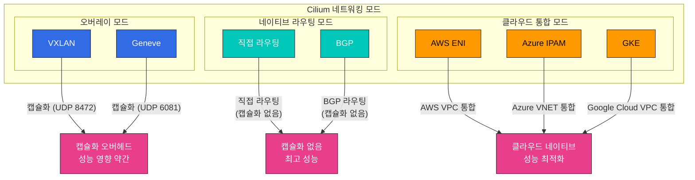
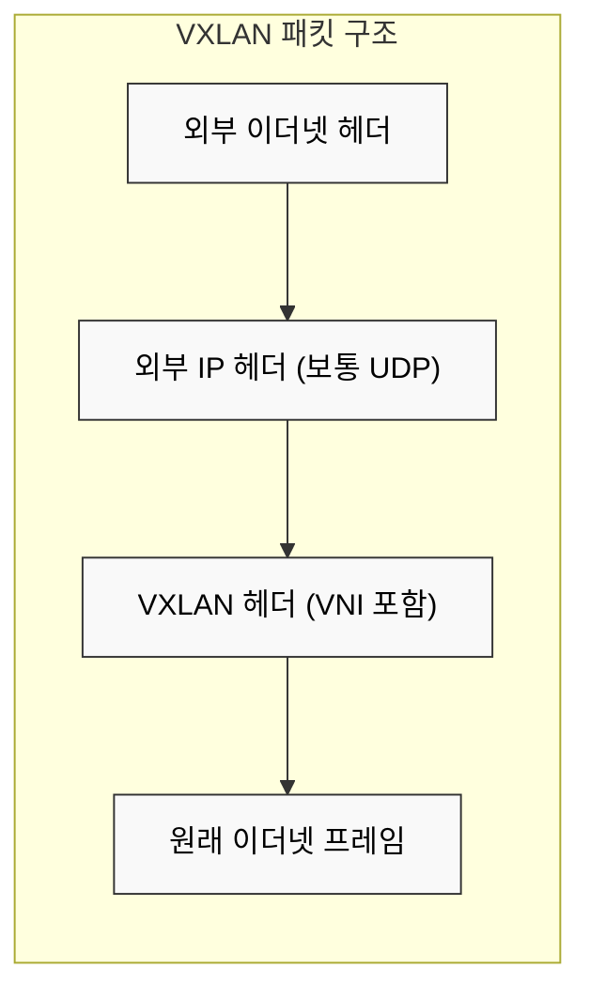
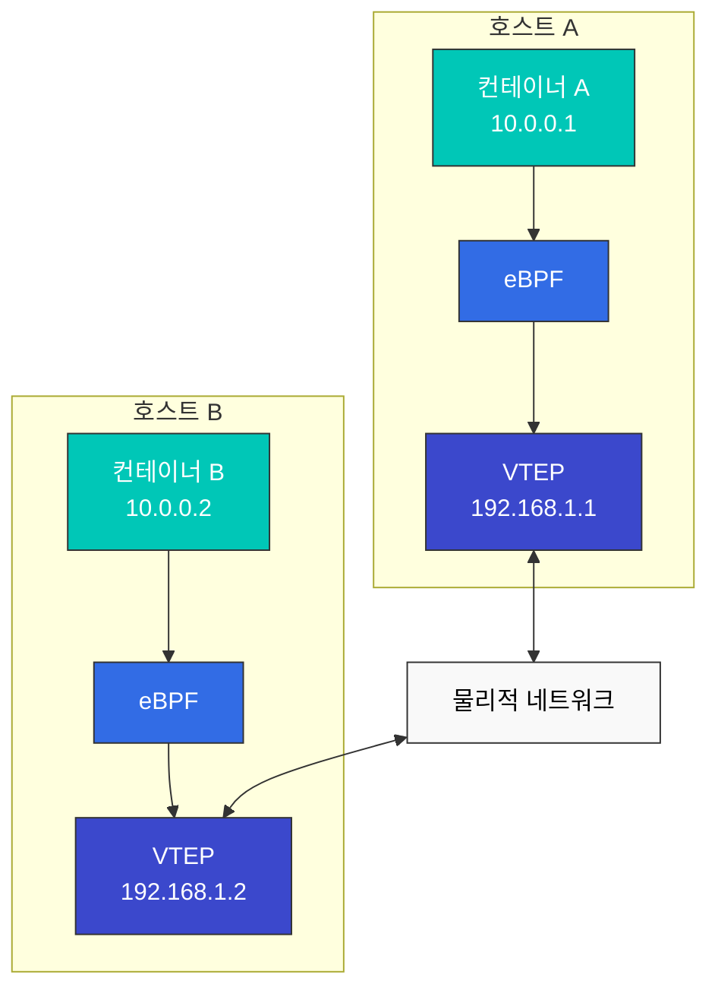

# 네트워킹 모델 및 VXLAN

> **지원 버전**: Cilium 1.18  
> **마지막 업데이트**: 2026년 2월 22일

## 실습 환경 설정

이 문서의 예제를 따라하기 위해서는 다음과 같은 도구와 환경이 필요합니다:

### 필수 도구
- kubectl v1.31 이상
- 작동하는 Kubernetes 클러스터 (EKS, minikube, kind 등)
- Cilium CLI
- tcpdump, wireshark (네트워크 패킷 분석용)

### 네트워크 분석 도구 설치

```bash
# tcpdump 설치
sudo apt-get update
sudo apt-get install -y tcpdump

# Cilium 네트워크 패킷 캡처
kubectl exec -n kube-system -it $(kubectl get pods -n kube-system -l k8s-app=cilium -o jsonpath='{.items[0].metadata.name}') -- cilium monitor -v

# VXLAN 트래픽 분석
sudo tcpdump -i any udp port 8472 -vv
```

## 컨테이너 네트워킹 모델 비교

컨테이너 네트워킹 모델은 컨테이너 간 통신 방식을 정의합니다. 각 모델은 성능, 확장성, 보안 및 구현 복잡성 측면에서 장단점이 있습니다.

### 주요 네트워킹 모델:

1. **호스트 네트워크 모델**:
   - 컨테이너가 호스트의 네트워크 네임스페이스를 공유
   - 최고의 성능, 하지만 포트 충돌 가능성
   - 보안 격리 제한적

2. **브리지 네트워크 모델**:
   - 호스트 내 가상 브리지를 통해 컨테이너 연결
   - 단일 호스트 내 컨테이너 간 통신에 효율적
   - 호스트 간 통신에는 추가 메커니즘 필요

3. **오버레이 네트워크 모델**:
   - 물리적 네트워크 위에 가상 네트워크 구축
   - 호스트 간 통신을 위한 캡슐화 사용
   - 유연하지만 약간의 성능 오버헤드 발생

4. **언더레이 네트워크 모델**:
   - 물리적 네트워크 인프라를 직접 활용
   - 최소한의 오버헤드로 최고 성능 제공
   - 물리적 네트워크 구성에 의존

### 네트워킹 모델 비교:

| 모델 | 성능 | 확장성 | 보안 | 구현 복잡성 | 사용 사례 |
|------|------|--------|------|------------|----------|
| 호스트 | 매우 높음 | 낮음 | 낮음 | 낮음 | 고성능 워크로드, 단일 컨테이너 |
| 브리지 | 높음 | 중간 | 중간 | 중간 | 단일 호스트 배포 |
| 오버레이 | 중간 | 높음 | 높음 | 높음 | 멀티 호스트 클러스터 |
| 언더레이 | 높음 | 중간 | 중간 | 매우 높음 | 성능 중심 프로덕션 환경 |

### Cilium 네트워킹 모드



## VXLAN 기술 심층 분석

> **핵심 개념**: VXLAN(Virtual Extensible LAN)은 레이어 2 네트워크를 레이어 3 네트워크 위에 오버레이하는 네트워크 가상화 기술입니다.

VXLAN은 레이어 2 네트워크를 레이어 3 네트워크 위에 오버레이하는 네트워크 가상화 기술입니다. 이는 클라우드 환경에서 네트워크 세그먼트 수를 확장하고 멀티 테넌트 환경을 지원하는 데 널리 사용됩니다.

### VXLAN 기본 개념:

- **VXLAN 세그먼트**: VXLAN Network Identifier(VNI)로 식별되는 논리적 L2 세그먼트
- **VXLAN 터널 엔드포인트(VTEP)**: VXLAN 패킷의 캡슐화 및 캡슐 해제 담당
- **VNI(VXLAN Network Identifier)**: 최대 16,777,216개(2^24)의 고유 네트워크 세그먼트 지원
- **캡슐화**: 원래 L2 프레임을 UDP 패킷으로 캡슐화

### VXLAN 패킷 구조:

```
+-------------------------------+
| 외부 이더넷 헤더              |
+-------------------------------+
| 외부 IP 헤더 (보통 IPv4)      |
+-------------------------------+
| 외부 UDP 헤더 (포트 8472)     |
+-------------------------------+
| VXLAN 헤더 (VNI 포함)         |
+-------------------------------+
| 원래 이더넷 프레임            |
| (내부 이더넷 헤더 + 페이로드) |
+-------------------------------+
```

### Cilium에서 VXLAN 구성 예제

```yaml
apiVersion: v1
kind: ConfigMap
metadata:
  name: cilium-config
  namespace: kube-system
data:
  tunnel: "vxlan"
  enable-ipv4: "true"
  enable-ipv6: "false"
  ipv4-range: "10.0.0.0/16"
  ipv4-service-range: "10.96.0.0/12"
```

이 구성은 Cilium이 VXLAN 터널링을 사용하여 클러스터 내 포드 간 통신을 설정하도록 지시합니다. 각 노드는 VTEP 역할을 하며 포드 트래픽을 VXLAN 패킷으로 캡슐화하여 다른 노드로 전송합니다.



### VXLAN 작동 방식:

1. **캡슐화**: 소스 VTEP이 원래 L2 프레임을 VXLAN 헤더로 캡슐화
2. **전송**: 캡슐화된 패킷이 IP 네트워크를 통해 대상 VTEP으로 전송
3. **캡슐 해제**: 대상 VTEP이 VXLAN 헤더를 제거하고 원래 L2 프레임 추출
4. **전달**: 원래 L2 프레임이 대상 엔드포인트로 전달

### VXLAN vs 다른 오버레이 기술:

| 기술 | 캡슐화 | 최대 네트워크 수 | 포트 | 장점 | 단점 |
|------|--------|-----------------|------|------|------|
| VXLAN | L2 over UDP | 16,777,216 (2^24) | 4789 | 널리 지원, 대규모 확장성 | 오버헤드 (50바이트) |
| GENEVE | 가변 길이 헤더 | 16,777,216 (2^24) | 6081 | 확장 가능한 메타데이터 | 더 새로움, 지원 제한적 |
| GRE | IP over IP | 제한 없음 | IP 프로토콜 47 | 낮은 오버헤드 | 방화벽 통과 문제 |
| NVGRE | L2 over GRE | 16,777,216 (2^24) | IP 프로토콜 47 | Microsoft 환경 통합 | 하드웨어 오프로드 제한 |

## Cilium의 오버레이 네트워킹

Cilium은 기본적으로 VXLAN을 사용하여 오버레이 네트워킹을 구현하지만, Geneve와 같은 다른 캡슐화 프로토콜도 지원합니다. Cilium의 오버레이 네트워킹은 eBPF를 활용하여 최적화된 데이터 경로를 제공합니다.

### Cilium 오버레이 네트워크 아키텍처:



### Cilium 오버레이 네트워킹 작동 방식:

1. **패킷 생성**: 컨테이너 A가 컨테이너 B로 패킷 전송
2. **eBPF 처리**: eBPF 프로그램이 패킷 인터셉트 및 정책 적용
3. **VTEP 식별**: 대상 컨테이너의 VTEP 식별
4. **캡슐화**: 패킷을 VXLAN 헤더로 캡슐화
5. **전송**: 캡슐화된 패킷을 물리적 네트워크를 통해 대상 호스트로 전송
6. **캡슐 해제**: 대상 호스트에서 VXLAN 헤더 제거
7. **eBPF 처리**: 대상 호스트의 eBPF 프로그램이 패킷 처리
8. **전달**: 패킷을 대상 컨테이너로 전달

### Cilium 오버레이 네트워크 최적화:

- **직접 경로**: 가능한 경우 직접 라우팅 사용
- **DSR(Direct Server Return)**: 로드 밸런싱된 응답을 위한 최적화
- **연결 추적 바이패스**: 알려진 연결에 대한 연결 추적 우회
- **XDP 통합**: 초기 패킷 처리를 위한 XDP 활용
- **헤더 푸시/팝 최적화**: 효율적인 헤더 처리

### Cilium 오버레이 네트워크 구성:

```yaml
# cilium-config.yaml
apiVersion: v1
kind: ConfigMap
metadata:
  name: cilium-config
  namespace: kube-system
data:
  # 오버레이 모드 활성화
  tunnel: "vxlan"
  
  # VXLAN 포트 설정 (기본값: 8472)
  tunnel-port: "8472"
  
  # MTU 설정
  mtu: "1450"
  
  # 자동 직접 라우팅
  auto-direct-node-routes: "true"
```

## 성능 최적화 기법

Cilium은 다양한 성능 최적화 기법을 제공하여 네트워크 지연 시간을 최소화하고 처리량을 최대화합니다.

### 네트워크 모드 최적화:

1. **직접 라우팅 모드**:
   - 오버레이 캡슐화 없이 직접 라우팅 사용
   - 캡슐화 오버헤드 제거로 성능 향상
   - 호스트 간 라우팅 가능한 네트워크 필요

2. **하이브리드 모드**:
   - 가능한 경우 직접 라우팅 사용, 그렇지 않으면 오버레이
   - 유연성과 성능의 균형

3. **네이티브 라우팅 모드**:
   - 기존 네트워크 인프라와 통합
   - BGP와 같은 라우팅 프로토콜 활용

### 데이터 경로 최적화:

1. **XDP 활용**:
   - 네트워크 스택 초기 단계에서 패킷 처리
   - 불필요한 패킷 조기 드롭으로 성능 향상

2. **eBPF 맵 최적화**:
   - 효율적인 맵 구조 및 크기 조정
   - LRU(Least Recently Used) 맵으로 메모리 사용 최적화

3. **연결 추적 최적화**:
   - 연결 추적 테이블 크기 조정
   - 알려진 연결에 대한 연결 추적 바이패스

4. **소켓 기반 로드 밸런싱**:
   - 소켓 수준에서 로드 밸런싱 수행
   - 패킷 처리 오버헤드 감소

### 시스템 수준 최적화:

1. **CPU 어피니티**:
   - 네트워크 처리를 특정 CPU 코어에 바인딩
   - 캐시 지역성 향상 및 컨텍스트 전환 감소

2. **NUMA 인식**:
   - NUMA(Non-Uniform Memory Access) 토폴로지 인식
   - 로컬 메모리 액세스 최적화

3. **인터럽트 조정**:
   - 네트워크 인터럽트 처리 최적화
   - 인터럽트 병합 및 분산

4. **대규모 페이지**:
   - 메모리 관리 오버헤드 감소
   - TLB(Translation Lookaside Buffer) 누락 감소

## 라우팅 메커니즘

Cilium은 두 가지 주요 라우팅 메커니즘을 지원합니다: 캡슐화(Encapsulation)와 네이티브 라우팅(Native-Routing).

### 1. 캡슐화(Encapsulation)

캡슐화는 원래 패킷을 다른 패킷 내부에 포함시켜 전송하는 방식입니다. Cilium은 VXLAN, Geneve 등의 캡슐화 프로토콜을 지원합니다.

**작동 방식**:
1. 소스 노드에서 패킷이 생성됩니다.
2. Cilium은 패킷을 캡슐화하여 원래 패킷을 캡슐화 헤더로 감쌉니다.
3. 캡슐화된 패킷은 물리적 네트워크를 통해 대상 노드로 전송됩니다.
4. 대상 노드에서 Cilium은 패킷을 캡슐 해제하여 원래 패킷을 추출합니다.
5. 추출된 패킷은 대상 컨테이너로 전달됩니다.

**장점**:
- 기존 네트워크 인프라와의 호환성
- 네트워크 토폴로지 독립성
- 멀티 클러스터 환경에서 IP 충돌 방지

**단점**:
- 캡슐화 오버헤드로 인한 성능 영향
- MTU 크기 감소
- 추가적인 CPU 사용량

### 2. 네이티브 라우팅(Native-Routing)

네이티브 라우팅은 캡슐화 없이 직접 라우팅을 사용하는 방식입니다. 이 모드에서는 기본 네트워크 인프라가 포드 IP 주소를 라우팅할 수 있어야 합니다.

**작동 방식**:
1. 각 노드는 해당 노드에서 실행 중인 포드의 CIDR 블록을 알립니다.
2. 라우팅 테이블은 각 포드 CIDR 블록을 해당 노드로 라우팅하도록 구성됩니다.
3. 패킷은 캡슐화 없이 직접 대상 노드로 라우팅됩니다.

**장점**:
- 캡슐화 오버헤드 없음
- 향상된 네트워크 성능
- 낮은 CPU 사용량

**단점**:
- 기본 네트워크 인프라에 대한 의존성
- 네트워크 토폴로지 제약
- IP 주소 관리 복잡성

## 클라우드 제공업체별 네트워킹

Cilium은 다양한 클라우드 제공업체의 네트워킹 기능과 통합됩니다.

### 1. AWS ENI(Elastic Network Interface)

AWS ENI 모드에서 Cilium은 AWS의 Elastic Network Interface를 활용하여 포드에 네이티브 VPC IP 주소를 할당합니다.

**주요 특징**:
- 포드에 VPC 네이티브 IP 주소 할당
- 오버레이 네트워크 없이 VPC 네이티브 네트워킹
- AWS 보안 그룹 및 네트워크 정책 통합
- 향상된 네트워크 성능

### 2. Google Cloud 네트워킹

Google Kubernetes Engine(GKE)에서 Cilium은 Google Cloud의 네트워킹 기능과 통합됩니다.

**주요 특징**:
- GCP VPC 네이티브 IP 주소 할당
- GCP 방화벽 규칙 통합
- GKE 네트워킹 최적화

## 실습: Cilium 네트워킹 모드 구성 및 성능 테스트

### 다양한 네트워킹 모드 구성:

```bash
# VXLAN 오버레이 모드 구성
cilium install --config tunnel=vxlan

# Geneve 오버레이 모드 구성
cilium install --config tunnel=geneve

# 직접 라우팅 모드 구성
cilium install --config tunnel=disabled --config auto-direct-node-routes=true

# 하이브리드 모드 구성
cilium install --config tunnel=vxlan --config auto-direct-node-routes=true
```

### 네트워크 성능 테스트:

```bash
# 테스트 포드 배포
kubectl apply -f https://raw.githubusercontent.com/cilium/cilium/master/examples/kubernetes/connectivity-check/connectivity-check.yaml

# 지연 시간 테스트
kubectl exec -it pod/netperf-client -- netperf -H netperf-server -t TCP_RR

# 처리량 테스트
kubectl exec -it pod/netperf-client -- netperf -H netperf-server -t TCP_STREAM

# 연결 설정 속도 테스트
kubectl exec -it pod/netperf-client -- netperf -H netperf-server -t TCP_CRR
```

[메인 페이지로 돌아가기](README.md)

## 퀴즈

이 장에서 배운 내용을 테스트하려면 [주제 퀴즈](../../quizzes/networking/cilium/03-networking-quiz.md)를 풀어보세요.
